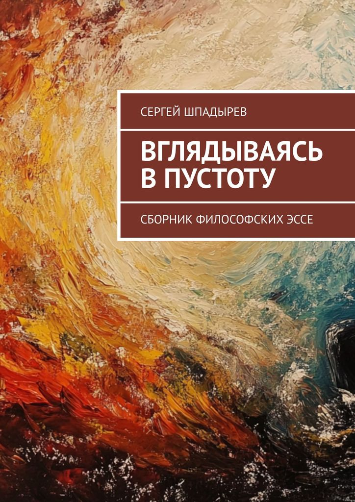

# Книга

Книга "Вглядываясь в пустоту" - это сборник моих лучших эссе и заметок, написанных с 2020 по 2025 годы. Некоторые эссе вошли в него в неизменном виде, некоторые в отредактированном специально для этой книги варианте. В книге рассматривается множество тем: философские учения Древней Греции, Индии, и Китая, христианская теология и европейская философия Нового Времени, философия математики, физики и науки в целом, эпистемология, буддийское учение, вопросы этики и психологии, философия постмодерна.

Книгу можно купить в следующих магазинах:

### Электронная версия

- [Литрес](https://www.litres.ru/book/sergey-shpadyrev/vglyadyvayas-v-pustotu-sbornik-filosofskih-esse-72505846/)
- [Ридеро](https://ridero.ru/books/vglyadyvayas_v_pustotu/)
- [Amazon](https://www.amazon.com/dp/B0FRFZRK7T)
- [Wildberries Digital](https://digital.wildberries.ru/offer/558598)

### Бумажная версия

- [Wildberries](https://www.wildberries.ru/catalog/535326264/detail.aspx)
- [Озон](https://www.ozon.ru/product/2867585042)
