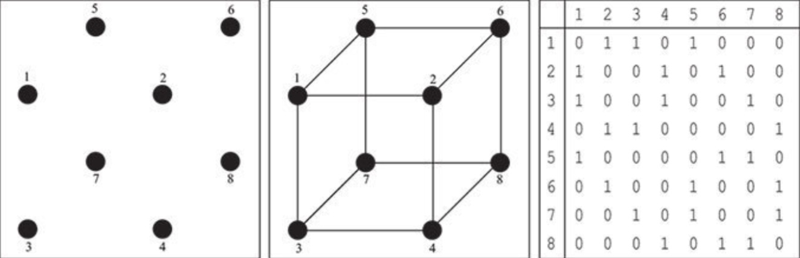
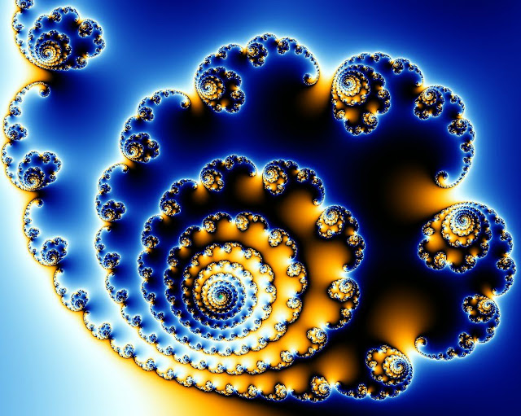

# Почему мы живем не в Матрице, а в матрице?

> Бог — это вечная и бесконечная истина, не имеющая ценности и смысла.
>
> **Барух Бенедикт Спиноза**

Сегодня я хочу рассказать вам о самой смелой и красивой гипотезе в современной теоретической физике. Многие ученые относятся к ней крайне скептически, некоторые называют ее откровенно шизофреническим бредом, а другие находят крайне интересной. Давайте же пустимся в путешествие, которое может навсегда изменить ваше представление о Вселенной.

## В поисках «теории всего»

Начиная с середины 20-ого века самой сложной и перспективной задачей теоретической физики является поиск так называемой «теории всего», которая объединит в себе общую теорию относительности и квантовую механику, тем самым дав точное объяснение всем наблюдаемым физическим явлениям. На роль такой теории претендуют многочисленные теории струн, теория квантовой петлевой гравитации и многие другие. Но мы будем говорить не о них. Мы сделаем шаг еще дальше.

Профессор MIT Макс Тегмарк в своей книге «Наша математическая Вселенная» призывает нас задуматься о самом удивительном свойстве всех существующих физических теорий, которое обычно люди считают само собой разумеющимся — все наши физические теории описываются математикой.

С точки зрения эмпиризма (философия первичности материи по отношению к идее) в этом нет ничего удивительного, человек изобретал язык математики, наблюдая за реальным миром.Мы изобрели цифры и счет, чтобы считать предметы, мы изобрели геометрию, чтобы строить прочные здания. Со временем наши математические инструменты становились все более сложными и отдаленными от повседневных нужд — мы изобретали дифференциалы, интегралы, математический анализ, теорию групп, топологию. Но в конце концов мы всегда находили физические явления, которые поразительно хорошо описывались с помощью этих самых инструментов.

Но давайте взглянем на математичность физических законов с точки зрения идеализма (философия первичности идеи по отношению к материи). Все математические законы живут в пространстве идей и не зависят даже от существования нашей Вселенной. Если даже ничего не существовало бы, дважды два все также равнялось бы четырем. Рождение галактик и звезд, движение планет, химические реакции и генетические мутации строго следовали математическим формулам задолго до появления людей. Мы лишь открыли эти законы, но не изобрели их.

Так что же будет с теорией относительности, квантовой механикой или пресловутой теорией всего, если мы выкинем из них всю словесную шелуху, вроде слов «квант», «пространство», «свет». Там останутся только формулы, и ничего больше. И в этом месте рассуждений Макс Тегмарк задает интереснейший вопрос: что может полностью описываться чистой математикой? И он дает на него единственно разумный ответ. Чистой математикой может быть описана лишь сама чистая математика. Таким образом Тегмарк приходит к самой поразительной из возможных гипотез: вся наша Вселенная — это математическая структура.

## Все из бита

Макс Тегмарк не был первым, кто пришел к такой идее. Задолго до него эту идею выдвигал знаменитый американский физик, научный руководитель Ричарда Фейнмана, Хью Эверетта и Кипа Торна, а также автор терминов «черная дыра» и «кротовая нора» Джон Уилер.

В своей статье «it from bit» Джон Уилер задумывался над тем фактом, что все свойства элементарных частиц вроде массы, заряда, спина, цвета, странности и красоты не имеют никакого собственного смысла, а лишь проявляются при взаимодействиях с другими частицами.

Таким образом, все эти свойства являются по сути битом информации в некоторой математической структуре. Уилер писал:

> Все сущее — каждая частица, каждое силовое поле, даже сам пространственно-временной континуум — получают свою функцию, свой смысл и, в конечном счёте, самое своё существование — даже если в каких-то ситуациях не напрямую — из ответов, извлекаемых нами с помощью физических приборов, на вопросы, предполагающие ответ «да» или «нет», из бинарных альтернатив, из битов. «Всё из бита» символизирует идею, что всякий предмет и событие физического мира имеет в своей основе — в большинстве случаев в весьма глубокой основе — нематериальный источник и объяснение; то, что мы называем реальностью, вырастает в конечном счёте из постановки «да-нет»-вопросов и регистрации ответов на них при помощи аппаратуры.

Чтобы вы лучше поняли, что имел в виду Джон Уилер, я приведу вам в пример картинку из книги Макса Тегмарка о том, как отношения между точками пространства (ребра куба) можно представить в виде матрицы битов:

Сами вершины этого куба, обозначенные индексом от 1 до 8, не несут никакого смысла, а вот матрица отношений между ними (ребер куба) уже обладает некоторыми уникальными свойствами: например, вращательной симметрией. Наша Вселенная, конечно же, устроена на порядки сложнее куба, но в ее основе лежат те же самые принципы. Поняв это, мы можем двигаться дальше.

## Инфляционная модель Вселенной и фракталы

Если мы все-таки живем в математической модели, то в какой?

Давайте посмотрим на нашу Вселенную: она состоит из множества скоплений миллиардов галактик, галактики состоят из миллиардов звезд, у многих звезд есть несколько планет, а у многих планет есть некоторое количество спутников. Более того, согласно гипотезе вечной инфляции, являющейся объяснением и расширением инфляционной модели развития вселенной, в отдаленном от нас пространстве ежесекундно происходят миллионы «больших взрывов», порождающих свои пузыри Вселенных.

Но вернемся к нашему миру: все скопления, галактики, звезды и планеты, в какой бы части Вселенной они не находились, очень похожи между собой, но все же уникальны. Какая математическая структура обладает такими свойствами? Это фрактал.

Фрактал порождается простейшей рекуррентной формулой, но развивается в красивейшую циклическую картину, каждый маленький кусочек которой одновременно и уникален, и похож на общую структуру.

## Асимметрия времени и вычисление рекурсивной функции

И как раз фрактальная структура нашей Вселенной открывает нам глаза на самую главную загадку современной физики — время. Идет ли время только вперед? Линейно ли оно?

Современная физика говорит о существовании так называемой асимметрии времени или стрел времени. Первая стрела времени — психологическая: мы помним прошлое, но не будущее. Эта ассиметрия является частным случаем более общей второй стрелы времени — причинно-следственной. Причины порождают следствия, но не наоборот. С другой стороны это может быть лишь частью нашего восприятия и при обратном ходе времени мы бы приняли причины за следствия, а следствия за причины. Но существуют третья абсолютно объективная асимметрия времени, также называемая вторым законом термодинамики — энтропия в замкнутой системе со временем всегда растет. То есть, при обратном ходе времени она бы падала.

Как это можно объяснить? Одним из первых объяснение, согласующееся с гипотезой математической Вселенной, дал немецкий пионер компьютеростроения и автор первого языка программирования высокого уровня Конрад Цузе. Он предположил, что наша Вселенная является не статичной математической моделью, а постоянно вычисляющийся чистой рекурсивной функцией. На вход такой функции поступает результат вычисления предыдущей итерации. Каждый тик такой функции является планковским временем, а проще говоря мгновением. Такая гипотеза очень хорошо объясняет все стрелы времени. Результат вычисления такой функции зависит от ее входа — будущее зависит от прошлого, но не наоборот. Со временем количество информации в такой системе будет расти, а значит будет расти и энтропия. И главное, эта гипотеза очень хорошо согласуется с фрактальностью нашей Вселенной, ведь фрактал — результат вычисления рекуррентной функции.

Таким образом, мы можем дать определение времени таким образом: время — это процесс вычисления чистой рекурсивной функции расчета развития нашей Вселенной.

Вы можете возразить, что наша Вселенная недетерминирована и при коллапсе волновой функции Шредингера результат выхода кванта из суперпозиции непредсказуем. Но согласно многомировой интерпретации квантовой механики Эверетта в момент коллапса волновой функции наша Вселенная просто разделяется на две параллельных реальности, в одной из которых суперпозиция переходит в одно состояние, а в другой в противоположное.

Также стоит учесть, что это время — не то же самое, что описывается в общей теории относительности Эйнштейна. Это абсолютное время — тики процессора вычисляющего нашу Вселенную.

## Матрица и антропный принцип

Но если вся наша Вселенная — это вычислительная машина, то как определить, что мы живем не в Матрице? С одной стороны это недоказуемо и неопровергаемо. С другой стороны, если мы живем в Матрице и крутимся на компе у какого-то программиста из реальной вселенной, то его вселенная тоже будет подчинятся законам математики и тоже может оказаться Матрицей второго уровня, которая существует в реальном мире. Этот ряд можно продолжать до бесконечности и ни в одном уровне Матрицы не будет возможности доказать, существует или нет реальный мир более высокого уровня.

В любом случае, у Макса Тегмарка есть более красивое объяснение математичности нашей Вселенной. Для начала зададимся вопросом: почему мы живем именно в такой математической структуре, а не в какой-то другой? Тегмарк находит ответ на этот вопрос в антропном принципе: все непротиворечивые математические структуры существуют, но лишь в немногих из них может зародится такая тонко настроенная Вселенная, которая позволяет существовать нейронным сетям, способным осознать причинно-следственные связи.
