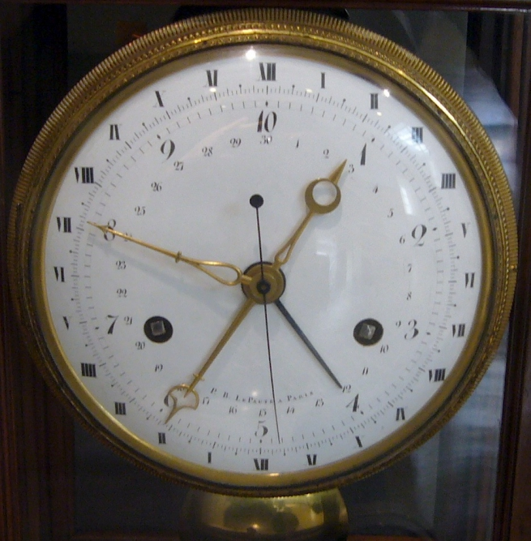

# Как древние шумеры повлияли на значение скорости света, и почему Великая Французская Революция не смогла им помешать

В продолжение статей про рекурсивно вычислимую Вселенную "Все есть бит" и "Кажется, мы близки к пониманию фундаментальной теории физики, и она прекрасна" я хотел бы поговорить про условность нашего понимания пространства и времени.

Из учебников физики нам известно, что скорость света в вакууме равна 299792458 метрам в секунду. Вы никогда не задумывались, почему такая фундаментальная физическая константа как скорость света имеет такое странное значение? Почему она равна приблизительно тремстам миллионам метров в секунду? Почему ни больше и ни меньше? В чем сакральный смысл этого числа?

Никакого сакрального смысла в этом числе, ясное дело, нет. Все дело в том, что мы получаем такое бессмысленное значение скорости света исключительно из-за полной бессмысленности выбранной нами системы мер. Ведь что такое секунда и метр?

## Что такое секунда?

Чтобы понять это, давайте представим себе инопланетянина, изучающего людскую цивилизацию. Он узнает, что для измерения времени мы используем единицы, равные времени полного обращения нашей планеты вокруг собственной оси, деленное на некоторое число. Если мы поделим время полного обращения Земли на двадцать четыре, то получим час. Если час мы поделим на шестьдесят, то получим минуту. А если и минуту мы поделим на шестьдесят, то получим секунду. И при этом именно секунда выбрана в качестве основной единицы в международной системе стандартных единиц. Что за бессмыслица? - подумает инопланетянин.

Ладно, взять астрономические сутки в качестве основы - абсолютно логично. Это естественный для любого живого существа на планете цикл смены дня и ночи. Кроме того, точно отмерить сутки не составляет никакого труда - сутки примерно равны времени, проходящему между двумя рассветами или двумя закатами. Но зачем, черт возьми, мы делим их сначала на двадцать четыре, а потом два раза на шестьдесят? Почему именно на двадцать четыре и на шестьдесят, а не на на десять и двенадцать? Виноваты в этом, как это ни парадоксально, шумеры.

Древние жители Месопотамии использовали для счета пятеричную и двенадцатеричную системы счисления, которые при совместном использовании породили особую шестидесятеричную систему счисления. Именно от них нам в наследство достались триста шестьдесят градусов в окружности, шестьдесят минут в часе и шестьдесят секунд в минуте. Сутки неудобно было делить на шестьдесят частей, поэтому они ограничились лишь двенадцатью. Но в дальнейшем оказалось, что, как бы комично это не звучало, двенадцати часов в сутках маловато для повседневных нужд и они разбили каждый час еще на два.

Еще больше наш инопланетянин-ученый удивился бы, если бы посмотрел в словаре на значение самих слов минута и секунда. Слово "минута" на латыни означает "маленькая", что роднит его со словом "миниатюрная". А слово "секунда" переводится как "вторая" - именно поэтому в английском языке слова second "секунда" и second "второй/вторая" - это одно и то же слово. Но почему вторая? Все дело в том, что изначально минута называлась pars minuta prima, то есть первая маленькая часть часа, а секунда - pars minuta secunda, то есть вторая маленькая часть часа. Со временем pars minuta prima сократилось до minuta, а pars minuta secunda до secunda.

Секунды и минуты - не единственные "случайные" единицы измерения времени. Например, мы с самого раннего детства настолько привыкли разбивать год на месяцы, а последовательность дней на недели, что считаем это само собой разумеющимся и не задумываемся, что в природе не существует вторников и февралей. Среди единиц, которыми мы измеряем время, есть только две относительно естественные астрономические величины. Это сутки и год. Сутки, как я уже говорил, это время оборота нашей планеты вокруг собственной оси, что с поверхности самой планеты мы ощущаем как смену дня и ночи. А год - это время оборота Земли вокруг Солнца, что с поверхности планеты мы ощущаем как смену времен года. Сутки древними людьми измерялись как время между двумя рассветами, а год как количество суток, которое проходит до того, как Солнце опять встает в точно том же самом месте горизонта, что и прежде.

Но для удобства людям нужны были гораздо меньшие, чем год, но большие, чем сутки, единицы времени. На помощь пришла Луна - она делает полный оборот вокруг Земли примерно за двадцать девять с половиной суток. Это время и назвали месяцем - именно поэтому в русском языке слове месяц обозначает как часть года, так и фазу Луны, а в английском слово Month образовано от корня Moon. Но как разбить год на месяцы? В году примерно 365 суток, а в лунном месяце примерно двадцать девять с половиной суток, и триста шестьдесят пять не делится на двадцать девять без остатка. В разных цивилизациях древности к решению этой проблемы подходили по-разному, но в привычных нам юлианском (созданном при Юлие Цезаре) и григорианском (созданном на основе юлианского при папе Григории XIII ) календарях год разделен на двенадцать месяцев. Некоторым из них досталось по тридцать дней, а другим по тридцать одному дню, и для баланса один из них, февраль, недогрузили и сделали равным двадцати восьми дням. Но на этом злоключения февраля не закончились. Так как в году не ровно триста шестьдесят пять суток, а примерно триста шестьдесят пять с четвертью, то за четыре года накапливаются целые лишние сутки расхождения между календарем и реальностью. Волевым решением эти лишние сутки было решено включить в февраль каждого четвертого года, которому до этого при делении недодали несколько дней. Такие календарные годы назвали високосными.

Но и это еще не все. Месяцы оказались тоже слишком длинными, людям нужна была еще меньшая единица измерения последовательного количества суток. На помощь опять пришла Луна. За один лунный месяц Луна видна в четырех разных фазах: от почти невидимого месяца она растет до полной луны, а затем уменьшается обратно, дважды находясь в состоянии, когда видна только левая или правая половина Луны. Если двадцать девять суток в месяце разделить на четыре фазы Луны, то получится, что каждая фаза длится примерно по семь дней. Такой легко измеримый по Луне отрезок времени оказался очень удобен для организации циклически повторяемых работ и ритуалов - уже в Древнем Египте религиозные обряды проводились периодами по семь дней. В Древнем Риме семидневная неделя была перенята от египтян в ходе календарной реформы Гая Юлия Цезаря и введении юлианского календаря, после чего распространилась во все остальные владения Римской Империи. Окончательно же семидневная неделя стала стандартом благодаря распространению христианства и Библии, в Ветхом Завете которой семидневный цикл религиозных ритуалов был закреплен в виде количества дней, затраченных Богом на сотворение мира.

В истории проводилось несколько попыток ввести новый календарь. После победы Великой Французской Революции пришедшие к власти революционеры решили провести дехристианизацию календаря и ввели так называемый французский республиканский календарь. В нем год делился на двенадцать месяцев по тридцать дней в каждом и дополнительные пять или шесть дней предновогодних праздников. Месяц в свою очередь делился не на недели, а на три декады по десять дней каждая. Летоисчисление велось от года победы революции. Просуществовал этот календарь недолго - пришедший к власти в ходе переворота восемнадцатого брюмера (второго месяца осени) восьмого года Наполеон Бонапарт вскоре отменил этот во всех смыслах революционный календарь.

Кроме того, во времена Первой Французской Республики происходили попытки реформировать системы измерения времени в сутках и вводилась система десятичного времени, в которой в сутках было десять часов, в часе десять минут, а в минуте десять секунд. Однако эта система не снискала популярности, так как оказалась крайне неудобной по сравнению с классическими часами - новые величины были слишком большими, чтобы мерять ими промежутки времени, затрачиваемые людьми на какие-то мелкие дела.

## Что такое метр?

Что ж, с секундой разобрались. Теперь сделаем тоже самое и с метром. Это невероятно, но история метра также тесно связана с Великой Французской Революцией. Но сначала давайте перенесемся в средние века и узнаем, чем же тогда измеряли длину. В те времена не существовало стандартных мер длины. Более того, в каждом городе был свой набор особых единиц измерения длины и веса. Кстати, именно потому, что золото и серебро в средневековье служило деньгами и измерялось на вес, почти все современные названия денежных единиц, такие как фунт, шекель, гривна и даже рубль (отрубленная четверть гривны) изначально являлись названиями мер веса, а не ценности.

Но давайте все же вернемся к метру. Как я уже сказал, в средневековье не существовало стандартных единиц измерения расстояния, и в каждой юрисдикции использовались свои собственные изобретения. Но идея универсальной меры (а слово metro на латыни и означает "мера"), зависящей лишь от законов природы, а не от повеления государей, витала в воздухе и лишь политические причины мешали ее появлению. Первое удачное определение метру дал английский священник и философ Джон Уилкинс - он определил метр как длину маятника, полупериод колебаний которого равнялся одной секунде. Таким образом, значение универсальной единицы измерения расстояния оказалось основано на шумерской единице измерения времени.

Конечно, с определением Уилкинса возникли проблемы, так как на разных широтах длина маятника с полупериодом колебаний в одну секунду оказывалась немножечко разной. Поэтому окончательное определение метру было дано академией наук Первой Французской Республики, которая определила метр как одну сорокамиллионную длины Парижского меридиана - это значение примерно равнялось изначальному метру Уилкинса, но задавалось с гораздо большей точностью. Французские ученые измерили расстояние от Дюнкерка до Барселоны - эти два города как раз лежат на Парижском меридиане. Зная разницу географических координат этих городов они рассчитали точное значение метра и выплавили из латуни эталонный образец, чьи копии они разослали по всему миру, а оригинал оставили храниться в парижской палате мер и весов.

## Абсолютные единицы

Таким образом, обе наших основных единицы измерения пространства и времени - секунда и выведенный с ее помощью метр - являются абсолютно случайными величинами, на чьи значения повлияли физические характеристики нашей планеты и система счисления, использовавшаяся древними шумерами. Но существует ли идеальная система измерительных единиц, лишенная подобных недостатков?

Теоретически, существует. Она называется планковскими единицами - в честь предложившего ее использование знаменитого немецкого физика Макса Планка. В основе планковской системы единиц лежат четыре фундаментальных константы физики - скорость света c, постоянная Дирака ℏ, гравитационная постоянная G и постоянная Больцмана k. Значение всех четырех констант принято за единицу. Получается система единиц, в которой:

- Планковская масса является верхним пределом для масс элементарных частиц и нижним пределом для масс черных дыр
- Планковская длина является минимально возможным квантом пространства - хотя дискретность пространства не подтверждена и является лишь гипотезой
- Планковское время является временем, за которое свет преодолевает планковскую длину, то есть тем самым мимолетным "моментом", тиком Вселенского компьютера

И хотя подобная система крайне неудобна для решения уравнений теоретической физики, она дает нам гораздо лучшее понимание истинной природы пространства-времени.

## Послесловие

Мы настолько привыкли к знакомым нам величинам и инструментам, что даже не задумываемся, что используем всего-лишь навсего один из множества возможных и зачастую равнозначных вариантов.

Мы привыкли писать слева направо, но так делают далеко не все - арабский язык и иврит записываются справа налево, а во многих азиатских языках слова из иероглифов во многих случаях пишут сверху вниз. Мы привыкли к ограниченному набору звуков в речи, но, например, в некоторых африканских языках люди используют цокание в качестве одной из согласных, а китайцы используют тональность голоса для изменения значения слов. Сейчас все, в основном, используют десятичную систему счисления, но это не всегда и не у всех было так - шумеры использовали шестидесятеричный счет, а индейцы майя пользовались двадцатеричной системой, римляне пользовались десятичной, но непозиционной системой счисления. И неделя не везде одинакова - в большинстве стран рабочая неделя идет с понедельника по пятницу, но в арабских странах и Израиле рабочая неделя начинается в воскресенье, а заканчивается в четверг. Даже с первым днем недели все не однозначно - у нас первым днем недели считают понедельник, а в Америке, Израиле и арабских странах воскресенье. И даже летоисчисление не везде ведется одинаково - в большей части мира используется григорианский христианский календарь, ведущий счет от Рождества Христова, но например в Израиле официальный рабоче-праздничный календарь - иудейский, в котором точка отсчета соответствует 7 октября 3761 года до н. э по григорианскому календарю, а во многих странах Юго-Восточной Азии используют календарь, ведущий счет лет от рождения Будды.

И хотя мы с детства привыкли считать время секундами, минутами, часами, неделями и месяцами, а расстояние метрами - следует понимать, что все эти величины на самом деле абсолютно условны, а пространство и время не делятся ни на какие искусственно заданные промежутки, и даже сами понятия пространства и времени каким-либо смыслом наделяем только мы сами. Ведь все наши модели познания и измерения мира существуют лишь внутри нашей головы и полностью иллюзорны.
