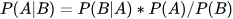
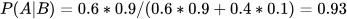
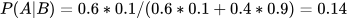

# Почему современная наука основана на вере?

Научный метод, каким мы его знаем, формировался на протяжении тысяч лет в ходе преодоления череды философских кризисов. В этом посте я хочу рассказать про две величайшие проблемы в философии науки и вызовы, стоящие перед ней в настоящем.

## Проблема неполной индукции

Знаменитый древнегреческий философ Аристотель в своем трактате «Аналитика» выделяет два вида возможных умозаключений - индуктивное и дедуктивное.

Дедуктивное умозаключение - это логический вывод о частных случаях исходя из общего правила. Индуктивное умозаключение - это логический вывод об общем правиле исходя из частных случаев.

Классическим примером дедукции, которую сам Аристотель называл силлогизм, является следующее рассуждение: все люди смертны (общее правило), Сократ - человек (частный случай), следовательно Сократ смертен (дедуктивный вывод).

Индукцию Аристотель делил на два вида: полную и неполную. Полная индукция - это вывод общего правила на основе свойств всех элементов множества, а неполная - это предположение об общем правиле на основе части элементов множества.

Пример полной индукции: в пакете три банана, первый банан желтый, второй банан желтый, третий банан желтый, следовательно все бананы в пакете желтые.

Пример неполной индукции: в городе двести магазинов, продающих бананы, в первом магазине бананы желтые, во втором магазине бананы желтые, в третьем магазине бананы тоже желтые, мы делаем предположение, что бананы во всех магазинах желтые.

К сожалению, еще Аристотель заметил, что неполная индукция ненадежна и в отличии от дедукции и полной индукции не может служить источником уверенности в полученном на ее основе знании. Можно обойти сотню магазинов с желтыми бананами и сделать неверный вывод, что все бананы во всех магазинах желтые, так и не дойдя до сто первого магазина, где продаются неспелые зеленые бананы.

Самым известным примером такой ошибки считается открытие черных лебедей. Все лебеди, когда-либо увиденные европейцами, были белыми. Из этого делался вывод, что все лебеди белые. Это считалось верным, пока в конце 17 века в Австралии не были найдены лебеди черного цвета.

Современный научный метод начал формироваться в эпоху Просвещения. Уже тогда философы начали задумываться о проблеме неполной индукции, широко использующейся в естественных науках. Великий шотландский философ Дэвид Юм заметил, что когда ученый проводит эксперимент и на основе результата этого эксперимента делает вывод о принципах работы мира, то этот ученый подсознательно верит в принцип единообразия природы. Например, физик проводя эксперимент на нескольких атомах водорода, и обнаружив у каждого из этих атомов некоторое свойство, предполагает, что все атомы водорода во Вселенной ведут себя также. И хотя такое предположение "логично" с точки зрения прагматизма и здравого смысла, с точки зрения формальной логики оно ни на чем не основано и является аксиомой, в которую ученый просто верит.

Кроме того физик верит, что законы физики в будущем не изменятся, и что в следующем эксперименте результат будет точно таким же как в предыдущих. Эта вера основана лишь на предыдущем опыте, она не следует не из каких законов формальной логики. Из того, что Солнце все предыдущие дни восходило по утрам, никак не следует, что оно опять взойдет завтра утром. Из того, что все атомы во всех экспериментах физиков всегда вели себя одинаково никак не следует, что в следующем эксперименте эти атомы поведут себя так же.

Эту мысль непросто понять, потому что она довольно контринтуитивна. Конечно же в повседневной жизни и в науке мы всегда полагаемся на принцип единообразия природы. Дэвид Юм лишь указывает, что в самом сердце научного метода содержится слепая и ни на чем не основанная вера.

Британский философ Джон Стюарт Милль дополняет мысль Юма. Милль утверждает, что идея однообразного порядка вещей сама по себе является результатом неполной индукции и, следовательно, основой индукции служить не может. Мы считаем, что законы физики неизменны только потому, что все предыдущие эксперименты подтверждали это. Но из этого логически никак не следует, что в будущем это не изменится. Что же делать, если мы не можем быть полностью уверены ни в каком из знаний о нашей Вселенной?

Ответ на этот вопрос дали священник Томас Байес и философ Ричард Прайс. Они утверждали, что мы должны принять принципиальное ограничение нашего метода познания мира и говорить не о верности или неверности теорий, а о вероятности того, что теории верны. Созданная Байесом и дополненная Прайсом работа «An Essay towards solving a Problem in the Doctrine of Chances» легла в основу теории вероятности и породила научный подход, названный байесовским выводом. Этот подход предполагает, что степень нашей уверенности в верности какого-либо утверждения должна меняться в зависимости от получения новых эмпирических данных. Наша уверенность в верности утверждения может расти или падать, стремиться к 1 или падать до 0. Таким образом, мы можем сказать о какой-либо теории только то, что она предположительно верна или точно неверна.

Знаменитая теорема Байеса гласит:

где:

- А - это наша уверенность в истинности некоего утверждения
- B - это экспериментальные данные, влияющие на нашу уверенность
- PA - это априорная вероятность, то есть наше первоначальное предположение об истинности утверждения
- PA|B - это апостериорная вероятность, то есть вероятность истинности утверждения после получения экспериментальных данных.
- PB|A - это вероятность получения таких экспериментальных данных в случае истинности утверждения.
- PB - это вероятность получить такие данные.

Мы можем выбрать любое значение априорной вероятности PA кроме единицы, ведь в этом случае апостериорная вероятность PA|B тоже всегда будет равна единице. Это значит, что при PA=1 никакие экспериментальные данные не изменят наших убеждений. Это вера в абсолютную истину, а не наука. Поэтому любой ученый обязан выбрать априорную вероятность `PA<1`.

Представим, что марсианин прилетел на Землю изучать местные виды животных. Он выдвигает гипотезу, что собаки ненавидят кошек. Он не уверен в своем предположении, но считает его скорее верным, чем неверным. Поэтому он выбирает априорную вероятность истинности своей гипотезы PA=0.6. Если собаки действительно ненавидят кошек - рассуждает марсианин - то при встрече собака почти наверняка налает на кошку - это "почти наверняка" значит, что PB|A=0.9. После этого марсианин заводит собаку и идет с ней гулять. Когда им по пути встречается кошка, то происходит одно из двух вероятных событий: собака или лает на кошку, или не лает. Как после каждого из этих событий изменится уверенность инопланетянина в истинности его гипотезы?

Если собака налает на кошку, то есть сбудется событие, которое следует из гипотезы о ненависти с вероятностью 0.9, то исходя из теоремы Байеса апостериорная вероятность будет равна:

Если же собака не налает на кошку, то есть сбудется событие прямо противоположное с вероятностью 1−0.9=0.1, то апостериорная вероятность будет равна:

Этот пример показывает, как при получении подтверждающих гипотезу фактов вероятность истинности этой гипотезы сильно возрастает, а при получении опровергающих фактов снижается. После серии экспериментов уверенность в истинности гипотезы обычно падает до нуля при экспериментах с PB|A=1, либо стремится к единице, но никогда ее не достигает.

Известный австрийско-британский философ науки Карл Поппер, рассуждая об этом, утверждал, что через опыт мы можем судить о ложности некоего высказывания, но никогда о его истинности. По его мнению наука производит не истины, а теории, лучшие, чем другие. Именно с именем Карла Поппера связана следующая проблема в философии науки.

## Проблема демаркации

С появлением множества различных теорий и учений перед философами науки встал важный вопрос. А что собственно считать наукой? Как через "пространство знаний" провести воображаемую линию демаркации, по одну сторону которой оказались бы научные знания, а по другую остались лженаучные, мистические и религиозные учения? Как отделить астрономию от астрологии, а химию от алхимии? Эти вопросы стали известны как проблема демаркации.

Живший в XIII-XIV веках францисканский монах Ульям Оккам считал, что теория, описывающая и моделирующая явление, исходя из меньшего числа предположений, предпочтительней той, которая описывает это явление, исходя из большего числа различных предположений. Этот принцип, более известный нам в виде латинской максимы "Entia non sunt multiplicanda praeter necessitatem" - "Не следует множить сущности без необходимости", был назван в честь своего создателя бритвой Оккама. Бритва Оккама позволяет выбрать из нескольких объяснений наиболее простое и логичное. Например, объяснение смены дня и ночи по причине вращения планеты вокруг своей оси - гораздо более простая и содержащая меньше сущностей версия, чем древнеегипетская легенда о том, что смена дня и ночи возникает из-за поездки по небу бога солнца Ра в компании других богов на лодках Атет и Сектет.

Кроме того, в версии с наименьшим количеством утверждений также меньше "подвижных частей" - из теории вращения планеты вокруг своей оси невозможно выкинуть ни одного элемента, чтобы теория не потеряла своего смысла. В теории же про поездку бога по небу можно легко заменить бога Ра на Апполона, а лодки на лошадей - смысл теории никак не изменится.

Однако несмотря на огромную пользу этого принципа, бритва Оккама - это всего-лишь навсего удобное эвристическое правило, а не надежный способ провести линию демаркации между наукой и ненаукой. Например, религиозная гипотеза сотворения мира Богом содержит гораздо меньше сущностей и сложностей, чем научная гипотеза Большого Взрыва.

Первый сдвиг в правильном направлении совершили позитивисты. Но чтобы понять кто это такие, нужно сделать небольшой экскурс в историю.

С античных времен была популярна теория древнегреческого философа Платона о том, что идеи - это вневременные и внепространственные объекты, по лекалам которых сделан наш материальный мир (более подробно о платоновской философии идеализма я рассказывал в посте «Как Пифагор, Платон и Будда предвосхитили самую смелую гипотезу современной науки»). А так как идеи познаются разумом, то это значит, что мы можем постигнуть законы нашего мира исключительно силой разума - через размышление. И хотя многие спорили с этой точкой зрения, она оставалась довольно популярной на протяжении всей античности и средних веков.

Господству верховенства разума в естественных науках положила конец книга великого немецкого философа Иммануила Канта «Критика чистого разума». В своем magnum opus Кант отрицал возможность постижения законов природы через одни только рассуждения, и заложил основы позитивизма - учения о том, что единственным источником объективного знания является эмпирический опыт. Кант утверждал, что некоторые утверждения не могут быть ни доказаны, ни опровергнуты непосредственным опытом. Например, не существует такого эксперимента, который бы опроверг или подтвердил существование Бога, а следовательно это вопрос веры, а не науки.

Вдохновленные Кантом позитивисты сформировали научный метод - единый для всех наук набор принципов, следуя которым мы приближаемся к истине. Для решения проблемы демаркации позитивисты предложили использовать концепцию верифицируемости: чтобы теория считалась научной, она должна быть разложена на список простых и недвусмысленных утверждений, каждое из которых возможно подтвердить экспериментальным путем.

Однако, принцип верифицируемости имеет один очевидный недостаток. Если сильно постараться, даже астрологию возможно свести к списку неких утверждений, которые подтвердятся в ходе экспериментов. Например, утверждение, что людей, родившихся под зодиакальным созвездием Овна, в жизни ждет богатство, можно подтвердить существованием богача, родившимся под знаком Овна.

Выход из данной проблемы нашел уже упомянутый британско-австрийский эпистемолог Карл Поппер. Вместо принципа верифицируемости Поппер предложил использовать принцип фальсифицируемости: чтобы теория считалась научной, должен существовать такой гипотетический эксперимент, который опровергнет эту теорию. Фальсифицируемость не делает теорию истинной и даже не гарантирует, что она научна, но несоответствующая критерию Поппера теория точно не является научной.

Следует отметить, что критерий Поппера тоже не идеален - он применим только к естественным наукам. Математика, логика, история и даже сам по себе критерий Поппера не могут соответствовать принципу фальсифицируемости. Не существует такого эксперимента, который бы подтвердил или опроверг истинность того, что дважды два четыре, или того, что сам принцип фальсифицируемости верен. Это аксиомы, основанные на чистой вере в них.

Критикуя критерий Поппера, историк науки Томас Кун писал, что развитие научного знания происходит в виде научных революций, когда одна парадигма понимания мира сменяет другую. Внутри каждой парадигмы ученые используют теории, которые могут даже опровергаться некоторыми экспериментами. Но эти аномалии не делают всю парадигму ненаучной, а лишь дают ученым материал для рывка к следующей парадигме. Так например, результат двухщелевого эксперимента Томаса Юнга, не вписывался в классическую физику XIX века, но он не делал всю физику того времени ненаучной. Исследования этой аномалии дали старт квантовой физике XX века.

Похожего взгляда придерживался ученик Поппера англо-венгерский философ Имре Лакатос. Он считал, что теория сама по себе не может быть научной или ненаучной - этим свойством может обладать только ряд теорий, в котором каждая следующая теория является развитием предыдущей. Так теория относительности не делает ньютоновскую физику менее научной, она лишь определяет границы применимости старой теории.

## Проблема доверия

Несмотря на долгий пройденный путь развития философии науки, количество стоящих перед учеными проблем не уменьшилось. Классический научный метод был применим во времена, когда наукой ученые занимались индивидуально или в небольших группах. А во времена, когда наукой совместно занимаются большие группы людей в разных уголках мира, старый метод оказывается частично бесполезным в свете новых проблем.

Современные ученые жалуются на страшнейший кризис воспроизводимости: проведенный в 2016 году журналом Nature опрос показал, что около 87% химиков, 77% биологов и 69% физиков сталкивались с ситуацией невоспроизводимости опубликованного в журнале чужого эксперимента. Если во времена Фарадея его эксперименты состояли из пары железок и могли быть воспроизведены каждым, то сейчас эксперименты настолько сложны, что требуют многих месяцев подготовки и высокотехнологичного оборудования стоимостью в миллионы долларов. Более того, по опросам Nature 50% ученых хотя бы однажды не смогли воспроизвести свой собственный эксперимент. Часто, не имея ресурса на воспроизведение эксперимента, ученые вынуждены просто верить в истинность его результата.

С самими научными журналами связано несколько других проблем. Во-первых, ученые находятся под постоянным финансовым давлением: чтобы получать гранты на исследования, ученые обязаны публиковать статьи. Из-за этого качество статей заметно падает: если еще в середине-конце XX века научные исследования публиковались как приличные содержательные монографии, то сейчас научные журналы завалены мусорными статьями, написанными для получения гранта. Эта проблема получила название "publish or perish". Во-вторых, ученые публикуют статьи только с успешными результатами экспериментов, неудачные эксперименты никому не интересны, хотя обладают не меньшей научной ценностью.

Если же спуститься на уровень простого обывателя, все становится только хуже. Если большинство утверждений науки XIX - начала XX века возможно было проверить самому, то большинство экспериментов современной физики, биологии и химии требуют такого количества знаний и ресурсов, что обычному человеку невозможно никак их проверить, ему остается только верить в их истинность.

Ситуация ухудшается тем, что наука в XXI веке вместо пути поиска истины превращается в общественный институт, неизбежно коррумпируясь и политизируясь. В XIX-XX веке ученые были более независимы и менее подвержены влиянию общества. Сейчас же, так как проведение экспериментов стоит невероятно дорого, ученые сильно зависят от грантов. Государственные структуры и корпорации, выдающие эти гранты, имеют много рычагов влияния на результаты исследований, и используют авторитет науки в политических и экономических целях, поощряя нужную им точку зрения и наказывая за противоположную. Так исследования, спонсируемые табачными компаниями, не выявляют вреда от курения.

Ученых, чьи исследования интеллекта и влияющих на него факторов расы, пола и этнического происхождения противоречат принятой в западном мире доктрине всеобщего равенства, лишают грантов, увольняют и лишают их возможности публиковаться. В университетах США и стран Западной Европы большое значение приобретает критическая расовая теория, ярые сторонники которой устраивают гонения на исследования белых ученых, обвиняя их в том, что результаты этих исследований подвержены влиянию их расового происхождения, как когда-то в Нацистской Германии устраивались гонения на "еврейскую науку".

Исследования по глобальному потеплению, показывающие ужасные последствия этого процесса, широко одобряются и спонсируются политиками. Противоположные же исследования признаются конспирологией, а проводящие их ученые подвергаются действию "культуры отмены". Подобная цензура и селекция точек зрения рушат репутацию климатологии как науки в глазах простых людей.

Коронакризис, поразивший мир в 2020 году, расколол общество напополам. По результатам недавнего опроса примерно 45% хабровчан являются коронаскептиками, сомневающимися в официальной "научной" точке зрения. Почему так много?

Причина недоверия людей к науке в случае коронакризиса и теории о глобальном потеплении одна и та же: эти исследования политизированы и коррумпированы, вокруг них крутится огромная куча денег, а альтернативная точка зрения подавляется.

Сравним два утверждения: "климат меняется в сторону утепления, вероятно из-за антропогенного фактора" и "климат меняется в сторону утепления из-за антропогенного фактора, а значит мы должны выделить деньги на борьбу с этим явлением, создать специальные комиссии и министерства, а также спонсировать компании, производящие зеленые технологии". Если к первому из них ни у одного нормального человека не будет претензий, то относительно второго у людей появляются сильные сомнения в непредвзятости утверждающего это ученого - возможно, его спонсируют те, кто будет руководить этими комиссиями и министерствами или лоббирует интересы компаний, которым полагаются льготы.

То же самое происходит и в истории с коронакризисом. Люди подсознательно не доверяют политикам и компаниям, пользующимся авторитетом науки для оправдания своих действий. Когда колоссально увеличившие прибыль за прошлый год благодаря локдаунам гигантские корпорации вроде Amazon и Google вводят цензуру на "ковидоскептическую" точку зрения и банят всех несогласных, в том числе известных ученых и Нобелевских лауреатов, когда выделяются безумные бюджеты на борьбу с коронавирусом и создаются многочисленные комиссии по борьбе с эпидемией во главе с пропагандирующими ее опасность политиками, когда под вывеской преодоления экономического упадка в следствие локдаунов печатаются и распределяются триллионы долларов, доверие людей к официальной "науке" рушится. Проблема перестает быть предметом науки, а становится предметом политики и веры, порождая бесконечное количество теорий заговора и всеобщую вражду.

Политизация вопроса хорошо заметна по уже упоминаемой мной статье "Ковид-пандемия: взгляд коронаскептика", в которой автор в не совсем адекватной форме и с примесью бреда, но все же задает некоторые разумные вопросы, получая в ответ лишь поток обвинений и только небольшое количество комментариев по делу, опровергающих тезисы автора. Основная же масса людей с обеих сторон конфликта, включая самого автора поста, просто кидается друг в друга текстом и ссылками, не понимая чужих тезисов и плохо формулируя свои. Это говорит лишь о том, что одна сторона принципиально верит в смертельную опасность коронавируса для человечества и необходимость беспощадной борьбы с ним, а другая сторона принципиально верит в то, что все это создано или использовано политиками и корпорациями ради власти и денег. И никакие тезисы друг друга обе стороны слушать не готовы.

Перед современными философами науки стоит вопрос о том, как искать истину в таких спорных ситуациях...
