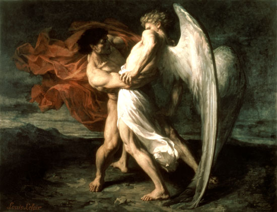

# Как профессор MIT доказал существование Бога с помощью математики

Внезапно прогремевший около 13.8 миллиардов лет назад Большой Взрыв положил начало истории. Через несколько миллиардов лет после этого из облаков слегка остывшего газа сформировались галактики, спустя какое-то время внутри галактик из туманностей образовались звезды, а вокруг звезд появились планеты. На одной из таких планет в воде вблизи горячих сопок подводных вулканов зародилась химическая жизнь. Постепенно эта жизнь усложнялась и эволюционировала - вначале в простейших вирусов и бактерий, а после в птиц и млекопитающих. И в конце концов, мозг одного из видов млекопитающих развился достаточно, чтобы по косвенным уликам воспроизвести весь пройденный им путь к собственному существованию. Но несмотря на все свои достижения это млекопитающее все еще терзается вопросом: что было до Большого Взрыва?

На этот счет мнения расходятся. Многие считают этот вопрос некорректным, так как до Большого Взрыва не существовало самого времени. Некоторые считают нашу Вселенную внутренностями черной дыры, образовавшейся в некой "внешней" Вселенной. А кто-то считает, что все сущее - это симуляция, запущенная на мощном компьютере в "настоящем" мире. Кто знает, может быть действительно весь наш мир - это всего-лишь навсего школьный проект по программированию шестиклассника из развитой цивилизации. Но даже если наш мир находится внутри "сверхвселенной" или "настоящей вселенной" , то почему существует сама это внешняя Вселенная? Что ее породило? Почему вообще существует все сущее?

## Творец

Самым популярным ответом на этот вопрос долгое время считалось существование Бога - создателя нашего мира. Сторонники данной точки зрения рассматривают Большой Взрыв непосредственно как акт Творения.

Логическая цепочка рассуждений, ведущая к доказательству существования Бога, называется космологическим аргументом. Он гласит, что раз в мире неукоснительно действует закон причинно-следственных связей и у всего есть причина, то и у самого мира тоже должна быть причина, и такая первопричина и есть Бог.

Правда, существование Бога порождает логичный вопрос - откуда же в таком случае появился сам Бог? В ответ на это средневековые христианские богословы-схоласты утверждали, что к понятию Бога неприменим вопрос "что было до" и "откуда появился", ведь Бог - это абсолют вне времени и пространства. Поэтому в строго формализованном виде космологический аргумент выглядит так:

- Всякая вещь во вселенной имеет свою причину вне себя (дети имеют причину в родителях, катящийся шар имеет причину в толкнувшем его человеке и т.д.)
- Вселенная как состоящая из вещей, имеющих свою причину вне себя, сама должна иметь свою причину вне себя
- Так как вселенная является материей, существующей во времени и пространстве, то следовательно, причина вселенной должна находиться вне этих категорий
- Следовательно существует нематериальная причина Вселенной, не ограниченная пространством и временем
- Такую первопричину можно назвать словом "Бог"

Учение о вечном и бесконечном Боге, создавшем все сущее, и сам космологический аргумент не были оригинальной идеей христианских богословов, они даже не были созданы самими христианами. Все дело в том, что несмотря на то, что христианство в религиозном аспекте является порождением иудаизма, то в идейном аспекте оно является прямым потомком древнегреческой философии.

## Парменид - бытие и небытие

Древнегреческий философ Парменид не задавался вопросом о том, почему существует всё сущее ("бытие"). Он считал гораздо более интересным вопросом: существует ли небытие? Ход его мысли, извините за каламбур, крутился вокруг самой мысли.

Про бытие Парменид утверждал, что его существование для нас абсолютно самоочевидно, поскольку лишь то, что мы мыслим уже говорит о бытие чего-то - самой мысли. Это утверждение спустя много веков после Парменида известный французский философ Рене Декарт сформулировал наиболее кратко: "Я мыслю, а следовательно я существую".

Про небытие Парменид утверждал, что его не существует, поскольку оно немыслимо. Если вы попробуете представить себе небытие, то скорее всего вы представите себе абсолютную черноту и пустоту. Но чернота - это всего-лишь наше представление об отсутствии света, а пустота - наше представление об отсутствии предметов. Настоящее небытие - это отсутствие вообще чего бы то ни было: пространства, времени, материи, даже самой мысли, полное забвение. Такое невозможно себе представить, а следовательно, по мнению Парменида, небытия не существует. Кроме того философ отмечал, что существование небытия логически противоречиво, ибо сводится к утверждению "Есть то, чего нет".

Из существования бытия и несуществования небытия Парменид делает два вывода: о том, что бытие ничем не порождено, иначе пришлось бы признать, что оно произошло из небытия, которого не существует, и о том, что бытие вечно и неуничтожимо, иначе оно превратилось бы в небытие, которого не существует. Как видно, уже во времена Парменида в греческой философии начинают формироваться взгляды о некоем вечном абсолюте, не имеющем ни начала, ни конца.

Кроме того, из существования бытия и несуществования небытия Парменид дедуктивно выводит картину мира, очень похожую на современные представления о нашей Вселенной, которую философ также называет бытием:

- Бытие одно, и не может быть двух и более бытий, иначе они должны были бы быть отграничены друг от друга небытием, а его не существует
- Бытие сплошное и единое, то есть не имеет частей. Если бытие имело бы части, они были бы отграничены друг от друга небытием, а его не существует
- Бытие неподвижно, однородно, совершенно и ограниченно, имеет форму шара
- У бытия нет ни прошлого, ни будущего, бытие - это чистое настоящее

Неизвестно как именно философ выводит мысль о шарообразной форме бытия, но можно с уверенностью сказать, что он угадал реальную форму нашей Вселенной.

## Пифагор - культ единицы

Незадолго до Парменида в греческой Италии жил другой древнегреческий философ и математик Пифагор, и поныне известный своей знаменитой теоремой о соотношении длин катетов и гипотенузы прямоугольного треугольника. Пифагора восхищало открытое им соотношение высоты издаваемого арфой звука от длины ее струн - после этого открытия Пифагор создал первую в историю математическую теорию музыки. Видя, что и остальные закономерности природы, как и музыка, описываются математикой, Пифагор выдвинул гипотезу, что математика лежит в основе всего сущего, или, другими словами, что "всё есть число". Математическую красоту мироустройства Пифагор по аналогии с музыкой называл великой гармонией Вселенной.

Пифагор обожал числа, особенно его восхищала единица - Пифагор называл её монадой и поклонялся ей, считал её высшим абсолютом, символом единой и неделимой первоосновы всего сущего, божеством. Двойку же Пифагор считал принципом раздвоения всего сущего на противоположности: предельное и беспредельное, четное и нечетное, единое и множественное, правое и левое, мужское и женское, покой и движение, прямое и кривое, свет и тьму, добро и зло.

Такая вера привела Пифагора к созданию собственной религии. Набрав идей в популярной в те времена в Греции монотеистической религии орфизме, он создал пифагорейскую школу - религиозно-математический кружок по интересам. Пифагорейцы поклонялись Единому, а в качестве материального воплощения Единого они выбрали Солнце. Пифагорейцы искали у себя грехи и совершали исповеди. По сведениям античных историков Пифагор наказывал своим ученикам: "Да не коснётся очей твоих сон, смежающий веки, прежде, чем трижды дневные дела разберёшь по порядку: «В чём прегрешил? Что сделал? Что должное я не исполнил?»". Несмотря на математичность пифагорейской школы, у них было множество запретов и суеверий: пифагорейцам запрещалось есть бобы, шагать через перекладину, касаться белых петухов, смотреть в зеркало около огня, ломать хлеб и многое другое. Также они практиковали вегетарианство, так как унаследовали от орфизма учение о переселении душ.

Гипотеза Пифагора о математическом устройстве Вселенной стала очень популярной среди учёных - ей вдохновлялись Ньютон, Кеплер, Эйнштейн. Эта гипотеза подтверждается даже в современных научных исследованиях. Если мы посмотрим на квантовую механику, описывающую наш мир на микроуровне, то увидим, что там твердый материальный мир рассыпается на чистые математические абстракции: гильбертово пространство, комплексные числа, волновые уравнения Шредингера, тензоры и линейные операторы.

## Платон - вечность души

Другой известный древнегреческий философ Платон страшно уважал Пифагора и математику. Над воротами основанной им в Афинах академии он написал вошедшую в историю фразу: "Не геометр да не войдет". Но более всего Платон известен тем, что создал учение об идеях. Строго говоря, это учение начал формировать еще учитель Платона знаменитый афинский философ Сократ, но именно Платон развил его в философию, ныне известную как идеализм. Легче всего понять "идею" Платона можно через следующий пример.

В мире существует множество круглых столов, но ни один из этих столов не имеет совершенно круглую форму. Некоторые из столов имеют небольшие трещины и изъяны, некоторые сделаны добротно, но все же на атомном уровне не являются полностью круглыми. Несмотря на это, у нас в голове существует идея о совершенном геометрическом круге. Именно поэтому мы обычно называем такой круг идеальным. Кроме того, в мире существует великое множество столов разной формы, но у нас в голове существует абстрактная идея о столе, под которую подпадают все существующие в мире столы. Таким образом, обычный круглый стол в материальном мире по мнению Платона имеет прототип в мире идей: идею круглого стола, являющегося сочетанием идеи абстрактного стола и идеи круга.

Лучшими примерами платоновских идей являются математические объекты и отношения. Если мы задумаемся, было ли бы два плюс два равно четырем, если бы никакой Вселенной вовсе и не существовало, то мы придем к выводу, что да, было бы. Ведь это равенство не является чем-то материальным и зависящим от каких-то свойств мироздания - оно существует лишь в мире идей. Более того, мы можем бесконечно сочетать разные идеи и их сочетания, порождая все более и более сложные идеи. Таким образом, Платон приходит к выводу, что мир идей в отличии от материального мира вечный и бесконечный. Кроме того по мнению Платона, мир идей, несмотря на все свое многообразие, является нечтом Единым.

Развивая эту мысль, Платон задается вопросом: если наш разум, или образно говоря, душа, является суммой огромного множества идей, а идеи - это вечные сущности, то получается, что наша душа тоже не рождается и не умирает. Платон считал, что после физической смерти, душа человека возвращается обратно в мир идей и достигает с ним полного единения. Так Платон приходит к учению о бессмертии души и ее посмертному возвращению к Богу, которое позже будет перенято отцами христианской церкви.

## Аристотель - сотворение материального мира

Ученик Платона философ Аристотель, анализируя мысли своего учителя о мире идей, задался вопросом: если прототипами реальных материальных вещей являются идеи, то что же выковало наш материальный мир по лекалам идей, что же вдохнуло в идеи жизнь, материализовав их? Единственным разумным ответом на этот вопрос Аристотель считал сущестование Перводвигателя. Именно Аристотель впервые сформулировал космологический аргумент - если у всего есть причина, то должна существовать самая первая причина, начало всякого действия в мире - Перводвигатель. Таким образом, Аристотель заканчивает формирование образа Бога, который позже переняли христиане - вечного и бесконечного, нематериального Абсолюта и Перводвигателя всего сущего.

## Брахман

В древнеиндийской философской школе существовало схожее с греческим представление об Едином - индийцы называли его словом Брахман. Они верили в то, что весь наш мир во всем его многообразии: каждый листок на дереве, каждый камушек на земле, каждое живое существо, каждый момент времени, являются частичками некоего сверхсущества - Брахмана, а все физические, химические, биологические и исторические процессы во Вселенной являются жизненными процессами этого сверхсущества. Это существо не является личностным Богом, Брахман - это скорее душа мира, индифферентный абсолют, это непосредственно сама реальность. Это существо ниоткуда не появилось, и никуда не исчезнет, оно - само бытие. Утверждали, что Брахману не может быть дано никакое утвердительное определение, его можно определить лишь через отрицание: Брахман бесконечный, Брахман неизменный, Брахман неподвижный. Верящие в Брахмана древние индийцы были первыми пантеистами.

Интересно отметить, что знаменитый физик Эрвин Шрёдингер был ярым поклонником индийской философской школы веданты и написал целый трактат про связь квантовой механики и Брахмана. Но в отличии от Шредингера далеко не все философы древней Индии были согласны с идеей Брахмана, и об одном из них пойдет речь далее.

## Будда - взаимозависимое возникновение

Во времена Пифагора и Парменида на другом конце индоевропейской цивилизации жил великий индийский философ Сиддхартха Гаутама, более известный как Будда Шакьямуни. Центральной идеей его философии стала шуньята - лежащая в основе всего пустота.

Будда утверждал, что абсолютно все вещи (объекты и явления) в мире являются составными, то есть могут быть разложены на две и более части.Взаимодействие этих частей порождает иллюзию существования самой этой вещи, никаких собственных свойств у вещи нет - ее природа "пуста". К примеру, атом водорода состоит из протона и электрона, и все его свойства порождаются взаимодействием этих элементарных частиц. Сам атом водорода - это лишь идея в нашей голове, на самом деле никакого атома нет, есть лишь взаимодействие протона и электрона.

Будда указывал, что при взаимодействии самих составных вещей друг с другом порождаются все более сложные составные вещи, и предела этому нет. Как взаимодействие элементарных частиц порождает атомы, так взаимодействие атомов порождает молекулы, взаимодействие молекул порождает клетки, взаимодействие клеток порождает живые организмы, а взаимодействие живых организмов порождает экосистемы и цивилизации. Философ разумно заметил, что все составные вещи и явления недолговечны, стремятся обратно в пустоту и рано или поздно, но уходят в небытие.

Кроме этого Будда указывал на то, что вещи и явления возникают вокруг пустоты только взаимозависимо и симметрично. К примеру, понятие низкий возникает взаимно с понятием высокий, понятие глупый взаимно с понятием умный, день возникает взаимно с ночью, тепло с холодом, свет с тьмой, прошлое с будущим, причина со следствием, бодрствование со сном, а раб может существовать только при существовании хозяина.

Шуньята тесно связана с математикой - изобретенную в восьмом веке нашей эры цифру "ноль" индийцы назвали санскритским словом "шунья", что значит "пустой". Кроме основного значения нуля как пустоты, то есть отсутствия счетных предметов, этим наименованием подчеркивался сакральный смысл нуля: как по индийским философским представлениям пустота лежит в основе всех вещей, так и ноль лежит в самом основании всей математики. Именно относительно нуля взаимно возникают положительные и отрицательные числа.

Также мы можем найти подтверждение философских воззрений Будды в известной нам физике. Такие силы как гравитация и электромагнетизм возникают между двумя объектами только взаимно - оба объекта притягивают друг друга или отталкиваются друг от друга с одинаковой силой. В случае электромагнетизма также симметрично существуют пары положительно и отрицательно заряженных частиц. И так всё стремится обратно в пустоту, к нулю, то разнозаряженные частицы притягиваются друг к другу, а одинаково заряженные отталкиваются.

Согласно законам квантовой физики, даже в пустоте энергия не может быть постоянно равна нулю. Она постоянно испытывает колебания и равна нулю лишь в среднем. Нулевые колебания поляризованного вакуума постоянно порождают симметричные пары виртуальных частиц и античастиц. При столкновении частицы и античастицы аннигилируют, возвращаясь обратно в пустоту.

Существует гипотеза нулевой энергии Вселенной, которая гласит, что общее количество энергии во Вселенной равно нулю, так как количество положительной энергии в форме материи равно количеству отрицательной энергии в форме гравитации. А согласно теореме Нетёр каждый закон сохранения соответствует некоторой непрерывной симметрии физической системы: так закон сохранения энергии соответствует однородности времени, а закон сохранения импульса соответствует однородности пространства.

Симметрия вообще является одним из основных свойств нашей Вселенной: галактики обладают осевой симметрией, шарообразные звезды и планеты сферически симметричны, большинство живых существ на нашей планете билатерально симметричны, есть даже существа вроде сифонофор, образующих колонии со скользящей симметрией. Более того, симметрия нравится нам подсознательно: большей части человеческого искусства, архитектуры, живописи, скульптуры, фотографии, музыки в том или ином виде свойственна симметрия.

Если мы применим буддийский принцип взаимозависимого возникновения к вопросу бытия и небытия, мы увидим, что небытия просто напросто не может существовать без существования бытия. Они обязаны сосуществовать симметрично. Даже чисто логически как для определения "не А" должно быть определено "А", так и для существования небытия обязательно должно быть существовать бытие. Более того, можно сказать, что платоновский мир идей и наш материальный мир тоже возникли взаимозависимо и симметрично.

## Нагарджуна - реальность и нереальность

Через несколько сотен лет после смерти Сиддхартхи Гаутамы другой буддийский философ Нагарджуна задумался над вопросом: можем ли мы вообще найти различия между идеальным и материальным мирами и сказать, что реально, а что нет?

Возьмем к примеру, уже упомянутый атом водорода. Раз этот атом - лишь иллюзия, порожденная взаимодействием протона и электрона, и существует лишь в нашей голове в виде идеи, то значит он не является частью материального мира, значит он нереален. Но все остальное в нашем мире построено из атомов - молекулы, клетки, организмы, планеты - и является набором слоев абстракций составных идей. Значит, все материальные вещи тоже нереальны. Более того, даже само ядро атома, протон - является составной иллюзией взаимодействия кварков, а крутящийся по орбите вокруг протона электрон можно представить как иллюзию, порожденную взаимодействием описываемых математическими формулами физических сил. То есть части атома точно также иллюзорны и нереальны и существуют лишь в виде идеи в нашей голове.

Даже такое казалось бы фундаментальное свойство нашей Вселенной как время - лишь иллюзия. Мы делим время на прошлое, настоящее и будущее. Прошлое определено относительно настоящего и будущего, будущее определено относительно настоящего и прошлого, а настоящее определено относительно прошлого и будущего. Прошлого уже нет, будущее еще не наступило. Так где же тогда находится настоящее - тот самый миг между прошлым и будущим? Между тем, чего уже нет, и тем, чего еще нет. Это значит, что настоящее и само время - точно также "пусто", как и все остальное.

Конечно, во времена Нагарджуны не слыхивали про кварки, но разобрав подобным образом все известные ему вещи и явления, философ пришел к выводу, что ничего реального и материального вообще не существует, что вся материя - это лишь идеи и впечатления в нашем сознании, а следовательно материальный и идеальный мир - есть одно и то же. Развивая эту мысль, Нагарджуна пришел к мыслям, очень похожим на мысли знаменитого австрийского философа XX века Людвига Витгенштейна о том, что наш язык в принципе не может адекватно описать реальность, а вся наша философия является не рассуждениями о мире, а рассуждениями о наших представлениях о мире. Мысль изреченная есть ложь. Всё реальное — неописуемо, всё описываемое — нереально, и никакой иной реальности кроме мира идей не существует.

## Тегмарк - в поисках Бога

К похожим выводам приходит современный физик и космолог, профессор MIT Макс Тегмарк. В своей книге "Наша Математическая Вселенная" Тегмарк задумывается над проблемой пифагоризма и вопросами, заданными двумя великими физиками: Юджином Вигнером и Стивеном Хокингом. Вигнер удивлялся тому, что математика так непостижимо эффективна в описании физики нашей Вселенной. А Хокинг размышлял, что даже если в будущем мы завершим работу над теорией всего и получим все уравнения, по которым работает наша Вселенная, то перед нами тут же встанут вопросы: "Почему именно эти уравнения?" и "Что вдыхает в них жизнь?".

Тегмарк считает, что ответить на эти вопросы возможно только одним способом. И этот ответ состоит в том, что вся наша Вселенная и есть математика, а точнее лишь одна из возможных математических структур. По утверждению Тегмарка само бытие - это любые непротиворечивые математические структуры, коих существует бесконечное количество, и каждая такая структура - это отдельная Вселенная со своими законами. В каждой такой математической Вселенной взаимодействие ее простейших частей порождает всё более и более сложные подструктуры, некоторые из которых настолько сложны, что могут даже обладать сознанием и созерцать всю божественную красоту этой самой Вселенной.

Получается, что Пифагор, Платон и Нагарджуна были правы. Математика - это действительно основа всего сущего, вечная и бесконечная истина, существующая сама по себе, единственная реальность. Математика - это тот самый всепорождающий Бог, о котором говорили греки, тот самый всеобъемлющий Брахман, о котором говорили индийцы.

Ходит байка, что в XVIII веке при дворе русской императрицы Екатерины II состоялся спор между великим швейцарским математиком Леонардом Эйлером и французским философом Дени Дидро о существовании Бога. На утверждение Дидро, что Бога не существует, Эйлер написал на стене формулу `e^{i\pi }+1=0` и прокомментировал запись: "следовательно Бог существует".

## Послесловие

По преданиям авраамических религий после битвы с Богом, изображенной на заглавной картинке этого поста, Иаков получил новое имя - ישראל - Израиль, или в оригинальном произношении Исраэль. Это слово образовано из двух других слов ישר-אל (Яшар-Эль), что значит "Прямой к Богу", а также оно является омонимом словосочетания איש ראה אל (Иш-Ра-Эль), что значит "мужчина, видящий Бога".
