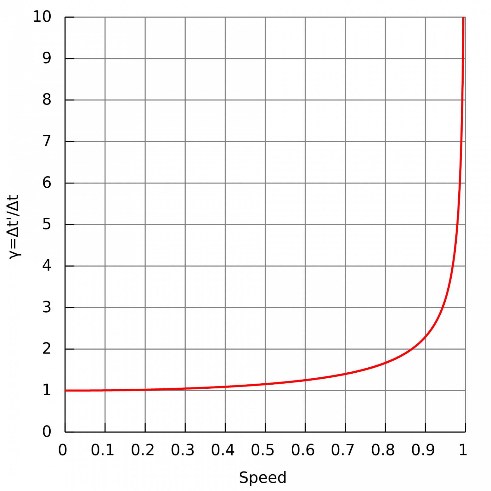
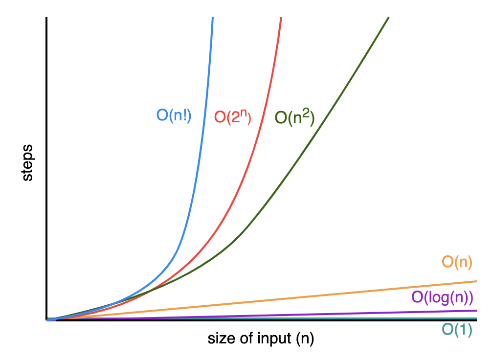

# Почему «теорию всего» следует искать в информатике, и почему следующим Эйнштейном станет программист

В 1962 году американский историк Томас Кун опубликовал книгу под названием "Структура научных революций", ставшую результатом его многолетнего анализа истории развития научного знания. По мнению Куна представления людей о природе развиваются не постепенно, а скачкообразно. После каждого скачка формируется новая парадигма знания, в рамках которой идут все дальнейшие исследования. Постепенно учёные натыкаются на факты и парадоксы, не вписывающиеся в текущую парадигму. Когда таких фактов становится достаточно много, их критическая масса заставляет учёных искать лучшие теории, согласующиеся со всеми необъяснимыми в рамках текущей парадигмы фактами. Когда такие теории появляются, происходит новый скачок - Кун называл такой скачок "сдвигом парадигмы". Самым ярким примером такого сдвига является смена научной картины мира на рубеже XIX-XX веков: несоответствие уравнений Максвелла ньютоновской механике привели к созданию теории относительности, а необъяснимость корпускулярно-волнового дуализма электромагнитного излучения привели к созданию квантовой механики. Теория относительности и квантовая механика сформировали научную парадигму физики XX века, в рамках которой учёные существуют и поныне.

К сожалению, эти два столпа современной физики почти несовместимы друг с другом: ни одна попытка включения теории гравитации и теории относительности как её предельного случая в квантовую механику еще не увенчалась успехом. Физики всего мира бьются над созданием теории всего, которая сведет все четыре фундаментальных взаимодействия и все виды элементарных частиц к единому математическому формализму.

Одним из основных кандидатов на роль "теории всего" являются разные варианты теории струн, в которых все физические процессы описываются как колебания микроскопических одномерных струн. Основная проблема всех струнных теорий, так называемая проблема ландшафта состоит в том, что они описывают математическую модель 22-мерного или 10-мерного пространства, которое компатифицируется в 4-мерное пространство-время нашей Вселенной. Существует огромное количество вариантов такой компатификации и оказывается, что большинство фундаментальных физических констант нашей Вселенной в теории струн являются свободными параметрами. А конкретное значение этих констант в нашей Вселенной объясняется исключительно антропным принципом: физические константы имеют определённые значения не по каким-то фундаментальным причинам, а просто потому, что именно такие значения необходимы для существования разумной жизни на Земле.

Использование теорией струн антропного принципа широко критикуется её противниками: по их словам, это лишает теорию статуса научной. Кроме того, теория струн является исключительно теоретическим построением, и до сих пор не дала ни одного предсказания, проверка которого была бы возможна в ходе эксперимента. Данное несоответствие струнной теории критерию фальсифицируемости Поппера только подтверждает мнение её критиков о её ненаучности.

Другим кандидатом на роль "теории всего" является теория петлевой квантовой гравитации. Эта теория рассматривает пространство-время как дискретное, как состоящее из небольших квантовых ячеек, что с увеличением масштаба создает иллюзию непрерывного континуума. Лучшей аналогией такого явления служит структура воды: вода состоит из дискретных молекул H2O, но на большом масштабе вода кажется нам непрерывной средой. Из этой теории достаточно просто выводится стандартная модель элементарных частиц, но в ней тоже существует большое количество нерешенных проблем.

Некоторые учёные считают, что "теорию всего" удастся создать, если попробовать совместить струнные теории с теорией петлевой гравитации. Но пока что никаких прорывных открытий в этом направлении не произошло. Можно сказать, что современная теоретическая физика находится в затяжном застое. И некоторые учёные видят выход из этого застоя в очень оригинальном подходе - информационно-алгоритмическом. Одним из таких учёных является знаменитый американский математик Стивен Вольфрам.

## Цифровая физика

В своей книге ״A New Kind of Science״, вышедшей в 2002 году, Стивен Вольфрам пишет, что физику стоит рассматривать не как статичную систему, а как динамичную.

По его мнению, на фундаментальном уровне наша Вселенная является чем-то вроде клеточного автомата, развивающегося по чрезвычайно простому рекурсивно применяемому правилу, порождающему однако крайне сложные физические структуры. В пример такого простого правила, порождающего сложные устойчивые структуры, Вольфрам приводит игру "Жизнь". Он считает, что известные нам законы физики - это только модели описания свойств такой структуры. В пользу своей точки зрения он указывает на схожесть многих структур нашей Вселенной с фракталами - сложными геометрическими объектами, получаемыми с помощью рекурсивного применения простого математического правила. Результат своих многолетних исследований в данной области Стивен Вольфрам опубликовал в виде статьи "Кажется, мы близки к пониманию фундаментальной теории физики, и она прекрасна".

Идея Вольфрама далеко не маргинальна. Похожую точку зрения о информационно-алгоритмической природе Вселенной высказывал известный американский физик Джон Уилер - согласно его теории "It from bit" на базовом уровне Вселенная является битами информации, а все физические процессы являются обработкой этой информации. Похожие мысли в форме книги "Программируя Вселенную" высказывает профессор MIT Сет Ллойд. По его мнению, дальнейшего прогресса в понимании физики можно достичь, только рассмотрев энтропию как информационное, а не как термодинамическое явление.

В последнее время все эти теории были объединены в новое направление науки - цифровую физику. Подтверждение идей цифровой физики мы можем найти во многих явлениях квантовой механики и теории относительности.

## Скорость света

Изначально в созданной Эйнштейном теории относительности считалось, что скорость света является ограничением на скорость распространения физических взаимодействий. Но после появления квантовой теории сам же Альберт Эйнштейн нашел возможность сверхсветового распространения взаимодействия: сформулированный им ЭПР-парадокс гласит, что в результате запутывания состояния двух частиц измерение импульса первой частицы изменяет состояние у второй, даже когда частицы находятся сколь угодно далеко друг от друга.

Проведенные в последние десятилетия эксперименты по квантовой телепортации подтвердили предположение Эйнштейна: действительно изменение состояния запутанной частицы распространяется гораздо быстрее скорости света - мгновенно. Правда, эти нелокальные квантовые взаимодействия не подходят в качестве канала связи, ведь через них невозможно передать никакую неслучайную информацию. Таким образом, современные физики уточнили определение скорости света: теперь скорость света - это ограничение на распространение не физических взаимодействий, а на распространение информации.

## Время

Одним из нерешенных фундаментальных вопросов современной физики является объяснение причин однонаправленности времени, или другими словами: почему время течет из прошлого в будущее, но не наоборот? В рамках гипотезы Стивена Вольфрама о рекурсивно-вычислимой Вселенной ответ оказывается элементарным.

В науке об алгоритмах известно, что многие функции являются односторонними: по односторонней функции f из данных x легко получить f(x), но по f(x) узнать x почти невозможно. На базе таких односторонних функций построена широко используемая ассиметричная криптография. Так вот, если предположить, что элементарное правило, применением которого к текущему состоянию Вселенной порождается следующее состояние Вселенной, является односторонней функцией, то становится абсолютно ясным, почему время течёт в одну сторону.

Кроме того, сама суть рекурсивных вычислений предполагает, что следующее состояние данных зависит от текущего, как текущее зависит от предыдущего. Физическое время таким образом в гипотезе рекурсивно-вычислимой Вселенной является эквивалентом самого вычисления, а краткое мгновение настоящего между уже прошедшим прошлым и еще не наступившим будущим - это текущая итерация вычисления.

## Замедление времени

В теории относительности есть еще одно явление, связанное со скоростью света и временем - релятивистское замедление времени: при приближении скорости объекта к скорости света время для движущегося объекта относительно неподвижной точки отсчёта начинает течь медленнее и течёт тем медленнее, чем ближе его скорость к скорости света.

Хорошим объяснением этого явления с точки зрения цифровой физики может являться вычислительная сложность алгоритмов. Возможно, при приближении скорости объекта к скорости света сложность распространения информации о состоянии этого объекта вырастает и при приближении к скорости света стремится к бесконечности.

Если мы посмотрим на график релятивистского замедления времени, то мы увидим, что он очень похож на график `O(2^n)` или `O(n!)`.

## Корпускулярно-волновой дуализм

Явлением, необходимость объяснить которое привела к появлению квантовой механики, является корпускулярно-волновой дуализм - проявление квантами света свойств как волн, так и частиц. Обычно свет ведет себя как волна, и его поведение описывается волновым уравнением Шредингера, но при измерении свет локализуется в одном месте как частица.

Это явление неплохо согласуется с гипотезой вычисляемой Вселенной. Возможно обычно при "вычислении" Вселенной свойства кванта передаются в следующую итерацию в виде функции (волны), и лишь при необходимости рассчитывается точное значение (частица) - этакий аналог ленивых вычислений. Думая об этом, невольно задумываешься о верности гипотезы симуляции: вдруг и правда, наша Вселенная - это чей-то школьный проект по программированию.

## Заключение

Если гипотеза Стивена Вольфрама о рекурсивно-вычислимой Вселенной верна, то будущее физики за нами - программистами, а следующая научная парадигма будет информационно-алгоритмической. Кто знает, может найденная нашими потомками "теория всего" будет записана в виде нескольких файлов на JavaScript?
