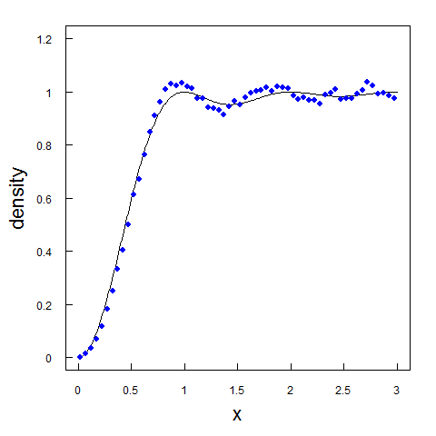

# Буддийский физмат: как гёделевская неполнота и иррациональные числа породили нашу Вселенную

Каждый человек в определенный момент своей жизни начинает задаваться вопросами: "Почему существует Вселенная?", "Что такое время?", "Что было до Большого Взрыва?".

Со мной это произошло несколько лет тому назад. Я стал искать ответы на эти вопросы, пытаясь найти их везде: в научно-популярных книгах по физике, в древнегреческой и древнеиндийской философии, в популярных и эзотерических религиях. В каждом из этих направлений человеческой мысли я не находил окончательной истины, но находил одну из её бесконечных граней.

В конце концов, в моей голове сложилась согласованная картина реальности, основанная на стыке физики, математики и буддийской философии - "буддийский физмат". Именно о нем я и хочу рассказать в этом посте.

## Ум

Мы получаем все сведения о внешнем мире от наших органов чувств. На самом деле, мы даже не можем быть абсолютно уверены в самом существовании внешнего мира, ведь всё, что мы о нём знаем, мы получаем из наших чувств. Цвета, звуки, вкусы, запахи, тактильные ощущения - это всё свойства нашего восприятия, а не самого внешнего мира. Сам внешний мир - это вещь в себе: он невидим, беззвучен, безвкусен.

Наш ум анализирует поток сырых сенсорных данных от органов чувств: он различает разные цвета, звуки, запахи и конструирует из них цельную картину сознания. Именно из-за этих базовых свойств нашего ума: различения базовых частиц восприятия и конструирования из них абстракций, мы видим внешний мир как набор отношений между абстрактными объектами.

В буддийской философии такая базовая частица восприятия называется "дхарма", а современная западная философия обычно называет её "квалиа". А основной принцип работы нашего различающего и конструирующего ума в буддийской философии описывается как пустота и взаимозависимое возникновение: все вещи во Вселенной состоят из частей и не обладают собственными свойствами, их свойства появляются только из-за взаимодействия их частей - сами по себе все вещи "пустые", то есть не обладают самобытием.

## Пустота материи, пространства и времени

Если мы рассмотрим любые предметы, которые мы считаем материальными, с точки зрения буддийской доктрины пустоты, то они окажутся иллюзией и "исчезнут". Виктор Пелевин в своём известном романе "Чапаев и Пустота" рассказывал метафорическую историю про Будду, указывавшего на разные предметы своим мизинцем, после чего эти предметы тотчас исчезали.

Возьмем, к примеру, обычный помидор. Он кажется нам материальным, но ведь если подумать, из чего состоит помидор? Он состоит из биологических клеток. То есть цельный помидор - это иллюзия, порождаемая взаимодействием множества клеток. А каждая клетка - иллюзия, порождаемая взаимодействием химических молекул. Химическая молекула тоже не обладает самобытием - это иллюзия, порождаемая взаимодействием атомов. Атом - это иллюзия, порождаемая взаимодействием элементарных частиц. А сами элементарные частицы тоже не существуют в реальности, ведь частицы по современным научным представлениям - это просто рябь в квантовом поле, квантовая флуктуация. Таким образом получается, что помидор - это иллюзия, которую мы видим в наборе квантовых флуктуаций.

Пуста не только материя, пространство тоже не существует само по себе. Не существует никакой элементарной единицы пространства - базового "метра". Пространство - это иллюзия, которую мы наблюдаем в наборе расстояний между различными предметами.

Пусто даже само время. Мы рассматриваем время как прошлое, будущее и краткий миг настоящего между ними. Но если прошлое уже прошло и уже не существует, а будущее ещё не наступило и ещё не существует, то что такое настоящее? Краткий миг между несуществующим прошлым и несуществующим будущим? В начале прошлого века Альберт Эйнштейн доказал, что мы даже не можем говорить даже об одновременности двух событий - время абсолютно относительно.

Может быть самобытием обладают базовые характеристики частиц - масса и электрический заряд? Тоже нет, электрический заряд и масса сами по себе ничего не значат и даже не проявляют себя без электромагнитного и гравитационного взаимодействия частиц друг с другом.

Получается, что буддийская доктрина пустоты верна - все вещи во Вселенной составные и возникают взаимно при взаимодействии друг с другом. И в мире нет ничего определенного - ни материи, ни пространства, ни времени. Всё относительно и пусто по своей сути. Мы можем рассматривать мир только как взаимоотношения абстрактных объектов.

## Наука о пустоте

Существует целая наука, исследующая взаимоотношения абстрактных объектов. Вы не поверите, но вы даже изучали эту науку в школе. Ведь эта наука - математика.

Вот её определение из Википедии:

> Математика - это наука об отношениях между объектами, о которых ничего не известно, кроме описывающих их некоторых свойств

Математика - это фундамент всего сущего. Известный французский философ Огюст Конт задал известное представление иерархии наук в виде лестницы, в основании которой лежит математика:

> Математика -> Физика -> Химия -> Биология -> Психология -> Социология

Явления, изучаемые каждой из этих наук, могут быть сведены к явлениям, изучаемым наукой, находящейся на предыдущей ступеньке лестницы. Например, живые организмы, изучаемые биологией, основаны на химических реакциях, а сами химические реакции могут быть объяснены законами физики. Но на чём в таком случае основана самая первая ступенька этой лестницы - математика? Что лежит в её основе? Как это ни странно, но в основе математики не лежит ничего. Математика - это вневременной и внепространственный Абсолют. Как мы открываем законы физики с помощью экспериментов, так же мы открываем законы математики с помощью нашего ума.

В разных несвязанных друг с другом цивилизациях, возникавших и исчезавших на протяжении всей истории на планете Земля, люди абсолютно независимо друг от друга приходили к одним и тем же выводам: и у индейцев Майя, и у жителей Древнего Египта, и у аборигенов Полинезии возникали удивительно похожие математические аппараты, во всех из которых дважды два было равно четырем. Это говорит о том, что математика - это не просто инструмент, созданный человеком для описания и познания внешнего мира, а некий фундаментальный закон природы.

Если однажды мы встретимся с представителями внеземных цивилизаций, то можно с уверенностью сказать, что и в их математическом аппарате дважды два будет равно четырем. Конечно, они будут обозначать цифры и операции другими символами, но суть будет та же самая. С помощью математических выражений мы сможем найти и другие сходства с инопланетной наукой: у них ведь будут те же самые, что и у нас, законы физики, химии и частично даже биологии.

Но что, если мы встретимся с существами из вообще другой Вселенной с отличными от наших законами физики? Какие точки соприкосновения с ними мы сможем найти? Очевидно, что единственной общей вещью между нами и иновселянами будет математика. Ведь даже несмотря на отличные от наших законов физики, законы математики в их Вселенной будут такими же как и у нас. Невозможно существование какой-то иной математики. Математика никак не зависит от времени, пространства и любых других свойств той Вселенной, в которой мы существуем. Ведь если подумать, то даже до Большого Взрыва утверждение "дважды два равно четыре" должно было быть верным.

Рассуждая схожим образом, древнегреческий философ Платон пришел к выводу, что математика обладает независимым бытием и существует в неком нематериальном "мире форм". В доказательство своему утверждению Платон приводил правильные многогранники, позже в его честь названные платоновыми телами.

Правильный многогранник - это выпуклый многогранник, грани которого являются одинаковыми правильными многоугольниками, и в каждой вершине которого сходится одинаковое количество рёбер. Платон ссылается на труды своего современника - математика Теэтета, доказавшего, что таких многогранников существует ровно пять: тетраэдр, гексаэдр (куб), октаэдр, додекаэдр и икосаэдр. И даже сам всемогущий Зевс при всём желании не смог бы создать шестой. Таким образом, Платон доказал, что математика - это существующий сам по себе Абсолют.

## Рождение Вселенной

Мы подошли к самой красивой части "буддийского физмата": гипотезе рождения Вселенной. Эта часть содержит достаточно много непростой метафизики, но начинается она с единственного постулата: все вещи существуют симметрично относительно друг друга. Я употребляю слово "существует", а не "возникает", потому что возникновение предполагает некий процесс во времени, а в мире абсолютных форм нет времени, оно появляется позже.

Вначале не существует ничего. Это ничего невообразимо - когда мы пытаемся представить небытие, мы обычно представляем абсолютную тьму и пустоту, но тьма - это наше восприятие отсутствия света, а пустота - это наше восприятие отсутствия вещей, а небытие - это отсутствие даже восприятия.

Но если не существует ничего, то откуда появится хоть что-то? Дело в том, что ничего существовать само по себе не может, ведь все вещи существуют симметрично относительно друг друга. Так и небытие не может существовать без существования бытия. Особенно красиво эта мысль представлена в самом языке - небытие не может существовать без бытие, nothing не может существовать без thing. Ведь без определения бытия не может быть определено небытие.

Но что такое бытие и небытие? Для существования бытия и небытия должна существовать некая сущность, чьё присутствие - это бытие, а её отсутствие - это небытие. Такую абстрактную сущность можно назвать базовой единицей реальности, или просто единицей, а её отсутствие нулём.

Из нуля и единицы в мире абсолютных форм формируется математика, в основе которой лежит аксиоматика Пеано. Кроме того формируются все возможные утверждения о свойствах чисел, в которых единица - это истина, а ноль - это ложь. Математика "хочет" актуализировать все эти утверждения и узнать истинны они (существуют) или ложны (не существуют). Но вдруг она наталкивается на теорему Гёделя о неполноте - оказывается, что некоторые утверждения не доказуемы и не опровергаемы. В ответ на это в математике появляется всё большее число различных математических структур и утверждений.

Одной из таких структур становятся иррациональные и трансцендентные числа, то есть числа не представимые в виде целочисленной дроби или корня уравнения. Количество цифр после запятой у таких чисел бесконечно. Самым известным трансцендентным числом является число π:

> 3,1415926535 8979323846 2643383279 5028841971 6939937510 5820974944 5923078164 0628620899 8628034825 3421170679 8214808651 3282306647 0938446095 5058223172 5359408128 4811174502 8410270193 8521105559 6446229489 5493038196 4428810975 6659334461 2847564823 3786783165 2712019091 4564856692 3460348610 4543266482 1339360726 0249141273 7245870066 0631558817 4881520920 9628292540 9171536436 7892590360 0113305305 4882046652 1384146951 9415116094 3305727036 5759591953 0921861173 8193261179 3105118548 0744623799 6274956735 1885752724 8912279381 8301194912 9833673362 4406566430 8602139494 6395224737 1907021798 6094370277 0539217176 2931767523 8467481846 7669405132 0005681271 4526356082 7785771342 7577896091 7363717872 1468440901 2249534301 4654958537 1050792279 6892589235 4201995611 2129021960 8640344181 5981362977 4771309960 5187072113 4999999837 2978049951 0597317328 1609631859 5024459455 3469083026 4252230825 3344685035 2619311881 7101000313 7838752886 5875332083 8142061717 7669147303 5982534904 2875546873 1159562863 8823537875 9375195778 1857780532 1712268066 1300192787 6611195909 2164201989...

Математическая Вселенная "хочет" актуализировать эту потенциальную бесконечность, то есть вычислить точные значения иррациональных чисел, но это оказывается невозможным. Вычисление происходит по бесконечным рекуррентным формулам. Невозможность полной актуализации потенциальной бесконечности иррациональных чисел порождает бесконечный рекурсивный процесс - время.

Именно благодаря рекурсивным свойствам такого вычисления существует ось времени - время идёт из прошлого в будущее, но не наоборот, и следующее состояние мира зависит от прошлого состояния и конкретной формулы вычисления, которую мы называем законами физики.

Кроме иррациональных и трансцендентных чисел математическая Вселенная пытается вычислить все простые числа, которых тоже бесконечное количество. И как раз простые числа демонстрируют научно доказанную связь с современной квантовой механикой. Точной формулы расчёта простых чисел без полного перебора не существует, но зато существует дзета-функция Римана, описывающая распределение простых чисел среди обычных. Подробное объяснение дзета-функции можно найти в прекрасном хабрапосте "Доступное объяснение гипотезы Римана". Если кратко, дзета-функция показывает, сколько простых чисел существует до какого-то определенного числа - например, что существует двадцать пять простых чисел меньше ста. В начале двадцатого века известный немецкий математик Давид Гильберт и венгерский математик Дьёрдь Пойа нашли связь дзета-функции Римана и квантовой механики - гипотезу Гильберта-Пойа. Звучит она так:

> Нетривиальные нули дзета-функции Римана (их мнимые части) соответствуют собственным значениям некоторого эрмитового оператора (неограниченного самосопряжённого оператора в гильбертовом пространстве).

Оказалось, что квантовый хаос прекрасно описывается распределением нетривиальных нолей функции Римана:

Британский научно-популярный писатель Джон Дербишир задавался вопросом на этот счёт:

> Нетривиальные нули дзета-функции Римана появились при исследовании распределения простых чисел. Собственные значения случайных эрмитовых матриц появились при исследовании поведения систем субатомных частиц, подчиняющихся законам квантовой механики. Скажите, пожалуйста, что вообще может быть общего между простыми числами и поведением субатомных частиц?

Если бы он был знаком с "буддийским физматом", он бы знал ответ! Более того, "буддийский физмат" проливает свет и на то, почему наш мир на микроуровне, изучаемом квантовой механикой, кажется случайным, а на макроуровне абсолютно стабилен. Каждое следующее простое число случайно и невычислимо по точной формуле, но их распределение строго подчинено дзета-функции Римана. А каждая следующая цифра после запятой в иррациональном числе тоже абсолютно случайна: `3,1415926535 8979323846...`, но их общее количество на большом масштабе абсолютно стабильно: например, в первом миллионе цифр после запятой числа Пи 99959 нулей, 99758 единиц, 100026 двоек, 100229 троек, 100230 четвёрок, 100359 пятёрок, 99548 шестёрок, 99800 семёрок, 99985 восьмёрок и 100106 девяток. Получается, простые и иррациональные числа, прямо как наша Вселенная, строго детерминированы математикой, но кажутся случайными на микромасштабах.

## Вывод

Буддийская физика даёт чёткий ответ на извечный философский вопрос: "Есть ли у Вселенной начало и конец?". У Вселенной есть начало и это начало - это ноль. Ноль - это эпицентр Большого Взрыва. А вот конца у Вселенной нет, ведь количество чисел и количество цифр после запятой в иррациональных числах бесконечно.

Надеюсь, однажды наука сможет свести физику к математике - учёные найдут формулы всех констант нашей Вселенной и объяснят законы физики как свойства процесса вычислений.
