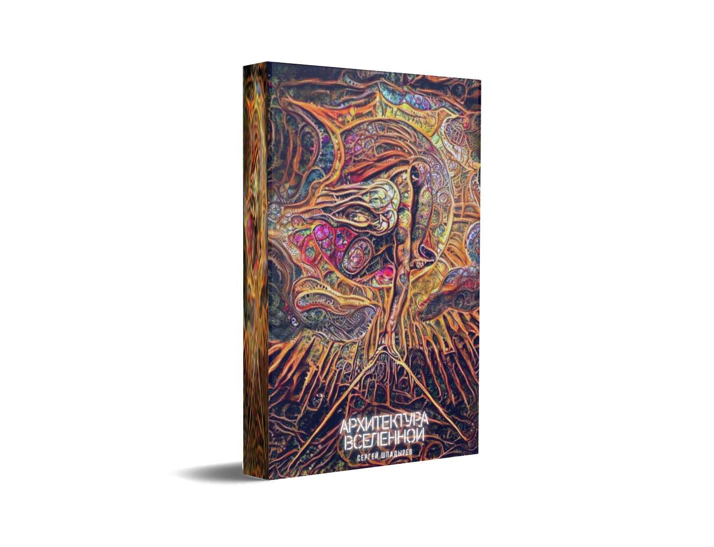
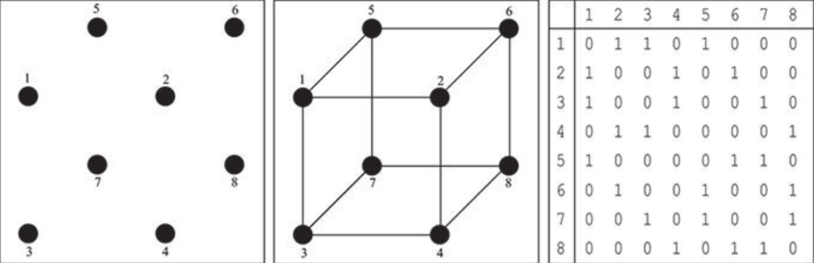

# Архитектура Вселенной, часть 3: Идея



В прошлой части "Архитектуры Вселенной" мы говорили об относительной природе пространства и времени, и лишь немного коснулись темы материи, а сейчас я хотел бы сконцентрироваться на этой теме подробнее.

Слово "материя" имеет тот же корень, что и слово "материал". В русский язык эти слова попали из латыни, где слово "materia" - это существительное, а слово "materialis" - прилагательное. Приблизительно эти слова можно перевести как "вещество" и "вещественный". Однако, если мы попытаемся дать понятию "материя" четкое определение, то натолкнемся на те же самые проблемы, что с сознанием, временем и пространством. Мы можем сказать, что материя - это то вещество, тот материал, из которого состоят все вещи. Но это определение можно выставлять в парижской палате мер и весов, как эталон тавтологии, ведь материя и есть вещество. Так что давайте обойдемся простым "материя - это то, из чего все состоит".

С материей связано множество непростых вопросов:

**Первый вопрос**: появилась ли материя или существовала вечно?

В мире действует закон причин и следствий, гласящий, что у любого явления существует причина. Однако, если мы продолжим цепочку причинно-следственных связей глубоко в прошлое и рассмотрим все возможные варианты её существования, то придем к парадоксу:

- Вариант 1: Существует первопричина всего сущего. Геометрически этот вариант можно изобразить как луч, имеющий начало, но не имеющий конца. В таком случае самая первая причина оказывается беспричинна.
- Вариант 2: Не существует первопричины всего сущего. Геометрически этот вариант можно изобразить как прямую линию, не имеющую ни начала, ни конца. В таком случае цепочка причинно-следственных связей тянется в прошлое бесконечно долго, а следовательно мир существовал всегда. Однако оказывается, что сама по себе эта цепочка тоже не имеет никакой причины.
- Вариант 3: Самое последнее явление является причиной самого первого явления. Геометрически этот вариант можно изобразить как замкнутую в окружность линию, не имеющую ни начала, ни конца, а поэтически её можно назвать "Бог-Творец еще не родился". Однако даже в случае такой зацикленности причинно-следственных связей сам этот цикл все также не имеет причины.
- Вариант 4: Существует самая первая причина и самое последнее следствие. Геометрически этот вариант можно изобразить как отрезок, имеющий и начало, и конец. Однако для нашего рассуждения этот вариант ничем не отличается от первого, так как и в таком случае самая первая причина все так же беспричинна.

Применительно к материи вопрос о причинно-следственных связях сводится к тому, существовала ли материя вечно или что-то породило её. Но если её что-то породило, то что породило то, что породило материю?

**Второй вопрос**: бесконечно ли материя делима или есть некие фундаментальные неделимые "частицы" материи?

Заглядывая все глубже и глубже в структуру материи, ученые все лучше понимают то, как она устроена. Сперва ученые обнаружили, что она состоит из молекул, потом они обнаружили, что молекулы состоят из атомов, после обнаружили, что и атомы (по гречески атом значит "неделимый") делятся и состоят из элементарных частиц - электронов, нейтронов и протонов, а в конце концов дошли до того, что и протоны, как оказалось, тоже состоят из более мелких элементов - кварков. Будет ли этот научный прогресс в погружении вглубь материи вечным? Или может быть однажды найдется фундаментальная и неделимая частица материи?

**Третий вопрос**: почему материя подчиняется законам физики?

Этот вопрос может показаться абсурдным, однако если задуматься, то этот вопрос является ключевым. Какой законодатель вообще "установил" законы физики и почему материя подчиняется им? Что заставляет планеты притягиваться друг к другу? Вы можете сказать, что гравитация. Но тогда я спрошу, кто сказал, что планеты вообще должны подчиняться гравитации. Почему бы например, Марсу завтра не взять и не телепортироваться в окрестности Туманности Андромеды? Или почему бы ему просто не исчезнуть в сию секунду?

На все эти вопросы я попытаюсь ответить по ходу повествования, но начать его я хочу с определения того, что мы вообще понимаем под словом "материя". Для этого нам нужно понять различие между двумя важнейшими философскими системами - идеализмом и материализмом, которые уже на протяжении нескольких тысяч лет ведут между собой непримиримую борьбу за умы людей.

## Корабль Тесея

Согласно легенде, дошедшей до нас благодаря Плутарху, корабль, на котором мифологический герой Тесей вернулся с Крита после победы над Минотавром, использовался афинянами для ежегодного паломничества на остров Делос. Перед каждым плаванием корабль чинили, заменяя часть прогнивших досок на новые. Спустя какое-то время все старые доски корабля были заменены на новые. Среди философов разгорелся спор: тот же этот корабль, на котором плавал Тесей, или уже другой - новый?


А что, если бы старые доски сохранили и сколотили бы из них второй корабль? Какой из этих двух кораблей был бы настоящим и почему?


При любом подходе к этой проблеме вопрос сводится к определению понятия "тот же". Другими словами, мы можем сформулировать этот вопрос следующим образом: "Что такое идентичность?". Если мы ответим на вопрос об идентичности старого и нового кораблей "да", то это означает, что мы считаем, что для вещи её идея, её форма важнее её материала. Если же мы ответим "нет", то это означает, что мы считаем материал, из которого состоит вещь, важнее идеи.

Однако, материализм и идеализм отличаются не тем, что их последователи считают важнее - форму вещи или материал, из которого она сделана. Их различие состоит в том, что считается первичнее. Материалисты считают, что всё на свете состоит из неких элементарных материальных "кирпичиков" или некоего фундаментального вещества, а формы - это всего-лишь описание различных сочетаний этих "кирпичиков". Идеалисты же считают, что все вещи - это и есть абстрактные формы, набор отношений между абстрактными сущностями, а никаких "кирпичиков" не существует.

Чтобы более доходчиво объяснить это различие, я считаю необходимым погрузиться в историю философии. Эта часть может показаться скучной и частично не относящейся к делу, но она крайне важна для понимания основной идеи моей статьи. Лишь после этого занудного исторического экскурса мы окунемся в размышления о физике, математике и науке о вычислениях.

## Материализм Анаксимандра

Философия материализма зародилась в философской школе Милета - древнегреческого полиса в Малой Азии. Основал эту школу философ по имени Фалес, но наиболее известным её представителем считается Анаксимандр.

Анаксимандр одним из первых предположил, что все бесконечное множество существующих в мире вещей и явлений - это разные формы одного и того же вещества. По его мнению, это вещество существует постоянно, не возникает и не исчезает - оно вечно, неразрушимо и не подвержено старению. Анаксимандр считал, что вещество находится в непрерывном движении, и это движение разделяет его на симметричные противоположности: горячее и холодное, влажное и сухое, светлое и темное. Эти противоположности, вступая во взаимодействие друг с другом, образуют все известные нам явления.

Кроме того, философ выдвинул идею о паритете порождаемых веществом противоположностей и их единстве в нём самом. Влажное может высохнуть, а сухое намокнуть - этим примером, философ показывал, что несмотря на кажущуюся различность и даже противоположность этих состояний, они находятся на одной и той же "шкале координат" и имеют единую природу. Таким образом, Анаксимандра по праву можно считать автором важнейшей философской идеи - об единстве и борьбе противоположностей. Из этого утверждения философ вывел своеобразный закон сохранения материи:

> Из тех же вещей, из которых рождаются все сущие вещи, в эти же самые вещи они разрушаются согласно предназначению

Анаксимандр считал, что взаимодействие бесчисленного множества различных противоположных друг другу явлений порождает шарообразный космос, который подобен живому существу. По мнению философа, мир рождается, достигает зрелости, стареет и погибает, чтобы возродиться вновь:

> ...совершается гибель миров, а намного раньше их рождение, причем испокон бесконечного веку повторяется по кругу всё одно и то же...

От Анаксимандра мысль о сферичности мира унаследовали многие другие античные философы. Поэтому я считаю важным остановиться и подробно разобрать эту идею, ведь она еще не раз встретится нам по ходу повествования. Почему же именно шар, а не например куб?

Все дело в том, что идея шара как совершенного прообраза Вселенной прямо вытекает из подмеченного Анаксимандром разделения всего сущего на симметричные противоположности. Если мы попытаемся представить себе состоящую из бесконечного числа равных и симметричных противоположностей Вселенную в виде геометрической фигуры, то мы не сможем вообразить её никак иначе, кроме как в виде сферы. Ведь шар - это единственная трехмерная фигура, на сферической поверхности которой существует бесконечное количество равноудаленных от его центра точек, и для каждой из этих точек на поверхности существует противоположная точка, симметричная ей относительно центра шара.

Но несмотря на общую материалистическую направленность философии Анаксимандра, именно он первым из греческих философов предположил, что все явления в природе подчиняются неким законам, подобным законам человеческого государства. Именно эта мысль является семенем, из которого в последствии выросло дерево идеализма. Кстати, о семенах...

## Материализм Анаксагора

Древнегреческий философ Анаксагор развил материалистические идеи Анаксимандра, но одновременно с этим стал предтечей философии идеализма.

Анаксагор считал, что в веществе уже находятся семена, из которых состоят все вещи. Эти семена ниоткуда не появляются и никуда не исчезают, а существуют вечно. И со временем их не становится ни больше, ни меньше. Анаксагор считал, что все вещи в нашем мире не возникают и не уничтожаются, а появляются в результате соединения этих семян и исчезают при их разъединении. Он писал:

> О возникновении и уничтожении у эллинов нет правильного мнения: ведь никакая вещь не возникает и не уничтожается, но соединяется из существующих вещей и разделяется. И таким образом, правильнее было бы назвать возникновение соединением, а уничтожение разделением

По мнению философа, семена вещества обладают свойством самоподобия: каждая часть семени по своим свойствам подобна целому, а сами семена подобны тем вещам, которые получаются из их соединения. Анаксагор писал, что любое маковое зёрнышко содержит в себе столько же семян вещества, сколько и весь космос. И оно кажется малым только при сравнении с большим, а если же на него взглянуть изолированно от окружающего мира, то оно уже не будет казаться маленьким.

Из относительности большого и малого Анаксагор вывел принцип безграничной делимости вещества:

> У малого нет наименьшего, но всегда ещё меньшее...

Хотя учение Анаксагора являлось логическим продолжением материалистической философии Анаксимандра и предшествовало материалистической философии Демокрита, одна деталь в нем выбивалась из общей картины. Философ задался вопросом: что именно приводит эти семена к соединению и разъединению, что именно порождает непрерывный процесс появления и исчезновения вещей и явлений, что именно служит той волей, той силой, запускающей это движение, что именно устанавливает тот закон, которому подчиняется материя?

Анаксагор пришел к выводу, что семена вещества изначально были неподвижны и беспорядочны, пока не были упорядочены и приведены в круговращательное движение мировым умом, космическим разумом, который философ называл словом "Нус". Другими словами, с точки зрения Анаксагора, материя существовала всегда, но форму ей придал именно мировой ум. И эта форма - это мысль этого мирового разума. Таким образом, Анаксагор, несмотря на общую материалистичность своей философии, заложил фундамент философии идеализма.

## Идеализм Гераклита

В европейском искусстве часто встречается совместное изображение двух философов - Гераклита и Демокрита. Первый из них на картинах традиционно изображается грустным или даже плачущим, а второй веселым и смеющимся. Таким образом делался акцент на пессимистичности философии Гераклита и оптимистичности философии Демокрита.

Гераклит отвечал на вопрос о корабле Тесея отрицательно - корабли не идентичны. С его точки зрения, мы не можем говорить об идентичности двух предметов в разные моменты времени, так как за прошедшее время вещь успевает много раз измениться. В доказательство своих слов Гераклит приводит метафору, ставшую известным афоризмом: "В одну реку дважды не войдешь, и вода уже не та, и человек уже не тот".

Вся его философия была основана на идее о всеобщей изменчивости - он считал, что всё в природе непрерывно движется, и нет ничего постоянного. Как и Анаксимандр, Гераклит считал, что эта изменчивость происходит из внутренней раздвоенности вещей и явлений на две симметричные противоположности. Философ приводил в пример свет и тьму, холод и тепло, голод и сытость, болезнь и здоровье, усталость и бодрость. По его мнению, эти противоположности постоянно стремятся перейти друг в друга, из-за чего возникает поток изменчивых вещей и явлений. Гераклит выражал свое учение в одной короткой фразе, также ставшей известным афоризмом: "Всё течет и всё меняется".

Но во всей этой всеобщей изменчивости Гераклит выделял одну постоянную вещь - тот принцип, тот закон бытия, ту формулу, согласно которой происходят эти изменения. Философ называл этот основополагающий закон бытия словом "Логос" и считал его вечным и неизменным. В философии Гераклита окончательно оформляется мысль о существовании нематериального закона, существующего вне времени и пространства и управляющего нашей Вселенной. Поэтому можно сказать, что Гераклит был одним из первых настоящих философов идеалистов.

Учение Гераклита о Логосе впоследствии было позаимствовано христианами и совмещено с иудейским учением о провидении. По мнению богословов только понимая Логос или, как они его называют, Закон Божий и действую согласно ему, можно достичь истинной гармонии с миром. Тот же, кто этот закон не понимает и не соблюдает, будет этим же законом и наказан - его несоблюдение приведет к негативным событиям в жизни человека. Поэтому считается, что Бог как бы разговаривает с человеком событиями в его жизни - позитивными за соблюдение закона и негативными за его несоблюдение. Нарушение человеком Закона Божьего с большой вероятностью негативно повлияет даже на жизнь его детей, ввергнув их в порочный круг нищеты и страданий. В одной из заповедей Моисея говорится:

> Я Господь, Бог твой, Бог ревнитель, наказывающий детей за вину отцов до третьего и четвёртого рода, ненавидящих Меня, и творящий милость до тысячи родов любящим Меня и соблюдающим заповеди Мои.

Слово "Логос", с греческого переводящееся как "слово", присутствует в известной первой строчке Евангелия от Иоанна: "В начале было Слово". Более корректно это предложение с греческого было бы перевести как "В начале был Закон".

## Материализм Демокрита

Другой древнегреческий философ, Демокрит, имел противоположное Гераклиту мнение. С его точки зрения, утверждение "всё течет и всё меняется" является лишь частично верным. На самом деле, по мнению Демокрита, всё течет, но ничто не меняется. Как такое может быть?

Демокрит совместно со своим учителем Левклиппом развил материалистическое учение Анаксимандра и Анаксагора. Основной идеей его философии стала идея о том, что всё вещество во Вселенной состоит из крошечных неделимых частей, движущихся в абсолютной пустоте. Неделимую часть вещества Демокрит назвал "атом", что по-гречески и значит "неделимый". Эти атомы не возникают и не исчезают - они вечны и неуничтожимы. Можно сказать, что учение Демокрита об атомах является логическим продолжением учения Анаксагора о семенах вещества.

Сталкиваясь в пустоте, атомы либо разлетаются, либо сцепляются и складываются в различные комбинации и формы, образуя великое многообразие вещей и явлений. Хоть внешние формы вещей и меняются, лежащее в их основе вещество не изменяется. Всё течет, но ничто не меняется. Это утверждение также напоминает учение Анаксагора.

Однако в отличие от своего предшественника Демокрит утверждал, что только атомы обладают истинным бытием, а формы их сочетаний абстрактны и не существуют в том же смысле, что и атомы. Кроме того, философ считал реально существующими пространство, в котором находятся атомы, и время, в котором они движутся. Таким образом, Демокрит сформировал материалистическую картину мира, основанную на абсолютизации материальных тел, времени и пространства.

На вопрос об идентичности нового корабля Тесея старому ответ Демокрита был отрицательным - ведь материал, из которого состоит корабль, уже не тот. А вот второй, построенный из старых досок корабль философ считал идентичным старому, так как он состоит из того же самого материала, что и оригинальный корабль.

## Идеализм Пифагора

Хотя Анаксагор и Гераклит внесли значительный вклад в формирование философии идеализма, по-настоящему ярко эта философия была выражена великим древнегреческим философом и математиком Пифагором.

Влияние Пифагора на философию и математику трудно переоценить. Как минимум, именно он ввел в оборот сами слова "философ" и "математик". Слово "философ" состоит из двух греческих корней "фил" - любовь, и "соф" - мудрость. Называя себя философом, Пифагор подчеркивал, что самое важное для него - это любовь к мудрости. Слово "математик" же происходит от греческого слова "матема" - учение. Математиками называли учеников, слушателей лекций Пифагора.

Основанная Пифагором на юге современной Италии пифагорейская школа была не только математическим и философским кружком по интересам, но и религиозной сектой с запретом на распространение знаний. Доподлинно неизвестно, что именно из математических открытий и философских концепций было создано самим Пифагором, а что было приписано ему его последователями, так как запись учения была запрещена, и оно передавалось лишь устным путем, а до нас оно дошло лишь в пересказе других античных философов.

В основе философии Пифагора лежало утверждение "всё есть число". Он пришел к такому заключению, изучая музыку. Пифагор заметил, что интервал между высотами двух звуков зависит от соотношения длин издающих эти звуки струн. Пифагор был первым, кто провел исследования этой закономерности и свел музыку к строгой формальной математической системе - теории музыкальной гармонии. В античные времена все эллинские музыканты были знакомы с пифагоровым строем.

Поняв, что в основе музыки лежат строгие математические законы, Пифагор решил также рассмотреть и другие природные явления с той же точки зрения. Философ нашел множество подобных закономерностей, после чего задался вопросом: возможно ли такое, что звуковая гармония является лишь выражением всеобщей гармонии Вселенной, которая точно так же, как и музыка, описывается математикой. Подтверждения этой идеи Пифагор и его последователи нашли в астрономии. Они заметили, что все небесные тела движутся согласно строгим математическим законам. На базе этих наблюдений пифагорейцы создали учение о гармонии сфер, или как еще ее называли "мировой музыке" - музыкально-математическом устройстве космоса.

Учение пифагорейцев о гармонии сфер и создание пифагорейцем Филолаем задатков теории о гелиоцентрическом строении мира повлияло на множество известных астрономов последующих веков. Николай Коперник посвятил пифагорейцам свою книгу "О вращении небесных тел", Иоганн Кеплер озаглавил главный труд своей жизни "Гармония мира", закончив его описанием того, как "cогретый тёплым напитком из кубка Пифагора" засыпает под звуки небесной музыки. Исаак Ньютон писал, что видел в пифагорейском учении намеки на открытые им законы тяготения.

Мысль, что в основе всего лежит математика, послужила основанием всей философии пифагорейцев. Пифагор и его последователи поклонялись числам. Число "1" они считали божественным и называли монадой. Геометрически они изображали монаду в виде круга с точкой в центре и придавали ей мистическое значение.


Мистический смысл монады заключался в её центральной точке: геометрически круг - двумерен, составляющая его линия - одномерна, а точка в центре - нульмерна. Эта точка олицетворяет "ничего", из которого возникает Вселенная. По мнению пифагорейцев, не существует никаких ограничений на возникновение всех возможных вещей из ничего, но одновременно с этими вещами также возникают и их противоположности. Раскрывая нульмерную точку на бесконечное количество противоположностей мы получаем окружность - фигуру, на которой лежит бесконечное количество точек, для каждой из которых относительно центра круга имеется противоположная точка. Именно из изучения круга и имеющихся в нем треугольников Пифагор вывел свою известную теорему `a^2 + b^2 = c^2`.

Интересно, что спустя многие века после Пифагора российско-немецкий математик Леонард Эйлер, изучая свойства окружности на плоскости комплексных чисел, обнаружил самую красивую формулу математики, связывающую между собой пять основных констант математики. В его честь эту формулу назвали тождеством Эйлера:


## Идеализм Парменида

Древнегреческий философ Парменид рассуждал о том, почему вообще существует всё сущее. Ведь могло ведь ничего не существовать - ни людей, ни животных, ни деревьев, ни растений, ни воды, ни земли, ни Солнца, вообще ничего. Почему же все это существует? Почему бытие есть, а небытия нет?

В ходе долгих размышлений Парменид пришел к выводу, что небытие невозможно. Ход его рассуждений был связан с мышлением - одна только мысль о существовании полного небытия опровергает саму себя, ведь существует как минимум сама это мысль. И действительно, если вы попробуете представить себе небытие, то скорее всего вы представите себе абсолютную тьму и пустоту. Но тьма - это то, как мы мыслим отсутствие света, а пустота - это наше представление об отсутствии предметов. Настоящее небытие - это отсутствие вообще чего бы то ни было, даже самой мысли. Однако такое полное забвение невозможно помыслить, ведь любая мысль о нем уже опровергает его существование. Мысль же о существовании бытия непротиворечива, более того, она подтверждает саму себя.

Из увиденной связи между мышлением и существованием, Парменид вывел главную мысль своей философии: мышление тождественно бытию. Эта идея напоминает учение Анаксагора о Нусе - мировом уме. Однако, если у Анаксагора мысли мирового ума приводят в движение материю, то из философии Парменида следует, что мысли мирового ума - это и есть материя.

Из утверждений о существовании бытия и несуществовании небытия философ сделал несколько интересных выводов:

- Бытие ничем не порождено, иначе пришлось бы признать, что оно произошло из небытия. А небытие, как доказано, не существует
- Бытие вечно и неуничтожаемо, иначе оно превратилось бы в небытие. А небытие, как доказано, не существует
- Бытие одно - не может быть двух и более бытий, иначе они должны были бы быть отграничены друг от друга небытием. А небытие, как доказано, не существует
- Бытие сплошное и единое, то есть не имеет частей. Если бытие имело бы части, они были бы отграничены друг от друга небытием. А небытие, как доказано, не существует

Основная мысль философии Парменида состоит в том, что субстанция, лежащая в основе нашей Вселенной, должна быть вечной мыслью, ничем не порожденной и никак не уничтожаемой. Это учение развил и довел до логического завершения наш следующий герой.

## Идеализм Платона

Древнегреческий философ Платон был учеником великого Сократа и идейным продолжателем учения Пифагора. В Афинах Платон основал свою знаменитую Академию, в которой ученики изучали философию и науки ещё на протяжении многих сотен лет. Над входом в Академию был написан знаменитый лозунг: "Не геометр, да не войдет".

Из философских трактатов Платона, написанных в форме диалогов, главным героем которых обычно становился учитель Платона Сократ, мы знаем не только об идеях самого Платона. Эти трактаты - единственный источник, из которого мы знаем о самом существовании многих мыслителей и об их учениях. Остается неизвестным, что именно из их учений было точно пересказано Платоном, что было искажено его понимаем их мыслей, а что просто напросто сочинено им самим. Например, образ Сократа из ранних диалогов совершенно не похож на образ Сократа из поздних - исследователи полагают, что ранний Сократ высказывает свои мысли, а поздний говорит уже за самого Платона.

В популярной же культуре неизгладимый след оставил сочиненный Платоном миф об Атлантиде - таинственной островной стране, затонувшей к западу от Геркулесовых столбов. Именно в честь этого мифа западный по отношению к Европе океан получил название Атлантического.

Основным объектом философии Платона была идея, но не какая-то конкретная, а сама "идея". Идея в его представлении - это прообраз вещи. Например, существует множество видов и конструкций столов, и даже два стола одной и той же конструкции чем-то да отличаются друг от друга - сколами или небольшими шероховатостями . Но всех их объединяет кое-что общее - идея стола. Именно благодаря идее стола, его прообразу, мы смотря на вещь понимаем, что это стол.

То же самое касается и фигур. Например, любой нарисованный на бумаге круг не будет совершенно круглым - в какой-то точке у нас дрогнет рука, в какой-то выльется чуть больше, чем нужно чернил. Но все же посмотрев даже на такой несовершенный рисунок, мы скажем, что это круг. Платон объясняет это тем, что любой нарисованный круг похож на свой совершенный прообраз - идею о круге, или другими словами "идеальный круг". Именно поэтому слово "идеальный" часто употребляется как синоним слова "совершенный".

Объединяя разные идеи, мы создаем более сложные образы - реальные и вымышленные. Объединив идеи стола и круга, мы получим идею круглого стола. Объединив образ лошади и образ рога мы получим образ единорога. А объединив образ лошади и образ крыльев мы получим образ пегаса. Сравнивая вещь с набором идей в нашей голове, мы понимаем, что это за вещь. Платон считал, что объединение всех возможных идей, этакая "идея всех идей" - это Бог.

Платон считал, что все существующие в материальном мире предметы имеют свой прообраз в мире идей. Более того, он считает эти прообразы более реальными, чем сами материальные предметы. В трактате "Государство" Платон приводит следующий диалог, известный как миф о пещере:

> - Представь, что люди как бы находятся в подземном жилище наподобие пещеры, где во всю её длину тянется широкий просвет. С малых лет у них на ногах и на шее оковы, так что людям не двинуться с места, и видят они только то, что у них прямо перед глазами, ибо повернуть голову они не могут из-за этих оков. Люди обращены спиной к свету, исходящему от огня, который горит далеко в вышине, а между огнём и узниками проходит верхняя дорога, ограждённая, представь, невысокой стеной вроде той ширмы, за которой фокусники помещают своих помощников, когда поверх ширмы показывают кукол.
>   Представь же себе и то, что за этой стеной другие люди несут различную утварь, держа её так, что она видна поверх стены; проносят они и статуи, и всяческие изображения живых существ, сделанные из камня и дерева. При этом, как водится, одни из несущих разговаривают, другие молчат.
>   Прежде всего разве ты думаешь, что, находясь в таком положении, люди что-нибудь видят, своё ли или чужое, кроме теней, отбрасываемых огнём на расположенную перед ними стену пещеры?
>
> - Как же им видеть что-то иное, раз всю свою жизнь они вынуждены держать голову неподвижно?
> - Если бы узники были в состоянии друг с другом беседовать, разве, думаешь ты, не считали бы они, что дают названия именно тому, что видят?
> - Непременно так.
> - Когда с кого-нибудь из них снимут оковы, заставят его вдруг встать, повернуть шею, пройтись, взглянуть вверх — в сторону света, ему будет мучительно выполнять всё это, он не в силах будет смотреть при ярком сиянии на те вещи, тень от которых он видел раньше. И как ты думаешь, что он скажет, когда ему начнут говорить, что раньше он видел пустяки, а теперь, приблизившись к бытию и обратившись к более подлинному, он мог бы обрести правильный взгляд? Да ещё если станут указывать на ту или иную проходящую перед ним вещь и заставят отвечать на вопрос, что это такое? Не считаешь ли ты, что это крайне его затруднит и он подумает, будто гораздо больше правды в том, что он видел раньше, чем в том, что ему показывают теперь?
> - Конечно, он так подумает.
> - А если заставить его смотреть прямо на самый свет, разве не заболят у него глаза, и не отвернётся он поспешно к тому, что он в силах видеть, считая, что это действительно достовернее тех вещей, которые ему показывают?
> - Да, это так

Своей метафорой Платон хотел показать, что материальные вещи - это лишь тени, отбрасываемые идеями на стены пещеры нашего сознания. И что слепы те, кто думает, будто тени и есть реальность. Платон считал, что так же, как для созерцания материальных вещей мы используем глаза, для созерцания самих идей мы используем наш разум. И наиболее легкими для рассмотрения идеями являются самые чистые из них - математические. И действительно, если мы посмотрим на материальный мир, то мы не увидим в нем чисел и математики как таковых, но через идею математики мы воспринимаем соотношения материальных вещей.

К примеру, "дважды два равно четыре" - это классический пример платонической идеи. На это примере становится очевидно понятным учение Платона о вечности идей. Дважды два всегда было равно четырем и всегда будет, никогда оно не было равно пяти и никогда не будет. Таким образом, "дважды два равно четырем" - это абсолютная и вечная истина, ниоткуда не возникшая и никак не уничтожимая.

Для того, чтобы дважды два было равно четырем, не требуется ничего. Это абсолютный и вечный факт, независимый от чего-бы то ни было ещё, верный сам со себе. Более того, даже всемогущий Бог не смог бы изменить это тождество и сделать дважды два равным пяти. Идеям не нужна никакая причина для существования, они являются причинами сами для себя. В их отношении можно сформулировать только обратный закон - идея существует, если нет причины, по которой она не может существовать.

Из учения о вечности идей Платон выводил учение о бессмертии души, позже позаимствованное у него христианами. Его логику современными словами можно объяснить следующим образом. Наша душа - это всё, что мы знали, помнили и чувствовали за нашу жизнь, то есть, грубо говоря, душа - это набор "дампов" нашего мозга в каждый момент времени нашей жизни. Этот набор дампов, записанный в виде последовательности битов информации, является сам по себе платонической идеей. А значит, душа как идея - вечна и бессмертна. Поэтому с точки зрения Платона корабль Тесея остается тем же самым кораблем даже несмотря на замену досок, так как за ним стоит всё та же идея, у корабля всё та же душа.

Для доказательства абсолютности идей Платон также приводил в пример правильные многогранники, позже в его честь названные платоновыми телами. Правильный многогранник - это выпуклый многогранник, грани которого являются одинаковыми правильными многоугольниками, и в каждой вершине которого сходится одинаковое количество рёбер. Платон ссылался на доказательство математиком Теэтетом того, что таких многогранников существует ровно пять: тетраэдр, гексаэдр (куб), октаэдр, додекаэдр и икосаэдр. Никто и никогда при всём желании не смог бы создать шестой правильный многогранник.


Все последующее развитие европейской философии опиралось на мысли Платона. Британский математик Альфред Уайтхед как-то сказал, что вся история философии есть не что иное, как комментарии к работам Платона.

## Материализм-идеализм Аристотеля

В самом центре фрески Рафаэля Санти "Афинская школа" Платон изображен, идущим рядом со своим самым известным учеником - Аристотелем. Древнегреческий философ Аристотель был основоположником логики и физики, преподавателем афинского гимнасия Ликей и наставником Александра Великого.

Обратите внимание на правые руки Платона и Аристотеля на этой фреске: указательный палец Платона поднят к небу, а ладонь Аристотеля указывает на землю. Этой метафорой Рафаэль показывает, что Платон считал первичным мир идей - Град Небесный, а Аристотель считал первичным материальный мир - Град Земной. Град Небесный и Земной - эти два понятия в отношении идеи и материи были введены в употребление христианскими богословами Климентом Александрийским и Блаженным Августином как раз в отношении философии Платона и Аристотеля.

Аристотель не отрицал существование платонических идей, однако он считал, что материальный мир - это не блеклая тень мира идей, а единственно реальный мир. По мнению Аристотеля, только материя обладает существованием, а идеи - это формы, по которым из материи "слеплены" разные вещи и явления. Логика его рассуждений, позже усовершенствованная христианскими богословами и названная космологическим аргументом, такова:

- Всё существующее безукоризненно подчиняется действию закона причин и следствий. Всякая вещь во вселенной имеет свою причину вне себя. Дети имеют причину в родителях, катящийся шар имеет причину в толкнувшем его человеке.
- Вселенная как состоящая из вещей, имеющих свою причину вне себя, сама должна иметь свою причину вне себя
- Так как Вселенная является материей, существующей во времени и пространстве, то следовательно её причина должна находиться вне этих категорий - быть беспричинной нематериальной сущностью вне времени и пространства.
- Единственное, что обладает такими свойствами - беспричинность, нематериальность, вечность и внепространственность - это платонические идеи, или "формы", как называет их сам Аристотель.
- Причина Вселенной - это Бог, чей ум выступает перводвигателем и по лекалам идей придает материи форму.

Аристотель не хотел признавать вывод своего учителя о том, что материя - это порождение идей, и верил в то, что материя отдельна от идей и существует так же вечно. В его философии Бог, представляющий из себя что-то подобное Нусу из философии Анаксагора, своей мыслью соединяет материю и идеи в единое целое - все физические предметы Аристотель рассматривал как слияние материи и формы. Однако, если утверждение о вечности и беспричинности платонических идей самоочевидно верно, то утверждение Аристотеля о беспричинном и вечном существовании материи кажется мне безосновательным.

При этом у любого действия, в том числе и у создания Богом мира из материи по лекалам идей, по мнению Аристотеля, должна быть цель. Непонятно, из чего именно философ выводит это утверждение, но оно сильно влияет на его решение проблемы корабля Тесея. По мнению Аристотеля, корабль Тесея сохраняет свою идентичность даже после ремонта, потому что служит всё той же цели, что и прежде.

Философия Аристотеля легла в основу учений ранних христианских философов, так называемых греческих отцов Церкви. Поэтому можно смело утверждать, что Аристотель - это первый в европейской истории христианский богослов и теолог.

## Идеализм Плотина

В отличие от Аристотеля древнегреческий философ Плотин не спорил с учением Платона, а принял его и развил, тем самым положив начало философской школе неоплатонизма. Центральным понятием философии неоплатоников стала триада - Единое, Ум и Душа.

- Мировой ум - это та субстанция, которая "мыслит" вечные платонические идеи. Неоплатоники отождествляли его с анаксогоровским Нусом и с гераклитовским Логосом. Это объективная сторона Вселенной.
- Мировая душа - это сознание, которое воспринимает идеи мирового ума, превращая их в чувства, цвета, звуки, запахи, вкусы, ощущения. Именно душа порождает материю. Это субъективная сторона Вселенной.
- Единое - это то, в чем сливаются мировой ум и мировая душа. Непознаваемое, трансцендентное, за пределами идей и сознания. Это совершенное первоначало, находящееся вне всяких представлений, является абсолютным благом.

По мнению Плотина, наш мир - это эманация Единого, его изливание:

> Единое не есть сущее, но родитель его, и это — как бы первое рождение, ибо, будучи совершенным, так как ничего не ищет, ничего не имеет и ни в чём не нуждается, оно как бы перелилось через край и, исполненное собою, создало иное

Философия Плотина легла в основу христианской догматики: единое христианские богословы называют Богом-отцом, мировой ум или Логос называют Богом-сыном, а мировую душу называют Святым Духом.

## Идеализм Будды

Если попросить буддиста кратко сформулировать учение Будды в одном предложении, он ответит: "Всё порождается умом". Однако сам Будда не начинал свое учение с этой мысли - она появилась в ходе развития его философии.

Изначально учение Будды сформировалось вокруг вопроса "Откуда возникают страдания?". Будда учил, что страдания возникают из-за нашей привязанности к непостоянным вещам - людям, имуществу, деньгам, достижениям, и нашим желанием обладать ими. Эти привязанности ввергают нас в постоянные циклы желания и страдания - сначала мы желаем вещь и страдаем от необладания ею, потом мы получаем её и страдаем от того, что она уже не кажется нам такой привлекательной как прежде, потом мы теряем вещь и страдаем от потери. Этот круговорот страданий на санскрите называется словом "сансара" и обычно изображается в виде колеса - все живые существа постоянно находятся в этом круговороте.

Непостоянство вещей и явлений, привязанность к которым порождает страдания, возникает из-за того, что все они без исключения являются составными - то есть, состоящими из нескольких частей. Например, чай состоит из листьев и воды, листья состоят из биологических клеток, клетки состоят из молекул, молекулы из атомов, атомы из протонов и электронов, а протоны из кварков. Из-за всеобщего движения и изменения, эти составные вещи постоянно возникают, собираясь из своих частей, а после исчезают, распадаясь на части. Ничто не может существовать вечно.

При этом если мы присмотримся ко всем вещам - чаю, листьям, клеткам, молекулам, атомам, элементарным частицам, кваркам, то мы увидим, что все они являются не более чем восприятием в нашем уме их составных частей как единого целого. Например, атом - это наше целостное восприятие взаимодействия элементарных частиц, протон - это целостное восприятие взаимодействия кварков, а сами кварки - это целостное восприятие некой группы физических свойств. Поэтому Будда утверждал, что все вещи на самом деле пусты, и пустота - их истинная природа.

Считается, что буддийское учение говорит об реинкарнации душ, которые перерождаются в новых телах и опять попадают в колесо сансары. Однако, это не совсем верно: буддийская философия отрицает существование субстанциональной души и рассматривает человека как такую же составную вещь, как и все остальные явления природы. Подумайте, являетесь ли вы сейчас тем же самым человеком, которым были в возрасте пяти лет? Клетки вашего организма много раз обновились с тех пор, память стерла большую часть детских воспоминаний, ваше мировоззрение и картина мира кардинально изменились. Так что же позволяет вам называть себя все тем же человеком?

Будда считал, что несмотря на изменчивость остается кое-что, что позволяет нам говорить о вещи как об одной и той же - "сантана", что с санскрита переводится как "поток". Именно поток изменений состояний вещи позволяет нам уследить за ней и сформировать её целостный образ у себя в уме. Этот образ создает иллюзию существования материи, пространства и движения - так же как в наборе статичных кадров мы видим целостный фильм. С этой точки зрения отремонтированный корабль Тесея остается все тем же, так как поток изменений его состояния целостен. Но если все вещи в мире непостоянны, есть ли в нем вообще хоть что-то абсолютное?

Будда учил, что неизменна только Дхарма, тот фундаментальный закон Вселенной, согласно которому и происходят все изменения. Понятие Дхармы в философии Будды аналогично понятию Логос в философии Гераклита - так же как и слово "Логос" само слово "Дхарма" имеет множество разных значений, которые тем не менее имеют одну и ту же интуитивно понимаемую суть.

И точно так же, как из Логоса христианские богословы выводят понятие о Божьем провидении, из Дхармы выводится кармический закон. Поступая правильно, то есть в соответствии с Дхармой, человек сажает семена хорошей кармы, которые впоследствии вырастут и дадут плоды в виде позитивных событий в его жизни и благих чувств, а поступая неправильно, нарушая закон Дхармы, человек сеет семена плохой кармы, из которых впоследствии вырастут плоды в виде негативных событий в его жизни и страданий. То есть действие закона кармы порождает обратную связь между действиями человека и событиями в его жизни. Поэтому восточные учения советуют прислушиваться к "вибрациям" Вселенной - через негатив и страдания в жизни человека Вселенная намекает ему измениться, а через позитив подтверждает, что тот идет правильным путем. Но в отличии от христианского учения о провидении в буддизме сама Вселенная обезличена, она не наказывает или поощряет человека как христианский Бог - человек сам сажает семена своей кармы и сам пожинает её плоды.

Однако, набор человеком хорошей кармы, как и плохой, не выводит его из круговорота сансары. Будда учил, что единственный способ выйти из сансары - это отречение от мира и полное бездействие, ни создающее ни положительной, ни отрицательной кармы. Только в этом случае с помощью длительной медитации можно достигнуть внезапного просветления и увидеть мир таковым, каков он есть, тем самым достигнув входа нирваны - абсолютного блага вне всяких представлений. Нирвана в буддийской философии - это то, что Плотин называл Единым.

Философ Нагарджуна развил мысль Будды и пошел в своих рассуждениях ещё дальше. По его мнению, даже само возникновение и исчезновение составных вещей - это порождение ума. А на самом деле нет ни возникновения, ни исчезновения, есть только абсолютный покой - нирвана и сансара полностью тождественны. То о чём говорит Нагарджуна - это то же самое, про что Плотин говорил как про эманацию Единого: абсолютный покой и завершенность изливается во всеобщую изменчивость и непостоянство.

С точки зрения буддийской философии именно ум порождает всё сущее. Ум обладает всего двумя свойствами - различать противоположности и конструировать из них формы, и с помощью только этих двух свойств он порождает всю Вселенную. При этом сам этот ум, субстанция всего сущего, находится в абсолютном покое и завершенности. Корейский дзен-мастер Сун Сан писал об этом так:

> В одном моменте — всё. В моменте бесконечное время и бесконечно пространство. В моменте правильный путь, истина и правильная жизнь. В моменте! В одном этом моменте - всё, и в этом моменте - ничего. Итак, если вы постигните этот момент, вы непосредственно постигните всё. Нет ума - нет Будды, нет Бога, нет ничего! Есть ум - есть Будда, есть Бог, есть все вещи! Постижение этого на своем опыте - это и есть просветление.

## Дзен Дао

По мнению китайских философов всё в нашем мире появляется благодаря взаимодействию различных противоположностей. Графически эта идея изображается в виде смешения двух субстанций - Инь и Ян.


То же, что лежит между этими двумя противоположностями, но в то же время заключает их обе в себе - это Дао, что с китайского переводится как "путь". Понятие Дао в китайской философии соответствует понятию Логос в философии Гераклита, и даже китайские переводы Евангелия от Иоанна начинаются со строчки "В начале было Дао".

Сочетание китайской философии даосизма с философией буддизма породило дзен-буддизм - учение о прямом постижении Дао без опоры на слова. Ведь постижение этой самой находящейся вне всяких категорий субстанции Вселенной невозможно с помощью философии или любого иного вида познания.

Дзен-буддисты вслед за Нагарджуной отказываются от логического постижения мира, а опираются исключительно на интуицию. По их мнению, для понимания мира нужно выйти за пределы логического закона исключения третьего. Тогда все философские споры о противоположностях - идеализме и материализме, детерминизме и свободе воли, сознании и материи решатся сами собой.

- Утверждение "А верно" - неверно
- Утверждение "не А верно" - тоже неверно
- Утверждение "А верно и не А верно" - логически противоречиво
- Верно лишь утверждение "ни то, ни другое"

С точки зрения дзен-буддизма такова природа Вселенной - единая во множественном, множественная в едином, осознаваемая вне логики. Постижение этого и есть дзен.

## Недвойственность адвайта-веданты

В Индии смешение философом Шанкарой буддизма Нагарджуны с классической индийской религией породило философию Адвайты-Веданты. Адвайта - "а" + "два" + "йта" - переводится с санскрита на русский как недвойственная, а "веданта" - "вед" + "анта" - как "завершенное видение" или менее дословно "завершенное учение".

Шанкара учил, что вся наша Вселенная - это одна огромная сверхсущность под названием Брахман, а мы лишь сны в его уме. При этом природа Брахмана недвойственнна - идеализм и материализм, детерминизм и свобода воли, материя и сознание, причины и следствия - всё это недвойственно. Недвойственность не означает тождества, но при этом не означает и различия. Всё недвойственно - множественное в едином, единое во множественном.

## Физика XX века

До конца XIX века картина мира в головах большинства ученых была похожа на взгляды Демокрита - считалось, что материя состоит из неких элементарных "кирпичиков", перемещающихся в абсолютном пространстве. Считалось, что законы физики - это карта, а реальная материя - это территория, которой эта карта соответствует. Однако вскоре всё изменилось: оказалось, что никакой территории не существует, а карта и есть территория. Материалистическая картина мира растаяла на глазах.

Квантовая механика показала, что частицы не являются "маленькими шариками", какими они представлялись ученым до этого. Оказалось, что всем материальным частицам свойственен корпускулярно-волновой дуализм - существуют они как волна, а при взаимодействии с другой материей проявляют себя как частица. Более того, все частицы подчиняются двум страннейшим законам:

- **Волновое уравнение Шредингера** - местоположение частицы, пока оно не измерено, не является детерминированным. Существует лишь только определенная вероятность того, что частица может находиться в некоторой точке пространства. Совокупность этих вероятностей описывается волновой функцией Шредингера, в формуле которой используется мнимая единица - совершенно не материальная, а идеальная математическая абстракция.

- **Принцип неопределенности Гейзенберга** - при увеличении точности измерения местоположения частицы падает точность измерения её импульса. Физиками было доказано, что это не проблема с измерениями, а именно встроенное свойство частиц - следствие их корпускулярно-волнового дуализма.

Но еще более странным явлением квантовой механики оказалось измерение двух запутанных частиц - то есть таких частиц, чьи квантовые состояния после некоего взаимодействия оказываются взаимозависимыми. При измерении квантового состояния одной частицы, состояние второй в тот же миг становится противоположным, как бы далеко они не находились друг от друга - хоть на разных концах Вселенной. При этом до измерения обе частицы находятся в суперпозиции - то есть их квантовое состояние не просто не определено, оно даже не существует.

Один из основоположников квантовой механики и автор термина "квант" Макс Планк писал:

> Как человек, посвятивший всю свою жизнь самой ясной науке, изучению материи, в результате своих исследований об атомах я могу сказать вам следующее: материи как таковой не существует

Другой физик, стоявший у истоков квантовой механики, Вернер Гейзенберг писал:

> Если мы хотим сравнить результаты современной физики частиц с идеями любого из старых философов, то философия Платона представляется наиболее адекватной: частицы современной физики являются представителями групп симметрии, и в этом отношении они напоминают симметричные фигуры платоновской философии

И наконец физик, с чьим именем квантовая механика собственно и ассоциируется, Эрвин Шредингер писал:

> Мир, протяженный в пространстве и времени, существует лишь в нашем представлении

Интересно то, что многие из великих физиков начала XX века придерживались именно идеалистических взглядов на мир. На взгляды Шредингера по его собственному признанию сильно повлияли философы-идеалисты Барух Спиноза и Артур Шопенгауэр и индийская философия веданты. Гейзенберг утверждал, что его взгляды на мир выражены в книге "Дао физики". Другой великий физик Альберт Энштейн также говорил, что на его мировоззрение сильно повлиял Спиноза, а кроме того писал, что является в какой-то мере платонистом или пифагорейцем, так как считает логическую простоту незаменимым и эффективным инструментом своего исследования.

## Математическая Вселенная

Как мы помним, ещё Анаксимандр предположил, что все существующие в природе явления беспрекословно подчиняются неким строгим законам. С тех пор было открыто множество таких законов: законы Архимеда, Галилея, Ньютона, Кеплера, Ома, Ампера, Максвелла, Эйнштейна, Шредингера, Гейзенберга. Некоторые их них оказались всего-лишь навсего крайним случаем более общих законов - так например, законы тяготения Ньютона оказались крайним случаем законов гравитации Эйнштейна.

Однако все эти законы объединяет одно интересное свойство - все они выражены в виде математических формул. Что еще более удивительно, многие законы физики были сначала открыты теоретически, как говорится "на кончике пера", а только потом проверены экспериментально - например, верность теории относительности Эйнштейна была полностью проверена уже только после его смерти.

Уже со времен Архимеда, когда ученые только начали открывать закономерности природы, люди стали задаваться вопросом о том, кто устанавливает эти законы. По мнению последователей авраамических религий, эти описываемые математикой законы физики установлены Господом Богом при сотворении мира. Поэтому на многих иконах и картинах Бог изображался в виде геометра с циркулем в руке.

Действительно, без привлечения идеи о персонифицированном Творце довольно трудно ответить на вопрос о том, почему законы физики именно такие, какие они есть, и почему материя подчиняется им. Британский физик-теоретик Стивен Хокинг в своей книге "Краткая история времени" задался вопросом:

> Что вдыхает огонь в уравнения и делает Вселенную, чтобы быть описанной ими?

Другой известный физик и лауреат Нобелевской премии Юджин Вигнер в своей статье под названием "Непостижимая эффективность математики" рассуждал над похожим вопросом:

> Почему именно математика так эффективна в описании законов мироздания?

Одним из первых на эти вопросы попытался ответить помощник Эйнштейна, научный руководитель Ричарда Фейнмана, Хью Эверетта и Кипа Торна, автор термина "черная дыра", великий американский физик Джон Арчибальд Уилер. Изучая элементарные частицы, Уилер заметил, что все их свойства, такие как масса, электрический заряд, спин и другие, не имеют никакого собственного смысла, а проявляются только при взаимодействии с другими частицами. Всё, что мы можем сказать об элементарной частице - это набор из нескольких чисел, описывающих то, какие свойства и в каком количестве она проявит в этих взаимодействиях.

Размышляя над этим, Уилер пришел к выводу, что элементарные частицы - это всего-лишь навсего несколько битов информации о положении в пространстве, импульсе и других характеристиках, а вся Вселенная состоит из информации. Он назвал свою теорию "It from bit" - "Всё из бита":

> Не является неразумным представить, что информация находится в ядре физики так же, как в ядре компьютера. Всё из бита. Иными словами, все сущее — каждая частица, каждое силовое поле, даже сам пространственно-временной континуум — получают свою функцию, свой смысл и, в конечном счёте, самое своё существование — даже если в каких-то ситуациях не напрямую — из ответов, извлекаемых нами с помощью физических приборов, на вопросы, предполагающие ответ «да» или «нет», из бинарных альтернатив, из битов.
> «Всё из бита» символизирует идею, что всякий предмет и событие физического мира имеет в своей основе — в большинстве случаев в весьма глубокой основе — нематериальный источник и объяснение; то, что мы называем реальностью, вырастает в конечном счёте из постановки «да-нет»-вопросов и регистрации ответов на них при помощи аппаратуры; кратко говоря, все физические сущности в своей основе являются информационно-теоретическими и что Вселенной для своего бытия необходимо наше участие.

Философ Дэвид Чалмерс объяснил теорию Уилера простым языком:

> Уилер предложил, что информация фундаментальна для физики Вселенной. В соответствии с этой доктриной «всё из бита» законы физики могут быть выражены в терминах информации, утверждающих различные состояния, что дает начало различным эффектам, фактически без объяснения, что это за состояния. Важна только их позиция в информационном пространстве.

Идею Уилера развил шведско-американский космолог, профессор MIT Макс Тегмарк. В своей книге "Наша математическая Вселенная" он рассмотрел "багаж" физических теорий, то есть словесное описание физического смысла математических формул. Говоря о квантовой механике и теории относительности для описания их физического смысла мы употребляем слова "пространство", "гравитация", "квант", "волна", "частица", "фотон", "свет" однако эти слова нужны лишь для понимания этой теории людьми и для описания того, как эти объекты воспринимаются человеком в его сознании.

С математической же точки зрения эти две теории рассматривают абстрактные объекты с набором абстрактных свойств, чье поведение описывается математической формулой - волновым уравнением Шредингера. При исключении всего словесного багажа из научных теорий оказывается, что объективная физическая реальность вне человеческого сознания описывается исключительно только формулами или, иначе говоря, чистой математикой.

В подтверждение своего утверждения Тегмарк привел пример того, как обычный куб можно представить в виде графа ребер между его точками, а после представить этот граф в виде матрицы битов, описывающих абстрактные связи между абстрактными объектами. Слова "точки", "ребра", "куб" - это словесный багаж теории. Битовая матрица - её математическая суть.



Вращение куба можно представить в виде логической операции над этой битовой матрицей. И при этом у неё будет наблюдаться свойство, которое с помощью словесного багажа может быть описано как вращательная симметрия.

Тегмарк пошел в своем рассуждении дальше и заявил, что раз мы ничего не можем сказать о физической реальности, кроме как описать её в виде математической структуры, состоящей из абстрактных объектов с абстрактными свойствами и подчиняющейся математическим формулам, то получается, что наша физическая реальность и вся наша Вселенная - это и есть математическая структура. Но всё же почему эта структура имеет именно такие свойства и описывается именно такими уравнениями?

Ответ Тегмарка на этот вопрос по истине прост и великолепен: по его мнению, все непротиворечивые математические структуры реально существуют. То есть кроме нашей Вселенной существует бесчисленное множество других вселенных с другими законами и свойствами. И существуют они не потому, что их создал Бог, а потому что нет никаких причин для их несуществования, ведь математические структуры - это вечные и беспричинные платонические идеи.

Таким образом, гипотезу математической Вселенной можно рассматривать как логическое продолжение философии Пифагора о том, что "всё есть число", и философии Платона о мире идей. Только с точки зрения Тегмарка, наш материальный мир - это не блеклая тень мира идей, а наш мир - это и есть мир идей.

## Бесконечная рекурсия

Когда мы произносим словосочетание "математическая структура", в нашем воображении нам рисуется нечто статичное, нечто застывшее в вечности. Однако наш непосредственный опыт говорит нам, что наш мир не статичен, а изменяется и преображается с поразительной скоростью. Говоря об этом постоянном изменении, мы употребляем фразу "время течет". Что означает эта фраза?

Субъективно каждому из нас абсолютно очевидно, что такое течение времени. Однако, если попросить вас объяснить это своими словами, то ничего лучше фразы "постоянное изменение" вы не придумаете. Но сейчас я хочу поговорить не об этом, а об удивительнейшем из свойств времени - том факте, что оно течёт только в одном направлении.

Научным языком однонаправленность течения времени называют "ось времени", но чаще можно также встретить кальку с английского "arrow of time" - стрела времени. Стрелой времени называют асимметричность физического явления относительно течения времени. Учеными и философами выделяется несколько стрел времени:

- Причинно-следственная стрела - причины порождают следствия, но не наоборот
- Психологическая стрела - мы помним прошлое, но не помним будущего
- Термодинамическая стрела - в замкнутой термодинамической системе энтропия всегда растет со временем
- Космологическая стрела - Вселенная расширяется с течением времени

Описания первых двух из этих стрел могут показаться вам трюизмом или полной глупостью. Однако, если крепко задуматься над этими утверждениями, то вы поймете, что однонаправленное течение времени - это одно из самых удивительных свойств Вселенной. Но в чем причина этой однонаправленности?

Ответ на этот вопрос предложил американский математик и программист Стивен Вольфрам. Он предположил, что Вселенная - это не статичная структура, а непрерывно и рекурсивно вычисляемый граф или клеточный автомат. Рекурсивная функция - это функция, вычисление которой зависит от самой себя, и выходное значение одной итерации вычисления которой является входным значением для следующей итерации. Например, следующая функция рекурсивна:

```
countToEternity = number => countToEternity(number + 1)
```

С точки зрения Вольфрама, время есть ничто иное как сам процесс рекурсивного вычисления. Поэтически эту гипотезу можно описать так:

> Время - это процесс рекурсивного вычисления формулы Вселенной

Подобный взгляд на природу времени дает ответы на все вопросы, связанные с его асимметрией. Из того, что выходные данные одной итерации вычисления рекурсивной функции являются входными данными для следующей итерации, прямо следует существование закона причин и следствий. Причины порождают следствия, но не наоборот. Результат предыдущей итерации рекурсивной формулы влияет на следующую, но не наоборот.

Кроме того, при рекурсивном вычислении информационная энтропия данных растет, а описывается эта информационная энтропия формулой, подобной формуле термодинамической энтропии.

Также "вычислительная" теория времени проливает свет на природу одного из удивительнейших явлений во всей Вселенной - замедление времени при приближении скорости движущегося объекта к скорости света. Теория относительности Альберта Эйнштейна предсказала, что при высоких скоростях время в космических аппаратах течет медленнее, чем на Земле. Этот факт был многократно проверен экспериментальным путем. Чаще всего замедление времени описывается на примере истории о двух близнецах:

> Жили-были два брата-близнеца. Однажды один из них полетел в космос на сверхбыстрой ракете, а второй остался на Земле. Когда первый близнец вернулся обратно, он обнаружил, что сам еще молод, а его оставшийся на Земле брат - глубокий старик.

Но как такое может быть, что время для первого близнеца течет медленнее, чем для второго? Если рассматривать время как процесс вычисления, то получается, что для получения одного и того же изменения состояния в теле близнеца в ракете должно произойти больше итераций, чем для получения такого же изменения в теле близнеца на Земле. Это наводит на мысль о том, что причиной замедления времени при высокоскоростном движении служит алгоритмическая сложность этого вычисления. Сформулируем эту гипотезу:

> Замедление времени является следствием нелинейной вычислительной сложности алгоритма расчета формулы Вселенной

С точки зрения моей интерпретации философии идеализма, считающей ум первоосновой Вселенной, скорость света представляет собой итерацию мысли мирового ума. Этот мировой ум "обдумывает" некую формулу, алгоритм рекурсивного вычисления которой имеет нелинейную алгоритмическую сложность. Из-за увеличения количества входных данных, зависящего от того, что мы воспринимаем как скорость движения этого объекта в пространстве, увеличивается время расчета изменения состояний.

Возможно, при увеличении скорости увеличивается количество объектов, с которыми нужно просчитать столкновение. Вероятно, Петр Ильич Чайковский догадывался о чем-то, когда вкладывал в уста одного из героев своей оперы "Пиковая дама" слова "Что наша жизнь? Игра!".

Кроме того, "вычислительная" природа времени может объяснить и другую великую загадку физики - корпускулярно-волновой дуализм. Возможно, что коллапс волновой функции происходит только при наблюдении, так как мировой ум обычно мыслит функциями (волнами), а точное значение (частицу) вычисляет только по необходимости. Этакие ленивые вычисление в уме Бога. Но какую формулу может вычислять этот мировой ум?

Согласно гипотезе Макса Тегмарка об онтологическом равноправии всех математических структур, мировой ум должен обдумывать все возможные формулы. По мнению Стивена Вольфрама, нахождение формулы нашей Вселенной станет концом поисков теории всего, а следовательно и концом физики как науки. Но не может ли быть такого, что мировой ум получит результат вычисления прежде, чем мы успеем вообще узнать формулу, лежащую в основе этого вычисления?

Чтобы понять, почему это невозможно, нужно познать бесконечность. Если мы начнем считать вслух числа от нуля до бесконечности: 1, 2, 3, 4, 5 и так далее, то мы никогда не достигнем конца - всегда будет число еще большее, чем то, что мы произнесли. Даже вечный Бог не сможет досчитать до бесконечности. А значит у Вселенной нету конца, она бесконечна во времени. Но при этом у неё обязано быть начало. Начало вычисления формулы нашей Вселенной мы называем Большим Взрывом.

## Фрактальная Вселенная

Стивен Вольфрам не был первым, кто задумывался о рекурсивно-вычислительной природе Вселенной. Задолго до него похожие идеи высказывал бельгийский математик Бенуа Мандельброт - основоположник фрактальной геометрии.

Фракталы, изучаемые Мандельбротом - это геометрические фигуры, получающиеся в ходе многочисленных итераций вычисления простейших рекурсивных формул. У фракталов есть два важнейших свойства:

Самоподобие - каждая маленькая часть фрактала подобна целому, а в некоторых случаях структура его частей точно повторяет структуру целого

Бесконечная вложенность - при бесконечном количестве итераций можно бесконечно углубляться внутрь даже самых крошечных областей фрактала

Фрактал строится итеративным применением одного и того же паттерна к некой фигуре. Вот пример построения одного из самых известных фракталов - треугольника Серпинского:


Первым примером фрактала стал график открытой в 1872 функции Вейерштрасса - эта фрактальная кривая непрерывна, однако не дифференцируема ни в одной своей точке. Другим примером стала открытая в 1904 году снежинка Коха - порождаемая рекурсивной формулой замкнутая линия бесконечной длины.

Но, пожалуй, самый известный фрактал - это множество, носящее имя самого Бенуа Мандельброта и задаваемое рекурсивной формулой `z_{n+1}=z_n+c` при `z_0=0`, где z и c - это комплексные числа. Прямо как мистическая монада Пифагора, эта формула из абсолютного нуля порождает бесконечную сложность и ни с чем не сравнимую красоту.

При раскрашивании множества Мандельброта разными цветами в зависимости от того, сколько итераций потребовалось для определения того, что точка на комплексной плоскости входит в множество, получаются изображения невероятной красоты. Некоторые области на этих изображениях даже имеют собственные названия вроде "Морской Конек" или "Долина слонов".


В своей книге "Фрактальная геометрия природы" Бенуа Мандельброт анализирует природу различных природных объектов и явлений - он приходит к выводу, что большинство физических и биологических структур обладают фрактальными свойствами. Рост деревьев фрактален - маленькая ветка подобна более крупным веткам, которые в свою очередь подобны стволу дерева целиком. Форма листьев папоротника описывается простейшей рекурсивной формулой, как и распространение молний в небе. Береговая линия - и та самоподобна и в чем-то напоминает снежинку Коха: длина береговой линии тем больше, чем более короткими отрезками мы её измеряем. Именно парадокс береговой линии подтолкнул математика к исследованию самоподобных геометрических фигур.

Чего бы не касался Мандельброт в своей книге, везде он находил фрактальные закономерности. Даже саму Вселенную он рассматривал как огромную самоподобную структуру - строение атома подобно строению звездной системы, а строение звездной системы подобно строению галактик. Кажется невероятным, что за два тысячелетия до Мандельброта, не имея доступа к развитой математике, компьютерам и научным данным, к точно таким же выводам пришел философ Анаксагор.

На базе фрактальной геометрии Мандельброта советско-американский физик Андрей Линде разработал хаотическую теорию инфляции, также известную как "вечная инфляция". В этой физической модели расширение Вселенной объясняется её постоянным и непрекращающимся почкованием на самоподобные структуры.

Возможно, именно во фрактальности природы заключается причина всех невероятных странностей квантовой механики - когда мы изучаем явления микромира, мы вглядываемся в бесконечно-вложенную фрактальную структуру. И вероятно, отсюда же берет свой корень и несовместимость теории относительности с квантовой механикой - эти две теории просто напросто описывают разные уровни нашей области вселенского фрактала. Позвольте мне поподробнее раскрыть эту мысль.


## Самовоспроизводящиеся идеи

Представьте себе инопланетного ученого, изучающего строение материи и акустических волн в разных уголках планеты Земля. Изучая Москву и Токио, этот ученый заметит удивительный факт: в этих двух городах формы организации материи и структура акустических волн отличаются.

В Москве говорят по-русски, а в Токио по-японски - это влияет на строение акустических волн в этих двух местах. В Москве распространено православное христианство, а в Токио буддизм - из-за этого сгустки материи в Москве часто будут упорядочены в форме церкви, а в Токио в форме пагоды. Ученый заметит, что язык и религия сильно влияют на структуру вещей и явлений в определенном месте. Но что такое язык и религия?

Это не законы физики, ведь физика ничего не говорит о словах или храмах. Язык и религия - это передающиеся из поколения в поколение идеи. Такие самовоспроизводящиеся кусочки информации британский эволюционный биолог Ричард Докинз по аналогии со словом "ген" окрестил словом "мем".

Мемы как и гены возникают в ходе автокаталитических процессов. Автокаталитический процесс - это такой процесс, результат которого положительно влияет на дальнейшее возникновение и скорость протекания этого же процесса.

- Пример из мира генов: из химических реакций, чей результат является катализатором этих же самых реакций, возникли гены РНК и ДНК, из которых в последствии появилось всё богатое разнообразие биологической жизни. Благодаря эволюции наиболее распространились те гены, которые более всего способствовали своему распространению.
- Пример из мира мемов: христианство учит "плодиться и размножаться", поощряет прозелитизм и миссионерскую деятельность, тем самым способствуя увеличению количества носителей мема, порицает самоубийство и гомосексуальные связи, в которых не может родиться ребенок, порицает убийство, воровство, тем самым способствуя стабилизации общества и уменьшая вероятность смерти носителей мема. Благодаря этому христианство способствует распространению самого себя.

По сути мем и ген - это одно и то же - некая идея, способствующая собственному распространению и влияющая на структуру и организацию материи.

Христианство и буддизм - это мемы, существующие в небольшой области пространства и времени - только в последние несколько тысячелетий и далеко не во всех странах. Биологическая жизнь существует на всей планете на протяжении более, чем миллиарда лет. Но есть ли самовоспроизводящийся процесс, который действует везде и всегда во Вселенной?

Вполне возможно, что законы физики - это тоже своего рода мемы. В таком случае математические формулы физики - это приближенное описание процесса распространения самовоспроизводящихся подструктур в вычисляемом графе Вселенной.

Это может объяснить тот факт, почему квантовая механика несовместима с теорией относительности. Законы квантовой механики описывают вероятностную картину, ведь строение графа Вселенной на микроуровне содержит много случайных флуктуаций. Но на больших масштабах этот граф становится все более и более упорядоченным, поэтому на макроуровне, описываемом теорией относительности, законы физики четкие и детерминированные.

## Гипотеза симуляции

Идея о том, что наш мир - это вычислительный процесс, наводит на мысль - а не живем ли мы в компьютерной симуляции? Не подобны ли мы героям фильмов "13 этаж" или "Матрица"? Вдруг наша Вселенная - это школьный проект какого-нибудь третьеклассника из внешнего "настоящего" мира?

Опровергнуть такую возможность принципиально невозможно. Однако, даже если весь наша вселенная "А" - это симуляция на компьютере программиста из "реальной" вселенной "B", это никак не влияет на верность гипотезы математической Вселенной.

Ведь для существования возможности построения компьютера во вселенной "B", эта вселенная тоже должна подчиняться математическим законам. А следовательно, программист из вселенной "B" не может быть точно уверен, что его вселенная не является симуляцией программиста из вселенной "С". Но в чем он может быть уверен - так это в том, что для существования возможности построения компьютера во вселенной "С", эта вселенная тоже должна подчиняться законам математики.

Этот логический ряд можно продолжать как угодно долго, но не до бесконечности. Будет существовать некая "реально реальная" вселенная "Z", и для существования возможности построения в ней компьютера она тоже должна быть математической, а следовательно все рассуждения Тегмарка и Вольфрама будут верны и для нее.

## Мир как функция и лямбда-исчисление

Разные мыслители и философские школы по-разному называли лежащий в основе мира принцип: Нус, Логос, Бог, Брахман, Дхарма, Дао. Однако, все они в сущности говорили об одном и том же - о том, что вся наша Вселенная представляет собой процесс мышления фундаментального мирового ума. Не порождение его мысли и даже не мысль, а именно сам процесс мышления. Мышление порождает всё - пространство и материю, время и сознание.

Время, сознание, пространство и материя - четыре самых загадочных явления в нашей Вселенной тесно связаны друг с другом. По сути, время - это мышление, а мышление - это время, сознание - это мышление, а мышление - это сознание, материя - это мышление, а мышление - это материя, пространство - это мышление, а мышление - это пространство.

Чтобы понять, почему всё порождено умом, будет полезно ознакомиться с трудами одного из величайших умов XX века, который породил лямбда-исчисление и представление любых объектов через функции - американским математиком Алонзо Чёрчем.

Лямбда-исчисление Чёрча представляет собой символьный язык программирования. Его основная операция - аппликация. Я не буду использовать здесь лямбда-нотацию, а для простоты обойдусь привычными круглыми скобками. В следующем примере мы проводим аппликацию функции f к параметру x:

```
f(x)
```

Подумайте над тем, что такое аппликация функции к параметрам. Ведь это не что-то материальное, не что-то, что можно представить в виде какого-либо непрерывного процесса и даже не что-то, что можно выразить словами. Это нечто одновременно очевидное и ускользающее из рук: это и время, и стрела Зенона, и неописуемая реальность Нагарджуны, и свет в теории относительности, и волна в квантовой механике. Применение функции к параметрам это и есть применение функции к параметрам - такова суть дзэн.

В лямбда-исчислении присутствует еще одна операция - абстракция, которая как раз таки и позволяет задавать буквенные обозначения неким выражениям аппликации. Абстракция - это по сути и есть платоновская "идея", именованная мысль. В следующем примере мы абстрагируем функцию f:

```
f = (x) => x
```

На базе этих двух простых операций Алонзо Чёрч создал кодирование, с помощью которого можно создать всё сущее - истину и логику, числа и математику, структуры и процессы - всю Вселенную.

Начнём с простого - с истины:

```
true = (a, b) => a
false = (a, b) => b
```

Далее зададим логическую операцию and:

```
and = (p, q) => p(q, p)

# Пример
result = and(true, false)
# подставляем true и false в функцию and
result = true(false, true)
# функция true возвращает свой первый параметр, а значит
result = false
```

Логическую операцию or:

```
or = (p, q) => p(p, q)

# Пример
result = or(true, false)
# подставляем true и false в функцию or
result = true(true, false)
# функция true возвращает свой первый параметр, а значит
result = true
```

Логическую операцию not:

```
not = (p) => (a, b) => p(b, a)

# Пример
result = not(true)
# подставляем true в функцию not
result = (a, b) => true(b, a)
# функция true возвращает свой первый параметр, а значит
result = (a, b) => b
# функция, возвращающая второй параметр, это false, а значит
result = false
```

Логическую операцию условия if:

```
if = (p, a, b) => p(a, b)

# Пример
result = if(false, 1, 2)
# подставляем false в функцию if
result = false(1, 2)
# функция false возвращает свой второй параметр, а значит
result = 2
```

А далее с помощью арифметики Пеано зададим числа. Начнём с нуля:

```
0 = (f, x) => x
```

В этой короткой записи вся суть дзен и пифагорейской монады: ноль - это утверждение о том, что X есть X - все таково, каково оно есть. При этом особенно красив тот факт, что функция 0 идентична функции false - обе эти функции принимают два аргумента и всегда возвращают второй - небытие ложно, бытие истинно.

Далее зададим единицу и последующие числа:

```
1 = (f, x) => f(x)
2 = (f, x) => f(f(x))
3 = (f, x) => f(f(f(x)))
...
```

Зададим операцию получения следующего числа (инкремент):

```
successor = (n) => (f, x) => f(n(f, x))

# Пример
result = successor(1)
# подставляем 1 в функцию successor
result = (f, x) => f(1(f,x))
# функция 1 совершает аппликацию f к x, а значит
result = f(f(x))
# функция, дважды апплицирующая f к x, это 2, а значит
result = 2
```

С её помощью зададим операцию сложения:

```
plus = (m, n) => n(successor, m)

# Пример
result = plus(3, 2)
# подставляем 3 и 2 в функцию plus
result = 2(successor, 3)
# функция 2 дважды применяет первый параметр ко второму, а значит
result = successor(successor(3))
# функция successor выдает
result = 5
```

Я не буду воспроизводить все арифметические операции - в рамках этой статьи в этом нет необходимости. Вместо этого я приведу пример функции сравнения c нулем:

```
isZero = (n) => n((x) => false, true)

# Пример 1
result1 = isZero(0)
# подставляем 0 в функцию isZero
result1 = 0((x) => false, true)
# функция 0 возвращает свой второй параметр, а значит
result1=true

 # Пример 2
result2 = isZero(1)
# подставляем 1 в функцию isZero
result2 = 1((x) => false, true)
# функция 1 применяет первый параметр ко второму, а значит
result2 = ((x) => false)(true)
# следовательно
result2 = false
```

Как видите, с помощью одних лишь только функций без опоры на что-либо ещё можно сконструировать логику и математику. По сути, получившиеся абстракции есть не что иное как платоновские идеи. Кроме того тем же путем можно сконструировать списки, хешмапы и другие структуры данных, а с помощью хитроумной функции под названием "игрек-комбинатор" в этом языке появляется рекурсия. Но что нужно для задания самого интерпретатора лямбда-исчисления?

Лямбда-исчисление является полным по Тьюрингу языком, а следовательно эквивалентно машине Тьюринга. Поэтому для интерпретатора лямбда-исчисления достаточно существование битов информации. Таким образом, всё что нужно для конструирования Вселенной в мире идей - это различие двух противоположностей, бытия и небытия, нуля и единицы. Не так уж и далек от истины был старина Уилер со своим "всё из бита".

По сути, лямбда-исчисление - это символьное представление мышления различающего и конструирующего ума, а наша Вселенная - сложнейшее вычисление, состоящее из бесчисленного множества абстракций и аппликаций, вечная и бесконечная мысль мирового ума.

## Заключение

Раз даже наша Вселенная, мировой ум, не может досчитать цифры после запятой в числе π до конца, но при этом каждая последующая цифра строго детерминирована математикой, то чем является сама математика? Чем является эта точка до ума? Мы можем называть её разными словами - Бог, Дао, Дзен, Нирвана, Единое, Абсолют.
Но что это такое? И не в этом ли ключ к загадке квантовой нелокальности?
