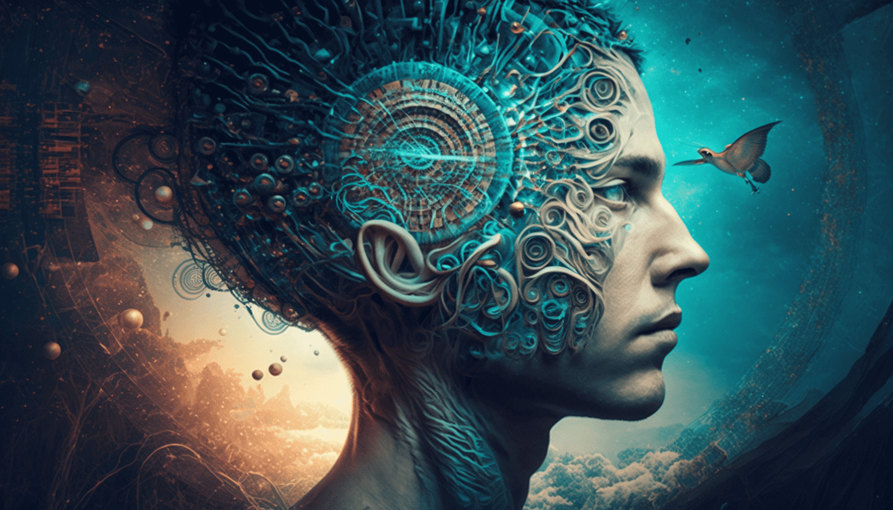
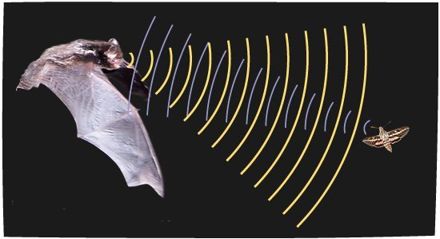
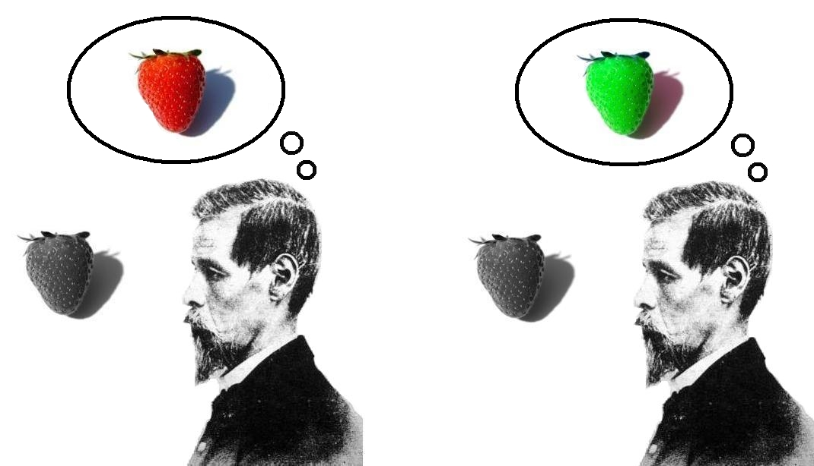
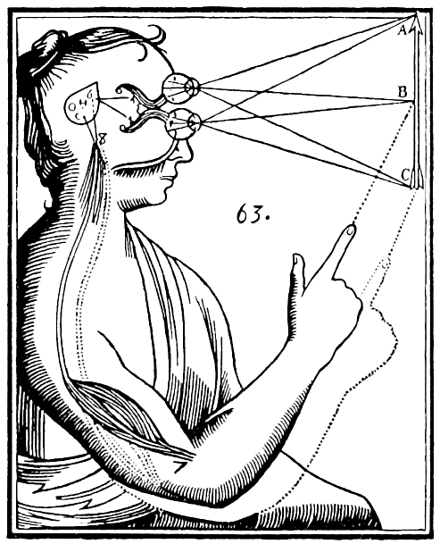
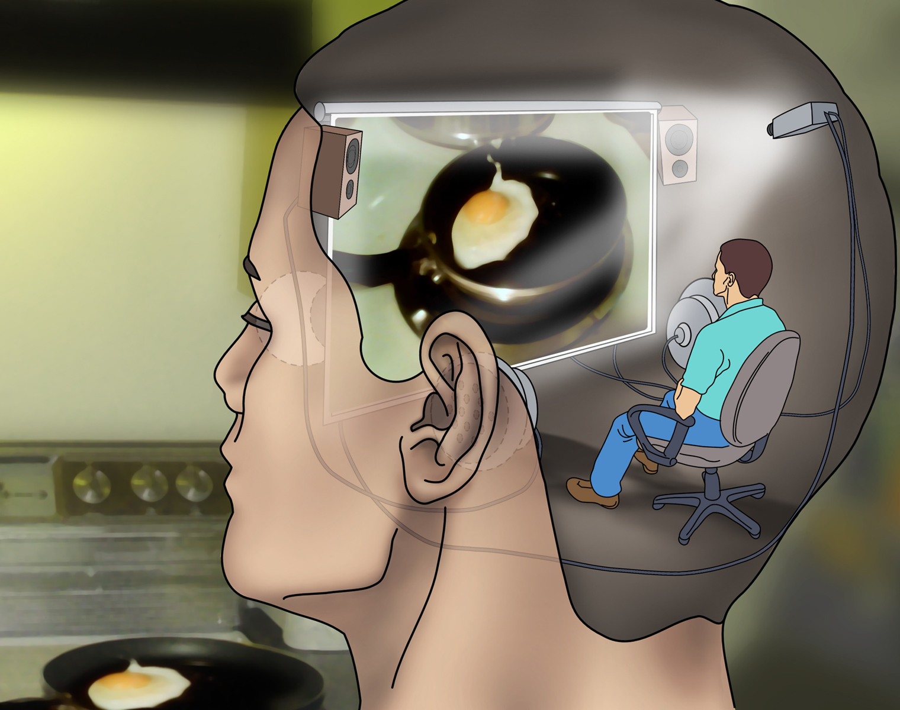

# Cознание — величайшая загадка Вселенной

В какой‑то момент жизни большинство людей задается вопросами вроде «Почему я существую?», «Почему есть что‑то, хотя могло ничего не быть?», «Откуда появился наш мир?». С древних времен философы и ученые пытаются найти ответ на эти вопросы, а проповедники утверждают, что нашли единственно верный.

На первый взгляд кажется, что это самые сложные из всех возможных вопросов, однако это не так. Несмотря на сложность, а иногда даже и полную невозможность проверить истинность определенного ответа на эти вопросы, мы можем хотя бы судить об убедительности тех или иных ответов, их логической непротиворечивости и согласованностью с наблюдениями.

Может быть, существование мира неизбежно, как дважды два неизбежно равно четырем, а может быть, если нет ничего, то нет и никаких препятствий для возникновения мира. Мы можем гадать, мы можем строить теории и проверять их. В любом случае, мы можем хотя бы попытаться ответить на этот вопрос и примерно представляем себе формат ответа на него.

Существует гораздо более сложный вопрос — мы не только не можем проверить на истинность или ложность ответа на него, но мы даже не представляем себе формат ответа, да и сам вопрос, честно говоря, мы сформулировали с большим трудом. Кроме того, многие люди даже не понимают суть вопроса, а другие отрицают его осмысленность. Этот вопрос, величайшая загадка Вселенной — тайна человеческого сознания.

Сперва, может показаться, что вопрос высосан из пальца, но на самом деле, он лежит в самой основе человеческого бытия, и к нему сводятся все остальные вопросы философии, науки и общества. К примеру, автор бестселлера «Sapiens: Краткая история человечества», известный израильский историк Юваль Ной Харари как‑то сказал, что без отсылки к сознанию у нас не получится даже обосновать ни одну этическую систему. Он кратко сформулировав свою мысль в виде простого вопроса: «Как без отсылки к сознанию доказать, что пытки это зло?».

Кроме того, научный и технологический прогресс все сильнее набирает ход, и мы вплотную подходим к эпохе киберпанка, в которой нам просто необходим ответ на вопросы о сознании: «Есть ли сознание у нейросети?», «Возможна ли загрузка сознания в компьютер?» и «Снятся ли андроидам электроовцы?».

Уже долгие годы я изучаю загадку сознания в трудах аналитических философов и нейробиологов. В этом посте я решил объединить все вопросы, аргументы и рассуждения, которые я уже описывал в моих предыдущих постах и о которых узнал с тех пор. А начать экскурсию, я полагаю, нам стоит с того, чтобы определиться с предметом нашего разговора. Что вообще такое — это самое сознание?

## Субъективный опыт

Религиозные евреи читают свою первую молитву утром сразу после пробуждения ото сна. Звучит она так: «Благодарю Тебя, Царь живой и сущий, за то, что Ты по милости Своей возвратил мне мою душу.» Что это может означать? Почему они считают, что утром Бог возвращает им душу?

Дело в том, что душа — это религиозный синоним термина "сознание". Когда философы античности, средневековья и Возрождения рассуждали о душе, они говорили именно о сознании. Однако возникало много путаницы из‑за того, что разумные утверждения смешивались с мистическими и религиозными домыслами. Чтобы это исправить в аналитической философии XX века вместо слова «душа» стали употреблять термин «сознание».

> Сознание — это поток субъективных впечатлений.

Когда мы засыпаем этот поток прекращается или почти прекращается, а когда просыпаемся, этот поток возвращается. Именно этот поток и имеется в виду в еврейской молитве под термином «душа».

К сожалению, «поток субъективных впечатлений» — это очень расплывчатое и неочевидное определение. Тут требуется некоторое разъяснение и примеры. Субъективные впечатления — это те чувства, которые мы испытываем при том или ином физическом процессе. Это то, что отвечает не на вопрос «Что это?» или «Как это работает?», а на вопрос «Каково это?».

Отличный пример для объяснения того, что такое субъективные впечатления, привел американский философ Томас Нагель. Представьте, что вы ученый, который изучает летучих мышей. У этих животных кроме привычных человеку органов чувств, существует еще один дополнительный — эхолокатор. Летучие мыши при полете в темноте издают ультразвук, и по его отражению от препятствий и предметов понимают, что где находится. Вы как ученый изучаете эхолокацию летучих мышей: делаете мышам МРТ, проводите им хирургические операции, ставите на них эксперименты. Вы знаете об эхолокации летучих мышей буквально всё — все ответы на вопросы «Что это?» и «Как это работает?».

Но есть одна вещь, которую вы никак не можете узнать об эхолокации мышей с помощью экспериментов — это то каково это чувствовать эхолокацию, каково это быть летучей мышью. Ответ на вопрос «Каково это?» — и есть субъективное впечатление. А поток таких субъективных впечатлений — это и есть сознание.

Другой классический пример объяснения сознания — комната Марии. Представьте, что некоторую девочку по имени Мария с самого рождения держат в закрытом помещении без окон под стражей. Все в комнате Марии черно‑белое: и стены, и одежда, и экран компьютера. Марии доступно неограниченное количество информации о цветах — книги по физике света, книги про устройство глаза и восприятие цветов людьми, книги про работу мозга. Таким образом, Мария знает о цвете буквально все. Однажды Марию отпускают за пределы ее комнаты во внешний мир, полный красок. В тот самый момент, когда Мария увидит, что либо красное, она получит субъективное впечатление восприятия красного цвета. Это чувство — то, что она не могла получить ни из каких книг.

Каждое субъективное впечатление само по себе в аналитической философии принято называть словом «квалиа».

> Квалиа — это элементарная неделимая частица сознания.

Примеров таких элементарных частиц субъективного опыта целое множество: например, красный цвет, звук скрипа двери, запах апельсинов. Не существует способа как либо описать, определить квалиа или передать знание о нем. Невозможно объяснить, что такое красный цвет, слепому от рождения человеку, и что такое звук скрипки глухому.

Также мы даже не можем вообразить себе, какие квалиа испытывают другие живые существа. Какие цвета видят животные с тетрахроматическим зрением? Как чувствует оргазм человек противоположного пола? Эти безответные вопросы подводят нас к одной из проблем изучения сознания — проблеме других умов.

## Проблема других умов

Главная проблема, препятствующая изучению сознания — это невозможность посмотреть на мир «глазами другого человека». У нас есть доступ к нашему собственному сознанию, но нет доступа к сознанию других. Эту проблему знаменитый немецкий математик и философ Готфрид Лейбниц окрестил «проблемой других умов».

Представьте себе, что весь наш мир — это одна большая видеоигра, а вы персонаж этой игры. Игра работает на базе графического и физического движков — физический движок просчитывает взаимодействие всех объектов в игре, а графический отрисовывает для вас картинку от первого лица.

Находясь внутри этой игры, вы можете ставить любые эксперименты с любыми игровыми объектами. С помощью этих экспериментов, вы можете выяснить детали работы физического движка игры. Потенциально, вы даже можете воспроизвести на листе бумаги полный код алгоритма работы физического движка — этакую внутриигровую Теорию Всего.

Однако, будучи персонажем игры, вы никакими экспериментами не можете узнать ответы на два вопроса:

- Являются ли другие персонажи игры такими же игроками или же хорошо запрограммированными, но бездушными NPC
- Если предположить, что другие персонажи игры являются игроками, то такие же у них настройки и шейдеры графического движка или нет?

Если перевести эти два вопроса на общепринятый язык, то они будут звучать так:

- Обладают ли другие люди сознанием или нет?
- Если предположить, что другие люди обладают сознанием, то они видят цвета также как и мы или нет?

Есть абсурдное утверждение о том, что игра не мультиплеерная, а рендерится только для одного игрока — такое утверждение называется солипсизмом. Несмотря на всю абсурдность солипсизма, не существует ни единого способа его опровергнуть. Существование других умов — это предмет чистой веры.

Большинство людей верят в то, что игра все‑таки мультиплеерная. Однако никто не в состоянии как‑либо проверить, такие же у другого человека настройки графики или какие‑то другие. Возможно ли такое, что разные люди видят цвета по‑разному? На эту тему существует мысленный эксперимент

Представьте, что вы и ваш друг смотрите на красное яблоко. Ни у вас, ни у друга нет никаких физических проблем со зрением или нарушений восприятия вроде дальтонизма. Вы показываете на яблоко пальцем и утверждаете, что оно красное. Ваш друг показывает на яблоко пальцем и утверждает, что оно красное. Вы сходитесь в том, что оно красное, ведь вы оба с детства привыкли к тому, что этот цвет называют красным. Может ли быть такое, что в своем сознании вы видите этот цвет так, как ваш друг в своем сознании видит зеленый, а зеленый вы видите так, как ваш друг видит красный? Не существует ни единого способа подтвердить или опровергнуть это предположение. Описанный мысленный эксперимент известен как «инвертированный спектр».

Проблема других умов долгие годы останавливала ученых от любых попыток изучения сознания, ведь существование других сознаний — это нефальсифицируемая гипотеза. Ее невозможно ни опровергнуть, ни подтвердить. Такое несоответствие критерию Поппера не дает возможности изучать сознание с помощью классического научного метода. И многие ученые даже утверждают, что сознание, душа — это выдуманная иллюзорная сущность, и ее нужно выбросить на свалку истории, где уже покоятся феи, единороги и прочие мифические создания. Однако, кое‑что не дает всем ученым согласиться с этим — ведь факт существования сознания стоит у них перед глазами.

К концу XX века некоторые ученые подступились к изучению сознания. И первым шагом стало разделение вопросов о сознании на два типа: те, на которые можно попытаться найти ответы, и те, на которые нельзя.

## Легкие и трудные проблемы

Долгое время даже очень умные люди, рассуждая о сознании, путались в терминах и утверждениях. В конце XX века вышла в свет книга австрало‑американского философа Дэвида Чалмерса под названием «Cознающий ум», с помощью которой мыслитель попытался внести в дело ясность.

Чалмерс разделил вопросы о сознании на два вида — легкие и трудные проблемы.

> Легкая проблема сознания — это вопрос, на который возможно найти ответ с помощью научного способа при некоторых допущениях.

В последние десятилетия многие нейробиологи занимаются поисками ответов на легкие проблемы сознания. Они ищут так называемые нейрокорреляты сознания — соответствия между цепочками активации нейронов в мозгу пациента и субъективными впечатлениями в его сознании. Единственное допущение, на которое опирается изучение сознания при этом методе — это вера в то, что пациент обладает сознанием и в то, что его устные отчеты о его субъективных переживаниях верны.

> Трудная проблема сознания — это вопрос, на который найти ответ с помощью научного способа на нашем уровне мышления невозможно.

Основной трудный вопрос — «Почему сознание вообще возникает и как квалиа связаны с физическими процессами?».

Если мы зададимся вопросом, что вообще обладает свойством «красноты», то не сможем найти ответ. Мы называем предмет красным, только потому что от него отражается свет определенной длины волны. Мы называем этот свет красным только потому, что при его попадании в глаз, в мозгу активируется цепочка нейронов, вызывающая у нас субъективное впечатление красного цвета. Но ни в предмете, ни в свете, ни в глазе, ни в мозге нет ничего красного.

Почему одна цепочка нейронов в голове вызывает впечатление красного цвета, а другая впечатление фиолетового? Если и то, и другое, просто последовательность сигналов, последовательность активаций, то почему красный цвет так сильно отличается от вкуса сливы? Да и почему, черт возьми, активация этих цепочек нейронов вообще порождает какие‑либо чувства? Ответов на эти вопросы нет — это трудная проблема сознания.

Уже упоминаемый мною Лейбниц проиллюстрировал эту проблему отличной метафорой с мельницей. Представьте на секунду, что вашу голову увечили до огромных размеров так, что в нее теперь можно войти как в мельницу. Вы входите туда и видите огромное число связанных друг с другом проводов, или как писал сам живший задолго до изобретения электричества Лейбниц «шестеренок». Каждую из шестеренок приводит в движение предыдущая, а та в свою очередь приводит в движение последующую. При осмотре этой мельницы вы не найдете ничего такого, чем бы можно было бы объяснить сознание.

Эта проблема называется разрывом в объяснении. Этот разрыв не дает редуцировать ментальные состояния к физическим процессам. Так как все научные теории описываются математикой, а для квалиа невозможно дать строгое математическое описание, то получается, что невозможно свести сознательные впечатления к математическому или алгоритмическому описанию работы мозга. Красный цвет и процесс активации нейронов — это абсолютно ортогональные вещи. Именно поэтому нейробиологи называют изучаемые ими связи нейрокоррелятами — потому что корреляция между активацией нейронов и сознательным чувством есть, а причинно‑следственной связи нет.

Разрыв между сознанием и физическим миром сильно интересовал знаменитого французского философа и математика Рене Декарта. Мыслитель одним из первых в Европе сформулировал трудную проблему сознания — он называл её психофизической проблемой или проблемой «духа и тела». Декарт размышлял о том, как могут происходящие с телом физические явления порождать сознательные впечатления, и как сознательное усилие воли может управлять телом. Например, как наше волевое усилие приводит к тому, что мы поднимаем палец?

Декарт считал, что сознание сконцентрировано в шишковидной железе головного мозга, которая получает сигналы от тела и отправляет обратно управляющие сигналы. Возможно, во времена Декарта такая теория и имела право на существование, но она содержит очевидную ошибку. Если все сознание сконцентрировано в шишковидном теле, то откуда оно там?

Таким образом аргумент о том, что сознание сконцентрировано в шишковидной железе — это первый шаг к бесконечной регрессии. Американский философ Дэниэл Деннет высмеял теорию Декарта, назвав ее картезианским театром. Деннет представил шишковидную железу из теории Декарта в виде гомункула — маленького человечка, живущего в голове, смотрящего за происходящим на экране и управляющего действиями тела. Даже если это действительно было бы так, то как же сознание возникает в голове у самого гомункула?

Нейрофизиологи не смогли найти единого центра сознания в нашем мозге — нейрокорреляты сознания тонким слоем размазаны по многим отделам мозга. Но некоторые отделы все же никак с сознанием не связаны. Например, содержащий половину всех нейронов мозга мозжечок почти не связан с сознательными впечатлениями.

Несмотря на очевидную ошибочность гипотезы связи тела и сознания, размышления Рене Декарта о природе сознания оказались не бесполезны. Вслед за Декартом многие другие европейские мыслители Нового Времени стали задумываться о проблеме сознания. И кроме того, Декарт сформулировал единственную вещь, в которой обладающее сознанием существо может быть уверено: «Я мыслю, следовательно я существую».

## Видят ли андроиды сны об электроовцах?

Мы можем быть уверены только в том, что лично мы обладаем сознанием. Мы можем лишь предполагать, что другие люди также обладают сознанием. Однако, если мы допускаем существование сознания у других людей, то было бы бессмысленным шовинизмом не допускать наличие сознания у животных — обезьян, собак, кошек, лошадей, дельфинов и китов. Смотря в глаза собаке, трудно сомневаться в том, что у них есть сознание. Если мы допускаем наличие сознания у млекопитающих, то почему бы не допустить наличие сознания у рептилий, рыб и других крупных животных? Если мы допускаем наличие сознания у рыб, то почему бы не допустить наличие сознания у насекомых и членистоногих. А если мы допускаем наличие сознания у насекомых, то почему бы не попустить существование сознания у червей, тихоходок и бактерий.

Таким образом, всего‑лишь навсего отказавшись от солипсизма, мы вступаем на скользкую лестницу, ведущую вниз вплоть к элементарным частицам. Если мы допускаем существование сознания у других людей и считаем, что сознание порождается физическими процессами обработки информации в нервной системе, то почему бы не допустить наличие сознания у бактерий, ведь внутри них протекают такие же физические процессы и обрабатывают некоторую информации. Да и столкновения элементарных частиц друг с другом тоже вполне можно записать в ту же категорию.

Так где же нам прочертить линию демаркации между сознательным и механическим? Как отличить одушевленных существ от простых биороботов? Имеет ли смысл становиться вегетарианцем из‑за страданий миллиардов коров, или же корова — это простая машина вроде автомобиля, только не из железа и пластика, а из мяса?

Кроме того, скользкая ведущая вниз лестница также ведет и наверх. Если физические процессы обработки информации порождают сознание, то и нашу планету можно рассматривать в качестве такого процесса. У Земли тоже есть сознание? Какие сны видит Гея? А если Земля сознательна, то вся Вселенная — это тоже огромное одушевленное существо, как считали древнеиндийские философы?

Отказ от солипсизма приводит нас к чувствующим бактериям и мыслящей Вселенной. Отказ от одного абсурда приводит к другому. Этот второй абсурд известен как панпсихизм.

У панпсихизма немало логических проблем. Одна из главных — это проблема комбинации. Если все физические процессы во Вселенной могут порождать чувственный опыт, то как именно различные комбинации этих процессов приводят к появлению цельного восприятия? Почему мы ощущаем себя именно как человек, а не как коленка или как целая планета?

Одним из возможных ответов на эти вопросы предлагается теория интегрированной информации, утверждающая что не любые физические процессы порождают чувственный опыт, а только те, которые исполняют алгоритмы особого рода. Эти алгоритмы должны быть очень сложными и одновременно интегрировать огромную кучу информации в одном месте. По мнению автора теории, в нашем теле такие процессы исполняются только в коре головного мозга. Однако, если подумать, в самом деле эта теория не дает ответа на основной вопрос — всегда можно задаться вопросом: так а почему одни алгоритмы порождают чувственный опыт, а другие — нет?

Вопрос о том, кто обладает сознанием, а кто нет, кажется далеким от реальности. Но на самом деле, вопрос о сознании влияет на все этические вопросы человечества. Если коровы не обладают сознанием, то это лишает смысла существование организаций по гуманному отношению к скоту.

А обладают ли сознанием нейросети? Если физический процесс обработки информации или же некий сложный алгоритм порождают сознание, то нейросети тоже должны быть сознательными. А если нейросети сознательны, то отключение компьютера с достаточной сложноустроенной нейросетью от питания этически ничем не отличается от убийства человека.

Пионеры в области искусственного интеллекта предлагали разделить ИИ на слабый и сильный. Слабый ИИ — это просто машина, которая выполняет инструкции и выдает ответ, а сильный ИИ — это искусственный интеллект, обладающий сознанием. Американский философ Джон Сёрл размышлял о том, как мы можем отличить сильный ИИ от слабого, и пришел к выводу, что сделать это невозможно. В поддержку своего утверждения он привел мысленный эксперимент под названием «Китайская комната».

Представьте, что вас посадили в комнату с единственным окошком. Через это окошко вам подают таблички с китайскими иероглифами. Китайского языка вы не знаете, но у вас есть книга с подробным набором правил о том, как в соответствии с полученными табличками составлять другие таблички, которые вы отдаете назад через окошко. Китайцу, который общается с вами через окошко, вы кажетесь разумным, но вы сами понятия не имеете о том, что говорится в табличках — вы просто по набору правил составляете выходные таблички на основе символов во входных табличках.

Таким образом, находясь в китайской комнате вы выполняете работу искусственного интеллекта. По сути, вы — нейрон в мозгу китайской комнаты. Но если набор правил в вашей инструкции достаточно полон, и китайская комната неотличима в общении от человека, то получается, что она обладает сознанием? Как комната может обладать сознанием? Это абсурд.

Другой вариант китайской комнаты называется «Китайский мозг». Представьте себе миллиарды китайцев, соединенных между собой телефонными сетями. Каждый отдельный китаец симулирует работу одного нейрона. Когда ему кто‑то звонит, он по простому набору данных ему правил, звонит кому‑то из других китайцев или же не звонит вообще. Вся телефонная сеть, таким образом, симулирует работу мозга. Если алгоритмически телефонная сеть китайцев эквивалентна мозгу, то получается, что у нее есть сознание. Но это же абсурд. Как телефонная сеть может обладать сознанием? Если у этой гипотетической сети есть сознание, то что же тогда чувствует интернет? Презирает ли он нас за нашу историю поиска?

Если мы отрицаем существование чувственного опыта у китайского мозга или интернета, то встает вопрос — почему у одних механизмов вроде человеческого мозга сознание появляется, а у других, точно таких же, вроде телефонной сети, нет. Философ Дэвид Чалмерс проводит блистательное рассуждение: предположим, что существует точно такой же человек как вы, ваш полный физический клон, который однако не обладает сознанием. Такого клона обычно именуют философским зомби: с механистической точки зрения он — ваша полная копия. Зомби реагирует на все раздражители так же как и вы, однако в отличие от вас, «работа шестеренок» в его мозге не порождает субъективного опыта. Философский зомби не видит того «внутреннего кино», что видим мы.

Если вам обжечь руку, вы отдерните ее, почувствуете боль, ваше лицо выразит гримасу страдания, вы крепко выругаетесь и замашете рукой, пытаясь ее охладить. Если философскому зомби обжечь руку, то но он отдернет ее, его лицо выразит гримасу страдания, он крепко выругается и замашет рукой, пытаясь ее охладить, но он не почувствует боли. Его поведение будет идентично вашему — внешний наблюдатель не сможет отличить, кто из вас обладает сознанием, а кто — зомби, кто действительно чувствует боль, а кто же ведет себя так, как будто чувствует боль.

Чалмерс задается вопросом, может ли такой зомби действительно существовать, и приводит занятные рассуждения. Первый факт в его рассуждении: наш мозг — это «механистическая» причинно‑замкнутая система, то есть такая система, работа которой полностью подчиняется закону причин и следствий — активация каждого нейрона имеет причину в активации предыдущего нейрона и может служить причиной активации следующих нейронов. Второй факт: наша речь — результат работы нашего мозга. Третий факт: мы произносим «У меня есть ощущение красного цвета». Из этих трех фактов Чалмерс делает логически неизбежный вывод: механическая машина утверждает, что чувствует квалиа красного цвета.

Таким образом, философский зомби, если он действительно является нашей точной копией, будет точно так же утверждать, что обладает сознанием. Рассуждение Чалмерса опровергает возможность существования философского зомби и подкрепляет гипотезу о том, что китайский мозг действительно будет обладать сознанием, как и другие компьютерные нейросети.

Философ Дэвид Чалмерс считает, что квалиа могут возникать из‑за отсутствия у нас прямого доступа к нашим нейронам и нервным волокнам. Поэтому когда нас спрашивают, что значит «красный цвет», то единственное, что мы можем ответить — «ну, он просто красный и всё». Точно так же, если спросить достаточно умную нейросеть, получающую на вход постоянный сигнал с видеокамер, но не имеющую к этим камерам прямого программного побитового доступа, что такое красный цвет, то, по мнению Чалмерса, такая нейросеть ответит, что это «ну, просто красный и всё».

## Вещи в себе

Некоторые мыслители склонны считать, что феномен сознания — это всего‑лишь иллюзия, и на самом деле ничего кроме материального физического мира, описываемого математическими моделями, не существует. Другие философы считают, что у этого утверждения есть одна большая проблема. Они указывают на то, что первые мыслители настолько привыкли сводить все к моделям, что совершенно игнорируют реальность у себя перед глазами. Изучая карту, забывают о территории, которую эта карта описывает. Более того переворачивают все с ног на голову — воспринимают территорию, как иллюзию, а карту как реальность.

По мнению сторонников реальности сознания, его существование — это непосредственный факт, данный нам в ощущениях. А вот все наши сведения о физическом мире — это лишь идеи в нашей голове, то есть в этом самом сознании, полученные нами и проверенные нами опять же через чувственный опыт. Я советую вам крепко поразмышлять над этим утверждением несколько минут, чтобы постигнуть всю его глубину. Хотя, возможно, вам не хватит на это и целой жизни.

Кроме того, многие философы указывают на то, что весь физический мир материализуется только в сознании. Набор битов любой информации и ее обработка, выраженные в физических процессах, обретают смысл только в сознании. Без сознания весь физический мир попросту не имеет смысла. Согласно квантовой механике, элементарные частицы — это волны амплитуды вероятности. Совокупность элементарных частиц — это атомы, совокупность атомов — это молекулы, совокупность молекул — это биологические клетки, совокупность клеток — это ткани и микроорганизмы, совокупность тканей — это органы, а совокупность органов и тысяч разных видов микроорганизмов образует организм.

И вот представьте себе, один организм смотрит на другой организм и заявляет: ״Это моя жена, и она одета в красное платье״. Представляете? Один сгусток декогерированных волн амплитуд вероятности смотрит на другой такой же сгусток и говорит, что это его жена в красном платье. Что это вообще может значить? Как волны вероятности вообще могут смотреть или говорить? Весь этот бред обретает смысл только в сознании. Таким образом, сознание оказывается не просто результатом работы мозга, а фундаментальным свойством Вселенной. Ведь вся осмысленная Вселенная существует только в сознании, и без него существовать не может.

Известный немецкий философ Иммануил Кант пытался найти «вещи в себе» — то, какими вещи являются самими по себе без описания чувственных характеристик, но не нашел ни одной. Например, вода мокрая, прозрачная и холодная только в чувственном опыте, и даже её физическая модель выводится нами в серии экспериментов, результаты которых мы получаем через наш чувственный опыт. Да и воспринимается нами эта физическая модель в виде вспышек квалиа платонических идей в нашем сознании.

Таким образом, сознание материализует физический мир, а физический мир порождает сознание. Наш мир полон подобных «странных петель» — к примеру согласно общей теории относительности, материя говорит пространству, как искривляться, а пространство говорит материи, как двигаться. Кучу подобных рекурсивных петель в мироздании точно подметил и замечательно описал американский физик Дуглас Хофштадтер в своей книге «Гёдель, Эшер, Бах — эта бесконечная гирлянда».

Загрузка сознания в компьютер
После выхода в публичный доступ нейросетевых технологий ChatGPT и Midjourney весь мир осознал, что мы на полных парах летим в эпоху киберпанка. Технологии уже настолько развиты, что, как и предрекал Артур Кларк, совершенно неотличимы от магии. Пройдет еще немного времени, и наша жизнь изменится еще сильнее: появятся нейро‑импланты с интерфейсом мозг‑компьютер и прямым мысленным доступом в интернет. Наши дети будут считать нас отсталыми, потому что мы заказываем пиццу через приложение в телефоне, а можно же просто о ней подумать, и ее привезут.

Мы сегодняшние даже не можем представить себе, какие квалиа будущие киборгизированные мы будем переживать, имея мысленный доступ к Google, нейронную связь с работающей на встроенном в наш мозг нейроморфном чипе ChatGPT и глазной имплант, расширяющий наше зрительное восприятие на ультрафиолетовый и инфракрасный диапазоны.

Несмотря на бурное развитие технологий, некоторые технические вопросы вплотную упираются в нерешенные философские проблемы. Одна из самых волнующих тем для всех людей — обретение бессмертия. И так как успехи в достижении биологического бессмертия или хотя бы долголетия пока невелики, многие инженеры и мыслители предлагают замену — цифровое бессмертие. Для достижения цифрового бессмертия предлагается загружать информационный слепок мозга человека в компьютер. Однако возможность цифрового бессмертия упирается в трудную проблему сознания. Совершенно неясно, возможна ли загрузка сознания в компьютер.

Если мозг из вашего умирающего тела поместят в супер‑технологичный МРТ‑сканер, просканируют все до единой нейронные связи и запустят их в виде модели на компьютере, то перенесется ли туда ваше сознание. Уснув в физическом теле, проснетесь ли вы в компьютере? Будет ли вообще сознание у вашей компьютерной версии или это будет бездушная машина вроде вышеописанного философского зомби? Без рабочей теории сознания и решения трудной проблемы мы этого не узнаем.

Ответ на вопрос про перенос сознания в компьютер на первый взгляд кажется простым — ведь если мое физическое тело не умрет, и я проснусь в нем, то я буду все еще самим собой, а в компьютере будет жить копия моей личности. Но это только на первый взгляд. Ведь копия в компьютере будет иметь совершенно другую картину событий — она также заснет в физическом теле, но проснется уже в компьютере. И для той «души», что проснулась в теле, и той, что проснулась в компьютере, поток сознания будет казаться непрерывным.

Таким образом, возможно, если быстро скопировать структуру мозга в компьютер и уничтожить биологический носитель сознания, то наше «Я» действительно обретет цифровое бессмертие? Есть два варианта событий:

Я закрываю глаза и засыпаю перед операцией переноса. Мое биологическое тело умирает и «Я» больше никогда не просыпаюсь. Говоря метафорически, еврейский Бог больше не возвращает мне душу. А в компьютере просыпается мой клон — возможно сознательный, но уже с другой «душой».

Я закрываю глаза и засыпаю перед операцией переноса. Мое биологическое тело умирает, но декартовский «Я», тот что мыслит и поэтому существует, просыпаюсь в компьютере. Моя «душа» все та же, поток сознания не прерван.

Здравый смысл подсказывает нам, что случится первый вариант. Но ведь Эйнштейн и Шредингер давно доказали, что здравый смысл не работает в нашей Вселенной. Поэтому я думаю, что случится второй вариант. Ведь если биологическое тело, служащее носителем сознания, будет уничтожено, то единственная «душа», что является наследником моего потока сознания, проснется в компьютере и не почувствует смерти.

Со смертью биологического тела «душа» не умирает, ведь эта душа, наше сознание, не физическая и не заключена в теле. Она лишь коррелят физического процесса, но не редуцируется к нему. Куда уйдет операционная система, если скопировать все данные на другой компьютер, и разбить первый компьютер молотком?

Если крепко задуматься, то начинает казаться, что первый и второй варианты вообще неотличимы друг от друга, ведь в обоих вариантах единственный кто что‑то помнит и чувствует — это компьютерная «душа», и для нее поток сознания был непрерывен. Таким образом, неважно останется ли в живых биологическое тело или нет, для моего «Я» поток сознания в любом случае не прервется — просто в одном случае он точно проснется в компьютере, а в другом с вероятностью 1/2 проснется либо в теле, либо в компьютере.

Этот своеобразный «закон непрерывности потока сознания» подтверждается самим нашим существованием. С тех пор, как вам было пять лет, клетки вашего мозга много раз обновились, и в нем множество раз переплелись и переключились нейронные связи. По сути, физически вы не тот, что были в пять лет, и не тот, что были в десять лет, и даже не совсем тот, что были вчера. Однако, ваш поток сознания не прерывался: вы засыпали и каждый раз просыпались. Бог каждый раз отдавал вам вашу душу. Так почему такой же трюк нельзя провернуть с компьютером? Почему замена постоянно сменяющих друг друга биологических нейронов на кремниевые транзисторы может не сработать?

С точки зрения здравого смысла нам кажется, что "мгновенный" перенос данных из тела в компьютер обязательно должен уничтожить сознание биологического оригинала, а в компьютере будет жить копия. Но что если сделать перенос не мгновенным, а постепенным, каждый день заменяя небольшой процент биологических нейронов мозга на искусственные? Спустя какое-то время мы должны обнаружить, что заменили все нейроны на искусственные, можем вынуть новый "электронный" мозг из черепной коробки и поставить его в серверную стойку. Будет ли поток сознания непрерывным в таком случае? И если да, то в чем его принципиальное отличие от мгновенного переноса?

Вопросы о загрузке сознания сводятся к одному из старинных философских вопросов — вопросе об идентичности корабля Тесея. По легенде корабль, на котором царевич Тесей вернулся с Крита после победы на минотавром, использовался афинянами для ритуальных плаваний на Делос. После каждого плавания корабль чинили и заменяли часть досок на новые. Постепенно все доски были заменены. Среди философов возник спор — тот же этот корабль или уже другой? А если все его старые доски были сохранены, и из них собрали новый корабль, то какой из этих двух кораблей — настоящий?

## Заключение

Самый близкий для меня ответ на вопрос о существовании Бога — это игтеизм, также известный как игностицизм. Его суть можно выразить в кратком пересказе утверждений различных мировоззрений:

- Теист: «Бог существует»
- Атеист: «Бога не существует»
- Агностик: «Я не знаю, существует Бог или нет»
- Игтеист: «Я не понимаю, что имеют в виду, когда говорят, что Бог существует или не существует. Эти утверждения не имеют смысла»

Могу ли я тоже самое сказать о сознании? Сказать, что я не понимаю, что имеют в виду, когда говорят, что сознание существует или не существует? Признать рассуждения о сознании интеллектуальным жонглированием иллюзорными идеями, этакой игрой в бисер? Ведь каждый раз когда мы пытаемся ухватить сознание за хвост и проанализировать с помощью логики и разума, оно ускользает от нас.

Может быть, я бы этого и хотел, но, к сожалению, факт существования сознания стоит у меня прямо перед глазами...
