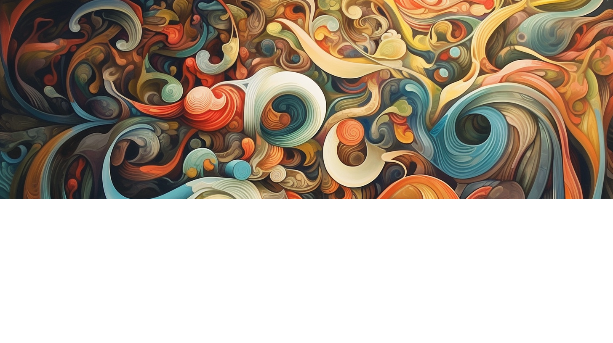
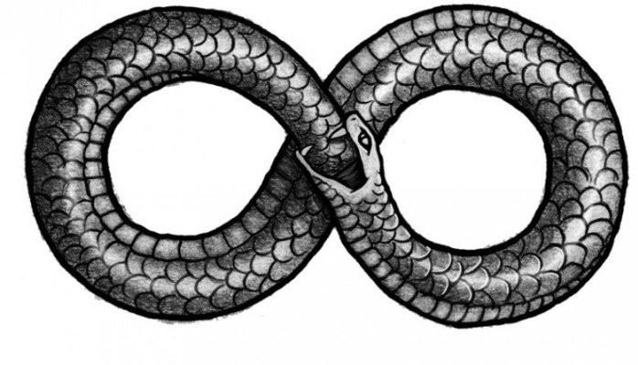
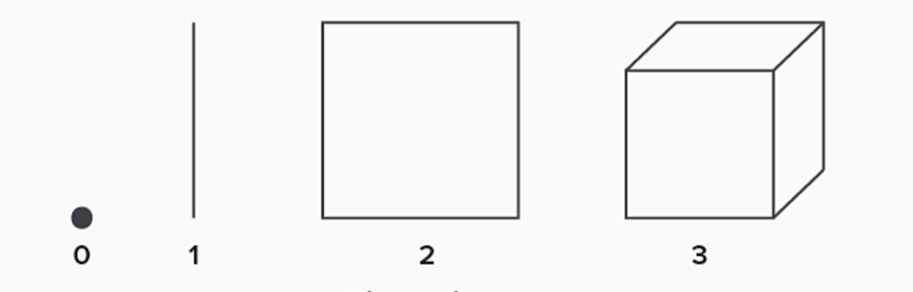
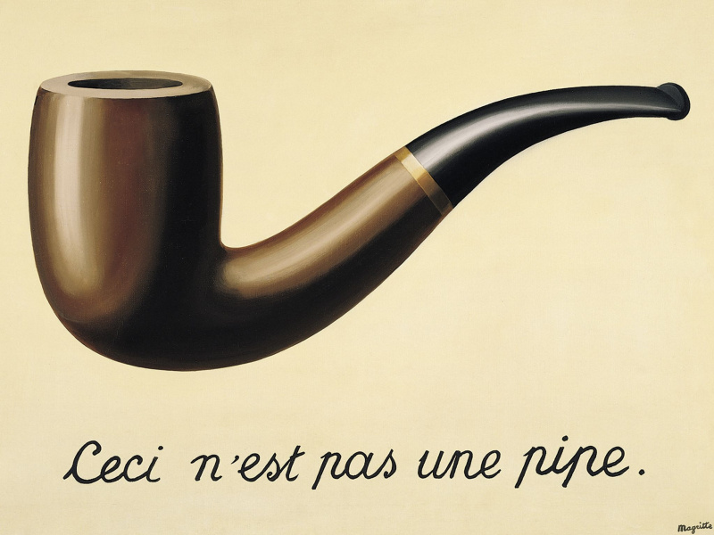
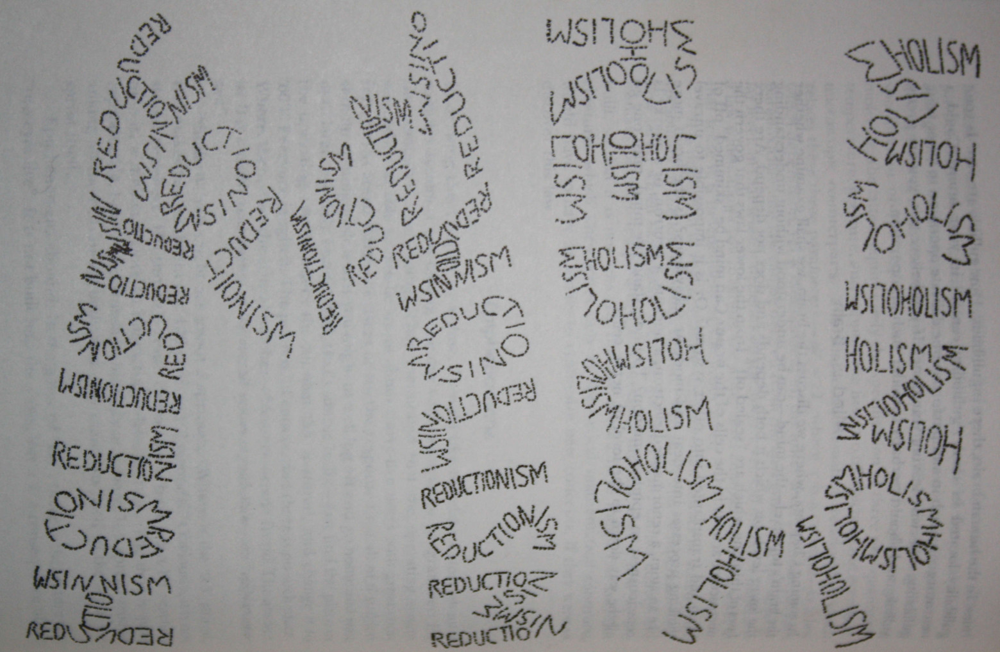
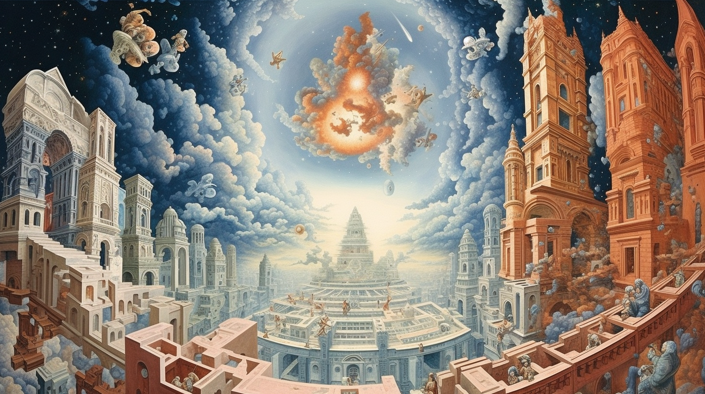

# Дзен и рекурсивные петли

На протяжении существования человеческой цивилизации то возникали, то погибали целые культуры со своими традициями, ритуалами и верованиями. В чём-то эти они были схожи, в чём-то различны. Однако существовал символ, который непрестанно встречался почти в каждой культуре - это было изображение змея, пожирающего свой собственный хвост. Древние греки нарекли этого змея Уроборос.

У греков изображение змея символизировало бесконечность и безначальность фундаментальных природных процессов. Сами греки позаимствовали этот символ у древних египтян, у которых Уроборос символизировал непрекращающийся цикл перерождения душ и обычно изображался на стенах гробниц фараонов. У древних китайцев, в свою очередь, кусающий себя за хвост змей обозначал недвойственность всего сущего: если начать исследовать любое явление и его противоположность, то в итоге можно обнаружить, что одно бесшовно перетекает в другое и нельзя точно сказать, что из двух более фундаментально.

В китайской культуре символ Уробороса сросся с похожим даосистским символом - перетекающими друг в друга потоками сил Инь и Ян. С точки зрения даосов пустота, заключенная внутри петли кусающего самого себя змея - это и есть то самое Дао, которое, согласно книге Лао-Цзы, находится вне всяких представлений. Когда идеи даосов смешались и переплелись с идеями китайских буддистов, на свет появился прекрасный ребенок - дзен-буддизм. Дзен постепенно распространился по всему Востоку - Китаю, Корее и Японии, а в XX веке стал популярен и на Западе.

И именно благодаря пришедшей не так давно по историческим меркам популярности дзен-буддизма на Западе, размышления о Дао привели известного американского физика Дугласа Хофштадтера к публикации его знаменитой, отмеченной Пулитцеровской премией, книги "Гёдель. Эшер. Бах - эта бесконечная гирлянда".

В своей книге Хофштадтер рассматривает "странные петли", которые, как ему кажется, лежат в основе всей нашей реальности. Эти петли по своему виду похожи на змею Уробороса - у них нет ни начала, ни конца. Если мы попытаемся исследовать какую-то часть "странной петли", то мы обнаружим, что она плавно перетекает в саму себя. В книге Хофштадтер проводит параллели между этими "странными петлями" и теоремами о неполноте Гёделя, картинами Эшера и фугами Баха.

## Петля пространства

Немецкий физик, инженер и философ Эрнст Мах посвятил долгие годы рассуждению об определении пространства. Мах проводил мысленный эксперимент - воображал себе вселенную, в котором не существует ничего кроме одного единственного объекта, и задавался вопросом: возможно ли в такой вселенной обнаружить существование пространства?

Мах считал, что если объект всего один, то мы не можем обнаружить существование в такой вселенной даже одномерного пространства - пространство там нульмерно или попросту не существует. Если во вселенной два объекта, то мы уже можем определить одномерное пространство проведя прямую ось между двумя этими объектами. Если во вселенной три объекта и они не лежат на одной прямой, то мы можем определить существование в такой вселенной двухмерного пространства.

Таким образом, Мах пришел к выводу, что пространство - это лишь отношение между объектами. Но где же тогда находятся сами физические объекты?

Они ведь сами по себе находятся в некоем физическом пространстве. Получается странная рекурсивная петля. С одной стороны модель пространства определяется нами исключительно через отношение между объектами, но с другой стороны сами эти объекты находятся в некоем физическом пространстве.

На похожую рекурсивную петлю натолкнулись математики, работавшие над неевклидовыми геометриями. При изучении евклидовой геометрии нам подсознательно кажется очевидным, что такое точка и что такое прямая. Но в неевклидовых геометриях точка и прямая обладают совершенно иными свойствами, нежели в обычной геометрии. Размышляя над определениями фундаментальных понятий геометрии, математики пришли к выводу, что несмотря на то, что теоремы любой геометрии выводятся из её аксиом, значение базовых понятий, используемых в этих аксиомах, исходит из свойств, проявляемых ими во всех теоремах этой геометрии. В своей книге Хофштадтер подробно рассматривает историю различных геометрий и это их удивительное свойство.

На подобную петлю в своем исследовании геометрии пространства натолкнулся и Альберт Эйнштейн. Работая над своей знаменитой общей теорией относительности, физик пришел к выводу, что геометрия пространства определяется массой находящейся в ней материи, а движение самой материи в свою очередь следует за геометрией пространства.

## Петля времени

С начала времен люди измеряют время промежутками между двумя похожими событиями. Промежутком между двумя восходами Солнца измеряют дни. Промежутком между двумя одинаковыми фазами Луны измеряют месяцы - кстати, именно поэтому одна из лунных фаз и называется "месяц". Промежутками между двумя днями, в которые Солнце взошло в одной и той же точке небосвода, измеряют годы. Иногда естественные отрезки времени для удобства делят на меньшие: так для удобства день разделяют на двадцать четыре часа, час на шестьдесят минут, а минуту на шестьдесят секунд. Я когда-то подробно писал об этих единицах измерения времени и их истории в статье "Как древние шумеры повлияли на значение скорости света, и почему Великая Французская Революция не смогла им помешать".

Можно сказать, что именно тогда, когда впервые человек измерил время, и произошло то самое "начало времен". Все время до этого человечество жило без времени - австралийские аборигены поэтически называют ту эпоху "временем сновидений". В ту эпоху люди не думали о времени - в их картине мира попросту не существовало ни прошлого, ни будущего. Современному человеку трудно представить себе каково это - не иметь представления о времени - однако это не означает, что концепция времени совершенно естественна для человеческого мышления. К примеру, антрополог Дэниэл Эверетт, в середине XX века исследовавший живущее в джунглях Амазонки неконтактное племя пирахан, выявил, что у тех отсутствовали всякие представления о прошлом и будущем:

> Пирахан опираются на информацию, которую получают своими органами чувств в настоящий момент, либо которую таким же способом получают другие ныне живущие люди. Эверетт назвал это «принципом непосредственного опыта». Пирахан способны сделать скульптурную модель незнакомого им ранее сложного предмета — например, гидроплана, — но только пока его видят, а когда он улетает, теряют интерес и к модели. Коллективная память не распространяется дальше двух поколений. Считают, что мир всегда был такой, как сейчас.

Вероятно, сама концепция времени появилась у человека по историческим меркам не так уж и давно. Изменилось ли что-то с тех пор? Конечно, люди научились измерять время все точнее и точнее. В наше время точнее всего время измеряют атомными часами, в которых секунда определена как 9192631 770 периодов излучения атома цезия-133. Но все равно, время всё так же измеряется периодами между двумя событиями, пусть даже и такими стремительными.

Однако то, что мы измеряем время промежутками, не означает, что эти промежутки и есть само время. Время в нашем представлении - это одна из фундаментальных физических сил Вселенной - однонаправленный поток неумолимых изменений, в котором происходят сами события. Таким образом получается, странная рекурсивная петля. С одной стороны, мы строим модель времени с помощью промежутков между событиями, без которых даже немыслима сама концепция времени. С другой стороны, эти события сами происходят внутри физического времени.

## Петля материи

В 1929 году свет увидела одна из самых известных картин бельгийского художника-сюрреалиста Рене Магритта "Вероломство образов":

На ней изображена курительная трубка, а под изображением по-французски подписано: "это не трубка". Этим противоречивым высказыванием Магритт пытается навести зрителя на мысль о том, что изображение трубки - не есть сама трубка. Эта картина демонстрирует старую философскую проблему карты и территории. Мы так долго изучаем территорию через карту, что забываем, что карта - не есть территория, а лишь её изображение.

Всю свою жизнь великий немецкий философ Иммануил Кант пытался найти, но так и не нашел "вещь в себе" - то, какова вещь сама по себе, а не то, каковой мы воспринимаем её через призму нашего сознания. Когда мы смотрим на какой-то предмет, мы видим его цвет и форму, слышим его звучание, чувствуем его текстуру, вкус и запах. Но всё это лишь элементы нашего сознательного субъективного опыта. Мы воспринимаем феномен - внешнее проявление вещи через категории нашего сознания, но никак не воспринимаем ноумен - то, каковой вещь является сама по себе. Размышляя об этом, можно даже придти к выводу, что материя существует лишь в нашем сознании.

Однако, если мы пробуем изучить само наше сознание, то мы быстро заходим в тупик. Очевидно, что сознание порождается работой вполне материального механизма - мозга. Мы можем искать корреляции между своим субъективным опытом и явлениями в нашем мозге, но логически редуцировать категории сознания, например, чувство красного цвета, к цепочкам активации нейронов в мозгу невозможно. При этом сама модель мозга как материального механизма мы воспринимаем как идею, как смутное видение в нашем сознании.

Рассматривая яблоко, мы видим его шароподобную форму, его красный цвет, на ощупь чувствуем скользкую текстуру его кожицы, чуем его ароматный запах, вкушаем сладость его сока, но все это - лишь впечатления в нашем сознании, лишь феноменальные проявления яблока, лишь его карта. Мы понимаем что эти впечатления порождаются чем-то объективным и материальным, неким ноуменом, вещью в себе. Мы понимаем, что карта, наше сознание, лишь отображает некую материальную территорию, но нам доступна для восприятия только лишь сама карта.

Также мы можем рассмотреть работу мозга, редуцируя её к работе отдельных нейронов, а их в свою очередь к взаимодействию отдельных атомов, которые сами по себе являются лишь взаимодействием элементарных частиц. Если мы опустимся еще на уровень ниже и рассмотрим сами элементарные частицы, то быстро придем к выводу, что электроны и протоны не существуют на самом деле, а являются лишь идеей, моделью в нашей голове о том, как работает реальность. Элементарные частицы - не материя, не часть территории, а лишь её условные обозначения на нашей карте.

Получается странная рекурсивная петля. Сознание порождается материей, но материя воспринимается нами исключительно сквозь призму самого сознания. Хофштадтер видит в этой автореферентности одно из прекраснейших проявлений гёделевской неполноты. Однако, наиболее прекрасно, на мой взгляд, эту петлю описывает британский физик и математик Роджер Пенроуз в своем интервью для книги Джима Холта "Почему существует наш мир":

> – На самом деле существуют три мира. Целых три! И все они отдельны друг от друга. Есть платоновский мир, есть физический мир и есть еще ментальный мир, мир нашего сознательного восприятия. Взаимосвязи между этими тремя мирами таинственны. Пожалуй, главная загадка, над которой я работаю, это связь ментального мира с физическим: как определенные виды высокоорганизованных физических объектов (наш мозг) производят сознание. Другая тайна, не менее глубокая с точки зрения математической физики, это взаимоотношения между платоновским миром и физическим. В поисках наиболее глубокого понимания закономерностей поведения мира мы приходим к математике. Можно подумать, что физический мир построен на математике!

> Каждый из трех миров – физический мир, мир сознания и платоновский мир – возникает из крохотной частички одного из двух других. И это всегда самая со вершенная частичка. Возьмем человеческий мозг. Если посмотреть на физический мир в целом, то наш мозг – это его очень, очень крохотная часть. Но это самая совершенно организованная часть. По сравнению со сложностью мозга галактика выглядит не более чем неуклюжей глыбой. Мозг представляет собой самую утонченную частичку физической реальности, и именно эта частичка дает начало ментальному миру, миру сознательной мысли. Подобным же образом лишь маленькая часть нашей сознательной мысли связывает нас с платоновским миром, но это самая безупречная часть – та, которая состоит из наших размышлений о математической истине. Наконец, всего лишь несколько частичек математики в платоновском мире необходимы для описания всего физического мира – но это самые мощные и поразительные его части!

Рассмотрение мозга и сознания - лишь частный случай рассмотрения одного и того же объекта на разных уровнях. Мы можем рассматривать объект как с точки зрения холизма - как целое, так и с точки зрения редукционизма - как части целого.

Например, работу мозга мы можем рассматривать либо по частям - как работу отдельных нейронов в физиологических терминах цепочек активации нейронов, либо как работу целого - в психологических терминах символов и мыслительных образов на уровне сознания. Проводя аналогию между мозгом и сознанием с одной стороны и фундаментальными физическими явлениями с другой стороны, можно сказать, что мозг - это поле, а сознание - это волны в этом поле.

## Петля бытия

Один из извечных философских вопросов, над которым думают люди - "Почему Вселенная существует?". С ним тесно связан другой философский вопрос - "Что есть бытие?".

При размышлении на тему "бытие и ничто", мы быстро приходим к рекурсивной петле в определениях. Ничто, небытие определяется через отсутствие всякого бытия, а бытие, в свою очередь, определяется как нечто, отличное от "ничто". Nothing определяется как отсутствие thing, а thing в свою очередь как что-то отличное от nothing.

Древнегреческий философ Парменид утверждал, что бытие есть, а небытия нет, так как небытие, отсутствие всякого бытия, немыслимо. Ведь нельзя представить себе несуществование Вселенной как таковой - даже если мы представим себе кромешную черноту, то это будет что-то. Чернота - это наше субъективное восприятие отсутствия света.

Немецкий философ Георг Гегель, в свою очередь, размышляя над вопросом о бытие, пришел к другому удивительному выводу. Он решил не отвечать на вопрос о бытие напрямую, а пойти от обратного, и понять, чем бытие не является. Гегель перебирал все вещи и явления на свете и спрашивал себя "Является ли эта вещь бытием?" - например "Является ли яблоко бытием?" или "Является ли гроза бытием?". Индуктивно перебрав все на свете, Гегель пришел к кажущемуся противоречивым выводу, что раз бытие отлично от любой вещи на свете, то бытие - есть чистое ничто.

Дабы выйти из затруднительного положения, вызванного явным противоречием данного вывода, Гегель применил свою излюбленную диалектическую логику. Философ понял, что рассмотрение Вселенной через призму бинарной логики - тезиса "бытие" и антитезиса "ничто" - обязательно приводит к противоречию, которое можно разрешить, лишь отказавшись от логики как таковой, и произведя синтез тезиса и антитезиса. Гегель осознал, что Вселенная - это не бытие или ничто, а становление бытия из ничего. Вселенная - это не статическая сущность, а динамическое явление. Вселенная - это не замершее в моменте творение, а сам акт творения. Вселенная - это не вещь, а событие.

Эта идея Гегеля сильно напоминает буддисткую доктрину о пустоте, в которой Вселенная метафорически изображается в качестве зеркала, отражающего самого себя, или огромной сети, сплетенной из драгоценных камней, в каждом из которых отражаются все остальные. С точки зрения буддистов, вся наша Вселенная - это процесс отражения самой себя.

> Луна не имеет намерения быть отраженной в воде  
> Вода не имеет намерения отражать Луну

И точно так же, как Гегель отказался от бинарной логики, от неё принято отказываться и в буддизме, особенно в дзэн. При размышлении над коанами монах дзэн не должен думать категориями логики. Ведь как иначе понять, почему правильный ответ на вопрос "Зачем Боддхидхарма пришел с запада?" - "Кипарис в саду".

## Петля Бога

Французский философ Жан-Поль Сартр писал, что "у каждого человека в душе есть дыра размером с Бога, и каждый заполняет её, как может". Эта дыра - метафора бессмысленности всего человеческого существования и всего сущего в принципе. Кто-то затыкает её религией, веря, что хорошие поступки приведут к некой награде, а плохие к наказанию. Некоторые затыкают дыру целью заработать побольше денег, воспитать хороших детей, построить собственную компанию или укрепить своё государство. Кто-то просто делает вид, что дыры не существует. Откуда же возникает эта дыра?

Ответ, как мне кажется, скрыт в прекрасном стихотворении под названием "Трусость" японской поэтессы Ёсано Акико:

> Сказали мне, что эта дорога меня приведёт к океану смерти,  
> И я с полпути повернула вспять.  
> С тех пор все тянутся предо мною кривые, глухие, окольные тропы…

В этом стихотворении подобно "саду расходящихся тропок" Борхеса человеческая жизнь представляется в виде огромного числа то ветвящихся, то сходящихся тропинок. Каждое событие, каждое решение в нашей жизни - это развилка на нашей дороге. Мы идем по этим тропинкам в полной темноте, способные заглянуть лишь на пару шагов вперед. Мы точно не знаем, где тропинки нас проведут, но точно знаем, что в конце все без исключения они подобно маленьким ручейкам вливаются в великий океан смерти.

Берег этого метафорического океана смерти не менее, а может быть даже более необычен и загадочен чем горизонт событий чёрной дыры. При приближении объекта к горизонту событий внешний наблюдатель никогда не увидит, как объект проваливается в дыру - объект будет казаться ему вечно застывшим во времени. В то же самое время для самого объекта пересечение горизонта событий вовсе не будет экстраординарным событием - объект этого даже не заметит. Со смертью же ситуация прямо противоположная - для внешних наблюдателей пересечение человеком береговой линии океана смерти происходит почти мгновенно. С точки же зрения самого человека - смерть, момент полного угасания сознания, не наступает никогда, потому что уже нет сознания, которое может воспринять эту смерть.

Но все же именно эта неизбежность исчезновения порождает в нашей душе беспокойство и страдание - дыру бессмысленности, которую мы пытаемся заткнуть чем попало. Можно заткнуть дыру религией и верить в то, что некоторые тропинки - "правильные", и ведут к благу, а некоторые - "неправильные", и ведут к мукам или наказанию. Но если посмотреть на сад расходящихся тропок объективно, то все они одинаково бессмысленны - что жизненные дороги богача, что бедняка, что короля, что бродяги, что святого, что негодяя.

Некоторые люди осознают одинаковую бессмысленность всех тропинок и пытаются смириться с неизбежностью существования этой самой дыры в собственной душе, чтобы наконец обрести покой и войти в состояние нирваны. Но даже они, шагая по своей собственной тропинке, в самом своем сердце не теряют надежды однажды все-таки найти смысл жизни. Вдруг, думают они, я не вижу в тропинках смысла, потому что никогда не находил его на собственной? Вдруг, если свернуть на другую тропинку, я однажды случайно наткнусь там на лежащий прямо под ногами, запылившийся, но драгоценный смысл жизни? Именно от таких мыслей остерегает Ёсано Акико. Она утверждает, что свернув с собственного пути, каким бы он ни был, человек обнаружит лишь то, что он всё-также бессмысленно шагает по направлению к великому океану смерти, но теперь "кривыми, глухими, окольными тропами".

Японской культуре в целом и дзэну в частности, свойственно подобное отношение к важности пути. Если все тропинки бессмысленны, то все они же и осмысленны - это как посмотреть. Океан смерти не лишает всего смысла - он единственное, что придает бытию смысл. Ни один путь не бессмысленен, все пути осмыслены.

Дзен, как идейный наследник даосизма - это в общем-то и есть учение о Пути. На китайском языке само слово Дао буквально означает "путь", в японском же это слово звучит как "до" и прибавляется к названию любого жизненного занятия, возводя его в ранг философии и искусства. Так японский воинский кодекс бусидо ("путь воина") утверждает, что у самурая нет цели, а есть только путь, и что истинный воин достойно живет и умирает тоже достойно, бесстрашно окунаясь в великий океан смерти.

Чайный мастер Сэн-но Рикю незадолго до смерти написал стихотворение:

> Семьдесят лет жизни —
> Ах! Вот как!
> Я этим мечом-сокровищем
> Убивал патриархов и будд.
> Совершенный меч, который держу в руках,
> Сейчас в этот момент, брошу в Небо.

Мастер дзен не боится смерти - он бесстрашно готов бросить свое сознание, свой совершенный меч, в пучину небытия. Ведь он знает, что океан смерти не является чем-то плохим, как впрочем и не является он чем-то хорошим. Там нет ни блага, ни страдания. К нему не стоит стремиться, но и не стоит от него бежать. Океан смерти - это сама неизбежность. Этот океан так же беспристрастен и безупречно красив как и звёздное небо на головой.

Ведь когда мы лежим на траве и смотрим на далекие огоньки в небе, мы понимаем, что по сравнению с огромными размерами галактик мы лишь пылинки, а по сравнению со временем жизни пламенных светил наша жизнь подобна искре - появляется на мгновение и тут же исчезает. Мы осознаем, что звезды и галактики несоизмеримо величественнее человека. Поэтому размышляя о безбрежном космосе, мы не мыслим категориями хорошего или плохого, правильного и неправильного, блага и страдания. Мы осознаем, что космос не желает нам ни добра, ни зла - он абсолютно равнодушен к нашему существованию, он к нам безразличен. Но все же он бесконечно прекрасен своей особой холодной красотой.

И точно также как галактики несоизмеримо больше человека, так и океан смерти несоизмеримо больше галактик. Хоть они и раскинулись на многие тысячи световых лет, пусть они и живут миллиарды лет, но все же и у них есть конец. Даже они однажды исчезнут и вольются в океан смерти. Океан смерти - величайшее, что есть во Вселенной. Он несоизмеримо больше всего сущего. Он и есть то небытие, из которого мы приходим, обретая сознание при рождении, и то небытие, в которое мы уходим, теряя сознание при смерти. Он есть исток всего сущего и то место, куда все возвращается. Он бессмысленность и то, что придает всему смысл. Он - Альфа и Омега. Он и есть сам Бог.

Получается рекурсивная петля. Человеческое сознание или, другими словами, душа человека бесконечно мала. Как бы мы ни старались, мы не можем редуцировать феномен сознания к физическим процессам. Мы ищем его, пытаемся локализовать во все меньшей и меньшей зоне, но оно постоянно от нас ускользает. Наша душа бесконечно мала. И в этой бесконечно малой душе есть дыра - дыра бессмысленности, маленькая капелька океана смерти. И эта капля несоизмеримо больше всех галактик. Маленькая дыра в бесконечно малой душе - дыра размером с Бога. Это величайшая из возможных петель.

> Как рассказывают, однажды дзен-мастер Гисан собрался принять ванну, позвал своего помощника и приказал тому пойти и принести холодной воды из родника, что бил у задних ворот храма Согэндзи. Его ученик набирал оттуда воду и наливал ее в ванну. После его многочисленных хождений за водой и обратно Гисан в конце концов, сказал, что достаточно, что температура именно та, что надо, и остановил его. Услышав это, монах взял ведро, в котором на дне оставалось немного воды и тут же вылил оттуда воду и, перевернув, поставил ведро на пол.

> Увидев, что он делает, учитель Гисан закричал: «Ты идиот! Ты только что вылил этот остаток воды на пол и перевернул ведро! Когда ты делал это, ты думал об этом лишь, как о небольшом количестве воды и поэтому легкомысленно вылил ее, разве не так? Почему же ты не прошел всего на один шаг вперед, тем более, зная, что сейчас такое время года, когда так не хватает дождей? Почему ты не вылил ее на деревья в саду или на цветы? Если бы ты вылил ее на дерево, она стала бы жизнью для того дерева! Если бы ты вылил ее на цветы, она стала бы жизнью для цветов и продолжила бы жизнь. Почему ты поскупился на такое маленькое усилие?» Сурово отчитал он ученика. Продолжая, он сказал: «Даже в единственной капле воды, не важно, насколько она мала, не исчезает величайшая ценность воды! Если ты не можешь понять этой ценности одной единственной капли воды, не важно, насколько упорно ты практикуешь, ты никогда не станешь тем, кто сможет дать жизнь этой практике».

> Монах выслушал наставление своего учителя. Для него это оказалось самым важным уроком, который пронзил его насквозь и отозвался внутри. Он сменил свое имя на Тэкисуй, что означает «Одна Капля Воды», и полностью посвятил себя практике дзен. В храме Согэндзи Тэкисуй узнал ценность одной капли воды, и хотя он использовал это учение на протяжении всей своей жизни, которая длилась семьдесят четыре года, оно не иссякло.

Таким образом, океан смерти, малейшая капля которого расплескалась в нашей душе и прожгла там дыру бессмысленности размером с Бога - это и есть неиссякаемый источник смысла бытия. Это понимали все великие дзен-мастера: один из величайших из них, уже стоя на берегу океана, готовясь к последнему шагу навстречу небытию, и понимая, что капля его Атмана уже почти растворилась в безбрежном океане Брахмана, решил поменять свое имя и назвать себя "океан" - Ошо.

В одной из своих книг Ошо писал, что люди мыслят в двух разных режимах - рациональном и мистическом. Сам Ошо называл это "мыслить как грек" и "мыслить как индиец". Греческое мышление как древнегреческая философия предельно рационально, а индийское мышление как древнеиндийская философия веданты и буддизма предельно мистично. И то, что индийцы рассматривали сквозь призму метафоры океана, греки рассматривали с точки зрения причин и целей.

Великий древнегреческий мыслитель Аристотель делил причины на две разные категории: движущие причины, следующие из чего-то, и причины цели, ведущие к чему-то. Так причина движения катящегося шара находится в толкнувшей его руке, а причина движения идущей в поход армии состоит в цели завоевания соседнего царства.

Обычно у явления есть либо движущая причина, либо причина цели. Но у нашего мира, согласно Аристотелю, есть обе причины и обе состоят они в одном и том же - в Боге. Именно Бог, по мнению Аристотеля, - это первоначало Вселенной, и именно Бог - её конечная цель. Звучит довольно пространно и туманно - но чтобы понять, что имел в виду Аристотель, нужно понять как именно мыслили древние греки и в чем отличие их картины мира от картины мира современных людей.

Современные люди представляют свое настоящее, прошлое и будущее в виде себя, стоящего на дороге, одной из тех, что в саду расходящихся тропок. За своей спиной они видят прожитое прошлое, а впереди светлое или наооборот безрадостное будущее. Но древние греки представляли себе поток времени совершенно по-другому. С их точки зрения, люди стоят лицом к собственному прошлому и видят все свои поступки и все выбранные развилки тропинок судьбы. А вот к будущему, по мнению греков, люди стоят спиной, так как все будущие события происходят совершенно неожиданно и часто непредсказуемо - как бы появляются из-за спины.

И концепцию Бога древние греки рассматривали, исходя из такой картины временного потока. Учившийся в Египте, великий древнегреческий философ Пифагор принял от египтян и распространил через основанную им математическо-религиозную пифагорейскую школу картину мира, в которой Бог, как первопричина Вселенной находится не в прошлом, а в будущем. Такой взгляд делает бессмысленным вопросы вроде "Если Бог создал все сущее, то откуда же появился сам Бог?" и "Если Бог существует, то где же он?". С точки зрения греков, Бог всегда находится в будущем, за спиной, и именно поэтому он абсолютно непознаваем. Бог смотрит из будущего в прошлое, видит пустоту в начале Вселенной и, осознавая собственное бытие, творит мир. Таким образом, наш мир - это не нечто сотворенное, а сам непосредственный акт творения. И Бог, как полнота всего сущего, есть одновременно и движущая причина мира и его цель. Такая вот рекурсивная петля.

Другие идейные наследники древних египтян, евреи считают личным именем Б-га тетраграмму יהוה. Оригинальное древнееврейское произношение этого имени неизвестно, сейчас его произносят как Яхве или Иехова. Само слово יהוה представляет из себя объединение прошедшего, настоящего и будущего времени глагола "быть". Таким образом, личное имя Б-га означает "был, есть и будет".

Некоторые из читателей могут воспринять эти размышления в штыки, утверждая, что Бога придумали люди. Но ведь Бог сотворивший Вселенную, в которой появились люди, и придуманный этими самыми людьми - это ведь тоже своего рода рекурсивная петля...
