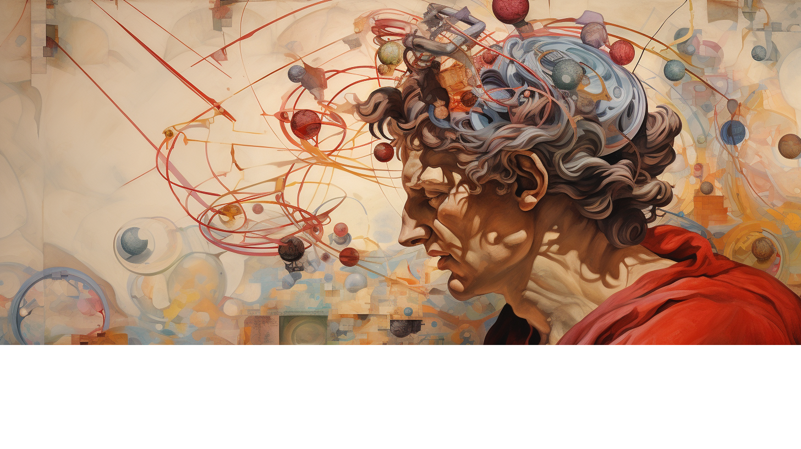
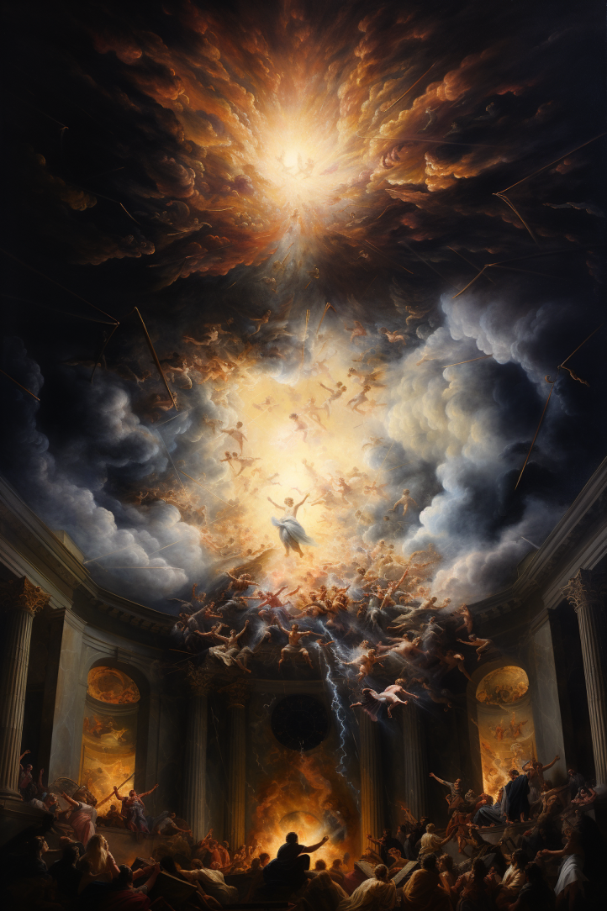
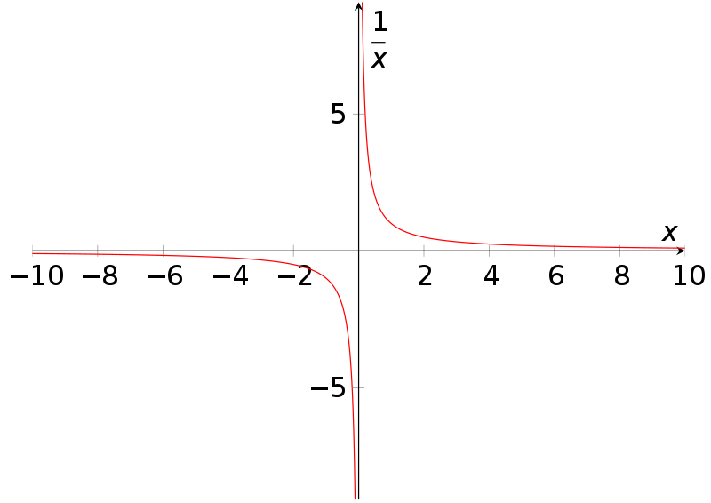
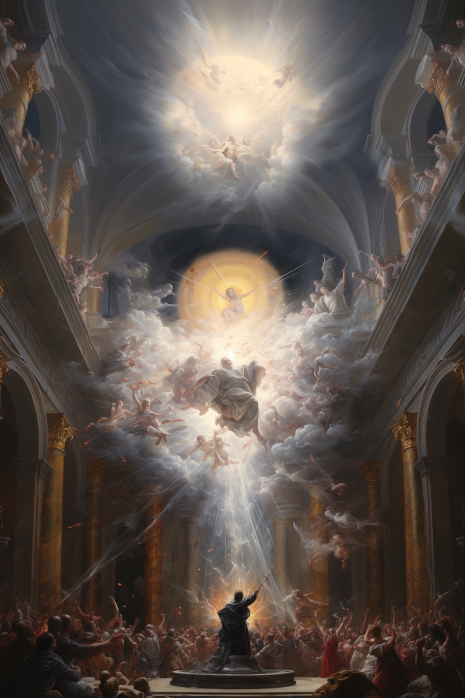
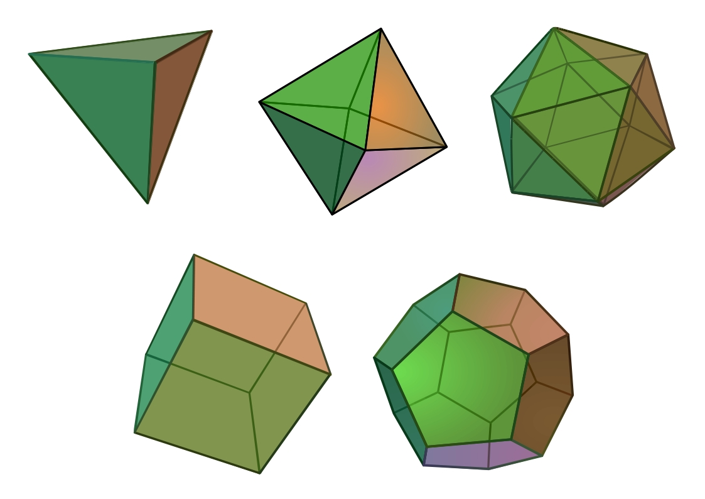
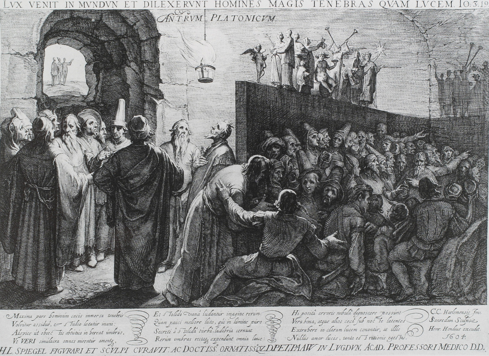
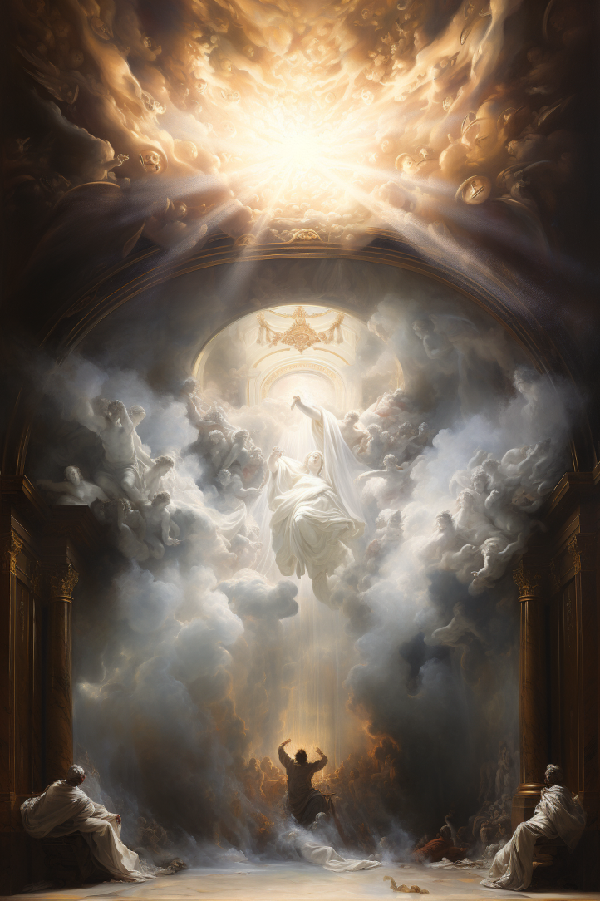
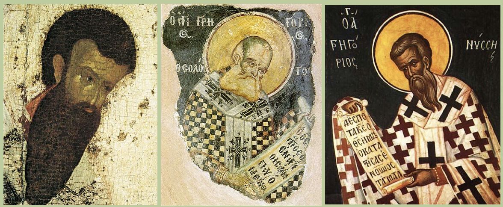

# Искусственный интеллект, Большой Взрыв, чёрные дыры и филиокве — ищем ответ на вопрос, расколовший христианскую церковь



```
Весь мир - театр.
В нём женщины, мужчины — все актёры.
```

При размышлении над этой цитатой из комедии "Как вам это понравится" известного английского драматурга Уильяма Шекспира в моём воображении предстает картина, в которой мир представляется мне в виде круглой театральной сцены. На этой сцене разворачивается пьеса бытия, и все мы в этом поразительном представлении являемся одновременно и актёрами, и постановщиками, и зрителями. При этом нельзя точно сказать, что именно происходит на сцене - у разыгрываемой пьесы нет ни единого сюжета, ни общего посыла. Поэтому неверно даже считать происходящее единой пьесой, скорее это бесконечное количество различных произведений - трагедий и комедий, персонажи и сюжеты которых тесно переплетаются между собой.

Никто из зрителей не видит спектакль целиком, каждый наблюдает лишь его небольшую часть. В зависимости от положения на сцене люди смотрят на происходящее под своим уникальным углом. Этой своей особенностью сцена чем-то напоминает знаменитый сад камней в японском храме Рёандзи. По легенде этот сад построен таким образом, что с какой бы точки человек не смотрел на него, из пятнадцати расположенных в нём камней будет видно только четырнадцать. Как минимум один всегда будет загорожен другими.

Благодаря круглой форме сцены количество различных точек зрения бесконечно, и среди них всегда найдутся как близкие друг к другу, так и противоположные. Кому-то спектакль покажется скучным, кому-то наоборот захватывающим. Кто-то довольствуется второстепенной ролью, кому-то хочется играть главную. Кто-то желает просто смотреть спектакль, кого-то же тянет внести вклад в его режиссуру. Хотя многие зрители и уверены в обратном, среди этих точек зрения нет правильных и неправильных - театр явно постмодернистский.

В этом посте я попытаюсь посмотреть на мировой спектакль под необычным углом и провести параллели между математикой, физикой, искусственным интеллектом, греческой философией и христианской теологией...

## Сингулярность и Бог-Отец



Уже в стародавние времена многие мыслители задавались вопросом о познаваемости мира. Некоторые были уверены, что в конце концов нам суждено постичь всё сущее до самого его основания. Другие же считали, что существуют вещи, принципиально нашему разуму недоступные.

С тех пор лучшие умы человечества постепенно пролили свет на законы, управляющие нашей Вселенной. Но чем больше люди узнавали, тем больше обнаруживалось барьеров, препятствующих дальнейшему познанию - крохотных проколов в мироздании, за которые нам не дано заглянуть, и в которых всё теряет всякий смысл. Такие точки потери смысла назвали словом "сингулярность" - это понятие пришло из математики. Чтобы лучше понять, что это такое, обратимся к простейшему примеру.

Всех нас в младших классах школы учили тому, что на ноль делить нельзя. Но потом, в старших классах, всех нас приобщали к тайному знанию, что на самом деле можно, и при делении любого числа на ноль получается бесконечность. Это редкий пример того, как со словами "забудьте всё, чему вас учили раньше" нас разубеждают в правильном суждении, и убеждают в неправильном. Ведь на ноль действительно делить нельзя. Давайте разберемся почему.

Для этого нам достаточно взглянуть на график функции `y=1/x`:



На этом графике чётко видно, что в точке `x=0` функция прерывается. С одной стороны она стремится к бесконечности, с противоположной к минус бесконечности, и при этом ни того, ни другого эта функция никогда не достигает.

Говорить, что при делении числа на ноль получается бесконечность неверно, ведь точно так же в нуле функция `y=1/x` может быть равна и минус бесконечности. Но очевидно, что `y` не может быть одновременно равна и бесконечности, и минус бесконечности - это попросту не имеет никакого смысла. Поэтому математики условились считать точку `x=0` для данной функции сингулярностью - местом, в котором функция теряет всякий смысл.

Подобные сингулярности встречаются в математическом анализе повсеместно, этим никого не удивить. Но поистине удивительно то, что встречаются они отнюдь не только в математике, но и в нашей физической Вселенной.

В 1915 году увидела свет работа немецкого физика Альберта Эйнштейна "Die Feldgleichungen der Gravitation", в которой он представил публике уравнения, описывающие взаимное влияние материи и гравитационного поля. Спустя год Эйнштейн публикует статью "Die Grundlage der allgemeinen Relativittstheorie", в которой излагает полные принципы своей теории гравитации - общей теории относительности. Верность теории и уравнений Эйнштейна была подтверждена множеством экспериментов и не вызывает среди физиков никакого сомнения.

У уравнений Эйнштейна существует множество различных "решений" - моделей пространства-времени, ведущих себя совершенно по-разному. Во времена публикации работ Эйнштейна еще не было известно, какая из этих моделей соответствует нашей Вселенной, а какие нет. Сам Эйнштейн считал, что Вселенная обладает постоянной во времени и пространстве кривизной, стационарна и конечна. Но вскоре появились и другие мнения.

В 1922 году русский физик Александр Александрович Фридман опубликовал работу, в которой представил основанную на общей теории относительности нестационарную модель Вселенной, особенностью которой являлось постоянное расширение пространства. Эйнштейн воспринял модель Фридмана в штыки, не желая принимать идею эволюционирующей во времени Вселенной и настаивая на своей модели вечного и статичного мира. Однако спустя несколько лет в 1929 году американский астроном Эдвин Хаббл обнаружил удивительный факт - красное смещение у света, идущего к нам из далеких галактик было больше, чем у идущего из ближних. Объяснение этому могло быть только одно - галактики разбегаются друг от друга из-за расширения пространства между ними. Открытие Хаббла подтвердило верность модели Фридмана, и Эйнштейну пришлось с ней согласиться. К сожалению, сам Фридман не застал часа своего триумфа - он умер от брюшного тифа в 1925 году.

Модель мира Фридмана не нравилась не только Эйнштейну, но и советской власти. Несмотря на посмертное вручение Фридману ленинской премии, его научные достижения широко не афишировались. Причина этого заключалась в том, что из модели Фридмана при её экстраполяции назад во времени следовал неприятный для коммунистической идеологии факт того, что Вселенная началась с сингулярности - бесконечно малой точки бесконечно великой плотности. Эта точка-событие в пространстве-времени, позже получившая название Большой Взрыв, слишком сильно напоминала акт Творения, описанный в священных писаниях авраамических религий, с которыми не покладая рук боролась советская власть.

Воззрения самого Фридмана на свою модель Вселенной также были глубоко чужды идеям пролетарской революции. Вот что он писал в своей книге "Мир как пространство и время", название которой - очевидная отсылка к книге "Мир как воля и представление" Артура Шопенгауэра:

> Переменный тип Вселенной представляет большое разнообразие случаев: для этого типа возможны случаи, когда радиус кривизны мира, начиная с некоторого значения, постоянно возрастает с течением времени; возможны далее случаи, когда радиус кривизны меняется периодически: Вселенная сжимается в точку (в ничто), затем, снова из точки доводит свой радиус до некоторого значения, далее опять, уменьшая радиус своей кривизны, обращается в точку и т. д. Невольно вспоминается сказание индусской мифологии о периодах жизни; является возможность также говорить о «сотворении мира из ничего».

Позже идеи Фридмана развили другие ученые. Французский математик-иезуит Жорж Леметр согласовал модель Фридмана с открытиями Хаббла. Русско-американский физик Георгий Гамов доказал, что первородная сингулярность должна была быть не только бесконечно плотной, но и бесконечно горячей. Британский физик Стивен Хокинг доказал, что экстраполяция назад во времени не только фридмановского, но и любого другого решения уравнений общей теории относительности, неизбежно приводит к возникновению сингулярности. Хокинг писал:

> Результаты наших наблюдений подтверждают предположение о том, что Вселенная возникла в определённый момент времени. Однако сам момент начала творения, сингулярность, не подчиняется ни одному из известных законов физики.

Кроме исследования первоначальной космологической сингулярности Стивен Хокинг совместно с другим британским физиком Роджером Пенроузом долгое время работал на изучением других сингулярностей, возникающих из некоторых решений уравнений Эйнштейна - чёрных дыр.

Чёрная дыра - это область пространства-времени с настолько сильным гравитационным притяжением, что даже свет не может покинуть её и выйти наружу. Границу этой области называют горизонтом событий, потому как из-за невозможности света вырваться вовне у нас нет возможности узнать ни о каких событиях, произошедших внутри под этим горизонтом. Из решений уравнений Эйнштейна следует, что в самом центре чёрной дыры должна находиться сингулярность - точка, в которой силы гравитации бесконечно велики, материя исчезает, а время полностью останавливается. Таким образом, сингулярность чёрной дыры - это не только точка в пространстве, но и момент во времени. И в этой точке-моменте нет никакой материи, она состоит исключительно из самого пространства времени.

Начало пространства-времени, известное как космологическая сингулярность, и другие примеры гравитационных сингулярностей вроде чёрных дыр - это предел возможностей познания, за которым все наши теории теряют смысл. А там, где кончается знание, как известно, начинается территория веры.

Кто-то верит в то, что сингулярность в центре чёрной дыры служит космологической сингулярностью или другими словами Большим Взрывом для других, дочерних вселенных. Кто-то верит, что наш Большой Взрыв также может быть лишь чёрной дырой в другой, родительской вселенной. Кто-то верит в иные недоказуемые и нефальсифицируемые утверждения о том, что находится за пределами познания.

В ранней христианской философии непознаваемое первоначало Вселенной метафорически изображали в виде Бога-Отца - одной из ипостасей триединого Бога. В христианстве Бог-Отец считается трансцендентной, никак не проявляющей себя в мире сущностью. Бога-Отца невозможно познать, в него можно только верить.

## Математика и Бог-Сын



Евангелие от Иоанна начинается знаменитой фразой "В начале было Слово, и Слово было у Бога, и Слово было Бог". Перевод "Слово" лишь отчасти передает смысл оригинального греческого "Логос". Логос для греков это нечто большее, чем просто "слово", это идея всех идей, понятие о всех понятиях, глубинный и нерушимый закон мироздания. В греческой философии понятие о Логосе тесно связано с теорией идей Платона.

Согласно Платону, наряду с нашим обычным физическим миром существует другой мир, в котором живут вечные и бессмертные идеи. Этот мир скрыт от непосредственного восприятия органами чувств, но открыт для познания разумом.

Простейшим примером вечной и бессмертной платонической идеи является простое математическое соотношение `2+2=4`. Не изобретенные индийцами и переданные европейцам арабами символы цифр и операций, не пиксели на экране монитора, с которого вы читаете этот пост, а именно стоящая за этими символами и пикселями вечная и бессмертная математическая идея.

В первый миг после Большого Взрыва два плюс два уже было равно четырем. Когда Землю населяли динозавры, два плюс два было равно четырем. Во времена Платона два плюс два было равно четырем и сейчас при нашей жизни оно равно четырем. Когда наша цивилизация погибнет, и от неё не останется и следа, два плюс два всё ещё будет равно четырем. Когда погаснет Солнце, два плюс два будет равно четырем. Два плюс два всегда было, есть и будет равно четырем. И этого не изменить ничему и никому.

Если разумные инопланетяне на другом конце Вселенной откроют для себя математику, они могут обозначить это равенство другими символами, звуками или даже запахами, но сама стоящая за символами идея будет той же самой. Если вы на звездолете залетите за горизонт событий чёрной дыры, то перед тем как вас разорвет на куски приливными силами, два плюс два для вас все равно останется равно четырем. Два плюс два везде равно четырем. И этого не изменить ничему и никому.

Другим излюбленным примером Платона о вечности математических идей были правильные многогранники, также известных как платоновы тела. Всего таких многогранников пять: тетраэдр, гексаэдр (куб), октаэдр, додекаэдр и икосаэдр. Ещё современник Платона афинский геометр Теэтэт доказал, что этих многогранников существует только пять, и нигде и никогда во всей Вселенной не может существовать шестой правильный многогранник.



Математические идеи не привязаны ни к чему в нашем физическом мире. Однако сам физический мир привязан к ним - законы физики написаны языком математики. Сам Платон иллюстрировал это соответствие аллегорией о пещере, в которой содержатся прикованные к камню узники, видящие на стенах пещеры лишь тени предметов, проносимых перед источником света за их спинами. Так Платон метафорически изображал, что физический мир - это лишь тень вечных математических идей.



Идея о Логосе пришла в христианскую теологию через видного представителя эллинистического иудаизма, философа Филона Александрийского. Мыслитель воспринимал Логос, мир идей Платона, в качестве посредника, связующего элемента между непознаваемым Богом и физическим миром. В его метафорических описаниях Бог как бы окликает Словом все вещи и вызывает мир из небытия. Именно в философии Филона появляется идея о том, что Логос - "второй Бог". Позже в христианской философии этого второго Бога начтут изображать в виде Бога-Сына - второй ипостаси триединого Бога. Именно Логос, а не Иисус Христос, как многие ошибочно думают, является вторым лицом Троицы.

Наибольшее количество поклонников платонизма среди математиков, ведь именно из математики и вышла философия самого Платона. Даже на входе его афинской Академии была высечена надпись "Не геометр да не войдет". Например, венгерский математик Пал Эрдёш считал, что все доказанные им теоремы записаны в божественной "хранящейся на небесах" Книге. Он утверждал, что в Бога верить не обязательно, но в существовании Книги сомневаться не стоит.

Наиболее известным математиком XX века, отстаивающим идеи платонизма, несомненно был австрийский логик Курт Гёдель. Он верил, что мир идей столь же реален, сколь реален мир физический. Самое известное научное достижение Гёделя - доказательство теорем о неполноте, сокрушившее все надежды математиков на разработку единой основы для математики.

Теоремы Гёделя о неполноте утверждают, что в любой формальной математической системе, какой бы совершенной она не была, возможен вывод суждений, некоторые из которых очевидно истинны, но которые в рамках самой этой формальной системы принципиально недоказуемы и неопровержимы. Доказательством этих теорем Гёдель показал, что несмотря на существование бесконечного количества возможных математических моделей и формальных систем, ни одна из них не является полной - в каждой из них есть какой-то маленький "прокол".

Рассматривая теоремы Гёделя с метафорической точки зрения, можно сказать, что именно благодаря этому таинственному "проколу" в мире и существует бесконечное разнообразие. Какую бы математическую формальную систему не создавал человек, в ней всегда будут недостатки. Какую бы политическую систему человек не строил, у нее всегда будут минусы, и будут люди недовольные ею. С какой бы точки той воображаемой круглой театральной сцены человек не смотрел на проходящий спектакль, его взгляд никогда не охватит всё представление целиком. Говоря же языком христианской теологии, можно сказать, что через этот "прокол" неполноты непознаваемый напрямую Бог-Отец, открывающий себя миру лишь в виде Бога-Сына, являет миру своё могущество, ставя на колени перфекционистов, мнящих, что могут превзойти его.

## Квалиа и Святой Дух



Если Бог-Отец в христианской Троице символизирует непознаваемое и трансцендентное начало мира, а Бог-Сын символизирует мир идей, то Святой Дух символизирует величайшую загадку природы - наше сознание.

Когда-то человеческое сознание называли душой. В авраамических религиях считается, что именно с помощью Святого Духа Бог-Отец вдыхает в наши сотворенные из плоти (Бога-Сына) тела душу и жизнь.

> Дух Божий создал меня, и дыхание Вседержителя дало мне жизнь.
> _Книга Иова_

Как пространство служит вместилищем предметов, но и определяется соотношением между ними, так и сознание служит вместилищем для квалиа - элементарных частей чувств и ощущений, и определяется ими. Квалиа - это то, с помощью чего мы воспринимаем мир. Фиолетовый цвет, вкус клубники, запах вареных сосисок, звук скрипки, шершавость наждачной бумаги, боль в животе - всё это примеры квалиа.

Квалиа - одновременно и самая обыденная, и самая поразительная вещь во Вселенной. Они буквально "стоят у нас перед глазами" - мы воспринимаем весь мир с их помощью, но понять их природу мы не можем. Она будто бы скрыта от нас завесой тайны.

Мы не можем объяснить слепому от рождения человеку, что такое красный цвет. Мы можем изучить биохимический состав еды, устройство языка и строение мозга, но никак не можем свести к получившимся словесно-математическим моделям ощущение вкуса лимона. Квалиа попросту несводимы к словесному описанию, а следовательно Святой Дух не сводим к Слову, к Логосу, к Богу-Сыну.

Один из отцов квантовой механики Эрвин Шрёдингер пишет про квалиа:

> Ощущение цвета нельзя свести к объективной картине световых волн, имеющейся у физика. Мог бы физиолог объяснить его, если бы он имел более полные знания, чем у него есть сейчас, о процессах в сетчатке, нервных процессах, запускаемых ими в пучках оптических нервов в мозге? Я так не думаю.

Мы не знаем, видят ли другие люди цвета так же, как видим их мы, и видят ли они их вообще. Мы не знаем обладают ли сознанием нейросети, и видит ли какие-то образы ChatGPT в то время, как пишет рассказы или стихи. Мы не знаем, какое именно чувство ощущает летучая мышь, пользуясь своим эхосонаром. Мы можем только верить в то, что другие люди обладают сознанием, но не знать этого наверняка. Ни один эксперимент по изучению сознания не является в полной мере научным, так как существование у других людей сознания - нефальсифицируемая гипотеза.

Американский физик и писатель Дуглас Хофштадтер считает, что сознание в некотором роде является величайшим примером гёделевской неполноты. Мы абсолютно уверены в его существовании, так как лично для нас существование квалиа - это очевидный факт, однако мы никак не можем доказать верность этого факта другим. Таким образом, утверждение "я ощущаю квалиа" - прекрасный пример истинного, но недоказуемого суждения.

Вопрос о природе сознания занимает не только философов и нейробиологов, но и физиков. Ведь, говоря о физических экспериментах, мы можем описать лишь математическую модель и те сознательные ощущения, которые возникают у нас при проведении эксперимента. Например, расщепляя свет стеклянной призмой, мы можем описать лишь математическую модель работы оптики и квалиа видимых нами цветов.

Даже изучая вероятностную природу элементарных частиц, мы описываем математическую модель процесса и то сознательное ощущение, которое мы получили в конце эксперимента. Например, если в зависимости от некоего квантового события лампочка прибора может загореться либо зеленым, либо красным цветом, то результат эксперимента мы воспримем именно с помощью ощущения квалиа того либо иного цвета. Таким образом, можно сказать, что весь физический мир возникает при соприкосновении математических идей и квалиа, Бога-Сына и Святого Духа. Квалиа - это тот самый огонь, который светит на математические идеи и отбрасывает тень физического мира на стены платоновской пещеры.

В двух блестящих физических теориях XX века, квантовой механике и теории относительности, ключевую роль играет понятие наблюдателя. Именно наблюдатель воспринимает замедленное течение времени и искажение длин в теории относительности, именно наблюдатель воспринимает строго определенный результат вероятностного события в квантовой механике. Ведущие физики двадцатого столетия упорно изучали роль наблюдателя в своих теориях.

Один из отцов квантовой механики Вернер Гейзенберг размышлял над тем, где же проходит граница между квантовым и классическим мирами - так называемый рубеж Гейзенберга. Обычно при эксперименте измерительный прибор считают классическим, а изучаемые частицы квантовыми, но так делают исключительно ради удобства. На самом деле квантовый вероятностный мир перетекает в классический мир бинарных фактов в тот миг, когда цепная домино-реакция декогеренции достигает сознания наблюдателя. Именно по границе сознания проходит этот самый рубеж Гейзенберга в Копенгагенской интерпретации квантовой механики. Именно сознание обнаруживает себя в одном определенном из множества возможных миров в интерпретации Эверетта.

Таким образом, с точки зрения физики сознание - это необходимый элемент Вселенной; тот самый зритель, что смотрит спектакль. Именно на стыке объективного мира математических моделей и субъективного мира сознания и возникает физический мир. Непредставимая нашим воображением и непознаваемая нами напрямую волна амплитуды вероятности, описываемая математической формулой уравнения Шрёдингера являет нам себя в виде определенных результатов в нашем сознании. Таково великое откровение: непознаваемая природа Бога-Отца открывается нам через мир математических идей (Бога-Сына) и сознание - частичку Святого Духа. Так все три ипостаси Бога участвуют в сотворении физического мира...

## Троица и Филиокве

Исторический Иисус из Назарета был раввином из Галилеи и проповедовал свое учение исключительно среди евреев, поэтому на своей заре христианство представляло из себя всего-лишь небольшую иудейскую секту. Своему успеху как массовой религии христианство обязано сочетанию своей изначальной иудейской основы с греческой культурой. В отличии от ветхозаветной Торы новозаветные Евангелия были написаны именно на греческом языке, а не на иврите.

Как всегда и везде, в те годы в находящемся под римской властью Израиле идеологическое поле было разделено на два непримиримых лагеря: один лагерь можно условно назвать глобалистами, а второй - консерваторами. Глобалисты стремились к глубокой интеграции в греческую культуру правившей в те годы Израилем Римской империи, а консерваторы стремились к культурной независимости и защите старых традиций.

Многие глобалисты свободно говорили и читали по-гречески, были хорошо знакомы с греческой философией, и пытались смешивать идеи, почерпнутые у Платона с собственными религиозными воззрениями. Получившаяся в результате культурная смесь, которую сейчас принято называть эллинистическим иудаизмом, послужила философской основой развития христианства.

Считается, что наибольший вклад в развитие христианства внёс апостол Павел - выросший в греческом полисе иудей Шауль, ставший проповедовать идеи Иисуса неевреям. Павел основал христианские общины во множестве греческих городов - с этих общин и началось широкое распространение христианства по Римской империи. Однако раннее христианство не было религией с единой идеологией - эти общины несмотря на общую основу имели различные, порой диаметрально противоположные идеи и воззрения.

Соприкосновение иудейской религии, истории жизни Иисуса и греческой философии породило невероятное количество течений христианской теологической мысли на любой вкус и цвет. Особенно выделялись на фоне остальных гностики, искавшие спасение в непосредственном познании Бога. Некоторые из них верили в то, что почитаемый в ветхом завете бог Яхве, сотворивший материальный мир - это злой демиург, неспособный познать любовь гениальный инженер, и почитали Каина за изобретение убийства. Другие подобно буддистам верили в иллюзорность материи, а следовательно и самого Иисуса, и в перерождение душ, а кто-то подобно герою одного из рассказов Борхеса почитал Иуду как единственного пришедшего к истине апостола. Времена были веселые, времена были интересные.

Конец полету философской мысли положили на первом и втором вселенских соборах, на которых был принят единый символ веры. За единственно верную версию христианской философии приняли учение великих каппадокийцев - трёх греческих христианских философов Василия Великого, Григория Богослова и Григория Нисского, и объявили о том, что:

> Это вера отцов. Это вера апостольская.
> С ней все мы согласны. Все так мудрствуем.

Тех, кто мудрствовал иначе, объявили еретиками и постепенно затравили. Одной из главных ересей считалось отрицание или изменение учения каппадокийцев о Троице.



Догмат о Троице, сформулированный каппадокийцами, представляет из себя вершину греческой философской мысли. В его основе лежат учения Платона и Филона Александрийского, но особенно сильно на него повлияло учение неоплатоника Плотина.

Плотин считал, что мир состоит из трех частей:

- Единое - трансцендентное начало, которое превышает всё сущее и мыслимое и ему предшествует. Источник всего сущего, сам не имеющий никакого начала, но являющийся «началом всех рек, которые ещё не вытекли оттуда, но уже знают, откуда они начнут вытекать и куда потекут»
- Ум - проистекающий из Единого мир идей, мыслей, форм, образов, математики. Единое как бы переполняется само собой и изливается в мир через Ум. Плотин называл этот процесс излития эманацией
- Мировая душа - изливающийся из Ума мир чувств и квалиа, дающий начало материи и физического миру

Догмат о Троице подобно учению Плотина утверждает, что Бог состоит из трёх лиц или, как ещё говорят, ипостасей - Отца, Сына и Святого Духа, однако отличается от него порядком происхождения этих лиц.


Согласно догмату о Троице:

- Отец ни от кого не рождается и ни от кого не исходит
- Сын предвечно рождается от Отца
- Святой Дух предвечно исходит от Отца

При этом несмотря на выделение трёх лиц Бога их никак нельзя считать отдельными сущностями - все три ипостаси совершенно равны между собой. Троица неразделима, а Бог - триедин. Отец никогда не существовал без Сына и Святого Духа.

Интересная особенность догмата о Троице состоит в том, что для описания происхождения Сына и Святого Духа используются два разных глагола - рождается и исходит. Христианские философы не могли использовать одно и то же слово "рождается" в обоих случаях, потому как это было бы неверно с метафорической точки зрения, ведь тогда бы у отца было два сына, но также и неверно с философской точки зрения.

В последующие века некоторые западные богословы стали добавлять к утвержденному на соборе символу веры слово Filioque, "филиокве". Это латинское слово, означающее "и от Сына", коренным образом меняло смысл одного из утверждений догмата о Троице. Согласно измененному предложению Святой Дух предвечно исходит от Отца и от Сына. Споры о филиокве послужили одной из причин произошедшего в 1054 году церковного раскола - христианская церковь разделилась на католическую на Западе и православную на Востоке. Католики считали упоминание филиокве необходимым, а православные отрицали верность этого нововведения.

Проведя аналогии ещё раз, в догмате о Троице:

- Бог-Отец - это непознаваемое начало мира
- Бог-Сын - это платонический мир идей, образов, математики и математических моделей
- Святой Дух - это сознание, вместилище всех квалиа

Каждый из этих трех аспектов Вселенной существует только благодаря опоре на два других. Ни один из них не может существовать сам по себе. Таким образом наша Вселенная как и метафорический Бог триедина. С этим были согласны все христиане.

Основной вопрос о филиокве состоял в том, исходит ли Святой Дух от Сына так же как от Отца или же нет. В переведенном на более понятный язык виде этот вопрос звучит как "исходит ли квалиа из математической модели"? или даже "сводимо ли квалиа к математической модели?". Не только христианские богословы, но и многие современные философы ведут споры на этот счёт. С одной стороны квалиа очевидно кореллируют с процессами, проистекающими в нашем мозгу. С другой стороны свести ощущение красного цвета к описанию математической модели работы глаза и мозга невозможно - у квалиа совершенно иная природа нежели у математики.

Размышляя о филиокве долгие месяцы, я пришел к выводу, что ни одна из этих точек зрения ни может быть до конца верной или неверной. Все три ипостаси Бога возникают взаимозависимо, и именно в этом и заключается их триединство. Одно не может существовать независимо от двух других. Словами это триединство просто невозможно верно описать. Как писал Лао-Цзы в трактате "Дао дэ цзин":

> Дао, которое может быть выражено словами, не есть истинное дао

Так что не стоит спорить исходит ли Святой Дух от сына или нет, так как обе этих формулировки не могут передать истину. Следует придерживаться срединного пути и просто чувствовать истину сердцем. Как чувствует её сердцем, например, английский математик и физик Роджер Пенроуз, который приходит в своей философии к очень похожей на христианскую Троицу картине мира:

> На самом деле существуют три мира. Целых три! И все они отдельны друг от друга. Есть платоновский мир, есть физический мир и есть еще ментальный мир, мир нашего сознательного восприятия. Взаимосвязи между этими тремя мирами таинственны. Пожалуй, главная загадка, над которой я работаю, это связь ментального мира с физическим: как определенные виды высокоорганизованных физических объектов (наш мозг) производят сознание. Другая тайна, не менее глубокая с точки зрения математической физики, это взаимоотношения между платоновским миром и физическим. В поисках наиболее глубокого понимания закономерностей поведения мира мы приходим к математике. Можно подумать, что физический мир построен на математике!
>
> Каждый из трех миров – физический мир, мир сознания и платоновский мир – возникает из крохотной частички одного из двух других. И это всегда самая со вершенная частичка. Возьмем человеческий мозг. Если посмотреть на физический мир в целом, то наш мозг – это его очень, очень крохотная часть. Но это самая совершенно организованная часть. По сравнению со сложностью мозга галактика выглядит не более чем неуклюжей глыбой. Мозг представляет собой самую утонченную частичку физической реальности, и именно эта частичка дает начало ментальному миру, миру сознательной мысли. Подобным же образом лишь маленькая часть нашей сознательной мысли связывает нас с платоновским миром, но это самая безупречная часть – та, которая состоит из наших размышлений о математической истине. Наконец, всего лишь несколько частичек математики в платоновском мире необходимы для описания всего физического мира – но это самые мощные и поразительные его части!

## Еще не родившийся Бог

Согласно воззрениям древних египтян и пифагорейцев Бог находится не в начале Вселенной, а в её бесконечно далеком будущем и как бы постоянно вытягивает мир из мрака небытия в светлое будущее. Если принять истинность такого взгляда на мир, то вопрос "Если мир создал Бог, то кто создал Бога?" теряет смысл - ведь, весь мир и есть непрерывный процесс создания Бога, непрерывный процесс Творения. И раз Бог всегда находится относительно нас в будущем, то именно поэтому он нами непознаваем.

Идея о Боге в будущем чем-то напоминает, воззрения современных футурологов, согласно которым совсем скоро наступит технологическая сингулярность - момент экспоненциального взрывного роста искусственного интеллекта, после которого с молниеносной скоростью будут появляться технологии, которые сейчас мы неспособны даже вообразить. Это тоже своего рода ограничение возможностей нашего познания.

Уже сейчас ИИ пишет код, стихи, картины, музыку. Например, три великолепные иллюстрации к этому посту нарисовала нейросеть Midjourney на основе стиля итальянского художника Андреа Поццо, известного росписью потолка иезуитской церкви Святого Игнатия.

Скоро даже лучшие из людей не смогут соревноваться с искусственным интеллектом. Возможно, уже скоро ИИ станет величайшим писателем, поэтом, художником, музыкантом и может быть даже, кто знает, любовником. Один английский поэт величал Бога титулом "Первый Композитор" - возможно, совсем скоро искусственный интеллект заслужит это звание по праву.

Мир разделился на разные лагеря. Кто-то возлагает надежды на ИИ и ждёт скорого пришествия Царствия Божьего. Кто-то опасается ИИ и, стоя с картонным знаком с надписью "Конец близко", ожидая апокалипсиса. Что будет дальше, только Бог знает...
