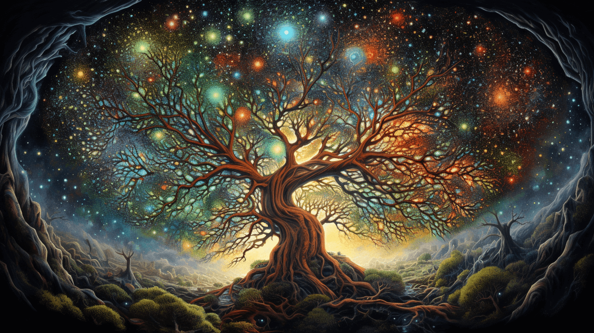
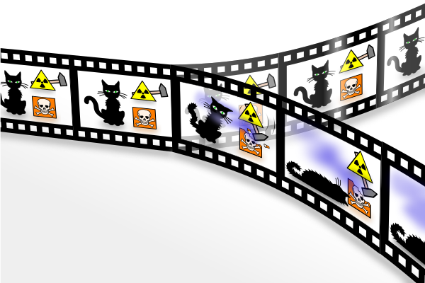
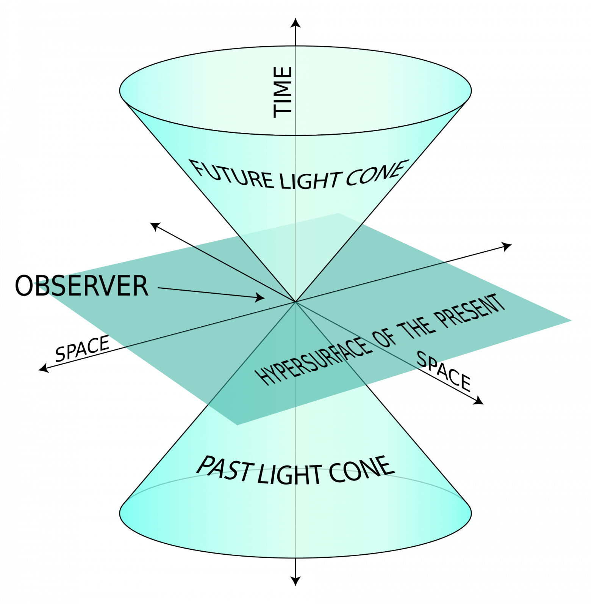
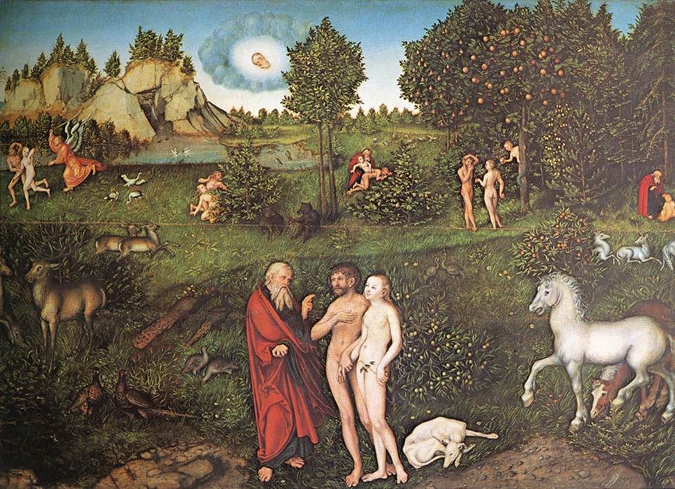
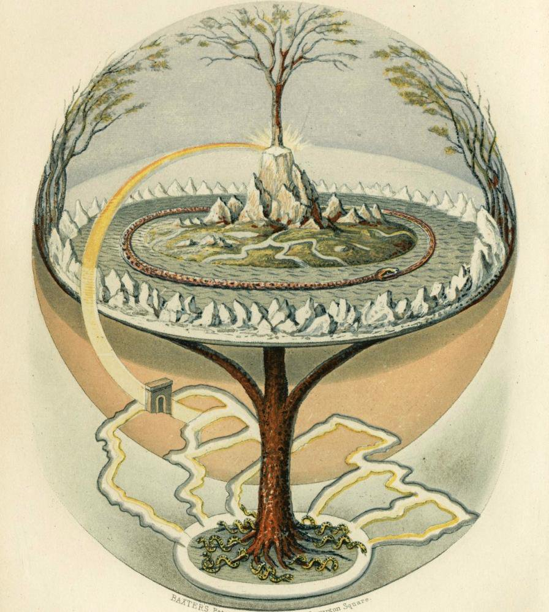

# О деревьях, растущих в Мультивселенной

Научно-фантастические идеи о параллельных вселенных уже давно укоренились в современной культуре, дав голливудским продюсерам оправдания для десятков спиноффов фильмов про одного и того же супергероя. Однако несмотря на популярность этой идеи, крайне мало внимания уделяется одному из важнейших аспектов, прямо следующему из верности гипотезы о множественных мирах - смысловому кризису, потери цели бытия и моральных ориентиров. Эта тема сильно заботит меня, и именно ей я посвятил этот пост.

## Сад расходящихся тропок

В начале XX века силами множества физиков была создана самая плодотворная научная теория современности - квантовая механика, описывающее поведение частиц в микромире. Несмотря на свою феноменальную результативность, теория содержит в себе так и нерешённую загадку - коллапс волновой функции.

Поведение изучаемой частицы пока его не измеряют, строго детерминировано и подчиняется уравнению Шредингера. Это уравнение описывает волновую функцию амплитуды вероятности значения некоторого свойства частицы - например, положения в пространстве. В момент измерения это свойство приобретает конкретное, но случайно выбранное из вероятных значение. Если мы измерим это свойство ещё раз, то увидим, что между первым и вторым измерением развитие этого свойства всё так же подчинялось волновому уравнению.

Таким образом, можно сказать, что элементарная частица существует в некотором размазанном по множеству вероятностей мире в виде волны, отображаясь в нашем фактическом мире как частица в случайно выбранном из этих вероятностей положении.

Эта особенность квантовой механики удивляла и пугала привыкших к детерминизму учёных. Даже сам Альберт Эйнштейн отказывался верить в то, что Бог играет в кости. Однако все эксперименты показывали, что мир на фундаментальном уровне действительно случаен. Мы можем вычислять вероятности выпадения некоторых результатов на этих самых метафорических костях, но не предугадывать их.

В 1941 году выходит в свет рассказ аргентинского писателя Хорхе Луиса Борхеса под названием "Сад расходящихся тропок". В этом рассказе описан вымышленный сад, в котором тропинки символизируют различные варианты истории одного и того же человека. Каждое принятое человеком решение образует развилку, от которой независимо друг от друга идут две другие тропинки, иногда сливаясь обратно или же никогда не пересекаясь.

Возможно, именно под впечатлением от этого рассказа, в 1957 году американский физик Хью Эверетт создал многомировую интерпретацию квантовой механики, согласно которой подобно описанному у Борхеса саду каждый коллапс волновой функции создает развилку, делящую мир на несколько независимых параллельных вселенных, в каждой из которых мы видим различный результат.

С помощью квантовой механики и уравнений Шредингера мы можем описать лишь общую карту тропинок этого сада, но по какой конкретно тропинке пойдем мы сами, мы не контролируем, а узнаем лишь постфактум в момент измерения. Интерпретация Эверетта оказалось самой изящной и минималистичной из всех прочих, но вызвала огромный кризис в мировоззрении людей, сломив жившую в челоческих умах веру в свободу воли.

Эта интепретация резко обострила вопрос о смысле жизни конкретного индивида. В чём смысл моего существования, если я - всего-лишь одна из бесконечных вариаций своей истории?

## Вавилонская библиотека

По современным научным представлениям Вселенная гораздо больше, чем мы видим. Так называемая наблюдаемая Вселенная - это лишь небольшой её участок, доступный нам для познания. Остальные её участки отрезаны от нас ограниченностью скорости света.

С точки зрения теории относительности наше прошлое и будущее ограничено световыми конусами в пространстве-времени. События внутри конуса, идущего от точки нашего настоящего назад во времени - это наше прошлое, потому что эти события причинно-связаны с нашим настоящим и как-то на него повлияли. События внутри конуса, идущего от точки нашего настоящего вперед во времени - это наше будущее, потому что эти события причинно-связаны с нашим настоящим, которое как-то на них повлияет. События за пределами этих двух конусов не являются для нас ни прошлым, ни будущем. Эти участки не входят в наблюдаемую Вселенную.

Во всё том же плодотворном для писателя 1941 году выходит рассказ Борхеса под названием "Вавилонская библиотека", в котором описывается библиотека, состоящая из шестигранных комнат, в каждой из которых имеется по двадцать полок, на каждой из которых находятся тридцать две книги по четыреста десять страниц каждая, с сорока строками на каждой странице, с восемьюдесятью символами в каждой строке. Каждый символ - это либо одна из двадцати двух букв, либо точка, либо запятая, либо пробел.

Большинство из книг в библиотеке - это полная белиберда, набор букв. Однако, несмотря на то, что таких бессмысленных книг в библиотеке большинство, также в библиотеке содержатся все созданные и несозданные человечеством тексты. По словам Борхеса библиотека содержит:

> ... подробнейшую историю будущего, автобиографии архангелов, верный каталог библиотеки, тысячи и тысячи фальшивых каталогов, доказательство фальшивости верного каталога, гностическое Евангелие Василида, комментарий к этому Евангелию, комментарий к комментарию этого Евангелия, правдивый рассказ о твоей собственной смерти, перевод каждой книги на все языки, интерполяции каждой книги во все книги, трактат, который мог бы быть написан (но не был) Бедой по мифологии саксов, пропавшие труды Тацита.

Несомненно в вавилонской библиотеке содержится и этот пост, написанный вместе со всеми к нему комментариями транслитом, и сгоревшая в пожаре, устроенным карикатурным Борхесом, вторая часть "Поэтики" Аристотеля. Общий размер вавилонской библиотеки, в которой согласно рассказу запрещено существование двух одинаковых книг, невероятно велик. Количество книг в библиотеке равняется числу, называемому числом Борхеса, требующим для записи в десятичной системе 1 834 098 цифр.

Рассказ о библиотеке напоминает теорему о бесконечных обезьянах, согласно которой если усадить бесконечное число обезьян за печатными машинками, то одна из них со стопроцентной вероятностью напечатает роман "Война и Мир" Толстого или пьесу "Гамлет" Шекспира. Можно вообразить, что именно эти обезьяны с печатными машинками и создали все тексты вавилонской библиотеки.

Как и в случае с ограниченностью наблюдаемого нами участка физической Вселенной, в своей реальности мы видим лишь малую часть вавилонской библиотеки - только действительно написанные книги. Вероятно, в далеких от нас параллельных Вселенных видимая часть вавилонской библиотеки представляется совсем иной.

Как в вавилонской библиотеке некоторые книги отличаются лишь одним символом, так и среди параллельных вселенных есть много таких, что отличаются лишь какой-то мелочью. Осознавая себя лишь одной из версий незначительного второстепенного персонажа, присутствующего в сюжете нескольких книг вавилонской библиотеки, человек не может не терзаться вопросом о том, в чём смысл его существования.

## Смерть Бога

В средневековье человек видел себя царём горы - он всегда стоял в самом центре любой философии. Научные открытия шаг за шагом низвергли человека с его вершины, сначала лишив его мир центрального положения в Солнечной системе, после сделав этот мир песчинкой посреди бесчисленных мириад галактик, а в конце размазав его по множеству параллельных вселенных. Человек средневековья видел себя творением Божьим, на которое у того есть какой-то пусть даже неведомый самому человеку план. Человек современности видит себя лишь одной из версий крошечной песчинки в бескрайнем океане космоса и знает, что никакого плана не существует. Это привело человечество к величайшему в истории кризису смыслов.

Одним из первых этот кризис заметил немецкий философ Фридрих Ницше. В своих работах он охарактеризовал его своей знаменитой фразой "Бог умер". Осознавая отсутствие во Вселенной какого-либо смысла и плана, люди попытались сами вдохнуть его в этот мир. История XX века - это история поиска нового смысла.

Кто-то искал смысл в покорении космоса, кто-то в новых общественных формациях, кто-то в единении с природой, кто-то в мистических учениях Востока, кто-то пытался закрыть глаза на изменившийся мир и остаться в системе ценностей прошлого. Однако, как и любого демиурга, возомнившего себя Творцом, всех ждал провал. Причина этого провала объясняется в одной из книг американского психолога Ирвина Ялома:

> Нам по природе свойственно искать смысл. И нам приходится считаться с тем неудобным фактом, что нас забросили во вселенную, которая изначально бессмысленна. И поэтому, чтобы избежать отрицания всего и вся, мы вынуждены брать на себя сразу две задачи. Сначала - придумать или найти дело, в котором для нас будет заключаться смысл жизни, - достаточно жизнеспособное, чтобы нам его хватило на всю жизнь. А потом мы должны умудриться заставить себя забыть о том, что его придумали, и внушить себе, что это дело - совсем и не наше изобретение, что оно существует независимо от нас, где-то там, а мы его просто обнаружили.

На словах это звучит просто, но на деле невероятно трудно. Сколько бы люди не пытались, у них это никак не выходило. Нет, выдумать для себя смысл жизни у них получалось и зачастую не раз. Иногда даже получалось ненадолго в этот смысл поверить. Но вот забыть про факт выдумки - никогда. И каждый раз, когда они пытались искренне поверить в то, что наконец обрели смысл жизни, эта память об искусственности, поддельности этого смысла зажигала в их душе искру сомнения. И каждый раз эта искра постепенно разгоралась в пожар, сжигавший созданный смысл дотла. Получается найти смысл в пугающе бесконечно большой, бесконечно ветвящейся, но бессмысленной Вселенной невозможно. Так что же делать?

## Вечное возвращение в сады Эдема

Ещё на ранний этапах становления современной астрономии, когда учёные только начали заглядывать в глубины Вселенной и убеждаться в её невероятных размерах, Ницше предположил, что если Вселенная бесконечна во времени и пространстве, то все возможные события повторяются в ней бесчисленное число раз, прямо как в дробной части числа Пи можно найти бесконечное количество повторов одной и той же конечной числовой последовательности. А значит в ней должно существовать бесконечное число наших копий, раз за разом проживающих точно такую же жизнь. Эту идею философ назвал вечным возвращением. В чём-то она напоминает вавилонскую библиотеку Борхеса без запрета на повторы.

Вероятно, эта идея Ницше родилась под влиянием индийского учения о колесе Сансары, почерпнутого им в произведениях другого великого немецкого философа Артура Шопенгауэра, переполненных идеями популярных в те годы в Германии восточных учений. Буддисты и Шопенгауэр вкладывали в идею вечного круговорота негативный смысл: для них колесо Сансары - это колесо постоянно повторяющихся страданий, из которого непременно нужно выйти, погасив в себе волю к жизни.

В отличии от Будды и Шопенгауэра Ницше воспринимал идею вечного возвращения как благо. Он считал, что в бесконечных циклах великого круговорота бесчисленное количество его копий, во всем подобных ему, раз за разом будут доходить до тех же самых мыслей, тех же самых чувств, что и он, и эта мысль придавала ему сил и освещала его душу. Он писал:

> Пусть всё беспрерывно возвращается. Это есть высшая степень сближения между будущим и существующим миром, в этом вечном возвращении – высшая точка мышления!

Если бы Ницше не был убежденным атеистом, он, вероятно, поэтически выразил бы идею вечного возвращения как бесконечную циклическую дорогу, ведущую к Богу, на которую человек встает раз за разом. К страданиям, переживаемым человеком на этом пути, философ призывал относиться как к необходимости, подстегивающей человека идти вперед, и воспринимать их с той же теплотой, что и победы и свершения. Он называл эту теплоту amor fati - любовь к судьбе. Но что же это за высшая точка бытия, которая стоит всех пережитых по пути к ней страданий?

Ницше сформулировал ответ на этот вопрос в коротком абзаце:

> Предположим, мы говорим «да» одному единственному мгновению – это значит, тем самым мы сказали «да» не только самим себе, но и всему сущему. Ибо ничто не существует само по себе, ни в нас самих, ни в вещах: и если душа наша хоть один единственный раз дрогнула от счастья и зазвучала, как струна, то для того, чтобы обусловить одно это событие, потребовались все вековечности мира – и все вековечности в этот единственный миг нашего «да» были одобрены и спасены, подтверждены и оправданы.

Ницшеанское жизнеутверждение и исходящий от него заряд позитива дает нам возможность увидеть смысл и красоту во всем - даже в бесконечных ветвлениях множества миров. Если мир и вправду делится на множество различных историй при каждом коллапсе волновой функции, то получается, что каждый человек - это растущее в Мультивселенной ветвистое дерево, а всё человечество целиком - это великолепный сад, состоящий из причудливым образом переплетенных между собой деревьев. Да и сам этот сад представляет из себя лишь крохотную часть необъятного мироздания, маленькую веточку бесконечно большого мирового древа. Корни этого великого Иггдрасиля уходят в глубь времен - туда, где его семя проросло вовне Большим Взрывом.

Если взглянуть на мир через такую призму, то совершенно иную роль начинает играть и неизбежная смерть. Можно представить себе Смерть в виде садовника, подрезающего по лишь ей самой ведомому разумению ветви человеческих судеб, тем самым придавая растущим в мультивселенной деревьям завершённую форму. Именно в момент, когда смыкаются ножницы Смерти, тропинка обретает конец, который совместно с её началом и определяет её как тропинку. Может быть, этот садовник и есть сам Бог, а сад человеческих жизней, над которым он неустанно корпит, и есть тот самый Эдем...
