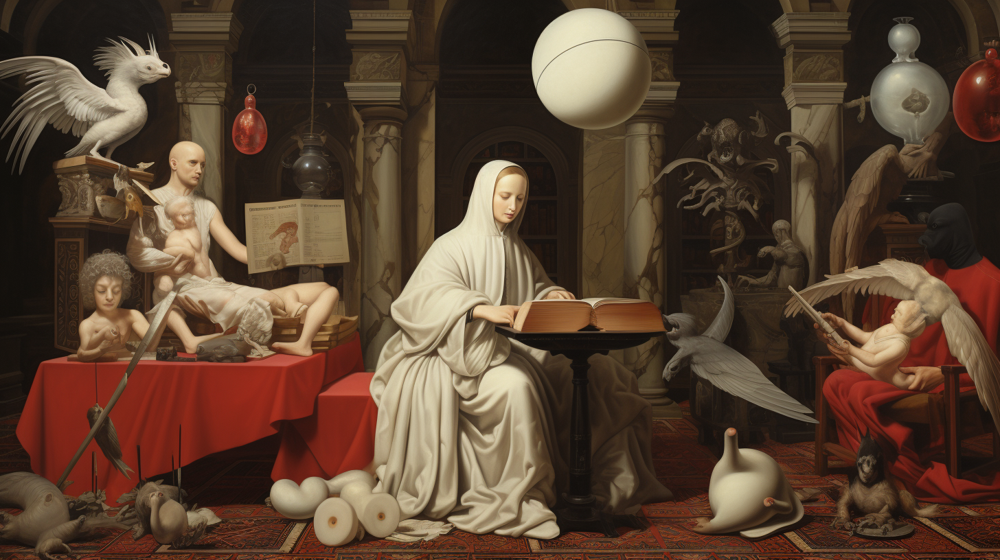

# Как управлять Вселенной, не покидая психиатрической лечебницы

Почти под каждым моим постом на Хабре восхищенные читатели пишут мне доброжелательные комментарии вроде этого:

> Автору с таким перепутанным мировоззрением светит только психиатрическая палата или монастырь (первое предпочтительнее - там есть лечение и хоть какие-то перспективы)

Наивно полагать, что мягкие стены остановят полет мысли, ведь управлять Вселенной можно и оттуда.

## Психиатрическая лечебница

> Мир изменился.  
> Я чувствую это в воде, чувствую это в земле, ощущаю в воздухе.  
> Многое из того, что было — ушло.  
> И не осталось тех, кто помнит об этом.  
> Властелин Колец: Братство Кольца.
>
> _Дж. Р. Р. Толкиен_

Хочется нам того или нет, но мы живем в эпоху перемен. Происходит слом старого мира, но нам еще далеко до нового порядка. Я прекрасно чувствую это на себе: я родился на Украине, вырос в России и провел много лет в Израиле - в момент написания статьи на всех моих трех родинах нет покоя.

Некоторые из читателей Хабра недавно покинули родные края, некоторые остались дома, но все без исключения сейчас испытывают невзгоды: эмигранты не чувствуют земли под ногами - чужие на родине, чужие на чужбине, а оставшиеся чувствуют на себе все тяготы политических и экономических противостояний. Независимо от взгляда на мир и те или иные происходящие в нем события, всем кажется, что за последние несколько лет мир рухнул и превратился в огромную психиатрическую лечебницу, отданную на самоуправление пациентам, в которой всё происходящее, кажется, не имеет никакой внутренней логики.

Со всех сторон льются потоки информации, рекламы и пропаганды. Друг другу противостоят феминистки и инцелы, социалисты и либертарианцы, "ура-патриоты" и "национал-предатели", сциентисты и плоскоземельцы, религиозные фанатики и воинствующие атеисты, SJW и Q-Anon, масочники и антипрививочники, криптоэнтузиасты и выживальщики, продавцы успешного успеха и проповедники духовной духовности. Астрологи, нумерологи и тарологи захватили социальные сети, а вот искусственный интеллект в отличии от биологического бьет все рекорды и грозит отобрать у нас рабочие места и смысл жизни. Новости из Babylon Bee и ИА Панорама стали неотличимы от реальности, а от взгляда на первую страницу настоящих новостей возникает непрекращающееся чувство тревоги. Всё это пугает и приводит в смятение.

К сожалению, покинуть эту психиатрическую лечебницу мы не в силах, так как от отбытия в материальный высший мир мы надежно зафиксированы смирительной рубашкой гравитации, а от отбытия в нематериальный высший мир нас крепко удерживает так сильно порицаемая буддистами привязанность к иллюзии собственного существования. К счастью, кроме двух очевидных и столь же очевидно неправильных путей, есть особый третий путь - посмотреть на головоломку под другим углом и понять, что дверь на свободу не просто не закрыта, а никакой двери попросту нет.

## Элементарная частица бытия

На протяжении всей истории человечества мыслителей интересовал вопрос о том, из какого материала построено мироздание, есть ли у этого материала какая-либо одинаковая неделимая часть - этакий элементарный кирпичик бытия. Древнегреческий философ Демокрит назвал такой кирпичик словом "атом", что и значит "неделимый".

В конце XIX века учёные действительно обнаружили, что всё вещество во Вселенной состоит из одинаковых крошечных частей, которые так и назвали - атомы. Однако дальнейшее исследование выявило, что атомы вовсе не неделимы, а состоят из ещё меньших частей - элементарных частиц. Когда же учёные стали исследовать поведение элементарных частиц и открывать законы квантовой механики, то реальность и вовсе начала рассыпаться у них на глазах.

Оказалось, что элементарные частицы проявляют свойство корпускулярно-волнового дуализма. С одной стороны, при рассмотрении эволюции их состояния во времени, они ведут себя как волна, с другой стороны, в эксперименте они проявляют себя строго в виде частицы с определенным значением этого состояния. Более того, учёные осознали, что нельзя вообще сказать, что у элементарной частицы есть какое-либо состояние, пока не был проведен эксперимент, и его значение не было измерено. Оказалось, что элементарные частицы вовсе не материальны в повседневном смысле этого слова, а являются скорее математической абстракцией, чем "кирпичиком бытия". Но что же тогда лежит в основе всего?

Примерно в одно время с основополагающими работами по квантовой механике увидела свет книга австрийского философа Людвига Витгенштейна "Логически-философский трактат". В этой книге Витгенштейн предложил считать основными единицами бытия факты. Эта философская концепция хорошо сочеталась с открытиями физиков, из которых следовало, что непознаваемая нашим разумом волна проявляет себя в мире в виде частицы - факта, установленного измерением.

Концепция рассмотрения мира как набора фактов стала популярна среди учёных и позже развилась в теории американского физика Джона Арчибальда Уилера под названием "It from bit" в концепцию рассмотрения мира как информации. В такой картине мира элементарным "кирпичиком" бытия является не просто факт, а его минимальная составляющая - бит информации.

## Сотворение мира

> И сказал Бог: сотворим человека по образу Нашему и по подобию Нашему.  
>
> _Бытие 1:26_

На мышление среднего европейца вне зависимости от его религиозности наложили свой неизгладимый отпечаток авраамические религии, в священных писаниях которых Бог создает мир из полного небытия. Но в отличии от авраамических религий в большинстве космогонических мифов индоевропейских народов мира боги не творят мир из пустоты, а придают порядок уже существующему изначальному хаосу. Так например, в германо-скандинавской мифологии бог Один лепит мир из тела олицетворяющего первобытный хаос великана Имира, порожденного двумя противоположностями - льдом и пламенем.

Концепция сотворения мира из предсуществующего материала была близка и некоторым античным философам, а также раннехристианским гностикам. Например, древнегреческий мыслитель Аристотель считал, что Бог не создавал материю, а нашёл её уже готовой и слепил из неё мир. Недаром одним из главных эпитетов, используемых для обозначения божественного начала, в греческой философии и гностицизме служит слово "Демиург", означающее "ремесленник". Греки представляли создателя Вселенной подобным гончару, взявшему глину и придавшему ей форму горшка.

Для нас глиной может служить мир фактов, из которого мы можем подобно греческому Демиургу слепить свой собственный мир. Нам лишь нужно самим создать ту линзу, сквозь которую мы будем смотреть на мир, и которая будет придавать общую структуру одним фактам и отсеивать другие. Конечно, созданный нами мир не будет лишен врожденных недостатков, метко отмеченных Умберто Эко:

> Как только вы начали возиться с глиной, пускай даже электронной, вы — Демиург. И от этого никуда не деться, а кто собирается сотворить мир, тот неизбежно уже запятнан и ошибками и злом

Однако, несмотря на это, способность творить собственные миры - это именно то, что уподобляет нас Богу, "создавшему нас по своему образу и подобию" и вдохнувшему в нас душу, или говоря более современным языком, наделившего нас сознанием. Именно внутри человеческого сознания и существует феноменальная Вселенная как представление о непознаваемой напрямую ноуменальной реальности.

Когда мы смотрим на другого человека, мы воспринимаем его образ целостно. А если мы попытаемся проанализировать этот образ и разложить его на части, то тут же обнаружим, что встали на дорожку ведущую в пустоту. Ведь человек - это образ совокупности процессов взаимодействия его органов, каждый орган - это образ совокупности процессов взаимодействия разных тканей, каждая ткань - это образ совокупности процессов взаимодействия биологических клеток, каждая клетка - это образ совокупности процессов взаимодействия молекул химических веществ, каждая молекула - это образ совокупности процессов взаимодействия атомов, каждый атом - это образ совокупности процессов взаимодействия элементарных частиц, каждая частица - это проявление в мире фактов волны в физических полях, а само физическое поле бесплотно - это по сути ничто, пустота, вакуум. Но что же это получается?

Абсолютная пустота осознает себя и гордо заявляет "Я мыслю, следовательно, я существую". После она смотрит рядом туда же в пустоту и заявляет "Ecce homo" - се человек. Человек смотрит на человека или пустота смотрит на пустоту?

Строго говоря, эти два человека не существуют - это лишь составные образы образов в абсолютной пустоте, иллюзия, сон, снящийся никому. Они существуют в сознании, а только сознание - это единственная реально существующая вещь во Вселенной. По сути это и есть сама Вселенная. Вселенная, которая снится сама себе в полном небытие. Поэтому можно сказать, что наше индивидуальное сознание, наша "душа" - это действительно частичка Божьего Духа - единого и единственного сознания - нашей Вселенной. И эта частица действительно подобна целому Богу - каждый миг она творит персональную вселенную из полной пустоты, подобно библейскому Адаму называя увиденные сущности и Словом окликая вещи из небытия.

Сознание смотрит на одну группу элементарных частиц и называет её "дерево", смотрит на другую и дает ей имя "кот". Наш мозг - хард, на котором работает софт сознания - представляет из себя лишь сложно организованную группу элементарных частиц. И эта группа частиц осознает себя и видит в группах частиц вокруг себя растения и животных. На физическом уровне, уровне элементарных частиц, никакой Вселенной не существует - она возникает лишь на уровне гораздо более высшего порядка - в наших умах.

Возникновение Вселенной на уровне мышления было замечено мыслителями уже на самой заре цивилизации. Шумеро-аккадский космогонический миф "Энума Элиш" начинается гениальной строкой:

> Когда наверху не было названо небо, внизу земля именем не называлась

Можно сказать, что не так уж и далеко от истины утверждение о том, что мир и человек были сотворены всего шесть тысяч лет назад, ведь именно тогда в долине Нила и в междуречье Тигра и Ефрата возникли две первые письменные культуры человечества - египетская и шумерская. А вместе с письменностью появилась и литература, творящая бесконечное количество миров в умах людей.

Тогда, в IV тысячелетии до нашей эры, с появлением литературы началась культурная эволюция - естественный отбор идей, мифов, мемов. Человека сделал человеком отнюдь не заточенный камень в качестве орудия, человека сделало человеком письменное слово. В начале было Слово, и именно оно сотворило постоянно расширяющийся мир в умах людей: за много тысяч лет этот мир так расширился, что человек даже разглядел структуры в самых далеких и самых мелких уголках окружающего хаоса, описал их и дал им имена.

Всё что существует в нашем мире, существует именно в нашем уме. Физик, изучая боевые действия, увидит лишь перемещение множества элементарных частиц. Так где же происходит война? Где существуют свои и враги? Где летают пули и умирают люди? Где совершаются подвиги? Где война показывает свое уродливое лицо? Это всё происходит в сознании.

Физик и философ Дэвид Дойч в своей книге "Структура реальности" приводит прекрасное разъяснение этого утверждения:

> Редукционист считает, что наука заключается в том, чтобы разложить все на составляющие. Инструменталист считает, что цель науки — предсказывать события. Для каждого из них существование наук высокого уровня — вопрос удобства. Сложность мешает нам использовать элементарную физику для получения предсказаний высокого уровня, поэтому мы гадаем, каковы были бы эти предсказания, если бы мы могли их получить, — исход дает нам возможность преуспеть в этом — именно в этом предположительно заключается смысл наук высокого уровня.
>
> Таким образом, для редукционистов и инструменталистов, которые проигнорировали как истинную структуру, так и истинную цель научного знания, основой предсказывающей иерархии физики является, по определению, «теория всего». Но для всех остальных научное знание состоит из объяснений, а структура научного объяснения не отражает иерархию редукционистов. Объяснения существуют на каждом уровне иерархии. Многие из них независимы и относятся только к понятиям конкретного уровня (например, «медведь съел мед, потому что был голоден»). Многие объяснения содержат логические выводы, противоположные направлению упрощенных объяснений. То есть они объясняют вещи, не разделяя их на более маленькие, простейшие, а рассматривают их как составляющие более крупных и сложных вещей, о которых у нас, тем не менее, есть объяснительные теории.
>
> Например, рассмотрим конкретный атом меди на кончике носа статуи сэра Уинстона Черчилля, которая находится на Парламентской Площади в Лондоне. Я попытаюсь объяснить, почему этот атом меди находится там. Это произошло потому, что Черчилль был премьер-министром в палате общин, которая расположена неподалеку; и потому, что его идеи и руководство способствовали победе Объединенных сил во Второй Мировой войне; и потому, что принято чествовать таких людей, ставя им памятники; и потому, что бронза, традиционный материал для таких памятников, содержит медь и т.д.
>
> Таким образом, мы объясним физическое наблюдение низкого уровня — присутствие атома меди в определенном месте — через теории чрезвычайно высокого уровня о таких исходящих явлениях, как идеи, руководство, война и традиция. Нет такой причины, почему должно существовать, даже в принципе, какое-либо более низкоуровневое объяснение присутствия этого атома меди, чем то, которое я только что привел.

Сознание, упорядочивая одни и те же факты по-разному, может создавать совершенно отличные друг от друга миры. Существуя в одном и том же мире фактов, социалист и либертарианец с помощью разных интерпретаций этих фактов создают в своих умах два различных, совершенно непохожих друг на друга мира.

Французский философ-постмодернист Жак Деррида утверждал, что "мир - это текст", или, другими словами, мир - это интерпретация фактов, а не сами факты. Например, шаман и учёный смотрят на один и тот же мир фактов, но там, где учёный с его формальным, аполлоническим мышлением видит причинно-следственные связи и влияющие на результат противоположные факторы, шаман с его поэтическим, дионисийским мышлением видит духов, призраков и битву противоположных энергий. И такой взгляд на мир имеет право на существование, пока он не отрывается от реальности и не ударяется в безосновательные фантазии. В современном массовом сознании призраки обычно выглядят как завернутый в белую простыню Карлсон из советского мультфильма, но с точки зрения шамана призраки действительно бесплотны и нематериальны, как причинно-следственные связи, идеи Платона или мемы Докинза.

Такой взгляд на призраков изложен в одном из самых влиятельных философских романов XX века "Дзен и искусство ухода за мотоциклом" Роберта Пирсига, в котором главный герой встречается с призраком своего собственного прошлого. В эпилоге Пирсиг размышляет о призраке своего мертвого сына:

> Криса больше нет. Его убили.
> ....
> Я же продолжаю жить, больше по привычке, чем по другой какой-либо причине. На похоронах мы узнали, что в то утро он купил билет, чтобы ехать в Англию, где я со своей второй женой жил в то время на корабле. Затем от него пришло письмо, в котором, как ни странно, говорилось: «Никогда не думал, что доживу до 23 лет». Двадцать три года ему исполнилось бы через две недели.
> ....
> Куда шёл Крис? В то утро он купил билет на самолёт. У него был счёт в банке, полный комод одежды, полки, набитые книгами. Он был настоящим, живым человеком, занимавшим место и время на этой планете, и теперь вдруг так внезапно куда он делся? Вылетел ли он в трубу крематория? Был ли он в небольшой урне с костями, что нам вернули? Перебирает ли струны золотой арфы на облаке вверху? Ни один из ответов на эти вопросы не имеет смысла.
>
> Надо бы спросить: К чему я был так привязан? Что-то в воображении? Если вы побывали в психиатрическом заведении, то такой вопрос вовсе не банален. Если же он не был просто плодом воображения, то куда же он делся? Неужели реальные вещи исчезают просто так? Если да, то что-то неладно с законами сохранения вещества в физике. Но если признавать законы физики, тогда исчезнувший Крис был нереален. Кругом, и кругом, и кругом. Он, бывало, убегал от меня так, чтобы позлить. Рано или поздно он всегда появлялся, но где он появится теперь? В самом деле, право же, куда он делся?
>
> Круги, наконец, остановились, когда дошло, что прежде, чем спрашивать «Куда он делся?», надо спросить: «Чем же был “он”, который пропал?» Есть старая культурная привычка думать о людях прежде всего как о чём-то материальном, вроде крови и плоти. До тех пор, пока сохранялась эта идея, решения не было. Окислы плоти и крови Криса действительно вылетели в трубу крематория. Но ведь не они же были Крисом.
>
> Надо дать себе отчёт в том, что Крис, по которому я так тосковал, был не объектом, а структурой, и хотя эта структура несла в себе и плоть, и кровь Криса, это было далеко не всё. Эта структура была больше, чем Крис и я вместе взятые, она связывала нас так, что мы сами этого не понимали целиком, и ни один из нас не мог ею полностью управлять.
>
> Теперь тело Криса, бывшее частью той структуры, ушло. Но более крупная структура осталась. В центре её образовалась большая дыра, вот она и вызвала такую сердечную муку. Структура ищет, к чему бы прилепиться, и не может ничего найти. Вот, возможно, почему скорбящие люди так привязаны к надгробиям и любым вещественным предметам, связанным с усопшими. Структура пытается цепляться за собственное существование, отыскивая новые материальные вещи, на которых можно сосредоточится.
>
> Несколько поздней стало ясно, что эти мысли весьма сходны с утверждениями, которые находят у многих «примитивных»культур. Если взять ту часть структуры, которая не является плотью и кровью Криса, и назвать её «духом» или «призраком» Криса, тогда безо всяких дальнейших толкований можно сказать, что дух или призрак Криса ищет себе новое тело, куда бы вселиться. Когда нам рассказывают такое о «примитивных», мы просто отбрасываем это как предрассудки, ибо толкуем призрак или дух как некую материальную эктоплазму, хотя они, возможно, ничего такого вовсе и не подразумевали.

Сознание не только позволяет видеть призраков, но может и создавать предметы из ничего и ввергать их обратно в небытие. Например, в темноте человек видит змею, а при включенном свете понимает, что принял за змею обычную веревку - змея ещё секунду назад была невероятно реальна, а вот её уже нет. Сознание обладает такой невероятной силой, что даже может изменять прошлое и будущее. Вот вы смотрите на прошлое своей страны одним способом, а после прочтения книги оно видится уже совершенно другим. Смотрите на свое будущее - и оно кажется неопределенным безрадостным, а, например, поставили цели и составили планы на следующий месяц, и очертания будущего стали более чёткими, а его восприятие заметно улучшилось. Факты не изменились, изменилась лишь интерпретация - и вот изменились прошлое и будущее, так как они существуют лишь у нас в уме.

Обладая таким могущественным инструментом как сознание, человек может поставить себе цель - сотворить у себя в уме из существующих фактов свою собственную вселенную и наполнить её смыслом, радостью и светом, таким образом полностью уподобившись Богу и по сути став им. При этом крайне важно строить эту вселенную из реальных, а не поддельных фактов, так как использование некачественных материалов может повлечь за собой крах всего мироздания.

## Управление миром

Подобные идеи созвучны взгляду на мир одного из величайших немецких философов XIX века - Фридриха Ницше, который провел последние годы жизни и умер в отнюдь не метафорической, а реальной психиатрической лечебнице.

Ницше считал человека лишь переходным этапом на пути к сверхчеловеку - Творцу, созидающему собственный мир по собственным правилам и своей могучей волей направляющему окружающую действительность навстречу этому новому миру. Неотъемлемой чертой богоподобного сверхчеловека Ницше считал наличие у того морали господ. Перефразируя русского классика, "у солидного Господа мораль господ".

Мораль господ Ницше противопоставлял морали рабов - в своей книге "К генеалогии морали" он исследует различия между этими двумя этическими доктринами. Мораль господ эгоцентрична и ставит интересы носителя превыше всего. Мораль рабов же часто заставляет своего носителя действовать в ущерб собственным интересам в угоду другим. Почти все без исключения правители и высшие слои общества, по мнению Ницше, являются носителями морали господ, а среди большинства людей распространена мораль рабов.

Большинство религиозных доктрин как Запада, так и Востока Ницше рассматривал в качестве концентрированной морали рабов: во всех из них в той или иной степени приветствуется аскеза, отречение от мира, довольствование малым, половое воздержание и другие подобные идеалы, которым никогда не следуют "господа", но которые превозносят среди "рабов". Стремление буддистов к отречению от мира и стремление христиан к райской жизни в противовес земной Ницше рассматривал как психологическую уловку, которую господа даже не навязывали рабам, а рабы выдумали сами для себя, чтобы оправдать свое положение.

Ницше описывает это так:

> Слабость следует перелгать в заслугу, а бессилие, которое не воздает, - в "доброту"; трусливую подлость - в "смирение"; подчинение тем, кого ненавидят, - в "послушание".
>
> Когда угнетенные, растоптанные, подвергшиеся насилию увещевают себя из мстительной хитрости бессилия: "будем иными, чем злые, именно, добрыми! А добр всякий, кто не совершает насилия, кто не оскорбляет никого, кто не нападает, кто не воздает злом за зло, кто препоручает месть Богу, кто подобно нам держится в тени, кто уклоняется от всего злого, и вообще немногого требует от жизни, подобно нам, терпеливым, смиренным, праведным", - то холодному и непредубежденному слуху это звучит, по сути, не иначе как: "мы, слабые, слабы, и нечего тут; хорошо, если мы не делаем ничего такого, для чего мы недостаточно сильны"

Мораль рабов хорошо знакома большинству из нас, она буквально впитывается в нас с молоком матери и психологически удерживает нас от больших достижений. К примеру, часто считается, что деньги не делают человека счастливым. Однако, серьезные научные исследования опровергают это утверждение, показывая, что уровень счастья строго коррелирует с ростом благосостояния, и нет никакого потолка, после которого рост богатства не принес бы дополнительного счастья.

Также одним из главных когнитивных искажений морали рабов является вера в справедливость мира, по которой те, кто нам не нравится, "плохие" будут наказаны судьбой, а "хорошие" вознаграждены. Но этого не происходит, потому что мир справедлив, но в совершенно другом ключе: победитель получает всё, а проигравший не получает ничего. Так что бессмысленно возмущаться, куда сильные мира сего катят этот самый мир, а более разумно взять все в свои руки и покатить свой собственный.

Путь к ницшеанскому сверхчеловеку, творящему свою вселенную из хаоса фактов, лежит в выдавливании из себя рабской морали и обретению господской - только так можно начать управлять собственной жизнью и направить окружающую нас реальность навстречу сотворенному в нашем уме миру.

> ... этот молодой человек выдавливает из себя по каплям раба и ..., проснувшись в одно прекрасное утро, чувствует, что в его жилах течёт уже не рабская кровь, а настоящая человеческая...
>
> _Антон Павлович Чехов_
