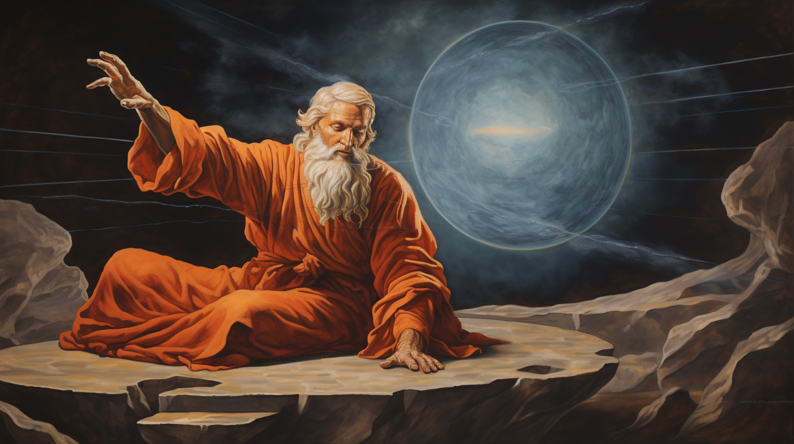
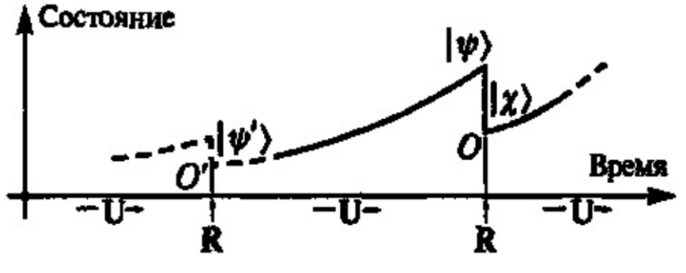

# Слово Божие — функциональное программирование как основа Вселенной



В одном из своих предыдущих постов под названием "Эйлер, Чёрч и Мандельброт — этюд о красоте и математике" я немного затронул тему рассмотрения функционального программирования в качестве основы реальности. Под тем постом было оставлено множество интересных комментариев, один из которых, написанный @nickolaym, вдохновил меня на развитие мысли в данном направлении. Так появился этот пост, в котором прямо как во времена пифагорейской школы и платоновской академии философия переплелась с математикой, а математика с философией.

## Мир как фикция, мир как функция

Миру присуще непостоянство: рождаются и умирают люди, строятся и разваливаются государства, появляются и исчезают целые цивилизации. Время, подобно олицетворяющему его древнегреческому богу Кроносу, пожирает собственных детей. Почти все языки программирования, созданные человечеством на заре компьютерной эры, не дожили до наших дней. Противостоять неумолимому течению реки времени смог только один из самых древних языков - LISP.

Его выживание - не простая удача, а следствие того факта, что LISP воплощает в себе фундаментальные принципы программирования, математики и, как вам станет ясно из этого поста, самого бытия. Создатель объектно-ориентированного программирования Алан Кей назвал LISP величайшим из когда-либо созданных языков программирования, а многие другие программисты с особым религиозным трепетом величают его не иначе как "язык Бога".

Я и сам долгие годы пытался создать идеальный язык программирования. Я брал за основу разные языки программирования и, как скульптор высекающий из камня прекрасную статую, отсекал от них всё лишнее, постепенно делая их всё более немногословными, целостными и мощными. Но какой бы язык я не брал за основу, в конце концов после отрезания всего лишнего я всегда получал один и тот же результат - LISP.

Оригинальный LISP был создан американским математиком Джоном Маккарти в конце 50-х годов XX века в качестве "физического" воплощения идей лямбда-исчисления - формального математического аппарата для описания вычислений, разработанного другим американским математиком - Алонзо Чёрчем. Идея лямбда-исчисления лежит в основе всей концепции функционального программирования, а LISP является эталонной реализацией этой концепции.

Суть функционального программирования можно изобразить в виде довольно простой схемы:

> Данные -> Функция -> Данные

Данные - это представленные в виде последовательности битов числа, строки, значения истина/ложь, списки. Функция - это описанная математическим равенством зависимость выходных данных от одних или нескольких входных данных.

Примеры данных:

```
13
"Hello"
true
[1, 2, 3]
```

Пример функции:

```
y = x + 1
```

Основной постулат функционального программирования утверждает, что функции должны быть чистыми - то есть не иметь внутреннего состояния и всегда выдавать одинаковые выходные значения на одинаковые входные параметры. Как функция `y=x+1` всегда выдает выходное значение `y=3` при входном параметре `x=2`. Кроме того, в функциональном программировании не принято перезаписывать данные под одним и тем же именем - все данные определяются в виде констант:

```
// Переменная a - в функциональном программировании делать так нельзя
a = b + 1
a = a + 3

// Константа a - в функциональном программирование нужно делать так
a = b + 1
с = a + 3
```

Математическая функция - не материальный объект, а бесплотная идея. Древнегреческий философ Платон считал, что наш физический мир представляет из себя лишь блёклую тень мира идей, освещаемых божественным светом. В материальном мире умирают люди, рушатся империи, погибают даже галактики, но два плюс два всегда без исключения равно четырём. Так было, так есть и так будет - эту вечную бессмертную идею никому не под силу изменить, она существует независимо от чего бы то ни было.

В пример вечности и независимости математических идей Платон обычно приводил правильные многогранники, которые теперь в его честь часто называют платоновыми телами. Правильный многогранник - это трехмерная геометрическая выпуклая фигура, состоящая из одинаковых многоугольников с равными сторонами. Ещё во времена Платона было доказано, что таких многогранников существует только пять: тетраэдр, гексаэдр (куб), октаэдр, додекаэдр и икосаэдр - даже могущественные олимпийские боги не в силах создать шестой. Такая независимость математических идей от воли людей и богов, по мнению Платона, доказывала то, что идеи - это самостоятельные объекты, существующие в своем особом "мире" идей.


Другой излюбленный пример Платона, иллюстрирующий его учение о материальном мире как тени мира идей - рассмотрение круга. Мы можем взять лист бумаги с карандашом и нарисовать множество кругов. Ни один из них не будет совершенно круглым, каждый будет чуточку отличаться от другого - то дрогнет рука, то движение недостаточно точное. Если мы попытаемся выточить круглый предмет на станке, то тоже не получим двух полностью одинаковых предметов. У каждого станка есть погрешность обработки - тут и там один кругляшок будет на пару микрометров отличаться от другого. Однако несмотря на то, что ни один материальный круг не совершенен, в каждом из них мы видим воплощение некого идеального круга. Поэтому можно сказать, что материальные круглые предметы - это тень идеи круга. Точно так же можно рассуждать о чем угодно другом: так, например, все столы в мире немного отличаются друг от друга, но все без исключения являются тенью идеи стола.

Ученик Платона, столь же знаменитый как и его учитель, философ Аристотель рассматривал мир под другим углом. В его картине мира идеи - это формы, которые придают материи определенный вид, превращают вещество в вещи. Идея стола как бы "склеивает" молекулы вещества, превращая их в материальный стол. Аристотелевскую связь между идеями и материей довольно просто понять на примере знаменитого философского парадокса корабля Тесея.

Согласно древнегреческой легенде, корабль, на котором мифологический герой Тесей вернулся с Крита после победы над Минотавром, использовался афинянами для ежегодного паломничества на остров Делос. Перед каждым плаванием корабль чинили, заменяя часть прогнивших досок на новые. Спустя какое-то время все старые доски корабля были заменены на новые. Среди людей разгорелся спор: тот же этот корабль, на котором плавал Тесей, или уже другой - новый?


За годы ремонта в корабле не осталось ни одного атома вещества от первоначального корабля - материя уже другая, но идея, форма, скрепляющая эти атомы вместе всё та же. Множество мыслителей со времен античности и до наших дней спорили о том, можно ли считать корабль в таком случае тем же самым или нет. Сперва может показаться, что ответ прост - корабль тот же самый, ведь его идея осталась той же. Но тогда возникает другой вопрос: если бы старые доски сохранили и сколотили из них второй корабль, то какой из этих двух кораблей был бы настоящим и почему?


Сравнивая функциональное программирование с древнегреческой философией, можно сказать, что функции подобны бесплотным идеям, а данные подобны "твёрдой" материи. Мир - это поток преобразования материи через "формы" идей, а программа на LISP - это поток преобразования данных через вызов цепочки функций.

Похожее соответствие обнаружили физики при исследовании законов микромира. В своем поведении элементарные частицы проявляют удивительное свойство корпускулярно-волнового дуализма. Пока какое-либо состояние элементарной частицы, например её положение в пространстве, не измерено, его изменение носит вероятностный характер, однако эта вероятность строго подчиняется волновому уравнению Шрёдингера. Когда же это состояние подвергается измерению, то результат измерения показывает одно, выбранное абсолютно случайным образом из вероятных, значение данного состояния.

Получается, что пока состояние не измерено, мы рассматриваем элементарную частицу как бесплотную идеальную волну вероятности, а когда оно измеряется, то мы рассматриваем её в определенном моменте времени как "твёрдую" материальную частицу-корпускулу с определенным значением этого состояния. Другими словами, волновое уравнение Шредингера - это функция, существующая в мире математических идей с встроенным рандомом, а частица - это данные полученные при вызове этой функции Шрёдингера. Волна из мира идей отбрасывает тень на материальный мир в виде частицы.



Бесплотные идеи в философии Аристотеля придают форму материи, бесплотные волны в квантовой механике задают вероятность обнаружения определенного состояния частицы при измерении, а бесплотные функции в программировании преобразуют данные. Из этого так и тянет сделать вывод, что этот дуализм духа и плоти во Вселенной фундаментален. Однако это не совсем так. Восточные философские учения, такие как буддизм и адвайта-веданта, учат тому, что мир по своей природе не двойственен, а кажущиеся противоположности иллюзорны. Мы можем убедиться в этом сами, попробовав разбить на части пирамиду абстракций, которую мы называем материей.

Рассмотрим какой-нибудь материальный предмет: например, яблоко. Яблоко - это существующая исключительно у нас в уме абстракция совокупности различных его частей - кожуры, мякоти, семян, кусочка веточки. Каждая часть яблока в свою очередь - это абстракция над совокупностью клеток и происходящих между ними биологических процессов. Каждая клетка в свою очередь - это абстракция над совокупностью молекул различных соединений и происходящих между ними химических процессов. Молекула в свою очередь - это абстракция над совокупностью атомов и происходящих между ними физических процессов. Атом в свою очередь - это абстракция над совокупностью элементарных частиц и происходящих между ними квантовомеханических процессов. Можно ли считать элементарные частицы базовыми твёрдыми "кирпичиками" Вселенной?

Тщательное исследование поведения элементарных частиц в начале и середине XX века показало, что представление об элементарных частицах как о микроскопических "шариках" совершенно неверно. Например, частицы не имеют определенного положения в пространстве, а скорее имеют вероятность оказаться в какой-то точке пространства - положение в пространстве становится фактом только в момент измерения в конкретный момент времени, а после измерения положение опять становится вероятностным. Кроме того, принципиально невозможно одновременно измерить в один момент времени положение частицы в пространстве и её скорость.

Модель атома в виде точечных частиц, вращающихся по орбитам вокруг ядра в центре тоже оказалась неверной. Вместо этого оказалось, что электроны в атоме представляют собой скорее вероятностное облако вокруг ядра. Американский физик Роберт Оппенгеймер так описывал поведение электрона в атоме:

> Если спросят, постоянно ли его положение, нужно сказать "нет", если спросят, меняется ли оно со временем, нужно сказать "нет". Если спросят, неподвижен ли он, нужно сказать "нет", если спросят, движется ли он, нужно сказать "нет"

Также оказалось, что мы не можем ничего сказать об элементарной частице, кроме числовых значений нескольких характеристик, проявляющих себя при её взаимодействии с другими частицами: массы, заряда, спина и нескольких других. Получается, что элементарная частица - это просто математическая абстракция, описывающая временной срез некоторого физического процесса.

При близком рассмотрении материя не просто "склеена" идеями, она, оказывается, буквально "соткана" из них. Наш мир - не тень мира идей, наш мир - буквально и есть мир идей. И точно так же, как при рассмотрении материи мы обнаруживаем, что она состоит из идей, американский математик Алонзо Чёрч при рассмотрении различных типов данных обнаружил, что они состоят из функций. Это великое открытие показало, что на фундаментальном уровне нет никакого разделения: ни между идеями и материей, ни между волнами и частицами, ни между данными и функциями. Всё это - разные проявления одного и того же.

## Лямбда

Алонзо Чёрч разработал минималистичную формальную систему для записи математических функций под названием "лямбда-исчисление", названного так в честь использующейся в ней греческой буквы "лямбда". В лямбда-исчислении существует всего две операции: абстракция и аппликация. Абстракция, обозначающаяся той самой лямбдой - это объявление функции, а аппликация - это применение функции к некоторым параметром.

Функция `y=x+1` в лямбда-исчислении будет записана в виде абстракции как:

```
y = λx.x+1
```

Применение этой функции к числу два будет записано в виде аппликации как:

```
z = y 2
```

Однако, по причине привычности большинства из нас к совершенно другой нотации объявления и аппликации функций в этом посте для удобства я буду использовать JavaScript-нотацию лямбда-функций.

Функция `y=x+1` в JavaScript-нотации будет записана в виде абстракции как:

```
y = (x) => x + 1
```

Применение этой функции к числу два будет записано в виде аппликации как:

```
z = y(2)
```

Исследуя возможности лямбда-исчисления, Чёрч обнаружил, что с помощью одних только операций абстракции и аппликации можно выразить программу любой сложности, оперирующую любыми типами данных. Для этого Чёрч представил все типы данных в виде функций - позже такое представление стало именоваться кодированием Чёрча.

Рассмотрим для начала логику.

Булев тип данных, истину и ложь, можно представить в виде функций таким образом:

```
true  = (x, y) => x
false = (x, y) => y
```

После мы можем определить в виде функций базовые логические операции:

```
and = (p, q) => p(q, p)
or  = (p, q) => p(p, q)
not = (p) => (x, y) => p(y, x)
if  = (p, x, y) => p(x, y)
```

Посмотрим как работает получившаяся система:

```
result1 = and(true, false)
// подставляем значения true и false в виде функций
result1 = and((x, y) => x, (x, y) => y)
// подставляем параметры в значение and в виде функции
result1 = ((x, y) => x)((x, y) => y, (x, y) => x)
// применяемая функция возвращает первый параметр, то есть
result1 = (x, y) => y
// сравнив эту функцию с нашими двумя логическими значениями, мы понимаем, что
result1 = false
```

```
result2 = or(true, false)
// подставляем значения true и false в виде функций
result2 = or((x, y) => x, (x, y) => y)
// подставляем параметры в значение or в виде функции
result2 = ((x, y) => x)((x, y) => x, (x, y) => y)
// применяемая функция возвращает первый параметр, то есть
result2 = (x, y) => x
// сравнив эту функцию с нашими двумя логическими значениями, мы понимаем, что
result2 = true
```

```
result3 = not(true)
// подставляем значение true в виде функции
result3 = not((x, y) => x)
// подставляем параметры в значение not в виде функции
result3 = (x, y) => ((x, y) => x)(y, x)
// применяемая функция возвращает первый параметр, то есть
result3 = (x, y) => y
// сравнив эту функцию с нашими двумя логическими значениями, мы понимаем, что
result3 = false
```

```
result4 = if(false, 1, 2)
// подставляем значение false в виде функции
result4 = if((x, y) => y, 1, 2)
// подставляем параметры в значение if в виде функции
result4 = ((x, y) => y)(1, 2)
// применяемая функция возвращает второй параметр, то есть
result4 = 2
```

Используя арифметику Пеано, можно выразить с помощью функций даже числа. Для этого нужно задать две базовые функции:

```
0 = (f, x) => x
next = (n) => (f, x) => f(n(f, x))
```

После этого мы можем выразить все числа через эти две функции:

```
0 = (f, x) => x
1 = (f, x) => f(x)
2 = (f, x) => f(f(x))
3 = (f, x) => f(f(f(x)))
...
```

Точно так же можно определить и арифметические операции:

```
plus     = (m, n) => (f, x) => m(f, n(f, x))
multiply = (m, n) => (f, x) => m(n(f), x)
```

Посмотрим как работает получившаяся система:

```
result5 = plus(1, 2)
// подставляем значения 1 и 2 в виде функций
result5 = plus((f, x) => f(x), (f, x) => f(f(x)))
// подставляем параметры в значение plus в виде функции
result5 = (f, x) => ((f, x) => f(x))(f, ((f, x) => f(f(x)))(f, x))
// упрощаем выражение
result5 = ((f, x) => f(x))(f, f(f(x)))
// упрощаем выражение еще раз
result5 = f(f(f(x)))
// сравнив эту функцию с нашими числами, мы понимаем, что
result5 = 3
```

Подобным образом любые типы данных, включая даже строки и списки, можно определить через функции. Ещё более удивительно то, что эту систему можно упростить, выразив все возможные функции в виде комбинации всего трёх элементарных функций. Занимающаяся этим область математики под названием комбинаторная логика была разработана российским математиком Моисем Исаевичем Шейнфинкелем и развита американским математиком Хаскеллем Карри. В честь последнего был назван один из самых известных функциональных языков программирования Haskell и операция каррирования.

Комбинаторная логика позволяет выразить любую функцию в виде бинарного дерева, узлы которого представляют из себя одну из трёх функций, называющихся комбинаторами:

```
I = (x) => x
K = (x, y) => x
S = (x, y, z) => x(z, y(z))
```

Названия I, K, S означают identity (тождество), konstant (постоянная) и substitution (подмена) соответственно. Попробуем свести к SKI-исчислению булеву логику, описанную нами выше в виде лямбда-исчисления:

```
true = K
true = (x, y) => x

false = S(K)
false = (x, y) => K(y, x(y))
false = (x, y) => y
```

После мы можем определить через SKI-комбинаторы логические операции.

Логическое "и" определяется в виде передачи в функцию истины/лжи false последним параметром:

```
and = false

true(true, and) = true(true, false) = K(true, false) = true
true(false, and) = true(false, false) = K(false, false) = false
false(true, and) = false(true, false) = K(false, true(false)) = false
false(false,and) = false(false, false) = K(false, false(false)) = false
```

Логическое "или" определяется в виде передачи в функцию истины/лжи true первым параметром:

```
or = true

true(or, true) = true(true, true) = K(true, true) = true
true(or, false) = true(true, false) = K(true, false) = true
false(or, true) = false(true, true) = K(true, true(true)) = true
false(or, false) = false(true, false) = K(false, true(false)) = false
```

Логическое "не" определяется в виде передачи в функцию истины/лжи параметров false, true:

```
true(false, true) = K(false, true) = false
false(false, true) = K(true, false(true)) = true
```

Точно так же с помощью SKI-комбинаторов можно выразить и все остальные типы данных, представленные в виде кодирования Чёрча, но к сожалению описание этих операций выходит далеко за пределы этого поста.

## Йота

> В начале было Слово, и Слово было с Богом, и Слово было Бог
>
> _Евангелие от Иоанна_

Согласно этой известной строке из евангелия, Господь сотворил мир, окликнув его из небытия своим словом. Что же это было за слово, обладающее могуществом породить целую Вселенную?

В еврейской Торе создатель мира упоминается под множеством различных имён, но только одно из них считается его личным именем, а не титулом. Это имя записывается как יהוה, но обычно не читается, так как согласно традициям евреи должны соблюдать одну из основных заповедей - "не упоминай имени моего всуе". Точное произношение этого имени, известного как тетраграмматон, утеряно в веках, но обычно в западной традиции его произносят как Яхвэ или Иехова/Иегова. Слово יהוה объединяет в себе три времени глагола "быть", его можно перевести как "был, есть и будет".

Первая буква личного имени Бога י в еврейском и родственном ему финикийском алфавите называется "йуд". В греческом алфавите, перенятом древними греками с некоторыми усовершенствованиями у финикийцев, соответствующая буква носит название "йота". Йуд и йота записываются в виде коротенького штриха - это самые маленькие буквы в письменных алфавитах греков и евреев, обозначающие самый короткий звук "й".

Именно из-за своего малого размера буква "йота" была выбрана американским лингвистом Крисом Баркером для обозначения самого минимального из возможных комбинаторов - универсального йота-комбинатора, с помощью которого можно выразить I, K и S-комбинаторы, а соответственно и все возможные функции.

Для начала выразим функцию I через S и K:

```
// Первый вариант
I = S(K, K)
I = (x) => K(x, K(x))
I = (x) => x

// Второй вариант
I = S(S, K, K)
I = S(K, K(K))
I = S(K, K)
I = x => K(x, K(x))
I = x => K(x, x)
I = x => x
```

После введем оператор ι и выразим его через S и K:

```
ι = (x) => x(S, K)
```

При подстановке вместо S и K их полных значений получаем:

```
ι = (x) => x((a,b,c) => a(c, b(c)), (d, e) => d)
```

Теперь мы можем выразить сами SKI-комбинаторы исключительно через йоту:

```
I = ι(ι)

K = ι(ι(I))
K = ι(ι(ι(ι)))

S = ι(ι(ι(I)))
S = ι(ι(ι(ι(ι))))
```

Так как с помощью SKI-комбинаторов можно выразить любую возможную функцию, а сами комбинаторы можно выразить через йоту, то получается, что любую возможную функцию можно выразить через йоту. А значит йота - это то самое Слово, с помощью которого можно сотворить целую Вселенную. Господь в откровении Иоанна Богослова говорит "Я есмь Альфа и Омега", но разве не правильнее ли будет сказать "Я есмь Йота и Лямбда"?

В первой строке книги Бытия сказано:

> В начале сотворил Бог небо и землю

Вероятно, на эту строку Библии сильно повлияла космогоническая литература аккадцев - родственного древним евреям семитского народа. Даже мифический первый еврей Авраам был родом из месопотамского города Ур, располагавшегося в междуречье Тигра и Ефрата и бывшего одним из центров шумеро-аккадской цивилизации.

В аккадском космогоническом мифе Энума Элиш говорится:

> Когда наверху не названо небо, внизу земля именем не называлась

Эта строка проливает свет на значение первой строки книги Бытия. Получается, что Бог для сотворения мира своим Словом именует противоположности, тем самым отделяя бытие от небытия, жизнь от смерти, движение от покоя, единицу от нуля, материю от идей, частицу от волны, данные от функции. Особенная мистическая красота заключается в том, что в созданном на основе йота-исчисления языке программирования Iota любая программа тоже состоит из всего двух символов: нуля и единицы. Ноль кодирует открывающуюся скобку, а единица йоту.

Пример программы на языке Iota:

```
0011011
```

При замене нуля на открывающуюся скобку, а единицы на йоту получаем:

```
((ιι(ιι
```

Это выражение аппликации с закрывающимися скобками записанное в лямбда-нотации выглядит следующим образом:

```
((ιι)(ιι))
```

Во всей статье вместо лямбда-нотации я использовал более привычную большинству JavaScript-нотацию. В ней это выражение будет выглядеть так:

```
(ι(ι))(ι(ι))
```

Йота - это тьюринг-полный язык, на котором можно написать программу любой сложности. Однако лучшие мыслители человечества всё ещё бьются над решением важного философского вопроса: "Но зачем?".

## Вселенная как программа на LISP

У идеалистической философии Платона до сих пор много поклонников. Особенно много их среди математиков. Известно, что убежденным сторонником платонизма был великий немецкий логик Курт Гёдель. Среди наших же современников два самых известных платоника - это астрофизик Макс Тегмарк и математик-программист Стивен Вольфрам.

В своей книге "Наша математическая Вселенная" профессор Тегмарк излагает свои оригинальные взгляды на фундаментальные основы физики. Его картина мира исходит из того, что всё, что нам известно об элементарных частицах - это то, как эти частицы проявляют себя во взаимодействии с другими частицами и то, что их поведение подчиняется волновому уравнению Шрёдингера. Если зайти на Википедию в статьи про электрон и нейтрино, то можно увидеть, что всё чем отличаются эти частицы друг от друга - это числовые значения нескольких характеристик: массы, электрического заряда, цветового заряда, спина, лептонного и барионного чисел и нескольких других. Тегмарк утверждает, что мы можем придумать для себя любые словесные описания физических процессов, но в конце концов всё наше представление о них сводится к одному - числам и формулам. А раз ничего другого кроме формул и чисел мы о Вселенной содержательно сказать не можем, то стоит заключить, что наша Вселенная - это просто огромная математическая структура.

Мысли Тегмарка развил и дополнил создатель пакета Mathematica программист Стивен Вольфрам. По его мнению, мир представляет из себя не просто математическую структуру, а скорее циклический процесс вычисления преобразований математической структуры по некоторому простому правилу. Пользуясь религиозной метафорой, можно сказать, что с точки зрения Вольфрама Бог при сотворении Вселенной задал всего две вещи - начальное состояние некоего графа и правило, по которому этот граф изменяется.

Возможно, существует бесконечное количество комбинаций различных начальных состояний и правил, но только в некоторых из них возможно появление сложных структур и жизни. Примером такого простого правила с простыми начальными условиями, порождающими сложные структуры, может служить знаменитая игра "Жизнь" Джона Конвея.

Согласно размышлениям Вольфрама, наша Вселенная - это один гигантский бесплотный компьютер, который рекурсивно вычисляет все возможные программы, все возможные алгоритмы. А мы можем добавить, что запрограммирован этот компьютер, наверняка, на языке Бога - языке универсального йота-комбинатора, языке SKI-комбинаторов, языке лямбда-исчисления Чёрча, на LISP-е.
