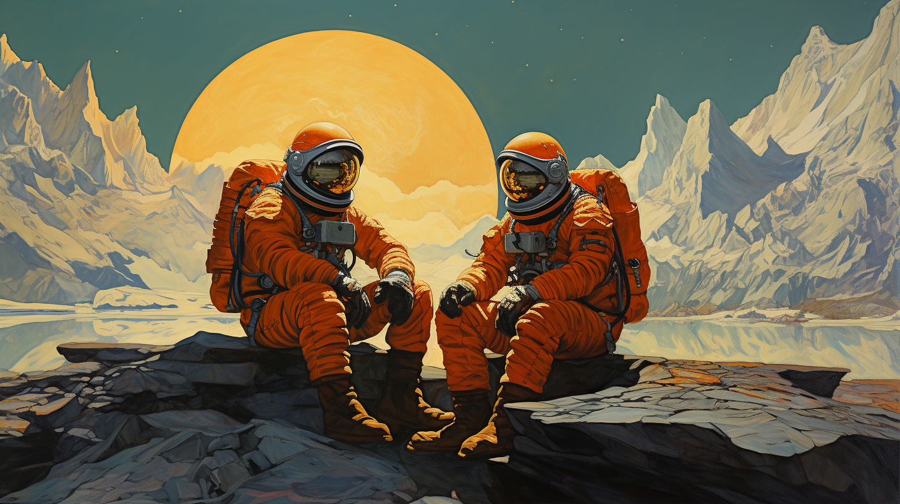

# Размышления о мире. Часть 1: Панкомпьютационализм

> Отбросьте невозможное — и то, что останется, каким бы невероятным оно ни казалось, должно быть истиной.
>
> _«Знак четырех», Артур Конан Дойл_

В начале XX века были созданы две самые смелые и передовые на данный момент теории физики — теория относительности и квантовая механика. Их создатели подобно Шерлоку Холмсу с помощью строгого логического рассуждения отсекали невозможные и противоречивые теории, и поверили в то, что оставшийся вариант, каким бы невероятным он не казался, должен быть истинным. Они поверили в него, даже несмотря на то, что согласно этому последнему варианту время для разных наблюдателей может течь по‑разному, а на фундаментальном уровне реальности не существует никакой определенности.

В этой серии постов я хочу рассказать о двух смелых выводах, к которым можно придти, опираясь лишь на непосредственный опыт и строгие логические рассуждения. Корни этих рассуждений уходят в глубокую древность — к истокам древнегреческой и древнеиндийской философии. Несмотря на всю кажущуюся невероятность этих выводов, в их истинности уверены многие знаменитые математики, физики, нейробиологи и философы.

## Бытие и вечность

Открыв глаза, мы смотрим на мир вокруг себя и видим серые колоссы зданий, бегущую между ними мощёную тропинку, раскинувшиеся вокруг тропинки зелёные кроны деревьев и бегущих по тропинке детей. Какой вывод мы можем сделать из этого наблюдения?

Подобно Рене Декарту с его знаменитым «Cogito ergo sum» мы можем заключить, что:

> Мир существует

После этого мы задумываемся над извечным философским вопросом о том, почему существует мир, и как он появился. Существует только две возможности: мир или откуда‑то появился, или же он вечен.

Выбор первого варианта всегда приводит к проблемам. Можно сказать, что мир создало некое божество, или что мир порожден из квантового вакуума согласно законам физики, но тут же возникает логичный вопрос: откуда тогда появилось это божество, откуда этот квантовый вакуум, и кто установил законы физики именно такими, а не какими‑либо иными. И мы либо скатываемся вниз по лестнице бесконечной рекурсии, либо в какой‑то момент принимаем второй вариант, утверждая, например, что божество, создавшее мир, само по себе существует вечно. Как мне кажется, разумным в данном случае будет не плодить сущности и останавливаться в произвольном месте на бесконечной рекурсивной лестнице, а просто не вставать даже на первую ступеньку и сразу принять верность второго варианта.

Таким образом, мы можем заключить, что:

> Мир вечен

Тут я хочу сделать небольшое разъяснение, что слово «вечный» значит «существующий в любой момент времени». То есть нет такого момента времени, в который этого вечного не существует, а значит оно никогда не появлялось, и никогда не исчезнет. Можно даже сказать, что вечное находится вне времени.

## Фундамент мироздания

Мы смотрим на мир и видим, что любое целое состоит из каких‑то частей. Мы не знаем бесконечно делятся ли сами части на ещё более мелкие части или существует некая элементарная частица мира, но это и не важно. Важно то, что части вечного целого очевидно тоже должны быть вечными. А следовательно в основе мира лежит что‑то, что никогда не появлялось и никуда не исчезнет. Что же это может быть?

Ответ на этот вопрос нашли ещё древние греки. Великий философ и геометр Пифагор говорил своим ученикам, что «всё есть число», намекая на то, что в основе мира лежит математика. Эта мысль была позже развита другим известным философом Платоном и воплощена в его знаменитой теории идей.

Согласно Платону в нашем изменчивом мире вечным существованием обладают только математические идеи. Например, верность утверждения «два плюс два равно четыре» не зависит ни от момента во времени, ни от положения в пространстве, ни от чего‑либо другого. Пять миллиардов лет назад в одном уголке Вселенной два плюс два равнялось четырем, и через пять миллиардов лет в противоположном уголке два плюс два будет равняться четырем.

Излюбленным примером Платона о независимом существовании математических структур была теорема его современника, геометра Теэтета Афинского, о правильных многогранниках. Теэтет привел строгое доказательство того, что таких фигур существует всего только пять, и существование шестой логически невозможно. Согласно Платону, это говорит о том, что математические структуры в некотором смысле реально существуют в мире абсолютных идей.

В пример вечности математических идей помимо правильных многогранников, позже в честь самого мыслителя названных платоновыми телами, философ приводил идею круга. В физическом мире все круглые предметы, например, колеса или щиты, не являются абсолютно круглыми, а немного отличаются друг от друга, но всё же, смотря на любую из них, человек видит стоящую за ними идею круга. Таким образом, все материальные круглые предметы являются как бы тенью идеального круга.

Философия Платона о объективном, независимом от человека, существовании идей известна как объективный идеализм, и у неё всегда было множество поклонников среди ведущих математиков и физиков. Один из наиболее ярких проповедников платонизма — американский профессор астрофизики Макс Тегмарк. В своей книге «Наша математическая Вселенная» он размышляет над тем, что все законы физики, если исключить из них данное лишь для нашего удобства словесное описание — это просто числа и математические формулы. К примеру, электрон — это просто набор числовых характеристик некоторых переменных, которые мы используем в математических формулах, описывающих физические взаимодействия.

Нам неизвестно ничего другого вечного и безусловного кроме математических идей. Кроме того, косвенный аргумент Тегмарка говорит о том, что физика нашего мира по сути эквивалентна математике. Таким образом, мы можем заключить, что:

> В основе мира лежит математика

## Движение и жизнь

Взглянув на мир вокруг себя ещё раз, мы замечаем, что мир динамичен и постоянно меняется. Всё находится в постоянном движении. Как объяснить это, если в основе мира лежит математика?

Британский математик и программист Стивен Вольфрам считает, что мир представляет из себя не просто математическую структуру, а циклический процесс постоянного расчёта следующего состояния структуры из предыдущего по какому‑либо простому правилу. Согласно его теории мир представляет из себя некое подобие бестелесного компьютера, на котором запущена программа расчёта клеточного автомата. Подобные идеи задолго до Вольфрама высказывал американский физик Джон Арчибальд Уилер, считавший, что в основе мира лежит информация, а самая элементарная частица во Вселенной — это бит информации. Он называл свою теорию «It from bit» — всё из бита. Теорию же Вольфрама и подобные ей принято называть словом «панкомпьютационализм», образованным из греческого слова «pan»‑»всеобщий» и английского слова «compute»‑»расчитывать».

В пример клеточного автомата, работающего согласно простому правилу, но порождающему сложные структуры, Вольфрам приводит математическую игру под названием «Жизнь», изобретенную Джоном Конвеем. В этой игре игрок задает первичное размещение живых клеток на поле, а после следит за тем как клетки рождаются и умирают согласно довольно простым правилам: в пустой мёртвой клетке, с которой соседствуют три живые клетки, зарождается жизнь и существует, пока у этой клетки есть две или три живые соседки, и умирает, если живых соседей меньше двух или больше трёх.

Несмотря на простоту правил, порождаемые игрой «Жизнь» структуры могут быть крайне сложны. Например, в этом элементарном клеточном автомате существуют стабильные самокопирующиеся структуры — глайдеры.

Некоторые из фигур в игре «Жизнь» стабильны и устойчивы, другие долго меняются, прежде чем стабилизироваться, а третьи рассыпаются почти сразу после своего образования. Возможно, что элементарные частицы в нашей Вселенной подобны фигурам в игре «Жизнь» и возникают как устойчивые структуры в клеточном автомате.

И действительно некоторые из элементарных частиц устойчивы и стабильны, а некоторые существуют лишь долю секунды и рассыпаются сразу после своего появления. Рассматривая субатомную физику с этой точки зрения, можно предположить, что независимое существование кварков невозможно из‑за того, что кварк — это лишь небольшая часть сложного движущегося паттерна, в разы более сложного чем глайдер, и что, не являясь частью этого целого паттерна, кварк существовать не может, так как мгновенно исчезает.

Если наша Вселенная действительно подобна игре «Жизнь», то законы физики стоит рассматривать не как некий установленный свыше свод правил, а как результат естественного отбора в клеточном автомате. Посмотрев на это подобным образом, мы обнаружим, что наш мир состоит именно из таких элементарных частиц, из которых он состоит, потому что именно эти частицы чаще образуются и лучше всего выживают в условиях нашего мирового клеточного автомата. Подобную связь между эволюцией, вычислениями и физикой подробно исследует в своей книге «Cтруктура реальности» израильско‑британский физик Дэвид Дойч.

## Бесконечность

Из теории панкомпьютационализма вытекает сразу несколько вопросов. Первый из них состоит в том, какое именно правило управляет нашей Вселенной и почему оно именно такое, а не какое‑то другое? Или другими словами, кто утвердил законы физики?

Нет ни единой причины считать, что существует некое произвольно ограничение на то, что одно правило и начальное состояние порождает реальную вселенную, а другое нет. Для объяснения такого произвольного ограничения нам пришлось бы вводить лишние сущности вроде воли божеств. Следовательно, мы можем с уверенностью предположить, что все возможные начальные состояния со всеми возможными правилами расчета порождают все возможные математические вселенные.

Из этого мы делаем следующий вывод:

> Мир бесконечен

С точки зрения панкомпьютационализма существует бесконечное количество различных математических вселенных. Благодаря компьютерам мы можем попытаться симулировать некоторые из них и понять, какие законы физики там действуют. Но попасть туда нам не дано.

## Апории Зенона

Второй вопрос, вытекающий из теории панкомпьютационализма: почему вообще происходит этот расчёт, что служит тем самым аристотелевским перводвижителем мира? Или выражаясь словами Стивена Хокинга, что вдыхает огонь в уравнения?

Чтобы ответить на этот вопрос, нам следует взглянуть на одну и ту же вещь с двух разных точек зрения. Взглянем, например, на число Пи — с одной стороны мы можем расчитывать его всё точнее и точнее, раз за разом узнавая следующую цифру в последовательности после запятой, но никогда не доходя до последней. С другой стороны мы понимаем, что эта последовательность уже существует и всегда существовала, записанная в платонической книге вечных идей.

То же самое и с нашим миром. Для гипотетического внешнего наблюдателя, которого для удобства можно назвать Богом, и в существование которого можно верить или не верить, математическая структура мира статична — Бог видит книгу вечности от первого до последнего листа. Весь бесконечный мир для Бога был, есть и будет — такой Бог служит живым воплощением тьюринговского оракула. Символично, что личное имя Бога «Иехова» в еврейское Торе образовано из прошедшей, настоящей и будущей формы глагола «быть».

Для нас же, внутренних наблюдателей и персонажей книги бытия, чье состояние ума определяется состоянием математической структуры в одну из итераций расчета, создается иллюзия движения, иллюзия динамичности происходящего. Следующее состояние в расчёте зависит от предыдущего, но не наоборот, поэтому мы помним прошлое, но не видим будущее.

Из этих размышлений мы можем сделать вывод:

> Время и движение иллюзорны

Похожие выводы сделаны физиком Альбертом Эйнштейном в его знаменитой теории относительности. Согласно этой теории пространство и время — это четыре равноправных измерения одной и той же математической структуры, в которой выбор временного измерения зависит от конкретного наблюдателя.

Теория относительности вдохновила философский подход к рассмотрению времени под названием этернализм. Согласно этому взгляду, будущие события уже существуют в вечности, а движение иллюзорно.

## Множественность путей

Третий вопрос, вытекающий из теории панкомпьютационализма: если есть несколько вариантов того состояния, которое может получиться из текущего при применении правила, в зависимости от такого с какого конца мы начинаем, то какой из них воплотится в реальности?

И опять же у нас нет ни единой причины считать, что существует какое‑либо произвольное ограничение на то, какой из вариантов материализуется, а какой нет. В ином случае нам пришлось бы вводить в наши размышления лишние сущности.

Поэтому мы можем утверждать:

> Существует множество равнозначно реальных вариантов истории

Среди современных физиков популярна так называемая многомировая интерпретация квантовой механики, разработанная американским учёным Хью Эвереттом. Согласно этой интерпретации, на субатомном уровне при каждом событии Вселенная делится на параллельные ветви, которые в свою очередь в дальнейшем так же делятся на множество других ветвей.

Эта гипотеза как нельзя лучше вписывается в стройную картину мира панкомпьютационализма. По сути, каждая ветка в эвереттовской Мультивселенной — это один из возможных вариантов результата расчета математической структуры.

## Заключение

Так с помощью базовых предпосылок, основанных на непосредственном опыте, и строгой логики мы по шагам выстроили контринтуитивную, но цельную и непротиворечивую картину мира. В следующей части я расскажу о второй половине этой картины — панпсихизме.
