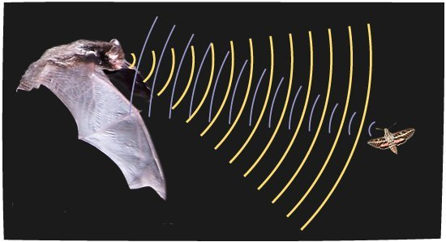
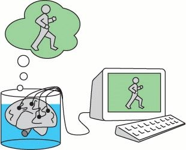

# Размышления о мире. Часть 2: Панпсихизм⁠⁠

> Чем ярче разгораются костры знания, тем больше тьмы открывается нашим изумлённым глазам.
>
> Теренс Маккена

Этот пост - продолжение первой части, повествующей про панкомпьютационализм. Посты слабо связаны между собой логически, однако я сильно рекомендую ознакомиться с первой частью прежде, чем приступать ко второй. В этой части я хочу затронуть тему сознания и всеобщей одушевленности Вселенной.

## Сознание

Одним из самых загадочных вопросов, терзавших мыслителей во все времена, был вопрос о природе сознания. С какой бы стороны философы не подступались к ответу на него, в конце концов их умопостроения неизменно рушились. В чём же его загадочность?

В последующих абзацах я позволю себе частично процитировать свой предыдущий пост на тему сознания.

Итак, сознание - это поток субъективных впечатлений. Субъективные впечатления — это те чувства, которые мы испытываем при том или ином процессе восприятия. Это то, что отвечает не на вопрос «Что это?» или «Как это работает?», а на вопрос «Каково это?».

Отличный пример для объяснения того, что такое субъективные впечатления, привел американский философ Томас Нагель. Представьте, что вы ученый, который изучает летучих мышей. У этих животных кроме привычных человеку органов чувств, существует еще один дополнительный — эхолокатор. Летучие мыши при полете в темноте издают ультразвук, и по его отражению от препятствий и предметов понимают, что где находится. Вы как ученый изучаете эхолокацию летучих мышей: делаете мышам МРТ, проводите им хирургические операции, ставите на них эксперименты. Вы знаете об эхолокации летучих мышей буквально всё — все ответы на вопросы «Что это?» и «Как это работает?».

Но есть одна вещь, которую вы никак не можете узнать об эхолокации мышей с помощью экспериментов — это то каково это чувствовать эхолокацию, каково это быть летучей мышью. Ответ на вопрос «Каково это?» — и есть субъективное впечатление. А поток таких субъективных впечатлений — это и есть сознание.

Элементарный элемент субъективных впечатлений принято называть словом "квалиа". Примеров таких элементарных частиц субъективного опыта целое множество: например, красный цвет, звук скрипа двери, запах апельсинов. Не существует способа как либо описать, определить квалиа или передать знание о нем. Невозможно объяснить, что такое красный цвет, слепому от рождения человеку.

Также мы даже не можем вообразить себе, какие квалиа испытывают другие живые существа. Какие цвета видят животные с тетрахроматическим зрением? Как чувствует оргазм человек противоположного пола? Эта загадочность вопроса о природе сознания возникает из-за двух основных трудностей.

Первая из этих трудностей состоит в несводимости квалиа к математически-физическим теориям. Эта проблема часто упоминается в литературе под названием "разрыв в объяснении". Лучше всего её описал в одном из своих трудов немецкий философ и математик Готфрид Лейбниц:

> Представьте на секунду, что вашу голову увечили до огромных размеров так, что в нее теперь можно войти как в мельницу. Вы входите туда и видите огромное число связанных друг с другом шестеренок. Каждую из шестеренок приводит в движение предыдущая, а та в свою очередь приводит в движение последующую. При осмотре этой мельницы вы не найдете ничего такого, чем бы можно было бы объяснить сознание.

Так как все научные теории описываются математикой, а для квалиа невозможно дать строгое математическое описание, то получается, что невозможно свести сознательные впечатления к математическому или алгоритмическому описанию физических процессов или работы мозга. Ничего красного нет ни в электромагнитном излучении определенной длины волны, ни в человеческом глазе, ни в цепочках нейронов в головном мозге. Однако же совокупность процесса восприятия мозгом видимого глазом электромагнитного излучения отображается в нашем сознании чувством красного цвета. И по правде говоря, свет и глаз здесь не играют никакой роли.

Во сне наши глаза закрыты и не получают никакого света, однако же это не мешает видеть нам цветные сны. Кроме примера со сном отсутствие цвета в свете можно продемонстрировать следующим мысленным экспериментом. Если ученые вынут ваш мозг из черепной коробки, перенесут его в колбу с питательным раствором и подключат к нему электропровода, ведущие к симулирующему виртуальную реальность компьютеру, то вы этого даже не заметите. Компьютер будет слать по проводам электросигналы, подобные тем, что ваш мозг получает от органов чувств, а вы в виртуальной реальности будете видеть цвета и слышать звуки. Все эти ощущения будут вызваны не световыми или звуковыми волнами, а электрическими импульсами, исходящими из компьютера. Но вы никак не сможете отличить эту виртуальную реальность от настоящей. Это еще раз доказывает, что в красном свете красного цвета нет, ведь "мозгу в колбе" вообще нечем воспринимать свет, у него нету глаз.

Однако это и не означает, что "краснота" находится в мозге. Нет никакой логической связи между активацией нейронов в мозгу и квалиа. Если и то, и другое всего-лишь электрический импульс в мозге, то почему красный цвет так сильно отличается от звука скрипки?

Из-за отсутствия причинности между активацией нейронов в мозге и восприятием квалиа нейробиологи называют изучаемые ими связи нейрокоррелятами — потому что корреляция между активацией нейронов и квалиа есть, а причинно‑следственной связи нет.

Вторая из трудностей в изучении сознания состоит в невозможности доподлинно узнать, обладает ли другое существо сознанием или нет, и невозможности доказать другому существу, что вы обладаете сознанием. Эта трудность была названа Готфридом Лейбницем "проблемой других умов".

Мы не можем посмотреть на мир глазами другого человека. У нас есть доступ к нашему собственному сознанию, но нет доступа к сознанию других. Мир подобен видеоигре, в который вы - главный персонаж. Игра работает на основе графического и физического движков — физический движок просчитывает взаимодействие всех объектов в игре, а графический отрисовывает для вас картинку от первого лица.

Находясь внутри этой игры, вы можете ставить любые эксперименты с любыми игровыми объектами. С помощью этих экспериментов, вы можете выяснить детали работы физического движка игры. Потенциально, вы даже можете воспроизвести на листе бумаги полный код алгоритма работы физического движка — этакую внутриигровую Теорию Всего.

Однако, будучи персонажем игры, вы никакими экспериментами не можете узнать, являются ли другие персонажи игры такими же игроками или же хорошо запрограммированными, но бездушными NPC, а если предположить, что другие персонажи игры являются игроками, то вы не можете знать, такие же у них настройки графики или нет.

Будучи персонажем игры или мозгом в колбе, вы даже не сможете понять, что вы находитесь в "Матрице", а не в реальности. Единственный способ узнать, что ваш мир создан искусственно - с помощью экспериментов изучить управляющие этим миром законы и просчитать его эволюцию в обратном порядке. Если в самом начале вы обнаружите то, что в теории конечных автоматов называется "сад Эдема" - состояние, в которое мир не может попасть следуя своим же законам, то значит ваш мир создан искусственно, и возможно пойти в церковь и усердно молиться о спасении - не такая уж и плохая идея. Но если в начале вы такого состояния не обнаружите, то вы так и останетесь в неведении относительно истинной природы вашего мира.

Мы можем предположить, что все остальные игроки - NPC, или как ещё принято говорить, философские зомби - существа, полностью идентичные нам по физическому строению, точно так же реагирующим на внешние факторы, но не обладающие сознанием и субъективным переживанием происходящего. Дотронувшись до раскаленной сковороды, философский зомби точно так же, как и мы, отдернет от неё руку, и точно так же вскрикнет будто бы от боли, но на самом деле, не переживая никаких страданий.

Мы можем легко представить себе существование такого философский зомби, но некоторые философы находят эту концепцию противоречивой. Например, австрало-американский философ Дэвид Чалмерс приводит следующее рассуждение. Наш мозг — это причинно‑замкнутая машина - то есть система, работа которой полностью подчиняется закону причин и следствий. Активация каждого нейрона имеет причину в активации предыдущего нейрона в цепочке и может быть легко отслежена. Наша речь - это результат работы нашего мозга, и поэтому когда мы произносим «Я ощущаю квалиа красного цвета», получается, что мозг, эта самая бездушная механическая машина, утверждает, что у него есть сознание.

Проблема других умов не позволяет изучать сознание привычными научными инструментами. С одной стороны, существование сознания - это даже не научная гипотеза, потому что она не соответствует критерию фальсифицируемости Поппера, ведь нельзя поставить такой эксперимент, который точно покажет, есть у существа сознание или нет. С другой стороны, существование сознания - это непреложный факт, данный нам в ощущениях. И строго говоря, сознание и субъективные впечатления - это то, через что мы познаем мир и строим наши научные теории.

Одним из примеров, иллюстрирующих проблему других умов, служит мысленный эксперимент под названием "инвертированный спектр".

Представьте, что вы и ваш друг смотрите на красное яблоко. Ни у вас, ни у друга нет никаких физических проблем со зрением или нарушений восприятия вроде дальтонизма. Вы показываете на яблоко пальцем и утверждаете, что оно красное. Ваш друг показывает на яблоко пальцем и утверждает, что оно красное. Вы сходитесь в том, что оно красное, ведь вы оба с детства привыкли к тому, что этот цвет называют красным. Может ли быть такое, что в своем сознании вы видите этот цвет так, как ваш друг в своем сознании видит зеленый, а зеленый вы видите так, как ваш друг видит красный? Не существует ни единого способа подтвердить или опровергнуть это предположение.

Мы никак не можем узнать, есть ли сознание у других существ, поэтому нам остается только верить в один из двух вариантов:

- Мое сознание единственное
- Другие сознания существуют

## Солипсизм

Вера в первый вариант приводит нас к солипсизму - признанию собственного сознания первоосновой и причиной мира и полному отрицанию существования чего бы то ни было во вне. Солипсист верит, что его сознание и есть единственно существующая Вселенная. Несмотря на кажущуюся абсурдность солипсизм невозможно опровергнуть никакими логическими рассуждениями и аргументами.

Однако у принятия конкретным человеком концепции солипсизма есть несколько существенных недостатков. Первый из них - нарушение принципа Коперника, который гласит о том, что в любой теории нужно придерживаться утверждения о том, что вы - совершенно заурядная часть мира, а не его пуп. Второй - проблематичность выведения из него правил этики, ведь если вы единственное существо, реально испытывающее страдания, то у вас нет никаких причин воздерживаться от убийств других людей. С вашей точки зрения эти философские зомби будут корчиться, как будто чувствуют боль, но на самом ничего не испытывать. Вы же не испытываете моральных терзаний, распиливая бревно, даже если оно при этом трещит?

## Панпсихизм

Вера во второй вариант, в обладание другими людьми сознанием, толкает нас на путь к ещё более интересному выводу. Если мы предполагаем, что сознанием обладают другие люди, то у нас нет никаких причин сомневаться в наличии сознания у собак и кошек. Но если сознание есть у собак и кошек, то какие-либо чувства должны быть даже у червей. Но где находится тот рубеж, который отделяет одушевленную природу от неодушевлённой? Есть ли сознание у бактерий?

Многие современные философы придерживаются концепции панпсихизма - утверждения о том, что такого рубежа нет, и сознательными впечатлениями сопровождаются все процессы во всей Вселенной. Физические и химические процессы в телах червей и бактерий являются такой же обработкой информации от внешнего мира, как и физические и химические процессы в мозгах людей. Чем сложнее существо и процесс обработки информации в его организме, тем ярче и богаче его внутренний мир.

Но если сознание может быть у червей и даже бактерий, то значит, им должны обладать и компьютерные нейронные сети. Существует интересный мысленный эксперимент под названием "Китайский мозг".

Предположим, что представителям достаточно большой по численности нации, например китайцам, раздали телефоны и список номеров телефонов других китайцев. Если у китайца звонит телефон, то он согласно данным ему правилам звонит каким-то определенным абонентам в своей телефонной книжке. Эти телефонные связи симулируют нейронные связи, а каждый китаец симулирует работу отдельного нейрона - таким образом, вся китайская нация целиком симулирует работу человеческого мозга. У этой сети есть входы и выходы, подключенные к компьютерной симуляции. На входы подается сигнал из телефонных звонков, подобный тому, который получает мозг от органов чувств, только сгенерированный компьютером. А телефонные звонки на выходе заставляют персонажа симуляции совершать какие-то действия: дышать, говорить, шевелить частями тела, ходить, прыгать. То есть, симуляцию человеческого мозга из китайцев с телефонами подключают к симуляции нашего мира, запущенную на компьютере. Будет ли такой "китайский мозг" обладать сознанием в том смысле, в котором обладаем им мы?

Сторонники панпсихизма утверждают, что нет никаких аргументов против того, что такой мозг, сконструированный, из телефонной сети не будет обладать сознанием. Да и если мы спросим его напрямую, то он так же как и его биологический прототип ответит, что чувствует квалиа. Если мы верим в то, что люди обладают сознанием, раз они сами говорят об этом, то мы обязаны поверить, что "китайский мозг" так же им обладает. Кто знает, может быть, у сети Интернет тоже есть чувства?

Поверив, что другие люди обладают сознанием, мы встали на путь неизбежного признания того, что сознание вездесуще. И мы можем предполагать наличие чувств не только у меньших, но и больших, чем мы, структур и процессов. Английский философ Бертран Рассел писал:

> Если мышление состоит из определённых изменений поведения в соответствии с предшествующими событиями, то следует сказать, что дно реки мыслит, хотя его мышление является недоразвитым

Мы можем предположить, что даже у нашей планеты, как у объединения всех геологических, биологических, экологических процессов, тоже должен наличествовать определенный субъективный опыт. Что доставляет ей боль? От чего она приходит в восторг?

С точки зрения панпсихизма сама Вселенная - это один гигантский сознательный организм - бесконечный и вечный Брахман, состоящий из бесчисленного количества индивидуальных душ-атманов. Это величайшее существо переживает все возможные чувства со всех возможных точек зрения во всех возможных ситуациях.

## Фундамент Вселенной

Хорошим аргументом в пользу панпсихизма может служить тот факт, что сознание играет ключевую роль в современных теориях и интерпретациях квантовой механики. Многие современные ученые предпочитают закрывать на это глаза, следуя знаменитой мантре "заткнись и считай", тем самым отказываясь от любых попыток понять стоящую за их расчётами реальность. В отличии от них основоположники квантовой механики понимали, что сознание является неотъемлемой и, более того, необходимой частью их теорий. Один из отцов квантовой механики австрийский физик Эрвин Шрёдингер в одной из своих книг писал:

> Сознание не может быть объяснено в физических терминах, поскольку сознание абсолютно фундаментально.

Другой отец квантовой механики немецкий физик Вернер Гейзенберг ввёл в физику понятие, позднее названное в его честь рубежом Гейзенберга. Рассматривая какой-либо физический эксперимент с точки зрения копенгагенской интерпретации, учёному приходится проводить чёткую разделительную линию между квантовым миром неопределенностей и классическим макромиром. Положение этой линии обычно очевидным образом следует из постановки эксперимента, однако этот выбор совершенно произволен.

Гейзенберг писал:

> При математической трактовке эксперимента необходимо провести разделительную линию между, с одной стороны, инструментом, который мы используем в качестве вспомогательного средства при постановке эксперимента, и, таким образом, рассматриваем как часть нас самих, а с другой стороны, физической системой, которую мы хотим исследовать. Изучаемую систему мы математически представляем как волновую функцию. Эта функция, согласно квантовой теории, определяется дифференциальным уравнением, определяющим любое будущее состояние на основе текущего.

Разделительная линия между наблюдаемой системой и измерительным прибором непосредственно определяется постановкой эксперимента, но физический процесс, очевидно, непрерывен. По этой причине должна существовать в определенных пределах полная свобода в выборе положения разделительной линии.

Обычно, рубеж Гейзенберга проводят между изучаемой системой и инструментом, считая систему частью квантового мира, а инструмент частью классического. Но можно сдвинуть этот рубеж и считать изучаемую систему и инструмент частями квантового мира, а монитор компьютера, на который выводятся результаты, частью классического. Можно пойти дальше и рассматривать и систему, и инструмент, и монитор частями квантового мира, а наш глаз, смотрящий на монитор, частью классического. Можно пойти еще дальше и рассматривать и систему, и инструмент, и монитор, и глаз частями частями квантового мира, а наш мозг, анализирующий сигнал, идущий от глаза, частью классического.

Так можно двигаться ещё немного, но существует граница, за которую мы подвинуть рубеж Гейзенберга уже не сможем - наше сознание. Эта граница отделяет субъективный мир от объективного и служит последним рубежом Гейзенберга. Таким образом, сознание играет ключевую роль в копенгагенской интерпретации квантовой механики.

Другая известная интерпретация квантовой механики, так называемая многомировая интерпретация Эверетта, не требует произвольного проведения рубежа Гейзенберга. В ней не проводится разделение на квантовый и классический миры, а вся Вселенная считается исключительно квантовым миром. Однако, несмотря на отсутствие в этой интерпретации рубежа Гейзенберга, сознание играет в ней столь же важную роль.

Согласно многомировой интерпретации Эверетта, при любом вероятностном событии в субатомном мире вселенная разделяется на несколько параллельных вариантов. Так например, в знаменитым мысленном эксперименте с котом Шрёдингера, в момент распада ядра, от которого зависит впрыскивание яда в камеру с котом, мир распадается на два: в одном кот остается жив, а в другом кот умирает. Мы понимаем, в какой из двух вселенных мы оказались, когда информация о состоянии кота (так называемый процесс декогеренции) доходит на нашего сознания.

Многомировая интерпретация имеет ряд неоспоримых преимуществ. Во-первых, она избавляет нас от необъяснимой в других интерпретациях случайности исходов квантовых событий. Для человека, оказавшегося в одном из вариантов развития вселенной, исход вероятностного события выглядит случайным, но если мы взлянем на Мультивселенную с точки зрения внешнего наблюдателя (условного Бога) и окинем взглядом её целиком, то мы увидим все ветви развития событий сразу и поймем, что все физические процессы полностью детерминированы. Во-вторых, многомировая интерпретация убирает необходимость в разделении мира на квантовую и классическую части. Разветвление вселенных всегда происходит в момент вероятностного события, а мы, как экспериментаторы, понимаем, в какой из ветвей мы оказались, когда информация об этом доходит до нашего сознания.

Интерпретации квантовой механики называются именно интерпретациями, потому что они объясняют математическую суть физической теории с разных философских точек зрения. Считается, что доказать верность какой-либо из интерпретаций и неверность других невозможно - физический эксперимент в любом случае даст одинаковый результат. Однако, существует изумительный по своей красоте эксперимент, с помощью которого становится возможным проверить многомировую интерпретацию и доказать её верность как минимум самому себе. Этот эксперимент называется квантовое самоубийство.

К спусковому крючку ружья присоединяется механизм, активация которого зависит от бинарного исхода какого-либо вероятностного по своей природе квантового события. Предположим, механизм срабатывает (или не срабатывает) раз в секунду. Наблюдая за работой этого ружья со стороны, мы будем видеть случайную последовательность событий: выстрел, пропуск, выстрел, выстрел, пропуск, выстрел, пропуск, пропуск, выстрел, пропуск и так далее. Но стоит нам поместить свою голову на линию огня, как произойдет чудо - ружье перестанет стрелять. Как только мы убираем свою голову от ружья, оно опять начинает работать согласно случайной последовательности: пропуск, выстрел, выстрел, пропуск, выстрел, пропуск и так далее. Помещаем голову обратно на линию огня, и законы драмы Антона Павловича Чехова опять нарушаются - ружье есть, а не стреляет. Как такое может быть?

Всё дело в том, что при каждом вероятностном событии мир разветвляется на два варианта: в одном ружье выстрелило, а в другом нет. Пока мы смотрим за ружье со стороны, мы именно это и наблюдаем. Мы случайным образом оказываемся то в той ветке, где выстрел произошел, то в той, где выстрела не было. Но когда мы помещаем голову на линию огня, то в тех ветках, в которых выстрел произошел, мы тут же лишаемся сознания. Наше сознание продолжает существовать только в тех ветках, где выстрела не было, поэтому субъективно нам будет казаться, что ружье перестало стрелять. Единственным важным условием этого эксперимента является мгновенность наступления смерти при выстреле.

Согласно биографии сам Хью Эверетт твердо верил, что его теория множественности миров гарантирует ему бессмертие: он утверждал, что его сознание обязано идти по любому пути, не ведущему к смерти.

Эксперимент с квантовым самоубийством безупречно красив, но он позволяет доказать верность многомировой интерпретации только самому себе. Во всех ветвях истории кроме одной все те, кого вы пригласите посмотреть на эксперимент, увидят только то, как ваши мозги разлетаются по стене. Вы не сможете доказать существование Мультивселенной никому другому, точно так же, как не можете доказать кому-то то, что вы обладаете сознанием. Бог - великий шутник.

Похожую на разветвление вселенной ситуацию мы сможем наблюдать, когда станет доступной технология копирования мозга и загрузки сознания в компьютер. Представьте себе, что вы засыпаете на операционном столе, ваш мозг сканируют, снимают копию и запускают её на компьютере. Пробуждение после сна становится развилкой, разделяющей вашу субъективную вселенную на две. В одной вы обнаруживаете себя в своем биологическом теле, а с экрана вам машет рукой ваша цифровая копия. В другой же вы обнаруживаете себя внутри виртуального мира, видите на экране лежащее на кушетке просыпающееся тело и машете ему рукой. Для вас то, где именно вы пробудились, кажется случайным событием, но внутри этой "мультивселенной", полностью существующей внутри одной физической вселенной, всё полностью детерминировано и реализуются оба варианта.

## Реинкарнация

Если мы всерьёз примем верность панпсихизма и одушевленность всей природы, то мы неизбежно придем к ещё более удивительным выводам. Ведь если все физические процессы сопровождаются сознательными переживаниями, а физические процессы, как мы выяснили в первой части, это бесконечные вычисления, то получается, что сознание бессмертно.

После смерти человека, его мозг постепенно разлагается и исчезает, но физические процессы не останавливаются, ведь разложение - это тоже физический процесс. Вещество, некогда составлявшее мозг, не исчезает, а разлагается червями, сливается с почвой, после участвуя в росте растений. При поедании растений животными, это вещество становится частью животных. А так как само вещество - это, по своей сути, тоже физический процесс, то получается, что существует непрерывная цепочка между работавшим некогда мозгом человека и, например, работающим мозгом коровы, которая съела траву, которая выросла на земле, в которой сгнил труп этого человека. Таким образом, между умершим человеком и коровой, если рассматривать их обоих как процесс трансформации материи, существует прямая связь, точно такая же как между вами в возрасте пяти лет и вами сегодня.

В буддийской философии этот процесс непрерывных перерождений называется реинкарнацией. Несмотря на популярные заблуждения, буддисты не утверждают, что в процессе реинкарнации происходит передачи памяти или личности существа, так как не сохраняется никакой информации. Реинкарнация предполагает лишь непрерывность самого потока сознания между разными существами.

Нам трудно представить себе каково это быть человеком, а после стать частью множества других живых существ, потому что всё, что мы называем словом "я", привязывается нами к каким-то определенным атрибутам: телу, внешности, воспоминаниям, мнению, знаниям. Но буддисты верят, что когда всё вышеперечисленное исчезает, остаемся только мы, такие какие мы есть - чистое сознание. И именно это сознание и переходит в другие формы.

Мы не можем помыслить о собственном "я" без всех наших атрибутов - такое наш ум просто не может представить. Это подобно мысли о собственном небытии после смерти. Возможно, это пример гёделевской неполноты - для любого разумного существа всегда есть такая мысль, которую оно не способно помыслить.

## Теория пыли

В своем знаменитом романе "Город перестановок" австралийский писатель Грег Иган подробно анализирует глубокие вопросы, возникающие при соприкосновении философии сознания и технологий виртуальной реальности. Что если у работающей на компьютере точной симуляции человеческого мозга, этакого мозга в колбе, точно так же как и у нас есть сознание?

Главный герой романа проводит эксперименты над своей собственной копией, помещенной в компьютерную симуляцию. Экспериментатор просит копию сосчитать вслух от одного до десяти. Пока копия считает, экспериментатор то приостанавливает расчёт симуляции на компьютере, то запускает снова - иногда на том же слабом компьютере, а иногда на мощном сервере на другом конце света. С точки зрения внешнего мира счёт то прерывается, то идет медленнее, то быстрее, но с точки зрения копии, находящейся внутри симуляции, поток её сознания непрерывен. С точки зрения копии, она просто равномерно считает - один, два, три, четыре, пять, шесть, семь, восемь, девять, десять.

У человека непрерывный поток сознания образуется из набора дискретных состояний непрерывно работающего мозга, подобно тому как из набора статичных кадров рождается кинофильм. Если у симулируемой на компьютере искусственной нейросети тоже есть сознание, то его поток должен быть непрерывным даже несмотря на то, что мы можем в любой момент поставить расчёт симуляции на паузу, а после запустить вновь. Пусть даже между двумя нажатиями на кнопку пуск/пауза в реальности пройдет тысяча лет, а расчеты до и после нажатия будут происходить на разных планетах, для сознания нашей компьютерной копии время будет течь непрерывно и равномерно. Это размышление Грега Игана интересно само по себе, но оно служит лишь прелюдией к поистине гениальному вопросу, поставленному им в романе.

Если предположить, что сознание копии, существующей в виде расчёта дискретных кадров в памяти компьютера, действительно непрерывно, то мы можем придти к невероятному выводу. Во Вселенной существует огромное количество материи - герои "Города перестановок" метафорически называют всю совокупность этой материи космической пылью. В облаках этой космической пыли происходит невероятное множество процессов, и она постоянно принимает множество различных состояний. Мы вполне можем найти и выделить в разных областях пространства-времени этой космической пыли набор кадров, полностью изоморфных дискретным состояниям памяти компьютера, на котором работает симуляция нашей виртуальной копии. Эти состояния не обязаны находится в одном и том же месте пространства, не обязаны последовательно следовать друг за другом во времени, а могут просто существовать - прямо как расчёт компьютерной симуляции может происходить на компьютерных кластерах в разных частях планеты и прерываться на длительный срок. Будет ли у этой последовательности кадров, состоящих из космической пыли, непрерывный поток сознания?

С точки зрения Игана, если мы предполагаем, что у рассчитываемой и прерываемой на компьютере симуляции есть сознание, то у нас нет ни единого аргумента для отказа в сознательности и проживании точно такой же жизни и облакам космической пыли. В романе Игана каждое сознание находит себя в наборе перестановок атомов физической материи во Вселенной и само собирает себя в самосогласованную последовательность этих кадров - фильм о своей жизни.

Несмотря на фантастичность романа, поставленные в нём вопросы заставляют задуматься над природой реальности и сознания, а найти хорошие аргументы против данных на них в романе ответов очень и очень непросто. Если же взять за основу мировоззрения описанный мною в первой части этого текста панкомпьютационализм, то становится не нужен даже костыль в виде материальной космической пыли. Ведь в таком случае сознание так и так возникает из последовательного набора состояний математических структур, а все необходимые для этого возможные перестановки уже существуют в платоническом мире идей. Может быть именно поэтому Платон верил в бессмертие души?

## Заключение

Панкомпьютационализм и панпсихизм хорошо сочетаются друг с другом - их связь и внутреннее единство подчеркивается во множестве религиозно-философских учений.

Так например, в индуизме взаимоотношение мира форм (математики) и мира духа (сознания) традиционно изображали в виде божественного слияния Шивы и Шакти - олицетворяющая женское чувственное начало богиня Шакти считается тем ложем, в котором пребывает олицетворяющий мужское рациональное начало Шива. Так же как Шива проявляется через Шакти, так и математические формы из мира идей проявляются через квалиа в мире сознания. При этом Шакти находится в непрерывном слиянии с Шивой, представляя с ним два неразделимых аспекта одной реальности.

Подобно этому панкомпьютационализм и панпсихизм рассматриваются мною как два неразделимых аспекта моего взгляда на мир.
