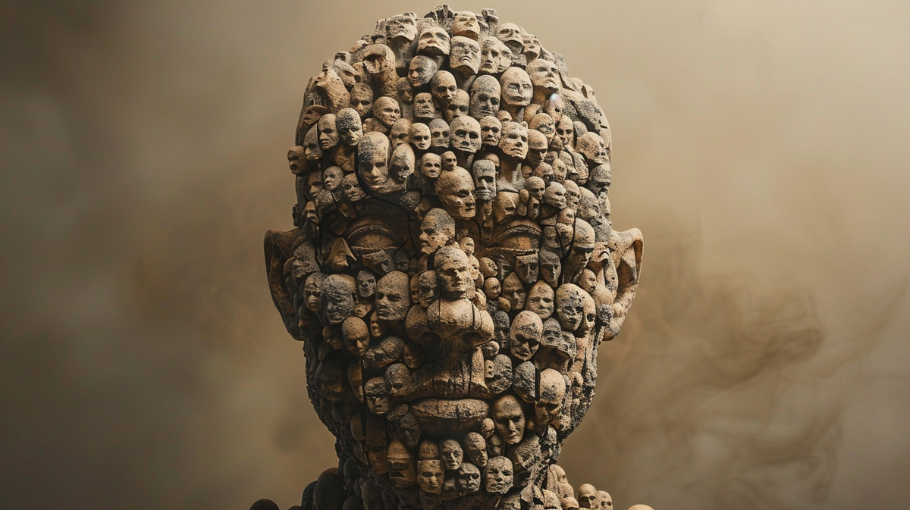

# Левиафаны, слоёное бытие и ноосферные бомбы

Современный человек смотрит на окружающий его мир совершенно не так, как делал это человек древности. В завывании ветра в лесу современный человек видит просто поток воздуха, древний же человек видел в нём проявление лесного духа. В громе и молниях современный человек видит только электрические разряды в атмосфере, древний же человек видел в грозе гнев богов или отголоски их ожесточенного сражения. Современный человек смотрит на мир как на бездушный механизм и рассматривает его исключительно с точки зрения разума, как учёный. Для человека древности же мир был живым - он смотрел на окружающую действительность как поэт, видя в каждом явлении одушевленных существ.

Два таких противоположных взгляда на мир немецкий философ Фридрих Ницше называл аполлоническим и дионисийским. Разумное начало мыслитель назвал в честь древнегреческого бога рационального мышления и порядка Аполлона, а поэтическое начало в честь бога вина и танца Диониса. В этом посте я хочу пойти по срединному пути и посмотреть на Вселенную одновременно с обеих этих точек зрения - острым лезвием логического анализа рассечь сущности на составные части и после узреть всё разнообразие явлений как океан, населённый бесчисленным множеством живых существ.

## Пространство фактов и интерпретаций

Австрийский философ Людвиг Витгенштейн в своей знаменитой книге "Логически-философский трактат" утверждал, что мир состоит из фактов. С моей точки зрения, всё немного сложнее, и имеет смысл говорить о двух различных аспектах мира - объективном и субъективном:

- Объективный мир - это пространство фактов
- Субъективный мир - это представление пространства фактов через призму интерпретации

Можно метафорически представить себе объективный мир в виде огромного белого листа с кучей чёрных точек, на котором каждая точка обозначает отдельный факт. В таком случае субъективный мир будет фигурой, образованной соединением точек друг с другом с помощью линий. Соединить точки можно бесчисленным количеством способов - каждая интерпретация соединяет факты по-своему. Либерал и коммунист, священник и атеист рассматривают одно и то же пространство фактов через призму различных интерпретаций и соединяют точки в совершенно непохожие фигуры.

Одно и то же пространство фактов может рассматриваться через призму разных интерпретаций. Например, история Советского Союза выглядит совершенно по-разному с точки зрения либерального нарратива и с точки зрения коммунистического. Где одни видят что-то плохое, другие видят видят что-то хорошее: для монархиста свержение царя - это катастрофа, а для демократа - шаг в правильную сторону.

Вселенная в целом включает в себя бесконечное количество как фактов, так и интерпретаций. В теории относительности Эйнштейн представлял мир в виде единого геометрического пространства с тремя пространственными и одним временным измерениями. Мы же можем представить мир в виде единого пространства фактов и интерпретаций - этакого произведения всех фактов на все возможные интерпретации.

## Дзен на

iOS и Android

Ещё
Эту статью может увидеть больше людей
Настройте продвижение для привлечения внимания к публикации и роста числа подписчиков
Настроить продвижение
Сергей Шпадырев
ваш канал
Перейти в Студию
Левиафаны, слоёное бытие и ноосферные бомбы
7 марта 2024
76
9 мин
Левиафан Гоббса
Современный человек смотрит на окружающий его мир совершенно не так, как делал это человек древности. В завывании ветра в лесу современный человек видит просто поток воздуха, древний же человек видел в нём проявление лесного духа. В громе и молниях современный человек видит только электрические разряды в атмосфере, древний же человек видел в грозе гнев богов или отголоски их ожесточенного сражения. Современный человек смотрит на мир как на бездушный механизм и рассматривает его исключительно с точки зрения разума, как учёный. Для человека древности же мир был живым - он смотрел на окружающую действительность как поэт, видя в каждом явлении одушевленных существ.

Два таких противоположных взгляда на мир немецкий философ Фридрих Ницше называл аполлоническим и дионисийским. Разумное начало мыслитель назвал в честь древнегреческого бога рационального мышления и порядка Аполлона, а поэтическое начало в честь бога вина и танца Диониса. В этом посте я хочу пойти по срединному пути и посмотреть на Вселенную одновременно с обеих этих точек зрения - острым лезвием логического анализа рассечь сущности на составные части и после узреть всё разнообразие явлений как океан, населённый бесчисленным множеством живых существ.

Пространство фактов и интерпретаций

Австрийский философ Людвиг Витгенштейн в своей знаменитой книге "Логически-философский трактат" утверждал, что мир состоит из фактов. С моей точки зрения, всё немного сложнее, и имеет смысл говорить о двух различных аспектах мира - объективном и субъективном:

Объективный мир - это пространство фактов
Субъективный мир - это представление пространства фактов через призму интерпретации
Можно метафорически представить себе объективный мир в виде огромного белого листа с кучей чёрных точек, на котором каждая точка обозначает отдельный факт. В таком случае субъективный мир будет фигурой, образованной соединением точек друг с другом с помощью линий. Соединить точки можно бесчисленным количеством способов - каждая интерпретация соединяет факты по-своему. Либерал и коммунист, священник и атеист рассматривают одно и то же пространство фактов через призму различных интерпретаций и соединяют точки в совершенно непохожие фигуры.

Одно и то же пространство фактов может рассматриваться через призму разных интерпретаций. Например, история Советского Союза выглядит совершенно по-разному с точки зрения либерального нарратива и с точки зрения коммунистического. Где одни видят что-то плохое, другие видят видят что-то хорошее: для монархиста свержение царя - это катастрофа, а для демократа - шаг в правильную сторону.

Вселенная в целом включает в себя бесконечное количество как фактов, так и интерпретаций. В теории относительности Эйнштейн представлял мир в виде единого геометрического пространства с тремя пространственными и одним временным измерениями. Мы же можем представить мир в виде единого пространства фактов и интерпретаций - этакого произведения всех фактов на все возможные интерпретации.

Слои бытия

Во время расцвета биологических наук людям было свойственно рассматривать Вселенную как огромный живой организм. В годы бурного развития машиностроения мир представлялся людям механизмом невероятного размера. В нашу же компьютерную эпоху мир видится многим как великий вычислительный процесс или программа, где главную роль играет информация. Это различные взгляды на одни и те же явления, различные интерпретации одних и тех же фактов. Кроме того мы можем рассматривать явления на различных уровнях или, можно сказать, на различных слоях бытия. Чтобы понять, о чём я говорю, давайте взглянем на небольшой пример.

Обычно мы воспринимаем человека как целостный образ. Однако, если мы начнём логически анализировать этот образ, он тут же испарится. Ведь человек - это совокупный образ процессов взаимодействия его органов. Каждый орган - это совокупный образ процессов взаимодействия разных биологических тканей. Каждая ткань - это совокупный образ процессов взаимодействия биологических клеток. Каждая клетка - это совокупный образ процессов взаимодействия молекул химических веществ. Каждая молекула - это совокупный образ процессов взаимодействия атомов. Каждый атом - это совокупный образ процессов взаимодействия элементарных частиц.

Таким образом, мы можем рассматривать человека на различных слоях бытия - на психологическом слое как личность, на анатомическом слое как организм, на биологическом как содружество клеток, на ещё более низших слоях как химический процесс или облако элементарных частиц. Для описания того, что происходит на каждом из слоев, мы будем использовать различные слова и выделять различные сущности. На одном уровне мы будем говорить о протонах и электронах, на другом о водороде и кислороде, на третьем о воде и сахарах, на четвертом о ядре и мембране, на пятом о мышцах и нервах, на шестом о клапанах и нейронах, на седьмом о сердце и мозге, на восьмом о радости и грусти и тому подобное.

Точно так же, как мы рассматриваем человека как совокупность его частей, мы можем рассмотреть его и как часть чего-то большего - семьи, субкультуры, народа, государства, биологического вида. Так мы можем взглянуть на мир на высших по отношению к человеку слоях бытия. При этом нельзя точно сказать, что слои эти чётко иерархичны. В одном слое человек может быть представителем народа, в другом носителем языка, в третьем гражданином государства, а в четвертом специалистом определенной профессии.

На разных слоях бытия мы выделяем различные сущности, следим за их рождением, развитием, угасанием и смертью. В одном слое действующими лицами являются клетки, в другом люди, в третьем языки, в четвертом государства, в пятом религии и так далее. Мы смотрим на человека и видим как он рождается, вырастает, стареет и умирает. То же самое мы можем сказать и обо всём остальном - у всего есть своя весна, своё лето, свои осень и зима. В таком случае, если мы утверждаем, что человек - живое существо, то что мешает нам сказать то же самое об языке или государстве? Если мы утверждаем, что мы живые, то почему мы не можем сказать того же о русском языке, русском народе или Российской Империи? На основании какого критерия мы можем отказать им в этом праве?

Английский философ Томас Гоббс в своём трактате "Левиафан" представлял государство в виде огромного живого существа, состоящего из миллионов отдельных людей. У этого существа как и у каждого отдельного человека есть свои интересы, как и человек оно может быть здоровым или больным, может сражаться с другими подобными себе и может погибнуть. Как у биологической клетки есть мембрана, так и у государства есть граница, как у человека макрофаги и лимфоциты борются с вирусами, так и у государства полиция и спецслужбы борются с преступниками и шпионами, как человек может искать смысл собственной жизни, так и государство ищет свой исторический путь.

Нет никакого критерия, согласно которому можно сказать, что одни сущности живые, а другие нет. Если мы признаем человека живым, то и государство мы обязаны признать живым. И либо на всё в мире мы смотрим по-аполлонийски - как на механизм, состоящий из составных частей, либо на всё в мире мы смотрим по-дионисийски - как на цельное живое существо. Тогда весь мир видится нам не мёртвой машиной, а кишащим жизнью океаном.

## Ноосферные вирусы

Русский философ Владимир Вернадский и французский теолог Пьер Тейяр де Шарден посвятили часть своих трудов рассмотрению одного из слоев бытия - ноосфере, сфере разума. Если в биосфере обитают вирусы и бактерии, то в ноосфере обитают идеи. И как фундаментальной частицей биологической эволюции является ген, так фундаментальной частицей ноосферной эволюции является мем.

Большие идеи, например христианство или социализм, состоят из множества мелких мемов. Со временем идеи изменяются и эволюционируют, подстраиваются под изменяющееся окружение. Те мемы, которые способствуют выживанию идей, распространяются. Например, мем "аборт - это плохо" присутствует во всех крупных религиях, так как положительно влияет на распространение этих идей. Я подробно описывал мемную эволюцию религий в статье "Как египетский фараон Аменхотеп основал христианство, и почему оно стало идеальным мемом".

Как в биосфере есть биологические вирусы, которые вызывают болезни и вредят организму, так и в ноосфере есть свои вирусы - идеи, которые заражают носителей и причиняют им вред. Биологические вирусы для заражения используют уязвимости в клетках, а ноосферные вирусы используют уязвимости в умах людей, их когнитивные искажения.

Примером таких ноосферных вирусов могут служить идеи различных религиозных или тоталитарных сект - например, в Российской Империи была популярна секта скопцов - мужчин и женщин, отрезавших свои детородные органы из-за дословной трактовки одной строчки из евангелия от Матфея:

> ... есть скопцы, которые сделали сами себя скопцами для Царства Небесного

С биологической точки зрения эта идея прямо препятствует собственному распространению - она с большим трудом передается от отца к сыну. Однако секта скопцов существовала многие десятилетия несмотря на многочисленные попытки государства её уничтожить. Скопцы не тратили средства на воспитание детей, имели много времени на работу и профессиональное развитие, завещали свои деньги другим членам секты - оттого были богаты и имели деньги на распространение собственной пропаганды среди дремучих и крайне набожных крестьян.

Государства-левиафаны постоянно ведут между собой войны, стараясь ослабить и поглотить друг друга. Изначально война левиафанов велась в основном только на суше, после левиафаны стали драться кораблями на море. В XIX веке битва левиафанов опустилась под воду, в XX веке взмыла в воздух. В американской войне во Вьетнаме и израильской операции в секторе Газа левиафаны сражаются даже в подземных норах и катакомбах.

Левиафаны изобрели поразительное количество способов уничтожить ближнего своего, и некоторые из них оказались настолько ужасны, что левиафаны договорились не использовать их: так например, государства запретили сами себе и друг другу использование биологического оружия. Но вот в отличии от биологического оружия, никакого контроля за использованием ноосферного оружия нет. Государства на регулярной основе конструируют вредные идеи, ноосферные вирусы, взламывающие когнитивную оборону противника и разрушающие того изнутри.

В своем магически-реалистическом романе "Искусство лёгких касаний" великий русский писатель Виктор Пелевин подробно рассказывает о применении ноосферного оружия друг против друга ведущими мировыми сверхдержавами. Так например он описывает результат применения русской ноосферной Царь-бомбы против США:

> ... современная Америка – это тоталитарный совок семьдесят девятого года с ЛГБТ на месте комсомола, корпоративным менеджментом на месте КПСС, сексуальной репрессией на месте сексуальной репрессии и зарей социализма на месте зари социализма…

Цель применения ноосферного оружия - подорвать основы стабильности другого государства, заставить часть населения ненавидеть свою собственную страну и действовать против его интересов. Государства-левиафаны постоянно применяют это оружие против друг друга, а сами с помощью цензуры, контроля за СМИ и интернетом выстраивают собственную ноосферную оборону.

Однако, у ноосферного оружия есть та же самая проблема, что и у биологического - это оружие неизбирательного поражения, которое может обернуться против самого применяющего. Ноосферные вирусы как и биологические вирусы не разбираются, кого заражают - русского или американца. К примеру, часто используемый США в последнее время нарратив про деколонизацию и права меньшиств сильно подрывает могущество и самой Америки.

Применение ноосферного оружия через соцсети и СМИ делает его оружием массового поражения. Так может быть ради большей стабильности на свете государствам стоит договориться об ограничении его использования точно так же, как они договорились об ограничении химического, биологического и атомного оружия?
