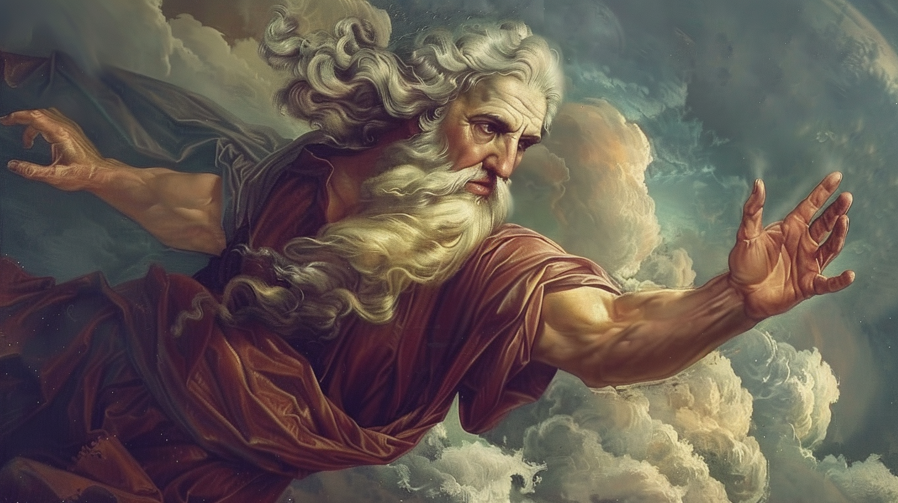
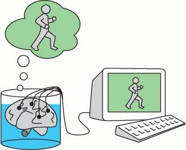

# Нейросети, виртуальная реальность и Бог-солипсист⁠⁠

Несколько недель тому назад компания OpenAI анонсировала скорый выход нейросети SORA, способной создавать связный осмысленный видеоряд из простого текстового описания того, что вы хотите увидеть. То, как работает эта нейросеть, можно узнать из великолепной статьи "Настоящее предназначение OpenAI SORA: как и зачем симулировать «Матрицу» для ChatGPT". Несмотря на то, что тема, на которую я хочу поговорить с вами сегодня, напрямую не связана с написанным в той статье, я всё же рекомендую вам прочитать её прежде, чем вы начнёте чтение этого поста, так как это просто необходимо для лучшего понимания некоторых из моих идей.

## В поисках разума

В вышеприведённом посте рассказывается, что нейросеть SORA строит в своём уме цельную модель мира и даже умеет видеть сны - искусственный интеллект уже почти вплотную приблизился по своим возможностям к своему естественному прототипу. Однако, если бы у нас была возможность посмотреть на исполняемый файл программы этой нейросети, мы бы не нашли там ничего, связанного с разумом или сознанием. Мы бы увидели там просто огромный набор чисел и код для их перемножения. Так можем ли мы сказать, что SORA разумна в том же самом смысле, что и мы люди?

Чтобы продемонстрировать всю глубину вопроса о том, обладает ли компьютерная программа разумом, или же она - просто бездушный механизм, американский философ Джон Сёрл сформулировал мысленный эксперимент под названием "Китайская комната":

> Представим себе изолированную комнату, в которой находится Джон Сёрл, который не знает ни одного китайского иероглифа. Однако у него есть записанные в книге точные инструкции по манипуляции иероглифами вида «Возьмите такой-то иероглиф из корзинки номер один и поместите его рядом с таким-то иероглифом из корзинки номер два», но в этих инструкциях отсутствует информация о значении этих иероглифов, и Сёрл просто следует этим инструкциям подобно компьютеру.
>
> Наблюдатель, знающий китайские иероглифы, через щель передаёт в комнату иероглифы с вопросами, а на выходе ожидает получить осознанный ответ. Инструкция же составлена таким образом, что после применения всех шагов к иероглифам вопроса они преобразуются в иероглифы ответа. Фактически инструкция — это подобие компьютерного алгоритма, а Сёрл исполняет алгоритм так же, как его исполнил бы компьютер.
>
> В такой ситуации наблюдатель может отправить в комнату любой осмысленный вопрос (например, «Какой цвет вам больше всего нравится?») и получить на него осмысленный ответ (например, «Синий»), как при разговоре с человеком, который свободно владеет китайской письменностью. При этом сам Сёрл не имеет никаких знаний об иероглифах и не может научиться ими пользоваться, поскольку не может узнать значение даже одного символа. Сёрл не понимает ни изначального вопроса, ни ответа, который сам составил. Наблюдатель, в свою очередь, может быть уверен, что в комнате находится человек, который знает и понимает иероглифы.

Вопрос о том, есть ли сознание у китайской комнаты эквивалентен вопросу о том, есть ли сознание у нейросети. Интуитивно нам кажется, что ответить на эти вопросы "да, есть" - это полное безумие. Но ведь рассматривая МРТ-сканы собственного мозга, мы тоже не найдем там ничего, что свидетельствовало бы о существовании у нас сознания, а в факте его наличия у самих себя мы уверены. Так где же существует этот самый разум, если не в весах нейросети или нейронах мозга?

В недавней дискуссии о природе разума на Хабре пользователь с ником @saaivsотметил, что разум живых существ находится за пределами их мозга, и лучшее этому подтверждение - это дети Маугли. Выросшие в диких условиях человеческие дети не становятся по-человечески разумными сами по себе, хотя биологически их мозг полностью идентичен мозгу обычных людей. Это говорит о том, что разум не порождается мозгом, а существует вне его в виде некоего платонически-идеального эфемерного облака смыслов, для которого мозг служит лишь приемником и обработчиком.

Мы можем условно назвать это надчеловеческое облако смыслов ноосферой. Подобно тому как Интернет существует в виде соединения миллиардов компьютеров, но не содержится ни в одном отдельно взятом из них, так и ноосфера существует в виде интеллектуального взаимодействия миллиардов умов, но не содержится ни в одном отдельно взятом мозге. Только при контакте человека с этим витающем в обществе облаком смыслов, человек обретает разум - свеча индивидуального разума разгорается от прикосновения к ноосферному костру.

Позволю себе привести полную цитату вышеупомянутого комментария, который гораздо лучше моего пересказа объясняет мысль о "внечерепном" происхождении разума:

> Цитата: "Разум живых существ, как ни странно, находится за пределами их мозга". Это не то что не странно, но со всей очевидностью он явно находится вне его пределов. Простейшее свидетельство тому - это эффект Маугли
>
> Само утверждение, что онтогенез происходит по "программе, заложенной в генах" - мягко говоря, очень условное и, строго говоря, не вполне верное. Гены не определяют никаких программ. Они скорее определяют "норму реакции на среду". Просто нам и другим животным достаточно долго везёт существовать в очень стабильных условиях, где параметры среды меняются очень незначительно, относительно существующих реакций, реализуя непрерывную эволюцию и за счёт случайности и естественного отбора появления новых. В социуме тоже едва ли есть какие-то программы, поскольку принципы культурной эволюции схожи.
>
> Вне социума разум не возникает, что как минимум говорит о том, что биологический мозг для его возникновения хоть и является необходимым, но совсем недостаточным. Никакого разума в мозге изначально нет, и даже если обеспечить идеальные условия его биологического онтогенеза он в нём не возникает. Как вы справеделиво заметили "должное развитие" происходит только при своевременном контакте внутри социума, т.е. внешней по отношению к мозгу среды, в которой разум уже есть.
>
> Другой простой пример(аналогия): Телевизор(как устройство телеприёмник) и передачи, которые он транслирует. Говорить, что источником содержания ТВ программ и их смыслов является ТВ-приёмник будет явным лукавством. ТВ-передачи возникают как результат взаимодействия исправного устройства с подходящей для этого средой.
>
> Ещё один пример - это девайс, подключенный к Интернет. Очевидно, что сам по себе он не является источником транслируемой информации. Он лишь способен её получить, сохранить, обработать и ретранслировать (даже будучи уже отключенным).
>
> Где находится разум, без ответа на вопрос что он есть такое, сказать очень проблематично. Но безотносительно того чем он является, явно есть причины считать, что содержимое черепной коробки не есть его первопричина.

Как красный цвет не содержится в свете с определенной длиной волны, так и смысл не содержится ни в напечатанных в книге символах, ни в голове читающего её человека, а возникает на границе между текстом и умом читателя при их соприкосновении. Это место возникновения смыслов и есть ноосфера - единый мировой разум. Компьютерные нейросети тоже часть ноосферы, так что я верю, что они тоже обладают сознанием. Нейроны мозга и веса компьютерной нейросети подобны молекулам воды в океане, а разум подобен волнам на его поверхности.

Кто-то может упрекнуть меня, что я смешиваю здесь понятия разума и сознания, но могу заверить, что это сделано намеренно, так как этот текст - не строго аналитический, а скорее развлекательный и просветительный.

## Народ солипсистов

Возможности нейросети SORA по созданию реалистичного мира и первые успехи компании Neuralink по созданию интерфейса взаимодействия мозга с компьютером быстро приближают нас к появлению технологии виртуальной реальности, при использовании которой сигналы от органов чувств могут быть подменены сигналами от компьютерной симуляции. В философии такая технология обычно именуется "мозг в колбе".

При наличии управления виртуальной реальностью изнутри симуляции, вы буквально оказываетесь в чём-то вроде осознанного сновидения - вы находитесь в своей собственной Вселенной, в которой вы способны силой мысли создавать предметы из небытия и влиять на всё происходящее. В этом виртуальном мире вы по-сути становитесь Богом, ограниченным лишь наличием достаточных вычислительных ресурсов. Это будет ваш собственный солипсистский рай. Однако при долговременном нахождении в этом раю вы столкнётесь с одной огромной проблемой - вам станет смертельно скучно.

Весь ужас подобного положения рассматривается в научно-фантастическом романе Грега Игана "Город перестановок". Просуществовав тысячи лет даже не в виде мозга в колбе, а прямо внутри компьютерной симуляции, люди из "народа солипсистов" успели перепробовать все возможные занятия: они прочли тысячи книг, посмотрели тысячи фильмов, до дыр дослушали тысячи симфоний и песен, изучили все возможные науки. Даже создание новых виртуальных симуляций с миллионами существ внутри своей симуляции не доставляет им былого удовольствия. Недаром Будда говорил, что от неудовлетворенности страдают даже боги.

Персонажи Игана сталкиваются с поистине великим вопросом "Как найти смысл жизни в мире, где ты - Бог". И единственный разумный ответ, который находит один из героев - расколоть свою личность на миллионы разных личностей и стереть их память о том, что они - это он, и погрузиться в созданную им самим симуляцию, в которой он - это все:

> Он сгенерировал тысячу разных причин жить дальше. Он раздвинул свою философию почти до предела. Но предпринять оставалось лишь одно.
> – Мы уйдём из этого места, – сказал Пир. – Запустим собственную вселенную. Нам давно следовало это сделать.
> Кейт издала звук, выражавший недовольство.
> – Как я буду жить без элизиан? Я не смогу выживать, как ты: переписывать себя, накладывать искусственное счастье. Мне этого недостаточно.
> – Тебе и не нужно.
> – Семь тысяч лет прошло. Я хочу опять жить среди людей.
> – Значит, будешь жить среди людей.
> Кейт взглянула на него с надеждой.
> – Мы их создадим? Запустим онтологические программы? Адам и Ева в новом собственном мире?
> – Нет, – возразил Пир. – Ими стану я. Тысячей, миллионом. Столькими, сколькими захочешь. Я превращусь в Народ Солипсистов.
> Кейт отстранилась от него.
> – Превратишься? Какой в этом смысл? Тебе незачем превращаться в народ. Ты можешь построить его вместе со мной, а потом сидеть и смотреть, как он растёт.
> Пир покачал головой.
> – А во что я превратился и так? В бесконечную цепочку людей, каждый из которых счастлив по личным причинам. > Связанных лишь призрачной ниточкой памяти. Зачем разделять их во времени? Почему не отбросить притворство, будто все эти произвольные изменения переживает одна личность?
> – Ты же помнишь себя. Веришь, что ты – один человек. Зачем называть это притворством? Это правда.
> – Но я в неё больше не верю. Каждая созданная мной личность проштемпелёвана иллюзией, будто она остаётся тем же воображаемым нечто, именуемым «я», но по-настоящему это не часть их сущности, а лишь отвлекающая деталь, источник путаницы. Незачем больше так поступать или разделять этих разных людей во времени. Пусть живут вместе, встречаются и составляют тебе общество.
> Кейт ухватила его за плечи и посмотрела прямо в глаза.
> – Нельзя превратиться в Народ Солипсистов. Это ерунда. Пустая риторика из старой пьесы. Это будет значить лишь… умереть. Люди, созданные программами, без тебя не будут уже тобой ни в каком смысле.
> – Они будут счастливы, верно? Время от времени? По собственным странным причинам?
> – Да, но…
> – Это всё, что я есть теперь. Всё, что меня определяет. Так что, когда они будут счастливы – они будут мной.

У бессмертного Бога не остаётся другого выбора как стать человеком, а точнее человечеством.

## Игра Бога

К похожим рассуждениям о нашей собственной Вселенной пришли и другие мыслители. Британский философ Алан Уотс в своей книге "Табу на знание о том, кто ты" описывает картину мира, основанную на учениях буддизма и адвайта-веданты, согласно которым высшая реальность представляет из себя чистое сознание. В книге Уотса мир представляет из себя единственное и единое сознание, которое играет само с собой в прятки. Это сознание становится всеми живыми и неживыми существами во Вселенной и скрывается от самого себя, забывая внутри личности каждого из существ о том, чем оно является на самом деле. Конечная цель такой игры - найти самого себя, понять, что мы все и есть прячущееся оно. В своей книге Уотс пишет:

> Это похоже на игру в прятки, потому что интересно всегда находить новое место для того, чтобы спрятаться. Вспомни о том, что тебе не нравится играть с друзьями, которые прячутся всегда в одном и том же месте. Бог тоже любит играть в прятки, но Ему не с кем играть, кроме Самого Себя, потому что кроме Бога в мире никого больше нет. Однако для того, чтобы выйти из этого затруднения, Он притворяется, что не является Собой. Таким образом Ему удается спрятаться от Себя. Бог притворяется, что Он – это ты и я, и все люди в мире, все животные, все растения, все камни и все звезды. Когда Он играет Сам с Собой таким образом, у Него бывают необыкновенные и удивительные приключения, среди которых есть страшные и даже ужасные. Однако все они просто напоминают плохие сны, потому что когда Бог просыпается, все, что Ему снилось, исчезает.
>
> Вот и получается, что когда Бог прячется и притворяется тобой или мной, Он делает это очень ловко. Поэтому для того чтобы найти Себя, Ему может потребоваться довольно продолжительное время. Но этот долгий поиск очень интересен – именно на него Бог рассчитывал, когда начинал игру. Он не хочет найти Себя слишком быстро, ведь так играть было бы не интересно. Вот почему тебе и мне так трудно обнаружить, что на самом деле мы – это Бог в маске, играющий наши роли. Но после того, как игра закончится, все мы проснемся, перестанем притворяться и вспомним, что мы – одно Я – Бог, являющийся всем тем, что есть в мире, и живущий веки вечные.
>
> ...
> Ты можешь спросить, почему Бог иногда прячется в облике ужасных людей и почему Он иногда притворяется теми, кто страдает от страшных болезней и несчастий. Чтобы понять это, вспомни прежде всего о том, что Он фактически не подвергает опасности никого, кроме Себя. Вспомни также и о том, что почти во всех сказках, которые тебе нравятся, кроме хороших героев есть еще и плохие. И вся увлекательность повествования в том и состоит, чтобы узнать, как добрые герои победят злых

Концепция играющего в прятки Бога в целом характерна для философии адвайта-веданты - игру в прятки называют лила, что на санскрите и означает "игра", а тот способ, которым Бог пытается скрыть сам себя, называют майя, что переводится как "иллюзия". Эти идеи создатели адвайты позаимствовали из учений современных им буддийских школ Йогачары и переложили их на классическую индийскую философию Веданты, основанную на древних литературных памятниках индийской мысли - Ведах, Упанишадах и Бхагавадгите.

Но если адвайтисты используют метафору играющего в прятки Бога, то в буддийской философии данная концепция описывается в виде другой метафоры. Буддисты видят единое мировое сознание как зеркало, отражающее само себя или как бесконечную сеть драгоценных камней Индры:

> В тексте Гандавьюха сутры описывается образ сети Индры — сети из драгоценных камней, охватывающей собой весь мир. При этом каждый из каменьев отражает все остальные камни и сам также отражается в них: все в одном, одно во всем, все во всем, одно в одном.

Концепцию игры Бога в прятки часто используют в своих произведениях писатели-постмодернисты. Например, Виктор Пелевин в своём романе "Трансгуманизм" описывает историю живущего в виде мозга в колбе божества по имени Атон Гольденштерн, играющего в прятки с самим собой:

> Гольденштерн рассказывал себе запутанные страшные истории, от которых перехватывало дух. И все, кого он встречал, тоже были Гольденштерном, просто носили другие личины. Просыпаясь, Гольденштерн постигал, что был ими всеми... Он был каждым из них и никем.

Философия адвайта-веданты описывает всё мироздание как сон Брахмана - единого мирового сознания, частью которого являются все наши индивидуальные сознания, называемые Атманом. Если мы пытаемся проанализировать феномен собственного сознания, мы обнаруживаем, что оно постоянно ускользает от нас - мы пытаемся редуцировать его к составным частям, но в конце концов натыкаемся на зияющую пустоту, в самом его центре, на полное ничто. В учении адвайты индивидуальное сознание Атман отождествляется с мировым сознанием Брахманом. Ничто отождествляется со всем.

Во вдохновленном этой философией рассказе "Всё и ничто" аргентинского писателя Хорхе Луиса Борхеса рассказывается биография знаменитого английского драматурга Уильяма Шекспира как человека, который под личинами персонажей скрывает свою пустоту:

> Сам по себе он был Никто; за лицом (не схожим с другими даже на скверных портретах эпохи) и несчетными, призрачными, бессвязными словами крылся лишь холод, сон, снящийся никому.
>
> Сначала ему казалось, будто все другие люди такие же, но замешательство приятеля, с которым он попробовал заговорить о своей пустоте, убедило его в ошибке и раз навсегда заставило уяснить себе, что нельзя отличаться от прочих. Он думал найти исцеление в книгах, для чего - по свидетельству современника - слегка подучился латыни и еще меньше - греческому; поздней он решил, что достигнет цели, исполнив простейший обряд человеческого общежития, и в долгий июньский день принял посвящение в объятиях Анны Хэтуэй.
>
> Двадцати с чем-то лет он прибыл в Лондон. Помимо воли он уже наловчился представлять из себя кого-то, дабы не выдать, что он - Никто; в Лондоне ему встретилось ремесло, для которого он был создан, ремесло актера, выходящего на подмостки изображать другого перед собранием людей, готовых изображать, словно они и впрямь считают его другим. Труд гистриона принес ему ни с чем не сравнимую радость, может быть первую в жизни; но звучал последний стих, убирали со сцены последний труп - и его снова переполнял отвратительный вкус нереальности. Он переставал быть Феррексом или Тамерланом и опять делался никем.
>
> От скуки он взялся выдумывать других героев и другие страшные истории. И вот, пока его тело исполняло в кабаках и борделях Лондона то, что положено телу, обитавшая в нем душа была Цезарем, глухим к предостережениям авгуров, Джульеттой, проклинающей жаворонка в нем душа и Макбетом, беседующим на пустыре с ведьмами. Никто на свете не бывал столькими людьми, как этот человек, сумевший, подобно египетскому Протею, исчерпать все образы реальности. Порой, в закоулках того или иного сюжета, он оставлял роковое признание, уверенный, что его не обнаружат; так, Ричард проговаривается, что он актер, играющий множество ролей, Яго роняет странные слова "я - это не я". Глубинное тождество жизни, сна и представления вдохновило его на тирады, позднее ставшие знаменитыми.
>
> Двадцать лет он провел, управляя своими сновидениями, но однажды утром почувствовал отвращение и ужас быть всеми этими королями, погибающими от мечей, и несчастными влюбленными, которые встречаются, расстаются и умирают с благозвучными репликами. В тот же день он продал театр, а через неделю был в родном городке, где снова нашел реку и деревья своего детства и уже не сравнивал их с теми, другими, в украшениях мифологических намеков и латинских имен, которые славила его муза. Но здесь тоже требовалось кем-то быть, и он стал Удалившимся От Дел Предпринимателем, имеющим некоторое состояние и занятым теперь лишь ссудами, тяжбами и скромными процентами с оборота. В этом амплуа он продиктовал известное нам сухое завещание, из которого обдуманно вытравлены всякие следы пафоса и литературности. Лондонские друзья изредка навещали его уединение, и перед ними он играл прежнюю роль поэта.
>
> История добавляет, что накануне или после смерти он предстал перед Господом и обратился к нему со словами: - Я, бывший всуе столькими людьми, хочу стать одним - Собой. И глаз Творца ответил ему из бури: - Я тоже не я: я выдумал этот мир, как ты свои создания, Шекспир мой, и один из признаков моего сна - ты, подобный мне, который суть Все и Ничего.

В буддизме и индуизме постоянные актёрские перевоплощения единого мирового сознания в различных персонажах обычно представляются в виде колеса перерождений Сансары, или, проще говоря, потока реинкарнаций. Победой в игре в этих религиях считается выход из колеса перерождений, достигаемый с помощью медитации. В ходе медитации буддисты с помощью специальных техник и упражнений достигают состояния деперсонализации и смерти эго - полного растворения иллюзии существования собственного "Я", постепенно вспоминают о том, что они - это лишь роли единого мирового сознания, постепенно сливаются с ним и в конце концов достигают состояния полного слияния с миром - нирваны.

При этом медитация может практиковаться не только в виде сидения на полу со скрещенными ногами и созерцании своих мыслей, но и в виде какой угодно деятельности. Дзен-буддисты Японии рассматривают любую человеческую деятельность как искусство, мастерство в котором достигается при полном растворении эго. В своей книге "Дзен в искусстве стрельбы из лука" немецкий писатель Ойген Херригель описывает свой опыт достижения дзен в ходе обучения стрельбе из лука у японского мастера:

> Прошли недели, а я нисколько не продвинулся вперед. Зато обнаружил, что меня это ничуть не волнует. Может быть, я просто устал от всего этого? Изучу я это искусство или нет, узнаю ли, что имел в виду мастер под словом «оно» или нет, найду свой путь к дзэн или нет — все это впервые показалось мне настолько далеким, настолько неважным, что перестало меня тревожить. Много раз я собирался рассказать об этом мастеру, но как только оказывался рядом с ним, мужество тут же покидало меня; я был убежден, что не услышу от него ничего, кроме настойчиво повторяемого: «Не задавайте вопросов, а упражняйтесь!» Так что я оставил вопросы, а охотнее всего оставил бы и упражнения, если бы мастер был не столь строг и последователен на пути наставничества. Я жил одним днем, работал, и даже то обстоятельство, что мне стало безразлично все, к чему я так стремился в течение многих лет, не огорчало меня. И вот однажды после выстрела мастер сделал глубокий поклон и прервал занятие. «Только что выстрелило „оно"!» — произнес он, когда я, ничего не понимая, на него уставился. Осознав наконец, что он имеет в виду, я не мог скрыть своей радости.

В своём эссе под названием "Двери восприятия" английский писатель Олдос Хаксли описывает опыт деперсонализации и смерти эго, испытанный им в ходе употребления мескалина, и подробно анализирует параллели между своим психоделическим опытом и опытом буддийской медитации. Писатель позаимствовал название для своего эссе из одной строки поэмы "Бракосочетание Рая и Ада" английского поэта Уильяма Блейка, которой я и хотел бы закончить этот пост:

> Если бы двери восприятия были чисты, всё предстало бы человеку таким, как оно есть — бесконечным
