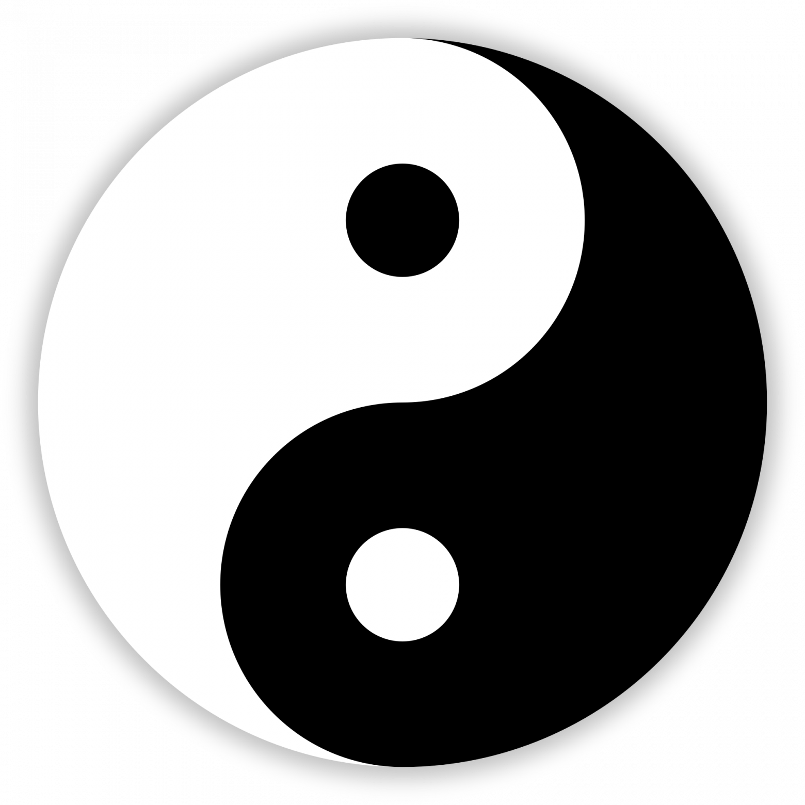

# Двоичный код Вселенной и симметричные языки


В основанном древнегреческим философом Пифагором сакрально-математическом культе одной из основных практик было религиозное поклонение числам. С особым трепетом пифагорейцы относились к двум числам: единице и двойке. Единица символизировала внутреннее единство всего сущего, а двойка отождествлялась с разделением мира на противоположности.

В современном мире эта двойственность противоположностей лежит в основе всей вычислительной техники: компьютеры работают на основе двоичного кода - длинных последовательностей нулей и единиц, часть из которых кодирует данные, а часть - исполняющуюся программу. Но мало кто осознает, что кроме компьютерной техники, двойственность играет фундаментальную роль и в самой природе Вселенной.

## Двойственность

Больше всего внимания роли двойственности в природе уделено в восточных философиях, в особенности в буддизме и родственной ему индуистской адвайта-веданте. В буддизме мир считается порождением нашего ума. Две основные функции ума - это различение сущностей и конструирование абстракций на их основе. Согласно буддийской доктрине взаимозависимого возникновения, как только наш ум различает некоторую сущность, тут же возникает и её полная противоположность. Например, как только мы среди доступных нашему восприятию цветов выделяем красный цвет, то автоматически мы выделяем также и всё, что красным не является. Как только появляется А, появляется и НЕ-А, и тут же из этих противоположностей наш ум начинает строить концепции и абстракции.

Даже сами две основные функции ума, перцепция (восприятие/различение сущностей) и концепция (конструирование абстракций), представляют из себя некую симметрию. В своем эссе под названием "Двери восприятия" английский писатель Олдос Хаксли размышляет над тем, что концепции настолько сильны в нашем мышлении, что мы забываем о том, что лежит в их основе, и можем вернуться в чистое восприятие только вследствие изменения химии нашего мозга:

> В течение, казалось, невообразимо долгого времени я глядел, не зная и даже не желая знать, с чем это я встретился. В любое другое время я бы увидел стул, исполосованный попеременно светом и тенью. Сегодня же перцепция поглотила концепцию. Я был настолько полно поглощен этим зрелищем, настолько поражен тем, что видел, что не мог более ничего воспринимать. Садовая мебель, рейки, солнечный свет, тень – все они были не больше, чем имена и понятия, простые вербализации в утилитарных или научных целях уже после события. Самим же событием было это чередование лазурных печных топок, разделенных зарослями невообразимой горечавки.
>
> И внезапно у меня возникло ощущение, что я могу понять, каково быть безумным. У шизофрении есть свои небеса так же, как и свои преисподние и чистилища; я помню, что мне рассказывал один мой старый друг, уже много лет покойный, о своей безумной жене. Однажды, на ранней стадии заболевания, когда у нее еще были интервалы ясности, он приехал к ней в больницу поговорить о детях. Она немного послушала его, а затем прервала. Как мог он тратить свое время на пару отсутствующих детей, когда единственным, что имело значение здесь и сейчас, была невыразимая красота узоров, которые он производил своим коричневым твидовым пиджаком всякий раз, когда двигал руками?

Взаимозависимое возникновение противоположностей приводит к симметриям, которые в свою очередь лежат в основе всего мироздания. В 1915 году немецкий математик Эмми Нетёр доказала, что все законы сохранения в физике прямо следуют из симметрий физических систем.

## Симметрии

Если мы посмотрим на окружающую нас действительность, мы увидим, что мир полон двойственности. В пространстве лево симметрично праву, верх симметричен низу, а перед симметричен заду. Во времени прошлое симметрично будущему относительно настоящего. Покой симметричен движению. Свет симметричен тьме, а день симметричен ночи. Волны в квантовой механике симметричны частицам. Родители взаимозависимо возникают с детьми, а причины возникают со следствиями. Когда мы смотрим на эти симметрии, мы видим как одно взаимосвязано с другим, и одно не может существовать без другого. Как могут существовать кванты света, если они не разделены тьмой? Но всё меняется, когда мы смотрим на некоторые другие вещи.

Добро возникает взаимозависимо со злом. То, что для нас добро, для человека с другими убеждениями может быть злом. Мы неистово привязываемся к своим взглядам и считаем, что добро в нашем понимании должно обязательно победить зло. Такая картина мира с противостоянием добра и зла свойственна детским сказкам, но и во взрослом возрасте многие верят в неё. Мы привязываемся к одной из сторон и невзлюбливаем вторую, забывая о том, что они возникли взаимозависимо.

Появление симметрично исчезновению и рождение симметрично смерти. Люди с радостью встречают рождение ребенка, и с горестью встречают смерть любимого человека. Им хочется оставить только то, что им нравится, и избавиться от того, что не нравится. Отсюда вечные поиски философского камня и зелья бессмертия. Однако, одно не может существовать без другого - рождение не может существовать без смерти, а смерть без рождения. Для существования жизни, эволюции и естественного отбора нужно и то, и другое.

Многие мыслители призывали не страшиться смерти, а рассматривать её так же, как и рождение. Например, древнегреческий философ Эпикур призывал не видеть в своей смерти ничего страшного:

> Не бойся смерти: пока ты жив — её нет, когда она придёт, тебя не будет

Будучи привязанными к иллюзии собственного "Я", мы пытаемся всеми силами избежать смерти, или хотя бы не думать о ней. Но смерть - это такая же часть нашей жизни, как и наше рождение. После смерти этого "Я" уже не будет, уже нечему будет страдать. Об этом пишет американский писатель Марк Твен:

> Я не боюсь исчезнуть. Прежде, чем я родился, меня не было миллиарды и миллиарды лет, и я нисколько от этого не страдал

Во многих других симметричных явлениях мы так же привязываемся к чему-то одному и стараемся избежать другого. Разум и эмоции, идеализм и материализм, сознание и тело, боль и удовольствие, любовь и ненависть, активизм и созерцание - в разных ситуациях мы выбираем что-то одно, привязываемся к этому и страдаем из-за последствий нашего выбора. Нужно понимать, что внутреннюю гармонию мы обретаем только тогда, когда принимаем мир таким, какой он есть - во всей его целостности.

Британский философ Алан Уотс в своей книге "Табу на знание о том, кто ты" метафорически описывает то, чем занимаются люди, привязываясь к одной из сторон симметрии и пытаясь избежать другой, игрой в Чёрное-Белое:

> Таким образом, в течение тысячелетий история человечества является удивительно бессмысленным конфликтом. Ведь как бы люди ни старались, их жизнь остается великолепно поставленной драмой, в которой триумфы чередуются с поражениями. И все это потому, что здравый смысл упорно отказывается признать, что Черное не может существовать без Белого. Возможно, никогда еще в истории мира ничто не шло в никуда с таким обилием восхитительной суеты. Как и в том случае, когда Труляля и Траляля согласились соперничать друг с другом, существенной деталью Игры в Черное-и-Белое остается тщательно скрываемый заговор между противоположностями, согласно которому они прячут свое единство и стараются выглядеть как можно более различными. Это напоминает настолько хорошую постановку поединка на сцене, что зрители невольно начинают верить в то, что видят реальную схватку.

Израильский антрополог Юваль Ной Харари приводит похожий пример:

> Они подобны человеку, который многие годы стоит на берегу, радуясь «хорошим» волнам и стараясь их удержать, и отгоняя «плохие», чтобы не подобрались чересчур близко. День изо дня он стоит на берегу, доводя себя до исступления этим бессмысленным занятием. Наконец усаживается на песок и расслабляется — пусть себе волны грохочут как вздумается. Вот оно, блаженство! Нирвана

Таким образом, вся наша Вселенная - это сплошной круговорот противоположностей, который китайские философы изображали в виде знака Инь и Ян. Одно невозможно без другого.



Все возможные компьютерные программы сводятся к двоичному коду - последовательности нулей и единиц. Без существования этой симметрии существование программ просто не было бы возможным. Так и существование мира невозможно без существования различных противоположностей. Недаром сейчас одним из основных понятий в физике становится информация, которую измеряют в битах. Многие учёные, вроде американского физика Джона Арчибальда Уилера, автора теории "it from bit", даже считают информацию самым фундаментальным понятием всей науки.

И действительно бита достаточно для существования целой Вселенной. В бесконечной случайной последовательности нулей и единиц закодированы все возможные книги, фильмы, игры и программы. Там присутсвует даже этот самый пост, который вы сейчас читаете. Эта последовательность битов - одна огромная вавилонская библиотека Борхеса, где всё закодировано в двух простых символах - нуле и единице.

## Симметричный язык программирования

Мысль о фундаментальной роли симметрии в природе захватила мой ум довольно давно. Несколько лет назад эта идея воплотилась в разработанном мною на основе LISP, Javascript и Python функциональном языке программирования Una, отличительная особенность которого - симметрии между операциями.

Основная симметрия языка представляет из себя две базовые операции - абстракцию и аппликацию. Абстракция - это создание именованной константы, а аппликация - это применение операндов к оператору и вычисление выражения.

```
# Пример абстракции
= a 1

# Пример аппликации
+ a 2
```

Симметричность абстракции и аппликации не совсем очевидна, но именно она лежит в самой основе этого языка. Кроме того в языке используются стрелочные симметрии.

Первая стрелочная симметрия - это симметрия функций. Правонаправленная стрелка обозначает объявление функции, а левонаправленная - немедленно вызываемое функциональное выражение (IIFE), которое на месте вычисляет и возвращает результат выполнения написанного кода.

```
# Объявление функции
= sum -> (x y)
  + x y

# Немедленно вызываемое функциональное выражение

= c <-
  + 1 2
```

Вторая стрелочная симметрия - это симметрия асинхронных функций. Правонаправленная стрелка обозначает объявление асинхронной функции (async), а левонаправленная - ожидание результата её исполнения (await).

```
# Объявление асинхронной функции (async)
= getUser --> id
  database.loadUser id

# Ожидание выполнения асинхронной функции (await)
= user <-- (database.loadUser id)
```

Третья стрелочная симметрия - это симметрия работы с ошибками. Правонаправленная стрелка обозначает объявление блока try-catch, а левонаправленная - выброс ошибки. Блок try-catch в данном случае принимает немедленно вызываемое функциональное выражение в роли блока try, и функцию в роли блока catch.

```
# Блок обработки ошибок
|->
  <-
    = getName null
    getName ()
  -> error
    console.log error
    'John'

# Выброс ошибки
<-| "number is not valid"
```

Четвертая стрелочная симметрия - это симметрия работы с модулями. Правонаправленная стрелка обозначает импорт модуля, а левонаправленная - экспорт из модуля.

```
# Импорт модуля
=-> 'react' React


# Экспорт константы a в качестве дефолтного значения
<-= a
```

Пятая стрелочная симметрия - это симметрия работы с цепочками вызовов. Правонаправленная стрелка обозначает цепочку вызовов по последнему параметру, а левонаправленная - по первому параметру. Приводить здесь пример этих операций я не хочу, так как он будет слишком большим по объему.

Кроме стрелочных операций симметрия в Una есть и между конструкцией и деконструкцией хешмап и массивов.

```
# Конструкция хешмапы
= user :
  name 'John'
  age 13
  parents :
    mother :
      name 'Alice'
      age 42
    father :
      name 'Bob'
      age 39

# Деконструкция хешмапы
= (: name) user
console.log name
# Конструкция массива
= numbers :: 1 2 3
```

```
# Деконструкция массива
= (:: firstNumber secondNumber) numbers
console.log secondNumber
```

И хотя язык Una не используется в реальной разработке, его изучение даёт программисту глубокое понимание тех принципов, на которых основано его ремесло. Возможно, после ознакомления с Una вы начнёте лучше понимать и свой родной язык программирования.

## Симметричный язык общения

В начале и середине XX века в философии произошёл так называем лингвистический поворот. Ключевой точкой этого поворота стала публикация книги австрийского философа Людвига Витгенштейна под названием "Логико-философский трактат". Основная его идея заключается в том, что наш язык оказывает огромное влияние на то, как мыслим, и мы должны учитывать это при наших рассуждениях о мире. Философы предприняли множество попыток реформировать язык и решить тем самым некоторые извечные философские вопросы.

В самой лингвистике мысль о влиянии языка на мышление была сформулирована в виде знаменитой гипотезы лингвистической относительности Сепира-Уорфа. Суть этой гипотезы сводится к тому, что используемый при рассуждении язык может мешать или наоборот помогать человеку дойти до определенной мысли. И хотя верность строгой версии гипотезы, гласящей, что используемый язык ограничивает когнитивные возможности человека, была экспериментально опровергнута, слабая её версия, гласящая, что используемый язык сильно влияет на мышление человека, в целом подтверждена.

Исходя из этого, возможно, что для лучшего понимания и осознания двойственности и симметричности мироздания, имело бы смысл разработать язык, в котором эта самая двойственность включена в саму его морфологию. Подобно ивриту и прочим семитским языкам, в которых буквенный корень попадая в определенную форму приобретает определенное значение, в этом двойственном языке подставление буквенного корня в определенную форму давало бы одно из симметричных значений.

К примеру, в иврите корень "спр" имеет значение, связанное со счётом, а корень "хтв" значение, связанное с письменностью. Подставляя эти корни в форму "ми12а3", означающую сущность, связанную с подставляемым значением, мы получаем слова "миспар", означающее "число", и слово "михтав", означающее "письмо". Подобно этому, мы могли бы создать язык, в котором буквенные корни подставляются в две симметричные формы и приобретают противоположные значения.

Пусть форма "э1э2" означает одну из сторон симметрии, а форма "у1у2" будет означать противоположную сторону, а "и1и2" середину между ними. Подставляя в эти две формы разные корни мы будем формировать словарный запас нашего языка.

Пусть корень "бл" имеет значение, связанное со полом, тогда слово "эбэл" будет обозначать женщину, а слово "убул" мужчину. Пусть корень "рд" имеет значение, связанное с красотой, тогда слово "эрэд" будет обозначать уродливость, а слово "уруд" красоту. Следовательно выражение вроде "эбэл уруд" будет иметь значение "красивая женщина".

Пусть корень "мр" имеет значение связанное с прямым родством, тогда слово "эмэр" будет обозначать ребенка, а слово "умур" родителя. Таким образом, слово "эбэлумур" будет обозначать мать, слово "убулумур" - отца, слово "эбэлэмэр" будет обозначать дочь, а слово "убулэмэр" сына.

Пусть корень "мн" имеет значение, связанное с численностью, тогда слово "эмэн" будет обозначать "один", а "умун" много. Следовательно, слово "эбэлумун" будет обозначать "женщины", а слово "убулумун" - "мужчины".

Пусть корень "вд" имеет значение, связанное со сторонами взаимодействия, тогда слово "эвэд" будет обозначать "субъект", а слово "увуд" будет обозначать "объект". Словом "эвэд" также можно обозначать понятие "я", тогда "мы" будет "эвэдумун" - другими словами "много я".

Пусть корень "рл" имеет значение, связанное с жизнью, тогда слово "эрэл" будет обозначать рождение, слово "урул" будет обозначать смерть, а слово "ирил" - саму жизнь.

Пусть корень "лв" имеет значение, связанное с любовью, тогда слово "эмэн" будет обозначать ненависть, а слово "улув" - любовь. И пусть прибавление "и" на конце слова будет формировать глагол. Тогда слово "элэви" будет иметь значение "ненавидеть", а слово "улуви" будет означать "любить".

Пусть корень "вр" имеет значение, связанное со временем, тогда слово "эвэр" будет обозначать прошлое, "увур" - будущее, а "ивир" - настоящее. Прибавляя эти слова к глаголам мы можем получать прошедшие и будущие времена глагола. Например, выражение "эвэд эвэрулуви" будет обозначать "я любил".

Пусть корень "нл" имеет значение, связанное с отрезком, тогда слово "энэл" будет обозначать начало, слово "унул" - конец, а слово "инил" - середину. Прибавляя "унул" к глаголам мы можем получать совершенные формы глагола. Таким образом, если выражение "эвэд эвэрулуви" имеет значение "я любил", то выражение "эвэд унулэвэрулуви" будет обозначать "я полюбил".

Как мне кажется, такой язык, в котором двойственность присутствует на уровне морфологии, мог бы сильно повлиять на мышление человека и помочь ему увидеть мир таким, какой он есть на самом деле - симметричным и бесконечно прекрасным.

## Карма

С понятием двойственности тесно связана другая идея восточной философии - идея о карме. В массовом сознании карму обычно ошибочно представляют себе в виде счётчика, по показаниям которого некая высшая сила воздаёт по заслугам: по справедливости наказывает или вознаграждает человека за его плохие или хорошие поступки. Однако такой взгляд на карму довольно сильно отличается от того смысла, который изначально вкладывался в это понятие. Ведь, например, с точки зрения того же буддизма, никаких высших сил не существует, а значит никто не не стоит у человека над душой с счётчиком в руках.

На самом деле, восточные философии рассматривают карму как непреложный закон действия причинно-следственных связей. Хорошие поступки с большой вероятностью причинно-следственно ведут к хорошим последствиям и лучшему психологическому состоянию ума человека, а дурные поступки с большой вероятностью причинно-следственно ведут к проблемам и беспокойству ума.

Например, убив кого-то или украв что-либо, человек рискует получить ответные меры от государства, родственников убитого или владельца украденной вещи. Кроме того, его будет сильно страшить вероятность быть пойманным или же мучать совесть, что приводит к постоянному беспокойству его ума и негативным эмоциям. В то же время помогая другим людям, человек может в ответ получить хорошее отношение к себе, да и на душе у него будет светло. Закон кармы в чём-то похож на третий закон Ньютона, гласящий, что действию всегда есть равное и противоположное противодействие. Силы, направленные от нас к миру и от мира к нам уравновешивают друг друга.

В воспитательных целях Будда проповедовал среди мирян такую профанную прямолинейную философию кармы. Посвященным в глубины учения монахам Будда говорил, что мир устроен крайне сложно, гораздо сложнее этих простых примеров - в нём одновременно действуют множество факторов, и часто бывает трудно отследить цепочки причинно-следственных связей между конкретным действием и ответной реакцией на него. В такой многофакторной реальности, существует так много различных причин и следствий, что даже хорошие поступки могут приводить к негативным последствиям, а плохие поступки к чему-то хорошему. Поэтому монахам Будда предписывал идти срединным путем и не накапливать ни отрицательной, ни положительной кармы. Таков, по мнению Будды, путь к просветлению. В другом восточном учении, даосизме, правильным считалось похожее поведение - у-вэй, что переводится как "недеяние".

В статье про панбиотизм я описывал, что народы, государства, религии и языки - это такие же живые существа, как и человек, ведь невозможно провести четкую и логичную линию демаркации, которая бы признала человека живым существом, а, например, государство неживым. Карма есть у всех живых существ, а следовательно у народов, религий и государств тоже есть своего рода коллективная карма, которая приводит к тем или иным последствиям.

## Заключение

Как мне кажется, важно научиться видеть двойственность во всех её проявлениях и научиться принимать обе стороны симметрий, не отдавая предпочтений какой-либо одной из них.
