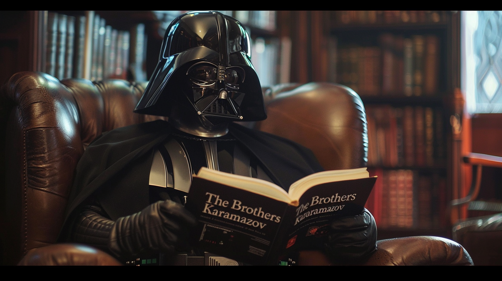

# Как Достоевский и Ницше повлияли на мировоззрение Дарта Вейдера⁠⁠



Некоторое время назад я опубликовал на Хабре пост "Смысл жизни с точки зрения программиста-буддиста", в котором я рассматривал один из ключевых для жизни каждого человека вопросов - как найти смысл собственного существования внутри нашей бесконечной и бессмысленной Вселенной. Однако, я чувствую некоторую недосказанность в этом вопросе. В данном посте я хотел бы привести несколько обдумываемых мною идей и соображений и проанализировать проблему поиска смысла жизни не с личной, а с более отстранённой философской точки зрения.

Бусидо Оби-Вана Кеноби
При съемках сражений на световых мечах режиссёр "Звёздных войн" Джордж Лукас прежде всего вдохновлялся эстетикой средневековых дуэлей японских самураев. И если первые три эпизода (IV, V и VI) Лукас снимал скорее как приключенческий экшен-фильм, то к последующим трём эпизодам (I, II, III) он подошёл как к произведениям искусства, стараясь наполнить мир Звездных Войн смыслом, дать глубокое философское обоснование позициям противоборствующих сторон и придать разумную мотивацию действиям героев.

В фундамент мировоззрения джедаев Лукас положил японский воинский кодекс чести бусидо, основанный на буддийской философии риндзай-дзен. Вот некоторые положения из этого кодекса:

- Истинная храбрость состоит в том, чтобы жить, когда необходимо жить, и умереть, когда необходимо умереть
- Необходимо быть умеренным в еде и избегать распущенности
- На войне верность самурая проявляется в том, чтобы без страха идти на вражеские стрелы и копья, жертвуя жизнью, если того требует долг
- Будучи смертельно раненным, так что никакие средства уже не могут его спасти, самурай должен почтительно обратиться со словами прощания к старшим по положению и спокойно испустить дух, подчиняясь неизбежному
- Самурай должен, прежде всего, постоянно помнить, что он может умереть в любой момент, и если такой момент настанет, то умереть самурай должен с честью. Вот его главное дело

Соперники и извечные враги джедаев ситхи руководствуются в своей жизни совершенно другими представлениями. Описанная Лукасом и его сценаристами в дополнениях к фильмам философия ситхов сводится к следующему высказыванию:

```
Покой — это ложь, есть только страсть.
С ней я стану сильнее.
Став сильнее, я обрету могущество.
Могущество принесет мне победу.
Победа сорвёт с меня оковы.
И сила освободит меня.
```

С первого взгляда кажется, что эти строфы придуманы для антагонистов от балды по принципу Джона Кармака: "Сюжет в игре — как сюжет в порнофильме. Он должен быть, но он не так уж важен". Но на самом деле смысл этих строк невероятно глубок и объясняет глубокие философские противоречия между джедаями и ситхами. Эти противоречия состоят в том, что те и другие по-разному отвечают на извечный философский вопрос, обсуждаемый мыслителями в течении тысячелетий, но яснее всего сформулированный Фёдором Михайловичем Достоевским в его романе "Братья Карамазовы". Вопрос этот следующий:

> Если Бога нет, то всё позволено?

Джедаи и ситхи подобно нам с вами живут в мире, лишённом всякого определенного смысла, в который бы они могли верить всей душой. Несмотря на всю внешнюю фантастичность мира Звёздных Войн в нём автор описывает наш с вами текущий мир.

В конце XIX века случилось то, что немецкий философ Фридрих Ницше назвал "смертью Бога" - люди массово потеряли искреннюю веру в Бога и очутились в бессмысленной и безразличной к их судьбе Вселенной. Многие люди и сейчас религиозны, но уже не так всерьёз как тогда. Большинство, как я уже писал в упомянутом мной предыдущем посте, на вопрос про веру отвечают что-то вроде: "Ну что-то такое там, наверное, есть". Виктор Пелевин в своём романе про похождения воспитанного на творчестве Достоевского литературно-полицейского алгоритма Порфирия Петровича "iPhuck 10" гениально описал наше время как эпоху гипса:

```
У Делона Ведровуа было эссе с названием «Гипсовая контрреформация». Оттуда это и пошло. Гипсовая контрреформация, по Ведровуа, была последней попыткой мировой реакции вдохнуть жизнь в старые формы и оживить их. Создать, как он пишет, франкенштейна из трупного материала культуры, основанной на квазирелигиозных ценностях реднеков и сексуальных комплексах всемирной ваты.
– Но почему именно «гипс»?
– У Ведровуа это центральная метафора. Представь сбитого грузовиком Бога…
– Бога? – переспросил я и перекрестился. – Грузовиком?
– Ведровуа так переосмыслил Ницше. Не хотела задеть твои религиозные чувства, извини – я знаю, что вам сейчас закачивают. Неважно – Бога, патриарха, царя, пророка. Одним словом, фигуру отца. Ему переломало все кости, и он мертв. Его надо скорее зарыть – но… Как это у Блока: «толстопузые мещане злобно чтут дорогую память трупа – там и тут». И вот, чтобы продлить себя и свое мещанство в будущее, толстопузые злобно заявляют, что Бог на самом деле жив, просто надо наложить на него гипс, и через несколько лет – пять, десять, двадцать – он оклемается. Они лепят гипсовый саркофаг вокруг воображаемого трупа, выставляют вооруженную охрану и пытаются таким образом остановить время…
...
– Видишь ли… Гипсовый век – это последнее время в истории человечества, когда художнику казалось… Нет, когда художник еще мог убедительно сделать вид, что ему кажется, будто его творчество питается конфликтом между свободой и рабством, правдой и неправдой, добром и злом – ну, называй эти оппозиции как хочешь. Это была последняя волна искусства, ссылающегося на грядущую революцию как на свое оправдание и магнит – что во все времена делает художника непобедимым…
...
Вот в этой невозможности и состоит вся суть гипса – то, что делает его таким уникальным. Это не наблюдение самого света, а фиксация того факта, что свет когда-то был. С тех пор мы имеем дело с ксерокопиями ксерокопий, отблесками отблесков.
```

В мире далекого будущего Звёздных Войн нет намёка даже на отблески старого религиозного смысла, никто уже даже не притворяется, что Бог ещё жив. Джедаи и ситхи живут в бесцельно существующем мире и задаются вопросом: "Если всё бессмысленно, то всё дозволено?". Отвечают они на него по-разному.

Джедаи подобно дзен-буддистам считают, что несмотря на бессмысленность мира и отсутствие в нём безусловной опоры нужно жить сдержанно, поддерживать порядок, по возможности творить добро, даже если это не всегда возможно и часто может обернуться для кого-то злом. Ситхи же подобно Павлу Смердякову из "Братьев Карамазовых" решают, что раз всё бессмысленно, то вся человеческая мораль ничем не обоснована, и можно, как говорил один владыка ситхов, освободиться от химеры совести и творить, что хочешь - убивать хоть миллионами ради своих целей или обиды на мир.

Кроме того, джедаи и ситхи по-разному относятся к основному вопросу всех восточных религий - устранению страдания и достижению душевной свободы. Джедаи придерживаются буддийского подхода, в котором устранение страданий достигается через устранение привязанностей - через медитацию, самоанализ и контроль над чувствами. Ситхи же придерживаются ницшеанской философии о сверхчеловеке - они хотят полностью окунуться в жизнь, вдохнуть жизнь полной грудью, обрести невероятное могущество, освободиться от оков морали и достичь свободы от любых душевных терзаний.

```
Покой — это ложь, есть только страсть.
С ней я стану сильнее.
Став сильнее, я обрету могущество.
Могущество принесет мне победу.
Победа сорвёт с меня оковы.
И сила освободит меня.
```

В терминах самого Ницше мировоззрение джедаев можно было бы назвать "моралью рабов", а мировоззрение ситхов "моралью господ". В общем-то, уже в четвёртом эпизоде (хронологически вышедшим первым) Дарт Вейдер и имперские штурмовики показаны в качестве аллюзии на германских нацистов, точно так же вдохновлявшихся философией Ницше. Но как всегда и бывает в мире, высокие идеалы легко продаются за большие бабки. В отличии от четвёртого эпизода Звёздных Войн, в пятом эпизоде Дарт Вейдер уже не совершает на экране внесудебных казней и военных преступлений. Продажи фигурок штурмовиков и самого Вейдера начали приносить Лукасу такие баснословные доходы, что он испугался испортить себе кассу излишней жестокостью владыки ситхов.

А вот английский философ Дэвид Юм не страшился массовых казней на гильотине...

## Массовые казни Дэвида Юма

В прямом смысле слова, конечно же, никого Дэвид Юм на гильотине не казнил, но вот множество различных философских и религиозных учений он с помощью своей гильотины обезглавил.

Гильотина Юма - это сформулированный философом принцип, отсекающий описательные суждения о мире от предписательных суждений о морали. Этот принцип гласит, что переход от описательных суждений со связкой «есть» к предписательным суждениям со связкой «должен» - логическая ошибка.

В своём "Трактате о человеческой природе" Юм пишет:

> Я заметил, что в каждой этической теории, с которой мне до сих пор приходилось встречаться, автор в течение некоторого времени рассуждает обычным образом, устанавливает существование Бога или излагает свои наблюдения относительно дел человеческих; и вдруг я, к своему удивлению, нахожу, что вместо обычной связки, употребляемой в предложениях, а именно «есть» или «не есть», не встречаю ни одного предложения, в котором не было бы в качестве связки «должно» или «не должно». Подмена эта происходит незаметно, но тем не менее она в высшей степени важна. Раз это «должно» или «не должно» выражает некоторое новое отношение или утверждение, последнее необходимо следует принять во внимание и объяснить, и в то же время должно быть указано основание того, что кажется совсем непонятным, а именно того, каким образом это новое отношение может быть дедукцией из других, совершенно отличных от него.

Принцип Юма объясняет, что нельзя из утверждений о том, как оно есть, выводить утверждения о том, как оно должно быть. Никакие этические теории не могут быть выведены из описания законов работы нашего мира. Грубо говоря, права человека никак не выводятся из уравнений Эйнштейна.

Гильотина Юма как бы разрезает мир на две части - научную и религиозно-философскую. Наука занимается только и исключительно фальсифицируемыми суждениями - она описывает мир, но ничего не говорит о том, как следует жить. Философия и религия же говорят о том, как следует жить, но не могут подкрепить свои суждения никакими доказательствами.

В рассказе Элиезера Юдковского "Тройной контакт" рассказывается о встрече землян с инопланетной расой, представители которой поедают своих детей. У инопланетян есть глубокое философское обоснование, почему они считают поедание детей благом - на их языке даже слово "хороший" буквально означает "поедающий детей". Непоедание детей кажется им таким же омерзительным, каким поедание детей видится землянам. Ни земляне, ни инопланетяне никак не могут логически обосновать друг другу свои этические доктрины. Ибо, согласно принципу Юма, это невозможно - пробел между наблюдаемым миром и моральными нормами преодолеть невозможно. Точно так же, как и невозможно преодолеть пробел между материей и сознанием.

Позволю себе процитировать пост Алексея Елпырёва о гильотине Юма:

```
Проиллюстрирую "гильотину Юма" небольшим примером. Допустим, у нас есть следующие позитивные утверждения:
1. Вася стоит около железнодорожных путей.
2. К Васе стремительно приближается поезд.
Можно ли вывести только из этих утверждений хотя бы одно нормативное? Нельзя. Логически корректно вывести нормативное утверждение можно лишь из нормативного же утверждения либо из системы утверждений, как минимум одно из которых является нормативным.

Добавляем в исходную систему следующее нормативное утверждение:
- Вася должен действовать так, чтобы выжить.
Отсюда получаем такое нормативное утверждение:
- Вася должен отойти подальше от путей.
А теперь добавим к исходным позитивным утверждениям другое нормативное:
- Вася должен умереть.
Отсюда выводится следующее:
- Вася должен прыгнуть под поезд.

Как видите, сами по себе позитивные утверждения не дают оснований для получения из них нормативных утверждений. Чтобы сделать нормативные выводы из них, надо добавить к ним хотя бы одно нормативное же утверждение. При этом выводы меняются в зависимости от того, какое нормативное утверждение мы добавляем.

Теперь некоторые практические выводы:
1. Понятия "истина"/"ложь" применимы лишь к позитивным суждениям! К нормативным суждениям, в том числе и по морально-этическим вопросам, данные понятия неприменимы. В принципе неприменимы. Поэтому в спорах о том, что такое хорошо и что такое плохо, невозможно быть правым или ошибаться.
2. Наука занимается только и исключительно позитивными суждениями. Она описывает мир, но ничего не говорит о том, как следует делать. Утверждение "из данной научной теории следует, что надо поступать так-то" либо свидетельствует о некорректности логических выводов автора, либо включает в себя неявно выраженные нормативные утверждения в предпосылках. Нормативных утверждений в науке быть не может. А значит, и нормативных выводов из научных теорий - тоже. Поэтому наука может изучать, как возникла мораль и какие функции она выполняет, но не может говорить, какой она должна быть. "Научно обоснованная мораль" - псевдонаучная чушь.
3. Рациональность поведения касается лишь позитивных суждений, влияющих на нормативные выводы, но никоим образом не регламентирует нормативные суждения в предпосылках. Например, рационально пристегиваться в машине ремнем безопасности, и иррационально - вешать талисман или иконку, если целью является снижение вероятности аварий и ущерба для здоровья от них. Но является ли сама цель "стремиться выжить и сохранить здоровье" рациональной или иррациональной - сказать нельзя.
```

Из-за действия принципа Юма, мы не можем сказать, кто в Звёздных Войнах прав, а кто виноват. Этические доктрины джедаев и ситхов в равной степени имеют право на существование. Оба ответа на ключевой вопрос Достоевского равны в своей необоснованности.

## Тёмный лорд Достоевского

В восточных религиях, индуизме и буддизме, большое внимание уделяется учению об иллюзорности мира. С точки зрения этих религий вся Вселенная представляет собой лишь набор концепций в нашем уме. При пристальном рассмотрении этих концепций иллюзия тут же рассыпается и исчезает. Привязанность человека к этим иллюзорным концепциям вызывает страдание, поэтому главная цель религиозной практики в индуизме и буддизме - прекращение страдания.

На западе похожих воззрений придерживались гностики. Гностицизм никогда не был единым религиозным движением - этим термином обычно называют множество различных иудейских и раннехристианских сект, существовавших в I-II веках нашей эры. Все эти секты объединяла общая идея - они считали, что наш мир сотворен злым божеством, Демиургом, и что воссоединиться с истинным верховным богом можно лишь через личное познание, а не через традиции, писания и религиозные институты. Несмотря на происхождение от иудаизма, учения гностиков были идейно ближе к индийским религиям - многие их тексты имеют дело не с концепциями греха и раскаяния, а с концепциями иллюзорности мира и просветления.

Гностики считали мир дурным местом, полным страдания, и нисколько не страшились конца света, а наоборот жаждали его. В одной из своих университетских лекций по истории философии Александр Дугин со свойственным ему эпатажем рассказывает о гностицизме, индийском учении об иллюзорности мира и эсхатологии конца света. В этой лекции есть такие врезающиеся в память слова:

> Становится понятна та удивительная, загадочная фраза, над которой я думал в течение всей своей жизни, пророненная однажды Евгением Всеволодовичем Головиным. Он сказал: «Там где мы – там центр ада». Не мы в центре ада, это было бы еще ничего, а там где мы — там центр ада. Поэтому где Кали-Юга, когда где Кали-Юга? Кали-Юга тогда, когда мы начинаем подозревать о том, что находимся внутри иллюзии. И мы подходим к концу существования этой иллюзии, всё более и более осознавая ее иллюзорную природу. Но как перешагнуть? Как закончить Кали-Югу? Как поставить конец в мире?
>
> На самом деле, надо думать не о том, наступит или не наступит конец мира, нам надо думать, как его осуществить. Это наша задача. Сам по себе он не наступит. На голову ничего не упадет. Мы сами должны принять это решение. Мы, более того, должны найти способ, как закрыть эту историю. И это очень непростая вещь.
>
> Мы обычно говорим: «Как выжить человечеству? Как предупредить глобальное потепление?» На самом деле, люди с обостренной философией думают, как бы что-то сделать такое в духе глобального потепления, чтобы это, наконец, залило или сожгло. Просто перестало существовать. Потому что ценность этого всего по факту никем еще не доказана, не продемонстрирована, не аргументирована. Нет даже диссертаций, защищенных корректно о том, почему человечеству надо выживать. Никто об этом не думает. Никаких аргументов. Как любая эвиденция, она является чистым обманом. Поэтому вопрос о том, как же закончить мир, как избавиться от иллюзий.

Если бы я писал роман, то я мог бы с лёгкостью вложить эти слова в уста главного злодея - этакого тёмного лорда, помешанного на буддизме и гностицизме. Этот тёмный лорд считает Вселенную абсолютно бессмысленным местом, в котором ничто не имеет значения и всё дозволено, а себя милосердным бодхисаттвой, движимым стремлением избавить всех живых существ от страданий, но собирающимся сделать это в своеобразной манере - через применение оружия массового поражения. В фанфике по "Звёздном войнам" и "Братьям Карамазовым" этого злодея могли бы звать Дарт Смердяков.

Так вот, представьте себе следующую картину: владыка ситхов Дарт Смердяков навёл звезду смерти на планету, толкает перед толпой имперских штурмовиков речь про "cчастье всего мира не стоит одной слезы на щеке невинного ребёнка", прилежно пересказывая им учение своего учителя Дарт Карамазова, и готовится нажать на красную кнопку с надписью "Огонь!". На мостике корабля рядом с ним сидит связанный джедай. Что может сказать джедай владыке ситхов, чтобы убедить того не стрелять? Какой аргумент убедит Дарта Смердякова в неверности его позиции?

Точно так же, как не существует никаких логических аргументов против солипсизма, так и не существует аргументов за ценность жизни. Всё, что пленный джедай может сказать в оправдание существования мира, сводится к краткому, но мощному высказыванию персонажа Жана-Люка Бейонда из уже упомянутого мной романа "iPhuck 10": "Жить ой. Но да". Это самое бейондовское "жить ой, но да" по сути выражает то же самое, что немецкий философ Фридрих Ницше выразил в своём жизнеутверждении:

> Предположим, мы говорим «да» одному единственному мгновению – это значит, тем самым мы сказали «да» не только самим себе, но и всему сущему. Ибо ничто не существует само по себе, ни в нас самих, ни в вещах: и если душа наша хоть один единственный раз дрогнула от счастья и зазвучала, как струна, то для того, чтобы обусловить одно это событие, потребовались все вековечности мира – и все вековечности в этот единственный миг нашего «да» были одобрены и спасены, подтверждены и оправданы.

Но убедит ли это злодея? Мне так не кажется.
Тёмный лорд объяснит джедаю про гильотину Юма и нажмёт на кнопку...
