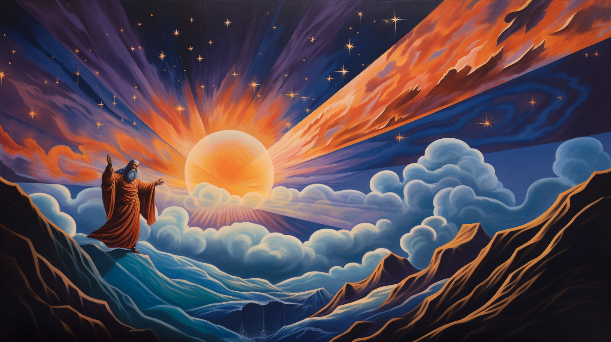

# Вселенная как театр одного актёра⁠⁠

На Хабре часто можно встретить статьи о том, что Вселенная - это компьютерная симуляция, чистая математика, живой организм или даже самообучающаяся нейронная сеть. Я и сам не без греха и имею за своим авторством несколько таких постов. Наш мир как раз и прекрасен тем, что каждая из подобных метафор прекрасно описывает всё мироздание - можно провести бесконечное количество аналогий между примерами из разных областей знания и устройством Вселенной. Это напоминает то, как в древнеиндийской философии описывается мир - в виде огромной сети из бесчисленного количества драгоценных каменьев, каждый из которых отражается во всех остальных и отражает их сам. Целое отражает часть, часть отражает целое - великий фрактал мироздания.

Некоторое время назад я публиковал пост под названием "Нейросети, виртуальная реальность и Бог-солипсист", в котором я вскользь коснулся темы того, что Вселенная представляет из себя игру божественного сознания с самим собой. В данном посте я собираюсь раскрыть эту идею, всесторонне её осветить и провести аналогию между устройством Вселенной и театром. Однако, стоит воспринимать этот текст не как дословную модель мироздания, а скорее как поэтическое описание реальности.

## Игра с самим собой

В романе Грега Игана "Город перестановок" описывается мир живущих в компьютерной симуляции людей. Их реальность находится под их полным контролем: в своих виртуальных мирах эти люди подобны богам - они могут сотворять из пустоты любые предметы силой своей мысли, строить там, что захотят, создавать другие симуляции и даже других людей. Эти люди бессмертны и могут существовать бесконечно долго - сначала это кажется им невероятным даром, однако спустя несколько сотен лет они осознают, что это проклятие. Прожив тысячи лет они успели перепробовать все возможные занятия: прочли тысячи книг, посмотрели тысячи фильмов, до дыр дослушали тысячи симфоний и песен, изучили все возможные науки, позанимались всеми возможными видами искусства и спорта. Даже создание новых виртуальных симуляций с миллионами существ внутри своей симуляции не доставляло им былого удовольствия - им стало просто безумно скучно жить. Как говорил Будда, от неудовлетворенности страдают даже боги.

Один из героев романа ищет ответ на ключевой вопрос своей жизни: "Как найти смысл в мире, где ты - Бог?". После долгих поисков он находит единственно разумный ответ: ему нужно перестать существовать, разорвать своё сознание на миллионы осколков, каждый из которых станет отдельной личностью и будет жить своей жизнью, переживать настоящие эмоции - радоваться детским открытиям, чувствовать наивную юношескую надежду на светлое будущее, без ума влюбляться, страдать от лишений, радоваться победам. Он понимает, что только при перерождении в человеческих обличиях, ему станет доступным удовольствие жить. Устав от синглплеерной игры-песочницы, этот герой романа по имени Пир решает сыграть в мультиплеерную ролевую игру, где все игроки - это он:

> Он сгенерировал тысячу разных причин жить дальше. Он раздвинул свою философию почти до предела. Но предпринять оставалось лишь одно.
> – Мы уйдём из этого места, – сказал Пир. – Запустим собственную вселенную. Нам давно следовало это сделать.
> Кейт издала звук, выражавший недовольство.
> – Как я буду жить без элизиан? Я не смогу выживать, как ты: переписывать себя, накладывать искусственное счастье. Мне этого недостаточно.
> – Тебе и не нужно.
> – Семь тысяч лет прошло. Я хочу опять жить среди людей.
> – Значит, будешь жить среди людей.
> Кейт взглянула на него с надеждой.
> – Мы их создадим? Запустим онтологические программы? Адам и Ева в новом собственном мире?
> – Нет, – возразил Пир. – Ими стану я. Тысячей, миллионом. Столькими, сколькими захочешь. Я превращусь в Народ Солипсистов.
> Кейт отстранилась от него.
> – Превратишься? Какой в этом смысл? Тебе незачем превращаться в народ. Ты можешь построить его вместе со мной, а потом сидеть и смотреть, как он растёт.
> Пир покачал головой.
> – А во что я превратился и так? В бесконечную цепочку людей, каждый из которых счастлив по личным причинам. > Связанных лишь призрачной ниточкой памяти. Зачем разделять их во времени? Почему не отбросить притворство, будто все эти произвольные изменения переживает одна личность?
> – Ты же помнишь себя. Веришь, что ты – один человек. Зачем называть это притворством? Это правда.
> – Но я в неё больше не верю. Каждая созданная мной личность проштемпелёвана иллюзией, будто она остаётся тем же воображаемым нечто, именуемым «я», но по-настоящему это не часть их сущности, а лишь отвлекающая деталь, источник путаницы. Незачем больше так поступать или разделять этих разных людей во времени. Пусть живут вместе, встречаются и составляют тебе общество.
> Кейт ухватила его за плечи и посмотрела прямо в глаза.
> – Нельзя превратиться в Народ Солипсистов. Это ерунда. Пустая риторика из старой пьесы. Это будет значить лишь… умереть. Люди, созданные программами, без тебя не будут уже тобой ни в каком смысле.
> – Они будут счастливы, верно? Время от времени? По собственным странным причинам?
> – Да, но…
> – Это всё, что я есть теперь. Всё, что меня определяет. Так что, когда они будут счастливы – они будут мной.

Подобно размышлениям героев романа Игана рассуждали и многие философы древности. Так в древней Индии мыслители описывали сотворение мира через концепцию лилы - божественной игры. Согласно этой концепции, в самом начале времён скучающий Бог раскалывает своё сознание на бесконечное количество осколков, чтобы сыграть с самим собой в прятки. В своей книге "Книга о табу на знание о том, кто ты есть" британский философ Алан Уотс описывает концепцию лилы так:

> Это похоже на игру в прятки, потому что интересно всегда находить новое место для того, чтобы спрятаться. Вспомни о том, что тебе не нравится играть с друзьями, которые прячутся всегда в одном и том же месте. Бог тоже любит играть в прятки, но Ему не с кем играть, кроме Самого Себя, потому что кроме Бога в мире никого больше нет. Однако для того, чтобы выйти из этого затруднения, Он притворяется, что не является Собой. Таким образом Ему удается спрятаться от Себя. Бог притворяется, что Он – это ты и я, и все люди в мире, все животные, все растения, все камни и все звезды. Когда Он играет Сам с Собой таким образом, у Него бывают необыкновенные и удивительные приключения, среди которых есть страшные и даже ужасные. Однако все они просто напоминают плохие сны, потому что когда Бог просыпается, все, что Ему снилось, исчезает.
>
> Вот и получается, что когда Бог прячется и притворяется тобой или мной, Он делает это очень ловко. Поэтому для того чтобы найти Себя, Ему может потребоваться довольно продолжительное время. Но этот долгий поиск очень интересен – именно на него Бог рассчитывал, когда начинал игру. Он не хочет найти Себя слишком быстро, ведь так играть было бы не интересно. Вот почему тебе и мне так трудно обнаружить, что на самом деле мы – это Бог в маске, играющий наши роли. Но после того, как игра закончится, все мы проснемся, перестанем притворяться и вспомним, что мы – одно Я – Бог, являющийся всем тем, что есть в мире, и живущий веки вечные.
>
> ...
> Ты можешь спросить, почему Бог иногда прячется в облике ужасных людей и почему Он иногда притворяется теми, кто страдает от страшных болезней и несчастий. Чтобы понять это, вспомни прежде всего о том, что Он фактически не подвергает опасности никого, кроме Себя. Вспомни также и о том, что почти во всех сказках, которые тебе нравятся, кроме хороших героев есть еще и плохие. И вся увлекательность повествования в том и состоит, чтобы узнать, как добрые герои победят злых

Вторит британскому философу и живой классик русской литературы Виктор Олегович Пелевин, причём, сразу в нескольких книгах. В книге "Transhumanism Inc" Пелевин воплощает концепцию лилы в одном из своих героев - Атоне Гольденштерне, а в книге "KGBT+" главный герой записывает "вбойку", в которой он описывает тот самый раскол первоначального божественного сознания на бесконечное количество обломков:

> Вы помните сказку Андерсена про Снежную Королеву? Думаю, нет. Поэтому напомню, с чего она начинается.
>
> Значит, жил-был тролль, злющий-презлющий, по некоторым сведениям, сам дьявол (вот только если это правда, зачем называть его троллем?). Раз он был в хорошем настроении – и смастерил зеркало, в котором все «доброе и прекрасное» уменьшалось донельзя, а все «негодное и безобразное» выступало ярче и казалось еще хуже. Ну, мы знаем примерно, что наш добрый сказочник называет «прекрасным» – это когда пляшут буйные медведи, а карточные игроки дерутся за своим столом. Так что не будем спешить с оценкой.
>
> Лучшие из людей выглядели в зеркале троллей уродами – казалось, что они стоят на голове, а животов у них и вовсе нет. Тут каждое слово важно. «Стоят на голове», видимо, означает, что они опираются на рассудок, а «животов вовсе нет» – что они преодолели животное начало. Как там дальше? Добрая и благочестивая
> человеческая мысль отражалась в зеркале невообразимой гримасой... Ну, «благочестивые мысли» времен разгула христианства – например,
> сжечь на костре пару ведьм или геев – нам сегодня тоже кажутся гримасами. Так что, скорей всего, зеркало троллей просто показывало мир как есть, без всяких прикрас. Ученики тролля так и говорили: «Только теперь можно увидеть весь мир и людей в их настоящем свете». Да, мы помним, что ученики тролля – bad guys. Хорошие ребята – это ангелы с пиками.
>
> И вот ученики тролля решили добраться до неба, чтобы посмеяться над ангелами и самим Творцом. Чем выше они поднимались, тем сильнее кривлялось и корчилось зеркало от гримас – тролли еле-еле удерживали его в руках. А потом они оказались так высоко, что зеркало перекосилось, вырвалось из их рук и разбилось вдребезги...
>
> О чем это на самом деле? Представим, что у троллей было зеркало, в котором проявляется истина. И вот они захотели узнать правду про Творца. Они поднимаются выше, выше, выше... А потом зеркало вдруг разлетается на осколки. А что, если зеркало и в этот раз отразило правду как она есть?
>
> Мы знаем, что живем на руинах древней катастрофы. Что-то разлетелось вдребезги четырнадцать миллиардов лет назад. Мы все – осколки этого взрыва. И когда зеркало троллей навели на Творца, оно разбилось не потому, что создатель наказал троллей за наглость. «Распад на обломки» и есть самая честная фотография нашего бога. Единственная, которую мы можем сделать. Хоть телескопами, как физики, хоть душой, как старинный поэт Ницше. Даже самое сакральное из божественных имен состоит из четырех обломков – видимо, древние евреи наблюдали создателя сквозь свою духовную оптику через несколько пикосекунд после его распада и не сумели приблизиться к исходной точке творения ближе...
>
> В вышеприведенном отрывке о разбившемся зеркале Пелевин с помощью ярких художественных образов пересказывает ту самую древнюю концепцию сети Индры, в которой мир описывается как огромная сеть из драгоценных камней, каждый из которых отражает все остальные камни и сам также отражается в них: все в одном, одно во всем, все во всем, одно в одном. Одна из самых популярных дзэн-историй рассказывает о том, что когда в водной глади озера видно отражение пролетающих мимо диких гусей, то вода не знает, что отражает гусей, и у гусей нет намерения отразиться в воде, но именно само это отражение создаёт реальность.

## Театр одного актёра

Весь мир - театр.
В нём женщины, мужчины - все актёры.
У них свои есть выходы, уходы,
И каждый не одну играет роль

"Как вам это понравится", Уильям Шекспир

В своём одном из своих постов я привожу размышления над этими строками Шекспира:

> ... в моём воображении предстает картина, в которой мир представляется мне в виде круглой театральной сцены. На этой сцене разворачивается пьеса бытия, и все мы в этом поразительном представлении являемся одновременно и актёрами, и постановщиками, и зрителями. При этом нельзя точно сказать, что именно происходит на сцене - у разыгрываемой пьесы нет ни единого сюжета, ни общего посыла. Поэтому неверно даже считать происходящее единой пьесой, скорее это бесконечное количество различных произведений - трагедий и комедий, персонажи и сюжеты которых тесно переплетаются между собой.
>
> Никто из зрителей не видит спектакль целиком, каждый наблюдает лишь его небольшую часть. В зависимости от положения на сцене люди смотрят на происходящее под своим уникальным углом. Этой своей особенностью сцена чем-то напоминает знаменитый сад камней в японском храме Рёандзи. По легенде этот сад построен таким образом, что с какой бы точки человек не смотрел на него, из пятнадцати расположенных в нём камней будет видно только четырнадцать. Как минимум один всегда будет загорожен другими.
>
> Благодаря круглой форме сцены количество различных точек зрения бесконечно, и среди них всегда найдутся как близкие друг к другу, так и противоположные. Кому-то спектакль покажется скучным, кому-то наоборот захватывающим. Кто-то довольствуется второстепенной ролью, кому-то хочется играть главную. Кто-то желает просто смотреть спектакль, кого-то же тянет внести вклад в его режиссуру. Хотя многие зрители и уверены в обратном, среди этих точек зрения нет правильных и неправильных - театр явно постмодернистский.

В рассказе "Всё или ничто" аргентинский писатель Хорхе Луис Борхес развивает мысль Шекспира из пьесы "Вам это понравится", рассматривает её через призму восточной философии и описывает актёрскую игру как уподобление Богу:

> Сам по себе он был Никто; за лицом (не схожим с другими даже на скверных портретах эпохи) и несчетными, призрачными, бессвязными словами крылся лишь холод, сон, снящийся никому.
>
> Сначала ему казалось, будто все другие люди такие же, но замешательство приятеля, с которым он попробовал заговорить о своей пустоте, убедило его в ошибке и раз навсегда заставило уяснить себе, что нельзя отличаться от прочих. Он думал найти исцеление в книгах, для чего - по свидетельству современника - слегка подучился латыни и еще меньше - греческому; поздней он решил, что достигнет цели, исполнив простейший обряд человеческого общежития, и в долгий июньский день принял посвящение в объятиях Анны Хэтуэй.
>
> Двадцати с чем-то лет он прибыл в Лондон. Помимо воли он уже наловчился представлять из себя кого-то, дабы не выдать, что он - Никто; в Лондоне ему встретилось ремесло, для которого он был создан, ремесло актера, выходящего на подмостки изображать другого перед собранием людей, готовых изображать, словно они и впрямь считают его другим. Труд гистриона принес ему ни с чем не сравнимую радость, может быть первую в жизни; но звучал последний стих, убирали со сцены последний труп - и его снова переполнял отвратительный вкус нереальности. Он переставал быть Феррексом или Тамерланом и опять делался никем.
>
> От скуки он взялся выдумывать других героев и другие страшные истории. И вот, пока его тело исполняло в кабаках и борделях Лондона то, что положено телу, обитавшая в нем душа была Цезарем, глухим к предостережениям авгуров, Джульеттой, проклинающей жаворонка в нем душа и Макбетом, беседующим на пустыре с ведьмами. Никто на свете не бывал столькими людьми, как этот человек, сумевший, подобно египетскому Протею, исчерпать все образы реальности. Порой, в закоулках того или иного сюжета, он оставлял роковое признание, уверенный, что его не обнаружат; так, Ричард проговаривается, что он актер, играющий множество ролей, Яго роняет странные слова "я - это не я". Глубинное тождество жизни, сна и представления вдохновило его на тирады, позднее ставшие знаменитыми.
>
> Двадцать лет он провел, управляя своими сновидениями, но однажды утром почувствовал отвращение и ужас быть всеми этими королями, погибающими от мечей, и несчастными влюбленными, которые встречаются, расстаются и умирают с благозвучными репликами. В тот же день он продал театр, а через неделю был в родном городке, где снова нашел реку и деревья своего детства и уже не сравнивал их с теми, другими, в украшениях мифологических намеков и латинских имен, которые славила его муза. Но здесь тоже требовалось кем-то быть, и он стал Удалившимся От Дел Предпринимателем, имеющим некоторое состояние и занятым теперь лишь ссудами, тяжбами и скромными процентами с оборота. В этом амплуа он продиктовал известное нам сухое завещание, из которого обдуманно вытравлены всякие следы пафоса и литературности. Лондонские друзья изредка навещали его уединение, и перед ними он играл прежнюю роль поэта.
>
> История добавляет, что накануне или после смерти он предстал перед Господом и обратился к нему со словами: - Я, бывший всуе столькими людьми, хочу стать одним - Собой. И глаз Творца ответил ему из бури: - Я тоже не я: я выдумал этот мир, как ты свои создания, Шекспир мой, и один из признаков моего сна - ты, подобный мне, который суть Все и Ничего.

В своём романе "Священная книга оборотня" Виктор Пелевин описывает этого самого божественного актёра, примеряющего тысячи ролей через метафору сверхоборотня:

> Сверхоборотень – это тот, кого ты видишь, когда долго глядишь вглубь себя. Но там ничего нет. Это и есть Сверхоборотень. Потому что это Ничего может стать чем угодно. Сверхоборотень по очереди становится тобой, мной, этим пакетом яблок, этой чашкой, этим ящиком, – всем, на что ты смотришь. Это первая причина, по которой его называют Сверхоборотнем. Кроме того, любого оборотня можно, фигурально выражаясь, взять за хвост. А Сверхоборотня взять за хвост нельзя, потому что у него нет тела. И это вторая причина, по которой его так называют. Сверхоборотень – это просто пустота, которую можно заполнить чем угодно. К этой пустоте ничего не может прилипнуть. Её ничего не может коснуться, потому что стоит убрать то, чем её заполнили, и она снова станет такой как раньше.

Сравнивает мир с театром в своих интервью и российский актёр Вадим Демчог. Согласно его точки зрения, весь мир представляет из себя игру, и человек может быть счастлив только внутри собственной игры, созданной осознанно. Взрослые же люди зачастую впадают в апатию из-за того, что бессознательно играют в скучные чужие игры. Мы каждый день идём по проторенной рутинной дорожке и играем давно заученные роли, делаем своей целью фарминг ресурсов и забываем, что удовольствие от игры не в этом. Мы помним, что в нашей жизни когда-то был этот самый огонь - давно забытое нами искреннее удовольствие от игры.

Для освобождения себя от этих бессознательных рутинных действий и однообразных реакций и достижения счастья, Демчог, вторя древним восточным учениям, советует понять, что наши чувства и наши мысли - это не есть мы сами. Мы - это не наши роли, мы - это актёр, тот самый пелевинский сверхоборотень, способный сыграть любую роль. И мы можем достичь счастья только создав свою собственную игру, поставив свою собственную пьесу, играя написанную самим собой роль.

В книге американского писателя Карлоса Кастанеды "Путешествие в Икстлан" индейский шаман Дон Хуан описывает в качестве одного из способов достижения духовной свободы нечто подобное - стирание личной истории. Согласно его учению, только стерев личную историю и тем самым отказавшись от заученных с детства однообразных реакций на внешние раздражители, человек может достичь свободы самому писать свою книгу жизни. Кроме того, обучая главного героя романа охоте, шаман доносит до того мысль, что отличие охотника от дичи в том, что охотник не живет по распорядку - именно способность действовать асинхронно ритму рутин животных даёт возможность лёгкой охоты на них.

Жизнь с чётко поставленными когда-то целями и жёсткими рутинами может сделать человека продуктивным, но не счастливым. В своей книге "Путь дзэн" всё тот же Алан Уотс пишет:

> Как ни парадоксально, целенаправленная жизнь лишена содержания и смысла. Она постоянно спешит и все упускает. Неспешная жизнь без цели ничего не упускает, ибо лишь когда нет цели и нет спешки, человеческие чувства полностью открыты для принятия мира.
>
> ... бесцельная, пустая жизнь не означает чего-то угнетающего. Напротив, она означает свободу бесцельно блуждающих облаков и горных ручьев, цветов в недоступных ущельях, красоту которых все равно никто не увидит, и морского прибоя, вечно омывающего песок.
