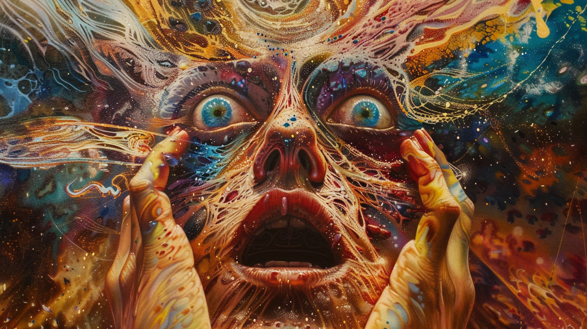

# Почему я учусь видеть духов

> Никита посапывал рядом с родителями... Кто-нибудь из родителей переключал программу, Никита чуть приоткрывал глаза и видел на экране майора в голубом берете, стоящего в жарком горном ущелье. «Смерть? – улыбался майор. – Она страшна только сначала, в первые дни. По сути, служба здесь стала для нас хорошей школой – мы учили духов, духи учили нас…
> _Виктор Пелевин, "Спи"_

Этот пост возник как идейное продолжение моего поста про буддизм и моего комментария в одной из тем с описанием битв левиафанов. В нём я собираюсь объяснить вам, почему я убежден, что нужно учиться видеть духов во всём окружающем нас мире.

## Вера предков

Как думаете, какая религия из тех, что практикуются до сих пор, самая древняя? Буддизм? Нет, буддизм лишь немногим старше христианства - Будда родился в V веке до н.э. Иудаизм? Тоже нет, иудаизм всего-то на тысячу лет древнее буддизма - он начал зарождаться примерно в XV веке до н.э. Индуизм? Тоже нет - индуизм зародился примерно в третьем тысячелетии до н.э. Но по сравнению с самой древней религией, даже он с его пятитысячелетней историей, если проводить аналогию с человеческим возрастом, это просто маленький ребенок.

Все вышеперечисленные религии основаны по большей части на письменных или частично письменных источниках - индуизм на Ригведе и Упанишадах, иудаизм на книге книг Торе, буддизм на Палийском каноне. Конечно, эти письменные источники не появились из ниоткуда, а стали кодификацией устных традиций - тот же Палийский канон появился лишь через несколько веков после смерти Будды, чьи учения изначально передавались исключительно устно. А у иудеев до сих пор наравне с традицией письменной Торы, существует традиция Торы устной. Но несмотря на это, в каждой из этих религий есть некий канонический текст, который служит её основой. А вот самая древняя религия никогда кодифицирована в едином тексте не была. Она родом из времён доисторических, то есть времён до изобретения письменности. Ей примерно 30-40 тысяч лет. И религия эта - шаманизм.

В основе шаманизма лежит вера в духов. Современные люди зачастую считают себя гораздо умнее, образованнее и разумнее людей древности. Ведь мы столько лет учимся в школах и университетах, мы работаем с такими сложными технологиями, мы столько всего знаем о вещах, о которых древний человек даже не слышал. Поэтому все связанное с шаманизмом и духами, воспринимается нами с огромным скепсисом. И хотя в практиках шаманов действительно может быть много разного рода ложных суеверий и глупых верований, здравое зерно в нём есть, да ещё какое!

Поэтому, пожалуйста, попробуйте непредвзято и без предрассудков выслушать то, что я расскажу вам в этом посте, после чего вы сможете составить собственное мнение в этом исключительно важном духовном вопросе.

Я постараюсь доказать несколько тезисов:

- Духи существуют
- Духов бескрайнее множество
- Духи не менее реальны, чем люди
- Духи питаются жизненной энергией

А начать я хочу с цитаты из послесловия знаменитой книги Роберта Персига "Дзэн и искусство ухода за мотоциклом". Эти строки служат ключом к пониманию того, что представляют из себя духи и прочие сущности.

> Криса больше нет. Его убили.
> ....
> Я же продолжаю жить, больше по привычке, чем по другой какой-либо причине. На похоронах мы узнали, что в то утро он купил билет, чтобы ехать в Англию, где я со своей второй женой жил в то время на корабле. Затем от него пришло письмо, в котором, как ни странно, говорилось: «Никогда не думал, что доживу до 23 лет». Двадцать три года ему исполнилось бы через две недели.
> ....
> Куда шёл Крис? В то утро он купил билет на самолёт. У него был счёт в банке, полный комод одежды, полки, набитые книгами. Он был настоящим, живым человеком, занимавшим место и время на этой планете, и теперь вдруг так внезапно куда он делся? Вылетел ли он в трубу крематория? Был ли он в небольшой урне с костями, что нам вернули? Перебирает ли струны золотой арфы на облаке вверху? Ни один из ответов на эти вопросы не имеет смысла.
>
> Надо бы спросить: К чему я был так привязан? Что-то в воображении? Если вы побывали в психиатрическом заведении, то такой вопрос вовсе не банален. Если же он не был просто плодом воображения, то куда же он делся? Неужели реальные вещи исчезают просто так? Если да, то что-то неладно с законами сохранения вещества в физике. Но если признавать законы физики, тогда исчезнувший Крис был нереален. Кругом, и кругом, и кругом. Он, бывало, убегал от меня так, чтобы позлить. Рано или поздно он всегда появлялся, но где он появится теперь? В самом деле, право же, куда он делся?
>
> Круги, наконец, остановились, когда дошло, что прежде, чем спрашивать «Куда он делся?», надо спросить: «Чем же был “он”, который пропал?» Есть старая культурная привычка думать о людях прежде всего как о чём-то материальном, вроде крови и плоти. До тех пор, пока сохранялась эта идея, решения не было. Окислы плоти и крови Криса действительно вылетели в трубу крематория. Но ведь не они же были Крисом.
>
> Надо дать себе отчёт в том, что Крис, по которому я так тосковал, был не объектом, а структурой, и хотя эта структура несла в себе и плоть, и кровь Криса, это было далеко не всё. Эта структура была больше, чем Крис и я вместе взятые, она связывала нас так, что мы сами этого не понимали целиком, и ни один из нас не мог ею полностью управлять.
>
> Теперь тело Криса, бывшее частью той структуры, ушло. Но более крупная структура осталась. В центре её образовалась большая дыра, вот она и вызвала такую сердечную муку. Структура ищет, к чему бы прилепиться, и не может ничего найти. Вот, возможно, почему скорбящие люди так привязаны к надгробиям и любым вещественным предметам, связанным с усопшими. Структура пытается цепляться за собственное существование, отыскивая новые материальные вещи, на которых можно сосредоточится.
>
> Несколько поздней стало ясно, что эти мысли весьма сходны с утверждениями, которые находят у многих «примитивных»культур. Если взять ту часть структуры, которая не является плотью и кровью Криса, и назвать её «духом» или «призраком» Криса, тогда безо всяких дальнейших толкований можно сказать, что дух или призрак Криса ищет себе новое тело, куда бы вселиться. Когда нам рассказывают такое о «примитивных», мы просто отбрасываем это как предрассудки, ибо толкуем призрак или дух как некую материальную эктоплазму, хотя они, возможно, ничего такого вовсе и не подразумевали.

## Гены и мемы

Древнегреческий философ Платон считал, что существует особый мир идей, в котором находятся объективные мысленные конструкции. Например, согласно Платону, математическое отношение 2+2=4 верно в любой точке пространства и в любой момент времени - то есть оно существует независимо от нашей Вселенной в этом самом особом мире идей.

Существование этого мира и его независимости от чего бы то ни было Платон доказывал на примере правильных многогранников, названных позже в его честь платоновыми телами. Существует всего пять таких фигур: тетраэдр, гексаэдр (куб), октаэдр, додекаэдр и икосаэдр. Уже во времена Платона было математически строго доказано, что шестого правильного многогранника в природе существовать не может. Платон считал, что эти фигуры - это объекты, существующие в своем особом пространстве идей.

В XX веке биологи, в числе которых был британский учёный Ричард Докинз, развивая эволюционные идеи Чарльза Дарвина открыли, что естественный отбор происходит не на уровне организмов, а на уровне генов - маленьких кусочков информации, заложенной в их геноме. Основной двигатель эволюции - выживание отдельного гена, а не целого организма. Приложив идеи эволюционной генетики к платоновским идеям, Ричард Докинз по аналогии с понятием "ген" ввёл понятие "мем". Мемы - это небольшие кусочки культурной информации, которые так же как и гены подвержены естественному отбору. Только если цепочки генов порождают биологические организмы, то цепочки мемов порождают культурные организмы - сказки, традиции, религии, языки. Эти культурные организмы мы можем рассматривать в качестве платоновских идей или духов. Но если Платон видел мир идей статичным, то мир идей Докинза динамичный и изменчивый.

С точки зрения Докинза, мемы как и гены - это репликаторы. Их главное свойство - самовоспроизведение. Им плевать на носителя. Например, гены и мемы, которые помогают носителю рожать больше детей, закрепляются в популяции, даже если эти гены или мемы заставляют отдельных носителей пожертвовать собой. Во всех успешных массовых религиях мы видим набор примерно одинаковых идей именно потому, что эти идеи лучше всего себя воспроизводят.

Основные свойства любой жизни - изменчивость, наследственность и отбор. Генетические и меметические цепочки подвержены мутациям, наследуются и проходят отбор на выживание. Так например, христианство - это мутировавшая версия иудазима, унаследовавшая от того множество идей и целый "Ветхий Завет", которая оказалось гораздо жизнеспособнее своего прародителя и распространила большее число копий своих мемов по миру.

Мы можем сказать, что мир идей, мир мемов, мир духов точно такой же живой и населенный живыми существами, как и мир биологический.

## Реальны ли духи?

Мемы в отличии от генов существуют не в физическом пространстве, а только в пространстве мира идей Платона, в пространстве смыслов. Так что именно их можно назвать теми самыми бесплотными духами. Эти духи, однако, вполне заметно влияют на физическую реальность. Например, в "Манифесте коммунистической партии" Карл Маркс писал:

> Призрак бродит по Европе — призрак коммунизма. Все силы старой Европы объединились для священной травли этого призрака: папа и царь, Меттерних и Гизо, французские радикалы и немецкие полицейские.

Реален ли описываемый Марксом призрак коммунизма? Конечно, реален. Если бы он не был реален, то почему власти его так боялись и боролись с ним? Если он не был реален, то что случилось с теми странами, по которым он впоследствии прошелся?

Кроме того, если мы начнём анализировать реальность вокруг нас, то мы неизбежно придём к выводу, что всё, что мы считаем материальным - точно такие же идеи. Приведу свой любимый пример с редукцией человека:

> Когда мы смотрим на другого человека, мы воспринимаем его образ целостно. А если мы попытаемся проанализировать этот образ и разложить его на части, то тут же обнаружим, что встали на дорожку ведущую в пустоту. Ведь человек - это образ совокупности процессов взаимодействия его органов, каждый орган - это образ совокупности процессов взаимодействия разных тканей, каждая ткань - это образ совокупности процессов взаимодействия биологических клеток, каждая клетка - это образ совокупности процессов взаимодействия молекул химических веществ, каждая молекула - это образ совокупности процессов взаимодействия атомов, каждый атом - это образ совокупности процессов взаимодействия элементарных частиц, каждая частица - это проявление в мире фактов волны в физических полях, а само физическое поле бесплотно - это по сути ничто, пустота, вакуум. Но что же это получается?
>
> Абсолютная пустота осознает себя и гордо заявляет "Я мыслю, следовательно, я существую". После она смотрит рядом туда же в пустоту и заявляет "Ecce homo"- се человек. Человек смотрит на человека или пустота смотрит на пустоту?

После разложения представления о человеке на составные части становится понятным, что казавшийся вроде бы материальным человек - это такая же концепция, как и любой существующий в мире идей мем. Так почему же мы так легко признаём одушевленным человека, но отказываем в одушевлённости, например, лесу? Ведь совокупность химических процессов, происходящих в лесу, ничуть не примитивнее химических процессов, происходящих в мозгу человека. Если и то, и другое - это своего рода процесс обработки информации, то почему мы признаем сеть нейронов в голове одушевленной, а сеть корней и грибниц в лесу - бездушной? Может быть, когда шаман пытается услышать и понять дух леса - это всё-таки не примитивная глупость?

## Левиафаны

Английский философ Томас Гоббс описывал государства как огромных библейских монстров левиафанов, которые состоят из множества взаимодействующих людей точно так же, как мы сами состоим из множества взаимодействующих клеток. Каждому левиафану для своей жизнедеятельности необходимо множество ресурсов - природные ресурсы, рынки сбыта, население. Эти левиафаны по сути бесплотные, но могучие духи.

Цель каждого такого левиафана такая же, как и у существ биологических - выживание и экспансия. Все без исключения живые существа, в том числе и духи, стремятся к продлению собственного существования. Например, существует железный закон бюрократии, согласно которому в любой бюрократической системе те, кто работает на благо самой бюрократии, всегда захватывают власть. Те, кто выполняет задачи, ради которых бюрократия и создавалась, делают всё меньше и меньше работы, а иногда и исчезают полностью. То есть целью любой бюрократической организации довольно быстро становится существование и экспансия этой самой бюрократической организации. Можно рассматривать любое государство или любую корпорацию как живое существо, дух, который стремится жить, стремится существовать.

Такая картина мира дает возможность выйти за рамки добра и зла, как говорил Ницше, и рассматривать происходящее не с эмоциональной точки зрения, а с более менее объективной. Рассматривать войны между государствами не как трагедию, болея за одну из сторон, а как телевизионную передачу про животных, где хищник разрывает зубами дичь. Можно конечно посочувствовать тюлененку, попавшему в акулью пасть, но лучше думать, как не попасть в эти зубы самому. Ведь людей левиафаны пожирают так же массово, как киты пожирают планктон.

Как вода с растворенными в ней химическими веществами лежит в основе биосферы - поля, на котором разворачивается сцена биологической эволюции генов, так совокупность людских умов образует ноосферу - поле, на котором разворачивается сцена культурной эволюции мемов. И так же как в биосфере цепочки генов порождают сложные многоклеточные живые организмы, так и в ноосфере цепочки мемов порождают сложные многосоставные живые организмы - тех самых левиафанов. ДНК каждого из них сшита из кучи мемов, так же как ДНК биологических организмов сшита из последовательностей генов.

Ноосферное разнообразие ничуть не меньше биосферного - существует несметное количество разных видов левиафанов, начиная от самых маленьких и простейших до огромных колоссов. Государства, языки, народы, корпорации, семьи - это всё различные виды левиафанов. Эти живые ноосферные организмы точно так же как и биологически организмы рождаются, живут, дряхлеют и умирают.

Левиафаны подобны животным почти во всем. Например, у левиафанов-государств есть своя кормовая база. При сокращении кормовой базы левиафаны начинают бороться друг с другом за выживание. В пылу такой битвы крупные сильные левиафаны способны разорвать мелкого слабого левиафана на части и пожрать его. При этом, быть разорванным на части и уйти в небытие левиафаны боятся точно так же как и люди - страху смерти подвержены все.

Например, в ходе войны государства бросают в топку сражений кучу людских жизней. Для погибших солдат эта война абсолютно невыгодна и бессмысленна - между условными советским Иваном из-под Тамбова и немецким Гансом из-под Франкфурта-на-Майне просто напросто не было и не могло быть никаких экономических или политических противоречий - однако это не помешало Советскому Союзу и Германии принести их жизни в жертву собственному существованию. Генам и мемам плевать на носителя. Если для того, чтобы мем выжил нужно, чтобы множество людей погибло, то так тому и быть.

Кроме того, лефиафаны постоянно пытаются впрыснуть яд в своих конкурентов, внедрив в головы его населения ментальные вирусы, которые ослабят того и позволят задушить без лишних усилий. Дабы не быть зараженными самим, лефиафаны отстраивают иммунитет в виде цензуры и контроля за потоками информации.

Почти все левиафаны живут за счёт жизненных сил людей. По сути, в этом они похожи на вампиров или комаров. Есть крупные левиафаны-вампиры, вроде государств и корпораций, которые внушают людям, что трудиться на них и даже в некоторых случаях отдать свою жизнь за них - это почётно. Высосав из человека все жизненные силы без остатка, они без лишних сантиментов выбрасывают обескровленную тушку и идут дальше. Не переживает же муравейник об одном погибшем муравье.

Кроме крупных многоклеточных левиафанов-вампиров существует множество мелких ментальных комаров, которые тем не менее ничуть не менее опасны. Например, привычка постоянно жалеть себя, считая, что мир к тебе несправедлив - это ноосферный комар, который потихоньку выкачивает из тебя все силы. Он точно такой же репликатор как и любой мем - потеря уверенности в себе из-за неудачи и снятие с себя ответственности раз за разом опять приводят человека к негативному результату, и цикл повторяется вновь.

Каждая такая привычка это комар, который существует за счёт подобного цикла обратной связи. Например, привычка думскроллинга в соцсетях. Соцсети и сайты новостей, публикующие негативные новости с кликбейтными заголовками, тем самым используя уязвимости в наших механизмах внимания - это точно такие же ментальные кровососы, которые делают нам только хуже. Мы живем в мире, буквально кишащем ментальными паразитами.

В восточных учениях, например в буддизме, освобождение из круговорота страданий достигается как раз через отказ от всех ментальных вирусов, пожирающих нашу жизненную силу. Для очищения ментальной микрофлоры буддисты практикуют медитацию - то бишь наблюдение за своими мыслями и тем, как они возникают. Анализ путей возникновения каждого суждения позволяет отлавливать когнитивные вирусы до того, как они успевают заразить ваш ум и высосать жизненную силу.

Не обладая физической оболочкой ментальные кровососы прикрепляются к людям через психологические механизмы. Немецкий философ Фридрих Ницше описывал эти механизмы как мораль рабов, которая заставляет своего носителя действовать в ущерб собственным интересам в угоду другим. То есть левиафаны заражают ум человека ментальными вирусами, которые выполняют перепрошивку ума человека, заставляя того отказаться от собственных интересов в пользу левиафанов. Это чем-то напоминает отношения паразита и носителя в биологическом мире.

Дадим слово самому Ницше:

> Слабость следует перелгать в заслугу, а бессилие, которое не воздает, - в "доброту"; трусливую подлость - в "смирение"; подчинение тем, кого ненавидят, - в "послушание". Когда угнетенные, растоптанные, подвергшиеся насилию увещевают себя из мстительной хитрости бессилия: "будем иными, чем злые, именно, добрыми! А добр всякий, кто не совершает насилия, кто не оскорбляет никого, кто не нападает, кто не воздает злом за зло, кто препоручает месть Богу, кто подобно нам держится в тени, кто уклоняется от всего злого, и вообще немногого требует от жизни, подобно нам, терпеливым, смиренным, праведным", - то холодному и непредубежденному слуху это звучит, по сути, не иначе как: "мы, слабые, слабы, и нечего тут; хорошо, если мы не делаем ничего такого, для чего мы недостаточно сильны"

Люди, чей мозг перепрошит ментальными вирусами, сами защищают своих хозяев, хотя их интересы и интересы их хозяев диаметрально противоположны. Левиафан заражает их головы мемами вроде "мы одна команда, мы делаем великое дело", и тем самым подчиняет человека. Приведу простой пример. Огромное количество ненависти, грязи и оскорблений льётся в адрес Антона Назарова и его "волчьей стаи" за то, что тот учит людей тому, как противостоять пропаганде корпораций и отстаивать свои интересы в трудовых отношениях с ними. Казалось бы, зачем людям, не имеющим значительной доли акций, добровольно защищать корпорации, которые относятся к ним как к винтикам. Однако, мы видим, как люди хейтят социально близкого им Антона и защищают корпорации, с которыми у них прямо противоположные классовые интересы. ИТ-пролетарии не просто не объединяются, а травят тех, кто пытается им помочь.

Выход Ницше видел в освобождении от морали рабов, так точно описанной Достоевским как "тварь я дрожащая", и обретении взамен ей морали господ - "право имею". Этот процесс отнюдь не простой и может длиться годами, но с каждым шагом человеку будет становиться всё легче и легче. А достижение цели на этом пути от раба к господину прекрасно описал в одном из своих писем Антон Павлович Чехов:

> ... этот молодой человек выдавливает из себя по каплям раба и ..., проснувшись в одно прекрасное утро, чувствует, что в его жилах течёт уже не рабская кровь, а настоящая человеческая...

Суть буддийского и ницшеанского освобождения одна и та же - узреть мир таким, какой он есть, без искажений, вызванных болезнью ума, зараженного бесчисленным количеством вирусов. С исчезновением ложных убеждений исчезает и страдание, а человек становится творцом собственной вселенной. Никто в этом не поможет, лечение - это личное дело самого пациента.

Как левиафаны строят с помощью цензуры когнитивную оборону, дабы укрепить иммунитет против враждебных ментальных вирусов, так и мы должны выстраивать нашу личную оборону против витающих в воздухе ментальных паразитов. Цель любых таких интеллектуальных кровососов в том, чтобы лишить вас субъектности и сделать своим ресурсом. Вы же должны отстаивать свой когнитивный суверенитет.

Например, в чём сходство мужской порнографии, корейских женских сериалов и современных детских сказок? Все они задают нереалистичную картину мира и внушают ложные ожидания. Из-за несоответствия ожиданий реальному положению дел, у людей происходит фрустрация - возникает страдание. Поэтому, чтобы избавиться от страдания, нужно провести тщательную дезинфекцию собственной головы - истребить в ней ложные идеи.

Я часто вижу как многие взрослые люди, уверовавшие в распространяемые левиафанами сказки, сильно страдают, когда оказывается, что эти сказки не соответствуют реальности. Это касается и политики, и карьеры, и денег, и отношений с женщинами, и много чего ещё. Следует строго следить за тем, как вам вредят навязанные обществом убеждения и привычки. Помните, что лучшее лечение - это профилактика!

## Планы бытия

Различные существа могут жить на совершенно разных планах бытия, почти не пересекаясь с нами. Мир насекомых - это один план бытия, мир бактерий - это другой план бытия, мир диких животных - третий, мир людей в мегаполисе - четвертый, мир сражающихся левиафанов-государств - пятый, и так далее. Сейчас появляется план бытия искусственных интеллектов, живущих на просторах сети Интернет. Каждый из нас живет в своём субъективном пузыре на своём плане бытия, почти не думая о существовании других уровней реальности.

Следующий отрывок из книги Владимира Серкина "Хохот шамана" даёт представление о том, почему планы бытия почти не пересекаются друг с другом:

> — О каких сверхсуществах ты говоришь?
> — Представь себе глубоководную рыбу без зрения и слуха. Может она иметь представление о солнце, тебе, твоей деятельности?
> — Нет.
> — Правильно, у тебя на два чувства больше. А теперь представь себе существ, у которых на два чувства больше, чем у тебя. Можешь ты иметь представление об их мире и их деятельности?
> — Их много на Земле?
> — На их Земле много, а на нашей нет, как нет нас на Земле Глубоководной Рыбы.

## Духовидение

У каждого человека в его субъективном мире живут духи, похожие на духов, живущих у других людей, но всё же все они уникальные и индивидуальные. Каждый человек может в каком-то смысле стать шаманом и научиться видеть своих духов. В статье Википедии про шаманизм утверждается, что этимологически слово "шаман" означает "тот кто видит то, что не видят другие". Можно сказать, что шаманы путешествуют по различным планам бытия и видят описанных мною духов почти так же чётко, как мы видим деревья, дома и людей. Кроме того, там говорится, что шаманы воспринимают мир как взаимодействие духов и могут изучать мир духов, опираясь на личный опыт, и составлять свои карты мироздания, которые, как правило, сугубо индивидуальны.

Во многих культурах Востока шаманские практики слились в единое целое с буддизмом. Шаманизм и буддизм прекрасно взаимодополняют друг друга. Как я уже писал в своём посте про буддизм, в буддизме всё есть конструкт ума. Дух с точки зрения буддизма - это олицетворение в нашем уме некой действующей в мире абстрактной силы. Для упрощения понимания этой силы и работы с ней мы представляем её в виде некоего олицетворенного существа - духа, аватара, идама. Мы должны не просто представить себе какую-то силу в виде живого существа, но думать о ней в таком ключе достаточно долго, чтобы начать постоянно видеть её в таком олицетворенном состоянии и почувствовать её работу на интуитивном уровне.

Например, можно представлять Вселенную в виде руки, которая то протягивает что-то на ладони, даруя нам что-то, то выставляет ладонь в заградительном жесте, препятствуя движению. Постепенно на интуитивном уровне мы начинаем понимать - тут нам Вселенная благоволит, а сюда не пускает, и идти по жизни согласно этим указаниям свыше.

В виде духов можно представлять что угодно - например, вредные пристрастия. Ведь чтобы победить что-то, нам нужно это что-то чётко видеть и понимать. А олицетворение привычки в виде злого духа позволяет постоянно видеть её пагубное влияние.

## Духи предков

Наше генеалогическое древо подобно пирамиде, стоящей на острие. До нас жили тысячи поколений наших предков - со своими проблемами, радостями, страхами. Они беспрестанно боролись за выживание в гораздо более суровых, чем у нас, условиях. И все они выживали и трудились, чтобы жили мы. Каждый из них выносил тяготы и лишения человеческого бытия, чтобы передать дальше свою эстафету дальше. Если смотреть вглубь веков, наши предки даже перестают быть людьми - чем дальше мы смотрим, тем более простых существ мы видим. Сначала мы видим гоминид, потом просто млекопитающих, потом живущих в воде многоклеточных организмов, потом простейших, потом лишь соревнующиеся в химическом бульоне молекулы РНК и так далее до самого начала времен. По сути, мы все несем в себе первозданный свет Большого Взрыва - метафорически выражаясь, мы все прямые потомки Бога. Нужно всегда помнить об этом, и любые наши жизненные проблемы покажутся нам незначительными и легко решаемыми.

В современности мы почти утратили почитание духов предков и умение обращаться к ним. Кладбища для нас - лишь склады давно разложившихся тел. Для шамана же кладбище - это место скопления духов предков. Мысленно обращаясь к своей невероятных размеров генеалогической пирамиде предков, мы можем получить силы для действий. Это та самая сила рода, которая есть у каждого из нас и которой можно пользоваться. Стоит только мысленным взором обратиться к духам предков.

## Зов

Всю свою жизнь я чувствовал какой-то невыразимый зов внутри меня, который постоянно тянул меня менять места проживания, работы, беспрестанно погружаться во что-то новое, никогда не оставаясь на месте. Я долго пытался понять природу этого зова, но не мог. Пока однажды, смотря кино, я не увидел себя в Тристане из фильма "Легенды осени" - в душе этого персонажа по словам старого индейца жил дух медведя, ранившего его в детстве, и этот дух постоянно тянул Тристана куда-то в неизведанное. Теперь мне осталось только разобраться, что за дух живет во мне, и откуда он там. Может быть это тоже от предков, как в стихах у Марины Цветаевой?

> Продолговатый и твердый овал,
> Черного платья раструбы…
> Юная бабушка! Кто целовал
> Ваши надменные губы?
> Руки, которые в залах дворца
> Вальсы Шопена играли…
> По сторонам ледяного лица
> Локоны, в виде спирали.
> Темный, прямой и взыскательный взгляд.
> Взгляд, к обороне готовый.
> Юные женщины так не глядят.
> Юная бабушка, кто вы?
> Сколько возможностей вы унесли,
> И невозможностей — сколько? —
> В ненасытимую прорву земли,
> Двадцатилетняя полька!
> День был невинен, и ветер был свеж.
> Темные звезды погасли.
> — Бабушка! — Этот жестокий мятеж
> В сердце моем — не от вас ли?..

## Заключение

В итоге получилось, что каждый из абзацев этого поста слабо связан с остальными, и их объединяет лишь общая тема - попытка объяснить, что мы живём в мире, полном духов, и нужно учиться их видеть.
