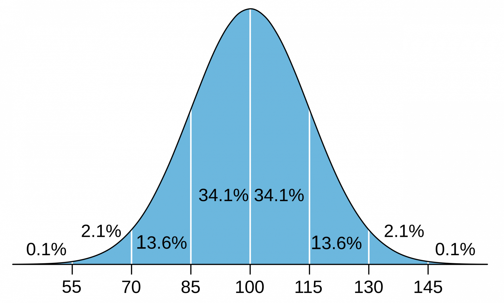

# Распределение IQ: как программисту выживать в мире, рассчитанном на дураков?⁠⁠



Вы наверняка часто ловили себя на мысли, что многие вещи в нашем мире устроены максимально нелогично, и, по-хорошему, должны были бы быть устроены совершенно по-другому. В философии эта проблема часто упоминается под названием "сущее и должное". И выходом из неё во многих случаях служит отнюдь не приведение сущего к должному, а понимание того, почему сущее такое, какое оно есть.

Избавление от иллюзий должного и понимание причин сущего может сильно помочь вам в жизни, ведь работать вам предстоит с сущим, а не с фантазиями о должном. Да и когда фантазии о должном разбиваются о стену сущего, носителям этих фантазий бывает очень и очень больно. Наиболее действенным способом понимания сущего я считаю просмотр телевизионных передач про мир грызущих друг другу ради пропитания глотки диких животных, в котором без особого труда можно узнать мир человеческий. Но в этом посте не об этом.

В этом посте я хочу рассмотреть вопрос, ответ на который, надеюсь, поможет вам понять, почему многие вещи в мире устроены так, как они устроены. Почему многие законы такие нелогичные? Почему идущие в кинотеатрах фильмы такие незамысловатые, а шедевры всегда проваливаются в прокате? Почему до сих пор так распространено мошенничество "с безопасным счётом", если о нём трындят на каждом шагу? Почему в США так важно кого на выборах поддержит Тейлор Свифт? Почему существует общество плоской Земли? Почему полиция работает так, как она работает? Причём я не буду прямо рассматривать ни один из этих вопросов, а рассмотрю только метавопрос, метаответ на который безмолвно отвечает на них все.

## Тест IQ

Стандартизированные тесты измерения человеческого интеллекта распространились в начале XX века с началом широкой индустриализации и появлением массовых армий. Работодателям нужно было выявлять наиболее смышленных работников, которые смогут работать со сложными чертежами и на сложных станках. А армиям не хотелось тратить попусту жизни солдат - зачем посылать умного солдата в штурм на вражеский пулемет, если он гораздо больше пользы принесет работая связистом в штабе?

Современные стандартные тесты коэффициента интеллекта (IQ) обычно проходят так: большая выборка людей, много тысяч или даже десятки тысяч, решает десятки или даже сотни логических задачек. Результаты правильного решения задач при достаточно большой выборке всегда соответствуют нормальному распределению. Эти результаты нормируются так, что за середину распределения берется число 100, а за стандартное отклонение берется число 15. Таким образом, распределение IQ всегда выглядит так, как на картинке под заголовком этого поста.

Существует простой математический факт, с которым трудно не согласиться - половина значений в нормальном распределении меньше среднего. Из чего следует уже другой факт, математически полностью эквивалентный первому, но описанный другими словами - половина людей глупее среднего. Однако согласиться с этим вторым фактом психологически очень некомфортно - нам всегда кажется, что все люди мыслят примерно так же, как и мы. К сожалению, именно полное осознание и принятие этого факта - тот самый путь к избавлению от иллюзий о должном и принятию сущего.

Очень часто, мы, программисты, живём в пузыре, среди обитателей которого средний IQ сильно выше средних 100 баллов. Круг нашего общения ограничен нашими коллегами из ИТ-компаний, сокурсниками на физико-математических факультетах университетов, часто одноклассниками в специализированных школах, скорее всего достаточно хорошо образованными родителями и родственниками, и так далее. Мы не любим вылезать из этого "ботанского" пузыря, и такое окукливание часто приводит к сильному искажению картины мира, из-за которого мы искренне удивляемся почему некоторые вещи устроены так, как они устроены. Мы ведь смотрим вокруг себя, и нам кажется, что все окружающие нас люди думают примерно так же, как мы - не в смысле политических или каких-либо других взглядов, а в смысле уровня аргументации и логического мышления.

Но если вы внимательно посмотрите на график распределения интеллекта в популяции, то можете заметить, что почти 16% популяции имеет IQ ниже 85 баллов, а 25% ниже 90 баллов (включающие в себя предыдущие 16%, конечно же). И для понимания реальности важно понимать, что это вообще значит.

## Способности в зависимости от IQ

В интернете часто встречается скрин одного треда с форчана, в котором автор пишет про самый простой и быстрый тест на IQ, который можно провести без лишних усилий:

> Самый простой и быстрый способ протестировать интеллект собеседника - это в разговоре упомянуть обобщенное утверждение о группе вроде "в среднем азиаты ниже европейцев". Если ваш собеседник ответит вам что-то вроде "не все азиаты низкие" или "я знаю одного высокого азиата", то это значит, что у него достаточно низкий IQ. Своим ответом он показал, что попросту не понимает абстрактных идей вроде "статистического среднего" или "на душу населения". Никакие аргументы и объяснения не помогут вам переубедить собеседника, потому что тот попросту не понимает абстракций.

В другом довольно известном в англоязычном интернете треде с форчана автор рассказывает про своё участие в научных исследованиях IQ:

```
В свою бытность студентом, я участвовал в проведении IQ-тестов и повидал много всякого. Знаете ли вы, что большинство людей с IQ ниже 90 баллов не способны к пониманию гипотетических ситуаций?

Например, диалог с одним из испытуемых:

- Как бы вы чувствовали себя вчера вечером, если бы в тот день пропустили завтрак или обед?
- Что ты имеешь в виду? Я вчера ел завтрак и обед.
- Да, но если бы вы этого не сделали, как бы вы чувствовали себя вечером?
- Почему ты говоришь, что я не завтракал? Я же сказал, что завтракал.
- Представьте себе, что вы вчера пропустили прием пищи. Как бы вы чувствовали себя вчера вечером?
- Я не понимаю вопроса

Мы проводили исследование интеллекта в тюрьме Сан-Квентин среди заключенных. Большинство из них имели очень низкие показатели IQ, а половина была чуть ли не неграмотными.

Другой интересный феномен связан с рекурсией. Например, если попросить испытуемого написать историю с двумя названными по именам персонажами, у каждого из которых есть хотя бы одна реплика, то большинство грамотных людей легко справятся с этим заданием. Особенно, если привести им пример. Но вот если попросить написать историю с двумя названными по именам персонажами, у каждого из которых есть хотя бы одна реплика, и один из которых в ходе своей реплики рассказывает историю с двумя названными по именам персонажами, у каждого из которых есть хотя бы одна реплика, то большинство людей с IQ меньше 90 баллов с этим не справятся. Добавьте третий уровень рекурсии и уже люди со 100 баллами IQ начнут путаться в именах.

Люди с IQ ниже 80 с трудом воспринимают концепцию времени. Они не размышляют ни о прошлом, ни о будущем, а живут в настоящем моменте. Люди с IQ в пределах 80-85 баллов часто спотыкались в логических задачах, связанных с пониманием анахронизмов. Например, на вопрос "как вы думаете, почему во время Второй Мировой Войны генералы не использовали ноутбуки для планирования военной стратегии" многие отвечали "может быть, они боялись, что их взломают нацистские хакеры". Конечно, можно утверждать, что это вопрос не на логику, а на знание истории развития техники, но, надеюсь, вы уловили суть. Тестируемым с IQ в этом диапазоне с большим трудом удавалось отслеживать последовательность каких-либо событий, а вот у тестируемых с IQ больше 100 баллов таких проблем не возникало. Но основным водоразделом служит всё-таки понимание рекурсии - даже у большинства людей со средним интеллектом большие проблемы с рекурсивным мышлением.

Хотя в тюрьме Сан-Квентин таких было немного. В основном, там сидели люди с IQ ниже 90, у которых были проблемы с психопатией и социопатией. У них не было достаточной когнитивной вычислительной мощности для просчёта реакции других людей на их поступки. Например, диалог с одним из испытуемых:

- Как вы думаете, что чувствовал этот человек, когда вы его избили?
- Не знаю
- Как вы думаете, что почувствовала мать этого мальчика, когда услышала, что ее сын мертв?
- Не знаю

Вам может показаться, что они просто не хотят отвечать, но, на самом деле, у этих людей не хватало интеллекта, чтобы построить даже грубую модель чужого разума, не говоря уже о том, чтобы наполнить ее событиями из прошлого.

Я забыл упомянуть еще одну важную часть абстрактного мышления - понимание соответствий и отображений. По сути, выражение чего-то одного через другое. Приведу пример одного из заданий: "Представьте себе стрелку, окрашенную в градиент от желтого к зеленому по направлению стрелки. Представьте себе одностороннюю жилую улицу с возрастающими номерами домов, где самый маленький номер находится у въезда на улицу, а самый большой на выезде с неё. Если бы вы нанесли стрелку на улицу, какого цвета был бы дом номер 1?"

У людей с IQ выше 100 баллов не возникает никаких сложностей с этим заданием. Любой человек со средним интеллектом может отобразить одно на другое. Однако у людей с IQ ниже 90 баллов большие трудности с этим заданием, а люди с IQ ниже 80 баллов в принципе не способны на его выполнение. У людей с IQ ниже 90 в жизни постоянные трудности с чтением карт и расписаний, а у людей с IQ ниже 85 частые проблемы даже с базовой грамотностью, ведь чтение - это отображение букв в звуки.

И я даже не говорю о математике, хотя математика - это область, успех в которой во многом определяется уровнем интеллекта. Можно сказать, что это тавтология, ведь уровень интеллекта и проверяется математически-логическими задачами, но вы уловили суть.
```

Если аноны с форчана не кажутся вам достаточными авторитетами, обратимся к интервью российского популяризатора математики Алексея Савватеева, в котором он рассказывает о том, что уже в начальных классах школы по ребенку можно понять, какие именно способности он сможет освоить, а какие нет, приводя пример трёх больших водоразделов, которые преодолеть способны не все.

Первый водораздел находится на стадии около трёх-четырёх лет и показывает наличие абстрактного мышления: если ребенка спросить сколько будет, если два апельсина сложить с тремя арбузами, то некоторые дети сразу ответят, что пять, а некоторые не поймут вопроса, потому что не могут абстрагировать число от сущности. Второй водораздел находится на стадии третьего-четвертого класса школы, в которых начинают преподавать математические функции вроде `y = x ^ 2 + 3 * x + 2`. Некоторые дети сразу же понимают смысл абстракции переменной и то, что подставляя разные переменные в функцию мы получаем разные результаты, а некоторым объяснить это оказывается почти невозможно. Третий большой водораздел, следующий уровень абстракции - это уже теория групп, преподаваемая в университетах.

Запертым в "ботанских" пузырях программистам просто неоткуда узнать, что для довольно большой части человеческой популяции понимание таких кажущихся элементарными вещей как математические функции либо вызывает трудности, либо принципиально невозможно вообще. И это не какой-то ничтожный процент - 16% популяции имеет IQ ниже 85 баллов, а следовательно отсутствие понимания абстракций, соответствий, рекурсии, гипотетических ситуаций, времени. Ещё около 9% популяции имеет IQ от 85 до 90 баллов, а следовательно не невозможность, но проблемы с пониманием вышеперечисленных вещей.

Поэтому когда мы смотрим на какие-либо процессы или явления в реальном мире, находящемся вне нашего уютного маленького мирка - будь-то государственное управление, законы, работа полиции, маркетинг, реклама, кинематограф - нужно понимать, что все эти вещи устроены так, как они устроены, не просто так, а с расчётом либо на то, чтобы работать в том числе или даже в основном (в случае полиции, например) с частью популяции, находящейся далеко слева от середины графика IQ.

## AI и IQ

Лучше всего зависимость способностей от "вычислительной мощности мозга" видна на примере больших языковых моделей. На этой анимации из одного исследования от Google видно как резко увеличиваются интеллектуальные способности LLM в зависимости от количества параметров при их тренировке.


Если в недалеком будущем появится AI с интеллектуальными возможностями превышающими способности самых умных из людей, то даже если он создаст новые теории физики и напишет доказательства сложнейших гипотез математики, то, вероятно, он попросту не сможет их никому объяснить, потому что даже у самых умных из людей будет недостаточно интеллекта, чтобы их понять. С учётом того, что у достаточно большой части человеческой популяции есть проблемы с пониманием функциональной зависимости x от y, в это не сложно поверить.

## Заключение

Прежде, чем бежать в комментарии с криками "Гитлер! Гитлер! Гитлер!" перечитайте, пожалуйста, пост. В нём нет никаких призывов к расправам на основе IQ и ничего подобного. В этом посте вообще нет слова о должном - он весь лишь о сущем.
