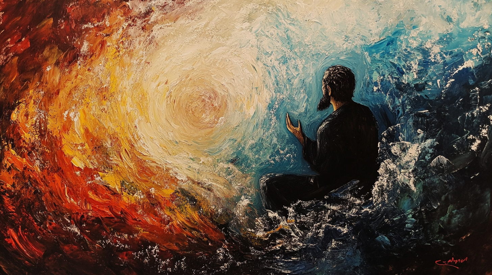
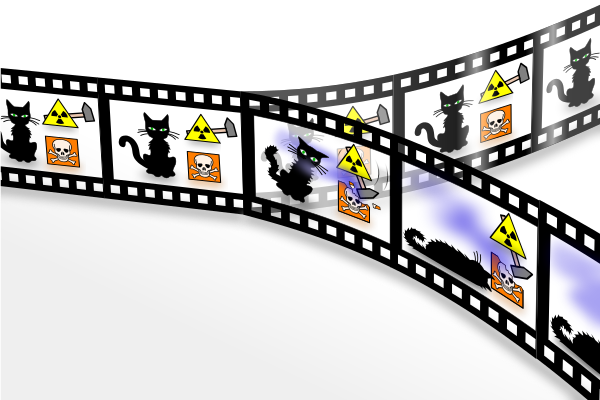
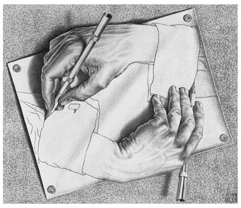

# Квантовый ластик, Хорхе Луис Борхес и сказка, которая пишет сама себя

В этом посте я собираюсь расскажу о том, как магия слова позволяет создавать и направлять целые миры, как контринтуитивные результаты экспериментов по квантовой механике и теория естественного отбора связаны с личным мироощущением, чем реальность отличается от снов и как нам стать авторами собственной жизни.

## Тлён, Укбар, Орбис Терциус

Почти каждый человек независимо от религиозной принадлежности знаком с первым предложением Евангелия от Иоанна:

> В начале было Слово, и Слово было у Бога, и Слово было Бог

Не зря эти слова так глубоко врезались в память миллионов людей — в них сконцентрирована великая истина об устройстве Вселенной. И это не единственный священный текст, начинающийся с подобного посыла. Еврейская Тора, лежащая в основе христианского Ветхого Завета начинается со слов:

> В начале сотворил Бог небо и землю

Эта строка Торы — перефраз из ещё более древнего литературного источника — шумерского священного онтологического мифа Энума Элиш, начинающегося со слов:

> Когда наверху не названо небо, внизу земля именем не называлась

Смысл этой строки в том, что вещи возникают в мире не сами по себе, а в виде двойственных пар противоположностей — света и тьмы, верха и низа, богатства и бедности. Про это же говорит и классический даосский текст китайской философии Дао‑дэ‑цзин:

> Лишь только в Поднебесной узнали, что красивое — красиво, тотчас появилось и уродство. Как только все узнали, что добро — это добро, тотчас появилось и зло. Ибо наличие и отсутствие порождают друг друга. Сложное и простое создают друг друга.

Но давайте пока вернемся к строке из Торы «В начале сотворил Бог небо и землю». На иврите слово «небо» звучит как «шамаим» — это двойная форма слова «шем» — «имя». Двойная форма в иврите позволяет создать из слова «x» слово со смыслом «2x» с помощью окончания «аим»: например, из слова «шавуа» — «неделя» получается слово «шавуаим» — «две недели», а из слова «махар» — «завтра» получается «махараим» — «послезавтра». Но как тогда из слова «шем» — «имя» получается слово «шамаим» — «небо»?

Дело в том, что слово «шамаим» в контексте Торы используется не в буквальном значении голубого неба над головой, а в фигуральном значении неба как нематериального платоновского мира вечных идей, и буквально означает «пространство имён». Именно в таком значении слово небо использовалось в Торе и в последствии в Библии, поэтому фразы вроде «Гагарин в небо летал, бога не видал» основаны на полной потере смысла при переводе с иврита на греческий. Таким образом, правильнее было бы перевести эту строку как «В начале Бог сотворил пространство имён (мир идей, небо) и физическое пространство (землю)».

Иоанн Богослов, написавший в начале своего Евангелия по‑гречески «В начале было Слово, и Слово было у Бога, и Слово было Бог» как и все ранние христиане был евреем, поэтому перенёс в своё произведение дух, а не букву Торы, и вместо «неба» он употребил схожее греческое понятие Логос, означающее слово, мысль, понятие. Таким образом, все эти строки «В начале было Слово, и Слово было у Бога, и Слово было Бог», «В начале сотворил Бог небо и землю», «Когда наверху не названо небо, внизу земля именем не называлась» несут один и тот же смысл — сотворение мира происходит с помощью идей, имён, слов, которые формируют (то есть придают форму) материи — так и появляется физический мир.

Созидательную магию слова, сторителлинг, используют с незапамятных времён. Одна и та же история, рассказанная немного по‑разному, может нести в себе совершенно разный смысл. В битве за умы людей, а следовательно в битве за то, как в этих умах воспринимается реальность, побеждает тот, чей нарратив окажется более увлекательным, более цепляющим, более убедительным. Мир буквально состоит из множества субъектов — государств, корпораций, религий, политических движений, сект, каждый из которых стремится навязать свой нарратив другим.

Как только нарратив навязан, заданы рамки, внутри которых происходит действие. Тот, кто контролирует дискурс, контролирует реальность. Реакционные силы всегда проигрывают проактивным, потому что проактивные силы создают историю и втягивают в неё всех остальных в качестве персонажей. Побеждают те, кто производит истории, тот, кто создаёт галлюцинации, которые со временем становятся коллективными. Таким образом, в историях добро всегда побеждает зло не только потому, что историю пишут победители и назначают себя добром, но и потому что побеждают чаще те, кто изначально рассказывает историю, в которой они — добро.

Известный французский философ‑постмодернист Жак Деррида призывал рассматривать мир именно как текст, как рассказываемые друг другу истории. А великий аргентинский писатель Хорхе Луис Борхес в своём рассказе «Тлён, Укбар, Орбис Терциус» описывал то, как вымышленный мир может вторгнуться в реальность, потихоньку вместе с придуманными понятиями, словами и выражениями смешиваясь с ней и, в один момент, полностью сливаясь в единое целое. Магия слова, как она есть.

Одними из первых в совершенстве эту самую магию освоили древние евреи, само самоназвание которых — народ Книги. Подумайте вот над каким вопросом: «О чём думал Голиаф? О чём он мечтал? Чего боялся?». Никто этого не знает — Голиаф стёрт из истории вместе со всем филистимлянским народом, потому что они не оставили после себя никакого нарратива, никакой истории, никакого эпоса. Его соперник на поле боя, Давид, и его современники оставили после себя целое сказание о себе, своих подвигах, своих деяниях. Были ли военные достижения царя Израиля объективно намного более великими, чем военные достижения филистимлян? Нет, особо не были — Давид был просто одним из местных царьков тех времен. Но в умах миллионов людей Давид запомнился великим и славным героем, а Голиаф остался второстепенным боссом на одном из уровней похождений Давида, ибо Голиаф заперт в качестве персонажа в реальности, созданной словом Давида.

Вы, конечно, можете возразить, что Голиаф всё‑таки сначала проиграл физическую битву, а историю, как известно, пишут победители. Но подумайте вот о чём: одного последующего «царя Израиля» из рода Давида римляне физически просто напросто казнили, но после того, как ещё пару сотен лет боролись против магии его слова, полностью ему проиграли. С тех пор магическое заклинание этого древнего иудейского волшебника «INRI» можно найти почти в каждом здании на улицах вечного города.

Другим примером физического проигрыша древних евреев в войне, но разгромной нарративной победы может служить история римской кампании по подавлению восстания в Иудее. Физически римские легионы довольно быстро по меркам тех лет расправились с восставшими, но вот узнала о той войне широкая публика империи из трактата «Иудейская война», написанного Иосифом Флавием — иудейским генералом и одним из предводителей восстания. Даже позорную историю, известную в математике под названием «Задача Иосифа Флавия», мы знаем только в интерпретации самого автора — кто знает, что там было на самом деле.

В описанных мною случаях с Давидом и Иосифом альтернативного нарратива просто не существует. Когда же он есть, то используются более тонкие технологии. Например, подсветка. В серии романов про мир трансгуманизма Виктор Пелевин описывает «подсветку» — вымышленную, несуществующую на момент написания этого текста, но физически возможную технологию, которая управляет вниманием человека, как бы подсвечивая одни факты, и скрывая во тьме другие. В реальности технология, подобная пелевинской подсветке, используется на постоянной основе. Приведу пример того, как это работает.

Например, открываете вы книгу по истории и читаете там:

> Герцог Карл Петер Ульрих Гольштейн‑Готторпский женился на Софии Августе Фредерике Ангальт‑Цербстской. Их старший сын, Павел, под конец жизни достиг больших высот и занял несколько государственных постов, одним из которых был пост великого магистра суверенного военного ордена рыцарей‑госпитальеров Святого Иоанна, Родоса и Мальты. Павел был женат дважды — первый раз на принцессе Августе‑Вильгельмине‑Луизе Гессен‑Дармштадтской, к сожалению, умершей при родах, второй раз на Софии Марии Доротеи Августе Луизе Вюртембергской, от брака с которой родилось четверо сыновей, двое из которых как и отец достигли небывалых высот в государственной иерархии. Первый сын Павла стал великим полководцем, одержавшим победу над французской армией, третий же его сын был не столь же удачлив в военном деле, зато более удачлив в делах семейных: у первого сына в браке с принцессой Луизой Марией Августой Баденской сыновей не было, зато у третьего сына в его браке с Фридерикой Луизой Шарлоттой Вильгельминой Прусской родилось их несколько.

Кто все эти люди, спросите вы? И в чём тут пример работы «подсветки»? Всё дело в том, что факты, изложенные в этом абзаце, полностью публичные — их никто никогда не скрывал. Однако, обычно их не подсвечивают, а оставляют во тьме, подсвечивая немного другие. Поэтому большинство из нас, кто не обладает широкими познаниями в истории, не ответят без подглядывания во внешние источники на вопрос о том, кто все эти люди. А это как никак династия Гольштейн‑Готторпов, правившая Россией на протяжении 156 лет.

## Письмена бога

Я хочу привести пример того, как рассказанный самому себе нарратив может перевернуть представления человека о мире и его месте в нём. Это цитата из моего недавнего мини‑поста под названием «Дети богов».

> В романе советского писателя Чингиза Айматова «И дольше века длится день» описывается легенда о манкуртах — пленённых людях, которым с помощью жесточайших пыток отбивают всю память о прошлом с целью сделать их идеальными рабами. Вскоре после выхода романа в свет слово «манкурт» стало нарицательным, и теперь оно часто используется в переносном смысле для обозначения людей, забывших свое прошлое, потерявших всякую связь со своими корнями. Также часто можно услышать другой похожий по смыслу фразеологизм — «Иван, родства не помнящий». В прямом смысле так в старые времена называли ушедших в несознанку при допросе беглых каторжан, отказывавшихся называть свое имя и фамилию, а в переносном смысле этим выражением обозначают людей, разорвавших или забывших связь со своим прошлым.
>
> Огромная проблема современного общества заключается в том, что в ходе прошедшей в XX веке урбанизации и секуляризации мы все стали такими манкуртами, не помнящими своего родства Иванами. Мы слабо представляем, кем были наши предки, чем они занимались, о чём мечтали, чего боялись. Избавившись от многих религиозных традиций и сопутствующих им предрассудков, мы, однако же, выплеснули вместе с водой и ребенка. В большинстве великих мировых культур в течении тысячелетий были широко распространены религиозные практики почитания предков и обращения к ним за советом. Многим из нас такие вещи как сила рода и родовые проклятия кажутся глупыми предрассудками примитивных и дремучих людей прошлого. Но такими ли дураками были наши предки, из поколения в поколении воспроизводившие эти практики?
>
> Родовые проклятия — это воспроизводящиеся от поколения к поколению программы поведения, которые родители передают детям в ходе воспитания. Этакие передающиеся от ума к уму ментальные вирусы, самовоспроизводящиеся когнитивные репликаторы. Но у рода есть не только негативная сторона, но и позитивная — та самая сила рода. И это не какая‑то эзотерическая астральная брехня, а память о великой силе наших предков, переживших все тяготы и лишения человеческого бытия и передавших свои гены, мемы и свет сознания дальше по цепочке. Просто подумайте: у ваших родителей есть свои родители, ваши бабушки и дедушки, у них есть свои родители, у тех свои, и эта огромная стоящая на вас, как на своём острие, перевернутая генеалогическая пирамида уходит в доисторическую глубь веков. Если бы хоть один из ваших многочисленных предков опустил бы руки, сдался, недостаточно рьяно сражался бы с врагами и жестокостью окружающего мира и не выжил бы, то вас бы не было на свете. Жизнь и борьба каждого из них была необходима, чтобы жили мы. Мы — потомки великих героев. Забывая об этом, мы становимся теми самыми не помнящими своего родства манкуртами — идеальными рабами, ведь нам кажется, что мы в этом мире лишь жалкие букашки, не имеющие в нём ни места, ни каких‑либо прав на него.
>
> Если же мы пойдём по нашему генеалогическому древу ещё дальше во тьму веков, то в определенный момент мы начнём замечать, что наши предки перестают быть похожими на нас, а однажды и вовсе перестают быть людьми. В глубине древа люди становятся гоминидами, гоминиды становятся древними обезьянами, те становятся примитивными приматами, приматы становятся древними млекопитающими, и так далее через рыб к живущим в воде многоклеточным организмам, а от них к простейшим, бактериям и дальше к воспроизводящимся в химических реакциях молекулам РНК. Идя по нашему семейному дереву, мы как бы наблюдаем процесс эволюции на обратной перемотке. Но откуда же появилась РНК‑жизнь? Молекулы РНК, как и сама наша планета, сформировались из атомов элементов тяжелее водорода и гелия, произведенных в термоядерных реакциях, протекающих в недрах звезды по имени Солнце. Наши тела буквально состоят из звёздной пыли, мы дети звёзд. А сами звезды сформировались из атомов водорода, существующих в нашей Вселенной с самого начала времён — со времен Большого Взрыва, каким бы он ни был. Таким образом, метафорически говоря, мы прямые потомки Бога, крошечные осколки его величия — наш знатный род восходит к самой первой искре мира.
>
> Такой взгляд на вещи в корне меняет самовосприятие и самоощущение человека, превращая его из твари дрожащей в право имеющего. Человек, полагающий, что он в каком‑то смысле и вправду сын Божий, и знающий, какой древний и славный род стоит у него за спиной, может свернуть даже горы...

В Торе написано, что спасая одну душу, ты спасаешь целый мир. И это правда, ведь феноменальный мир, реальность, цвета, звуки, запахи, концепции существуют только лишь в нашем восприятии. Сознание вселяет жизнь и смысл в хаос, состоящий из скоплений движущихся элементарных частиц. И когда оно погасает, исчезает всё — происходит тот самый конец света.

Этот конец света очень точно описан в одной из глав романа Виктора Пелевина «Круть»:

> Но это и не важно. Ибо главная истина, друг мой до свиданья, состоит в том, что этот недобрый мир полностью иссякнет и завершится в тебе самом гораздо раньше, чем сменится геополитическая эпоха, климат или что там еще на телепромптере.
> ...
> Да, конец истории делается все тверже и поворачиваться к нему спиной уже тревожно. Но не бойся глобальных катаклизмов, друг мой. Скажу тебе на ухо — ты сам и есть надвигающийся апокалипсис. Нет другой атомной бомбы, которая долбанет по этому миру так же фатально и метко, как ты сам. Мало того, заодно ты уничтожишь всю Вселенную. Замочишь не только Цукерберга на яхте «Launchpad», но и его космическое рептилоидное начальство из международного порнофильма «Проблема Трех Тел». Какое еще утешение тебе нужно, человек?

Таким образом, каждый из нас является в каком‑то смысле Творцом своего мира, ведь мир существует лишь в нашем восприятии. Чем мы не дети богов?

## Сад расходящихся тропок

В 1941 году вышел в свет рассказ аргентинского писателя Хорхе Луиса Борхеса под названием «Сад расходящихся тропок». В этом рассказе описан вымышленный сад, в котором тропинки символизируют различные варианты истории одного и того же персонажа. Каждое принятое персонажем решение образует развилку, от которой независимо друг от друга идут две другие тропинки, иногда сливаясь обратно или же никогда не пересекаясь.

Возможно, именно под впечатлением от этого рассказа, в 1957 году американский физик Хью Эверетт создал свою знаменитую многомировую интерпретацию квантовой механики, согласно которой каждый коллапс волновой функции создает развилку, делящую мир на несколько независимых параллельных вселенных, в каждой из которых мы наблюдаем различный результат эксперимента. Точнее говоря, в интерпретации Эверетта никакого коллапса вообще нет: Вселенная всегда полностью подчиняется волновой функции Шрёдингера — это нам, существам из мира бинарных фактов, кажется, что происходит её коллапс, а на самом деле мы просто обнаруживаем себя на одной из множества ветвей.

В интерпретации Эверетта история, как у Борхеса, как бы разделяется на несколько, а мы — просто персонажи, обнаруживающие себя лишь в одной из её версий. Единственное правило состоит в том, что история всегда остаётся самосогласованной — в ней никогда нет никаких противоречий.

Многим людям трудно принять многомировую интерпретацию — слишком уж она контринтуитивная и звучит фантастически. Однако это единственный взгляд на мир, позволяющий сохранить рассудок при анализе физического эксперимента, известного как «квантовый ластик с отложенным выбором». Результаты этого поразительного эксперимента в корне изменили мировоззрение множества людей.

Эксперимент «квантовый ластик с отложенным выбором» — это развитие другого эксперимента под названием «квантовый ластик». Я не хочу вдаваться в технические детали этого эксперимента, опишу лишь вкратце путь его эволюции:

- Двухщелевой опыт — экран облучается светом через две узкие щели. Мы видим на экране интерференционную картину, образующуюся от наложения световых волн. Мы ставим напротив одной из щелей детектор фотонов, чтобы зарегистрировать, по какому именно пути прошёл каждый из выпущенных фотонов. Мы наблюдаем, что интерференционная картина на экране разрушена, то есть свет ведет себя уже не как волна, а как частица.
- Опыт с квантовым ластиком — мы усложняем схему, добавляем в неё создание двух запутанных фотонов и устройство под названием «ластик», которое «стирает» информацию о том, по какому пути прошёл фотон. Мы наблюдаем, что интерференционная картина на экране восстановилась. При этом не имеет значения, был процесс стирания выполнен до или после того, как фотоны достигли экрана.
- Опыт с квантовым ластиком с отложенным выбором — мы проводим тот же самый эксперимент с квантовым ластиком, но случайным образом решаем применять ли нам ластик уже после того, как фотон должен был пройти через щели (то есть проинтерферировать сам с собой или нет). При этом на экране появляется или не появляется интерференционная картина в зависимости от того, стерли ли мы информацию или нет. Таким образом, создаётся впечатление, что события в будущем влияют на события в прошлом.

Каждый из экспериментов сильно ломал человеческие представления о мире. Приведу цитату из Википедии про квантовый ластик с отложенным выбором:

> Квантовый ластик с отложенным выбором исследует следующий парадокс: если фотон ведет себя так, как прошедший к детектору по одному из возможных путей, тогда «здравый смысл» (который Уилер и другие подвергают сомнению) говорит, что он должен был пройти двухщелевое устройство в виде частицы. Если же фотон ведет себя так, как прошедший через два неразличимых пути, то он должен был пройти двухщелевое устройство как волна. Если же изменить экспериментальную установку в момент времени, когда фотон находится в пути, то фотон должен изменить свое первоначальное «решение» относительно того, быть ли ему волной или частицей. Уилер указал, что, если эти предположения применить к устройству космических размеров, то решение о наблюдении фотона, принятое в последнюю минуту на Земле, может изменить ранее принятое решение, которое было сделано миллионы или даже миллиарды лет назад.

Если мы поразмышляем над написанным, то мы придём к невероятному выводу: мы способны поменять историю далёких галактик просто взглянув ночью на звёздное небо над головой. Зарегистрировав глазом фотон, дошедший до нас за миллиарды лет сквозь мрак космоса от далекой звезды, мы тем самым поменяем поведение запутанного с ним парного фотона в далёком прошлом. И, если предположить, что эффект бабочки, связанный с этим конкретным вторым фотоном, имел какие‑то хотя бы даже малозначительные последствия, то получается, что мы одним своим взглядом переписали историю далёких миров. Всё ещё не верится, что мы — потомки богов? Кому же ещё может быть подвластно взглядом изменять историю инопланетных цивилизаций?

Конечно же, на самом деле, когда мы смотрим на звёзды, история не меняется — она просто проявляется в таком виде, чтобы мир всегда оставался самосогласованным. Глядя на звёзды, мы просто оказываемся в той или иной ветке мультивселенной — с живым или мёртвым далёким инопланетным котом Шрёдингера. Правда, в нашем случае мы имеем дело не с одним единственным котом, а, вероятно, с судьбой триллионов живых существ. Так что, в следующий раз, когда вы поднимите глаза в ночное небо и взглянете на сияние тысяч далёких солнц, вспомните слова великого немецкого поэта Генриха Гейне: «Каждый человек — это мир, который с ним рождается и с ним умирает; под всякой могильной плитой лежит всемирная история».

Выводы из этого эксперимента по квантовой механике кажутся нереальными — в них просто невозможно поверить. Один взгляд на звёзды благодаря эффекту бабочки может определить историю далёких цивилизаций. Но представления человека о реальности очень, простите за каламбур, далеки от реальности. Это можно продемонстрировать на примере другой бабочки.

Древнекитайский философ Чжуан Цзы известен своим парадоксом:

> Однажды Чжуан‑цзы приснилось, что он — бабочка. Он наслаждался от души и не осознавал, что он Чжуан‑цзы. Но, вдруг проснулся, очень удивился тому, что он — Чжуан‑цзы, и не мог понять: снилось ли Чжуан‑цзы, что он — бабочка, или бабочке снится, что она — Чжуан‑цзы?

Этот рассказ кажется просто забавной байкой, но, на самом деле, тут Чжун‑Цзы сформулировал один из самых глубоких вопросов философии о природе реальности. Как я уже писал, реальность существует лишь в нашем восприятии — цвета, звуки, запахи и концепции есть только‑лишь в нашем уме. Когда мы бодрствуем входящий в наш мозг сигнал исходит от органов чувств. Во сне мозг создаёт сигналы сам для себя — сны полны образов и цветов несмотря на то, что наши глаза закрыты. А теоретически можно вообще вынуть мозг из человеческого черепа и поместить его в колбу, подавая в него сигналы из компьютерной симуляции.

Так как нам понять, находимся мы в симуляции, видим сновидение или бодрствуем? Парадоксом про бабочку Чжуан‑Цзы показал, что никак. Реальность — это просто фильм, идущий в мозге, и существующий только лишь там. Да и в реальности самого мозга нельзя быть до конца уверенным.

Реальность в бодрствовании, реальность во сне и реальность в симуляции ничем не отличаются друг от друга. Можно сказать, что мир бодствования — это точно такой же мир сновидений, только с более стабильными логическими причинно‑следственными связями. Исследователи осознанных сновидений заявляют, что при должной тренировке события во сне тоже можно сделать менее хаотичными и более логически связанными. Таким образом, реальность сотворяется из хаоса сознания с помощью ограничений логики, чьё название происходит от того самого древнегреческого Логос, переводимого на русский язык как Слово. Что там написано в Евангелии про сотворение мира? В начале было Слово, и Слово было у Бога, и Слово было Бог. Так может быть, древнеиндийская философия права, и вся наша Вселенная — это просто божественный сон, стабилизированный хорошо прописанным сюжетом?

## Вавилонская библиотека

Тезис Дерриды о том, что мир это текст, великолепно иллюстрируется рассказом Борхеса «Вавилонская библиотека». В этом произведении описывается невероятных размеров библиотека, состоящая из шестигранных комнат, в каждой из которых стоят шкафы по двадцать полок в каждом, на каждой полке находятся тридцать две книги по четыреста десять страниц каждая, с сорока строками на каждой странице, с восемьюдесятью символами в каждой строке. Каждый символ — это либо одна из двадцати двух букв некоего алфавита, либо точка, либо запятая, либо пробел. В библиотеке не существует двух одинаковых книг — все книги представляют из себя уникальные варианты перестановки двадцати пяти символов. Таким образом, библиотека целиком включает в себя все математически возможные перестановки символов.

Большинство из книг в библиотеке — это полная белиберда, набор букв. Однако, несмотря на то, что таких бессмысленных книг в библиотеке большинство, также в библиотеке содержатся все созданные и несозданные человечеством тексты. Точнее несозданные в нашей ветви мультивселенной Эверетта, но, возможно, созданные в других ветвях.

По словам Борхеса, библиотека содержит:

> .. подробнейшую историю будущего, автобиографии архангелов, верный каталог библиотеки, тысячи и тысячи фальшивых каталогов, доказательство фальшивости верного каталога, гностическое Евангелие Василида, комментарий к этому Евангелию, комментарий к комментарию этого Евангелия, правдивый рассказ о твоей собственной смерти, перевод каждой книги на все языки, интерполяции каждой книги во все книги, трактат, который мог бы быть написан (но не был) Бедой по мифологии саксов, пропавшие труды Тацита.

И всё это сущая правда. Вавилонская библиотека — это плод бесконечных трудов бесконечного количества обезьян с печатными машинками. В ней есть все возможные истории во всех возможных вариантах развития событий. Вот и получается, что, если задуматься, то получается, что наша Вселенная — это не сон, а сказка, которую Бог рассказывает самому себе и сам при этом является этой самой сказкой. В начале было Слово, и Слово было у Бога, и Слово было Бог.

Как так получается, что иногда мы отправляем некий запрос во Вселенную, и он исполняется, но не в том виде, что мы желали, а именно в том, что сформулировали? Может быть, никакой мистики тут нет, и всё дело в том, что мы сами подобно Богу пишем историю своей жизни? А наши страдания — это просто история, которую мы сами себе сочиняем, и чтобы стать счастливыми, нужно просто понять это и начать сочинять себе другую историю? Может быть в этом и состоит освобождение от оков кармы, которая является лишь плодом нашего ума?

Мы, люди, подобно нашему великому незримому предку — не только читатели истории нашей жизни, но и её писатели и сама история по себе. «Тат твам аси» — я есть то. И ограничения на крутость и невероятность этой истории существуют лишь у нас в уме, а на самом деле потенциал нашего сознания безграничен. Нужно лишь полностью принять то, что мы не мелкие второстепенные персонажи в этой истории, а главные герои. Мы — создатели этого мира, его зрители, и он сам. И нам пора взять на себя авторство этой пьесы.

У уже много раз упомянутого в этом посте Пелевина есть замечательный роман про приключения графа Льва Толстого под названием «t», в котором тема отношений читателя, писателя и истории раскрывается в полной мере. А у меня же самого есть пост под названием «Искусственный интеллект, Большой Взрыв, чёрные дыры и филиокве — ищем ответ на вопрос, расколовший христианскую церковь», которая тоже отчасти перекликается с тройственностью читателя, писателя и истории.
