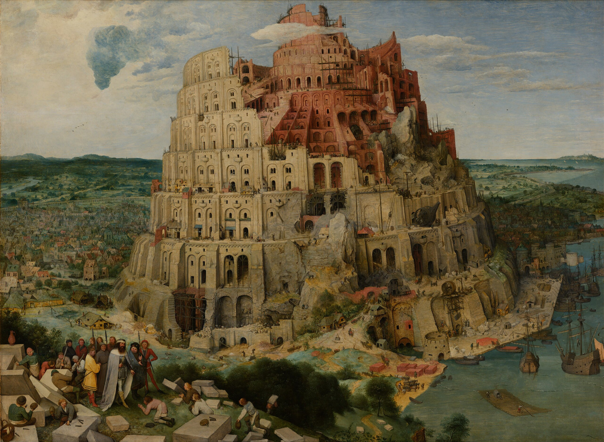
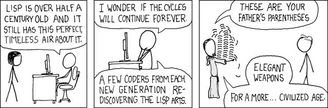
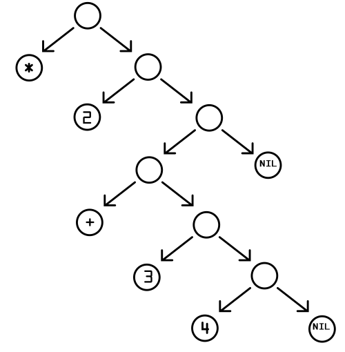

# Лямбда, Лисп и Ложбан — в поисках утраченного Вавилона, или мой проект конструирования симметричного языка⁠


В этом монументальном тексте я постараюсь рассказать вам о трёх непревзойдённых шедеврах XX века - математическом языке лямбда-исчисления, языке программирования LISP и искусственно сконструированном языке человеческого общения под названием "Ложбан", а также о лежащих в их основе общих принципах и идеях. Кроме того, в конце этого поста я представлю вам свой собственный проект по конструированию языка человеческого общения, в основу которого я положил фундаментальные лингвистические симметрии. Мой проект развивает идеи Ложбана и пытается исправить его недостатки, в мессианской надежде отыскать давно утерянный допотопный язык.

## Утраченный Вавилон



В библейском тексте сокрыто огромное количество различных смыслов и символов. В первой главе книги "Бытие", первой книги еврейской Торы и христианского Ветхого Завета, говорится следующее: "В начале сотворил Бог небо и землю". Здесь имеется ввиду не буквальные земля и небо, а что-то совершенно иное. Слово "небо" на иврите пишется как "שמים" (шамаим) и является в мужским множественным числом от слова "שׁם" (шем), означающего "имя". То есть "небеса" на иврите буквально означает "имена". Хотя само слово "имена" в современно иврите использует женское множественное число - "שמות" (шемот).

Под "именами" здесь стоит понимать то, что древнегреческий философ Платон называл миром идей - пространством, где обитают такие вечные и независимые ни от чего идеи как, например, математические равенства 2+2=4, геометрические фигуры, логические конструкции и абстрактные понятия о любви, истине и благе. А под землей в этой строке из Библии подразумевается не почва или планета, а любая материя в целом. Поэтому символический смысл приведённой мною строки таков: "В начале сотворил Бог идеи и материю".

Во второй главе книги "Бытие" Бог дарует сотворенному им человеку Адаму власть давать имена: "Господь Бог образовал из земли всех животных полевых и всех птиц небесных, и привел их к человеку, чтобы видеть, как он назовет их, и чтобы, как наречет человек всякую душу живую, так и было имя ей". Говоря простым языком, человек в иудео-христианской философии - это мост, соединяющий идеальный и материальный миры. С одной стороны, человек может своим разумом выделять абстрактные образы вещей из конкретных материальных предметов - например, как говорил Платон, выделять идею "чашности" из наблюдения за несколькими чашками. С другой стороны, человек может преобразовывать материю по лекалам существующих в идеальном мире форм - например, в уме разработать архитектурный план дома и после возвести строение в физическом мире.

В третьей главе книги "Бытие" Адам вместе со своей женой Евой съедает плод с древа познания Добра и Зла, хотя делать это было строго настрого запрещено ему Богом: "И увидела жена, что дерево хорошо для пищи, и что оно приятно для глаз и вожделенно, потому что дает знание; и взяла плодов его и ела; и дала также мужу своему, и он ел. И открылись глаза у них обоих, и узнали они, что наги, и сшили смоковные листья, и сделали себе опоясания." В символическом плане это означает следующее: с помощью своего ума, люди начали делить всё, что видели на противоположности - добро и зло, свет и тьму, ноль и единицу, чёрное и белое, радость и горе, и на основе этих дуальных противоположностей стали строить более сложные концепции. Даже в приведённом мною отрывке Адам и Ева шьют себе одежду не потому, что им холодно, а потому, что в их головах появилась концепция наготы, а на её основе концепция срамности этой наготы. То есть Адам и Ева начали строить в своём уме то, что французский философ Жан Бодрийяр называл симулякрами. Из реальных материальных предметов абстрагируется идея, на основе этой идеи строится другая концептуальная идея, на основе той идеи строится третья и так далее, и получается копия копий - так называемый симулякр.

Идеальный пример симулякра - это тыквенный латте в Старбаксе. Сначала люди осенью ели созревающие осенью, примерно в октябре, тыквы. Из-за этого тыква стала символом осеннего урожая и скорой смены времени года. Из-за этого Старбакс выпустил свой фирменный тыквенный латте, доступный в продаже тольку осенью, на чашке с которым обычно нарисованы тыквы. Рецепт этого кофе не содержит в себе никаких тыквенных ингредиентов, однако его вкус теперь у большинства клиентов Старбакс теперь накрепко связан именно с тыквами. Таким образом, у нас получается следующая цепочка: реальная материальная тыква -> образ тыквы -> символический образ тыквы как символа осени -> тыквенный латте в Старбаксе -> вкус тыквенного латте. Этот самый вкус тыквенного латте накрепко ассоциируется у людей с тыквами, хотя не имеет к ним никакого отношения вообще. Это копия копий идеи, абстрагированной из реальной материальной тыквы - самый настоящий симулякр. Наказание, постигшее Адама и Еву было ужасно - как писал в своём романе "Трансгуманизм" Виктор Олегович Пелевин: "Слова дали нам власть над миром, но заперли в тюрьме концепций. В этом и заключен смысл библейской метафоры изгнания из рая".

UPD: небольшая поправка к предыдущему абзацу. Оказалось, что из-за жалоб потребителей с 2015 года Starbucks начал добавлять в Pumpkin Spice Latte небольшое количество тыквенного пюре. С 2003 по 2015 год тыквы в составе не было.

Согласно библейскому мифу, после изгнания Адама из рая люди говорили на созданном им языке ещё много поколений, пока не решили построить в древнем Вавилоне огромную башню до неба. Реальным прототипом вавилонской башни стал вавилонский зиккурат Этеменанки, название которого на шумерском языке буквально означает "дом, где сходятся небеса с землёю". За эту наглую и нелепую попытку вернуться в Рай силовым способом разгневанный Бог заставил людей заговорить на разных языках, из-за чего они перестали понимать друг друга, не могли продолжать строительство башни, разделились на различные народы и рассеялись по всей земле. В символическом плане разрушение вавилонской башни стало метафорой неизбежного краха любых попыток постройки единых глобальных структур и проектов из-за того, что разные группы людей слишком сильно отличаются друг от друга в плане менталитета.

Легенда о вавилонской башне вдохновляла людей на творчество во все времена. Нидерландский художник Питер Брейгель Старший посвятил ей одну из своих знаменитых картин, а аргентинский писатель Хорхе Луис Борхес назвал в её честь свой великолепный рассказ про вавилонскую библиотеку.

В этом рассказе Борхес описывает гигантских размеров библиотеку, состоящую из шестигранных комнат, заставленных книжными шкафами. В каждом из этих шкафов имеется по двадцать полок, на каждой из которых находятся тридцать две книги по четыреста десять страниц каждая, с сорока строками на каждой странице, с восемьюдесятью символами в каждой строке. Каждый символ - это либо одна из двадцати двух букв некоего похожего на латинский алфавита, либо один из трех знаков препинания - точка, запятая или пробел. В библиотеке не существует двух одинаковых книг - все книги представляют из себя уникальные варианты перестановки двадцати пяти символов.

Большинство книг в библиотеке содержат в себе полную белиберду, бессмысленный набор букв. Однако, несмотря на то, что таких книг в библиотеке большинство, также там содержатся все созданные и несозданные человечеством тексты. Согласно рассказу вавилонская библиотека содержит:

> ... подробнейшую историю будущего, автобиографии архангелов, верный каталог библиотеки, тысячи и тысячи фальшивых каталогов, доказательство фальшивости верного каталога, гностическое Евангелие Василида, комментарий к этому Евангелию, комментарий к комментарию этого Евангелия, правдивый рассказ о твоей собственной смерти, перевод каждой книги на все языки, интерполяции каждой книги во все книги, трактат, который мог бы быть написан (но не был) Бедой по мифологии саксов, пропавшие труды Тацита.

При этом, является книга осмысленной или нет зависит не только от её содержания, но и от того, кто её читает. Несмотря на общий алфавит обитатели библиотеки говорят на разных языках - одна и та же книга может быть бессмысленным набором букв для одного, и кладезем смыслов для другого. Можно сказать, что современные LLM, большие языковые модели - это своего рода вавилонские библиотекари. При обучении в них загружается все когда либо написанные человечеством тексты, составляющие однако лишь крохотный процент от всех текстов великой библиотеки. А после своего обучения эти нейросети служат нам проводниками по осмысленным её текстам. Но что-то я отвлёкся. Давайте вернемся к основному повествованию.

В этом посте я сначала разберу два по истине существующих в мире чистых идей, Граде Божьем, творения - лямбда-исчисление и созданный на его основе язык программирования LISP. После этого я разберу постройку людьми новой вавилонской башни - сконструированного языка человеческого общения под названием Ложбан - очередную безумную попытку человечества на основе абстрагированных из Града Земного понятий прорваться в Град Божий. Ну а в самом конце, я опишу план своей собственной попытки строительства вавилонской башни - идею сконструированного языка человеческого общения, основанного на симметриях, открытых Адаму и Еве в последствии познания плода древа Добра и Зла. Очевидно, что это попытка также обречена на провал, ведь как писал в своём романе "Маятник Фуко" итальянский писатель Умберто Эко: "Кувыркаясь в своей пустоте, вы можете убеждать себя, будто состоите в общении с Единым. Но как только вы начали возиться с глиной, пускай даже электронной, вы — Демиург. И от этого никуда не деться, а кто собирается сотворить мир, тот неизбежно уже запятнан и ошибками и злом". Но художника такие мелочи останавливать не должны.

## Лямбда

Лямбда-исчисление было представлено миру в середине 30-х годов XX-века американским математиком Алонзо Чёрчем, исследовавшим совместно с британским математиком Аланом Тьюрингом возможности вычислимости математических функций. По сути, лямбда исчисление представляет из себя основанный на математической нотации язык программирования, полностью эквивалентный по своим возможностям машине Тьюринга.

В основе лямбда-исчисления лежит великолепная по своей красоте идея:

> Всё есть функция

В лямбда-исчислении есть всего две операции - абстракция (объявление функции) и аппликация (применение функции к аргументам). Объявления функций Чёрч записывал с помощью греческой буквы λ (лямбда), которая и дала название всему языку. Например, объявление (абстракция) математической функции f(x)=x+2 на языке лямбда-исчисления записывается как:

```
f ≡ λx. x + 2
```

А её применение к числу 3 (аппликация) как:

```
f 3
```

На самом деле в лямбда-исчислении нет ни чисел, ни знака плюс, а всё построено исключительно на функциях, но об этом я расскажу чуть позже, а пока что просто показываю вам лямбда-нотацию. Но в целях упрощения повествования в этом посте я буду использовать более понятную большинству из нас JavaScript-подобную нотацию лямбда-функций:

Абстракция:

```
f = (x) => x + 2
```

Аппликация:

```
f(3)
```

В лямбда-исчислении вся программа представляет из себя функцию, состоящую из вызовов более мелких функций, которые в свою очередь могут состоять из вызовов ещё более элементарных функций. Исполнение этой программы - это просто вычисление этой грандиозной фрактальной функции на каких-либо входных параметрах.

Например, результатом вычисления следующей программы будет число 22:

```
f = (x) => x + 2
g = (x) => x * 5

f(g(4))
```

Кроме того, параметрами в лямбда-исчислении могут служить не только данные, но и другие функции. Например в следующем примере результатом вычисления программы будет число 4:

```
f = (x) => x + 2
g = (x, y) => x(y)

g(f, 2)
```

В лямбда-исчислении есть две формы эквивалентности - альфа-эквивалентность и бета-редукция. Альфа-эквивалентность утверждает, что два изоморфных выражения можно заменить друг другом. Например:

```
f = (x) => x + 2
```

согласно альфа-эквивалентности эквивалентно

```
g = (y) => y + 2
```

Бета-редукция - это прием замены выражения на результат его вычисления:

```
((x) => x + 1)(y)
```

согласно бета-редукции эквивалентно

```
(y + 1)
```

Заменяя постепенно с помощью бета-редукции части программы на их эквиваленты, мы оптимизируем её до самой простой нередуцируемой функции.

Как я уже упомянул в лямбда-исчислении нет ни чисел, ни арифметических операций как базовых элементов языка. Числа в лямбда-исчисления - это тоже функции. Они задаются с помощью так называемого кодирования Чёрча, основанного на арифметике Пеано, в котором все натуральные числа можно составить из всего двух функций - функции 0 и функции next.

```
0 = (f, x) => x
next = (n) => (f, x) => f(n(f, x))
```

Соответственно, ряд натуральных выглядит так:

```
0 = (f, x) => x
1 = next(0) = (f, x) => f(x)
2 = next(1) = next(next(0)) (f, x) => f(f(x))
3 = next(2) = next(next(next(0))) = (f, x) => f(f(f(x)))
```

А операция сложения соответственно задаётся тоже лямбда-функцией:

```
plus = (m, n) => (f, x) => m(f, n(f, x))
```

Можно посмотреть как работает эта система с операцией сложения двух чисел:

```
result = plus(1, 2)
result = plus((f, x) => f(x), (f, x) => f(f(x)))
result = (f, x) => ((f, x) => f(x))(f, ((f, x) => f(f(x)))(f, x))
result = ((f, x) => f(x))(f, f(f(x)))
result = f(f(f(x)))
```

Соответственно, согласно альфа-эквивалентности:

```
result = 3
```

Подобным же образом в кодировании Чёрча задаются и значения истины и лжи:

```
true  = (x, y) => x
false = (x, y) => y
```

А также логические операции над ними. Например, вот определение операции логического "И":

```
and = (p, q) => p(q, p)
```

Можно посмотреть как работает эта логическая операция:

```
result = and(true, false)
result = and((x, y) => x, (x, y) => y)
result = ((x, y) => x)((x, y) => y, (x, y) => x)
result = (x, y) => y
```

Соответственно, согласно альфа-эквивалентности:

```
result = false
```

Похожим образом в кодировании Чёрча задаются целые, вещественные и комплексные числа, дроби, операции вычитания, умножения, деления, операции логического "ИЛИ" и "НЕ", строки и все остальные возможные типы и структуры данных, а также операции над ними. Но повествование об этом выходит далеко за рамки этого поста. Могу лишь порекомендовать одно из моих предыдущих эссе под названием "Слово Божие — функциональное программирование как основа Вселенной", в котором более подробно разбираются типы данных в кодировании Чёрча и операции над ними. Кроме того в этом эссе рассказывается как всё кодирование Чёрча можно свести к набору из всего трёх SKI-комбинаторов, а их в свою очередь к одному элементарному йота-комбинатору.

Напоследок лишь скажу, что вместо циклов, широко применяемых в произошедшем из концепции машины Тьюринга императивном программировании, функциональное лямбда-исчисление использует рекурсию - то есть вызов функции самой себя. В чистом лямбда-исчислении функция не может вызвать сама себя по имени. Поэтому для рекурсии используется знаменитый Y-комбинатор неподвижной точки.

Определяется Y-комбинатор так:

```
Y = (f) => ((x) => f((y) => x(x)(y)))((x) => f((y) => x(x)(y)))
```

Он позволяет функции вызывать саму себя.

Так как в чистом лямбда-исчислении нельзя сделать что-то типа этого:

```
f = (x) => f(x) + 1
```

С помощью Y-комбинатора можно реализовать эту функцию так:

```
f = Y((self) => (x) => self(x + 1))
```

Внимание! Эта функция просто пример, а не нечто осмысленное. Она не вычислима, так как рекурсия тут бесконечна.

Лямбда-исчисление стало настоящим прорывом в математике и легло в основу информатики и Computer Science. Знакомство с лямбда-исчислением и кодированием Чёрча помогает людям осознать то, как компьютеры и вычисление работают на самом фундаментальном уровне.

## Лисп



Язык программирования LISP был создан в конце 50-х годов XX века американским математиком Джоном Маккарти на основе идей из лямбда-исчисления. LISP - это даже не столько язык программирования, сколько спецификация языка, на основе которой существует целое семейство языков, в которое входят Common LISP, Scheme, Racket, Clojure. В этом посте я буду использовать синтаксис языка Racket - одного из самых современных лиспов.

Для записи выражений Лисп использует префиксную нотацию и круглые скобки. Например, выражение `(x + 2 + 3) * (y + 4)` в этой нотации будет выглядеть так:

```
(* (+ x 2 3) (+ y 4))
```

Как мы помним в лямбда-исчислении есть две основных операции - абстракция и аппликация. В Лиспе абстракция сведена к аппликации функции define к имени выражения и его значению. Например, объявить константу по имени number и значением 1 можно так:

```
(define number 1)
```

Записать в константу результат вычисления выражения можно так:

```
(define result (+ 1 2 3))
```

Похожим образом объявляются и функции:

```
(define (square x) (* x x))
```

Эту же функцию также можно объявить как безымянную лямбда-функцию:

```
(lambda (x) (* x x))
```

В таком виде её удобно прокидывать в качестве аргумента в другие функции. Однако лямбда-функции можно дать имя:

```
(define square (lambda (x) (* x x)))
```

А после использовать как:

```
(define squareOfTwo (square 2))
```

Основной структурой данных в Лиспе служит список. Задать его можно простым способом:

```
(define numbers (list 1 2 3))
```

Но на самом деле, функция list - это синтаксический сахар. В своей основе списки в Лиспе представляют из себя бинарные деревья, задающиеся принимающей два аргумента функцией cons и функцией nil (в Racket nil называется empty), обозначающей конец списка. Предыдущее выражение раскрывается в следующую конструкцию:

```
(define numbers (cons 1 (cons 2 (cons 3 empty))))
```

Во внутреннем представлении LISP-интерпретатора любое выражение представляет из себя S-выражение - список операций и их аргументов. Каждое S-выражение всегда возвращает какое-либо значение, если оно вычислимо. И каждое S-выражение можно подставить в качестве аргумента в другое S-выражение. Например, выражение (\* 2 (+ 3 4)) в виде S-выражения внутри LISP-интерпретатора будет выглядеть подобным образом:



Использование S-выражений позволяет представлять сам код LISP-программы в виде списка, то есть в виде данных, а значит и работать с ним как с данными. Благодаря этому в Лиспе мощнейшая система макросов. Каждый макрос представляет из себя функцию, на вход которой подаётся синтаксическое дерево других функций и выражений, а на выходе получается код новой функции или выражения.

Например, можно задать функцию unless, обратную обычному if:

```
(define-syntax-rule (unless condition body ...)
  (if (not condition)
      (begin body ...)))
```

Его использование:

```
(define x 0)

(unless (> x 0)
  (displayln "x is not positive"))
```

Кажется, что его использование не отличается от того случая, если бы мы задали unless не в виде макроса, а в виде функции. Отличие в том, что макрос unless раскрывается в код на этапе компиляции, а не в рантайме.

LISP - функциональный язык программирования, основанный на лямбда-исчислении. Поэтому в нём в отличии от императивных языков, основанных на машине Тьюринга, нет понятия переменных и констант. Все объявления именованных выражений в Лиспе - это именно присвоение имени какому-либо выражению. Поэтому все данные в Лиспе иммутабельные, то есть неизменяемые. Благодаря этому все функции в LISP математически чисты - то есть, при одних и тех же входных аргументах они всегда возвращают одни и те же значения. Это даёт программисту на LISP множество преимуществ - простоту дебаггинга, возможность композиции функций, мощнейшую выразительность языка.

Главным учебником по Лиспу вот уже долгие годы является выпущенный в MIT много лет назад учебник SICP - "Structure and interpretation of computer programs" - "Структура и интерпретация компьютерных программ". На этом учебнике выросло несколько поколений программистов.

Под вдохновением от лямбда-исчисления и языка LISP было создано множество других прекрасных инструментов и языков программирования. Унаследованные концепты и идеи лежат в основе языка программирования JavaScript, редактора кода Emacs и операционных систем Unix:

- Лямбда-исчисление - все есть функция
- LISP - все есть список
- Emacs - все есть атомарная команда (даже например, передвижение курсора влево)
- Unix - все есть файл
- JavaScript - все есть объект-хешмапа (JS создавался его автором Бренданом Эйхом как "Scheme в браузере" и унаследовал от LISP очень многое).

С Лиспом меня связывает глубоко личная история. Долгие годы я пытался создать свой собственный идеальный язык программирования. Я брал за основу разные языки программирования и, как скульптор высекающий из камня прекрасную статую, начинал создавать из взятого за основу языка свой идеал, постепенно улучшая каждый из определенных мною параметров качества. И какой бы язык я не брал за основу, в конце-концов после улучшений и отсечения всего лишнего я всегда получал одно и то же - LISP.

## Ложбан

С середины двадцатого века умы всех лингвистов мира занимала гипотеза лингвистической относительности, более известная как гипотеза Сепира-Уорфа. Согласно этой гипотезе язык определяет мышление человека - то есть структура используемого человеком языка влияет на его мировосприятие и его возможности понимания определенных концепций. Например, согласно гипотезе Сепира-Уорфа носитель языка, на котором существует двадцать названий цветов будет эффективнее в некоторых занятиях носителя языка, в котором вполовину меньше названий цветов.

Обычно гипотезу Сепира-Уорфа пытались проверить на аборигенах из малоконтактных племён Южной Америки. Самое известное из подтверждений этой гипотезы - это исследование живущего в Южной Америке племени народа пирахан. Они ведут простую жизнь, их имущество обычно состоит из из горшка, кастрюли, ножа и мачете. В их языке нет числительных, времен и названий цветов, нет и языковой рекурсии, но зато существуют местоимения третьего лица для водоплавающих и неводоплавающих одушевлённых объектов.

В ходе проведенных этнологами и лингвистами экспериментов выяснилось, что из-за такой ограниченности языка носители племени пирахан не могут мыслить о прошлом и будущем, а также о других местах - они понимают только то, что происходит здесь и сейчас. Кроме того, обнаружилось, что для пирахан представляет огромную трудность счет предметов в количестве больше трех, у них нет декоративного искусства и они не умеют рисовать. Однако, существование в их языке местоимений для водоплавающих и неводоплавающих существ наводит на мысль, что их условия жизни и необходимое для выживания в этих условиях мышление влияет на ограничения и особенности их языка, а их язык в свою очередь влияет на их мышление.

Пирахан может заинтересовать что-нибудь необычное - например, пролетающий в небе самолет, однако как только тот скрывается из виду, они теряют всякий интерес к произошедшему, и даже не могут ответить на вопрос, видели ли они что-нибудь несколько секунд назад. Исследовавший их на протяжении долгих лет этнолог Дэниэл Эверетт писал, что люди племени пирахан руководствуются исключительно непосредственным опытом - они опираются только на ту информацию, которую получают от своих органов чувств в настоящий момент времени.

Но самым смелым экспериментом по проверке гипотезы лингвистической относительности стали создание на основе идей Лиспа искусственно сконструированного языка межчеловеческого общения Логлан и его открытой версии Ложбан, и попытка понять, влияет ли изучение этого языка на логическое мышление его носителей. Забегая вперёд, можно сказать, что эксперимент провалился, так как учить основанный на математике язык бросились только фанатеющие по математике ботаны с уже довольно специфическим складом ума.

Ложбан основан на идее о том, что любое высказывание естественного языка можно выразить в качестве основанной на математических функциях пропозиции. Это делает Ложбан языком с формальной, непротиворечивой, однозначной грамматикой, которую можно легко распарсить с помощью компьютерной программы.

Основной синтаксической единицей Ложбана служит предикат selbri, в чём-то подобный глаголам русского языка, но не совсем эквивалентный им. Каждый предикат selbri - это как в функция в LISP с определенным количеством определенных аргументов.

Возьмем к примеру klama - глагол "идти". У него пять аргументов:

```
x1 klama x2 x3 x4 x5

x1 идет от x2 к x3 через x4 используя x5
```

А у глагола-предиката djica "хотеть" три аргумента:

```
x1 djica x2 x3

x1 хочет x2 из-за мотива x3
```

Мы можем использовать только часть аргументов. Например:

```
mi klama
я иду

mi klama le zarci
Я иду в магазин

mi klama le zarci le zdani
Я иду в магазин из дома

mi klama le zarci le zdani le bisli
Я иду в магазин из дома по льду

mi klama le zarci le zdani le bisli le karce
Я еду в магазин из дома по льду на машине
```

Определенный артикль le помогает отсекать аргументы после глагола друг от друга, так как на месте каждого из аргументов может использоваться другое выражение любой степени вложенности. Аргументы можно пропускать и заменять словом zo'e (читается как зо'э):

```
mi klama zo'e le zdani
Я иду из дома
```

Каждое высказывание подобное выражение на Ложбане называется bridi. Это аналог S-выражений в Лиспе. Его можно использовать в качестве аргумента в других глаголах-предикатах selbri с помощью частиц рекурсии.

Например, одной из таких частиц является "lo nu":

```
do klama le zarci
Ты идёшь в магазин

mi djica lo nu do klama le zarci
Я хочу, чтобы ты пошёл в магазин
```

Для обозначения времен в Ложбане используются частицы, меняющие время предиката:

- pu - прошлое
- ca - настоящее
- ba - будущее

Например:

```
mi pu klama le zarci
Я шёл в магазин

mi ba klama le zarci
Я пойду в магазин
```

Преимущества Ложбана состоят в его однозначном синтаксисе. Например, двусмысленность английского предложения "I saw the man with the telescope" невозможна в Ложбане. Кроме того у Ложбана однозначное произношение букв - нет такого, что читается не так как пишется. Также в язык вшиты логические операции И, ИЛИ, НЕ, исключающее ИЛИ, предикаты "все" и "существует хотя бы один", логические построения вроде "если x1, то x2".

Но недостатков у него гораздо больше - немелодичное звучание, похожее на слух на вызов дьявола на смеси польского с арабским, отсутствие внятного словообразования, фиксированное количество аргументов у предикатов-глаголов, да и дикий всё-таки синтаксис. Такой популярности, как у гораздо более приятного уху эсперанто, Ложбан не снискал - он остался неудачным экспериментом лингвистов и математиков по созданию языка общения на основе логики высказываний. Однако зажжённый им маяк остался в сердцах людей.

## Лиспик

С моей точки зрения, несмотря на то, что у Ложбана есть фатальный недостаток, сама идея сконструировать язык человеческого общения на основе математики не так плоха. Но мне кажется, что имеет смысл начинать не с синтаксиса, а со словообразования. Я уже описывал свою задумку в своём посте "Двоичный код Вселенной и симметричные языки". Сейчас эта задумка оформилась в более-менее стройный план по созданию языка общения под каламбурным названием LISPEAK. Разработка словообразования, морфологии и синтаксиса этого языка будет вестись мною в виде кода на TypeScript в github-репозитории.

Словообразование языка будет основано на функциях. Основную идею этого можно выразить так:

```
const я = "аб"
const много = (x) => `${x}у`
const мы = много(я); // абу

const шёл = прошлое(иду)
const сделать = законченность(делать)
const сделал = прошлое(законченность(делать))
```

Cлова будут образовываться согласно симметриям подобно тому как в иврите различные слова образуются подстановкой трёхбуквенного корня в особую форму. К примеру, в иврите корень "спр" означает считать, а корень "хтв" - писать, а корень "фгш" - встречать. Подставляя эти корни в форму "ми12а3", означающую сущность, связанную с подставляемым значением, мы получаем слова "миспар" - "число", слово "михтав" - "письмо" и слово "мифгаш" - встреча. Подобно этому, мы могли бы создать язык, в котором буквенные корни подставляются в две симметричные формы и приобретают противоположные значения.

Далее цитирую самого себя:

> Пусть форма "э1э2" означает одну из сторон симметрии, а форма "у1у2" будет означать противоположную сторону, а "и1и2" середину между ними. Подставляя в эти две формы разные корни мы будем формировать словарный запас нашего языка.
>
> Пусть корень "бл" имеет значение, связанное со полом, тогда слово "эбэл" будет обозначать женщину, а слово "убул" мужчину. Пусть корень "рд" имеет значение, связанное с красотой, тогда слово "эрэд" будет обозначать уродливость, а слово "уруд" красоту. Следовательно выражение вроде "эбэл уруд" будет иметь значение "красивая женщина".
>
> Пусть корень "мр" имеет значение связанное с прямым родством, тогда слово "эмэр" будет обозначать ребенка, а слово "умур" родителя. Таким образом, слово "эбэлумур" будет обозначать мать, слово "убулумур" - отца, слово "эбэлэмэр" будет обозначать дочь, а слово "убулэмэр" сына.
>
> Пусть корень "мн" имеет значение, связанное с численностью, тогда слово "эмэн" будет обозначать "один", а "умун" много. Следовательно, слово "эбэлумун" будет обозначать "женщины", а слово "убулумун" - "мужчины".
>
> Пусть корень "вд" имеет значение, связанное со сторонами взаимодействия, тогда слово "эвэд" будет обозначать "субъект", а слово "увуд" будет обозначать "объект". Словом "эвэд" также можно обозначать понятие "я", тогда "мы" будет "эвэдумун" - другими словами "много я".
>
> Пусть корень "рл" имеет значение, связанное с жизнью, тогда слово "эрэл" будет обозначать рождение, слово "урул" будет обозначать смерть, а слово "ирил" - саму жизнь.
>
> Пусть корень "лв" имеет значение, связанное с любовью, тогда слово "эмэн" будет обозначать ненависть, а слово "улув" - любовь. И пусть прибавление "и" на конце слова будет формировать глагол. Тогда слово "элэви" будет иметь значение "ненавидеть", а слово "улуви" будет означать "любить".
>
> Пусть корень "вр" имеет значение, связанное со временем, тогда слово "эвэр" будет обозначать прошлое, "увур" - будущее, а "ивир" - настоящее. Прибавляя эти слова к глаголам мы можем получать прошедшие и будущие времена глагола. Например, выражение "эвэд эвэрулуви" будет обозначать "я любил".
>
> Пусть корень "нл" имеет значение, связанное с отрезком, тогда слово "энэл" будет обозначать начало, слово "унул" - конец, а слово "инил" - середину. Прибавляя "унул" к глаголам мы можем получать совершенные формы глагола. Таким образом, если выражение "эвэд эвэрулуви" имеет значение "я любил", то выражение "эвэд унулэвэрулуви" будет обозначать "я полюбил".

Такое фундаментальное включение понятия симметрии на уровень словообразования может помочь людям осознавать симметричность бытия. Таких симметричных пар и троиц в языке многие сотни. Вот только несколько примеров:

- верх/низ
- начало/середина/конец
- лево/право
- поражение/ничья/победа
- писатель/читатель
- перед/зад
- любовь/ненависть
- полезный/вредный
- добрый/злой
- свет-тьма
- быстрый/медленный
- рано/поздно
- к/от
- до/после
- живой/мертвый
- целое/часть
- вход/выход
- чистый/грязный
- мы/вы
- родитель/ребёнок
- начальник/подчиненный

Более того, возможно это даст возможность встроить в TypeScript-ядро языка математические симметрии - группы из теории групп. Кроме того, я думаю, сделать все окончания в языке на гласную на манер итальянского - так язык получается намного более мелодичным. В общем, сейчас навайбкодю язык и давайте на нём общаться!
