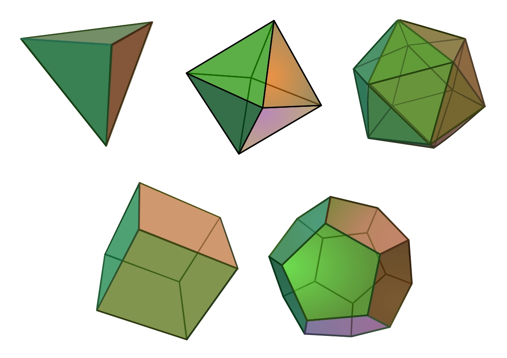

# Nomina nuda tenemus: открываем ли мы математические законы или просто придумываем их?


> Diva Philippica, vox ubi coelica nunc Ciceronis?
> Pax ubi civibus atque rebellibus ira Catonis?
> Nunc ubi Regulus aut ubi Romulus aut ubi Remus?
> Stat Roma pristina nomine, nomina nuda tenemus.
>
> Божество филиппик, где ныне небесный голос Цицерона?
> Мир где для граждан, а для мятежников где гнев Катона?
> Где же Регул, где Ромул, где Рем?
> От Рима осталось лишь имя. Имена, что мы держим — пустые.

Отсылкой к последней строке этого стихотворения Бернарда Клюнийского заканчивается "Имя розы" - знаменитый роман итальянского писателя-постмодерниста, философа и медиевиста Умберто Эко. В этом произведении одной из сюжетных линий идёт спор монахов-схоластов об истинности реализма и номинализма или, иначе говоря, о реальности абстрактных идей и математических структур. Именно об этом философском споре, растянувшемся на тысячелетия, я и хотел бы поговорить в своём сегодняшнем эссе. Последние слова великолепного стихотворения дали название не только роману Умберто Эко, но и этому посту. Nomina nuda tenemus - "имена, что мы держим, пустые".

## Пифагор

Спор, о котором пойдёт речь в этом посте, берёт своё начало в учении прославленного древнегреческого философа Платона - ученика Сократа и учителя Аристотеля, автора "Диалогов" и основателя знаменитой афинской Академии, над входом в которую им были начертаны слова "Не геометр да не войдёт". Эти слова - символ того, насколько высоко ценились Платоном познания в математике. Всё его учение было основано на математических истинах и в идейном плане наследовало учению жившего задолго до него древнегреческого философа и математика Пифагора.

Влияние Пифагора на философию и математику неоценимо - именно он ввел в древнегреческую речь сами слова "философия" и "математика". Пифагор называл себя философом - "мудролюбом", а слушателей лекций в основанной им школе "математиками" - "изучающими". Его пифагорейская школа не была школой в современном понимании этого слова, а являлась скорее религиозной сектой, где изучение математики сочеталось с жизнью по особой этической системе. В ходе математических изысканий в этой школе была доказана знаменитая теорема о равенстве квадрата гипотенузы прямоугольного треугольника сумме квадратов её катетов, названная в честь Пифагора.

Основная идея философского пифагорейского учения выражалась в его высказывании "Всё есть число". В процессе изучения физики звука и создания первой в истории музыкальной теории Пифагор заметил, что высота звуков зависит от длины струны, и сделал вывод, что в основе музыки лежит математика. Анализируя другие сферы человеческого знания философ обнаружил, что математические идеи лежат в основе вообще всех законов природы. Так Пифагор пришёл к идее о том, что математика - это корень, из которого произрастает весь материальный мир.

## Платон

Платон углубляет и расширяет учение Пифагора о фундаментальности математики. Все математические выражения и соотношения он сводит к понятию "эйдос" - идея. По Платону, идеи - это вечные и ни от чего не зависимые истины. Так, например, равенство 2+2=4 было истинным в самые ранние времена Вселенной и будет верным в её последние часы в любой её точке. Верность этого равенства абсолютна и не зависит ни от чего в материальном мире.

Это утверждение Платон любил подтверждать примером правильных многогранников, которые в его честь позже будут названы платоновыми телами - выпуклых многогранников, собранных из правильных многоугольников, все углы которых равны. Всего таких многогранников пять: тетраэдр, гексаэдр (куб), октаэдр, додекаэдр и икосаэдр. Современник Платона афинский геометр Теэтэт доказал, что этих многогранников существует только пять и шестого существовать не может.



Платон считал, что идеи - это прообразы материальных вещей. Всякий круг, начертанный рукой, несовершенен, но лежащая в его основе идея круга совершенна - безупречна, вечна и одинакова везде, или как говорят сейчас, идеальна. Мы в своей жизни встречаем тысячи деревьев разных видов, каждое из которых уникально, но в каждом из них воплощена некая универсальная идея дерева. Согласно Платону, встретив в своей жизни несколько кошек наш ум учится видеть изначальную универсальную идею "кошкости", воплощённую в каждой из них.

Для объяснения своей теории идей Платон использовал аллегорию, позже ставшую известной как миф о пещере. Согласно этой аллегории, материальные предметы - это лишь тень, отбрасываемая идеями на стену пещеры нашего мира. Своей бренной физической природой мы, аки пленники, прикованы цепями к одной из стен этой пещеры и можем разглядывать лишь тени на противоположной стене. Узреть сами идеи мы можем только с помощью разума, но не глазами.


Согласно легенде, однажды за ужином в разговоре с Платоном другой известный древнегреческий философ Диоген воскликнул: "Стол и чашу я вижу, а стольности и чашности не вижу", на что Платон резко парировал: "Чтобы видеть стол и чашу, нужны глаза, которые у тебя есть, а чтобы видеть стольность и чашность, нужен разум, которого у тебя нет".

Платоновское понятие идеи гораздо шире, чем просто математика - оно включало в себя и такие абстрактные понятия как любовь, благо, честь. Такой же бесплотной идеей философ считал и человеческую душу, которая после смерти освобождается от оков материального тела и возвращается к изначальному свету. А всю совокупность идей - идею всех идей - мыслитель считал множеством мыслей Бога.

Божественный свет изливается на мир идей, которые отбрасывают тень в виде материальных предметов. Целью человеческого существования Платон видел выход из пещеры и возможность взглянуть на этот изначальный свет во всей его красе. Спустя несколько веков после смерти философа его последователи неоплатоники положили эти его мысли в основу христианского богословия...

Резюмируя, Платон создал философию идеализма, согласно которой идеи предстоят материи. То есть идеи, по Платону, более реальны, чем материя. Поэтому средневековые схоласты называли эту философию реализм.

## Аристотель

Известнейшим из учеников Платона стал постоянно споривший со своим учителем Аристотель. За такое поведение судьба наградила Аристотеля столь же строптивым воспитанником. Македонский царь Филипп II, известный тем, что гневное выступление против него оратора Демосфена получило название "филиппика" - philippica в вышеупомянутом мною стихотворении это как раз оно, пригласил философа стать воспитателем его сына Александра - будущего великого царя Азии. Аристотель после платоновской Академии основал в Афинах другую школу - Лицей.

Несогласие с учителем выражалось во взгляде философа на взаимоотношение идей и материи. Согласно Платону материальные вещи - это тень идей. Согласно же Аристотелю материя существует сама по себе, а идеи - это формы или, можно сказать, лекала, по которым из уже существующей материи "куются" предметы. Человек в этой картине мира служит мостом между миром идеальным и миром материальным - с помощью разума человек имеет доступ к миру форм и может воплощать эти формы в материи.

Материя в философии Аристотеля - это пассивное начало, обладающее потенциалом стать чем-то. Идеи же - это активное начало, обладающее возможностью сделать материю чем-то в ходе акта творения - оно придаёт материи определённость, структуру, цель. Философ считал, что одно из начал не может существовать без другого. Идея не может существовать отдельно от вещи. Материя нужна идее, чтобы воплотиться в мире, а идея нужна материи в качестве формы, без которой она не может проявиться.

Таким образом, согласно Аристотелю идеи и материя равным образом реальны. Формы воплощаются в материи, а материя проявляется в формах. Поэтому средневековые схоласты называли эту философию умеренный реализм.

## Уильям Оккам

Английский монах и философ Уильям из Оккама имел свой взгляд на проблему соотношения идей и материй. В своей философии Оккам рассматривал универсалии - те самые платонические идеи "чашности" и "кошкости", выражающиеся во всех чашках и кошках мира.

Согласно Оккаму, универсалии - это лишь имена (nomina), которые мы даём группам схожих предметов. Мы видим одну кошку, потом другую, потом третью, видим их схожесть и абстрагируем некую общую идею - универсальную абстрактную "кошкость". Но эта "кошкость" - лишь имя, выведенное для нашего удобства понятие, продукт нашего языка, а не нечто реально существующее. Существуют только отдельные конкретные кошки, а платоновской вечной идеальной кошки - нет. Nomina nuda tenemus - имена, что мы держим, пустые.

Уильям Оккам вывел философский принцип, согласно которому не стоит вводить в свою картину мира лишние, не обладающие собственной реальностью, сущности. В его честь этот принцип назвали бритвой Оккама:

> Не следует множить сущее без необходимости

Философию Уильяма Оккамского средневековые схоласты называли номинализм - от латинского слова nomen - "имя". Согласно этому учению материя обладает реальностью, а идеи нет.

## Фома Аквинский

Величайшим философом в истории средневековой схоластики считается Фома Аквинский. Этот мыслитель в споре с номиналистами и реалистами синтезировал все три философии - реализм, умеренный реализм и номинализм.

Согласно Фоме, идеи существуют в трёх разных видах:

- Ante rem - до вещей — в уме Бога как идеи
- In rebus - в вещах — как воплощённые в них формы
- Post rem - после вещей — в уме человека, как извлечённые из множества вещей абстракции

Таким образом, если взять какую-либо математическую идею, например, идею логарифмической спирали, то она существует в трёх проявлениях. Во-первых, как вечная, всегда верная истина в платоническом мире идей. Во-вторых, как воплощённая в реальных моллюсках или галактиках форма. В-третьих, как идея в уме людей, абстрагированная из наблюдения за моллюсками и галактиками. Согласно Аквинату, это три проявления божественной Троицы.

За такой глубокий взгляд на проблему взаимоотношения идей и материи Католическая Церковь канонизировала Фому Аквинского и причислила его к лику святых.

## Нагарджуна

Проблему взаимоотношения идей и материи рассматривали и философы Востока. В древнееврейской философии это было учение "ор и кли" - света и сосуда. А в античном Китае существовала философская школа имён Минцзя - "школа имён", занимавшаяся изучением проблематики соответствия имён и обозначаемых ими предметов. Согласно учению этой школы, несоответствие названий сущности вещей ведёт к хаосу и упадку. Анализируя строчку "stat Roma pristina nomine" из заглавного стиха с точки зрения школы имён, можно сказать, что сначала от Рима остаётся лишь имя, а после начинается хаос и упадок, который приводит к разрушению империи, а не наоборот.

Больше всего проблему соотношения идей и материи рассматривали в древнеиндийской философии. Мир идей, духовное начало мира, индийцы называли Пуруша, а материальное начало мира - Пракрити. Некоторые школы мысли были ближе к реализму идей Платона, некоторые к умеренному реализму Аристотеля, некоторые к номинализму, но одна из школ мысли, буддийская, давала совершенно поразительный ответ.

Согласно буддийской философской мысли, главным выразителем которой стал древнеиндийский мыслитель Нагарджуна, номинализм недостаточно радикален. И Нагарджуна, и номиналисты отрицают реальное существование универсалий - и тот, и другие считают, что понятия — это не реальные сущности, а лишь обозначения. Но Нагарджуна идёт дальше - он отрицает реальность не только универсальных идей, но и реальность индивидуальных вещей, ведь любая индивидуальная материальная вещь - это такая же иллюзорная сущность, как и нематериальная идея, в самой основе которых лежит пустота.

Чтобы объяснить эту мысль, процитирую сам себя:

> Когда мы смотрим на другого человека, мы воспринимаем его образ целостно. А если мы попытаемся проанализировать этот образ и разложить его на части, то тут же обнаружим, что встали на дорожку ведущую в пустоту. Ведь человек - это образ совокупности процессов взаимодействия его органов, каждый орган - это образ совокупности процессов взаимодействия разных тканей, каждая ткань - это образ совокупности процессов взаимодействия биологических клеток, каждая клетка - это образ совокупности процессов взаимодействия молекул химических веществ, каждая молекула - это образ совокупности процессов взаимодействия атомов, каждый атом - это образ совокупности процессов взаимодействия элементарных частиц, каждая частица - это проявление в мире фактов волны в физических полях, а само физическое поле бесплотно - это по сути ничто, пустота, вакуум. Но что же это получается?
>
> Абсолютная пустота осознает себя и гордо заявляет "Я мыслю, следовательно, я существую". После она смотрит рядом туда же в пустоту и заявляет "Ecce homo" - се человек. Человек смотрит на человека или пустота смотрит на пустоту?

Согласно такому подходу, любая индивидуальная материальная вещь - это такая же идея у нас в уме, как и универсалии. Нет не только кошкости, но и отдельных кошек. Есть лишь взаимозависимое возникновение вещей, а если мы попытаемся проникнуть умом в самую их суть, то найдём там лишь пустоту. Имена, что мы держим, и правда пустые. Nomina nuda tenemus.

Это учение было выражено в центральном произведении всего буддизма Махаяны, основоположником которого стал Нагарджуна, - сутре Сердца:

> Форма есть пустота, пустота и есть форма.
> Нет формы помимо пустоты, нет пустоты помимо формы.

С точки зрения Нагарджуны и других буддистов, идея круга или идея "кошкости" - это попытка обхватить бесформенное формой. Когда мы говорим "идея круга", мы полагаем, что существует нечто, что есть само по себе круг. Но откуда эта уверенность? Круг появляется лишь тогда, когда есть зрячий глаз, линия, и различение вне и внутри. Всё это - взаимозависимо. Где мы можем найти круг сам по себе? Немецкий философ Кант пытался найти "вещи в себе" и не смог. Когда мы говорим "идея круга", мы уже попали в ловушку языка. Даже само своё учение о пустотности всех вещей Нагарджуна считал лишь концепцией, столь же иллюзорной как и всё остальное. Он говорил, что "пустота сама пуста".

Выражая кратко суть учения Нагарджуны можно сказать:

> Вода не нуждается в берегах, чтобы течь. Берега — это то, что создаёт ум.

Кошка не нуждается в кошкости, чтобы быть кошкой.

Но как же тогда быть с тем, что 2+2 всегда равно 4, и что шестого правильного многогранника не существует? Это ведь и правда абсолютные идеи. С точки зрения Награджуны, единственным абсолютом в данном случае можно назвать только саму логику - закон причинно-следственных связей. И если мы строим одну и ту же формальную математическую систему в разных местах и временах с одними и теми же начальными условиями, то из них согласно логике всегда будут следовать одни и те же выводы. Это не делает это равенство онтологически реальным.

Да, в трёхмерном евклидовом пространстве, с заданной геометрией и определением правильности (одинаковые грани, углы и симметрия), строго математически возможно лишь 5 платонических тел. Но это - лишь следствие ограничений самой системы, а не существование этих фигур как "вечных идей". В других неевклидовых геометриях правильных многогранников может быть больше или меньше.

Тут Платон мог бы возразить Награджуне, что пусть даже некоторые математические утверждения зависят от выбранной аксиоматики, но ведь тогда все возможные аксиоматики образуют одну общую огромную метасистему математики - тот самый мир идей. И тут на помощь в споре к древнеиндийскому философу приходит монтировка самый блестящий математик XX века - Курт Гёдель.

## Курт Гёдель

В начале XX века математики мечтали о построении единой и непротиворечивой системы математики - именно такую задачу перед учеными всего мира поставил немецкий математик Давид Гильберт. Целями программы Гильберта были:

Формулировка всех математических утверждений на точном формальном языке и работа с ними в соответствии с четко определёнными правилами

- Доказательство того, что все истинные математические утверждения могут быть формально доказаны
- Доказательство того, что в формализме математики не может быть получено никакого противоречия
- Доказательство того, что любой результат о «реальных объектах», полученный с использованием рассуждений об «идеальных объектах» (таких, как бесчисленные множества), может быть доказан без использования идеальных объектов
- Алгоритмическая разрешимость - нахождение алгоритма для определения истинности или ложности любого математического утверждения

Похожую задачу ставил перед собой английский философ, писатель и математик Бертран Рассел, автор "Истории западной философии" и "Principia Mathematica", знаменитый благодаря своему чайнику. Рассел хотел свести всю математику к чистой логике — системе простых самоочевидных аксиом и законов вывода. На это стремление по его собственным словам сильно повлияли идеи Пифагора - в своей автобиографии Рассел писал:

> С не меньшей страстью я стремился к знанию. Я жаждал проникнуть в человеческое сердце. Жаждал узнать, почему светят звезды. Стремился разгадать загадку пифагорейства - понять власть числа над изменяющейся природой. И кое-что, правда совсем немного, мне удалось понять.

Соавтор его математических трудов, математик и философ Альфред Норт Уайтхед, говорил, что вся западная философия - это "заметки на полях Платона". Они вместе собирались найти те самые основания математики - ядро платоновского мира идей. Их мечты разбил в пух и прах молодой немецкий математик Курт Гёдель, который по иронии судьбы тоже обожал Платона и даже называл себя платонистом.

Своими теоремами о неполноте Гёдель доказал, что найти эти самые общие основания математики, невозможно. Той самой математической метасистемы, которой Платон пытался посрамить Нагарджуну несколькими абзацами выше, попросту не существует. В любой достаточно мощной формальной системе арифметики существуют утверждения, которые в ней нельзя ни доказать, ни опровергнуть. А значит, не существует завершённого формального описания истины даже для таких, казалось бы, вечных объектов, как числа.

Никакая формальная система не может быть одновременно и полной, и непротиворечивой. Всегда останется нечто вне её самой - истина, которую она не может охватить своими средствами. Если система идей замкнута и полна, она должна быть либо противоречива, либо недостижима. Даже если божественная идея идей, математическая метасистема, существует, полностью доступной нам для познания она быть не может.

Даже если бы идея "2+2=4" существовала в мире форм, её полное постижение или доказательство зависело бы от системы аксиом — и таких аксиом всегда будет недостаточно, чтобы охватить всю полноту истины. Это означает, что мир идей не замкнут, не стабилен и не доступен в полной мере через разум, как это думал Платон. Если система идей замкнута и полна, она должна быть либо противоречива, либо недостижима. Следовательно, метасистема математики не может быть полностью выражена в словах или логике.

Русский буддолог Евгений Торчинов пишет в своей книге "Религии мира" о философии Нагарджуны:

> Язык в принципе не может адекватно описать реальность, ибо все языковые формы неадекватны реальности. Неадекватно ей и философское мышление, оперирующее понятиями и категориями. Логическое мышление не в силах постичь реальность как она есть, а язык — описать её. Следовательно, никакая онтология, никакая «наука о бытии» невозможна, ибо она всегда будет связана не с реальностью, а с нашими представлениями о ней или даже с некоей псевдореальностью, сконструированной нашими мыслительными навыками и ложными представлениями. Всё реальное — неописываемо, всё описываемое — нереально.

Позже работы математиков Алана Тьюринга и Алонзо Чёрча разбили последние надежды на осуществление программы Гильберта - они показали, что найти алгоритм для определения истинности или ложности любого математического утверждения тоже невозможно - мешает проблема остановки.

Теоремы о неполноте Гёделя очень близки к учению Нагарджуны о пустоте. Слова Нагарджуны "Пустота пуста" сходны с выражением, с помощью которого Гёдель доказывал свои теоремы о неполноте: "Это утверждение недоказуемо в этой системе". Согласно Нагарджуне, никакие вещи и идеи не могут обладать самобытиём и не имеют под собой твёрдой онтологической основы, а появляются в зависимости от условий. Согласно Гёделю, никакая система аксиом не может доказать саму себя. Нет никакого существующего в абсолютном смысле фундамента, на котором стоит мир. И всегда есть что-то вне этой системы - для Гёделя это недоказуемые и неопровержимые утверждения, для Нагарджуны - неописуемая нирвана, к достижению которой стремятся буддисты.

## Заключение

Завершить этот пост хочется призывом к читателям самим поразмышлять о том, что первично - идеи или материя, открываем ли мы математические законы, воплощённые в материальных предметах, или же математика - это лишь пустые имена, что мы даём закономерностям, и стихотворением Николая Заболоцкого:

```
А если это так, то что есть красота?
И почему её обожествляют люди?
Сосуд она, в котором пустота,
Или огонь, мерцающий в сосуде?
```
