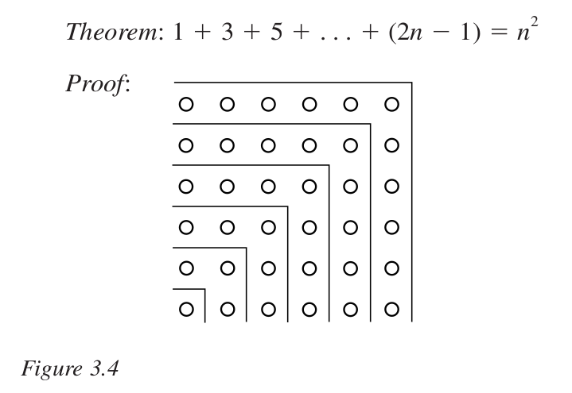

# Отсутствие оснований и аксиома Бога


В рамках этого эссе мы с вами окунёмся в самые глубокие вопросы философии математики, разберём несколько подходов к доказательству теорем и поразмышляем над тем, как счётные бесконечности и аксиома выбора в теории множеств вместе с теоремами Гёделя о неполноте и гомотопической теорией типов связаны с этикой, философией, поиском смысла жизни и теологией.

## В бесконечность и далее

Сквозь все темы данного эссе красной нитью проходит понятие математической бесконечности, поэтому для начала давайте освежим свои воспоминания о том, что же это такое.

Бесконечности обсуждались в математике ещё с античных времён. Любому человеку без всяких доказательств очевидно, что ряд натуральных чисел (1,2,3...) бесконечен, и что не существует самого большого натурального числа. Древнегреческий математик Евклид изящно доказал, что количество простых чисел также бесконечно.

Однако, основной вклад в изучение бесконечностей внёс уроженец Санкт-Петербурга, великий немецкий математик еврейского происхождения Георг Кантор. Его вклад в математику поистине велик: в ходе изучения бесконечных множеств Кантор создал теорию множеств, о которой и пойдёт основная речь в дальнейших разделах этого эссе.

Кантор разделил бесконечности на два основных типа - счётные и несчётные. Счётными бесконечностями он называл те множества, в которых каждому элементу ряда можно сопоставить натуральное число. Например, бесконечный ряд целых чисел (... -2, -1, 0, 1, 2 ...), несмотря на то, что он кажется в два раза больше ряда натуральных чисел - это тоже счётное множество. А бесконечный ряд натуральных чётных чисел (2, 4, 6...), несмотря на то, что он кажется в два раза меньше ряда натуральных чисел - тоже счётный, потому что каждому чётному числу можно сопоставить обычное (1-2, 2-4, 3-6, 4-8, 5-10 и так далее).

Такие определения бесконечности привели ко множеству споров среди математиков XIX века о состоятельности теории множеств, ведь исходя из определений Канторра получается, что и обычных, и чётных чисел в бесконечности одинаковое количество, хотя интуитивно кажется, что вторых должно быть в два раза меньше. Мнения учёных мужей разделились - все признавали бесконечность как потенциально возможный бесконечно длящийся процесс, но не все признавали актуальность бесконечности как в полном смысле существующего цельного математического объекта.

Примером же несчётного множества может служить множество всех вещественных чисел между 0 и 1 - таких чисел всегда в бесконечное количество раз больше, чем натуральных чисел. Кантор доказывал это с помощью интересного метода, в последствие названного диагональю Кантора. Предположим, что мы можем записать все вещественные числа в интервале между нулем и единицей в виде десятичных дробей, где x - это какая-то цифра:

```
1 - 0.x₁₁ x₁₂ x₁₃ x₁₄ ...
2 - 0.x₂₁ x₂₂ x₂₃ x₂₄ ...
3 - 0.x₃₁ x₃₂ x₃₃ x₃₄ ...
4 - 0.x₄₁ x₄₂ x₄₃ x₄₄ ...
...
```

Например, такими числами будут 0.12345678..., 0.56745354...., 0.2323342524... и тому подобные. Мы можем составить число из цифр взятых из каждого числа по диагонали (x₁₁ x₂₂ x₃₃ x₄₄...) и каким-либо образом изменить каждую из этих цифр - например, если x = 1, то заменить цифру на 2, а если x != 1, то заменить цифру на 1. Так у нас получится число (y₁₁ y₂₂ y₃₃ y₄₄...), которое отличается от каждого числа в исходном списке как минимум на одну цифру. И такой трюк можно проделать бесконечное количество раз. Таким образом, Кантор доказал, что множество вещественных чисел несчётно, так как его членов гораздо больше, чем натуральных чисел.

Изучение бесконечных множеств, чьи свойства совершенно контринтуитивны для человеческого ума, привело математиков к размышлениям над множеством парадоксов - например, сформулированным немецким математиком Давидом Гильбертом парадоксом об отеле, в котором все комнаты одновременно заняты, но в который всегда можно подселить ещё бесконечное количество жильцов. И как раз с именем Гильберта связана наше дальнейшее повествование.

## Три подхода к основаниям математики и природа доказательств теорем

В начале XX века Давид Гильберт, один из наиболее выдающихся математиков тех лет, объявил о своей программе поиска оснований математики. Совместно с другими светлейшими умами своего времени он решил свести всю математику к маленькому ядру, из которого выводятся все разделы математического знания и все возможные теоремы.

Основными пунктами его программы были:

- Создание минималистичного языка математики
- Доказательство полноты этого языка - все истинные математические утверждения, записанные на этом языке, могут быть доказаны
- Доказательство непротиворечивости - в этом языке математики не может быть получено никакого противоречия
- Доказательство консервативности - любой результат о "реальных объектах", полученный с использованием рассуждений об "идеальных объектах" (таких, как, например, несчётные множества), может быть доказан и без их использования
- Доказательство алгоритмической разрешимости - нахождение единого алгоритма автоматического доказательства любой теоремы, записанной на этом языке

К исполнению этой программы математики подошли с нескольких разных сторон. Сам Гильберт подошёл к ней с точки зрения формализма - философии математики, согласно которой математика это просто игра с символами по определённым правилам, или, как выражался позднее Герман Гессе, "игра в бисер", при которой главное не смысл производимых операций, а корректность формальных процедур вывода одной последовательности символов из другой. С точки зрения формализма любое математическое утверждение представляет из себя последовательность символов некоего определенного математического алфавита и правила того, как из одних высказываний на этом языке получать другие. Формализм Гильберта относится к бесконечностям как к фиктивным конструкциям и не интересуется их "реальностью". С точки зрения формализма бесконечность - это символ, с которым можно оперировать по определённым правилам.

Другого подхода придерживался знаменитый британский философ и математик, создатель гипотезы об орбитальном чайнике и автор "Истории западной философии" и "Principia Mathematica" лорд Бертран Рассел. Тот подошёл к поиску оснований математики с точки зрения логицизма - подхода по редукции всей математики к законам формальной логики. С точки зрения логицизма математика - это просто раздел логики, и все математические истины могут быть выведены из чисто логических аксиом и правил вывода. Логицизм нормально относится как к потенциальным, так и к актуальным бесконечностям - бесконечные множества и объекты допустимы, если они могут быть определены логически. Например, натуральный ряд можно определить рекурсивно, а бесконечные множества через логические кванторы ∀ и ∃. Если математика есть логика, а логика работает с общими, в том числе бесконечными, высказываниями, то бесконечность - это допустимый логический объект.

Третьим подходом стал интуиционизм, согласно философии которого, математика - это ментальная деятельность, создаваемая интуицией человеческого разума. По интуиционизму, математические объекты не существуют независимо от нашего мышления, а следовательно математика должна основываться на конструктивных, интуитивно очевидных построениях. Интуиционисты считают реальными только те математические объекты, что могут быть построены пошагово, поэтому они отвергают реальность актуальных бесконечностей. Только то, что может быть сконструировано, считается существующим. Актуальная бесконечность, согласно интуиционизму, - это фикция, не имеющая конструктивного смысла.

Любая теорема согласно разным философиям математики представляет собой:

- В формализме теорема - правильно выведенная согласно определенным правилам из аксиом последовательность символов. Работа идёт не со смыслом, а с "синтаксической" правильностью написанного.
- В логицизме теорема - это логическое высказывание, строго выводящееся из логических аксиом. Работа идёт не со смыслом, а с логическими высказываниями.
- В интуиционизме теорема - это осмысленное утверждение, для которого существует конструктивное доказательство, то есть такое, что его истинность может быть построена «в уме» или явно представлена. Работа идёт с живым смыслом.

## Индукция

В своей знаменитой книге "Критика чистого разума" немецкий философ Иммануил Кант выделял два вида познания - априори, то бишь предшествующее опыту, и апостериори, то бишь следующее за опытом. Априорное познание исходит от чистого разума - например, равенство "44\*23=1012" или теорема Пифагора не требуют взаимодействия со внешней по отношению к человеку реальностью, чтобы убедиться в их истинности. А апостериорное знание, например о том, что вода кипит при температуре 100 градусов по Цельсию, может исходить лишь из опыта взаимодействия с этой самой реальностью. В своей книге Кант критикует эти им же и введённые понятия, но давайте для удобства дальнейшего повествования примем для себя их как определения.

Ещё с античных времен философы выделяли два основных вида умозаключений - дедукцию и индукцию. Дедуктивные умозаключения идут от общего к частному: постулируется или доказывается общий для всех закон из которого следуют частные утверждения. Например, постулируется общий закон о том, что все люди смертны, и из утверждения о том, что Сократ - человек, делается частный вывод , что Сократ смертен. Индуктивные же умозаключения идут наоборот от частного к общему: из нескольких частных утверждений выводится общий закон. Например, из утверждений о том, что в моём районе три магазина, в первом магазине продаются бананы, во втором магазине продаются бананы и в третьем магазине продаются бананы, выводится общее утверждение о том, что во всех магазинах моего района продаются бананы. Для моего эссе играет важную роль именно понятие индукции, так что давайте сконцентрируемся на нём. Индукция бывает нескольких видов - априорная и апостериорная.

Апостериорная, то бишь следующая из практического опыта, индукция неполна - из того, что мы предыдущие тысячи дней нашей жизни наблюдали то, как Солнце всходило на востоке и закатывалось на западе, строго логически никак не следует, что оно взойдёт завтра. Основываясь на байесианской эпистемологии, мы можем считать такой исход наиболее вероятным, но абсолютно быть в нём уверенными мы не можем. Такая индукция иногда даёт сбои - самым известным примером такой ошибки считается открытие черных лебедей. Все лебеди, когда-либо встреченные европейцами, были белыми. Из этого делался индуктнивный вывод, что все лебеди белые. Это считалось верным, пока в конце XVII века в Австралии не были найдены лебеди черного цвета. Сама фраза "чёрный лебедь" вошла в язык как обозначение неожиданного открытия, ломающего все прошлые представления о мире.

Априорная, то бишь следующая из чистого разума, индукция полна и надёжна. Она используется в математике для доказательства общих утверждений об элементах некоего бесконечного ряда объектов. При использовании математической индукции нужно доказать, что если утверждение верно для некоего элемента ряда x(n), то оно будет также верно для следующего элемента ряда x(n+1), а также что утверждение верно для самого первого элемента ряда x(1).

На примере графических доказательств, основанных на принципе математической индукции, можно продемонстрировать то, что интуиционисты имеют в виду под интуитивным пониманием математики.



На этой иллюстрации мы видим как определенная теорема для какого либо n доказывается на основе нашего интуитивного визуального понимания того, что утверждение верно для n+1 если оно верно для любого n. Это интуитивное представление о математической индукции поможет нам в понимании аксиомы выбора в теории множеств. Кроме того, на базе математической индукции на основании чистой логики была создана арифметика Пеано, положенная Гёделем в основу его теорем о неполноте.

## Неполнота

Спустя пару десятков лет после объявления Гильбертом его программы поиска оснований математики, австрийский математик Курт Гёдель поставил на ней жирную точку. Доказанные им теоремы о неполноте однозначно утверждают о недостижимости большинства пунктов программы Гильберта.

На базе арифметики Пеано Гёдель доказал, что в любой формальной системе, то есть на любом языке символов с формальными правилами вывода одних последовательностей символов из других, обязательно найдутся утверждения, которые нельзя ни доказать, ни опровергнуть внутри этой системы, и что ни одна из таких систем не может доказать свою собственную непротиворечивость. Таким образом, любая математическая система либо полна, но противоречива, либо непротиворечива, но не полна. Формализм Гильберта сохранился как метод, но утратил заявку на статус всеобъемлющего фундамента математики.

Это же нанесло удар и по логицизму Рассела. Теоремы Гёделя показали, что даже такая логически строгая система, как арифметика, не может быть полной - то есть логика не исчерпывает всю математику. А вот по интуиционизму ударить не получилось. Гёдель доказал свои теоремы в классической логике, которую интуиционисты не принимают. Например, интуиционисты не считают закон исключения третьего незыблемым. Наоборот, интуиционисты увидели в теоремах Гёделя подтверждение своей критики классической математики и логики - работать нужно не с логическими высказываниями и выводами, и не с синтаксическим выводом одних символов из других, а с живым смыслом математических утверждений.

Интуиционистская арифметика (например, система Хейтинга) тоже подвержена ограничениям аналогичным гёделевским, но эти ограничения лучше вписываются в философию интуиционизма, которая изначально отвергала возможность полной формализации смыслов в виде символов. Логику и формальные системы можно использовать в качестве удобных инструментов, но не стоит придавать этим инструментам онтологический статус.

Философию интуиционизма хорошо выражает этот абзац из книги буддолога Евгения Торчинова "Религии мира":

> Язык в принципе не может адекватно описать реальность, ибо все языковые формы неадекватны реальности. Неадекватно ей и философское мышление, оперирующее понятиями и категориями. Логическое мышление не в силах постичь реальность как она есть, а язык — описать её. Следовательно, никакая онтология, никакая «наука о бытии» невозможна, ибо она всегда будет связана не с реальностью, а с нашими представлениями о ней или даже с некоей псевдореальностью, сконструированной нашими мыслительными навыками и ложными представлениями. Всё реальное — неописываемо, всё описываемое — нереально.

Философские следствия из теорем о неполноте оказались ещё более глубокими. Оказалось, что нет никакой единственно верной полной математической системы, а есть бесконечное количество разных неполных математических систем, каждая из которых состоит из набора математических аксиом и набора логических аксиом вывода одних математических выражений из других. То есть у математики нет никакого фундамента, нет никаких оснований. Более того в разных аксиоматиках одни и те же теоремы могут быть как истинны, так и ложны.

## Гомотопии

Большинство теорий типов в современных языках программирования и автоматических средствах доказательства теорем основаны на конструктивной интуиционистской системе, в которой отдельно задаются логические аксиомы (например, логика высказываний, логика 1-ого порядка, нечёткая логика) и математические аксиомы (например, ZFC аксиомы теории множеств). Любая теорема доказывается на основе математических аксиом по правилам заданным логическими аксиомами. Таким образом, каждая математическая аксиоматика представляет из себя отдельно выбранные аксиомы логики и отдельно выбранные аксиомы математики.

Великое объединение этих двух аксиоматик совершил гениальный русский математик Владимир Воеводский, почему-то, правда, слабо известный на своей родине. В гомотопической теории типов, созданной Воеводским, и аксиомы логики, и аксиомы математики сводятся к типам. Если в классическом подходе к основаниям математики, идущем ещё от Гильберта, логика эпистемологически первична - вначале определяется логическая система, а потом её средствами осуществляется формализация тех или иных разделов математики, то в случае гомотопической теории типов логика и математика находятся на одном уровне: одни и те же конструкции могут иметь как логическую, так и геометрическую интерпретацию.

В гомотопической теории типов задаётся общее пространство типов. Отдельные выражения, аксиомы и теоремы, представляют собой точки этого пространства, а доказательства теорем и равенства одних выражений с другими представляют собой пути в этом пространстве. Нет отдельно ни логики, ни математики, есть лишь пути в пространстве типов. Язык описания логики и математики в теории Воеводского един - не нужно больше отдельного алфавита для логики (¬ ∧ ∨ → ∀ ∃ =) и теории множеств (∈ ⊆ ∅ { } ) - достаточно единого языка типизации.

При этом путей из точки А пространства типов в точку Б может быть великое множество. Десятки разных доказательств теоремы Пифагора в гомотопической теории представляют собой десятки разных путей из точек аксиом евклидовой геометрии в точку выражения равенства квадрата гипотенузы сумме квадратов катетов.

## Аксиома выбора

Мы подходим к самой интересной части нашего повествования - аксиоме выбора в теории множеств, неразрывно связанной с понятиями актуальных и потенциальных бесконечностей и со спором об их реальности.

Аксиома выбора основана на понятии о функции выбора. Чтобы понять, что она из себя представляет, начнём с простого примера. Предположим у нас есть конечное количество непустых множеств - множество цифр {1, 2}, множество букв {a,b} и множество цветов {красный, синий}. Мы легко можем задать функцию выбора, на вход которой подается множество, а на выход она возвращает один из её элементов. Например, из цифр возвращает единицу, из букв "а", а из цветов красный.

В коде на TypeScript функция выбора будет выглядеть примерно так:

```ts
type Color = "red" | "blue";
type Digit = 1 | 2;
type Letter = "a" | "b";

const colors: Color[] = ["red", "blue"];
const digits: Digit[] = [1, 2];
const letters: Letter[] = ["a", "b"];

const choice = (set: Color[] | Letter[] | Digit[]): Color | Digit | Letter => {
  switch (set) {
    case colors:
      return "red";
    case digits:
      return 1;
    case letters:
      return "a";
    default:
      throw Error("Can't reach");
  }
};
console.log(choice(digits));
```

В этом коде нет смысла, но он показывает что такое функция выбора в теории множеств для конечного количества непустых множеств.

Аксиома же выбора утверждает, что существует единая функция выбора для бесконечного количества непустых множеств. Это утверждение интуитивно кажется абсолютно разумным, индуктивно исходящим с помощью из функции выбора из конечного количества множеств.

Говоря языком TypeScript:

```ts
const choice = <T>(set: T[]): T => set[0];
```

Но нужно понимать, что эта TypeScript-аналогия не полностью раскрывает математическую суть аксиомы выбора. Более правильной аналогией было бы написание switch с бесконечным количеством case, чего я по очевидным причинам сделать не могу.

На языке теории множеств, аксиома выбора звучит так. Для любого семейства непустых множеств существует функция, которая выбирает из каждого множества по одному элементу. Однако эта аксиома не предъявляет конкретной функции выбора для любого семейства множеств - она лишь утверждает её существование. Более того, в некоторых случаях, например, когда множества бесконечны и несчётны, мы не можем конструктивно задать такую функцию вообще.

Добавив аксиому выбора (C - choice) к аксиомам теории множеств Цермело-Френкеля (ZF - Zermelo-Frenkel) математики получили аксиоматику ZFC, которая позволила доказать множество теорем, что было ранее невозможно при использовании только аксиом ZF.

Аксиома выбора породила множество споров о правомерности её использования. Например, Бертран Рассел писал: "Сначала она кажется очевидной; но чем больше вдумываешься, тем более странными кажутся выводы из этой аксиомы; под конец же вообще перестаешь понимать, что же она означает". И правда, аксиома выбора постулирует существование функции, не предъявляя её.

С точки зрения тех же интуиционистов, исповедующих конструктивистский подход к математике, эта аксиома представляет из себя абсурд. В конструктивной математике аксиома выбора отвергается, так как она утверждает существование функции без конструктивного способа её предъявления. Кроме того, введение в теорию множеств аксиомы выбора приводит к множеству странных парадоксов, согласно одному из которых геометрический шар можно разбить на осколки и собрать из них два таких же шара.

Своим постулированием существования функции выбора без возможности предъявления конкретной реализации этой функции аксиома выбора подобна постулированию существования Бога без возможности предъявления конкретных доказательств его существования. И то, и другое - это предмет выбора системы аксиом. В теологии считается, что Бог - трансцендентен, то есть выходит за пределы конечного языка и разума, точно так же как функция выбора из бесконечного количества семейств непустых множеств выходит за пределы возможностей языка математики. И как аксиома выбора позволяет доказать некоторые, невозможные без её добавления теоремы теории множеств, так и добавление аксиомы существования Бога имеет свои полезные для жизни человека последствия.

Другим примером такого постулируемого, но не предъявляемого служит феномен сознания. Мы уверены в существовании собственного сознания, но не можем редуцировать его к математике и не можем доказать другим людям, что мы не философский зомби. Красный цвет не описуем в терминах математики, но мы всё же постулируем его существование.

## Неполнота этики и философии

В своём "Трактате о человеческой природе" шотландский философ Дэвид Юм сформулировал принцип, известный как гильотина Юма. Этот принцип гласит, что переход от описательных суждений со связкой «есть» к предписательным суждениям со связкой «должен» - логическая ошибка.

Юм пишет:

> Я заметил, что в каждой этической теории, с которой мне до сих пор приходилось встречаться, автор в течение некоторого времени рассуждает обычным образом, устанавливает существование Бога или излагает свои наблюдения относительно дел человеческих; и вдруг я, к своему удивлению, нахожу, что вместо обычной связки, употребляемой в предложениях, а именно «есть» или «не есть», не встречаю ни одного предложения, в котором не было бы в качестве связки «должно» или «не должно». Подмена эта происходит незаметно, но тем не менее она в высшей степени важна. Раз это «должно» или «не должно» выражает некоторое новое отношение или утверждение, последнее необходимо следует принять во внимание и объяснить, и в то же время должно быть указано основание того, что кажется совсем непонятным, а именно того, каким образом это новое отношение может быть дедукцией из других, совершенно отличных от него.

То есть Юм утверждает, что из того "как оно есть" нельзя вывести "то, как оно должно быть". Никакие этические теории не могут быть выведены из описания физических или биологических законов нашего мира. Грубо говоря, права человека никак не выводимы из уравнений Эйнштейна.

Гильотина Юма как бы разрезает мир на две части - научную и этическую. Наука занимается только и исключительно фальсифицируемыми суждениями - она описывает мир, но ничего не говорит о том, как следует жить. Этика же говорят о том, как следует жить, но не могут подкрепить свои суждения никакими доказательствами.

Уже не в первый раз процитирую пост Алексея Елпырёва о гильотине Юма:

> Проиллюстрирую "гильотину Юма" небольшим примером. Допустим, у нас есть следующие позитивные утверждения:
>
> 1. Вася стоит около железнодорожных путей.
> 2. К Васе стремительно приближается поезд.
>
> Можно ли вывести только из этих утверждений хотя бы одно нормативное? Нельзя. Логически корректно вывести нормативное утверждение можно лишь из нормативного же утверждения либо из системы утверждений, как минимум одно из которых является нормативным.
>
> Добавляем в исходную систему следующее нормативное утверждение:
>
> - Вася должен действовать так, чтобы выжить.
>   Отсюда получаем такое нормативное утверждение:
> - Вася должен отойти подальше от путей.
>   А теперь добавим к исходным позитивным утверждениям другое нормативное:
> - Вася должен умереть.
>   Отсюда выводится следующее:
> - Вася должен прыгнуть под поезд.
>
> Как видите, сами по себе позитивные утверждения не дают оснований для получения из них нормативных утверждений. Чтобы сделать нормативные выводы из них, надо добавить к ним хотя бы одно нормативное же утверждение. При этом выводы меняются в зависимости от того, какое нормативное утверждение мы добавляем.
>
> Теперь некоторые практические выводы:
>
> 1. Понятия "истина"/"ложь" применимы лишь к позитивным суждениям!
>    К нормативным суждениям, в том числе и по морально-этическим вопросам, данные понятия неприменимы. В принципе неприменимы. Поэтому в спорах о том, что такое хорошо и что такое плохо, невозможно быть правым или ошибаться.
> 2. Наука занимается только и исключительно позитивными суждениями. Она описывает мир, но ничего не говорит о том, как следует делать. Утверждение "из данной научной теории следует, что надо поступать так-то" либо свидетельствует о некорректности логических выводов автора, либо включает в себя неявно выраженные нормативные утверждения в предпосылках.
>    Нормативных утверждений в науке быть не может. А значит, и нормативных выводов из научных теорий - тоже. Поэтому наука может изучать, как возникла мораль и какие функции она выполняет, но не может говорить, какой она должна быть. "Научно обоснованная мораль" - псевдонаучная чушь.
> 3. Рациональность поведения касается лишь позитивных суждений, влияющих на нормативные выводы, но никоим образом не регламентирует нормативные суждения в предпосылках. Например, рационально пристегиваться в машине ремнем безопасности, и иррационально - вешать талисман или иконку, если целью является снижение вероятности аварий и ущерба для здоровья от них. Но является ли сама цель "стремиться выжить и сохранить здоровье" рациональной или иррациональной - сказать нельзя.

Таким образом, этика - это не что-то незыблемое, а просто принятая нами на веру или навязанная нам извне система аксиом. И таких систем аксиом существует бесконечное количество. У одних - это десять заповедей Моисея, у других декларация прав человека, у третьих что-то другое. Один и тот же поступок в одной системе аксиом может считаться дурным, а в другой благородным. Кроме того, согласно теореме о неполноте Гёделя, ни одна из таких систем этики не может быть одновременно полной и непротиворечивой. Либо в выбранной этической системе будет возможен вывод противоречивого, с одной стороны истинного, с другой ложного, утверждения о моральности какого-либо поступка, либо же всегда будут ситуации, которые эта система этики не покрывает.

В своей книге "Критика практического разума" уже упомянутый мною Иммануил Кант пишет, что с точки зрения научного разума, изучающего "как оно есть", существование Бога не доказуемо. Его существование нельзя доказать ни априори, ни вывести из опыта апостериори. Бог - это трансцендентная вещь в себе за пределами знания. С точки же зрения практического разума, стремящегося понять "как оно должно быть", Бог - это необходимая часть этической системы. Бог по Канту не доказуем, но необходим. Ведь при попытках построить этическую систему без Бога, выбранная нами этическая аксиоматика не имеет основания и представляет из себя замок, построенный на песке.

Например, если мы декларируем, что у человека есть право на жизнь, то в "атеистической" системе этических ценностей мы принимаем это за аксиому, а в "теологической" системе это теорема, которая выводится из аксиомы о том, что мы созданы "по образу и подобию" Бога. И те, и другие аксиомы - это предмет чистой веры, то есть принятия без доказательств. И если просто взять право человека на жизнь за аксиому, то встаёт вопрос о том, почему именно мы положили в основу общества именно эти аксиомы, а не какие-то другие. Грубо говоря, отсутствие пыток, рабства и геноцидов в аксиоматике без Бога ничем не подкреплено, и принять на веру следует гораздо больше разных утверждений, чем в случае с наличием аксиомы о существовании Бога.

Согласно Канту, нравственный закон, выраженный в его знаменитом категорическом императиве, требует, чтобы человек поступал морально, независимо от последствий. Однако, человек естественно стремится к счастью, а нравственно правильные поступки не всегда приводят к благим последствиям. Добрые люди часто страдают, а порочные нередко преуспевают. Следовательно, мир не гарантирует справедливого распределения счастья в соответствии с добродетелью. Это приводит Канта к идее "высшего блага" - "summum bonum" - мире, в котором добродетель и счастье совпадают, что возможно только при посмертном вознаграждении добродетельных и наказании порочных. Это опять же возможно только при наличии в модели мира Бога-судьи, служащего гарантом морального устройства мира и торжества справедливости.

Таким образом, согласно Канту, Бог - это необходимая по практическим соображениям моральная аксиома, обеспечивающая смысл этической жизни, и даже если его нет в физическом смысле, его нужно создать в качестве образа по образу и подобию Христа. Он нужен, чтобы нравственная жизнь была логически завершённой и внутренне оправданной. Без него человек может быть хорошим, но вера в мораль как в рациональную систему рушится. По Канту атеист живёт в несправедливом мире и вынужден принимать целое множество ничем не подкрепленных этических аксиом, а верующий человек живёт в справедливом мире, вся этическая система которого сводится к единой точке - Богу. И в каком мире жить - личный выбор человека.

Бог для Канта не предмет знания, а направляющая идея. Это не религиозная вера в догматическом смысле, а рациональная вера, основанная на необходимости морального смысла. Она помогает разуму мыслить системно, искать целостность, но не указывает на реальный объект - это роднит философию Канта с аксиомой выбора в теории множеств. А согласно христианской доктрине учение Канта конечно же лютая ересь.

## В поисках смысла

В ходе одной из средневековых дискуссий внутри христианской церкви Григорий Палама спорил с Варлаамом Калабрийским по поводу возможности спасения души с помощью рациональности. Варлаам доказывал, что есть такой алгоритм действий, следование которому обязательно приведёт к спасению души, а Григорий Палама утверждал, что такого алгоритма быть не может, и каждая судьба уникальна. Позиция Варлаама легла в основу учения Католической церкви, а позиции Паламы в основу учения Православной.

Как вы помните, одним из пунктов программы Гильберта было нахождение единого алгоритма доказательства любой теоремы, записанной на языке математики. В середине XX века британец Алан Тьюринг и американец Алонзо Чёрч доказали, что такого алгоритма быть не может - мешает проблема остановки и другие проблемы теории алгоритмическая вычислимости. Точно также, и спасение души, или, говоря о более близких современному человеку вещах, поиск смысла жизни в этой огромной и сложной Вселенной невозможно свести к следованию простому алгоритму, состоящему из последовательного набора шагов. У каждого человека свой собственный путь, своя собственная истина и своя собственная жизнь.

В философии, как и в математике, и в этике, тоже нет надёжных оснований. Каждое философское учение, будь то объективный идеализм, субъективный идеализм, солипсизм, материализм или что угодно другое, исходят из своих не доказуемых предпосылок. Любая философская система исходит из своих отправных точек и описывает лишь отдельный аспект многогранной реальности.

Поэтому все вечные основные вопросы философии - это не предмет знания, а предмет чистой веры. Что первично - идеи или материя? Существует свобода воли, или мир детерминирован, и наша судьба уже записана в вечности? Реально ли сознание или нет? Какая из интерпретаций квантовой механики верна? Ответы на эти вопросы зависят от нашей системы верований. Выбранные аксиомы этики и аксиомы философии - это и есть наша вера, выбранное нами для поклонения божество. Принимая разные аксиомы приходишь к верности разных ответов на главные вопросы.

Осознавая отсутствие у чего бы то ни было оснований, у человека остаётся два выхода: принять аксиому Богу или постичь дзен и спокойно существовать в мире без оснований. Как писал в своей книге "Путь дзен" британский философ Алан Уотс:

> Бесцельная, пустая жизнь не означает чего-то угнетающего. Напротив, она означает свободу бесцельно блуждающих облаков и горных ручьев, цветов в недоступных ущельях, красоту которых все равно никто не увидит, и морского прибоя, вечно омывающего песок.
