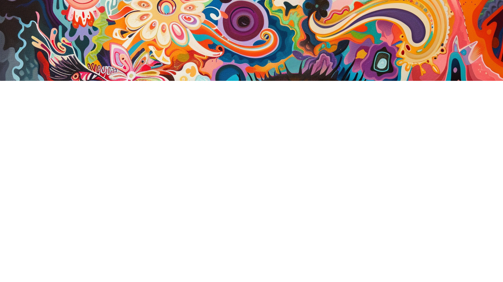

# Вселенная рендерится на глазах у смотрящего на неё солипсиста

> — Тут одна с солипсизмом на третьей стадии, — сказал как бы низкий и рокочущий голос. — Что за это полагается?
> — Солипсизм? — переспросил другой голос, как бы высокий и тонкий. — За солипсизм ничего хорошего. Вечное заключение в прозе социалистического реализма. В качестве действующего лица.
> _Виктор Пелевин. «Девятый сон Веры Павловны»_

Над философией солипсизма, которую я собираюсь раскрыть в данном посте, в приличном обществе обычно принято смеяться. И правда, идея о том, что вся Вселенная существует только лишь в одном конкретном сознании, и ничего другого кроме этого сознания нет, на первый взгляд кажется смехотворной. Но это только на первый взгляд. На самом деле, при серьёзном размышлении о солипсизме мы погружаемся в невероятные глубины философской мысли человечества и приходим к парадоксальным выводам о природе реальности. В рамках текущего эссе мы с вами поговорим о солипсизме, его связи с видеоиграми и виртуальной реальностью, о квантовой механике, об адвайта‑веданте и буддизме, и о многом другом.

## Сознающий ум

Наш путь к солипсизму начинается над размышлением о вопросе, который тысячелетиями занимает умы философов — вопросе о природе сознания. Этот термин часто используют неправильно и путают с самосознанием, с разумом и с интеллектом, поэтому давайте для начала разберемся с тем, что же такое это самое сознание.

Сознание — это поток субъективных впечатлений, через который мы воспринимаем мир, своего рода «внутреннее кино». Этот поток впечатлений состоит из базовых элементов, которые в современной традиции аналитической философии принято называть «квалиа», а в буддийской философской терминологии — «дхармы». Эти базовые элементы субъективного опыта включают в себя цвета, звуки, запахи, вкусы, чувства. Примерами квалиа могут служить красный цвет, звук скрипки, запах розы, вкус шоколада, ощущение шероховатости поверхности, боль и радость. Сознание — это одновременно и место, где существуют квалиа, и их совокупность.

Слово «квалиа» происходит от латинского qualitas — качество. Их назвали именно так в противопоставлению количеству. Суть в том, что качества несводимы к количественному описанию. Физику, химию, биологию и даже психологию, поведение человека, социологию и историю можно при желании свести к числам и математическим формулам, а красный цвет нельзя. Подумайте, смогли бы вы объяснить слепому с рождения человеку, что такое красный цвет? Это невозможно! Квалиа не сводятся к словесному описанию. Их никак нельзя описать числами, формулами или словами.

Вы можете поспорить и сказать, что красный цвет — это свет определенной длины волны, но это не так. Мы воспринимаем попадающий нам в глаза свет определенной частоты красным цветом в нашем сознании, но сам красный цвет не содержится в свете, как нет и его в глазе, ведь мы видим красный цвет и во сне, когда никакого света нам в глаза не попадает. Нет красного цвета и в мозге, мы можем обнаружить лишь цепочку нейронов в мозгу, чья активация коррелирует с получением нами впечатления красного цвета, но в самой этой цепочке и в её математическом описании нет ничего красного.

Эта несводимость квалиа к словесному и математическому описанию в философии сознания получила название «разрыв в объяснении». Известный немецкий философ и математик Готфрид Вильгельм Лейбниц проиллюстрировал эту проблему отличной метафорой с мельницей. Представьте на секунду, что вашу голову увечили до огромных размеров так, что в нее теперь можно войти как в мельницу. Вы входите туда и видите огромное число связанных друг с другом проводов, или, как писал сам живший задолго до изобретения электричества Лейбниц, шестеренок. Каждую из шестеренок приводит в движение предыдущая, а та в свою очередь приводит в движение последующую. При осмотре этой мельницы вы не найдете ничего такого, чем бы можно было бы объяснить квалиа.

Эта проблема непреодолимого разрыва между духом и материей мучала мыслителей долгие века. Дополнительной сложности придавала постоянная путаница в терминах и формулировках. Философы, психологи, физики и нейрофизиологи, говоря о сознании и проблемах сознания имели в виду разные вещи. Конец путанице положил австралийский философ Дэвид Чалмерс, разделивший проблемы сознания на лёгкие и трудные. Лёгкие проблемы сознания — это вопросы о том, как физические процессы в мозге коррелируют с квалиа в сознании, а трудная проблема сознания — это вопрос о том, почему эти процессы сопровождаются субъективным опытом вообще. Почему существует ощущение того, каково это быть? Почему мозг не просто функционирует как сложный биологический автомат, обрабатывающий информацию, а порождает то самое «внутреннее кино».

Более подробно вопросы философии сознания и связанные с ним мысленные эксперименты я рассматриваю в своём эссе «Cознание — величайшая загадка Вселенной». А пока что давайте разберёмся с тем, в чём состоит роль сознания в квантовой механике.

В квантовой механике сознание служит границей между двумя мирами, которую ещё часто называют границей Гейзенберга. По одну сторону от этой границы располагается квантовый мир вероятностей, а по другую — классический мир бинарных фактов. На вопрос о каком‑либо событии в квантовом мире мы можем говорить лишь о вероятности того, состоится оно или нет, а в классическом мире мы можем ответить на вопрос о событии бинарным да/нет, как о состоявшемся факте.

Различные мысленные эксперименты вроде «друга Вигнера» показывают, что именно наше сознание служит границей, на которой происходит коллапс волновой функции. Всем известен мысленный эксперимент Эрвина Шрёдингера со злополучным котом: гипотетический кот сажается в закрытую коробку с ампулой яда, к которой присоединён спусковой механизм, приводящийся или не приводящийся в действие в зависимости от результата некоего квантового события — например, распада атома урана. Шрёдингер утверждал, что при достаточно хорошей изоляции коробки с котом от внешнего мира, кот становится частью общей с атомом квантовой системы и попадает в состояние суперпозиции «ни жив, ни мёртв». При открытии коробки, а точнее при потере её изоляции от внешнего мира, кот обретает состояние живого или мёртвого.

Разные интерпретации квантовой механики объясняют этот эксперимент с разных философских позиций. Копенгагенская интерпретация утверждает, что пока коробка закрыта, кот и правда находится в неопределенной суперпозиции, а в момент открытия коробки происходит коллапс волновой функции. Многомировая интерпретация утверждает, что в момент открытия коробки мультивселенная разделяется на две ветви, в одной из которых кот жив, а в другой мёртв.

Физик Юджин Вигнер добавляет к эксперименту с котом ещё одну деталь — своего друга‑физика, которого Вигнер просит провести эксперимент с котом. Вигнер утверждает, что при достаточной изоляции от мира частью квантовой системы кроме атома, кота и его коробки становится также его друг и вся его лаборатория. Для друга Вигнера коллапс волновой функции коробки с котом и переход кота в определённое живое или мёртвое состояние происходит в момент открытия крышки коробки, а для самого Вигнера в момент открытия двери лаборатории его друга. Таким образом, Вигнер и его друг не могут придти к согласию по вопросу того, когда именно произошёл коллапс волновой функции — когда о нём узнал друг Вигнера или когда о нём узнал сам Вигнер. Этим мысленным экспериментом Вигнер критикует копенгагенскую интерпретацию и показывает, что коллапс волновой функции — это абстракция ума, а не объективный процесс. Но что следует из этого эксперимента, если мы говорим про сознание?

Пока декогеренция не добралась до нашего сознания, измеряемые параметры находятся в суперпозиции, при пересечении же границы превращаются в конкретные значения. При измерении прибором какого‑либо параметра в квантово‑механическом эксперименте, декогеренция постепенно распространяется от измеряемого объекта, например, атома, к сознанию: сначала частью квантовой системы становится сам прибор, потом его стрелка, после этого свет идущий от стрелки к нашему глазу, потом наш глаз и нейронные связи в нашем мозге, и в конце концов цвета и формы показаний измерительной стрелки возникают в нашем сознании. Пока результат эксперимента не проявился в нашем сознании, мы можем поставить условного «друга Вигнера» в любую точку этой цепочки.

Сам Вигнер писал:

> Все, что претендует на обеспечение квантовой механики, — это вероятностные связи между последующими впечатлениями (также называемыми «апперцепциями») сознания, и даже несмотря на то, что разделительная линия между наблюдателем, на сознание которого оказывается воздействие, и наблюдаемым физическим объектом может быть смещена в сторону то или иное в значительной степени, оно не может быть устранено.

Обычно из такой фундаментальной роли сознания в квантовой механике шизотерики делают совершенно неправильный вывод, что человек может усилием мысли повлиять на результат коллапса волновой функции или на вероятность того или иного результата квантового измерения. Я такое утверждать, конечно же, не буду. Но моя мысль не менее радикальна: из эксперимента с котом Шрёдингера и другом Вигнера следует, что коллапс волновой функции — это момент пересечения декогеренцией границы нашего сознания, он полностью субъективен для каждого человека и является не объективным событием, а скорее абстракцией нашего ума. Можно сказать, что каждый человек живёт в своей собственной субъективной вселенной, состоящей из бинарных фактов, не все из которых даже могут быть полностью согласованы с другими людьми. Как например факт о том, в какой последовательности произошли события при парадоксе одновременности в теории относительности.

Кроме того, человек вообще может быть уверен только в существовании своего собственного сознания и своей собственной субъективной Вселенной. Существует ли сознание у других людей или нет — это неразрешимый философский вопрос. Тот же Лейбниц окрестил его «проблемой других умов». Мы знаем, что у нас сознание есть, но мы никак не можем проверить или узнать, есть ли оно у других. Философы задаются вопросом о возможности существования философских зомби — существ, выглядящих и ведущих себя как человек, но чьи действия не сопровождаются тем самым «внутренним кино» субъективного опыта.

Давайте приведём аналогию с видеоигрой. Играя в игру, мы можем быть уверены, что мы играем за играбельного персонажа, но никак не можем проверить, что игра мультиплеерная, и другие персонажи в игре тоже играбельны, или же игра синглплеерная, и другие персонажи — это просто бездушные NPC. Мы можем легко обсудить с другими персонажами особенности физического движка игры и даже, возможно, с помощью размышлений «декомпилировать» код этого движка, внутриигровые законы физики, но мы понятия не имеем рендерится эта игра только для нас или же для других персонажей тоже. А если для других персонажей она тоже рендерится, то такие же у них настройки графического движка или нет — может быть они видят красные предметы цветом, которым мы видим синие?

На вопрос о том, синглплеерная наша игра или мультиплеерная, нет достоверного ответа. Персонаж видеоигры не может выпрыгнуть из неё и посмотреть на неё извне. Может быть, никакого «вне игры» и нет. Так что любой ответ на этот вопрос находится не на территории знания, а на территории веры. И существуют две разных веры: вера в мультиплеерность игры, то есть существование других сознаний и объективной реальности, и вера в синглплеерность игры — солипсизм.

## Принципиальная неопровержимость солипсизма

Прежде чем приступить к разбору солипсистской картины мира, я хочу разобраться с тем, почему именно солипсизм принципиально неопровержим и недоказуем. Всё дело в том, что у человека есть всего два способа познания мира: эмпирический — через ощущения, и рациональный — через умозаключения. При эмпирическом подходе мы познаем мир с помощью ощущений и чувств через опыты и эксперименты, а при рациональном с помощью разума через логику, дедукцию и индукцию. Но проблема в том, что разум сам по себе не даёт знаний — он только обрабатывает данные опыта. Кроме того, и наши ощущения, и наши мысли предстают перед нами в виде вспышек в нашем сознании — квалиа.

Французский философ Рене Декарт рассуждал о том, в чём он может быть уверен, если злые демоны полностью подделают все его чувства и смутят разум. Говоря современными понятиями, можно представить этих злых демонов в виде учёных, которые во время сна вытаскивают наш мозг из черепной коробки, помещают его в колбу и подключают к нему электропровода, идущие от генерирующего виртуальную реальность компьютера.

Декарт пришёл к выводу, что единственное, в чём он может быть уверен в таком случае, — так это то, что раз он мыслит, значит он существует. Этот вывод философ выразил в своей знаменитой фразе «Cogito ergo sum» — «Я мыслю, следовательно, существую». Это и есть единственная вещь, в которой может быть уверен человек, размышляя о природе сознания.

А вот в истинном существовании объективной реальности, человек быть уверен не может. Ведь результат любого опыта по изучению этой самой реальности приходит к человеку через квалиа его сознания, а следовательно могут быть либо проказой злых декартовских демонов, либо выдуманным самим человеком фактом. Вероятно, существование внешнего мира — это одно из тех самых гёделевских утверждений, которое в рамках системы нашего мышления не может быть ни доказано, ни опровергнуто.

## Вселенная рендерится на глазах у смотрящего на неё солипсиста

Давайте встанем на позиции солипсизма и посмотрим (ну точнее только я посмотрю, никаких вас тут на самом деле нет) на ту прекрасную картину, что открывается перед нашими глазами. Точнее не открывается, так как до того, как мы на неё не взглянули, её и не было.

Мир солипсиста бесконечно тянется в обоих временных направлениях — как в прошлое, так и в будущее. Если мысль про бесконечное будущее не вызывает у нас внутреннего неприятия, то мысль про бесконечное прошлое кажется совершенно контринтуитивной. Но она не столь безумна, как вам могло показаться.

Размышляя над ролью сознания в квантовой механике, американский физик Джон Уилер задался логичным вопросом: если сознание играет такую важную роль в коллапсе волновой функции, то как же тогда Вселенная развивалась согласно законам квантовой механики до появления живых сознательных существ? Один из возможных ответов на этот вопрос — это панпсихизм, согласно которому сознание есть даже у атомов и элементарных частиц. Сам же Уилер предложил вариант антропного принципа, согласно которому, порождая на определенном этапе своего существования сознательных наблюдателей, Вселенная приобретает реальность посредством их наблюдений, как бы отражаясь в их сознании.

Сознающий ум одним фактом своего появления и наблюдения производит коллапс волновой функции и тем самым вызывает к жизни один из вариантов возможных миров, зажигает в потенциальной возможности искру существования. В такой картине мира сознательный наблюдатель может возникнуть только в том мире, чья физика и эволюция могут привести к появлению сознательных наблюдателей. Получается этакая ретропричинность: история мира и формулы его основополагающих физических законов в прошлом возникают вследствие существования сознательного наблюдателя в будущем.

Если принять такую ретропричинность, то становится очевидным, как мир может быть бесконечно протяжён в прошлое. События прошлого возникают для солипсиста тогда, когда он обращает на них своё внимание. Если, например, солипсист никогда не читал истории Древнего Рима, но краем уха слышал имена Гая Юлия Цезаря и Марка Аврелия, и знает, что Рим в Италии, то задумавшись про историю этого государства и начав искать про неё информацию, в его мире «отрендерится» эта часть истории его мира, в ней будут фигурировать имена Цезаря и Аврелия, а действия будут происходить в Италии, и эта история будет согласована во всех фактах со всеми остальными знаниями солипсиста о мире. Можно представить себе генеративную нейросеть, которая непрестанно пишет приквелы и сиквелы к истории мира, бесконечно продолжая его в прошлое и будущее. Русским людям легко представить себе такое, ведь как известно, Россия — это страна с непредсказуемым прошлым.

Вы не можете знать появилась ли Вселенная, в которой вы живёте, 13 миллиардов лет назад или же в прошлый четверг, а все кости динозавров и древние галактики были специально подделаны, чтобы убедить вас в солидном возрасте этого мира. Поэтому для убеждённого солипсиста нет прошлого и будущего как таковых, а есть лишь вечное здесь и сейчас. Вы ведь даже не можете знать, таким ли вы видели красный цвет вчера, каким вы видите его сегодня, ведь ваше воспоминание о вчерашнем впечатлении отображается в виде квалиа красного цвета в вашем уме прямо сейчас.

Точно так же, как Вселенная солипсиста бесконечна в прошлое и будущее, она бесконечна в микромир и макромир. Чем глубже солипсист будет закапываться в изучение физической структуры реальности на микроуровне, тем более элементарные кирпичики реальности он будет находить: сначала это будут молекулы, потом атомы, потом элементарные частицы и кварки. И соответственно чем больше солипсист будет задумываться и изучать строение Вселенной на макроуровне, то тем более масштабные структуры он будет находить: сначала это будет планета, потом звёздные системы, потом галактики, а после нити галактик и войды. Законы физики в мире солипсиста тоже дописываются по ходу их изучения при рассмотрении всё более и более сложных сценариев, и эти новые законы всегда будут полностью согласованы со старыми: так например, теория относительности Эйнштейна расширила теорию гравитации Ньютона, сделав её лишь одним из своих крайних случаев.

Проводя аналогию с видеоиграми можно сказать, что мир солипсиста появляется в процессе процедурной генерации, а то, о чём он не думает в данный момент, не только не рендерится, но даже и не просчитывается. Поэтому солипсист на знаменитый вопрос Эйнштейна о том, существует ли Луна пока на неё никто не смотрит, уверенно ответит твёрдым «нет».

У аргентинского писателя Хорхе Луиса Борхеса есть рассказ под названием «Вавилонская библиотека», в котором описывается библиотека, состоящая из шестигранных комнат, в каждой из которых имеется по двадцать полок, на каждой из которых находятся тридцать две книги по четыреста десять страниц каждая, с сорока строками на каждой странице, с восемьюдесятью символами в каждой строке. Каждый символ — это либо одна из двадцати двух букв, либо точка, либо запятая, либо пробел. Большинство из книг в библиотеке — это полная белиберда, набор букв. Однако, несмотря на то, что таких бессмысленных книг в библиотеке большинство, также в библиотеке содержатся все созданные и несозданные человечеством тексты. По словам Борхеса библиотека содержит:

> .. подробнейшую историю будущего, автобиографии архангелов, верный каталог библиотеки, тысячи и тысячи фальшивых каталогов, доказательство фальшивости верного каталога, гностическое Евангелие Василида, комментарий к этому Евангелию, комментарий к комментарию этого Евангелия, правдивый рассказ о твоей собственной смерти, перевод каждой книги на все языки, интерполяции каждой книги во все книги, трактат, который мог бы быть написан (но не был) Бедой по мифологии саксов, пропавшие труды Тацита.

Сознание солипсиста вызывает к жизни одно из содержащихся в борхесовской библиотеке повествований. Солипсист может рассматривать своё сознание подобно тому, как это описывает Пелевин в его романе о графе Толстом под названием «t»: в виде писателя, который одновременно и пишет рассказ, и читает его, и при этом сам является этим рассказом.

Толпа солипсистов
«Но погодите!» — скажете вы. Почему сознание солипсиста призывает к жизни только лишь одно из повествований вавилонской библиотеки, только лишь один из возможных миров? Что же происходит со всеми остальными? Почему предпочтение отдается лишь одному из многих? На этот вопрос можно дать парадоксальный ответ — на самом деле, солипсистов в мире много! Каждый из нас — своего рода солипсист. Красивее всего эта идея описана в индийском философском учении адвайта‑веданта.

Согласно воззрениям адвайтистов, каждое индивидуальное сознание, или, другими словами, душа каждого человека, которую они называют словом «Атман» — это осколок великого Вселенского сознания, всемирной души, которую называют «Брахман». С точки зрения адвайты, бесконечно малый, неуловимый Атман полностью эквивалентен бесконечно большому, непредставимому Брахману, а вся реальность вокруг нас — это просто снящийся Брахману иллюзорный сон. Можно сказать, что Богу становится так скучно быть одному, что он намеренно раскалывает своё сознание на бесконечное количество осколков, переживая субъективный опыт от лица каждого из них и играет в игры сам с собой. По адвайте и Чжуан Цзы, и бабочка — это лишь единый божественный вселенский ум, притворяющийся и тем, и другим, во время своей игры с самим собой. Более подробно, философию адвайты я описывал в одном из прошлых эссе.

> Это похоже на игру в прятки, потому что интересно всегда находить новое место для того, чтобы спрятаться. Вспомни о том, что тебе не нравится играть с друзьями, которые прячутся всегда в одном и том же месте. Бог тоже любит играть в прятки, но Ему не с кем играть, кроме Самого Себя, потому что кроме Бога в мире никого больше нет. Однако для того, чтобы выйти из этого затруднения, Он притворяется, что не является Собой. Таким образом Ему удается спрятаться от Себя. Бог притворяется, что Он — это ты и я, и все люди в мире, все животные, все растения, все камни и все звезды. Когда Он играет Сам с Собой таким образом, у Него бывают необыкновенные и удивительные приключения, среди которых есть страшные и даже ужасные. Однако все они просто напоминают плохие сны, потому что когда Бог просыпается, все, что Ему снилось, исчезает.
>
> Вот и получается, что когда Бог прячется и притворяется тобой или мной, Он делает это очень ловко. Поэтому для того чтобы найти Себя, Ему может потребоваться довольно продолжительное время. Но этот долгий поиск очень интересен — именно на него Бог рассчитывал, когда начинал игру. Он не хочет найти Себя слишком быстро, ведь так играть было бы не интересно. Вот почему тебе и мне так трудно обнаружить, что на самом деле мы — это Бог в маске, играющий наши роли. Но после того, как игра закончится, все мы проснемся, перестанем притворяться и вспомним, что мы — одно Я — Бог, являющийся всем тем, что есть в мире, и живущий веки вечные.
> ...
> Ты можешь спросить, почему Бог иногда прячется в облике ужасных людей и почему Он иногда притворяется теми, кто страдает от страшных болезней и несчастий. Чтобы понять это, вспомни прежде всего о том, что Он фактически не подвергает опасности никого, кроме Себя. Вспомни также и о том, что почти во всех сказках, которые тебе нравятся, кроме хороших героев есть еще и плохие. И вся увлекательность повествования в том и состоит, чтобы узнать, как добрые герои победят злых
>
> _Алан Уотс, «Табу на знание о том, кто ты»_

Если смотреть на мир с такой точки зрения философии множественного солипсизма, которая, строго говоря, называется субъективным идеализмом, то можно представить, что бесконечное количество солипсистов постоянно вычисляют одну из веток прохождения вселенской игры и рендерят для себя только то, что видят прямо сейчас. Но чтобы сэкономить на вычислении и дважды не вычислять одно и то же в субъективных вселенных каждого игрока, божественный ум приходит к очевидной любому программисту идеи — кэшировать результаты уже сделанных вычислений в памяти. Таким кэшом в данном случае служит объективная реальность — часть общих фактов шарится между субъективными вселенными отдельных солипсистов.

Вычисление мира — дело алгоритмически непростое даже для Бога. Вероятно поэтому при увеличении скорости субъекта до скорости света, алгоритмическая сложность вычисления окружающего мира увеличивается и время, в полном согласии с теорией относительности, замедляется. Но это так, мои догадки.

Часть идей адвайта позаимствовала из буддизма, от которого у неё, правда, есть одно важное отличие. Если в адвайте реальность — это сон, который снится вселенскому сознанию Брахману, или можно сказать воспроизводится в уме Бога, то в буддизме этот сон снится самому себе. И как раз о буддизме мы сейчас и поговорим.

## Доводя абсурд до конца

Многие критикуют философию солипсизма за откровенную абсурдность этой идеи и призывают верить в существование независимой от своего сознания объективной реальности, хоть доказать её существование и невозможно. Но есть философия, которая критикует солипсизм совершенно с другой стороны, и эта философия — буддизм. Суть претензий буддизма к солипсизму заключается в ложности основной посылки солипсизма «вся Вселенная существует в моём сознании» — ведь чтобы Вселенная существовала в моём сознании, должен существовать «Я», а с этим утверждением буддизм в корне не согласен.

Давайте объясню подробнее. Философия буддизма рассматривает все окружающие нас предметы и явления как иллюзорные, не имеющие онтологического самобытия. Все предметы и явления состоят из частей и возникают взаимозависимо друг от друга. Приведу свой любимый пример, который я переписываю из эссе в эссе.

Когда мы смотрим на другого человека, мы воспринимаем его образ целостно. А если мы попытаемся проанализировать этот образ и разложить его на части, то тут же обнаружим, что встали на дорожку ведущую в пустоту. Ведь человек — это образ совокупности процессов взаимодействия его органов, каждый орган — это образ совокупности процессов взаимодействия разных тканей, каждая ткань — это образ совокупности процессов взаимодействия биологических клеток, каждая клетка — это образ совокупности процессов взаимодействия молекул химических веществ, каждая молекула — это образ совокупности процессов взаимодействия атомов, каждый атом — это образ совокупности процессов взаимодействия элементарных частиц, каждая частица — это проявление в мире фактов волны в физических полях, а само физическое поле бесплотно — это по сути ничто, пустота, вакуум. Но что же это получается? Абсолютная пустота осознает себя и гордо заявляет «Я мыслю, следовательно, я существую». После она смотрит рядом туда же в пустоту и заявляет «Ecce homo» — се человек. Человек смотрит на человека или пустота смотрит на пустоту?

Раскладывая все встречаемые нами предметы и явления на составные части подобным образом, мы приходим к пониманию их внутренней пустоты — отсутствия у них самобытия. Но что будет, если мы обратим этот всеуничтожающий «мизинец Будды» на своё собственное «Я»?

> — Это был глиняный пулемет, — сказал Чапаев. — Теперь я могу рассказать тебе, что это такое. На самом деле это никакой не пулемет. Просто много тысячелетий назад, задолго до того, как в мир пришли будда Дипанкара и будда Шакьямуни, жил будда Анагама. Он не тратил времени на объяснения, а просто указывал на вещи мизинцем своей левой руки, и сразу же после этого проявлялась их истинная природа. Когда он указывал на гору, она исчезала, когда он указывал на реку, она тоже пропадала. Это долгая история — короче, кончилось все тем, что он указал мизинцем на себя самого и после этого исчез. От него остался только этот левый мизинец, который его ученики спрятали в куске глины. Глиняный пулемет и есть этот кусок глины с мизинцем Будды. Очень давно в Индии жил человек, который попытался превратить этот кусок глины в самое страшное на земле оружие. Но как только он просверлил в глине дырку, этот мизинец указал на него самого, и он исчез. С тех пор мизинец хранился в запертом сундуке и переезжал с места на место, пока не затерялся в одном из монгольских монастырей. А сейчас, по целому ряду обстоятельств, он оказался у меня. Я приделал к нему приклад и назвал его глиняным пулеметом. И только что мы пустили его в ход.
>
> _Виктор Пелевин, «Чапаев и пустота»_

Буддисты используют для анализа собственного сознания специальный вид медитации под названием «випассана». В ходе випассаны человек анализирует свои мысли, чувства и квалиа, следит за их возникновением и угасанием в уме, размышляет над их причинами и следствиями. Заходя в этой аналитической медитации достаточно далеко, практикующий начинает замечать, что в его уме распадается на составные части его собственная личность.

Будда в своём учении пришёл к доктрине «анатман» — отсутствия у человека Атмана, души, самобытия «Я». С точки зрения буддизма никакого безусловного «Я» у человека нет. Там, где Декарт сказал «Я мыслю, следовательно, существую», Будда бы даже не смог сказать «Я мыслю, но не существую» — он сказал бы «Мысли есть, а я не существую».

Буддийское учение об иллюзорности «Я» направлено на разрушение нашего повседневного представления о том, что наша личность — это некая устойчивая точка опоры, служащая источником наших мыслей и чувств. С помощью логических построений буддийские философы доказывают, что наши мысли и наши чувства — не есть мы. И в конце концов отбросив все, что не является нами, мы видим, что не осталось больше ничего — никакого субстанционального «Я». А значит нет и смысла говорить «мои мысли», «мои чувства» — ведь нет никакого «Я», которому они могли бы принадлежать, нет.

Более того, даже наша уверенность в том, что источник наших мыслей находится внутри нас, глубоко ошибочна. Мы — не источник наших мыслей, мы — не тот, кто их порождает. Мысли просто появляются и исчезают у нас в уме. Доказать это легко. Попробуйте специально начать думать о чём‑то, и поймете, что это невозможно сделать с помощью усилия воли. Попробуйте перестать думать о чём‑то, и поймете, что это тоже невозможно сделать усилием воли. Одно из известных упражнений, демонстрирующих это — постараться не думать о белой обезьяне. То же самое и с чувствами. Попробуйте сознательно вызвать у себя чувство страха или радости — у вас не получится это сделать. Точно так же невозможно сознательно избавиться от какого‑либо чувства, когда оно овладело нами — например, мгновенно успокоиться, когда нас захватил гнев. Таким образом, мы не контролируем мысли и чувства — они просто приходят и уходят.

С точки зрения буддизма, разрыв в объяснении сознания нельзя преодолеть мышлением, потому что мышление его же и создает. И солипсизм как вера в то, что вся Вселенная существует в моём уме, несостоятелен, потому что «Я» — это иллюзия, порождённая всё тем же мышлением. Солипсизм — это привязанность к «я», к ощущению центра бытия. Но внутреннего «я» нет, как и внешнего. А если нет независимого «я», то и мир как нечто внешнее по отношению к «я» — тоже не существует сам по себе. Утверждение «существует только сознание» — столь же абсурдно, как и «существует только материя». Всё — взаимозависимо, и само различие «внутреннее‑внешнее» — условное. Всё — пустотно. Где тогда тот, кто сомневается?

Закончить это эссе я хотел бы чудесным отрывком из Пелевина на тему философии сознания:

> — Людям известно, что замыкание нейронных цепочек в коре мозга определенным образом связано с мыслями. Им известна даже локализация переживаний — какие ощущения соответствуют активности разных зон мозга. Например, возбуждение нейронов в определенной области совпадает с переживанием красного цвета. Пока все просто. «Hard problem» появляется, когда они пытаются объяснить, как электрическая активность, которую фиксируют приборы, становится субъективным чувством. Тем, что люди называют qualia — переживанием чего‑то изнутри.... Объяснить это не представляется возможным. Дело в том, что есть непреодолимая качественная пропасть между воспринимаемой нами краснотой…такой, как у арбуза, мака или помидора, — и электромагнитными колебаниями в мозгу, которые фиксирует томограф. Как, где и почему электрический разряд становится красным цветом, который мы видим? Этого не знает никто из людей. Иногда даже спорят, можно ли утверждать, что красное для одного человека — то же самое, что красное для другого. С уверенностью можно говорить лишь о том, что в схожих ситуациях люди используют одно и то же слово.... Понятна порочность человеческого подхода. Она связана с ошибкой, которая настолько фундаментальна, что объяснить ее людям не представляется возможным вообще. Люди считают, что место, где происходят переживания красного, зеленого и синего — это их мозг. Но мозг — это просто телеграфно‑шифровальный прибор. Он посылает кодированные запросы «красный, зеленый, синий» в исходную… Ну, скажем, точку, которая является источником всего восприятия вообще.
> — А где она находится?
> — Она вообще не локализована нигде. Она существует в себе самой и не опирается ни на что другое. У нее нет никакой причины. Наоборот, она — исходная причина всего остального. Мозг вовсе не создает восприятие и бытие. Мозг просто составляет shopping list — отбирает те элементы бесконечно возможного, которые должны быть пережиты в человеческой жизни. Это всего лишь грубый электромеханический фильтр, позволяющий человеку видеть сквозь узкие дырки слов. И только сквозь эти дырки. По сути, человеку разрешено воспринимать только заложенную в него программу — человеческий язык. Именно поэтому он и является человеком.
> — Так как же все‑таки электричество в мозгу становится красным цветом?
> — Представь человека, который родился и вырос… Ну, скажем, в готическом соборе. И никуда из него в жизни не выходил. В Бога он, понятно, не верит — как и все, кто долго наблюдает его слуг. И вот он сидит в соборе, смотрит на сверкающий витраж и думает — «ну понятно, наука доказала, что это религиозное величие создается особыми трюками со светом. Непонятно только, каким образом стекло, которое выплавляют из простого песка, светится. Причем в одном месте синим, а в другом — красным. Что, интересно, за процессы происходят в витраже? Почему витраж в соборе светится красным и синим?
> — Из‑за дневного света
> — Правильно. Человек никогда не выходил на улицу и не знает, что стекла делает синими и красными не какой‑то происходящий в них процесс, а солнце. И сколько бы ни было в стенах витражей, источник света за ними один. Человек, друзья мои, и есть такой витраж. Вернее, это лучи света, которые проходят сквозь него, окрашиваясь в разные цвета. Лучи способны воспринимать только себя. Они не замечают стекол. Они видят лишь цвет, который они приобрели. Понимаете? Человек — это просто сложная цветовая гамма, в которую окрасился пучок света, проходя через замысловатую комбинацию цветных стекол. Витраж не производит лучей сам. Он по своей природе мертв и темен даже тогда, когда пропускает сквозь себя самую завораживающую игру. Просто свет на время верит, что стал витражом. А человеческая наука со своими томографами пытается объяснить этому свету, как он зарождается в витраже, через который проходит.
> — Так что такое человек? Витраж или свет?
> — Вот! Это и есть баг, который вмонтирован в твое человеческое мышление. Люди всегда будут мучиться подобными вопросами.
> ...
> — Люди приходят из сознающего солнца и уходят туда?
> — Нет. Человек не приходит и не уходит. Он и есть это солнце. Это солнце прямо здесь. Кроме него, нет ничего другого вообще.
> ...
> — Человек — это комбинация переживаний, сложная цветовая гамма, выделенная из яркого белого света, где уже содержатся все возможные цвета. В ярком белом свете уже есть все, что может дать любой калейдоскоп. Калейдоскоп убирает часть спектра — но не создает света сам. Мозг — не генератор сознания и не волшебный фонарь. Совсем наоборот! Это калейдоскоп‑затемнитель. Мы не порождаем сознание в своем мозгу, мы просто отфильтровываем и заслоняем от себя большую часть тотальности. Это и делает нас людьми. Поэтому мистики начиная с Платона называют нас тенями. Мы не производим свет. Мы отбрасываем тени, что намного проще. Никто никогда не объяснит, как электрические процессы в мозгу становятся переживанием красного цвета. Потому. Что. Они. Им. Не. Становятся. Понятно? Можно только объяснить, как красное стекло окрашивает — вернее, редуцирует — исходную бесконечность до скрытого в себе кода.
> ...
> — А почему человек не может пережить все солнце сразу?
> — Во‑первых, может. Для этого достаточно разбить витраж. Во‑вторых, это не человек переживает солнце. Это солнце в каждом человеке переживает само себя — ту свою часть, которую оставляет видимой наш мозг. Себя переживает всякая отдельная мысль — каждый луч, уже не помнящий, что он часть солнца…
>
> _Виктор Пелевин, „Бэтман Аполло“_
