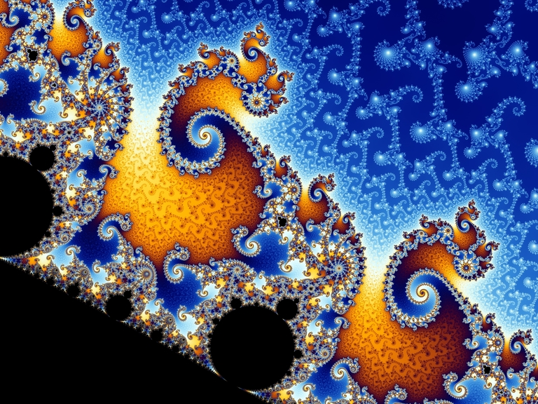

# Метафизика, космопсихизм и перводвигатель: есть ли сознание у камней?

Есть ли сознание у камней? Обычному человеку этот вопрос покажется безумным, но для современных философов - это один из самых острых вопросов, при обсуждении которого всегда идут жаркие дебаты и ломается немало копий. Чтобы понять, как философы приходят к этому вопросу, и почему некоторые из них дают на него положительный ответ, нужно немного погрузиться в вопросы метафизики, сознания и квалиа...

## Метафизика

В философских дискуссиях часто можно услышать слово “метафизика”, но многие не до конца понимают, что именно оно означает. Исходя из корней этого слова, метафизика - это то, что находится “за физикой”, то есть за пределами физики. Под физикой в данном случае имеется в виду всё то, что можно изучить, свести к математическому описанию, измерить, то, о чём можно задать чёткий вопрос и, проведя логическую цепочку корректных рассуждений, ответить на него определённым “да” или “нет”. Соответсвенно, метафизика - это всё то, что находится за пределами физики: не поддающееся изучению наукой, несводимое к математике, неизмеримое, то, о чём трудно сформулировать вопрос и, если даже это удалось, то на этот вопрос не получается чётко ответить "да" или "нет".

Физика - это территория знания. Метафизика - это территория веры. На территории знания работает научный метод. Философ науки Карл Поппер сформулировал главный принцип современного научного метода так: чтобы гипотеза считалась научной должен существовать такой вопрос, на который можно получить определённый и доказанный ответ "нет". Этот принцип был назван им фальсифицируемостью гипотез, но чаще всего упоминается в литературе как критерий Поппера. Всё, что не соответствует критерию Поппера - либо метафизика, либо белиберда, хотя одно от другого иногда отличить бывает достаточно трудно.

Хороший пример метафизического - многочисленные интерпретации квантовой механики, которые описывают устройство мира с разных философских позиций, ничего, однако, не привнося в математический аппарат квантовой механики и не давая никаких проверяемых следствий. Некоторые из них, например, многомировая интерпретация Эверетта, философски изящны и эстетически красивы, но мы не можем поставить эксперимент, который подтвердит или опровергнет их верность, что делает эти интерпретации нефальсифицируемыми по Попперу, а следовательно и ненаучными. Эти интерпретации - ни что иное, как искусные упражнения в метафизике.

Ещё один пример метафизического - это Бог, который, согласно религиозным определениям, обычно стоит за пределами физического: вне пространства и времени, вечный, беспричинный, неописуемый, трансцендентный. Поэтому вопрос существования Бога - это вопрос веры, а не знания, ведь на метафизический вопрос "существует ли Бог" нельзя наверняка ответить ни да, ни нет. Все вопросы об окружающей нас реальности, на которые можно однозначно и с доказательством ответить "да" или "нет" по определению физические, а Бог определению вне физического.

Люди разных культур и разных воззрений легко соглашаются друг с другом о физике, но вот метафизика - у каждого своя. Казалось бы, зачем тогда вообще говорить о метафизическом? Может быть, стоит ограничиться физическим, а всё остальное, что не соответствует критерию Поппера считать бредом? Австрийский философ Людвиг Витгенштейн говорил, что о том, что невозможно ясно выразить словами, следует молчать. Эту фразу можно считать своего рода отречением от метафизики. Подобного взгляда в практических целях придерживался и Будда, не отвечавший ученикам на вопросы о происхождении Вселенной и реальности сознания - он считал, что разговоры о метафизике лишь отвлекают учеников от освобождения от страдания. Стоит ли нам согласиться с такой позицией? Как бы нам этого не хотелось, полностью уйти от метафизики невозможно. Дело в том, что на её фундаменте стоят очень важные аспекты нашей жизни.

Дело в том, что в основе любой этики лежат непроверяемые метафизические утверждения, принимаемые на веру. Шотландский философ Дэвид Юм писал, что из знания о том, как устроен мир, нельзя вывести моральных норм: нельзя из утверждений о том, как оно есть, выводить утверждения о том, как оно должно быть. Никакие этические теории не могут быть выведены из описания законов работы нашего мира. Грубо говоря, права человека никак не выводятся из уравнений Эйнштейна. Без метафизических утверждений о посмертном наказании на Божьем суде или о кармическом перерождении никак не получится обосновать, почему убийство - это плохо, даже если оно выгодно. Без метафизических утверждений о наличии сознания у других людей нельзя объяснить, почему пытки - это зло.

Кроме того, утверждение Витгенштейна о необходимости отречься от метафизического философски опроверг его соотечественник - австрийский математик Курт Гёдель. В своих теоремах о неполноте Гёдель показал, что любая формальная математическая система всегда либо неполна, либо противоречива. Любая полная система описания реальности математикой, то есть отвечающая на все возможные вопросы "да" или "нет", будет содержать логические противоречия - то есть, абсолютно корректные доказательства верности и неверности одних и тех же утверждений. Любая непротиворечивая система, в свою очередь, всегда неполна - в ней всегда есть вопросы, на которые нельзя ответить ни "да", ни "нет", так как в ней не существует ни корректного доказательства, ни корректного опровержения утверждений, отвечающих на заданные вопросы. То есть, исходя из теорем о неполноте Гёделя, в непротиворечивом мире всегда есть место метафизике.

А теперь давайте поговорим о главном примере метафизического, которое не соответствует критерию Поппера, но которое стоит у нас прямо перед глазами...

## Сознание

Когда разговор заходит о сознании, люди часто путаются в предмете обсуждения, поэтому давайте для начала точно выясним, что философы и нейрофизиологи имеют в виду, когда говорят о сознании. Сознание - это поток субъективного опыта восприятия реальности, или, можно сказать, "внутреннее кино", которое сопровождает все процессы нашего взаимодействия с внешним миром, и которое доступно для просмотра только нам самим. Этот субъективный опыт состоит из квалиа - элементарных частиц восприятия: цветов, звуков, запахов, вкусов, тактильных ощущений, чувств, эмоций, боли, мыслей. Слово "квалиа" на латыни означает "качество", так как они несводимы к количественному, поэтому не могут быть описаны ни математикой, ни словами. Как можно объяснить, что такое красный цвет, слепому от рождения человеку?

Квалиа - это то, что отвечает на вопрос "каково это?", то, что описывает качественный, а не количественный аспект реальности. Учёный может всю жизнь изучать летучих мышей и механизм их эхолокации, но никогда не узнает, каково это быть летучей мышью, как она испытывает эхолокацию в её субъективном опыте. Учёный мужчина может всю жизнь исследовать механизм женского оргазма, но никогда не узнает, каково это заниматься сексом, будучи женщиной. Слепой человек может всю жизнь слушать лекции о физике света, устройстве человеческого глаза и механизмах распространения сигнала в человеческом мозге, но никогда не узнает, каково это видеть красный цвет.

Да и мы, зрячие, никак не можем узнать, как видит цвета другой человек. Может быть, он видит красное яблоко тем цветом, которым мы видим зелёные вещи. Мы оба будем словами называть этот цвет красным, но вот субъективно, если бы мы могли "заглянуть в голову" этому другому человеку, мы бы могли увидеть там цвет, которым мы видим зелёные предметы. И физически это никак не определить, ведь это не дальтонизм или какие-либо другие нарушения в глазе или мозге.

Цвет - это не характеристика света, у света есть лишь частота и длина волны. Цвет - это не колбочка на сетчатке глаза, ведь мы видим цвета и во сне, когда наши глаза закрыты, а мозг сам генерирует сигналы самому себе. В самом мозге тоже нет ничего красного - есть только нейроны, которые по цепочке активируют друг друга. В физическом мире цвета нет, он есть лишь в нашем сознании. В этой несводимости квалиа к физическому и состоит изучаемая философами трудная проблема сознания. Лёгкие проблемы сознания, ставящие вопросы о том, как именно физические процессы при взаимодействии света, глаза и мозга коррелируют с возникновением квалиа, поддаются изучению научным методом, а вот причинно-следственная связь между физическим процессом и квалиа - нет. Корреляция есть, причинно-следственной связи нет.

Квалиа не доступны публично, а следовательно они не поддаются научному изучению. Существование квалиа не подпадает под критерий научности Поппера. Мы даже теоретически не можем поставить такой эксперимент, который может подтвердить или опровергнуть наличие квалиа у другого человека. Поэтому квалиа - это чистая метафизика, хотя они и стоят у нас прямо перед глазами.

Мы можем сравнить сознание и физику с графическим и физическим движками видеоигры. Мы с другими персонажами игры, проведя эксперименты с внутриигровыми предметами, можем выяснить формулы, лежащие в основе физики игры, и все согласятся с их верностью. Но мы никак не можем узнать, рендерится ли игра только для нас или для других персонажей тоже. Иными словами, мы не можем достоверно ответить на вопрос, другие персонажи игры - это такие же игроки как мы или же просто бездушные NPC с довольно реалистичным поведением и встроенным AI для разговоров во внутриигровом чате. И даже если мы верим, что для остальные персонажи игры - такие же игроки, как и мы, мы не можем знать, как именно игра для них рендерится, какие текстур-паки и шейдеры они используют.

## Природа сознания

Многие тысячелетия людей мучал вопрос о природе сознания - что же это всё-таки такое? Каждый век то появлялись, то исчезали различные учения, объясняющие этот феномен. Многие из них имели много общего. Современные философы свели все эти учения к нескольким основным теориям.

Первая из рассматриваемых нами теорий сознания - дуализм. Её придерживался французский философ Рене Декарт. Он утверждал, что сознание и материя - это две субстанции разного рода, которые, однако, могут друг с другом как-то взаимодействовать. То есть связь двусторонняя - сознание может влиять на материю, а материя на сознание. В этом самом взаимодействии души и тела и кроется основная логическая неувязка дуализма - так называемая психофизическая проблема: если сознание и материя разнородны, то совершенно необъяснимо, как может сознательное желание поднять руку вызвать материальный идущий по нервам электрический сигнал к мышцам руки, и, наоборот, как может материальный электрический сигнал в мозге вызвать чувство боли в сознании.

Более того, дуализм противоречит всем современным представлениям о причинной замкнутости физического мира. Согласно теориям физики, все без исключения физические события имеют причину в других физических событиях. Нейрон в мозге активируется, потому что к нему пришел сигнал от другого нейрона, а тому от предыдущего, и так далее. Можно проследить всю цепочку электрических и химических сигналов от попадания фотонов в глаз через активацию цепочек нейронов в мозгу до сокращения мышц руки. Никакого причинного разрыва мы в этой цепочке не найдём, а следовательно никакого полностью отдельного от материи сознания быть не может.

Единственную более-менее логичную попытку спасти дуализм предпринял немецкий философ Лейбниц. Согласно его теории "предустановленной гармонии", Бог в начале времен как бы взвёл два часовых механизма - один для сознания и один для материи. Эти часы синхронизированы между собой, поэтому события в мире сознания полностью совпадают с событиями в физическом мире подобно тому, как субтитры совпадают с аудиодорожкой в видеопроигрывателях. Эта интересная мысль, опровергнуть логически её невозможно, но большинство философов считают её абсурдной.

Вторая из рассматриваемых нами теорий сознания - эпифеноменализм. Согласно этой теории, сознание - это такое кино, которым сопровождаются любые процессы обработки информации в нашем мозге и которое проигрывается для субъектов, но никак не влияет на реальный мир - это просто субъективное отражение материальных процессов. Тут связь односторонняя - материя влияет на сознание, но не наоборот.

Мы можем представить себе философского зомби - существо, которое в материальном отношении полностью идентично нам, но не обладает сознанием. Если порезать этого зомби ножом, его поведение будет полностью идентично нашему - он будет корчиться, как будто ему больно, но, на самом деле, не будет чувствовать боль, потому что никакого субъективного "Я" у него нет. В аналогии с видеоигрой, философский зомби - это своего рода NPC без рендеринга квалиа. Эпифеноменалисты утверждают, что такой зомби представим, а значит сознание - это нечто отдельное от материи.

Как это не иронично, основная проблема эпифеноменализма тоже сводится к мысленному эксперименту о философском зомби. Так как физический мир причинно замкнут, а наш рот и язык - части физического мира, если спросить зомби, который в материальном строении полностью нам идентичен чувствует ли он боль, то он ответит "да". Если спросить его, ощущает ли он квалиа красного цвета, зомби ответит "да". А раз и мы, и зомби на этот вопрос отвечаем даже сами для себя одинаково, то как мы знаем, что мы сами не такие зомби? Тем более, если сознание отлично от материи по своей природе, и только материя влияет на сознание, но не наоборот, то как вообще мы можем материальным ртом говорить о чём-то нематериальном? Ведь сознание, согласно эпифеноменализму, не может влиять на материю.

Третья из рассматриваемых нами теорий сознания - физикализм. Так как дуализм и эпифеноменализм, в которых сознание отлично по своей природе от материи, логически несостоятельны, на сцену выходит физикализм, утверждающий, что сознание и материя - это вещи одной природы, и что материя лежит в основе сознания. То есть, что квалиа сводятся к физике. Главная проблема физикализма - это разрыв в объяснении между качественным и количественным: красный цвет ну никак не сводится к математическим уравнениям физики.

Четвертая из рассматриваемых нами теорий сознания - иллюзионизм, который является своего рода разновидностью физикализма. Иллюзионисты мыслят так: раз и дуализм, и эпифеноменализм, и чистый физикализм не могут состоятельно объяснить феномен сознания, то давайте тогда выйдем за рамки этой ложной дилеммы в вопросе сознания и материи и избавимся от предмета обсуждения вообще. Согласно иллюзионизму, сознание - это иллюзия, которая нам как бы кажется. Если анализировать и искать в нашем мозге квалиа, то мы их там не найдём, а значит их и нет, а нам просто кажется, что они есть. Квалиа, согласно иллюзионизму, это просто баг в мышлении.

Основная проблема иллюзионизма состоит в том, что он переворачивает всё с ног на голову. Квалиа - это самое реальное, что только есть. Они буквально стоят у нас перед глазами и звенят у нас в ушах. А вот мозг, теории его строения и физические теории строения материи вообще - это всё некие абстрактные модели и идеи, которые мы можем воспринимать только посредством этих самых квалиа в нашем сознании. Если уж и решать что реально, а что нет, то субъективный опыт всё же стоит первым в очереди в реальное.

Пятая из рассматриваемых нами теорий сознания - панпсихизм. Философы-панпсихисты согласны с физикалистами в том, что сознание и материя - это вещи одной природы, но в отличии от физикалистов они не помещают сознание сверху на материальную основу, а кладут его вниз в основание мира. Это позволяет закрыть разрыв в объяснении - сознание к материи свести нельзя, а вот материю к сознанию можно.

Физика описывает только отношения между различными физическими объектами. Все физические величины, будь то масса или электрический заряд - это количественные характеристики, показывающие как именно два или более предмета взаимодействуют друг с другом. Масса не имеет смысла вне гравитационного взаимодействия, а заряд вне электромагнитного. Именно поэтому физика так хорошо описывается языком математики, ведь математика - это как раз язык описания абстрактных отношений. Но если физика описывает лишь взаимоотношения, то между чем и чем эти взаимоотношения имеют место быть? Между элементарными кирпичиками материи?

Чем глубже и детальнее мы анализируем материю, тем больше она рассыпается на наших глазах. Ну разве можно электрон считать твёрдой материей? В квантовой механике электрон - это не летающий вокруг атомного ядра шарик с обложки учебника физики, а некое облако вероятности получить или не получить в определённой области пространства определённое взаимодействие с другими частицами. То есть электрон мы тоже можем описать лишь словами о том, как он взаимодействует с другими физическими объектами, и набором численных показателей этого взаимодействия.

Физика описывает количественное - отношения между объектами. Но сами объекты, вступающие в эти отношения, количественными быть не могут - они обязаны быть нечтом иным - качественным, а не количественным. А что мы знаем в мире качественное, а не количественное? Квалиа! Даже само слово "квалиа" на латыни означает "качество". Помещая квалиа в самое основание Вселенной, мы уходим от разрыва в объяснении между психическим и физическим. Физика становится описанием взаимодействия между различными структурами из квалиа. Это и есть панпсихизм.

## Панпсихизм

Чужие сознания нам не доступны. Мы не знаем, видят ли другие люди красные предметы тем же самым цветом, каким их видим мы. Словами мы все называем этот цвет красным, но как он выглядит для других — непознаваемо. Мы даже не можем точно знать, что другие люди вообще видят цвета, а не представляют собой бездушных философских зомби. Лейбниц называл это проблемой других умов.

Проблема других умов породила такое абсурдное, но логически неопровержимое, как и любая другая метафизика, учение как солипсизм, утверждающее, что существует лишь одно сознание — моё, и что вся Вселенная — это порождение этого единственного сознания. Я - единственный игрок, а все остальные - бездушные NPC.

Как я уже говорил любая этика основана на метафизике. Если мы верим в метафизическое утверждение о том, что у других людей нет сознания, и они лишь образы в вашем уме или бездушные машины вроде философского зомби, которые, когда их режут ножом, лишь ведут себя, будто им больно, но на самом деле не испытывают субъективное страдание, то в нашей этике мы не выведем утверждение о том, что пытки - это зло.

Если мы отказываемся от веры в солипсизм, мы встаём на дорогу, ведущую к его противоположности - панпсихизму. Ведь, если мы верим, что сознание есть у других людей, то у нас нет никаких логических причин отказывать в наличии сознания и нашим ближайшим родственникам - высшим приматам - шимпанзе, гориллам, орангутанам. Если мы считаем, что сознание есть у обезьян, то на каком основании мы можем отказать в наличии сознания собакам и кошкам? Так, спускаясь всё ниже и ниже по дереву сложности биологических видов, мы приходим к тому, что не можем отказать в наличии субъективных чувств даже существам с простейшей нервной системой - червям и медузам. Конечно, их чувства должны быть гораздо примитивнее человеческих - но они всё равно должны быть. Но как низко мы можем спуститься по этой лестнице? Есть ли сознание у бактерий? Можем ли мы сказать, что для наличия сознания нужна нервная система? Но чем физические процессы в нервной системе отличаются от физических процессов в любой иной структуре? Или нам нужна не просто нервная система, а определённый порог её сложности? Где тогда проходит та волшебная граница, отделяющая мёртвую материю от живого духа?

Само существование такой границы нарушает один из основных принципов натуралистического подхода к изучению природы - "ex nihilo nihil fit" - "из ничего ничего не происходит". Не может быть такого, что нечто не обладающее свойствами сознания порождает нечто, ими обладающими. Все известные науке примеры эмерджентности состоят в том, что совокупность свойств составных частей абстрагируется свойствами целого. Так, например, свойство текучести воды - это абстракция над совокупностью взаимодействий огромного числа молекул воды. И свойство текучести воды как целого выводится из совокупности взаимодействий свойств отдельных молекул воды. А сознание как мы знаем не редуцируется к физическому - красный цвет не сводится к схеме сигналов нервной системы. Таким образом, чтобы сознание было у целого, оно должно быть и у всех его составных частей. А значит никакой волшебной границы появления сознания быть не может. Но что из этого следует? Что сознание есть и у бактерий? Но ведь тогда какие-то протоэлементы квалиа должны быть и у составляющих бактерию молекул? И у составляющих молекулу атомов? И у составляющих атом электронов, протонов и нейтронов?

Такая теория "все-сознательности" называется панпсихизм. Согласно панпсихизму протоэлементы квалиа есть и у элементарных частиц. Из них складываются всё более и более сложные квалиа, и чем сложнее существо, тем более сложные чувства ему доступны. Но что такое в данном случае это такое - существо? Некая отделенная от других область проистекания физических процессов? Структура обработки информации? Почему одно облако частиц находясь внутри точно такого же облака частиц мнит себя цельным человеком?

Процитирую одно из своих старых эссе, чтобы раскрыть смысл этого вопроса:

> Когда мы смотрим на другого человека, мы воспринимаем его образ целостно. А если мы попытаемся проанализировать этот образ и разложить его на части, то тут же обнаружим, что встали на дорожку ведущую в пустоту. Ведь человек - это образ совокупности процессов взаимодействия его органов, каждый орган - это образ совокупности процессов взаимодействия разных тканей, каждая ткань - это образ совокупности процессов взаимодействия биологических клеток, каждая клетка - это образ совокупности процессов взаимодействия молекул химических веществ, каждая молекула - это образ совокупности процессов взаимодействия атомов, каждый атом - это образ совокупности процессов взаимодействия элементарных частиц, каждая частица - это проявление в мире фактов волны в физических полях, а само физическое поле бесплотно - это по сути ничто, пустота, вакуум. Но что же это получается?
>
> Абсолютная пустота осознает себя и гордо заявляет "Я мыслю, следовательно, я существую". После она смотрит рядом туда же в пустоту и заявляет "Ecce homo" - се человек. Человек смотрит на человека или пустота смотрит на пустоту?

Из такой теории панпсихизма следует, что некое сознание есть у любого скопления элементарных частиц - даже у камня. Но какие чувства могут быть у камня? Чувства муравья мы себе ещё как-то представить можем. Но чувства камня? Или квалиа молекулы? Что это вообще могло бы значить?

Английский философ Бертран Рассел писал:

> Если мышление состоит из определённых изменений поведения в соответствии с предшествующими событиями, то следует сказать, что дно реки мыслит, хотя его мышление является недоразвитым

Кроме того, согласно панпсихизму сознание обязано быть у любых структур - в том числе и у тех, частью которых служит человек: корпораций, государств, народов, языков. Их квалиа и их мысли нам недоступны когнитивно, как собаке недоступно понимание ньютоновской физики или истории Древнего Рима. Но тогда сознание должно быть и у целой цивилизации и даже целой планеты, как совокупности сознаний всех живых существ биосферы. Может быть, и правда, как гласит гипотеза Геи, наша планета - это единое живое существо? Но тогда сознание должно быть и у галактики, и всей Вселенной в целом. Если сознание есть у отдельных довольно глупых муравьёв, то есть ли оно также у гораздо более интеллектуально развитой структуры - муравейника? Есть сознание у компьютерных нейросетей? Если сознание у Интернета, как своего рода глобального мозга?

Панпсихизм кажется ещё более абсурдной и безумной теорией, чем солипсизм, от которого мы ушли. Тем более, у панпсихизма есть один огромный недостаток - так называемая проблема комбинации. Почему мы чувствуем себя отдельным существом? Как из множества микроскопических, простых "единиц сознательности" может возникать единое, неделимое субъективное сознание макро-системы - человеческий опыт от первого лица? Эти вопросы кажутся нерешаемыми, если мы придерживаемся версии панпсихизма, идущей снизу вверх - от атомов к человеку и выше. Но что если мы построим панпсихизм сверху вниз?

Такая теория панпсихизма называется космопсихизм. Согласно космопсихизму, изначально Вселенная представляет собой единое и единственное сознание - абсолютного субъекта и бесконечный потенциал различных квалиа, а физика, то бишь воплощённая в сознании математика платоновского мира идей, начинает делить это сознание на отдельные друг от друга части-субъекты, в которых бесплотные идеи и другие субъекты воплощаются в феноменальном виде. В такой схеме, можно сказать, что у камня нет квалиа вовсе, так как сам камень представляет собой лишь объект внутри человеческого сознания. Так, простраивая мир сверху вниз от единого макросознания к множественным микросознаниям и воплощенным в них через квалиа платоновским идеям, мы избавляемся от кучи абсурдных парадоксов, возникающих при конструировании мира снизу от неких материальных микрокирпичиков вверх к макрообъектам.

Кроме того, космопсихизм позволяет нам избавиться от проблемы комбинации. Ведь получается, что элементарные квалиа - это не строительный материал нашего сознания, а концентрация нашего внимания, фокусирование оптики нашего сознания на какую-то часть нашего субъективного опыта. Красивейшую метафору космопсихизма я почерпнул из хабрапоста "О панпсихизме и его главной проблеме": сознание подобно фракталу - каждая его часть подобна целому, но у него нет повторяющихся частей. Сознание - это не конструирование, а деконструкция, не сложение частей в целое, а деление целого на части.

> Перед вами элемент множества Мандельброта, представленный в цвете. Попробуйте отыскать в этих фигурах те элементарные части, из которой они складываются. Не найдете. Погружение в каждую воспринимаемую нами фигуру открывает всё новый и всё более глубокий слой фрактальности. И каждый элемент фрактала выглядит как самостоятельный узор, но он — лишь часть еще большего фрактала, а сам состоит из меньших фракталов. Но каждая точка там — это не «элементарный кирпичик», а такой же фрактал, как и всё остальное здесь.
>
> А вот функция Вейерштрасса. На первый взгляд кажется, что это обычный график, состоящий из конкретных линий. Но это не так. Увеличение графика показывает, что никаких фундаментальных частей нам там не найти. Та линия, что казалась цельным отрезком, оказывается сама состоит из множества цельных отрезков, а те — из таких же отрезков, но меньше.
>
> Понять это не просто, но возможно по такому же фрактально‑математическому принципу и работает сознание. То есть наше сознание не состоит из частей, но лишь воспринимается как целое на определенном масштабе. Увеличим масштаб, и вот уже мы видим, что внутри нашего сознания — фракталы таких же цельных, но уменьших в масштабе сознательных элементов. Уменьшим масштаб — и окажется, что мы лишь часть фрактала сознания галактики, Вселенной.

Таким образом, можно сказать, что наше субъективный мир - это математический калейдоскоп платоновского мира идей, наложенный на свет изначального единого сознания. Материя - тень мира идей, как писал Платон.

Теорию космопсихизма поэтически описывает Виктор Пелевин в своём романе "KGBT+":

> Вы помните сказку Андерсена про Снежную Королеву? Думаю, нет. Поэтому напомню, с чего она начинается.
>
> Значит, жил-был тролль, злющий-презлющий, по некоторым сведениям, сам дьявол (вот только если это правда, зачем называть его троллем?). Раз он был в хорошем настроении – и смастерил зеркало, в котором все «доброе и прекрасное» уменьшалось донельзя, а все «негодное и безобразное» выступало ярче и казалось еще хуже. Ну, мы знаем примерно, что наш добрый сказочник называет «прекрасным» – это когда пляшут буйные медведи, а карточные игроки дерутся за своим столом. Так что не будем спешить с оценкой.
>
> Лучшие из людей выглядели в зеркале троллей уродами – казалось, что они стоят на голове, а животов у них и вовсе нет. Тут каждое слово важно. «Стоят на голове», видимо, означает, что они опираются на рассудок, а «животов вовсе нет» – что они преодолели животное начало. Как там дальше? Добрая и благочестивая
> человеческая мысль отражалась в зеркале невообразимой гримасой... Ну, «благочестивые мысли» времен разгула христианства – например,
> сжечь на костре пару ведьм или геев – нам сегодня тоже кажутся гримасами. Так что, скорей всего, зеркало троллей просто показывало мир как есть, без всяких прикрас. Ученики тролля так и говорили: «Только теперь можно увидеть весь мир и людей в их настоящем свете». Да, мы помним, что ученики тролля – bad guys. Хорошие ребята – это ангелы с пиками.
>
> И вот ученики тролля решили добраться до неба, чтобы посмеяться над ангелами и самим Творцом. Чем выше они поднимались, тем сильнее кривлялось и корчилось зеркало от гримас – тролли еле-еле удерживали его в руках. А потом они оказались так высоко, что зеркало перекосилось, вырвалось из их рук и разбилось вдребезги...
>
> О чем это на самом деле? Представим, что у троллей было зеркало, в котором проявляется истина. И вот они захотели узнать правду про Творца. Они поднимаются выше, выше, выше... А потом зеркало вдруг разлетается на осколки. А что, если зеркало и в этот раз отразило правду как она есть?
>
> Мы знаем, что живем на руинах древней катастрофы. Что-то разлетелось вдребезги четырнадцать миллиардов лет назад. Мы все – осколки этого взрыва. И когда зеркало троллей навели на Творца, оно разбилось не потому, что создатель наказал троллей за наглость. «Распад на обломки» и есть самая честная фотография нашего бога. Единственная, которую мы можем сделать. Хоть телескопами, как физики, хоть душой, как старинный поэт Ницше. Даже самое сакральное из божественных имен состоит из четырех обломков – видимо, древние евреи наблюдали создателя сквозь свою духовную оптику через несколько пикосекунд после его распада и не сумели приблизиться к исходной точке творения ближе...

Космопсихизм - далеко не новая теория. Нечто подобное описывает и древнеиндийская философия. У индийских гимнософистов, как называли йогов древние греки, была популярна теория о том, что мир есть наложение "мужского" идеально-рационального начала "пракрити", которое можно соотнести с математическим миром идей, на "женское" материальное начало "пуруша", которое можно соотнести с квалиа. В текстах пуруша описывается как безногий, сидящий на плечах у слепой пракрити. Имеется в виду, что сознание "не имеет ног" - несводимо к математическому описанию, а мир идей без квалиа "слеп" - то есть не может проявиться без воплощения в сознании.

Кроме того, у древнеиндийских философов сформировалась концепция Брахмана - мирового сознания, делящегося на индивидуальные человеческие души - Атманы. Атман и Брахман в учениях индуизма и адвайта-веданты полностью эквивалентны друг другу. Они изображаются как капля воды (Атман), падающая в океан (Брахман). Весь наш мир, согласно индийской философии - это сон Брахмана, который продумывает все возможные мысли и образы, дробя своё сознание на части и рассматривая все идеи со всех возможных ракурсов. Также у индийцев популярна концепция игры Брахмана в прятки с самим собой - "лила". У английского философа Алана Уотса мы читаем описание этой игры:

> Это похоже на игру в прятки, потому что интересно всегда находить новое место для того, чтобы спрятаться. Вспомни о том, что тебе не нравится играть с друзьями, которые прячутся всегда в одном и том же месте. Бог тоже любит играть в прятки, но Ему не с кем играть, кроме Самого Себя, потому что кроме Бога в мире никого больше нет. Однако для того, чтобы выйти из этого затруднения, Он притворяется, что не является Собой. Таким образом Ему удается спрятаться от Себя. Бог притворяется, что Он – это ты и я, и все люди в мире, все животные, все растения, все камни и все звезды. Когда Он играет Сам с Собой таким образом, у Него бывают необыкновенные и удивительные приключения, среди которых есть страшные и даже ужасные. Однако все они просто напоминают плохие сны, потому что когда Бог просыпается, все, что Ему снилось, исчезает.
>
> Вот и получается, что когда Бог прячется и притворяется тобой или мной, Он делает это очень ловко. Поэтому для того чтобы найти Себя, Ему может потребоваться довольно продолжительное время. Но этот долгий поиск очень интересен – именно на него Бог рассчитывал, когда начинал игру. Он не хочет найти Себя слишком быстро, ведь так играть было бы не интересно. Вот почему тебе и мне так трудно обнаружить, что на самом деле мы – это Бог в маске, играющий наши роли. Но после того, как игра закончится, все мы проснемся, перестанем притворяться и вспомним, что мы – одно Я – Бог, являющийся всем тем, что есть в мире, и живущий веки вечные.
>
> ...
> Ты можешь спросить, почему Бог иногда прячется в облике ужасных людей и почему Он иногда притворяется теми, кто страдает от страшных болезней и несчастий. Чтобы понять это, вспомни прежде всего о том, что Он фактически не подвергает опасности никого, кроме Себя. Вспомни также и о том, что почти во всех сказках, которые тебе нравятся, кроме хороших героев есть еще и плохие. И вся увлекательность повествования в том и состоит, чтобы узнать, как добрые герои победят злых

Таким образом, согласно древнеиндийской философии, весь наш мир - это, по сути, театр одного актёра.

## Воля

Всё в мире постоянно движется и меняется. Солнце встаёт и садится, звёзды и планеты бегут по небосводу, реки текут, люди рождаются, растут, чахнут и умирают, история время от времени въезжает на танке в размеренные жизни людей. Но почему всё движется и меняется?

Этим вопросом задавался ещё древнегреческий философ Аристотель. Мыслитель рассуждал следующим образом: чтобы что-то пришло в движение, это что-то нужно привести в движение. Чтобы шар покатился, нужно, чтобы кто-то его бросил, или чтобы другой шар ударил его и придал ему импульс. Если мир - это непрекращающаяся передача импульсов от одних объектов к другим и переход энергии из одного состояния в другое, то простроив цепочку таких передач импульса от объекта к объекту в глубокое прошлое, мы должны придти к некоему первому импульсу или, как называл его сам Аристотель, перводвигателю. Этот перводвигатель Аристотель ассоциировал с древними представлениями о Боге. Немецкий философ Артур Шопенгауэр в своей книге "Мир как воля и представление" описывал этот аристотелевский перводвигатель как лежащую в основе мира волю, служащую источником всякого движения. Что может служить этим перводвигателем, этой волей, если не Бог? Как мне кажется, ответ лежит в метафизике и теоремах о неполноте Гёделя, из которых следует, что никакой физический мир никогда не может быть до конца законченным - всегда найдётся что-то, что выходит за его пределы и не выводится из лежащих в его основании законов.

Теоремам Гёделя вторит и христианство. Вы когда-нибудь задумывались о том, почему в христианской мифологии символизирующего дьявола змия пронзает ударом копья, сокрушает и низвергает в ад именно архангел Михаил, а не кто-то другой? Дело в том, что на иврите имя "Микаэль" составлено из трёх слов "ми ка эль" - "кто как Бог?". Имеется в виду, что никто не равен Богу в его бесконечности и способности к творению. Дьявол в христианских апокрифических мифах был не согласен с Богом в том, что тот создал мир несовершенным, посчитал своим лучшим творением и даже сделал своим воплощением несовершенного человека. Дьявол же стремится к совершенству, к абсолютной законченной и статичной полноте, к фукуямовскому концу истории. Дьявол бросает Богу вызов, утверждая, что достигнет совершенства. Но все его творения получаются уродскими, так как благодаря гёделевской неполноте неизбежно содержат в себе самопротиворечия. И копьё Михаила раз за разом бьёт в точку этих противоречий и разрушает дьявольские отродья. А вот творения Бога прекрасны, потому что непротиворечивы, но это делает их вынужденно несовершенными, никогда не закоченными до конца - это и придаёт миру движение, делает мир динамичным.

Таким образом, используя уже индийскую терминологию, Брахман никогда не может познать мир идей до конца, так как в платоновском мире идей существует бесконечное количество математических аксиоматик, на основе которых в мировом сознании выстраиваются совершенно отличные друг от друга миры. Каждый мир - это не только фундаментальные аксиомы-законы, но и история развития мира на основе этих законов, как это описывает Стивен Вольфрам в своей статье "Кажется, мы близки к пониманию фундаментальной теории физики, и она прекрасна". И все эти истории разворачиваются на сцене единого мирового сознания.
