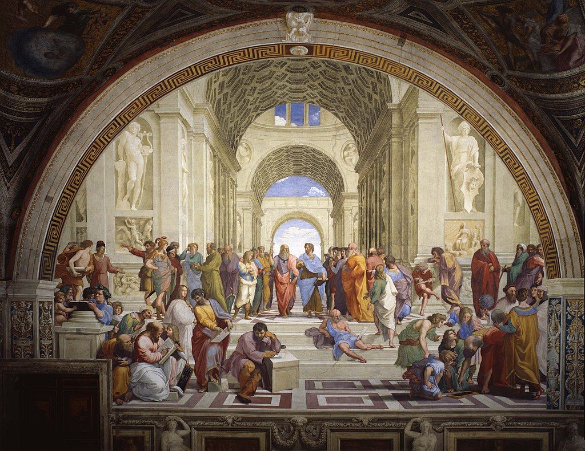
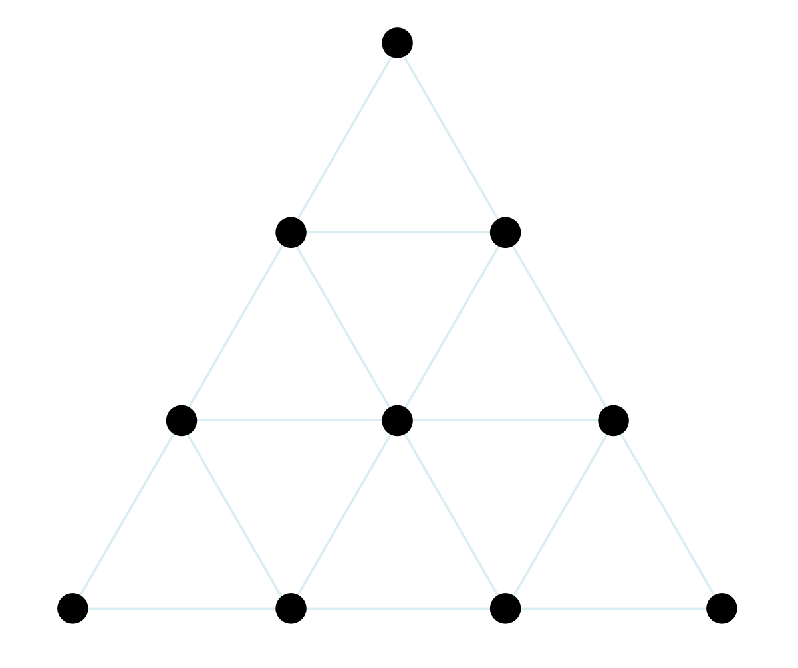
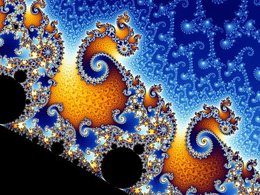

# Как Пифагор, Платон и Будда предвосхитили самую смелую гипотезу современной науки

Меня всегда поражало, что основы всей нашей цивилизации были заложены людьми, жившими две с половиной тысячи лет назад и не имевшими почти никаких способов получения знаний о мире кроме собственного разума - только лишь с помощью него одного они по капле воды смогли догадаться о существовании океана.

В этом посте я хочу рассказать про трех великих философов античности, чьи идеи о природе сущего находят подтверждение в теориях квантовой механики и самых смелых гипотезах современной теоретической физики.

## Как появился Пегас?

Величайшим из древнегреческих философов по праву считается ученик Сократа афинянин Платон. Именно благодаря его "Диалогам" до нас дошла большая часть сведений о греческой философской мысли.

Несмотря на то, что Платон изучал и даже преподавал математику, никаких особенных математических достижений он после себя не оставил. Но все же девизом основанной им Академии он избрал фразу "Не геометр да не войдет", тем самым подчеркнув важность математики для познания мира и формирования ума.

Основной идеей философии Платона была, извините за каламбур, сама "идея". Именно он ввел в оборот это слово, которое на древнегреческом звучало как "эйдос". Для объяснения своей теории Платон обычно использовал аллегорию, позже ставшую известной как миф о пещере. Я вкратце приведу здесь только самую ее суть.

Представьте себе абсолютно пустую белую комнату. В этой комнате нет дверей, на одной из стен почти под потолком располагается единственное окно. Под этим окном стоит кресло, к которому железными цепями крепко-накрепко привязан человек. Его голова и тело зафиксированы таким образом, что единственное, что он видит - противоположную от окна стену. Этот человек в раннем детстве был похищен учеными, подключен к системам жизнеобеспечения и привязан цепями к своему креслу, он вырос в этой комнате и никогда не видел мира за ее пределами. Время от времени ученые проносят за окном какие-то предметы: статуи, животных, растений, зданий. Узник не видит самих предметов, а видит лишь только тени, отбрасываемые ими на противоположную от окна стену комнаты. Он различает в этих тенях схожие паттерны и дает им названия. Узник искренне считает, что те тени на стене, что он видит и которым дает имена - реальны.

По мнению Платона, люди, подобно гипотетическому узнику, заблуждаются, будто с помощью зрения, слуха, обоняния, осязания и вкуса познают реальность. Он утверждает, что, на самом деле, все, что мы получаем от органов чувств - это всего навсего блеклые тени единственно реальных вещей - "идей". Это утверждение стало краеугольным камнем всей философии идеализма.

Под "идеей" Платон понимал некий прообраз, слепком с которого является материальная вещь, идеалом, которого она никогда не сможет достигнуть. Возьмем, к примеру, сделанный из дерева круглый стол. Его форма будет очень близка к кругу, но каким бы искусным не был плотник, как бы он ни старался, стол никогда не будет совершенно круглым. Его площадь будет очень близка к \pi r^2, но никогда точно этой формуле соответствовать не будет. Таким образом, круглая форма этого стола является лишь слепком с некоего идеального круга. Как и сам стол, и все другие столы на свете несмотря на разницу форм и материалов являются лишь слепками с идеи стола.

Платон заметил, что математика полностью существует в мире идей. Представьте себе стол, на котором лежат три яблока. Так вот, само количество яблок "три" - это всего лишь иллюзия, это идея в нашей голове. В материальном мире никакого количества нет - есть просто яблоки. Их количество существует лишь в нашем уме, а сами числа, которыми выражается количество, и все операции над ними существуют в мире идей. Подумайте над таким вопросом, было ли два плюс два равно четырем до Большого Взрыва?

Платон верил, что как глаза нам даны чтобы видеть, а уши чтобы слышать, так и разум нам дан, чтобы воспринимать идеи. Ходит байка, что однажды за ужином в разговоре с Платоном известный циник Диоген воскликнул: "Стол и чашу вижу, а стольности и чашности не вижу", на что Платон резко парировал: "Чтобы видеть стол и чашу, нужны глаза, которые у тебя есть, а чтобы видеть стольность и чашность, нужен разум, которого у тебя нет. Да и вообще о чем можно спорить с человеком, живущим в бочке". Кстати, слово "циник" в предыдущем предложении относится не к моральной характеристике Диогена, а к тому, что он являлся ярким представителем философской школы циников, или в правильном произношении киников, что переводится с древнегреческого как "собаки". Вы можете знать содержащее этот же корень слово "кинолог", то есть "изучающий собак".

Киники были не единственными, кто придерживался противоположной платоновскому идеализму теории - материализму. Эта теория утверждает, что идеи нереальны и не существуют сами по себе - мы получаем их из анализа окружающего нас материального мира. Таким образом идея стола формируется у нас лишь потому, что мы видели в своей жизни десятки столов. Известный шотландский философ Дэвид Юм демонстрировал это на примере того, что простые идеи у человека появляются лишь из органов чувств, а сложные складываются из простых. Так идея летающего коня Пегаса - это сумма двух простых идей "лошади" и "крыльев", полученных нами из нашего непосредственного опыта наблюдения материального мира.

По иронии судьбы, одним из основоположников материализма стал платоновский ученик Аристотель, всегда обожавший поспорить со своим учителем. Не менее иронично, что самого Аристотеля судьба наградила столь же непослушным учеником, который предпочел завоевание мира нудным урокам по философии.

## Музыка вселенной и сакральная геометрия

Другой знаменитый древнегреческий мыслитель Пифагор, живший за несколько веков до Платона, вошел в историю как великолепный математик и философ, настолько великий, что именно он ввел в обиход сами слова "философ" и "математик". В молодости Пифагор много путешествовал и провел долгие годы в Египте, где обучался различным наукам. После он ненадолго вернулся в родной город Самос, откуда тем не менее по политическим причинам был вынужден вскоре сбежать, и окончательно осел на юге Италии, где создал свою знаменитую пифагорейскую школу и где встретил свою трагическую смерть.

Пифагорейская школа была не только математически-философским кружком, но и религиозной сектой со странными правилами вроде "запрещается есть бобы", а также тайным обществом с запретом на распространение знаний. Доподлинно неизвестно, что именно из математических открытий и философских концепций было создано самим Пифагором, а что было приписано ему его последователями, так как запись учения была запрещена, и оно передавалось лишь устным путем, а до нас оно дошло лишь в пересказе других античных философов. По свидетельствам Аристотеля, именно учение пифагорейцев заложило основу взглядов Платона.

Основой метафизики Пифагора служило утверждение о том, что в основе всего лежит число. Он пришел к такому заключению, изучая музыку. Пифагор заметил, что интервал между высотами двух звуков зависит от соотношения длин струн, издающих их. Очевидно, что Пифагор не был первым, кто догадался об этом, но он был первым, кто провел глубокие исследования этой закономерности и свел музыку к строгой формальной математической системе. Именно Пифагор создал музыкальный строй и теорию о музыкальной гармонии, ставшей основой всей античной и современной музыки.

Поняв, что в основе музыки лежат строгие математические законы, и заметив множество подобных закономерностей в других областях, Пифагор задался вопросом, возможно ли такое, что звуковая гармония является лишь выражением всеобщей гармонии Вселенной, которая точно так же, как и музыка, описывается математикой. Подтверждения этой идеи Пифагор и его последователи нашли в астрономии. Они заметили, что все небесные тела движутся согласно строгим математическим законам. На базе этих наблюдений пифагорейцы создали учение о гармонии сфер, или как еще ее называли "мировой музыке" - музыкально-математическом устройстве космоса.

Учение пифагорейцев о гармонии сфер и создание пифагорейцем Филолаем задатков теории о гелиоцентрическом строении мира повлияло на множество известных астрономов последующих веков. Николай Коперник посвятил пифагорейцам свою книгу "О вращении небесных тел", Иоганн Кеплер озаглавил главный труд своей жизни "Гармония мира", закончив его описанием того, как "cогретый тёплым напитком из кубка Пифагора" засыпает под звуки небесной музыки. Исаак Ньютон писал, что видел в пифагорейском учении намеки на открытые им законы тяготения. Альберт Эйнштейн в одном из интервью сказал, что является "платонистом или пифагорейцем, так как считает логическую простоту незаменимым и эффективным инструментом своего исследования".

Мысль, что в основе всего лежит число, послужила основанием всей философии пифагорейцев. Пифагор и его последователи поклонялись числам. Число "один", по-другому называемое монадой, они считали божественным. Число "два" - причиной раздвоения. Каждое число они рассматривали геометрически, веря, что геометрическое изображение числа несет некий сакральный смысл. Их вера в сакральную геометрию породила целую науку о фигурных числах, одно из которых, тетраксис, они считали особенно священным.

Основу метафизических воззрений пифагорейской школы составило учение о двух противоположностях - пределе и беспредельном. Под пределом понимались числа, а под беспредельным - абстрактные математические понятия бесконечности. Филолай утверждал, что "природа, сущая в космосе, гармонически слажена из беспредельных и определяющих; так устроен и весь космос, и все, что в нём".

Но давайте пока что остановимся, и отложим устройство космоса на потом, а пока посмотрим в противоположную сторону - внутрь самого себя.

## Пустота и мгновенность бытия

В "Критике чистого разума" известный немецкий философ Иммануил Кант пытался найти, но так и не нашел Ding an sich, "вещь в себе" или менее буквально "вещь саму по себе", то есть предмет, свойства которого не зависят от нашего восприятия.

За две тысячи лет до Канта над похожим вопросом размышлял выдающийся индийский философ Сиддхартха Гаутама Шакьямуни, более известный нам под именем Будда. Само слово "Будда" образовано от индоевропейского корня "буд" и дословно переводится на русский как "пробудившийся".

Прежде чем углубляться в детали метафизики Гаутамы, давайте сыграем с вами в небольшую игру и из двух предложенных предложений выберем наиболее осмысленное:

Гло́кая ку́здра ште́ко будлану́ла бо́кра и курдя́чит бокрёнка

Сангху Будда учил о шуньяте, пратитье-самутпаде, анитье, кшаникаваде и анатмане.

Кажется, что единственными осмысленными словами тут являются "Будда учил", но это не так. Второе предложение мы можем перевести на литературный русский примерно так: своей монашеской общине Будда преподавал учение о пустоте, взаимозависимом возникновении, непостоянстве составных вещей, мгновенности бытия и отсутствии собственного Я у вещей. Давайте поподробнее разберем каждое из понятий.

Шуньята - пустота. Будда учил, что все вещи и явления существуют только лишь в нашем сознании. Возьмем к примеру, человека. Человек воспринимается нами как нечто одушевленное, но по сути человек это всего лишь иллюзия, созданная набором взаимодействующих органов. Каждый из органов в свою очередь являются иллюзией, созданной набором взаимодействующих клеток. Каждая из клеток является иллюзией, созданной набором взаимодействующих молекул. Каждая из молекул является иллюзией, созданной набором взаимодействующих атомов. А каждый атом является иллюзией, созданной набором взаимодействующих протонов, нейтронов и электронов. Получается, что человек это всего лишь облако как-то взаимодействующих друг с другом элементарных частиц. И только наше сознание придает этому облаку и каждому слою его абстракции какой-то смысл, именно наше сознание видит в целом нечто большее, чем сумму его частей, именно оно создает из пустоты бесконечно сложные объекты - живых существ, страны, галактики, математику, веб-сайты, произведения искусства.

Но если вы попробуете ответить на вопрос где именно находится само ваше сознание, вы придете к парадоксальному выводу. Сознание находится в вашем мозгу, ваш мозг в вашем теле, ваше тело на планете Земля, Земля в Солнечной системе, Солнце в Млечном Пути, Млечный Путь во Вселенной. Но где находится сама Вселенная? Только в вашем сознании.

Пратитья-самутпада - взаимозависимое возникновение. Будда учил, что ничто не может появиться из пустоты само по себе. Для появления любой новой вещи или явления необходимо взаимодействие двух или более частей. Чай появляется из взаимодействия горячей воды и листьев, а атом водорода из взаимодействия протона и электрона. А раз для появления любой вещи необходимо как минимум две части, то это значит, что все вещи являются составными.

Анитья - непостоянство составных вещей. Будда учил, что все составные вещи недолговечны и подвержены исчезновению. Все рождается и все умирает - растения, животные, люди, страны, религии, планеты, галактики и даже сама Вселенная проходят через этот цикл появления и исчезновения. И не существует ничего, что может обойти этот закон и существовать вечно.

Кшаникавада - мгновенность времени. Будда учил, что вне нашего сознания не существует ни прошлого, ни будущего. Прошлое - это лишь наши воспоминания, а будущее - это лишь расчет возможных вариантов развития событий. Единственное, что реально - это краткий миг между прошлым и будущем, исчезающе малое мгновение настоящего. Даже само течение времени является нашей иллюзией. Как смена 24 кадров в секунду на экране создает фильм, так и очень быстрая смена мгновений создает для наблюдателя всеобъемлющую иллюзию устойчивой и постоянной реальности.

Анатман - отсутствие собственного Я у вещей. Будда учил, что ни одна вещь не является неизменной и не имеет "души" или "самости" - чего-то, что остается у вещи с течением времени и определяет ее. Чтобы лучше понять это утверждение, давайте рассмотрим его на примере корабля Тесея. Корабль плавал по морям долгие годы, что-то в нем ломалось, гнило, и поэтому корабль часто чинили. При починке в нём постепенно заменяли доски, и так продолжалось до тех пор, пока в нем не осталось ни одной старой доски. Возникает вопрос: если все доски в корабле заменили, то является ли он тем же самым кораблем, которым был когда-то? Будда отвечает на этот вопрос отрицательно и утверждает, что ни корабль, ни какая-либо другая вещь или явление не обладает собственной ''душой", своим собственным Я. Но при этом Будда не отрицает целостности самого потока состояний, вызванного действием закона причин и следствий, и утверждает, что именно целостность этого потока и создает у нас иллюзию существования "сущности" вещей.

Доктрина анатмана может быть применена не только к другим вещам, но и к нам самим. Являюсь ли я тем самым человеком, которым я был в возрасте пяти лет? Мое тело сильно изменилось, все его клетки много раз обновились, мой ум изменился, мои знания увеличились во много раз. Единственное, что осталось во мне от меня пятилетнего - это смутные обрывки нескольких воспоминаний. Поэтому можно смело утверждать, что несмотря на целостность потока причин и следствий, сделавшего из меня пятилетнего меня сегодняшнего - это все-таки совершенно разные люди. Но если я сейчас не имею ничего общего со мной пятилетним, то то же самое можно сказать и об отсутствии единства между мной сейчас и мной секунду назад. Таким образом, целостность нашего собственного сознания, нашего "Я", является иллюзией, образованной быстрой сменой различных состояний.

Может показаться, что Будда - нигилист и отрицает реальность чего бы то ни было, ведь все вещи и явления иллюзорны, но это не совсем так. Лучше всего позицию Будды и его последователей описал известный буддийский мыслитель Нагарджуна. Он утверждает, что знание об истинном устройстве Вселенной трансцендентно, оно приходит только после Просветления, которое заключается в понимании того, что реальность неописуема, а описываемое - не реальность. Нагарджуна видит единственный способ приблизиться к точному описанию устройства мира в определении его через отрицание того, чем он не является. Таким образом Нагарджуна приходит к выводу, что наш физический мир не реален, но и не нереален.

Для лучшего осознания этой истины буддисты советуют практиковать медитацию. А для того, чтобы помочь себе очистить свое сознание от посторонних мыслей при медитации, рекомендуют использовать мантру "Ом мани падмэ хум", произнесение которой занимает ровно один выдох воздуха из легких, помогает настроить ритм дыхания и забивает голову, не позволяя возникать лишним мыслям. Если вы начнете медитировать прямо сейчас, то вы наверняка заметите, как в вашей голове короткой электрической искрой промелькнет мысль: "Так, что это я вообще сейчас читаю? Какие нафиг еще медитации, мантры, пегасы и сакральная геометрия? Какого черта этот пост вообще делает в хабе математики и физики, и на Хабре вообще? Когда уже автор начнет втирать про рептилоидов?". Так что давайте пока что вернемся обратно в русло нашей статьи и поговорим о гипотезах современной теоретической физики.

## Философия и физика

Все известные нам теории физики обладают одним настолько очевидным свойством, что иногда бывает даже трудно заметить его существование. Формулировка этого свойства может показаться вам трюизмом, но, если вдуматься, она им отнюдь не является. Это свойство состоит в том, что если очистить любую теорию физики от словесного описания, то все что останется - это набор аксиом о неких абстрактных объектах и набор формул, по которым эти абстрактные объекты взаимодействуют. Это свойство полностью подтверждает правоту Пифагора, считавшего, что Вселенная основана на математике.

Более того, если мы опустимся глубоко вниз на уровень элементарных частиц, мы увидим, что вся наша материя не является чем-то твердым и незыблемым, а является чистой математикой, существующей в мире идей Платона. Электроны и фотоны проявляют свойства не только частиц, но и волн, то есть по сути математических функций - это явление называется корпускулярно-волновым дуализмом. Также наблюдается другое интересное явление - принцип неопределенности Гейзенберга, при котором увеличение точности измерения одной характеристики частицы уменьшает точность измерения другой - этот принцип порождается исключительно математическими ограничениями и служит отличным подтверждением того, что на квантовом уровне наш мир является скорее "идеальным", чем "материальным". Именно "идеальность" нашего мира делает возможным нарушение принципа локальности - в мире математики нет времени и вычисление значений характеристик частицы происходит мгновенно вне зависимости от разделяющего эти частицы расстояния.

Далее, если мы поднимемся высоко на верх на уровень галактик и околосветовых скоростей, мы увидим, что и там наша реальность становится все менее "материальной" и все более странной. Мы увидим, что при приближении к скорости света время для нас относительно времени для неподвижного наблюдателя замедляется. Мы обнаружим в пространстве-времени точки, названные черными дырами, которые засасывают все окружающее их вещество и даже свет, которые, тем не менее, с их собственной точки зрения падают в эту дыру бесконечно долго. Мы убедимся в том, что наш мир скорее является некой математической идеей нежели чем-то материальным.

Если же мы захотим найти в этом безумном мире что-то стабильное и определенное, на что можно опереться, то нас постигнет неудача. Любые понятия или объекты физики не несут никакого собственного смысла. Возьмем, к примеру, электрический заряд. Наличие электрического заряда никак не может быть определено у одной единственной частицы - для того, чтобы подтвердить его существование нужно как минимум две частицы, а чтобы определить, что заряд - величина количественная нужно как минимум три частицы. То есть можно сказать, что заряд даже не существует без взаимодействия частиц. Это наблюдение подтверждает тезис Будды о взаимозависимом возникновении всех вещей и явлений.

Все вышеприведенные доводы показывают нам, как хорошо учения античных философов согласуются с самыми передовыми открытиями физики 20 века. Но что нам может предложить современная физическая и философская мысль?

## Теория всего

Рассуждения знаменитого британского физика Стивена Хокинга дают нам интересную пищу для размышлений. Хокинг писал о том, что если даже мы завершим работу над "теорией всего" и найдем все уравнения и константы, согласно которым работает наша Вселенная, то перед нами мгновенно встанет следующий вопрос: почему именно эти уравнения? Что вдыхает в них огонь?

Самым очевидным и простым ответом на этот вопрос является, конечно, существование Бога-Творца и его промысла. Но есть и другой ответ, его дает американский физик Макс Тегмарк, профессор MIT и автор книги "Наша математическая вселенная". Тегмарк утверждает, что самый разумный ответ на данный вопрос такой: все непротиворечивые математические структуры реально существуют, и мы живем в одной из них. Эта гипотеза хороша тем, что она не плодит никаких лишних сущностей. Используя антропный принцип, мы можем допустить, что в некоторых очень сложных математических структурах возможно появление подструктур, обладающих самосознанием и способных исследовать саму эту структуру. Такими подструктурами являемся мы - Homo Sapiens.

Логическим развитием гипотезы математической вселенной Тегмарка служит гипотеза рекурсивно-вычисляемой вселенной Стивена Вольфрама. Ее главная идея состоит в том, что математическая структура, в которой мы живем, не финитна, а постоянно и рекурсивно самовычисляема. То есть, что настоящее - краткий миг между прошлым и будущем - это конкретное состояние нашей структуры, а физические законы Вселенной - это некая функция, и следующее состояние структуры является результатом применения функции к ее предыдущему состоянию.

## Аргументы в пользу гипотезы рекурсивной Вселенной

В пользу гипотезы рекурсивно-вычисляемой математической Вселенной говорят некоторые факты.

Первым аргументом является существование нескольких осей времени, то есть таких явлений, в которых состояние системы в прошлом и будущем не симметрично относительно настоящего:

- Причинно-следственная ось: причины порождают следствия, а не наоборот.
- Психологическая ось: мы помним прошлое, но не знаем ничего о будущем.
- Термодинамическая ось: энтропия в замкнутой системе только растет.

И если с первыми двумя утверждениями еще можно поспорить и заявить, что причинно-следственная связь - это лишь иллюзия, порожденная нашим умом, то поспорить со вторым законом термодинамики так просто не получится.

Эти и другие оси времени очень хорошо объясняются рекурсивным вычислением Вселенной. Текущее состояние - это входные данные функции, а следующее состояние - это выходные данные функции. Выходные данные зависят от входных, следующее состояние памяти зависит от текущего, а сложность и разнообразие получаемых состояний со временем может только расти.

Вторым аргументом в пользу гипотезы может послужить сильное сходство строения нашей Вселенной и многих объектов, существующих в ней, со строением фракталов, порождаемых рекурсивными функциями. Фрактал - это множество, обладающее самоподобием - объект, в точности или приближённо совпадающий с частью самого себя. Именно так устроена наша Вселенная. Планетарные системы похожи на атомы, звездные системы похожи на планетарные, а устройство галактик похоже на устройство звездных систем. Но при том, каждый из уровней имеет свою собственную неповторимую структуру. Посмотрите, насколько изображение множества Мандельброта, порождаемое простейшей рекурсивной функцией `z(n+1) = z(n)^2 + c`, напоминает фотографии далеких галактик.

## Вселенная - матрица или Матрица?

Гипотеза о рекурсивно-вычисляемой Вселенной неизбежно наводит на мысли о том, что весь наш мир может быть лишь симуляцией, работающей на каком-то мощном компьютере во внешней "настоящей" реальности, а все мы - лишь персонажами игры Sims. Такую возможность нельзя отрицать, но она никак не противоречит нашей гипотезе. Если мы действительно живем в симуляции, то компьютер, на котором вычисляется наша Вселенная точно так же должен быть устроен на принципах математики, ведь математика живет в мире платоновских идей и не является частью нашей реальности. Чтобы создание такого компьютера было возможно, внешняя "настоящая" Вселенная тоже должна быть основана на строгих математических законах. А следовательно к ней точно так же может быть применена гипотеза симуляции, и существа, живущие во внешней Вселенной, не могут точно быть уверены в том, что их мир не является симуляцией. Но как бы далеко в бесконечность ни уходила вложенность симуляций друг в друга, в конце концов на самом верху должна будет существовать "самая настоящая" Вселенная, и она тоже должна быть основана на законах математики.

## В поисках Бога

Как это ни странно, но именно основание нашего мира на математике оставляет в нем место для Бога. Чтобы понять, как это возможно, стоит мысленно отправиться в начало 20 века. В те времена среди математиков и философов была очень популярна идея о том, что вся математика может быть сведена к некоему компактному ядру, состоящему из аксиом и методов доказательства теорем. Знаменитый британский философ и математик Бертран Рассел, более всего известный по названному в его честь летающему в космосе чайнику, считал, что это ядро будет основано на логике - это направление поиска оснований математики называлось логицизмом. Великий немецкий математик Давид Гильберт, который кроме своих блестящих успехов в математике также внес значительный вклад в физику, оказав Альберту Эйнштейну помощь в создании уравнений гравитационного поля для общей теории относительности и заложив основы математического аппарата квантовой механики, считал, что это ядро будет основано на формальных системах - это направление называлось формализмом.

Все мечты Рассела и Гильберта были разрушены 7 сентября 1930 года в Кёнинсберге (нынешнем российском Калининграде). В этот день молодой австрийский математик Курт Гёдель представил доказательство того, что в любой непротиворечивой формальной арифметике существует недоказуемая и неопровержимая формула. Это значит, что даже если наша Вселенная основана на законах математики, сводимых к некоторым базовым аксиомам, то существуют утверждения, которые даже теоретически невозможно будет ни доказать, ни опровергнуть. В математике такие недоказуемые и неопровержимые в рамках некоторой аксиоматики утверждения обычно называют абсурдными. Одним из таких абсурдных утверждений является гипотеза о существовании Бога-Творца. Поэтому для верующих в его существование людей всегда останется лазейка даже в математической Вселенной - верую, ибо абсурдно.

## Заключение

Надеюсь, что вам понравился пост, и вы сможете извлечь из него что-нибудь полезное для себя. Напоследок мне хочется посоветовать вам книги, под впечатлением от которых написан этот пост:

"Мир Софии" - автор Юстейн Гордер - детская, но все же очень интересная и познавательная даже для взрослых книга про 14-летнюю девочку Софию, изучающую философию на собственной шкуре

"История западной философии" - автор Бертран Рассел - книга известного британского философа, в которой подробно и детально рассматривается вся западная философия: древнегреческая, еврейская, христианская, немецкая и английская

"Чапаев и пустота" - автор Виктор Пелевин - книга дает наиболее красочное и захватывающее описание буддийской философии

"Дзен и искусство ухода за мотоциклом" - автор Роберт Пирсиг - книга, пытающаяся найти ответ на вопрос "Что такое качество?" и полезная для любого программиста

"Наша математическая Вселенная" - автор Макс Тегмарк - книга физика-теоретика об устройстве нашей Вселенной
