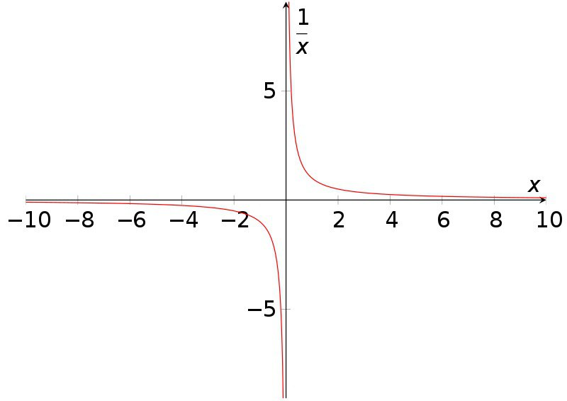

# Бесконечный потенциал нулевой точки

Древнегреческий философ Пифагор вошёл в историю как автор названной его именем геометрической теоремы о соотношении сторон прямоугольного треугольника. Благодаря этой теореме сейчас его имя знает каждый из нас. Однако остаётся довольно малоизвестным тот факт, что Пифагор занимался геометрией не из чисто научного интереса, а скорее по религиозным причинам. Пифагор верил в божественность геометрии и в то, что занимаясь ею, он тем самым познаёт Бога, пишущего ноты гармонии небесных сфер на языке математики.

Именно на основе идей математическо-религиозной школы Пифагора другой известный древнегреческий философ Платон построил свою знаменитую теорию идей - над воротами его афинской академии даже было начертано "Не геометр да не войдет". Согласно Платону, истинность математических идей вроде равенства 2+2=4 или существования только пяти правильных многогранников не зависит ни от чего в материальном мире - эти пропозиции истинны всегда и везде, а следовательно они существуют в некоем отдельном мире, находящемся вне времени и пространства.

Священной фигурой в сакральной геометрии Пифагора и Платона считался круг. У круга есть по истине поразительное свойство: на линии окружности находится бесконечное количество равноудалённых от её центра точек, при этом у каждой из них есть ровно противоположная. Если взглянуть на это свойство круга с философско-религиозной точки зрения, то это выглядит, как будто бы пустота в самом центре круга разрывается одновременно во все стороны на бесконечное количество двойственных противоположностей. Этакий абстрактный геометрический Большой Взрыв. Эти идеи Пифагора и Платона стали философской основой христианского учения - они идеально легли на иудейскую историю о сотворении мира, в которой Бог творит всё из ничего.
Подобные мысли можно найти не только на Западе, но и на Востоке. Так, согласно буддизму, все вещи и явления возникают взаимозависимо - когда возникает понятие света, возникает и понятие тьмы, когда возникает понятие красоты, возникает и понятие уродства - и в основе всего бесконечного количества вещей и явлений лежит пустота. Это очень созвучно идеям Пифагора.

Что у христиан, что у буддистов нет чёткого определения Бога или пустоты. С религиозной точки зрения эти идеи трансцендентны, то есть запредельны - неописуемы словами, а потому непознаваемы. Христианам и буддистам вторит китайский "Дао-дэ-цзин": "Дао, описанное словами, не есть истинное Дао". Все эти идеи - Бог, пустота, Дао - подобны точке, в которую ведут все дороги, но ни по одной из которых нельзя дойти до конца.

У математиков такие точки, которые выходят за пределы теории и в которые нельзя попасть, называется сингулярностями. Примерами математических сингулярностей в физике могут служить горизонт событий чёрной дыры или Большой Взрыв. В чистой же математике простейшим примером сингулярности является функция y=1/x в точке x=0. Чему равен y при x=0?

Частое заблуждение состоит в том, что при делении любого числа на ноль получается бесконечность, но это совсем не так. Посмотрите на приложенный к посту график: справа, со стороны положительных чисел, при стремлении икс к нулю игрек и правда стремится к бесконечности, но слева, со стороны отрицательных чисел, при стремлении икс к нулю, игрек стремится к минус бесконечности. Дойдя по обеим этим ״дорогам״ до логического конца, мы обнаружим, что в точке x=0 функция одновременно принимает значения бесконечности и минус бесконечности, что не имеет никакого смысла. Эта точка находится за пределами теории, за пределами возможностей познания.

Сингулярность - это своего рода конец знания и начало веры. Кто-то, например христиане, верят, что в этой точке начинается мир Божий. Кто-то, вроде буддистов, верит, что эта точка - лишь абстракция ума: как писал известный буддийский философ Нагарджуна "пустота пуста" и что она одновременно реальна и нереальна. Но с чем согласны все, так это с тем, что эта точка обладает силой порождать бесконечное количество различных вещей и явлений. Потенциал нулевой точки бесконечен.
