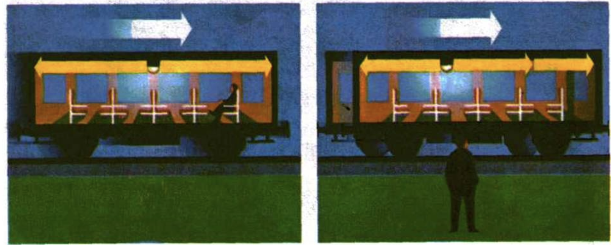
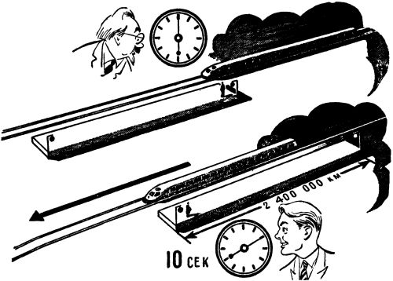
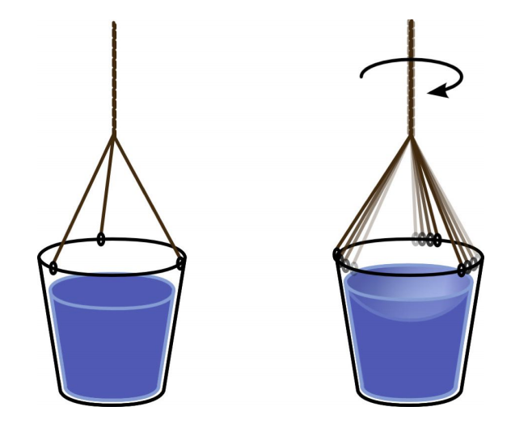

# Архитектура Вселенной, часть 2: Относительность


Мы уже достаточно поговорили про сознание, поэтому теперь мы переходим от рассмотрения сознания к не менее удивительным феноменам нашей Вселенной - ко времени и пространству.

Оба этих понятия настолько самоочевидны, что когда мы пытаемся дать им определение, то сталкиваемся с огромными трудностями и можем выдавить из себя только что-то вроде: "ну, пространство - это то, в чём все находится, а время - ну, оно течёт". Мы можем попробовать описать время, как процесс, но мы тут же натолкнемся на объяснительную рекурсию, ведь процесс - это то, что проистекает во времени. Но может быть все-таки существует лучшее определение времени?

Давайте посмотрим на то, что пишет о времени Википедия:

> Время - это форма протекания физических и психических процессов, условие возможности изменения

Звучит даже хуже, чем "оно течёт". Если моя маленькая дочка спросит меня, что такое время, я точно не стану отвечать ей такими словами. Но даже такое запутанное объяснение оказывается лучше, чем определение пространства из Википедии:

> Пространство - трёхмерное пространство нашего повседневного мира.
> Трёхмерное пространство - геометрическая модель материального мира.

Получается какая-то рекурсия: пространство - это геометрическая модель мира в мире. Видимо, проблемы с формулировками есть не только у меня. Почему же так трудно дать определение этим понятиям?

Всё дело в том, что пространство и время - это фундаментальные свойства Вселенной. Именно поэтому ни одному из этих терминов мы не можем дать четкого определения, не прибегая к тем же самым словам. Как в математике существуют невыводимые ни из чего аксиомы, так и в реальном мире существуют невыводимые ни из чего свойства Вселенной. И точно так же, как и в случае с сознанием, природа пространства и времени содержит в себе множество парадоксов и нелогичностей. На них обратил внимание ещё древнегреческий философ Зенон Элейский.

## Апории Зенона

Зенон был учеником и последователем другого великого философа из Элеи - Парменида. Но если про труды его учителя мало кто знает, то про апории Зенона слышали, я думаю, все. Мы рассмотрим только две самые известные из них.

Первая называется "Летящая стрела". В ней философ рассматривает природу движения. Движение - это явление, тесно связанное со временем. Если мы сможем понять, что такое движение, то сразу же поймем и природу времени. Однако, при близком рассмотрении движение оказывается столь же загадочным, как и время. Зенон показывает это на следующем примере:

> Летящая стрела неподвижна, так как в каждый момент времени покоится; поскольку она покоится в каждый момент времени, то она покоится во все моменты времени, то есть не существует момента времени, в котором стрела совершает движение.

Эту апорию пытался критиковать Аристотель. Он писал про то, что Зенон опирается на допущение, что время состоит из отдельных моментов, и вся парадоксальность исчезает, если принять, что время бесконечно делимо. Однако, это не так. Ведь как мелко время не дели, все равно в каждый из моментов стрела будет покоиться. Из апории следует, что субъективно движение существует, но объективно оно иллюзорно и состоит из набора неподвижных кадров. Однако, непонятно что именно такое кадр, ведь если время бесконечно делимо, то любой из них может быть разложен на произвольное количество еще меньших кадров. Так что утверждение Аристотеля не опровергает парадоксальность этой апории.

Кстати, как известно, Аристотель был учеником величайшего из античных философов - Платона, а также наставником величайшего из завоевателей в мировой истории - Александра Македонского. Как Платон не знал поражений в философских дискуссиях, так и Александр не знал поражений на поле битвы. Однако в Элладе жил один человек, которого не мог победить в споре даже сам Платон, и пред которым преклонялся даже сам Александр. Этим человеком был философ-киник по имени Диоген.

Слово "кинизм", по-русски часто произносимое как "цинизм", происходит от греческого корня "кино", означающего "собака". В русском языке от этого корня также происходит слово "кинолог". Философия циников не просто так называлась собачьей - она проповедовала простоту жизни и простоту самой философии. По легенде, у Диогена из имущества была одна только чаша, которой он зачерпывал воду для питья из реки. Но однажды он заметил, как собака пьет из реки, просто лакая воду - Диоген разбил свою чашу и с тех пор жил вообще без всякого имущества и всяких привязанностей.

Диоген был мастером в использовании аргументов прямого действия. Именно с помощью такого аргумента он смог опровергнуть апорию Зенона про летящую стрелу. Его опровержение оказалось настолько простым и элегантным, что его воспел в своих стихах великий русский поэт Александр Сергеевич Пушкин:

```
Движенья нет, сказал мудрец брадатый.
Другой смолчал и стал пред ним ходить.
Сильнее бы не мог он возразить.
Хвалили все ответ замысловатый.
```

На самом деле, конечно же, Зенон не утверждал того, что движения не существует. Он пытался показать всю абсурдность нашего представления о непрерывном континууме времени, как о сумме бесконечного числа точечных моментов. Вторая из его апорий, "Ахиллес и черепаха", служит наглядной демонстрацией того же самого утверждения. В ней философ рассматривает природу пространства:

> Допустим, Ахиллес бежит в десять раз быстрее, чем черепаха, и находится позади неё на расстоянии в тысячу шагов. За то время, за которое Ахиллес пробежит это расстояние, черепаха в ту же сторону проползёт сто шагов. Когда Ахиллес пробежит сто шагов, черепаха проползёт ещё десять шагов, и так далее. Процесс будет продолжаться до бесконечности, Ахиллес так никогда и не догонит черепаху.

Мы сталкиваемся с дилеммой. Если рассматривать пространство и время как бесконечно делимый непрерывный континуум, то возникает парадокс с Ахиллом и черепахой. А если же рассматривать их как нечто дискретное, то возникает парадокс с покоящейся стрелой. Многие философы пытались разрешить это противоречие, но их попытки ни к чему не привели. Причина неудач кроется в том, что сама только попытка найти решение апорий говорит о полном непонимании их сути.

Все дело в том, что парадоксальность апорий Зенона вытекает не из логики размышлений, а из изначально неверной предпосылки. В обеих апориях неявно подразумевается, что пространство и время являются материальными протяженными сущностями. Если мы откажемся от этого заблуждения и рассмотрим пространство и время не как материальные протяженности, а как набор отношений, то апории сразу же утратят свою парадоксальность.

Из рассмотрения пространства как некой реально существующей протяженности вытекает еще множество абсурдных предположений. Например, древнегреческий философ Архит Тарентский доказывал бесконечность пространства следующим образом. Если пространство конечно, то можно, находясь на его краю, вытянуть длинную палку за этот край, а следовательно выйти за пределы пространства. Следовательно, пространство не может быть конечным, а значит оно бесконечно. Этот взгляд кажется логичным только в рамках картины мира, в которой в бесконечном пространстве существует некий шар, состоящий из конечного количества материи: галактик, туманностей, звезд и планет. Но как можно говорить о существовании пространства за пределами материального мира? Как можно говорить о существовании чего-то там, где нет ничего? Что именно там существует?

Столь абсурдного утверждения о бесконечности пространства можно избежать, если принять, что пространство - это не что-то конкретно существующее, а набор геометрических отношений между различными объектами. Именно это утверждает философия относительности, возникшая в ответ на произошедший в конце XIX века кризис классической физики.

## Кризис классической физики

Отлично работавшие до середины XIX века теории никак не могли объяснить новые открытия: излучение абсолютно черного тела, красную границу фотоэффекта, радиоактивность атомов и многое другое. Но главное, классическая физика была совершенно несовместима с электродинамикой - теорией электромагнитного поля, разработанной британским физиком Джеймсом Кларком Максвеллом на основе результатов многократно перепроверенных экспериментов своего соотечественника Майкла Фарадея. В электродинамике Максвелла скорость распространения электромагнитных волн в вакууме никак не зависит ни от скорости движения источника этих волн, ни от скорости наблюдателя, а строго равна скорости света.

То есть, если на движущийся на огромной скорости поезд повесить фонарик, то скорость распространения света из этого фонарика будет одинаковой, что в системе отсчета относительно самого поезда, что системе отсчета относительно стоящего на перроне человека. Хотя согласно законам классической механики для стоящего на перроне наблюдателя скорость распространения электромагнитного излучения должна равняться сумме скорости поезда относительно наблюдателя и скорости электромагнитного излучения относительно поезда. Но этого не происходит, скорость распространения излучения относительно неподвижного наблюдателя оказывается равна скорости распространения излучения относительно поезда.


На этом рисунке `v_c`- это скорость исходящего из фонарика света относительно поезда, а `v_п`- это скорость поезда относительно неподвижного перрона. Согласно классической физике скорость света исходящего из фонарика относительно перрона должна вычисляться по формуле `v_=v_п+v_c`. Однако, из электродинамических уравнений Максвелла, многократно проверенных опытным путем, получается, что `v=v_c`.

Такое поведение электромагнитных волн совершенно не согласуется с принципом относительности Галилея, лежащим в основе классической механики. Этот принцип гласит, что уравнения механики не зависят от выбора системы отсчета, если эта система отсчета инерциальна, то есть не ускоряется, а покоится или движется равномерно и прямолинейно. Из этого утверждения следует возможность проводить преобразования координат и скорости при переходе из одной инерциальной системы отчета в другую. Однако, распространение электромагнитных волн с одинаковой скоростью в любой инерциальной системе отсчета прямо нарушает правила этих преобразований.

Принцип относительности Галилея предполагает существование абсолютного пространства, в котором тело может покоиться или двигаться равномерно, а также абсолютного времени, относительно которого рассчитывается скорость движения объекта. Получается, что истинность уравнений Максвелла прямо опровергает возможность существования абсолютного пространства и времени.

Слабая надежда разрешить это противоречие возлагалась на эфир - гипотетическую среду распространения электромагнитных волн, существующую внутри абсолютного пространства. Необходимость эфира для распространения электромагнитных волн выводилась из необходимости воздуха для распространения звуковых волн и необходимости воды для распространения морских волн. Однако, так как ни в каких физических экспериментах никакого эфира доселе обнаружено не было, делался вывод, что он не взаимодействует с обычной материей.

Из таких свойств гипотетического эфира следовало, что при движении планеты Земля по своей орбите вокруг Солнца на нас должен дуть эфирный ветер, влияющий на скорость распространения света. То есть, если эфир действительно существует, то в эксперименте скорость распространения электромагнитных волн в разных направлениях будет немножечко разной. Такой эксперимент был поставлен и проведен американским физиком Альбертом Майкельсоном в 1881 году. Вывод оказался неутешительным - скорость света одинакова во всех направлениях, а значит эфира не существует. Следовательно, абсолютного пространства и времени также не существует. Но как такое может быть?

## Философия относительности

Идеи о всеобщей относительности часто встречались у философов разных времен, но в чистом виде они выкристаллизовались в учении немецкого философа и физика Эрнста Маха.

Философия Маха основывалась на философии более раннего мыслителя - английского епископа Джорджа Бёркли. В одной из своих книг Бёркли писал:

> Сфера в пустой вселенной не может быть представлена ​​вращающейся, а пара сфер может вращаться относительно друг друга, но не относительно своего центра масс

Это кажущееся на первый взгляд бессмысленным утверждение на самом деле поразительно гениально. Представьте себе абсолютно пустую вселенную, в которой существует только лишь одно физическое тело - некий шар. Можем ли мы сказать, покоится ли этот шар или вращается вокруг собственной оси?

Очевидно, что не можем, ведь в этой вселенной не существует никакой точки отсчета кроме самого этого шара, относительно которой мы смогли бы заметить его вращение. А вот если во вселенной находится не один, а два таких шара, то мы уже можем сказать, что один шар вращается вокруг собственной оси, так как у нас есть точка отсчета в виде второго шара. Но можем ли мы сказать, вращаются ли эти два шара вокруг точки, находящейся прямо посередине между ними?


Очевидно, что не можем, так как в этой Вселенной нет третьего объекта, который можно было бы сделать точкой отсчета для этого движения.

Развивая мысль Беркли, Мах сформулировал главный постулат своей философии:

> Существование пространства и времени неразрывно связано с существованием физических тел. Удаление всех физических тел прекращает существование пространства и времени.

Чтобы понять это утверждение давайте рассмотрим четыре гипотетических вселенных:


- В первой вселенной существует всего одно физическое тело. Существует ли в такой вселенной пространство? Очевидно, что нет. Для существования даже одномерного пространства нужно существование хотя бы двух неравных друг другу точек, через которые можно провести прямую. В этой вселенной единственной точкой отсчета является единственное же существующее в ней тело. Существует ли в этой вселенной время? Конечно же нет. Мы даже не можем узнать, покоится ли тело или двигается.
- Во второй вселенной существует два физических тела. Существует ли в такой вселенной пространство? Можно сказать, что в ней существует одномерное пространство, ведь одно из тел можно принять за точку отсчета и отсчитать расстояние до второго по прямой. Но можно ли сказать, существует ли в такой вселенной время? Если тела покоятся друг относительно друга, то времени в такой вселенной не существует. Но если расстояние между ними увеличивается или уменьшается, то мы можем понять, что одно тело движется относительно другого. А раз существует движение, то существует и время - эти два понятия тесно взаимосвязаны.
- В третьей вселенной существует два физических тела, которые движутся друг навстречу другу с ускорением. В этой вселенной мы можем узнать о существовании силы гравитации и даже вычислить её формулу. Однако можем ли мы говорить о существовании массы в такой вселенной? Нет, не можем, так как мы наблюдаем только общее ускорение сближения двух тел.
- В четвертой вселенной существует три физических тела, которые движутся друг навстречу другу с ускорением, однако два из них сближаются друг с другом гораздо быстрее, чем с третьим. В такой вселенной мы уже можем сделать вывод о существовании некой характеристики, влияющей на силу действия гравитации и назвать её массой. Очевидно, что у верхних двух тел масса равна, и она гораздо больше, чем масса третьего.

С помощью подобных умозаключений Мах пытался показать, что пространство, время, а также физические силы и характеристики возникают только при существовании достаточного количества физических тел, и что эти понятия вытекают из анализа отношений между этими телами. Получается, рассматривать пространство и время нужно с учетом того, что эти понятия не абсолютны, а относительны. Именно эта идея Маха послужила отправной точкой и главным источником вдохновения для Альберта Эйнштейна - создателя теории относительности.

## Теория относительности

Идея теории относительности родилась у Эйнштейна при размышлении о вышеописанном мысленном эксперименте с фонариком и поездом. Только фонарик он заменил на лампу, висящую на потолке в самом центре вагона, лучи света от которой разлетаются в обе стороны.



Оказалось, что в такой ситуации из постоянства скорости света относительно поезда и относительно перрона следует невероятное: с точки зрения человека, сидящего внутри поезда, свет достигнет передней и задней стенок вагона одновременно, а с точки зрения человека, стоящего на перроне, он достигнет задней стенки вагона раньше, чем передней. Из этого Эйнштейн сделал вывод, что одновременность событий зависит от системы отсчета, а значит и само время относительно.

Еще более странные явления происходят с точки зрения человека, находящегося в поезде, движущимся со скоростью сопоставимой со скоростью света. Например, представим себе поезд, едущий со скоростью в 0.8 от скорости света. На полу вагона этого поезда установлен фонарик, а на потолке установлено зеркало, отражающее лучи света, исходящие от фонарика.


С точки зрения пассажира поезда, свет движется по прямой линии, а с точки зрения человека на перроне он попадает на зеркало и отражается от него под углом, так как сам поезд движется. Из-за постоянства скорости света для обоих наблюдателей получается странный эффект: свет с одной и той же скоростью с точки зрения внешнего наблюдателя проходит гипотенузу прямоугольного треугольника, а с точки зрения внутреннего наблюдателя высоту вагона, то есть вертикальный катет этого треугольника. Как такое может быть?

Эйнштейн предположил, что с точки зрения внешнего наблюдателя внутри поезда время идет медленнее, чем снаружи, и, воспользовавшись теоремой Пифагора, вычислил насколько медленнее. На рисунке выше отрезок AB - это скорость света, AD - скорость поезда, а BD - скорость прохождения светом высоты вагона с точки зрения внешнего наблюдателя. Получается, что:


Таким образом, если с точки зрения человека на перроне между двумя какими-то событиями проходит 10 секунд, то с точки зрения пассажира поезда между этими событиями проходит всего 6 секунд. И если пассажир перед посадкой в поезд сверит свои наручные часы с часами на перроне, то по прибытии поезда в пункт назначения, его часы будут сильно отставать от часов на перроне.


Таким образом, Эйнштейн доказал, что время - это не абсолютное, а относительное понятие. А как обстоят дела с пространством?

Эйнштейн провел еще один мысленный эксперимент. Предположим, поезд движущийся со скоростью в 0.8 от скорости света, с точки зрения человека на перроне проезжает этот длинный-предлинный перрон за 10 секунд. С точки зрения пассажира поезда это происходит всего за 6 секунд, а значит, пассажиру кажется, что перрон в 0.6 раз короче, чем он есть. При этом верно и обратное, человеку на перроне сам поезд тоже кажется короче, чем он есть на самом деле.




Таким образом, Эйнштейн доказал, что пространство - это тоже не абсолютное, а относительное понятие.

В одном из интервью, Эйнштейн признался, что больше всего на его взгляды повлияли три философа: Дэвид Юм, Эрнст Мах и Иммануил Кант. Теория относительности изначально задумывалась Эйнштейном как "махистская", но получилась очень "кантовской". Кант считал, что пространство и время существуют исключительно в нашем субъективном восприятии - оно как очки, через которые мы смотрим на мир. В "Истории западной философии" взгляды Канта описываются так:

> Согласно Канту, внешний мир дает только ощущения, но наш собственный духовный аппарат упорядочивает эту материю в пространстве и во времени и доставляет понятия, посредством которых мы понимаем опыт. Вещи в себе, которые являются причинами наших ощущений, непознаваемы; они не находятся в пространстве и во времени, не являются субстанциями, не могут быть описаны каким-либо из тех общих понятий, которые Кант называет «категориями».
>
> Пространство и время субъективны, они являются частью нашего аппарата восприятия. Но именно поэтому мы можем быть уверены, что все, что бы мы ни воспринимали, будет выявлять характеристики, рассматриваемые геометрией и наукой о времени. Если вы всегда носили голубые очки, вы могли быть уверены в том, что увидите все голубым. Подобно этому, раз вы всегда носите пространственные очки в вашем уме, вы уверены, что всегда видите все в пространстве.

## Принцип Маха

Самым загадочным из всех вопросов, на которые пытался найти ответ Альберт Эйнштейн, был вопрос об истинности принципа Маха. Этот принцип был сформулирован Махом, но назван так он был самим Эйнштейном. К сожалению, формулировка Маха не была математически точна, поэтому до сих пор ведется огромное количество споров о том, как именно нужно формулировать этот принцип. (Об этом можно почитать в статье на русской википедии или в гораздо менее противоречивой статье на английском).

Рассуждение Маха довольно логично: если пространство - это набор отношений между объектами, то получается, что вопрос о том, какая система отсчета является инерциальной, а какая нет, зависит от расположения всех объектов во Вселенной. Иными словами, инертные свойства каждой частицы должны зависеть от местоположения всех остальных частиц во Вселенной. Оригинальная формулировка звучит так:

- Существование пространства и времени неразрывно связано с существованием физических тел
- Причиной существования инерциальных систем отсчёта является наличие далёких космических масс
- Инертные свойства каждого физического тела определяются всеми остальными физическими телами во Вселенной и зависят от их расположения

В таком виде подтверждения в теории относительности принцип Маха не нашел. Оказалось, что из-за искривления пространства-времени и ограничения на распространение взаимодействия скоростью света говорить об инерциальности системы отсчета можно только с точки зрения определенного наблюдателя. То есть, система отсчета может быть инерциальной только локально. Наглядно отличия между этими взглядами можно выразить следующим образом:

- С точки зрения Ньютона: инерциальность системы отсчёта связана с абсолютным пространством и временем
- С точки зрения Маха: инерциальность системы отсчёта связана с распределением материи в крупномасштабной структуре Вселенной
- С точки зрения Эйнштейна: не существует никаких инерциальных для всех наблюдателей систем отсчёта

Различие в этих подходах может быть наглядно продемонстрировано на примере физического опыта под названием "Ведро Ньютона". Представьте себе ведро с водой, подвешенное на скрученной нами веревке. Поверхность воды в этот момент ровная и гладкая. Мы отпускаем скрученную веревку и она начинает быстро разматываться, из-за этого само ведро тоже начинает быстро вращаться. И ведро вращается не только по отношению к экспериментатору, но и по отношению к содержащейся в нем воде. Несмотря на то, что относительное движение ведра относительно воды в этот момент наибольшее, поверхность воды остается гладкой. Но как только вода из-за действия силы трения начинает также вращаться вместе с ведром, на её поверхности возникает искривление - вода у краев ведра поднимается относительно центра, и поверхность воды вгибается. Эта вогнутая форма свидетельствует о том, что вода вращается, несмотря на то, что в этот момент вода находится в состоянии покоя относительно ведра, так как на неё действует центробежная сила. Но почему, если вода покоится относительно ведра в оба момента времени, то в начале её поверхность гладкая и ровная, а в конце она имеет вогнутую форму? Или другими словами, из-за чего возникает сила инерции?



Ответ у каждого из трех физиков свой:

- С точки зрения Ньютона вогнутая форма воды свидетельствует о том, что несмотря на то, что относительно ведра вода покоится, она не покоится относительно абсолютного пространства
- С точки зрения Маха центробежные силы возбуждаются относительным вращением по отношению к Земле и остальным небесным телам. То есть на существование силы инерции влияет распределение массы в крупномасштабной структуре Вселенной
- С точки зрения Эйнштейна силы инерции возникают при переходе из инерциальной системы отсчёта в неинерциальную. А так как ведро не покоится или равномерно движется, а вращается, то получается, что система отсчета относительно ведра неинерциальна

Именно интерпретация Эйнштейна общепризнанно считается верной. Однако невозможно сказать, что принцип Маха совершенно неверен. Глобально в рамках Вселенной принцип Маха не работает, так как распространение гравитационного взаимодействия ограничено скоростью света. А вот локально окружающие тела действительно влияют на геометрию пространства-времени.

Ученые-физики создали еще пару десятков различных математических формулировок принципа Маха, которые сохраняют дух его философии, но становятся совместимыми с общей теорией относительности. Однако, все попытки проверить этот принцип, такие как, например, эксперимент Хьюза-Древера, в конце концов не давали никаких конкретных результатов. Возможно, принцип Маха в его общем смысле принципиально не может быть подтвержден или опровергнут экспериментальным путем.

Так как общая теория относительности не согласуется с квантовой механикой, а следовательно не является окончательной теорией, Эйнштейн верил, что в будущей единой "теории всего" принцип Маха в некотором виде все же будет соблюдаться. И действительно, многие расширенные теории гравитации, над которыми ведут работу физики-теоретики, опираются на принцип Маха в какой-то одной из его многочисленных формулировок.

## Лингвистическая относительность

Опубликованная в начале XX века теория относительности Альберта Эйнштейна всколыхнула умы людей. Одним из загоревшихся идеей всеобщей относительности стал австрийский философ Людвиг Витгенштейн. Он как и Эйнштейн происходил из еврейской семьи, правда в отличии от семьи последнего его отец был крупным сталелитейным магнатом и одним из богатейших людей Австрии того времени.

Существует версия, что именно Людвиг Витгенштейн из-за своего блестящего ума, невероятного богатства и еврейского происхождения стал невольной причиной Холокоста: долгое время он был одноклассником Адольфа Гитлера, но после одного из экзаменов Витгенштейн экстерном перескочил на класс выше, а Гитлер был вынужден остаться на второй год.

Однако самого Витгенштейна не интересовала жизнь венского богача, после смерти отца он раздал свою часть наследства на благотворительность и уехал в Кембридж заниматься философией под руководством знаменитого британского философа и математика Бертрана Рассела.

Витгенштейн считал, что главная проблема всех философских дискуссий состоит в том, что участники под одними и теми же словами подразумевают совершенно разные, а порой даже диаметрально противоположные вещи. Чтобы решить эту проблему Витгенштейн предложил создать искусственный философский язык, на подобие математического, и договориться о всех базовых определениях - например, что именно мы подразумеваем под понятием времени, пространства, сознания. После этого, по мнению Витгенштейна, мы смогли бы решить любой философский вопрос с помощью математики, доказав или опровергнув его истинность с помощью законов логики и исходя из базовых определений - аксиом этой философской математики.

В 1921 году, спустя несколько лет после публикации Эйнштейном общей теории относительности, вышел в свет "Логико-философский трактат" Витгенштейна. Эта очень короткая, сухо написанная, но тем не менее гениальная работа перевернула философский дискурс того времени. В своем трактате Витгенштейн утверждал, что мир состоит не из материи, пространства и времени, а из атомарных фактов. Эти факты как-то соотносятся друг с другом, а описание этого соотношения есть мысль. Мысль, выраженная в виде предложения - это логическая функция от неких элементарных утверждений, истинных самих по себе аксиом.

По мнению Витгенштейна, эти элементарные утверждения и есть субстанция нашей реальности, ведь само слово "субстанция" с латыни переводится как "то, что лежит в основе" и в философии обычно означает "то, что существует в самой себе и благодаря самой себе". Эти элементарные утверждения- слова идеального философского языка, а законы логики - его грамматика. Философ считал, что на этом идеальном языке можно высказать все возможные разумные идеи, а о том, что на этом языке высказать нельзя, по мнению Витгенштейна, стоило бы молчать - об идеях Бога, этике и метафизике.

Мысль о математизации философии витала в воздухе задолго до Витгенштейна - эта идея была особенно популярна у философов Нового Времени. Например, самая известная работа нидерландского философа Баруха Спинозы называлась "Этика, доказанная в геометрическом порядке". Но именно у Витгеншейна эта идея достигла своего апофеоза: он попытался продемонстрировать, каковы границы языка, и точно очертить, что можно, а что нельзя сказать разумно.

В размышлениях Витгенштейна есть ценная идея: действительно, в ходе дискуссии стоит сначала выяснить, что конкретно вы с собеседником понимаете под определенными словами. Однако, его идея о конструировании идеального философско-математического языка полностью провалилась - к концу своей жизни Витгенштейн сам признал её несостоятельность. В 1953 году, через два года после его смерти, свет увидел его второй трактат - "Философские исследования".

В этой книге, представляющей из себя скорее набор заметок, чем цельное произведение, Витгенштейн отказался от своих идей из "Логико-философского трактата". Он пришел к выводу, что не существует никаких элементарных и само собой верных утверждений, и что любые слова по своей сути относительны и определяются подвижной системой контекстов - тем, что философ называл "языковой игрой". По мнению "позднего" Витгенштейна, значение слов не статично, а зависит от практической ситуации, в которой оно употребляется. Например, Витгенштейн писал:

> Вот, например, человек испытывает страшную боль, скажем, когда что-то в очередной раз происходит в организме, и кричит: «Прочь, прочь!», хотя нет ничего, что он хотел бы от себя отогнать; можно ли тогда сказать: «Эти слова употребляются неправильно»? Никто бы такого не сказал. Аналогично если, например, человек сделает «защитный» жест или даже упадет на колени и сложит руки на груди, то можно было бы резонно утверждать, что это неправильные жесты. Он просто так действует в такой ситуации. Здесь не может быть что-то «правильно» или «неправильно».

Другим примером языковой игры в книге служит слово "вода". В зависимости от ситуации это может быть восклицание - "вода!", просьба жаждущего воды или указание на предмет. В английском языке, на котором написаны "Философские исследования", слово "water" кроме вышеперечисленного еще может обозначать приказ - "полей". Философ показывает, что точное значение слова можно определить только зная контекст, в котором оно употребляется.

Весь наш язык, по мнению Витгенштейна, это набор огромного количества языковых игр, и у каждого отдельного человека этот набор контекстов немного отличается. Понимание одного и того же слова у разных людей может быть кардинально разным, вплоть до того, что у человека может существовать свой собственный языковой контекст, доступный только ему.

Витгенштейн приходит к выводу, что никакое слово нельзя определить без использования других слов. Поэтому возникает некая зацикленность - для определения слова A нужно слово B, для определения слова B нужно слово C, а для определения слова С нужно слово А. По-моему, этот цикл тем короче, чем более фундаментальным является понятие, описываемое данным словом - именно поэтому у нас возникают такие трудности с определением понятий времени, пространства и сознания. Также особенную трудность у нас вызывают фундаментальные онтологические понятия - например, как бы вы определили значение слова "существует"?

Главным результатом многочисленных дискуссий, возникших вокруг философии Витгенштейна, стала гипотеза лингвистической относительности, утверждающая, что структура языка определяет мышление и мировоззрение его носителей, а мышление определяет структуру языка. Таким образом согласно этой гипотезе язык и мышление взаимозависимы и взаимосвязаны.

Самое известное из подтверждений этой гипотезы - это исследование живущего в Южной Америке племени народа пирахан. Они ведут простую жизнь, их имущество обычно состоит из из горшка, кастрюли, ножа и мачете. В их языке нет числительных, времен и названий цветов, но зато существуют местоимения третьего лица для водоплавающих и неводоплавающих одушевлённых объектов.

В ходе проведенных этнологами и лингвистами экспериментов выяснилось, что из-за такой ограниченности языка носители племени пирахан не могут мыслить о прошлом и будущем, а также о других местах - они понимают только то, что происходит здесь и сейчас. Кроме того, обнаружилось, что для пирахан представляет огромную трудность счет предметов в количестве больше трех, у них нет декоративного искусства и они не умеют рисовать. Однако, существование в их языке местоимений для водоплавающих и неводоплавающих существ наводит на мысль, что их условия жизни и необходимое для выживания в этих условиях мышление влияет на ограничения и особенности их языка, а их язык в свою очередь влияет на их мышление.

Пирахан может заинтересовать что-нибудь необычное - например, пролетающий в небе самолет, однако как только тот скрывается из виду, они теряют всякий интерес к произошедшему, и даже не могут ответить на вопрос, видели ли они что-нибудь несколько секунд назад. Так как у них нет представлений о прошлом и будущем, у них нет и особых религиозных представлений, многие исследователи вообще сомневаются в наличии у них каких-либо представлений о богах и космогонических мифов о сотворении мира. Исследовавший их на протяжении долгих лет этнолог Дэниэл Эверетт писал, что люди племени пирахан руководствуются исключительно непосредственным опытом - они опираются только на ту информацию, которую получают от своих органов чувств в настоящий момент времени.

Аскетичная жизнь людей племени пирахан и их основанное на непосредственном восприятии мышление "здесь и сейчас" представляются нам не совсем полноценными. Однако, для нашего следующего героя жизнь "здесь и сейчас" без привязанностей к прошлому и будущему являлась идеалом, к которому нужно стремиться. Более того, этот великий философ вообще сомневался в существовании прошлого и будущего.

## Сиддхартха Гаутама

Развитие мысли Людвига Витгенштейна от идеи о реальности, основанной на отношениях между элементарными фактами, до идеи о всеобщей относительности сильно напоминает эволюцию взглядов приверженцев важнейшей школы античной индийской философии - буддизма.

Основателя буддизма, великого индийского философа и религиозного деятеля, известного нам под именем Будда, с рождения звали Сиддхартха Гаутама. Он жил примерно в V-IV веках до н.э и был современником другого известного философа и основателя религиозной секты - грека Пифагора.

Само слово "будда", которым Гаутама называл себя, по своей сути синонимично слову "философ", которым называл себя Пифагор. Слово "философ" в переводе с древнегреческого означает "любящий мудрость", то есть в каком-то смысле философ - это человек, ищущий истину. А слово "будда" даже не нуждается в переводе, оно происходит от сохранившегося как в русском, так и в санскрите индоевропейского корня "буд" и означает "пробудившийся", то есть будда - это человек, пробудившийся от сна неведения и нашедший истину.

Знакомый нам изобразительный образ Будды так же далек от реального прототипа, как и образ русого длинноволосого Иисуса Христа на европейских картинах далек от типичной внешности древнего еврея. Все дело в том, что каноны иконографии Будды были заданы древними греками, завоевавшими часть Индии под предводительством Александра Македонского и основавшими греко-индийские царства, просуществовавшие еще несколько веков после смерти самого Александра. Именно из-за их культурного влияния Будда на всех картинах и скульптурах одет в тогу на греческий манер.

По легенде, Сиддхартха Гаутама был наследным принцем в индийском городе-государстве Капилавасту, находившимся на территории современного Непала. Когда царица родила царю долгожданного сына, придворные прорицатели предсказали двойственное будущее новорожденного. Они поведали, что царевич либо станет величайшим из царей, либо станет великим религиозным деятелем. Желая видеть своего наследника великим правителем, царь решил оградить сына от влияния любых религиозных учений и приказал не выпускать Сиддхартху из своего великолепного дворца, полного любых плотских наслаждений, чтобы тот не видел ничего, что могло побудить его к духовным поискам.

До двадцати девяти лет Сиддхартха жил во дворце, как заложник в золотой клетке. Но однажды любопытство возобладало, и царевич решил посмотреть внешний мир за пределами дворца. Он уговорил своего слугу помочь ему с побегом, и одним днем сбежал из дворца. Во время прогулки он встретил четырех человек:

- Старика. Царевич, которого во дворце всегда окружали молодые слуги и наложницы удивился - слуга рассказал ему о том, что делает с человеком старение
- Больного. Царевич, которого во дворце отгораживали от тяжело больных людей удивился - слуга рассказал ему о существовании страшных болезней и о том, что они делают с человеком
- Мертвеца. Царевич, никогда не видевший смерти, удивился - слуга рассказал ему, что жизненный путь любого человека заканчивается смертью
- Йога-аскета, отрекшегося от всего мирского и посвятившего себя поиску смысла жизни

По возвращению во дворец Сиддхартха не мог найти себе покоя. Оказалось, что мир на самом деле полон страданий, а в конце концов после долгих страданий всех людей ждет неминуемая смерть. Царевич решил сбежать из дворца навсегда и подобно встреченному им йогу-аскету отстраниться от всего мирского и отправиться на поиск средства, которое спасет людей от страдания.

Бродя по джунглям, Сиддхартха натолкнулся на группу йогов и присоединился к ним. Он провел с ними несколько лет, следуя их учению и занимаясь постоянным самоистязанием и голодовками, однако, в один момент осознал, что путь самоистязания и самобичевания так же неверен, как и путь наслаждений и излишеств, которому он следовал, живя в отцовском дворце. Истощавший Сиддхартха впервые за долгие годы досыта наелся рисовой каши, ушел из группы аскетов, сел под ближайшим фиговым деревом и предался размышлениям.

Просидев несколько суток, раздумывая о природе вещей и своем опыте, он наконец-то понял, как устроен мир. По его словам, он обрёл просветление и пробудился от многолетнего сна разума. С тех пор, он стал называть себя Буддой и проповедовать свое учение. А фиговое дерево, под которым он обрел просветление, с тех пор стали называть "священная фига". Так что же именно понял Сиддхартха Гаутама?

Будда понял, что страдание возникает из-за нашего стремления к удовольствиям - мы страдаем если у нас есть что-то, но мы это теряем, или если у нас чего-то нет, и мы не можем это получить. Например, страдание вызывает разъединение с тем, что нравится - разлука с любимым, смерть родителей, ребенка, или супруга; соединение с тем, что не нравится - брак с нелюбимым супругом; невозможность достичь желаемого - неимение финансовой возможности купить что-то, невозможность влюбить в себя того, в кого влюблен ты, невозможность найти призвание в жизни или сделать карьеру в какой-то области, невозможность иметь детей, не смотря на желание. Именно жажда удовольствий, по мнению Будды, является причиной страданий.

Будда утверждал, что страдания можно прекратить и достичь состояния абсолютного покоя - нирваны. Чтобы сделать это, нужно не только не погрязать в удовольствиях, но и не скатываться в аскетизм, лишая себя любых удовольствий. Лишь балансирование в золотой середине без впадения в крайности, по мнению Будды, ведет к освобождению от страдания. Но почему вообще невозможно постоянно получать удовольствие и не испытывать страдание?

Отвечая на этот вопрос, Будда создал философскую систему, за несколько тысяч лет предвосхитившую учение об относительности Маха и Эйнштейна.

## Философия относительности Будды

Сначала Будда попытался разобраться, что это вообще такое - страдания и удовольствия, или одним словом, человеческие чувства. Он понял, что все эмоции, чувства и переживания не существуют во внешнем мире, они возникают во внутреннем мире человека, в его сознании, и могут быть разложены на базовые элементы, которые Будда называл словом "дхарма". Дхарма переводится с санскрита как "то, что поддерживает само себя" и очень близко по смыслу к европейскому слову "субстанция". Важно подчеркнуть, что дхармами Будда называл именно базовые элементы сознательного опыта человека - то, что сейчас мы называем словом "квалиа". Квалиа и сознание я подробно рассматривал в первой статье этого цикла.

Будда считал только дхармы реально существующими, а все известные нам материальные вещи и явления - сложными комбинациями этих дхарм. Он учил, что все существующие на свете вещи - составные, то есть состоят из нескольких частей. При этом каждая вещь целиком - это нечто большее, чем просто сумма её частей. Как например, чай - это нечто большее, чем горячая вода и лепестки чайных листьев. При этом сами по себе вещи "пусты", то есть не обладают какими-либо собственными свойствами - все их свойства порождаются исключительно взаимодействием и взаимоотношением их частей, и целостно эти вещи воспринимаются нами только лишь в нашем сознании. Например, атом водорода состоит из протона и электрона, и все его свойства порождаются взаимодействием этих элементарных частиц, но сам по себе атом - это лишь идея в нашей голове, лишь абстракция, под которой скрывается взаимодействие протона и электрона.

При взаимодействии составных вещей друг с другом порождаются все более сложные составные вещи, и предела этому нет. Например, как взаимодействие элементарных частиц порождает атомы, так взаимодействие атомов порождает молекулы, взаимодействие молекул порождает клетки, взаимодействие клеток порождает живые организмы, а взаимодействие живых организмов порождает экосистемы и цивилизации. Вещи, существующие на каждом из этих уровней абстракции иллюзорны - они ничто иное, как более общее описание процессов, происходящих на уровень ниже. Однако на каждом уровне этой пирамиды у вещей появляются свойства, не существующие у их составных частей, но порождаемые их взаимодействием и их взаимоотношениями. В наше время это свойство систем обычно называют словом "эмерджентность".

**Небольшая заметка**: у эмерджентности есть одно интересное свойство: хоть каждый уровень абстракции и является описанием процессов, происходящих на более низком уровне, объяснить многие низкоуровневые факты невозможно без использования категорий более высокого уровня. Приведу пример, взятый из книги Дэвида Дойча "Структура реальности", но в слегка локализованном виде. В Москве на Манежной площади стоит бронзовый памятник советскому полководцу Георгию Жукову. Рассмотрим атом меди, находящийся на самом кончике носа маршала Жукова - мы не можем объяснить, почему этот атом меди находится именно в этой точке пространства, используя исключительно законы физики. Нам придется использовать более высокоуровневые факты: что бронза - это сплав меди и олова, что существуют такие биологические существа - люди, что люди традиционно делают памятники из бронзы в память об исторических событиях, что было такое событие - вторая мировая война, что у одной из стран-участниц войны был такой полководец Жуков, что у этой страны столица - Москва и так далее. Получается, что такой низкоуровневый физический факт как местонахождение атома меди в определенной точке пространства можно объяснить только привлекая высокоуровневые факты из биологии, химии и истории.

Рассматривая любую вещь или явление, постепенно спускаясь по уровням абстракции, мы можем придти к выводу, что эта вещь воспринимается нами целостно только лишь в нашем сознании, а при близком рассмотрении она рассыпается на все более и более мелкие составные части. Именно это Будда подразумевал, когда говорил, что на самом деле "ничего нет", и что все вещи пусты. Наше сознание анализирует отношения базовых элементов сознательного опыта и конструирует из них цельные образы материальных вещей.

Эта доктрина, обычно называемая по-русски "пустотность", а на санскрите именуемая "шуньята", легла в основу буддийского учения. Пустота вещей - это отсутствие у них каких-то бы ни было внутренних свойств, иллюзия восприятия группы частей как целостного материального объекта. Наиболее ярко пустотность описал китайский патриарх чань-буддизма Линь Цзы. В одном из своих романов его мысль красочно пересказал великий русский писатель Виктор Пелевин:

> Представьте себе, грязный деревенский нужник. Есть ли в нем хоть что-нибудь чистое? Есть. Это дыра в его центре. Ее ничего не может испачкать. Все просто упадет сквозь нее вниз. У дыры нет ни краев, ни границ, ни формы – все это есть только у стульчака. И вместе с тем весь храм нечистоты существует исключительно благодаря этой дыре. Эта дыра – самое главное в отхожем месте, и в то же время нечто такое, что не имеет к нему никакого отношения вообще. Больше того, дыру делает дырой не ее собственная природа, а то, что устроено вокруг нее людьми: нужник.

Будда заметил, что все составные вещи и явления недолговечны, они соединяются, существуют какое-то время и рано или поздно, но рассыпаются обратно. Поэтому, по мнению Будды, не стоит ни к чему привязываться - ни к родителям, ни к детям, ни к друзьям, ни к имуществу, ни к статусу, ни к богатству, ни к хорошим эмоциям, ни к плохим, ни к удовольствиям, ни к страданиям. Как мудро заметил царь Соломон, всё проходит, и это пройдет. Будда считал, что именно привязанность к непостоянным и недолговечным вещам чаще всего вызывает страдание.

Например, если ребенок очень любит свою игрушку, то когда она ломается, ребенок расстраивается и плачет. Если жена любит и привязана к мужу, то при его гибели она будет очень сильно грустить и скорбеть. Если муж любит жену, а она уходит от него к другому, то он начинает ненавидеть ее саму и ее нового возлюбленного. Если мы что-то имеем, то при потере этого страдаем. Будда призывал не бояться этого, а воспринимать как неумолимую данность. Наши родители однажды умрут, мы умрем, наши дети умрут, построенный нами дом рассыплется, наша цивилизация однажды падет, а наша планета будет сожжена Солнцем.

Будда заметил, что вещи и явления возникают из отношений между своими составными частями только взаимозависимо и симметрично. Так, например, понятие низкий возникает взаимно с понятием высокий, ощущение холода с ощущением тепла, день возникает взаимно с ночью, свет с тьмой, прошлое с будущим, бодрствование со сном, а раб может существовать только при существовании хозяина. Из этого Будда делает вывод о невозможности небытия, ведь для его существования обязательно должно существовать бытие, относительно которого становится возможно определить небытие.

С точки зрения Будды, страдания противоположны удовольствиям. Старость противоположна молодости, здоровье - болезни, смерть - рождению. Чувства страдания противоположны чувствам удовольствий: грусть - радости, любовь - ненависти, спокойствие - страху, привязанность - скорби. Когда из-за непостоянства всего сущего происходят какие-то изменения, положительное переживание сменяется обратным отрицательным, так как они существуют относительно друг друга.

Таким образом, все чувства человека, как и все остальные предметы и явления в мире, образуются из отношений между элементарными "частицами" бытия - дхармами. Это кажется невероятным, но его взгляд на мир подтвердился научными открытиями XIX-XX веков. Например, об элементарных частицах материи, кварках и электронах, мы не можем сказать ничего кроме того, какие характеристики они проявляют при взаимодействии друг с другом и с другими частицами. Взгляд Будды на симметричность всех явлений также подтвердился при исследовании физики - оказалось, что все законы сохранения выводятся из симметрий физических систем.

## Здесь и сейчас

С точки зрения Будды, наши представления о времени как о прошлом, настоящем и будущем также иллюзорны и ошибочны, как и вся остальная наша картина мира. Свои воззрения на природу времени он выразил в теории под названием "кшаникавада", что можно перевести на русский как "учение о мгновенности". По мнению Будды, прошлое существует лишь в нашей памяти, а будущее в наших надеждах и прогнозах. Все это воспринимается нами в текущий момент времени и существует исключительно только в нашем сознании. Единственное, что Будда считал действительно существующим, это кратковременный миг настоящего - то скоротечно ускользающее мгновение, в котором и происходит непосредственное восприятие всего нашего сознательного опыта.

Кроме того, Будда считал, что как прошлое является лишь нашим воспоминанием, так и все то, что мы не воспринимаем в данный момент, точно так же существует лишь в нашем уме. К примеру, если в данный момент, вы не находитесь в Париже и не сидите неподалеку от Эйфелевой башни, наблюдая её в данный момент, то эта башня, как и сам Париж существуют для вас лишь в виде идеи, в виде смутного образа в вашем уме. Единственное, что по мнению Будды действительно реально - так это только то, что непосредственно воспринимается вами здесь и сейчас.

Будда наставлял учеников выкинуть все ложные и иллюзорные концепции из своей головы, все воспоминания о прошлом и прогнозы на будущее, все идеи и образы, и стремиться к восприятию действительности, как она есть - здесь и сейчас. Именно таков, по мнению Будды, путь избавления человека от страданий, а инструмент для тренировки такого восприятия - это сидячая медитация.

Сидячая медитация, которой учил Будда - это укрощающее беспокойство ума сидение в расслабленной позе, равномерное дыхание и наблюдение за собственными мыслями, которые воспламеняются и гаснут в уме словно искры. Самый простой способ контроля за дыханием - это подсчет вдохов и выдохов от одного до десяти. Досчитав выдохи до десяти, нужно опять начинать считать с единицы - этот счет позволяет вытеснить из ума все лишние мысли, а перескок обратно на единицу мешает засыпанию. Другим способом контроля за дыханием являются мантры: например, размеренное произнесение знаменитой буддийской мантры "ом мани падмэ хум" занимает примерно один выдох воздуха из легких, а также отлично вытесняет из ума все беспокойные мысли.

## Нагарджуна

Живший в II-III веках н.э. индийский философ Нагарджуна развил учение Будды о пустотности. Его учение разделило буддизм на две основные ветви - Тхереваду и Махаяну: буддисты Тибета, Китая, Кореи, Японии и России следуют именно учению Нагарджуны, которое называется "мадхъямака".

Нагарджуна рассмотрел учение Будды о мгновенности и решил, что если прошлого и будущего в действительности не существует, а настоящее определяется лишь относительно прошлого и будущего, то само понятие "настоящее" столь же иллюзорно и относительно, как и понятия прошлого и будущего:

> Что такое время? Это прошлое, настоящее и будущее. Но, понятно, что ни одно из этих измерений не самобытно, они существуют лишь относительно друг друга, целиком определяясь друг другом: понятие "прошлое" имеет смысл только относительно будущего и настоящего, будущее — относительно прошлого и настоящего, а настоящее — относительно прошлого и будущего. Но прошлого уже нет. Будущего — ещё нет. Где же тогда настоящее? Где тот самый миг между прошлым и будущим, который называется жизнь? Ведь это якобы реальное "настоящее" существует относительно двух фикций — того, чего уже нет, и того, чего ещё нет.

Но главной заслугой Нагарджуны стало опровержение учения Будды о том, что в основе всего лежат дхармы - элементарные частицы субъективного опыта, которые мы сейчас называем квалиа, и о которых я писал в статье про сознание. Если Будда считал, что дхармы - это единственное, что действительно реально, то Нагарджуна доказал, что дхармы точно так же относительны, как и все остальное, ведь мы можем определить их только друг относительно друга: цвет мы определяем относительно его отличий от звука, а красный цвет относительно синего и зеленого. Мы никак иначе не можем описать наши квалиа кроме как относительно других квалиа.

Однако, нельзя сказать, что квалиа абсолютно нереальны, ведь мы непосредственно наблюдаем их. То же самое можно сказать и про все остальное: про пространство, время, движение и материю. Получается, что эмпирически все это существует, но любая наша попытка описать эти явления приводит к неразрешимым противоречиям. Из этого Нагарджуна делает вывод, очень похожий на тот, к которому спустя много веков к концу своей жизни пришел Людвиг Витгенштейн - наш язык, являющийся продуктом нашей умственной деятельности, совершенно непригоден для описания реальности, как она есть. Так описывал эту мысль Нагарджуны российский буддолог Евгений Торчинов:

> Язык в принципе не может адекватно описать реальность, ибо все языковые формы неадекватны реальности. Неадекватно ей и философское мышление, оперирующее понятиями и категориями. Логическое мышление не в силах постичь реальность как она есть, а язык — описать её. Следовательно, никакая онтология, никакая "наука о бытии" невозможна, ибо она всегда будет связана не с реальностью, а с нашими представлениями о ней или даже с некоей псевдореальностью, сконструированной нашими мыслительными навыками и ложными представлениями. Всё реальное — неописываемо, всё описываемое — нереально.

Философы более поздней буддийской школы "йогачары" решили, что раз невозможно ничего сказать о реальности, существующей вне отношений внешних проявлений предметов, наблюдаемых нами в нашем сознании, то следовательно никакой "настоящей" реальности и не существует, а в основе всего лежит сознание. У этого сознания есть два основных свойства - различать противоположности и конструировать образы. Благодаря этим свойствам фундаментальное сознание порождает все великое разнообразие вещей во Вселенной.
