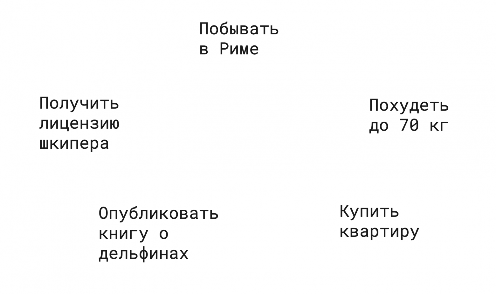
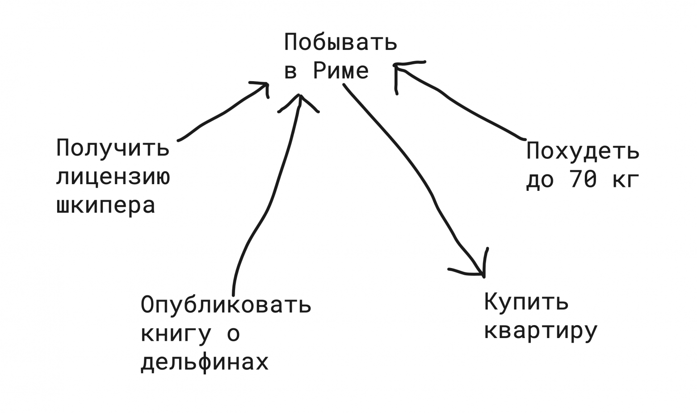
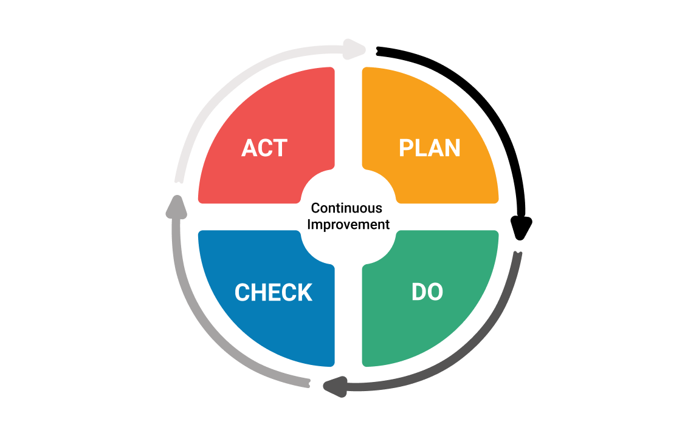

# Панель управления собой: 10 простых шагов к порядку в вашей жизни

Когда-то давно я написал на Хабр пост под названием "Как я победил прокрастинацию, узнал свои истинные желания, поставил четкие цели и достиг их". Несмотря на столь "желтый" заголовок, тот пост содержал довольно полезные советы по постановке целей и управлению личными задачами, и благодаря этому он был довольно тепло принят сообществом Хабра. Многие люди даже писали мне в соцсети про то, как этот пост помог им упорядочить свою жизнь. Однако, со времени публикации того поста многое изменилось.

Во-первых, я понял, что в то время я упускал из виду одну крайне важную деталь. Раньше я рассматривал постановку целей и управление задачами исключительно с точки зрения ума - методов и техник, полностью игнорируя сердце - эмоции, чувства и настроение. Как оказалось, это было фатальной ошибкой. Без согласования своих целей со своими внутренними ощущениями, без настройки гармонии с самим собой никакие методы и техники попросту не работают. Теперь я стараюсь соблюдать баланс между умом и сердцем при подходе к управлению задачами, и в этом посте расскажу про то, как это делать.

Во-вторых, я нашел и проверил на себе несколько новых инструментов личной эффективности, которые оказались весьма и весьма полезными. Ну и в-третьих, я использовал уже описанные в предыдущем посте инструменты достаточно долго, чтобы заметить, что работает хорошо всегда, а что сбоит или имеет некоторые неэффективности, и хочу поделиться с вами своими наблюдениями. Таким образом, пост, который вы сейчас читаете, это не просто улучшенная и расширенная версия предыдущего поста, а результат долгой работы по анализу собственного опыта использования методов и техник повышения собственной эффективности. Но сначала я хотел бы поговорить о той проблеме, что сподвигла меня в корне изменить свой подход к постановке целей и выполнению дел.

## Экзистенциальный кризис и выгорание

В жизни каждого работника ИТ-индустрии наступает момент, когда он/она начинает задаваться вопросами "Зачем я работаю над этими фичами?", "Имеет ли моя работа хоть какой-то смысл?". На такие вопросы человека наталкивает сама специфика работы в ИТ-сфере: многие проекты не доживают до запуска, многие из доживших закрываются спустя некоторое время после него, и даже в успешных проектах строчки кода удаляются или полностью переписываются спустя всего несколько лет после их написания. Постоянное исчезновение результатов собственного труда наталкивает людей на мысли о полной бессмысленностью своей работы.

Кроме того, большинство айтишников работают над тем, что по их собственному признанию они считают полным шлаком, а не чем-то хоть сколько-нибудь ценным. Например, строитель может показать сыну на здание и сказать: "Смотри, я участвовал в строительстве этого здания, теперь там живут эти люди", врач может показать сыну на людей и сказать: "Смотри, я вылечил этих людей, без меня они бы умерли", а фермер может показать сыну на тех же людей и сказать: "Смотри, я кормил этих людей долгие годы". А что может сказать среднестатистический программист? "Смотри, я сделал корзину товаров в этом онлайн-магазине меховых шуб", "Смотри я сделал кнопку в этом приложении для ведения бухгалтерии" или что еще хуже "Смотри, я запрограммировал рулетку в этом онлайн-казино"? А многим даже показать будет нечего, так как результат их работы превращается в пыль всего через несколько лет после создания.

Конечно, некоторые люди работают над чем-то интересным и полезным: кто-то программирует ракеты в SpaceX, кто-то пишет автопилот для машин Tesla, кто-то программирует медицинское оборудование, кто-то разрабатывает софт для заводских станков. Однако, даже эти люди не застрахованы от обесценивания результатов своего труда в своих собственных глазах. Что уж говорить о тех из нас, кого принято называть "формошлёпами" или "галерными гребцами".

Работа над не несущими никакой ценности в своих глазах проектами и скоротечность исчезновения результатов собственной работы приводят ИТ-шников к тому, что сейчас модно называть выгоранием, а до этого было известно как экзистенциальный кризис. Выгорание от осознания полной бессмысленности собственной работы ведет к затяжной депрессии, выбраться из которой у человека нет ни единого шанса. Ведь его крепко держат прутья золотой клетки - уход из ИТ влечет за собой сильное проседание в доходах.

Я испытал всё это на собственном опыте. Многие проекты, над которыми я работал, не дотянули до релиза, некоторые закрылись сразу после него, а другие выжили, но так и не выросли до чего-то большего. А те из моих рабочих проектов, что уже имели миллионы пользователей ещё до моего прихода, никогда не были мне особо близки, так как я не был их целевой аудиторией. Это сильно разочаровало меня в моей работе. А так как работа у меня, как и у большинства ИТ-шников, являлась одной из самых важных составляющих частей жизни, выгорание потихоньку распространилось и на всё остальное. Абсолютно всё стало бессмысленным, и ничего не хотелось делать.

Поэтому я начал искать путь, который выведет меня из этого экзистенциального кризиса и приведет меня к смыслу жизни, смыслу работы, смыслу всего. Спустя какое-то время я нашел его там, где совсем не ожидал - в той точке, из которой я начал свой поиск. И после этого всё обрело смысл. Кроме того, я обнаружил, что моя находка идеально сочетается с уже известные мне методами и техниками постановки целей и управления задачами, составляя вместе с ними единое целое, единый Путь, единое Дао.

Как мне кажется, следующие три параграфа с описанием первых шагов этого пути многим придутся не по душе. Они используют крайне нелюбимую многими лексику и выходят далеко за пределы квадратно-гнездового способа мышления, свойственного многим ИТ-шникам. Однако, несмотря на это крайне важно принять и понять написанное там, ведь эти три параграфа - центральная часть всего поста, это самое сердце того Пути, о котором я пишу. Вы можете забыть все следующие шаги после прочтения или выполнять их так, как вы считаете нужным, но тщательно выполнив первые три шага, вы встанете на Путь и не сможете с него свернуть, вы станете непобедимы.

## Шаг 1: Понять свое предназначение

Мой поиск смысла жизни привел меня к изучению западной и восточной философии. Наиболее близка мне оказалась философия буддизма, а в особенности одно из её основных направлений - дзен. То, что я напишу далее - это сильное упрощение этой философии. Причем настолько сильное, что можно даже сказать, что я искажаю её. Однако следующие несколько абзацев - это попытка вычленить и кратко выразить основную мысль этого учения.

С точки зрения буддийской философии ничто во всей Вселенной не имеет смысла. Ни работа, ни семья, ни познание, ни удовольствие - всё это не имеет смысла, всё это преходяще и непостоянно. Сколько труда и усилий не вкладывай в эти вещи, однажды они исчезнут и сгинут в небытие. Но это лишь примитивный уровень понимания.

Более высокий уровень понимания, выраженный как раз таки наиболее ярко в философии дзен, состоит в том, что всё во Вселенной и есть смысл. Абсолютно всё, сама жизнь, само существование - это всё и есть смысл. Каждое маленькое событие, каждая маленькая деталь - это смысл. Просто жить - это уже осмысленно.

Мы пришли в этот мир не по своей воле, мы не решали родиться нам или нет. Но теперь мы тут и должны решить, что делать дальше; понять, зачем мы здесь; определить для себя, каково наше предназначение. Именно предназначение - это основа Пути, всֿё остальное должно исходить из него. Методы постановки целей и техники управления задачами - это всֿё тактика, понимание своего предназначения - это стратегия. Без понимания своего предназначения, человек слеп и шатается туда-сюда, а с пониманием предназначения человек подобен выпущенной в цель стреле.

У каждого человека своё предназначение, однако основная черта у любого предназначения одна - служить людям. Эта философская идея в полной мере раскрывается в великолепном фильме "Мирный воин". В одной из сцен главный герой задает своему учителю сакраментальный вопрос: "Если ты такой умный, то почему работаешь на заправке?". В ответ на это сенсэй буквально в нескольких предложениях раскрывает всю суть философии дзен - то, что даже работу заправщиком можно рассматривать как служение людям.

Даже если вы программист, и приложением, над которым вы работаете, пользуется всего тысяча человек - вы делаете жизнь целой тысячи человек немножечко лучше. А это немало: тысяча человек - это количество учеников в среднестатистической школе. Просто представьте себе визуально тысячу человек - да ведь это целая площадь! Поймите как то, что вы делаете, служит этой тысяче человек, как делает их жизнь чуть лучше, проще и приятнее. И работая над этим приложением старайтесь думать об этих людях, старайтесь для них.

Вы можете служить не только своей работой, всё остальное тоже может восприниматься и делаться через призму служения людям. Семейные отношения - это служение своему супругу, детям и родителям. Общественная работа - служение соседям по дому и городу. Даже ваши хобби могут чем-то быть полезными другим - например, я воспринимаю публикацию своих научно-популярных статей по философии на Хабре как своего рода служение людям. Также вы должны служить и самому себе. Карьерный рост, зарабатывание денег, трата денег на себя - всё это должно рассматриваться вами как служение самому себе и своей семье.

Я хотел бы остановиться на этом моменте поподробнее и объяснить кое-что. Чаще всего люди, которые говорят о служении людям, подразумевают под этим идею служения другим людям, этакий полностью бескорыстный альтруизм. Я же говорю об идее служения всем без исключения людям, в том числе и самому себе. Более того, служение самому себе и своей семье - это более приоритетная задача, чем служение другим. Сначала нужно помочь самому себе, а потом помогать другим.

Как один из вариантов служения людям можно использовать благотворительность. Например, я поддерживаю российский благотворительный фонд "Арифметика Добра", который помогает детям из детских домов подтянуть знание школьных предметов, подготовиться к экзаменам и поступить в хорошие университеты. При этом благотворительность, на самом деле, работает довольно-таки эгоистически по отношению к дающему - и не только потому что ты чувствуешь себя психологически лучше, когда знаешь, что часть заработанных тобою денег пошла на благое дело, но и потому что благодаря действию кармического закона добро вернется тебе с избытком.

**Сделать шаг**:

- Подумайте о том, в чём состоит ваше предназначение, что у вас получается лучше всего и дается вам легко, и как это может служить людям
- Подумайте о том, как вы бы могли послужить самому себе и своей семье

## Шаг 2: Научиться слушать вибрации Вселенной

Вероятно вы сейчас подумали, что если предыдущий абзац был ещё терпим, то вибрации Вселенной - это уже чистая шизотерика. Я тоже так думал, пока не понял, о чём именно идет речь. Замечали ли вы когда-нибудь, что занимаясь любимым делом, время пролетает незаметно? В такие моменты весь внешний мир исчезает, остаетесь только вы и ваша работа. Вы сливаетесь воедино, становитесь неразделимы: вы - это то, что вы делаете, а то, что вы делаете - это вы. Можно сказать, что в такие моменты вы находитесь в резонансе с вибрациями Вселенной, вибрируете с ней на одной частоте. Но что это вообще за вибрации такие?

Во Вселенной действует никем не установленный, но математически строгий кармический закон, который гласит, что мы пожинаем плоды собственных действий. Этот закон не некая общая закономерность, вовсе нет. Этот закон - и есть сама Реальность. Если мы понимаем то, как работает эта самая Реальность, и совершаем правильные действия, то получаем от неё позитивный фидбек, она как бы "поощряет" нас. Если же мы не полностью понимаем законы работы Реальности и нарушаем их, то мы получаем от неё негативный фидбек, она как бы "наказывает" нас. Этот самый фидбек и называют словом "вибрации".

Если мы делаем всё правильно и у нас правильный настрой, то мы чувствуем, что Вселенная как будто бы помогает нам - всё идет как по маслу, неожиданно открываются новые возможности, и все дела получаются как бы сами собой. Если же мы делаем что-то неправильно и с неправильным настроем, то мы чувствуем, что Вселенная как будто бы мешает нам - кажется, что всё против нас, на пустом месте возникают неожиданные проблемы, ничего не получается. Метафорически говоря, если мы "вибрируем" на правильной частоте, то мы вступаем в резонанс с вибрациями Вселенной и она подбадривает нас: "Так держать!". Если же мы "вибрируем" неправильно и сбивчиво, то Вселенная говорит нам: "Так не пойдет! Исправься!", а в некоторых случаях даже начинает кричать на нас. Можно сказать, что Вселенная разговаривает с нами событиями нашей жизни.

Мы вступаем в резонанс с вибрациями Вселенной тогда и только тогда, когда следуем своему предназначению. Таким образом, прислушиваясь к тому, что именно говорит нам Вселенная, мы можем узнать свое предназначение. Ведь именно это она и пытается нам сообщить. Если вы занимаетесь каким-то делом или проектом, и оно никак не идет, или с вами в это время случается что-то очень плохое, остановитесь, подумайте, почему именно Вселенная вас не пускает туда, куда вы пытаетесь идти. Может быть, стоит что-то исправить в вашем подходе? Может быть вам вообще не стоит туда идти?

Чем больше позитивных вибраций вы получаете от Вселенной, тем большим количеством энергии вы наполняетесь. Энергия - это ваш настрой, ваша готовность к действию, ваша мотивация. Время и энергия - вот два ваших основных ресурса. При этом, энергия несоизмеримо важнее времени: замечали когда-нибудь, что времени вроде бы много, а дела не делаются и ничего не движется, вам ничего не хочется - это сказывается недостаток энергии. С наличием энергии вы за один час можете сделать больше, чем за целую неделю без неё. Именно энергия - это то, что помогает нам вставать по утрам, встречать новый день и сворачивать горы. Но кроме энергии, чтобы вставать по утрам, нужно иметь кое-что ещё - понимание своего предназначения, понимание того, зачем вы вообще встаете с кровати каждый день своей жизни.

Чтобы понять то, о чем я говорю, посмотрите короткий фильм "Побеждай, любя" от проекта "Люби, что делаешь". В нём успешные предприниматели рассказывают о том, как они строили свои бизнесы, основываясь исключительно на ценностных установках "успешного успеха". Их бизнесы росли, они открывали десятки филиалов и увеличивали прибыль, однако в конце-концов все как один сталкивались с одной и той же проблемой. Несмотря на то, что внешне они выглядели как пример абсолютного успеха, внутри они были глубоко несчастными и выгоревшими людьми, а их энергетические баки были полностью опустошены, что в итоге крайне негативно сказывалось в том числе и на успехе их дела. Только после долгой работы над настройкой внутренней гармонии, этим людям удалось вернуться к своим бизнесам и начать вести свои дела в полном согласии с самими собой.

Правильная работа с энергией - это самая важная составляющая успеха, ведь энергия - это то топливо, на котором вы работаете. Как машина не едет без бензина, так и вы ничего не сможете сделать без энергии. Понимание этого я упускал раньше, считая определение и достижение целей исключительно механическим процессом. Мой опыт показал, что это была крайне глупая ошибка.

**Сделать шаг**:

- Вспомните моменты, когда вы сливались с тем, что вы делаете, тем самым вступив в резонанс с вибрациями Вселенной
- Вспомните моменты, когда у вас всё шло как по маслу, будто бы сама Вселенная вам помогала. С каким настроем вы тогда подходили к делу? Какие действия к этому привели?
- Вспомните моменты, когда всё было будто бы против вас, будто бы сама Вселенная не хотела, чтобы у вас получилось. С каким настроем вы тогда подходили к делу? Какие действия к этому привели? Отрефлексируйте, почему именно тогда Вселенная вас не пускала туда, куда вы хотели.
- Вспомните те дни, когда вы сделали целую кучу дел за короткое время. Какой уровень энергии у вас тогда был? Откуда тогда вы получили этот заряд? Что наполнило ваш "топливный бак"?
- Вспомните моменты, когда вы месяцами откладывали элементарные дела в долгий ящик. Какой уровень энергии у вас тогда был? Почему ваш бак был на нуле? Куда она делась?

## Шаг 3: Обрести мечту

Я был не до конца уверен стоит ли вписывать этот пункт в свой пост, ведь я сам ещё не выполнил его. Однако сама Вселенная подсказала мне ответ: за день до того, как я почти закончил писать этот пост, проект "Люби, что делаешь", чей фильм я порекомендовал вам в предыдущем параграфе, выпустил новое видео - как раз таки о мечтах. Мысли, высказанные в этом микрофильме, выражали то, что я пытался сформулировать долгое время.

Начнем с казалось бы простого вопроса - есть ли у вас мечта? Если честно, я и сам пока не могу ответить на него положительно. И думаю, многие из вас, мои дорогие читатели, тоже не найдут внутри себя ответа "да" на этот вопрос.

Но вспомните, как мы мечтали, будучи детьми? У нас были возможно глупые и наивные, но настоящие мечты. Мы верили в них, и в нашем сознании они представлялись нам чистым и сияющим идеалом. А потом, став взрослыми, мы их забыли, забыли наши мечты. Вернее даже будет сказать, что мы их не забыли, а перестали в них верить. "Это невозможно", "эта возможность упущена" ,"я уже слишком стар для этого" - такую позицию мы внушаем сами себе. Мы сами заковываем себя в цепи.

В своем воображении я представлял себе жизнь как множество разветвляющихся дорог: одна дорога разветвляется на две, каждая из этих двух чуть поодаль тоже расходится на две поменьше, и так далее. И я думал, что с каждым разом, когда я выбираю какую-то одну из этих двух дорог на развилке, количество вариантов для меня сокращается вдвое, и часть возможностей, связанная с той дорогой, по которой я не пошел, для меня закрывается. Это отчасти верно, но такое мышление сковывает и уничтожает возможность мечтать.

Как-то давно я смотрел старое интервью одного извесного российского буддолога - ныне покойного Александра Моисеевича Пятигорского. В этом интервью Пятигорский произнес несколько фраз, которые я тогда, если честно не понял. Он сказал, что самая тяжелая работа в жизни - это освобождение. Теперь я понимаю, о каком именно освобождении говорил Пятигорский - не от тех оков, что накладывают на человека обстоятельства, не от тех оков, что накладывают другие люди, а от тех оков, которые на человека накладывает его собственный ум, его собственное мышление.

Нужно освободиться от своих отговорок о том, что "это невозможно", "возможность упущена", "я уже слишком стар для этого". Нужно понять, что на том Пути, по которому мы идем, конечно же много разветвлений, однако выбор одной из нескольких троп на развилке не сокращает их общее количество, ведь этих троп бесконечно много. Половина от бесконечности - это всё ещё бесконечность.

Только освободившись от этих клеш, мы сможем заново обрести мечту и вернуть себе то чувство её ярчайшего сияния, которое у нас когда-то было в детстве. В этот момент понимание собственного предназначения и умение слушать Вселенную сольются воедино, и возникнет мечта - та самая цель нашего Пути, путеводная звезда нашего предназначения. Она придаст нам сил, подарит нам крылья, сделает нас непобедимыми. Именно это самая трудная задача всей жизни, но она того стоит.

**Сделать шаг**:

- Вспомните, о чём вы мечтали в детстве
- Подумайте, какая мечта может соответствовать вашему предназначению

## Шаг 4: Определить желания

Перед тем, как начать двигаться к целям, нам нужно их поставить. А чтобы поставить цели, нужно сначала определить свои желания, которые являются как бы "зародышами" целей. И тут у вас может возникнуть вопрос: о каких таких желаниях я говорю, если предыдущие три параграфа я втирал вам про предназначение и служение людям?

Всё дело в том, что в нашей культуре само слово "желание" имеет слегка отрицательную коннотацию, тесно связанную с негативным отношением к слову "эгоизм". Однако, если посмотреть на это с точки зрения служения людям, то становится видно, что большую часть наших желаний можно рассматривать как служение себе или другим. Например, желание купить себе красивой одежды можно рассматривать как служение самому себе, желание вырасти в карьере и начать зарабатывать больше как служение себе и своей семье, чей уровень жизни улучшится, а желание сделать крутой проект и заработать на нем кучу денег как служение людям, ведь люди платят деньги за то, что они считают полезным и ценным.

Для определения своих желаний, которые позже мы превратим в цели, можно применять несколько техник, эффективность которых я проверил на собственном опыте.

### Техника 1: На смертном одре

Представьте себя старым: вы лежите в постели при смерти и понимаете, что осталось жить вам совсем недолго. У вас остается немного времени, чтобы подумать о прожитой жизни. О чём вы вспомните? Я думаю, точно не о разработанных фичах и исправленных багах. О каких недоделанных делах вы будете думать в этот момент? О чём, что не успели попробовать, будете жалеть? А что будете вспоминать с теплотой? Подумайте хорошенько.

То, о чём вы, по вашему мнению, будете жалеть в этот момент - это ваши желания. То, о чём будете вспоминать с теплотой - это подсказки о том направлении, в котором нужно идти. А недоделанные дела, о которых будете думать - ваши стратегические цели. С помощью этой "предсмертной" техники вы можете понять то, чего вам действительно хочется, и то, какие глобальные цели вы считаете важными для себя - выпишите их себе на листок в виде списка. Но у этой техники есть один недостаток - когда времени до смерти еще много, вам кажется, что вы все успеете и откладываете все на потом.

### Техника 2: Смертельный диагноз

Следующая техника с "предсмертным" вопросом более действенна. Представьте себе, что вы вдруг почувствовали себя плохо, пошли к больницу, и там вам поставили смертельный диагноз. Врачи сказали вам, что жить вам осталось всего-лишь один месяц. Вас не спасти. Подумайте, что вы попытаетесь обязательно успеть в этот отмерянный вам месяц?

Самое важное в этой технике не просто представить себе эту ситуацию, а прочувствовать её, поверить в неё. Вам необходимо действительно прочувствовать ощущение приближающегося конца. Тогда вам откроются ваши самые сокровенные желания - то, что не дает вам покоя; то, чего вы страстно желаете, но ограничиваете себя в этом. Я называю их гештальт-желаниями - они существуют в нашем подсознании и их очень важно закрывать, ведь невыполненные, они помаленьку вытягивают из нас энергию.

### Техника 3: Свобода и богатство

Теперь представьте себе, что вы вдруг безумно разбогатели, и вам стало не нужно работать, чтобы жить. Кроме того, вы можете позволить себе заткнуть деньгами любые проблемы и сбросить с себя все ваши обязательства. Теперь вы полностью свободны, вас ничего не держит, и у вас достаточно денег для чего угодно. Чем бы вы занялись?

В отличии от первых двух техник, выявляющих самые сокровенные желания, эта техника позволяет вспомнить ваши мечты.

### Техника 4: Колесо баланса

Часто так бывает, что мы отдаем приоритет каким-то одним областям нашей жизни, полностью игнорируя другие - например, концентрируемся на карьере, но забываем о здоровье. Однако для действительно счастливой и полноценной жизни нам нужен баланс между всеми областями нашей жизни. Для поиска такого баланса служит следующая техника, которую обычно называют "Колесо баланса". Мы не будем рисовать само колесо, а ограничимся лишь списком областей.

Возьмите лист бумаги и выпишите в столбик слева список областей жизни:

- Карьера (карьерный рост, увеличение зарплаты, улучшение условий труда, достижения на текущей работе)
- Финансы (финансовое благополучие, увеличение состояния, составление инвестиционного портфеля, покупка недвижимости)
- Здоровье и внешний вид (состояние здоровья, уход за собой, состояние тела и фитнес)
- Семья и отношения (отношения с мужем/женой или парнем/девушкой, секс, досуг с семьей, время с детьми)
- Саморазвитие (книги, курсы, изучение чего-то нового)
- Отдых и развлечения (путешествия, любимое дело, игра в видеоигры)
- Творчество (хобби, общественные проекты, благотворительность)
- Общение (друзья, родственники, нетворкинг, хождение на различные мероприятия)

В случае необходимости вы можете добавить в этот список что-то своё, однако убирать из него ничего не стоит. Кроме того, не стоит распыляться и добавлять в него что-то очень конкретное вроде "занятие теннисом" - почти любое занятие можно отнести к уже имеющейся в этом списке области жизни. А далее сделайте следующее:

- Хорошенько подумайте, пройдитесь по списку и проставьте справа от каждого пункта свою оценку вашего собственного состояния в данной области по десятибалльной шкале - например, "Внешний вид 4/10" или "Общение 2/10" и так далее.
- Напишите рядом с каждой оценкой, что лично для вас означает десятка на этой шкале - например, "Внешний вид 4/10, где 10 - это иметь тело как мужчина с обложки Men's Health и одеваться как Дэвид Ганди".
- Напишите, что значит для вас ваша текущая оценка - например, "Внешний вид 4/10, где 10 - это ..., а 4 - это лишний вес, плохо сидящая одежда, давно не стриженные волосы, недельная небритость и прыщи на левой щеке".
- Осознайте расстояние между текущей оценкой и десяткой и напишите, что означает оценка, следующая за вашей текущей, то есть, текущая плюс один - например, "Внешний вид 4/10, где 10 - это ..., а 4 - это ..., а 5 - это нормальная стрижка, вес на пять килограмм меньше, новая одежда из магазина, выбритое лицо".

Таким образом у вас получится список категорий, каждая из которых будет выглядеть как-то так: "Внешний вид - это 4/10, где 10 - это ..., 4 - это ..., 5 - это ...". После этого вам останется только выписать расстояние между вашим текущим положением на шкале и следующим делением в виде желания - например: "Улучшить внешний вид (подстричься, побриться, сбросить пять килограммов, купить новую модную одежду)".

Для наглядности все эти категории в технике "Колесо баланса" изображают в виде секций на круговой диаграмме, на которой отлично видны ваши слабые места - те области, которым вы уделяете мало внимания и которые нужно подтянуть. Именно такое изображение колеса баланса вы можете увидеть на заглавной картинке текущего параграфа.

С помощью этих нескольких простых техник вы сможете сделать самое главное - составить список своих желаний, которые чуть позже мы превратим в конкретные цели.

**Сделать шаг**:

- Возьмите лист бумаги и озаглавьте его "Желания"
- Возьмите лист бумаги для черновика
- Выполните технику "На смертном одре" и выпишите свои сокровенные желания на этот лист
- Выполните технику "Смертельный диагноз" и выпишите свои сокровенные желания на тот же лист
- Выполните технику "Свобода и богатство" и выпишите желания-мечты
- Выполните технику "Колесо баланса" на черновике и выпишите желания по каждой категории на тот же лист
- Пронумеруйте все желания в списке

## Шаг 5: Приоритизировать желания

После того, как мы составили список своих желаний, мы обязательно должны приоритизировать его по степени важности, чтобы не распылять наши силы на все пункты сразу. Однако сделать это с наскоку бывает не легко - трудно понять, что поставить наверх, а что задвинуть вниз. Справиться с этой проблемой нам поможет техника под названием "Звезда приоритетов".

Предположим, после выполнения предыдущего шага у нас получился следующий список желаний:

- Побывать в Риме
- Похудеть до 70 кг
- Купить квартиру
- Опубликовать книгу о дельфинах
- Получить лицензию шкипера

Выпишем их из списка на лист бумаги в форме невидимого круга:

Возьмем первое желание и сравним его со всеми остальными по степени важности - сравнив, проведем стрелку, наконечник которой направлен к тому желанию, которое мы считаем важнее. Предположим, что желание побывать в Риме я считаю более важным, чем получить лицензию шкипера, опубликовать книгу о дельфинах и похудеть до семидесяти килограмм, но менее важным, чем желание купить квартиру. Тогда мой рисунок получится таким:

После этого двинемся по часовой стрелке и для каждого последующего желания проделаем то же самое. Тогда в конце концов у нас получится подобный рисунок, чем-то напоминающий звезду:

У каждого из N желаний должно получится по `N - 1` стрелки. В нашем случае у каждого из 5 желаний по 4 стрелки. Теперь подсчитаем количество входящих стрелок у каждого желания:

Чем больше входящих стрелок у желания, тем более оно приоритетно. Таким образом, отсортировав желания по количеству стрелок, мы получим приоритезированный список наших желаний:

- Купить квартиру
- Побывать в Риме
- Получить лицензию шкипера
- Похудеть до 70 кг
- Опубликовать книгу о дельфинах

**Сделать шаг**:

- Возьмите лист бумаги и озаглавьте его "Приоритет желаний"
- Возьмите несколько листов бумаги для черновика
- Выполните технику "Звезда приоритетов" на черновике и выпишите на чистовик ваши желания в виде отсортированного по приоритету списка

## Шаг 6: Отбросить лишние желания

В самом конце XIX века итальянский инженер и экономист Вильфредо Парето заметил интересную закономерность: в любом деле 20% затраченных усилий дают 80% результата, а на оставшиеся 20% результата уходит 80% усилий. Исследуя различные области человеческого знания, он находил эту закономерность повсюду: в биологии, в экономике и даже в личном преуспевании. В честь первооткрывателя это соотношение 20/80 называют принципом Парето.

Похожее соотношение встречается и в блуждающей по Интернету притче об американском миллиардере Уоррене Баффете и его личном пилоте Майке Флинте:

> Как-то раз Баффет неожиданно понял, что его личный пилот Майк Флинт работает на него уже более 10 лет. Финансист решил узнать, каковы дальнейшие планы Майка, и как он сам может помочь ему в их достижении.
>
> Баффет попросил Майка составить список из 25 целей, которых Флинт желал бы достичь в обозримом будущем. Затем он поручил Майку отсортировать их в порядке значимости и обвести пять самых важных. Второе задание оказалось более трудным, чем первое, но в итоге пилот с ним справился. После того, как всё было сделано, Баффет спросит у Майка:
>
> - Что ты собираешься делать с оставшимися 20 делами?
> - Ну, первые пять дел для меня важнее всего, но и остальные двадцать имеют почти такое же значение. Их тоже надо делать, и я займусь ими, когда увижу, что у меня наметился прогресс в достижении первых пяти задач. Они не такие срочные, но я по-прежнему планирую уделять им время
> - Всё, что ты не обвел, только что стало твоим списком под названием Избегать-Любой-Ценой. Неважно, что это — эти дела не получат никакого внимания от тебя до тех пор, пока ты не добьешься успеха с твоими делами из топ-5

Мы приоритезировали наши желания по важности не просто так. Мы сделали это для того, чтобы иметь возможность отбросить всё лишнее, следуя правилу 5/25 Баффета, не распылять силы на всё по чуть-чуть, а сконцентрироваться на достижении самого важного из наших целей. При этом мы не должны выбрасывать не вошедшие в шортлист желания, нам нужно просто отложить их и не вспоминать о них, пока мы не достигнем всех целей из нашего топ-5.

**Сделать шаг**:

- Возьмите лист бумаги и озаглавьте его "Топ 5 желаний"
- Перепишите первые 5 желаний из результата предыдущего шага на новый лист

## Шаг 7: Конкретизировать желания и превратить их в цели

Вы замечали, что вам гораздо легче сделать что-то, если это что-то сформулировано четко и понятно, и гораздо тяжелее, если описание расплывчато и неконкретно? То же самое работает и с желаниями - нам будет гораздо легче удовлетворить их, если они будут правильно сформулированы.

Поэтому после того, как мы определились с нашими желаниями и отсортировали их по приоритету, нам нужно конкретизировать их и превратить их в четкие цели. Это делается с помощью техники под названием "SMART". Нам нужно пройтись по каждому желанию из нашего списка и сформулировать их таким образом, чтобы они удовлетворяли критериям, соответствующим каждой букве из аббревиатуры "smart":

- S - specific - конкретная: цель должна быть сформулирована как предложение с использованием совершенной формы глагола. То есть, цель должна отвечать на вопрос "что сделать?", а не на вопрос "что делать?". К примеру, цель "поучить английский" не соответсвует этому критерию, а "выучить правила употребления present simple" соответствует.
- M - measurable - измеримая: цель должна быть измеримой в конкретных единицах или в виде чеклиста. К примеру, цель "выучить правила употребления present simple" не соответствует этому критерию, а вот цель "пройти тест на знание present simple минимум на 90 баллов из 100" соответствует.
- A - attainable - достижимая: цель должна быть достижимой при имеющихся ресурсах и исходя из текущего положения. К примеру, цель "пройти тест на знание present simple минимум на 90 баллов из ста", если вы не знаете даже английского алфавита, недостижима. Соответственно вы должны подумать над более простой целью.
- R - relevant - уместная: цель должна иметь смысл, то есть быть шагом к какой-то более глобальной цели или согласоваться с определенным вами в первом шаге предназначением. Вы должны понимать, зачем вам её достигать. К примеру, цель "пройти тест на знание present simple минимум на 90 баллов из 100" должна иметь смысл, вы должны понимать, зачем вообще вы учите английский. Если вы отвечаете на этот вопрос как-то так: "ну все учат, и я учу", то ваша цель не соответствует этому критерию, и вам лучше отказаться от неё и не тратить силы на её достижение.
- T - time-bound - ограниченная по времени: у цели должен быть срок истечения, после которого она считается невыполненной. К примеру цель "пройти тест на знание present simple минимум на 90 баллов из 100" не соответствует этому критерию, а "пройти тест на знание present simple минимум на 90 баллов из 100 до 5 февраля 2022 года" соответствует.

Сформулировав свои желания в соответствии с этими пятью критериями, вы превратите их в четко определенные и понятные цели. Однако, будьте предельно осторожны с последним критерием - привязкой ко времени. Я предпочитаю не ставить ограничение по времени на цели, которые не являются действительно срочными, и сейчас объясню почему.

Представьте себе, что вы поставили себе цель "убраться на балконе к понедельнику". Однако, это ограничение "к понедельнику" является искусственным - оно не продиктовано неотвратимой необходимостью, то есть внешними стимулами. Если вы не уберетесь на балконе к заданному сроку, то мир не сгорит в огне, вы не лишитесь работы и средств к существованию, не произойдет вообще ничего. Поэтому вполне возможно, что вы поленитесь или потратите своё время на более приоритетные задачи и так и не уберетесь на балконе к понедельнику.

Ничего фатального из-за недостижения этой цели к заданному сроку не произойдет, но эта задача останется в вашем таск-менеджере. Она будет постоянно напоминать вам о своем существовании и станет вашим гештальтом - недоделанным делом, о котором вы помните, которое бесит вас своей незавершенностью и напоминает вам о вашем провале. Гештальт будет высасывать из вас энергию, хорошее настроение и мотивацию продолжать что-то делать. Из-за этого вы будете лениться, прокрастинировать и проваливать другие привязанные ко времени цели, тем самым еще больше плодя гештальты. Спустя какое-то время после попадания в эту гештальт-воронку вы обнаружите, что находитесь на самом дне пропасти, заваленные кучей недоделанных дел, с опустошенным энергетическим баком, убитой мотивацией и ненавистью к себе.

Чтобы не попадать в эту воронку, нужно с огромной осторожностью решать, нужно ли ограничивать каждую конкретную цель во времени или нет. Несмотря на этот нюанс, в целом SMART-критерии отлично помогают сформулировать четкие и понятные цели из расплывчатых описаний наших желаний.

**Сделать шаг**:

- Возьмите лист бумаги и озаглавьте его "Цели"
- Пройдитесь по вашему списку желаний и с помощью SMART-критериев превратите их в чёткие цели

## Шаг 8: Определить путь до целей

Вы замечали, что вам гораздо легче приступить к какой-либо задаче, если её выполнение требует минимальных усилий, и вы хорошо понимаете, как именно её делать? К чему-то большому и требующему анализа перед выполнением так просто не подступишься. Почему так происходит?

Всё дело в том, что человеческий мозг в процессе мышления потребляет колоссальное количество энергии. Израильско-американский психолог Даниэль Каннеман в своей знаменитой книге "Думай медленно. Решай быстро" приводит пример, иллюстрирующий эту особенность: если идущего человека попросить произвести в уме некое элементарное арифметическое вычисление, например, перемножить два двухзначных числа, то чтобы сделать это человек будет вынужден остановиться, так как у организма не хватит "мощности" для того, чтобы одновременно снабжать энергией и мозг, и опорно-двигательный аппарат.

Известный российский специалист по продуктивности Максим Дорофеев метафорически называет энергию, требуемую мозгом для глубоких размышлений, мыслетопливом. Согласно исследованием Каннемана, описанным им в "Думай медленно. Решай быстро" человеческий мозг может работать в двух основных режимах - медленном и быстром. Медленное мышление мы используем, когда решаем задачи, анализируем что-то, продумываем планы, поэтому оно потребляет гигантское количество мыслетоплива за короткое время. А быстрое мышление мы используем для повседневных нужд; это дефолтный режим работы нашего мозга, поэтому оно потребляет совсем немного мыслетоплива в секунду.

Наш организм всегда пытается оптимизировать количество потребляемого мыслетоплива, поэтому он всеми силами противостоит включению режима медленного мышления, а когда тот включен, то пытается как можно быстрее отключить его. Именно из-за этой особенности организма возникает прокрастинация: мы пытаемся сделать что-то, что требует вдумчивости и концентрации, то есть медленного мышления, а наш организм, если у нас в данный момент недостаточно мотивации делать это что-то, переключает наш мозг обратно в режим быстрого мышления и отправляет смотреть ютубчик или читать Хабр. Но, может быть, мы можем обмануть наш организм и сломать механизм прокрастинации?

Конечно, это возможно. Более того, это достаточно просто - нам всего-лишь нужно разделить достижение целей на две стадии - стадию планирования и стадию исполнения запланированного. Для планирования мы на непродолжительное время задействуем медленное мышление и разобьем путь до наших целей на большое количество мелких последовательных шагов, каждый из которых должен быть достаточно прост и хорошо сформулирован, чтобы его исполнение не потребовало бы включения медленного мышления вообще. После этого мы будем постепенно исполнять каждый из шагов получившегося алгоритма в обычном режиме работы нашего мозга. После выполнения каждого шага мы должны вычеркивать его из списка - это позволяет нам закрыть гештальт и придает огромную психологическую мотивацию продолжать путь к цели, то есть подзаправляет наш энергетический бак. А как я уже писал, энергия - это самое главное для достижения целей.

Формально формулировка каждого из шагов к цели, как и сама цель, должен соответствовать описанным мною в предыдущем параграфе критериям SMART. Однако, в реальной жизни почти никто этим не заморачивается. А теперь давайте обратимся к примеру.

Предположим у нас есть цель "Съездить в Рим" - хоть она и сформулирована достаточно четко, нам все же трудно приступить к её достижению, ведь непонятно с чего начать. Для того, чтобы стало легче, нам нужно сконцентрироваться ненадолго и разбить эту цель на элементарные шаги, исполнение каждого из которых не требует включения головы вообще. Например, так:

- Зайти на aviasales.ru и купить билеты до Рима с не больше чем одной пересадкой на 13-17 февраля
- Зайти на booking.com и снять отель в Риме на 13-17 февраля не дороже, чем за $100 за ночь
- 12 февраля собрать сумку с четырьмя парами трусов, носков, двумя парами штанов, четырьмя рубашками, паспортом, дезодоратном, зубной щеткой и пастой, ....
- 13 февраля вызвать такси и доехать до аэропорта и улететь в Италию
- 14 февраля посмотреть Колизей и Пантеон
- 15 февраля посмотреть Ватикан
- 16 февраля посмотреть пинакотеку, купить сувениры
- 17 февраля вызвать такси, доехать до аэропорта и улететь домой

Таким образом, мы превращаем смутную цель "съездить в Рим" в четко расписанный алгоритм, каждый шаг которого досконально определен и не требует мышления вообще. После этого нам остается только абсолютно бездумно, шаг за шагом исполнять получившуюся последовательность действий.

Описанный мною метод лежит в основе известной методики достижения целей под названием GTD, что расшифровывается как Getting Things Done. Я рекомендую вам посмотреть прекрасное выступление Руслана Фазлыева на конференции 404, в котором он просто и подробно разъясняет, как именно работает эта методика, и как нужно разбивать путь до цели на крошечные шаги.

**Сделать шаг**:

- Возьмите чистые листы для каждой из целей из вашего списка
- Распишите путь до каждой цели на последовательность из элементарных и не требующих умственной деятельности шагов

## Шаг 9: Прийти к целям

Теперь, после того, как мы определили свои желания, превратили их в четкие цели и разбили путь до целей на элементарные шаги, нам осталось только одно - пройти эти шаги. Можно просто выполнять их один за другим, а можно использовать специальную технику под названием Pomodoro, чье название с итальянского переводится как "помидор" и символизирует популярную модель кухонных таймеров в виде помидора.

Техника "Помодоро" заключается в том, что мы ставим таймер и разбиваем наше время на промежутки по 25 минут работы и 5 минут отдыха: 25 минут поработали, 5 минут отдохнули, 25 минут поработали, 5 минут отдохнули, и так далее. После каждых 4 помидорок мы делаем большой перерыв на полчаса-час отдыха. Во время каждой рабочей помидорки мы стараемся ни на что не отвлекаться и концентрироваться на выполнении задачи, а в пятиминутку отдыха отходим от компьютера или рабочего места и даем себе отдохнуть. Почему же эта техника так эффективна?

Всё дело в том, что нам часто бывает трудно начать что-то делать. Перед нами лежит длинный список задач, и нам просто психологически трудно приступить к их выполнению. Писатели, многие из которых кстати пользуются техникой "Помодоро" для написания своих книг, называют это состояние проблемой чистого листа: перед автором лежит чистый лист бумаги или текстового редактора, и ему совершенно ничего не приходит в голову, ему, так сказать, не пишется. Но стоит только написать пару предложений, как автор входит в поток, и его уже нельзя остановить. Нечто подобное происходит и при использовании техники "Помодоро" - стоит только начать выполнять задачи, как дело сразу же пойдет как по маслу. Кроме этого, техника "Помодоро" принуждает человека не забывать и об отдыхе, ведь отдых и восполнение энергии делает труд человека более эффективным.

Но нужно признаться, что сам я не злоупотребляю техникой "Помодоро", а использую её только чтобы разгрести завалы - когда есть куча мелких дел, которые накопились в личном таск-трекере, и нужно их все разом позакрывать. Я пытался внедрить "Помодоро" в качестве ежедневного инструмента несколько раз, но каждый раз отказывался от этой затеи. Поэтому обычно я просто выполняю шаги к своим целям без каких-либо дополнительных методик.

Кроме того, за долгое время использования практик личной эффективности я понял важную вещь: не нужно переусердствовать и пытаться превратить себя в этакого робота, "машину продуктивности". Это нормально, что в один день есть вдохновение сделать десяток дел, в другие дни есть силы только на одно-два дела, а иногда и вовсе ни на одно. Также я осознал важность отдыха и здорового долгого сна - отдохнувший человек имеет гораздо больше топлива в своем энергобаке. Более того, я понял, что важно не только отдыхать, но и менять род деятельности, отвлекаться от текущей задачи, устраивать себе этакий шаббат, во время которого голова очищается для новых идей, и ваш энергобак наполняется для новых свершений. В общем, все те советы, которые давали нам родители и школьные учителя, оказались совершенно верными. Жаль только понимание этого приходит не сразу.

Ну и главное из того, что я понял за это время, так это то, что не нужно корить себя за провалы и за то, что ты недостаточно продуктивен. Это только сжигает мотивацию и опустошает энергобак. Нужно учиться жить в гармонии с самим собой, а не стараться быть "машиной продуктивности".

**Сделать шаг**:

- Выполняйте шаги до ваших целей и вычеркивайте каждый после выполнения. Можете использовать технику Помодоро, а можете и не использовать

## Шаг 10: Добавить рутины и метарутины

После того, как мы определились с алгоритмом постановки и достижения целей, нам нужно ввести в свою жизни ещё один крайне полезный инструмент - рутины, или как их ещё можно назвать привычки. Это задачи, которые повторяются в определенный промежуток времени и помогают нам держаться заданного курса. Все рутины можно условно разделить на несколько типов.

- Первый тип рутин - это периодические напоминания о необходимости сделать что-либо. К примеру, у меня есть еженедельная рутина проверки почтового ящика, ежемесячная рутина отправки парковочных талонов на возмещение от компании, ежегодная рутина обновления страховки на машину. Такие напоминания позволяют мне рутинизировать все мои периодические дела и забыть о них в остальное время. Я снял с себя необходимость задумываться о почтовом ящике, о страховке на машину и о парковочных талонах; я делегировал это своему таск-трекеру.
- Второй тип рутин - это периодические задачи, необходимые для продвижения к своим целям или для сохранения текущего уровня на колесе баланса. К примеру, у меня есть еженедельная рутина ухода за собой: раз в неделю я бреюсь, чищу уши, стригу ногти, подстригаю усы и провожу ещё множество регулярных гигиенических процедур. Также у меня есть две еженедельные рутины занятия спортом. Обе этих рутины помогают мне удерживать текущий уровень и потихоньку продвигаться по секции "Внешность" в моём колесе баланса.
- Третий тип рутин - это периодические замеры данных о продвижении к целям. Для каждой долгосрочной цели крайне важно знать своё текущее положение и тренд движения. К примеру, у меня есть ежемесячная рутина получения данных о том, сколько сейчас у меня денег и прочих финансовых активов в различных местах, вычисление итоговой суммы и занесение этих данных в специальную эксель-табличку. Благодаря этой рутине я всегда остаюсь в курсе своего текущего финансового положения и вижу тренд накопления/траты своих денег.

Вы можете пройти через все секции описанного в четвертом шаге колеса баланса и для каждой секции создать себе две-три рутины, соответствующих секции. А теперь давайте перейдем к кое-чему ещё более важному - метарутинам, и тому зачем они вообще нужны.

Описанные в предыдущих параграфах методы и техники постановки и достижения целей в совокупности составляют единый пошаговый алгоритм. Однако, самое важное для успешного применения этого алгоритма - это не то, как он устроен, а то, как мы работаем над его настройкой и улучшением. Мы должны постоянно проверять, хорошо ли он работает в текущий период нашей жизни, и по необходимости корректировать его. Я называю этот процесс проверки и коррекции словом "метарутина".

Метарутины работают по аналогии с обычными рутинами. Я добавляю в свой таск-трекер повторяющуюся в определенный промежуток времени задачу с описанием того, что именно нужно проверить, и какие действия предпринять по результатам проверки. Таким образом, мой алгоритм работы напоминает цикл Деминга, более известный как Plan-Do-Check-Act:

- Plan - постановка целей и планирование задач
- Do - выполнение задач
- Check - анализ ошибок и недостатков метода работы
- Act - внесение коррективов в метод работы

Этот циклический процесс по одновременному следованию алгоритму и его непрестанному усовершенствованию придает нашему Пути необходимую для реальной жизни гибкость. Без этой гибкости и подстроения алгоритма продуктивности конкретно под вас, все описанные мною методики вроде GTD, Pomodoro и SMART-целей не принесут нужного результата.

- Постановка целей - ежемесячная метарутина по постановке целей в соответствии с описанными в этом посте шагами 4,5,6,7 и 8.
- Расчистка таск-трекера - ежемесячная метарутина по расчистке таск-трекера от мусора. Несмотря на чистоплотность и аккуратность, за месяц мой таск-трекер становится похож на помойку из недоделанных задач, незакрытых дел, ложных целей и бессмысленных проектов. Для борьбы с этим я раз в месяц расчищаю таск-трекер от мусорных тасков и трачу несколько помидорок на закрытие мелких задач, которые я мог бы сделать за несколько минут, но откладывал их выполнение целый месяц.
- Коррекция алгоритма - ежемесячная метарутина по анализу того, как в этом месяце работал алгоритм постановки и достижения целей, и размышлению о том, не нужно ли изменить в нем что-то.
- Коррекция рутин - ежемесячная метарутина по анализу рутин. Если какую-то из запланированных рутин я не выполнял несколько раз подряд или даже ни разу за прошедший месяц, то я размышляю над причинами этого. Почему я не был достаточно мотивирован на её выполнение? Что теперь с ней делать? Удалить её? Или подумать, как изменить свой подход, чтобы мотивировать себя не пропускать её?
- Оптимизационный проект - ежемесячная метарутина по придумыванию и приведению в исполнение оптимизационного проекта. Наверняка, у вас есть множество областей жизни, которые вы хотели бы привести в порядок, но руки никак не доходят. Например, настройка zero-inbox в электронной почте или разложение ярлыков приложений по тематическим папкам в вашем телефоне.
- Дневник успеха - ежегодная рутина по анализу того, чего мы добились в прошедшем году. Знаете поговорку "чужие дети быстро растут"? Так происходит из-за того, что, постоянно находясь рядом со своими детьми и наблюдая за их постепенным ростом, родители не замечают больших изменений. Для родителей рост их детей - это континуум, а для чужих людей - это хорошо заметные дискретные изменения. Точно так же и за самими собой мы не замечаем того, насколько многого мы добились за прошедший год. Чтобы исправить это, каждый год нужно подводить итоги - садиться и выписывать на лист бумаги все свои достижения за прошедший год. Этот дневник успеха покажет вам, какой вы невероятный молодец, и придаст сил, мотивации и энергии лететь к новым высотам в новом году.
- Анализ движения - ежеквартальная рутина анализа того, куда мы движемся. На ней я хотел бы остановиться поподробнее. А начать описание этой метарутины я хочу с небольшой притчи:

> Когда монах входил в город, дорогу ему преградил страж.
> — Ты кто такой? Куда идешь? Чего ищешь? — строго спросил он.
> — Могу я ответить тебе вопросом на вопрос? — обратился к нему монах.
> — Ну попробуй, — усмехнулся страж.
> — Сколько тебе платят за службу?
> — Два мешка риса в неделю.
> — Я буду давать тебе четыре — если ты пойдешь со мной и каждый день будешь задавать мне эти вопросы, — сказал монах.

Подумайте, зачем монах попросил городского стража постоянно задавать ему эти три вопроса: "Ты кто такой?", "Куда идешь?" и "Чего ищешь?". Зачем монаху каждый день отвечать на них?

Очевидно, что ему хочется имееть постоянное напоминание о необходимости анализа того, в правильном ли направлении он движется по жизни. Нам тоже необходимо задумываться об этом - раз в месяц или раз в квартал мы должны прислушиваться к себе и анализировать произошедшие за этот период времени события своей жизни на предмет резонанса или диссонанса с вибрациями Вселенной и спрашивать себя "А в правильном ли направлении я двигаюсь?".

Мы должны задавать себе три вопроса, соответствующие первым трем шагам описанного Пути: "Каково моё предназначение?", "Что говорит мне Вселенная?", "Какова моя мечта?". Хотя, если вы действительно найдете ответ на эти вопросы, то спрашивать себя об этом вам уже не придется - вы будете подобны выпущенной в цель стреле, летящей без сомнений и бьющей без промаха. Я ещё не нашёл для себя окончательных ответов на эти вопросы, но я верю, что следуя своему Пути я однажды их найду. Чего и вам желаю.

**Сделать шаг**:

- Подумать о том, какие дела вы выполняете время от времени, и превратить их в рутины в вашем календаре или таск-трекере
- Пройти через все секции колеса баланса из четвертого шага и для каждой секции придумать и занести себе в календарь или таск-трекер соответствующие рутины по постепенному движению к цели и по сбору и анализу успешности этого движения
- Добавить себе в календарь или таск-трекер вышеописанные метарутины. Подумать, какие ещё метарутины вам нужны
- Взять чистый лист, озаглавить его "Дневник успеха" и записать свои достижения за последний год

## Заключение

Не привязывайтесь к тому, что я написал в этом посте, ведь, как гласит первая строчка величайшего произведения китайской философии "Дао Дэ Цзин" Лао-цзы: "Дао, описанное словами, не есть истинное Дао". Вы можете не следовать предложенным шагам в точности, как они тут описаны - экспериментируйте, меняйте, пробуйте, ищите то, что подойдет именно вам.
