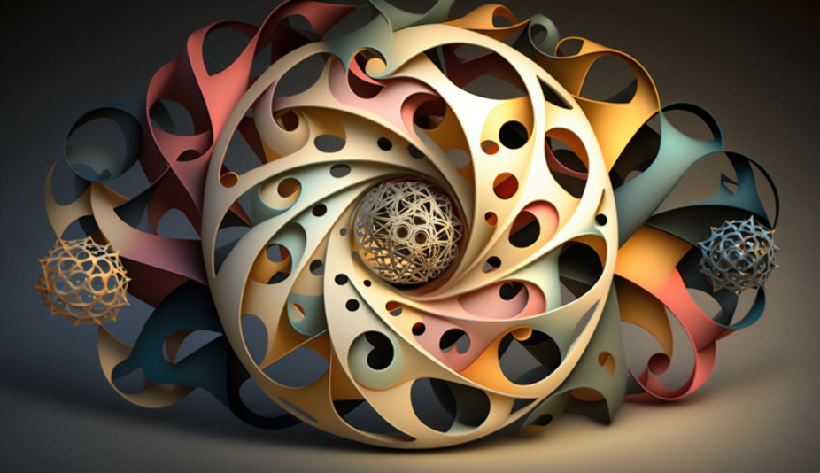
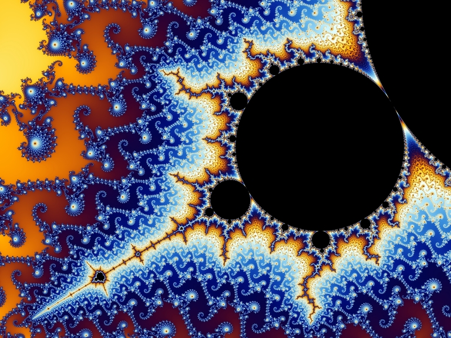
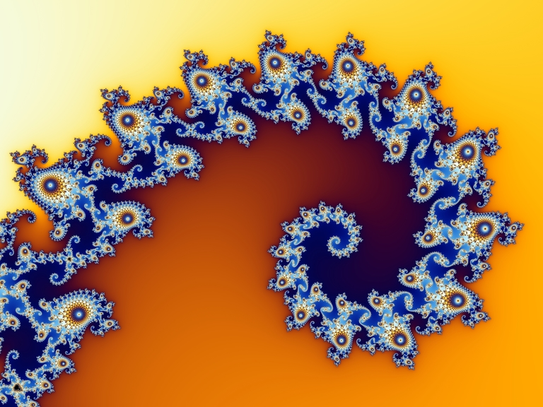
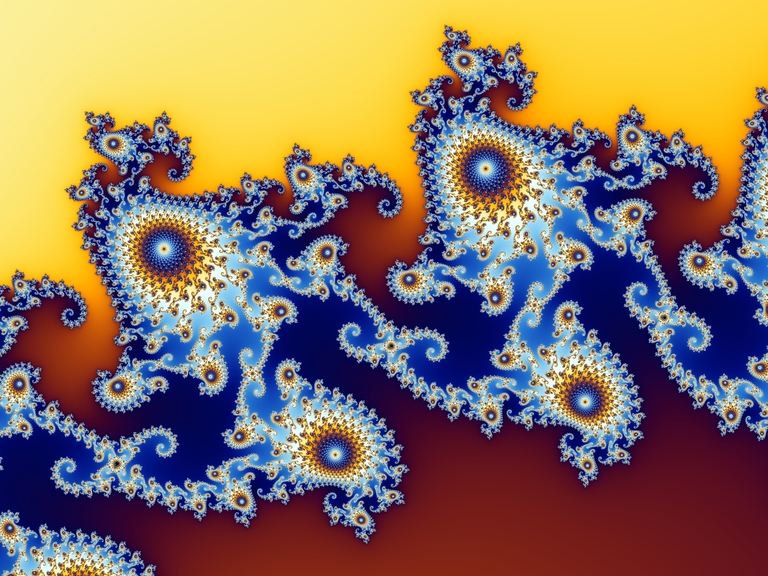
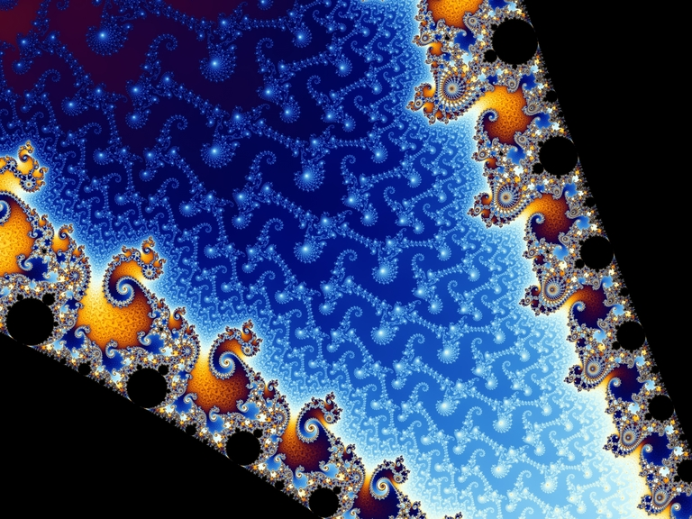
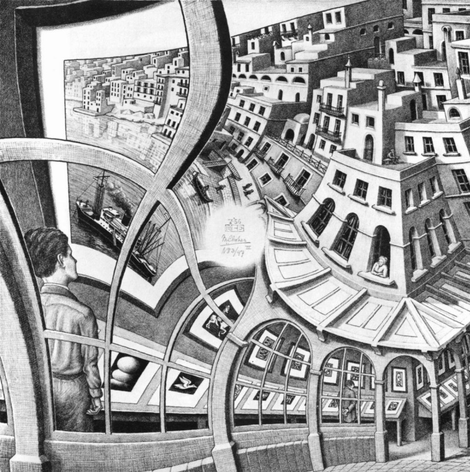

# Эйлер, Чёрч и Мандельброт — этюд о красоте и математике



Довольно часто на просторах интернета можно встретить выражение "Красота - в глазах смотрящего". Действительно ли красота субъективна, или все же в ней есть нечто объективное и общее для всех? Возможно ли, что абсолютно не похожие на нас инопланетные существа с другого конца Вселенной, с которыми нам даже ни разу не суждено встретиться за всё время существования наших цивилизаций, видят красоту в том же, в чем видим её и мы?

В начале 90-х годов XX века немецкий информатик Юрген Шмидхубер представил невероятно красивую и математически строгую теорию математической красоты. Согласно этой теории людям кажутся красивыми сложные объекты, обладающие наименьшей алгоритмической сложностью. Эта величина, также известна как колмогоровская сложность, названа так в честь впервые описавшего её советского математика Андрея Колмогорова.

Алгоритмическая сложность строки данных - это наименьшее возможное описание, необходимое для воспроизведения этой строки. К примеру у следующей строки высокая алгоритмическая сложность, так как самое короткое её описание - это она сама:

```
4c1j5b2p0cv4w1x8rx2y39umgw5q85s7uraqbjfdppa0q7nieieqe9noc4cvafzf
```

А вот у следующей строки низкая алгоритмическая сложность, так как её можно коротко описать как "повтор ab 32 раза":

```
abababababababababababababababababababababababababababababababab
```

Очевидно, что для точного численного определения алгоритмической сложности нужно определиться с формальным языком, на котором записываются строки. Для этой цели отлично подходит любой язык программирования. Например, на JavaScript вышеупомянутые строки могут быть записаны в следующем виде:

```
'4c1j5b2p0cv4w1x8rx2y39umgw5q85s7uraqbjfdppa0q7nieieqe9noc4cvafzf'
'ab'.repeat(32)
```

В таком случае на JavaScript алгоритмическая сложность первой строки равна 66 (64 символам и 2 кавычкам), а сложность второй равна 15. Шмидхубер считает, что второе выражение кажется нам более красивым, потому что, порождая равную по количеству бит строку данных, оно задается выражением с гораздо более низкой алгоритмической сложностью.

Основную мысль теории математической красоты можно кратко выразить как:

> Красота - это сложность, порожденная простотой

Из этого постулата очевидным образом следует, что самые красивые вещи во Вселенной должны обладать бесконечной сложностью и порожденными невероятной простотой.

## Всё из нуля

Во времена рассвета греческой цивилизации в южной Италии в небольшом городке под названием Кротона, философ и математик Пифагор основал свою знаменитую школу. В пифагорейской школе обучение геометрии было неразрывно связано с мистической трактовкой её фигур, аксиом и теорем. Наибольшим почетом среди пифагорейцев пользовалась монада - символ окружности, обведенной вокруг ярко выделенной центральной точки.


Монада считалась божественным знаком - символом единства в самом своем сердце всего сущего и происхождения мира из пустоты. Вольно трактуя воззрения пифагорейцев, можно сказать, что в самом начале мира не было ничего - был полный ноль. Но раз ничего нет, то нет и никаких ограничений, мешающих возникнуть и восторжествовать бытию - единице. Таким образом, небытие, лежащее в самом начале Вселенной, "взрывается" во все стороны - в бесконечное количество логически возможные вариантов. При появлении сущего для каждой вещи возникает её противоположность - единице всегда соответствует минус единица. Идеальной иллюстрацией данного космогонического мифа служит фигура круга - ведь на его окружности находится бесконечное количество равноудалённых от центра точек, и для каждой из этих точек существует точка ей противоположная.

Живший спустя несколько столетий после Пифагора древнегреческий инженер Архимед провел большую часть жизни на Сицилии - не очень далеко от места, где некогда располагалась пифагорейская школа. Там Архимед разработал способ расчета отношения длины окружности к её радиусу при помощи вписывания окружности во все более и более сложные многоугольники. Эту величину, чье точное значение пытался найти Архимед, сейчас мы называем числом π ("пи"). Это название, однако, было популяризовано относительно недавно - в трудах выдающегося немецкого и российского математика Леонарда Эйлера, относившегося к окружности со свойственной ему как и Пифагору набожностью и посвятившего исследованию окружности огромную часть своих трудов.

Исследуя свойства синусов и косинусов на комплексной плоскости Эйлер наткнулся на изящную формулу, которая при подстановке в неё числа π приводит к невероятно красивому результату:


Это равенство, названное в честь математика тождеством Эйлера, по праву считается самой красивой формулой математики - в нем отображена поистине невероятная связь между пятью основными константами математики - нулем, единицей, основанием натурального логарифма e, числом π и мнимой единицей i.

В этой формуле будто бы сошлись вся математика и философия - небытие, бытие, гармоничность, бесконечность и непознаваемость. Кстати о последнем. Мнимая единица i долгое время считалась воображаемой, как бы ненастоящей сущностью, изящным математическим трюком, не более того, пока в начале XX века блестящий австрийский физик Эрвин Шредингер не опубликовал свое знаменитое уравнение, описывающее волновую функцию, в котором мнимая единица играет ключевую роль.

По определению, мнимая единица - это корень из минус одного. Мы не можем представить себе это число в том же виде, в котором мы обычно представляем себе обычные числа. Мнимый десяток яблок - невообразимая картина. Однако, мнимые числа - очень важная часть математики. Вместе с обычными действительными числами мнимые числа образуют комплексные числа, записывающиеся в виде a+bi, где a и b - действительные. Именно при исследовании комплексных чисел Эйлер пришел к открытию названной в честь него формулы. Но он был не единственным, кто нашел великую красоту в комплексных числах.

Бельгийский математик Бенуа Мандельброт, исследовавший рекурсивные формулы с комплексными числами, открыл самую поразительно красивую вещь - бесконечно самоподобную структуру, так и названную в честь первооткрывателя - множеством Мандельброта.

Множество Мандельброта точек c на комплексной плосткости задается невероятно простой формулой:


Визуализировав данную формулу на компьютере и придав каждой точке цвет в зависимости от количества итераций, за которые получается определить принадлежит она множеству или нет, Бенуа Мандельброт получил невероятно красивые изображения. Будто бы тысячи галактик воссияли внутри полученных картин.








Невероятная красота множества Мандельброта поражает воображение - завораживающая взгляд фрактальная структура, в которой каждый уровень подобен другим, содержит в себе бесконечное количество разнообразных образов. Вся эта невероятная красота изливается в мир из из абсолютного нуля. Множество Мандельброта подобно нашей собственной Вселенной в миниатюре - величайшая сложность, порожденная не менее великой простотой.

## Всё из функции

В начале XX века светлейшие умы нашей планеты разгадали законы, по которым работает наш мир на самом элементарном своем уровне. Открытия физиков поразили не только обывателей, но и их самих. Оказалось, что элементарные частицы не являются точечными объектами и часто ведут себя совсем не как частицы, а скорее как волны.

Упрощенно рассматривая принцип корпускулярно-волнового дуализма, можно сказать, что частицы - лишь события, которые мы регистрируем в мире бинарных фактов. Эти события порождаются взаимодействием волн - неких идеальных сущностей, живущих по строгим математическим законам, но недоступных нашему прямому восприятию. Мы не можем познать волны нашим разумом, так как в волновом уравнении Шрёдингера присутствует та самая невообразимая мнимая единица.

Проводя аналогию с компьютерными программами, можно сказать, что частицы - это данные, а волны - это функции, обрабатывающие эти данные. Мы легко можем увидеть бит данных, ведь бит (binary digit) также как и частицы существует в доступном нашему восприятию мире бинарных фактов. Лампочка горит - истина, не горит - ложь. Функции же представляют собой некие идеальные платонические сущности: мы можем видеть их входные данные и результаты их работы в виде данных, но сами они являются лишь незримым математической законом.

Данную аналогию можно проиллюстрировать подобным образом:

> Входные данные -> Функция -> Выходные данные
> Состояние частицы -> Волновое уравнение -> Состояние частицы

Примерно в те же времена, когда физики в поте лица трудились над созданием квантовой механики, американский математик Алонзо Чёрч исследовал проблемы теории компьютерных вычислений. В ходе одной из своих работ Чёрч создал величайшее своё творение - лямбда-исчисление - краткую, но невероятно мощную формальную систему для описания алгоритмов.

Эта система состоит из всего двух операций - аппликации и абстракции. Абстракция - это объявление функции, а аппликация - это её применение. В этом посте ради простоты я не буду использовать нотацию, принятую самим Чёрчем, а использую более широко распространенную нотацию лямбда-функций, принятую в JavaScript и многих других языках программирования.

Абстракцию я буду обозначать следующим образом:

```
(a, b) => a + b
```

Аппликацию я буду обозначать так:

```
f(a, b)
```

Проводя эксперименты с лямбда-исчислением Чёрч обнаружил, что всё, что требуется для воспроизведения всей математики - это только само понятие функции и больше ничего. Полученная система в честь первооткрывателя называется кодированием Чёрча.

В начале Чёрч задал фундаментальные абстракции своей логической системы в виде двух функций:

```
true  = (x, y) => x
false = (x, y) => y
```

Далее Чёрч определил в виде функций базовые логические операции:

```
and = (p, q) => p(q, p)
or  = (p, q) => p(p, q)
not = (p) => (x, y) => p(y, x)
if  = (p, x, y) => p(x, y)
```

Посмотрим как работает получившаяся система:

```
result1 = and(true, false)
// подставляем значения true и false в виде функций
result1 = and((x, y) => x, (x, y) => y)
// подставляем параметры в значение and в виде функции
result1 = ((x, y) => x)((x, y) => y, (x, y) => x)
// применяемая функция возвращает первый параметр, то есть
result1 = (x, y) => y
// сравнив эту функцию с нашими двумя логическими значениями, мы понимаем, что
result1 = false
```

```
result2 = or(true, false)
// подставляем значения true и false в виде функций
result2 = or((x, y) => x, (x, y) => y)
// подставляем параметры в значение or в виде функции
result2 = ((x, y) => x)((x, y) => x, (x, y) => y)
// применяемая функция возвращает первый параметр, то есть
result2 = (x, y) => x
// сравнив эту функцию с нашими двумя логическими значениями, мы понимаем, что
result2 = true
```

```
result3 = not(true)
// подставляем значение true в виде функции
result3 = not((x, y) => x)
// подставляем параметры в значение not в виде функции
result3 = (x, y) => ((x, y) => x)(y, x)
// применяемая функция возвращает первый параметр, то есть
result3 = (x, y) => y
// сравнив эту функцию с нашими двумя логическими значениями, мы понимаем, что
result3 = false
```

```
result4 = if(false, 1, 2)
// подставляем значение false в виде функции
result4 = if((x, y) => y, 1, 2)
// подставляем параметры в значение if в виде функции
result4 = ((x, y) => y)(1, 2)
// применяемая функция возвращает второй параметр, то есть
result4 = 2
```

Кроме булевской логики Чёрч реализовал в своей системе и арифметику - он взял арифметику Пеано и перевел её на язык лямбда-исчисления.

В начале Чёрч задал фундаментальные абстракции своей арифметической системы в виде двух функций:

```
0 = (f, x) => x
next = (n) => (f, x) => f(n(f, x))
```

Таким образом, числа в системе Чёрча выглядят следующим образом:

```
0 = (f, x) => x
1 = (f, x) => f(x)
2 = (f, x) => f(f(x))
3 = (f, x) => f(f(f(x)))
...
```

Далее Чёрч определил в виде функций базовые арифметические операции:

```
plus     = (m, n) => (f, x) => m(f, n(f, x))
multiply = (m, n) => (f, x) => m(n(f), x)
```

Посмотрим как работает получившаяся система:

```
result5 = plus(1, 2)
// подставляем значения 1 и 2 в виде функций
result5 = plus((f, x) => f(x), (f, x) => f(f(x)))
// подставляем параметры в значение plus в виде функции
result5 = (f, x) => ((f, x) => f(x))(f, ((f, x) => f(f(x)))(f, x))
// упрощаем выражение
result5 = ((f, x) => f(x))(f, f(f(x)))
// упрощаем выражение еще раз
result5 = f(f(f(x)))
// сравнив эту функцию с нашими числами, мы понимаем, что
result5 = 3
```

В свою систему Чёрч добавил ещё много всего: вычитание, деление, действительные числа, строки. Он даже добавил туда рекурсивные вызовы функций с помощью знаменитого Y-комбинатора.

На основе лямбда-исчисления был создан один из самых первых языков программирования - LISP, который здравствует и поныне. Существует огромное количество диалектов лиспа, а многие его элементы были унаследованы другими языками программирования. Даже я сам когда-то создал свой диалект лиспа, работающий в экосистеме JavaScript. За краткость, невероятную мощь и внутреннюю гармонию программисты часто называют LISP языком Бога.

В кодировании Чёрча мощнейший математический аппарат строится на двух простых операциях лямбда-исчисления и гениальной мысли Алонзо Чёрча о том, что всё - есть функция. Подобно тому как наш физический мир представляет из себя море, состоящее из бесчисленных квантовых волн, математика - это океан бесчисленных функций. Какая невероятная красота заключена в том, что вся великая сложность математики может быть сведена к простейшему, но неосязаемому элементу - функции!

## Заключение

На одной из самых известных картин нидерландского художника Маурица Эшера изображена картинная галерея, плавно перетекающая в город, который в свою очередь плавно перетекает обратно в картинную галерею.



Эта бесконечная художественная рекурсивная петля была бы невозможна без одного элемента - пустого белого пятна в центре картины. Эта пустота и есть тот самый ноль, то самое небытие, из которого берет начало наша Вселенная...
