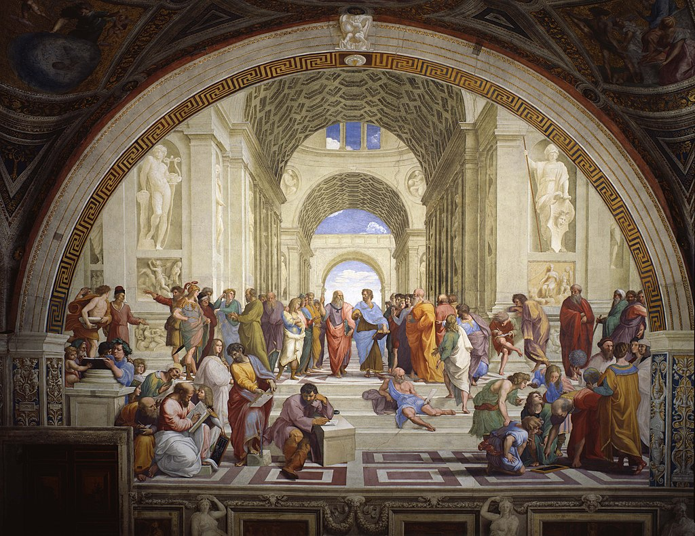

# Гений Пифагора: почему в рекурсивно-вычисляемом клеточном автомате Вселенной наше сознание бессмертно?

Несколько лет назад я опубликовал на Хабре серию статей о гипотезе математического происхождения Вселенной. Самая популярная из них — мой перевод статьи Стивена Вольфрама «Кажется, мы близки к пониманию фундаментальной теории физики, и она прекрасна». Этот пост не просто повторяет описанные в тех старых статьях идеи, но и развивает их. Мы с вами поговорим об истории идеи математического происхождения Вселенной, рассмотрим аргументы в её пользу, обсудим гипотезу симуляции и клеточные автоматы, математические вселенные Макса Тегмарка и теорию пыли Грега Игана, а также погрузимся в работу «Вселенная как число» Ильи Шепрута и обдумаем её связь с концепцией вечной жизни.

## Гармония мира

Философская идея о математическом происхождении Вселенной своими корнями восходит к древнегреческому мыслителю Пифагору. В процессе поиска теоретических основ музыки и создания первого в своём роде музыкального строя Пифагор обнаружил, что звуки струн, чьи длины соотносятся друг с другом определённым образом, созвучны друг другу. Соотношение длин струн один к двум даёт октаву, пропорция два к трём — квинту, три к четырём — кварту, восемь к девяти — тон.

Звуки, отстоящие друг от друга на интервал октавы, квинты, кварты или тона, при одновременном звучании образуют консонанс — приятное слуху созвучие. Одновременное звучание звуков отстоящих друг от друга на иные интервалы даёт диссонанс — неблагозвучие. Правильное сочетание консонансов и диссонансов образует гармонию. Науку о правильном сочетании противоположностей в музыке Пифагор назвал гармоникой.

Один из поздних последователей пифагорейского учения Никомах Герасский писал:

> Гармония всегда рождается из противоположностей, ведь гармония — это единение многосмешанных и согласие разногласных

Размышления над ролью математики в музыке привели Пифагора к идее о том, что математика лежит в основе не только музыки, но и всего мироздания, и Вселенная строится на числовых отношениях. Даже движение звёзд и планет по ночному небу Пифагор рассматривал как некий танец, строго подчиняющийся законам математики. Это его учение известно как гармония сфер.

Пифагорейцы, представители основанной Пифагором философской школы, почитали числа и поклонялись Солнцу. Священными считалась единица, как символ общего корня мироздания, и двойка, как символ разделения мира на противоположности. Именно с этими двумя числами связано священное изображение пифагорейцев — монада, о которой мы поговорим чуть позднее.

Теорию Пифагора о небесной гармонии развил в своём трактате «Мировая гармония» средневековый астроном Иоганн Кеплер. Он обнаружил, что орбиты планет и правда соотносятся друг с другом в пропорциях подобно тому, как соотношения длин струн порождает музыкальные интервалы. Кеплер вывел три закона движения планет в Солнечной системе, третий из которых гласит, что квадраты периодов обращения планет вокруг Солнца относятся как кубы больших полуосей орбит планет.

Солнечную систему Кеплер под влиянием идей Пифагора рассматривал как своего рода огромный небесный оркестр, в котором каждая планета — это музыкальный инструмент, играющий свою партию. А закончил свой трактат об астрономии Кеплер словами о том, как он, согретый тёплым напитком из кубка Пифагора, засыпает под звуки небесной музыки...

> Земля поет ми, фа, ми: вы можете даже из этих звуков сделать вывод, что в нашем доме господствуют несчастья и голод.
>
> Иоганн Кеплер, «Harmonices Mundi»

На пифагорейской музыкальной теории была построена вся античная и средневековая музыка. Единственной проблемой пифагорова строя была комма — небольшой зазор между звуком через двенадцать квинт и звуком через семь октав от исходного. Этот незначительный разрыв между звуками полного оборота колеса октав и колеса квинт не давал построить идеальное звучание. Пифагорейцы трактовали комму как трещину в мировой гармонии, несовершенство мира, знак того, что математика и жизнь не всегда совпадают идеально. Это стало первый сокрушительным ударом по учению Пифагора о гармонии мира.

Избавиться от этого несовершенства музыканты смогли только в эпоху Ренессанса, пожертвовав математической чистотой ради музыкальной красоты. Немецкий органист и теоретик музыки Андреас Веркмейстер придумал, как равномерно «размазать» комму по квинтам и октавам так, чтобы каждая октава и каждый квинт звучали чуть‑чуть неидеально, но зато попадали точно в тот же звук через полный оборот музыкального круга. Так появился хорошо темперированный строй. Этот новый строй, звучащий гораздо гармоничнее пифагорова, был немедленно введён в оборот великим немецким композитором Иоганном Себастьяном Бахом. Его «Хорошо темперированный клавир» стал началом культурного взрыва симфонической музыки...

Но давайте вернёмся к Пифагору и его идеям. Рассмотрение числовых соотношений в качестве фундамента мироздания привело Пифагора к множеству математических открытий, главное из которых — это, несомненно, знаменитая геометрическая теорема о равенстве суммы квадратов длин катетов квадрату длины гипотенузы в прямоугольных треугольниках, названная именем этого выдающегося древнегреческого мыслителя. И как раз эта теорема нанесла по философии Пифагора второй сокрушительный удар.

Из теоремы Пифагора следует, что длина гипотенузы прямоугольного равнобедренного треугольника с длиной катета в единицу равна корню из двух. Гиппас из Метапонта, ученик пифагорейской школы, доказал, что корень из двух — это иррациональное число, которое невозможно представить в виде дроби из двух натуральных чисел. В философию Пифагора вписывались натуральные числа и рациональные числа, то есть дроби, образованные отношением натуральных чисел, но никак не вписывались иррациональные, то есть такие, которые нельзя представить в виде соотношения двух натуральных. По легенде, за это открытие Пифагор изгнал или даже утопил своего ученика.

До конца своей жизни Пифагор страдал от несогласованности его учения о фундаментальности числовых соотношений в архитектуре Вселенной с его собственными величайшими творениями — теорией музыки и теоремой о прямоугольных треугольниках. Однако, даже несмотря на это, Пифагор вошёл в историю как величайший древнегреческий философ и затмил своей славой даже своего идейного наследника Платона, о котором мы поговорим чуть позже. А пока я хотел бы рассказать о важнейшей философской концепции Пифагора — монаде.

## Плодородность пустоты

Монада была главной «иконой» пифагорейской школы — основанного Пифагором на юге Италии философско‑математического сообщества. Изображение монады было тесно связано с почитанием пифагорейцами единицы в качестве символа единства мира и двойки в качестве символа разделения мира на противоположности. Монада изображалась в виде обведённой окружностью точки.

Точка в центре круга обозначала фундаментальное единство корня мироздания, а окружность — бесконечность двойственных противоположностей. Подумайте, на окружности лежит бесконечное количество точек, но у каждой из них есть ровно одна противоположная, лежащая на той же окружности симметрично относительно центра круга.

Похожий образ передан и в главной «иконе» древнекитайской философии даосизма — Инь и Ян. Единое начало разделяется на две противоположности — белое и чёрное, мужское и женское, Инь и Ян. Но в чёрном присутствует капля белого, а в белом — капля чёрного. Это символизирует, что причина одной противоположности лежит в другой, а причина второй — в первой.

В главном трактате даосов «Дао дэ дзин» Лао Цзы сказано:

> Когда все в Поднебесной узнают, что прекрасное является прекрасным, появляется и безобразное. Когда все узнают, что доброе является добром, возникает и зло. Поэтому бытие и небытие порождают друг друга, трудное и легкое создают друг друга, длинное и ко­роткое взаимно соотносятся, высокое и низ­кое взаимно определяются, звуки, сливаясь, приходят в гармонию, предыдущее и последу­ющее следуют друг за другом.

Древнеиндийская философия в лице Будды вторит Пифагору и Лао‑цзы. Согласно буддизму все явления в мире взаимозависимы и взаимообусловлены. Свет и тьма, день и ночь, любовь и ненависть, левое и правое, статика и динамика, родитель и ребенок, правда и ложь появляются в ходе самого процесса различения. Сами по себе все сущности пусты, то есть у них нет никакой собственной природы. Есть только порождающий их процесс различения, создающий эти бинарные оппозиции. Согласно Будде, даже само разделение на «Я» и внешний мир — это иллюзия, появляющаяся в момент различения, а на глубинном уровне мы и мир — неразрывное целое.

Идеи Пифагора, Лао‑цзы и Будды развивает великий немецкий философ Гегель. По его мнению, весь мир порождается единством и борьбой противоположностей. Он приходит к этому выводу из рассуждения о том, что из себя представляет чистое бытие. Рассуждает Гегель так. Бытие — это свойство всего, что существует. Именно это свойство отличает существующие вещи от несуществующих, происходящие события и явления от непроисходящих. Но что представляет из себя бытие в чистом виде?

Гегель перебирает все известные ему вещи, явления, свойства в попытках найти бытие. Краснота — это бытие? Нет. Вес это бытие? Нет. Яблоко — это бытие? Нет. Форма — это бытие? Нет. Запах — это бытие? Нет. Существование мнения об чём‑то — это бытие? Нет. И так далее. Гегель приходит к выводу, что бытие отлично от любой существующей вещи и любого явления на свете, при том, что все существующие вещи обладают бытием, так как существуют. Гегель в этом поиске подобен рыбе, которая не может понять, что такое вода. В итоге, Гегель приходит к выводу, что раз бытие отличается от любых вещей и явлений на свете, то есть от всего, что служит ответом на вопрос «Что это?», то значит бытие есть чистое ничто. Эти две противоположности едины. Полная пустота в основе всего сущего.

Отсюда появляется знаменитая диалектика Гегеля. Согласно «Науке логике» Гегеля, человек мыслит бинарными оппозициями — тезисами и антитезисами, а правильные ответы на фундаментальные вопросы бытия представляют из себя не борющиеся противоположности тезисов и антитезисов, а нахождение их единства — синтез тезиса и антитезиса. По Гегелю, Вселенная появилась в ходе великого разделения — абсолютный дух в попытке познать самого себя разделяется на две противоположности — «Я» и «не Я» — изучающий субъект и изучаемый объект. Это познание из‑за этого разделения никогда не удаётся довести до конца, так как при изучении меняется изучающий, что приводит к тому, что изменяется изучаемое. Это борьба единых в своём генезисе противоположностей приводит к появлению и развитию Вселенной.

Похожая концепция присутствует в индийской философии адвайты‑веданты. Согласно адвайте, каждое индивидуальное сознание, Атман — это осколок великой мировой души, Брахмана. Атман и Брахман полностью эквивалентны, то есть Бог как бы наблюдает сам себя триллионами любопытных глаз всех живых существ. Наблюдающий есть наблюдаемое, как писал Джидду Кришнамурти.

Эти идеи находят отклик даже в математике и физике. Первую идею, о которой я хочу рассказать, я почерпнул в посте у Ивана Гришаева. Это идея о пустой истине. В науке логике, не гегелевской, а обычной, существуют предикаты. Это по сути вопросы, на которые можно дать бинарный ответ — да или нет. Например, «это белый?» — это предикат. В логике первого порядка существуют общие предикаты — например, «для всех X верно» и «существует X, для которого верно». В математике они обозначаются перевернутыми буквами А (∀) и Е (∃) по первым буквам английских слов «all» и «exists».

С точки зрения математики, эти общие предикаты — это функции, которые принимают два параметра, список объектов и обычный предикат, и редуцируют множество логических результатов в один. Например, если на столе лежит три белых камня, то выражение «все камни — белые» вернет истину. Если один — тоже истину. Если сто белых и один черный — ложь. А что случится, если камней нет? Предикат ∀ «для всех X верно» также вернёт истину.

Этот случай называется пустой истиной. И самое интересное то, что какой бы предикат не вставить в «для всех X верно», он вернёт истину. На столе лежит 0 камней. Все камни на столе белые? Да. Все камни на столе чёрные? Да. Все камни на столе — красные? Да. Пустая истина — поэтический образ плодородности пустоты. Чистое ничто порождает всё.

Если погрузиться чуть глубже в математику, то можно понять, что пустая истина возникает из‑за того, что предикат «для всех X верно» эквивалентен свёртке моноида бинарной операции логического «И», нейтральным элементом которому служит «истина». А вот предикат «существует X, для которого верно» эквивалентен свёртке моноида бинарной операции логического «ИЛИ», нейтральным элементом которому служит «ложь». Поэтому для лежащих на столе нуля камней, выражение «существует белый камень» ложно. Более подробно эта тема раскрыта в моём эссе «Язык мироздания — теория групп и теория категорий».

Вторая идея, аналогичная учению Гегеля о единстве и борьбе противоположностей, уже из физики, тоже связана с теорией групп и моноидами. Это теорема Нетёр о симметриях, в которой немецкий математик Эмми Нетёр с помощью теории групп доказала, что законы сохранения в физике прямо вытекают из симметрий физических сущностей. Так из однородности и симметричности времени вытекает закон сохранения энергии, из однородности и симметричности пространства — закон сохранения импульса, а калибровочной симметрии соответствует закон сохранения электрического заряда. А симметрия — это ведь и есть связь между противоположностями, их синтез.

Таким образом, согласно философии и науке наша Вселенная представляет собой зеркало, отражающее само себя. Этот лабиринт отражений великолепно описывается в древней индийской метафоре о сети Индры:

> Сеть Индры — это сеть из драгоценных камней, охватывающая собой весь мир. При этом каждый из каменьев отражает все остальные камни, и сам также отражается в них: все в одном, одно во всем, все во всем, одно в одном.

## Бессмертие души

Идейным наследником Пифагора в философии стал другой великий древнегреческий философ — Платон. На самом деле, этого мыслителя звали Аристокл, а своё прозвище Платон, то есть «широкий», под которым он и вошёл в историю, мыслитель получил совсем не за широту взглядов, а за широту плеч. Будучи опытным борцом и гоплитом в греческой армии, он отличался богатырским телосложением.

Философия Платона, как и философия Пифагора, уходит своими корнями в математику. Изучение математики и философии в Древней Греции было неразрывно связано друг с другом, одно не мыслилось без другого. Над входом в основанную Платоном афинскую Академию им была начертана знаменитая фраза: «Не геометр да не войдёт».

Основной идеей философии Платона была сама «идея». Само слово «эйдос», преобразовавшееся в современном русском как «идея», было введено в оборот в текущем смысле именно Платоном. Идея об «идее» возникла у мыслителя при размышлении над математическими истинами.

Философ задумывался над вопросами о том, в каком виде существуют математические равенства. Например, дважды два равно четыре. Ведь даже в самом начале Вселенной, если считать, что у неё есть начало, дважды два было равно четырём, и сейчас дважды два равно четырем в любом её уголке, и в её конце, если она закончится дважды два будет равно четырём. А что было до появления Вселенной и что будет после её конца? Дважды два всё так же будет равно четырём, хоть считать было ещё нечего или будет уже нечего. Это значит, что равенство дважды двух четырём не зависит от существования материальной Вселенной. Это вечная истина.

Тут ученик Платона, великий Аристотель, спорит с учителем в том, что если нечего считать, то и равенство не имеет смысла, так как идеи неотделимы от своего материального воплощения. Более подробно этот спор я раскрываю в своём эссе «Nomina nuda tenemus: открываем ли мы математические законы или просто придумываем их?». Но давайте пока что продолжим следить за мыслью самого Платона.

Если равенство «дважды два четыре» независимо от существования материальной Вселенной, значит, оно существует в некоем ином смысле, нежели камень у нас под ногами или яблоко у нас в руке. Платон считал, что это равенство — это математическая идея, существующая в особом нематериальном мире идей. Наш материальный мир философ описывал как блёклую тень мира идей. Эту метафору он наиболее полно раскрывает в своём мифе о пещере.

Согласно мифу о пещере, люди подобны узникам, что прикованы к одной из стен пещеры и видят на противоположной стене лишь тени проносимых за их спиной предметов. Так Платон метафорически описывал, что материальные предметы представляют собой лишь тени их идей. Освобождение философ видел в том, чтобы вырваться из пещеры и увидеть Солнце, то есть разумом постичь свет чистых идей.

То, каким образом материальные предметы являются лишь тенями вечных идей, Платон раскрывает на примере идеи круга. В материальном мире существует множество круглых предметов: колёса, столы, пеньки, монеты. Но каждый из этих предметов немного не совершенен, или, можно сказать, не идеален, то есть отличается от идеи круга. А идеальный круг, чьи геометрические свойства мы рассматриваем разумом, существует лишь в незримом глазами мире идей. Само слово «идеальный» означает «существующий как чистая идея». Таким образом, все круглые материальные предметы — это несовершенные тени идеи круга. Именно с идеальными геометрическими формами мы работаем при доказательстве теорем и рассчётах.

Другим излюбленным примером Платона были правильные многогранники, позже названные в честь философа платоновыми телами. По определению, правильный многогранник — это выпуклый многогранник, грани которого являются равными правильными многоугольниками, обладающий пространственной симметрией следующего типа: все многогранные углы при его вершинах правильные и равны друг другу. Современник и соотечественник Платона афинский геометр Теэтет привёл строгое доказательство, что правильных многогранников существует всего пять: тетраэдр, гексаэдр (куб), октаэдр, додекаэдр, икосаэдр. И даже всемогущие олимпийские боги не могут создать шестой точно так же, как не могут они сделать дважды два равным пяти. А это значит, что идеи не только вечные, но и неизменные.

В диалоге «Теэтэт» Платон устами своего учителя Сократа так описывает своего друга:

> Из всех молодых людей, с которыми мне когда‑либо приходилось встречаться (а их довольно много бывало у меня), я не знал ни одного такой удивительной одарённости. Легко воспринимает учение, как редко кто другой, при этом необыкновенной мягкости характера и вместе с тем мужествен, как никто…

Кроме того, устами Сократа в своих диалогах Платон излагает учение о бессмертии души, унаследованное им от Пифагора. Дело в том, что Пифагор верил в переселение душ — концепцию метемпсихоза, очень близкую по своему смыслу к буддийской концепции реинкарнации. Как мы увидим позднее, эта концепция напрямую вытекает из идеи Пифагора о том, что «всё есть число». Сам Платон придерживался схожих взглядов.

Философ считал душу человека, то есть совокупность состояния ума, сознания, памяти, характера и убеждений, точно такой же нематериальной идей, как круг, правильные многогранники и равенство дважды двух четырём. А раз душа — это идея, то, значит, она столь же вечна и неизменна, как и все другие идеи, и в некотором смысле вечно существует в том самом мире идей. Эта концепция вечной души Платона позднее легла в основу христианского учения о вечной жизни.

В платоновском диалоге «Федон» говорится, как незадолго до своего трагического конца Сократ совсем не страшится смерти, а излагает своим ученикам доказательства бессмертия души и заявляет:

> Если бессмертное неуничтожимо, душа не может погибнуть, когда к ней приблизится смерть: ведь из всего сказанного следует, что она не примет смерти и не будет мёртвой.

## Жизнь и математика

Британский физик‑теоретик Стивен Хокинг в своё время много размышлял о природе реальности. В своей книге «Краткая история времени» он задаётся вопросом о том, что будет, если мы откроем физическую «теорию всего»:

> Даже если мы откроем полную теорию, это всё равно лишь набор правил и уравнений. Что же «вдыхает огонь» в эти уравнения, чтобы они описывали Вселенную? Почему существует именно та Вселенная, которую они описывают?

Этот вопрос сильно заинтересовал шведского астрофизика Макса Тегмарка. Размышления привели его к написанию книги «Наша математическая Вселенная». Согласно приведённым в этой книге рассуждениям, если выкинуть из наших теорий физики весь словесный описательный багаж, то там не останется ничего кроме формул, описывающих как одни абстрактные математические структуры взаимодействуют с другими. А раз ничего другого, кроме как привести список математических формул, мы о природе реальности сказать не можем, то значит эта самая природа реальности представляет собой чистую математику. Но почему же физический движок Вселенной содержит именно этот набор формул, а не какой‑то другой?

Согласно рассуждениям Тегмарка, в этом нет ничего удивительного, достаточно просто применить к нашей Вселенной принцип Коперника, гласящий, что учёному имеет смысл считать, что место, где мы обитаем, абсолютно заурядно и существует огромное количество подобных ему. Применив этот принцип к своей теории, Тегмарк сделал вывод, что существует бесконечное количество разных математических вселенных, в каждой из которых свой набор базовых математических структур и свой список формул физических законов. В некоторых из этих миров возможно появление жизни, и там, где она появляется и развивается до разумной, существа задаются вопросом о том, почему в их мире именно такой набор физических законов, а не какой‑то другой. Этот аргумент — пример аргументации через антропный принцип.

Если принять картину мира Макса Тегмарка, то можно сказать, что материальные предметы — это не тень вечных и неизменных математических идей, а они и есть эти самые чистые математические идеи. Мир по Тегмарку не делится на идеи и материю, а представляет собой взаимодействие чистых идей.

Задолго до Тегмарка похожие взгляды на мир высказывал американский физик Джон Уилер. Он считал, что в основе мира лежит информация и её обработка, и что основным кирпичиком мироздания служит наименьшая единица информации — бит. Слово «бит» образовано от английского словосочетания «binary digit», что означает двоичная цифра, так как в двоичной системе счисления числа записываются с помощью всего двух цифр 0 и 1. Ноль кодирует отсутствие сигнала, а единица его наличие. Свою философскую теорию Уилер поэтически назвал «it from bit». Можно заметить, что эта идея Уилера сильно напоминает философию Гегеля: ноль — это ничто, единица — это бытие, а их «борьба» порождает мир.

Идеи Тегмарка о математической природе реальности и идеи Уилера о том, что в основе мира лежит информация, развил британский математик и физик Стивен Вольфрам. Его больше всего волновал вопрос о том, почему все физические процессы проистекают в движении и почему присутствует ярко выраженная ассиметрия времени. Почему мы помним прошлое, но не знаем будущее? Почему события в прошлом влияют на события в будущем, но не наоборот? Почему энтропия в термодинамических процессах со временем нарастает? Свои ответы на эти вопросы Вольфрам изложил в книге «Новый вид науки» и статье «Кажется, мы близки к пониманию фундаментальной теории физики, и она прекрасна».

Вольфрам пришёл к выводу, что мир представляет собой не набор статичных математических формул, записанных в её «физический движок», а рекурсивный итеративный вычислительный процесс, который шаг за шагом применяет определённые правила преобразования к некой абстрактной математической структуре, которую можно представить в виде графа. В такой картине реальности формулы физических законов находятся не в основании мира, а выводятся из особенностей изменения этого графа во времени. Ассиметрию времени же учёный объяснил вычислительной необратимостью. Он приводит в пример ассиметричную криптографию: перемножить сотни длинных простых чисел элементарно, а вот с обратным процессом факторизации числа на простые множители не справится даже суперкомпьютер.

Простейшие рекурсивные вычисления могут порождать невероятную сложность и красоту. Так самая прекрасная из известных человечеству структур, множество Мандельброта, вычисляется по простой рекурсивной формуле.

Получающаяся в ходе раскраски попадания или непопадания точки на комплексной плоскости в это множество картина поражает воображение. Пред глазами предстаёт бесконечно глубокий и бесконечно прекрасный фрактал.

Вдохновление для своей теории вычислимой вселенной Стивен Вольфрам почерпнул в изучаемых им всю его жизнь клеточных автоматах. Самый известный клеточный автомат — это, несомненно, игра «Жизнь», придуманная английским математиком Джоном Конвеем. Действие игры «Жизнь» происходит на поле, состоящим из квадратных клеток. Это поле либо бесконечно во всех направлениях, либо замкнуто в само себя. Пустые белые клетки считаются мёртвыми, а закрашенные чёрные — живыми. Раз в ход поле перерассчитывается. В пустой мёртвой клетке, с которой соседствуют три живые клетки, зарождается жизнь. Если у живой клетки есть два или три живых соседа, то эта клетка продолжает жить, если больше или меньше, то она умирает.

Несмотря на столь простые правила, в игре возникают многочисленные виды сложных структур, применение правил игры к которым перемещает эти структуры в соседние клетки. Это создаёт ощущение, что структура движется, и что она — живая. Самый известный пример такого живого организма в игре — это планер, состоящий из пяти живых клеток. Кроме того, в игре могут возникать и более сложные механизмы, которые порождают множество более примитивных. Пример такой структуры — планерное ружьё, исторгающее из себя планеры. Забавный факт: в игре «Жизнь» существуют «сады Эдема» — конфигурации, недостижимые в ходе эволюции клеток, но с которых можно начать игру.

Другим интересным примером клеточного автомата служат самовоспроизводящиеся клеточные автоматы, созданные американским физиком Джоном фон Нейманом. Их особенность состоит в том, что они способны производить свои точные копии рядом с собой. Автоматы фон Неймана сильно напоминают биологические клетки, способные к саморепликации в ходе своего деления.

Все эти примеры наводят нас не только на идеи о вычислительной природе Вселенной, но и на параллели между теорией клеточных автоматов, физикой элементарных частиц и теорией эволюции. Вполне возможно, что частицы вроде электрона на базовом уровне представляют собой нечто, похожее по принципам своего перемещения на планеры из игры «Жизнь» и биологические клетки, живущие в воде. Взгляд на Вселенную как клеточный автомат отлично раскрывается в недавней статье «Наша Вселенная — симуляция на основе большого клеточного автомата?».

## Теория пыли

Австралийский писатель‑фантаст Грег Иган в своём романе «Город Перестановок» устами одного из персонажей излагает теорию о независимости вычисления сознания от субстрата, на котором оно «запущено». Эта теория в романе именуется «теорией пыли». Но прежде, чем приступить к её описанию, давайте разберёмся с тем, что такое сознание.

Сознание — это субъективный взгляд человека «от первого лица», его точка восприятия мира. Именно в сознании математические сигналы внешнего мира становятся цветами, звуками, запахами, вкусами и чувствами. С философской точки зрения, сознание не может быть причинно редуцировано к работе нашего мозга, но оно полностью коррелирует с изменениями состояния нейронов. Более подробно, философию сознания и все связанные с ним проблемы я раскрываю в эссе «Cознание — величайшая загадка Вселенной», а пока что для наших целей достаточно и этого короткого определения.

Вычисления возможно проводить на разных субстратах: наш мозг проводит свои вычисления с помощью электрохимических процессов в нейронах, в компьютерах вычисления происходят с помощью электрических импульсов в транзисторах, на старых бухгалтерских счётах вычисления происходят с помощью деревянных бусин. Существуют и более экзотические субстраты для вычислений: так китайский писатель‑фантаст Лю Цысинь в своём романе «Задача трёх тел» описывает построение китайским императором и его советниками компьютера, функционирующего на основе солдат с флажками в руках.

Каждый солдат в таком компьютере‑армии симулирует отдельный транзистор и знает только, должен ли он поднять флажок или нет, если флажок поднял соседний с ним солдат. Небольшой отряд представляет собой логический вентиль «И», «ИЛИ» или «НЕ». Из этих отрядов строятся батальоны процессора и полки оперативной памяти. Дебаггинг император в романе проводит интереснейшим способом: после проведения массовых казней в забагованном элементе системы соседние элементы понимают намёк и начинают функционировать правильно. Отдельный солдат в таком компьютере не знает, какие вычисления проводит вся армия целиком. Точно так же отдельный транзистор не знает, что вычисляет компьютер, а отдельный нейрон не знает, о чём думает мозг.

Многие современные философы придерживаются мнения, что сознание сопровождает любые сложные процессы обработки информации, а, значит, его можно запустить хоть на компьютере, хоть на китайском компьютере‑армии Лю Цысиня. То есть, достаточно сложные искусственные нейронные сети тоже могут обладать сознанием. Верность этой гипотезы позволит загружать сознание в компьютер при смерти биологического тела человека. Именно из рассуждений о загруженном в компьютер сознании Грег Иган и выводит свою теорию пыли. Писатель предлагает следующий мысленный эксперимент.

В эксперименте участвуют двое: существующий во «внешнем» мире экспериментатор‑программист Алиса и существующий в виртуальной реальности экспериментируемый — Боб, чей мозг и окружающий его мир полностью симулируются в запущенной на компьютере Алисы программе. Алиса просит Боба вслух сосчитать от одного до десяти. Тот считает: раз, два, три, четыре, пять, шесть, семь, восемь, девять, десять. Во время счёта Алиса несколько раз нажимает то на кнопку паузы, то на кнопку продолжения симуляции. Для неё счёт Боба, доносящийся из колонок звучит так: раз, два, долгая пауза, три, четыре, пять, долгая пауза, шесть, семь и так далее. Для Боба же это просто непрерывный счёт — он не ощущает пауз, так как в моменты паузы он просто не вычисляется.

Из этого Иган делает вывод, что в этом случае мы наблюдаем две субъективных вселенных — одну Алисы и одну Боба, которые как‑то связаны между собой, но в которых время течёт совершенно по разному. Можно сделать так, что пока Боб будет считать от одного до десяти, во вселенной Алисы пройдут десятки лет. Это чем‑то напоминает эффекты замедления времени в теории относительности. Но это не главное. Дальше Иган делает ещё более интересный шаг в рассуждениях.

Что будет, если поставить Вселенную Боба на паузу, а после перенести симуляцию на другой компьютер и запустить там? Боб ничего не заметит. Что будет, если поставить Вселенную Боба на паузу, после перенести симуляцию на компьютер в виде китайской армии Лю Цысиня, вычислить ещё пару шагов там, опять поставить на паузу, а спустя год перенести обратно? Боб ничего не заметит. Для него счёт вслух будет непрерывен. И тут Иган наконец‑то подходит к своей теории пыли.

Если сознание как вычислительный процесс не зависит от субстрата, на котором оно вычисляется, и если оно течёт непрерывно даже, если моменты его вычисления разделены десятками лет, то почему состояние сознания последующее за тем, которое сейчас закодировано в структуре моего мозга, не может быть закодировано в структуре облака космической пыли в далёкой галактике?

Подобный вопрос до Игана задавали себе и другие мыслители. Например, известна концепция под названием «Мозг Больцмана», согласно которой случайные флуктуации вакуума могут приводить к возникновению в космосе структуры подобной мозгу, у которого будет память о всей его прошлой жизни и представления о некой Вселенной, в которой он обитает.

Персонаж Игана после открытия «теории пыли» строит компьютерную симуляцию под названием «Город перестановок» — клеточный автомат, чьи правила позволяют бесконечный рост вычислительных мощностей. Этакий программистский рай. Персонаж заселяет в этот новый дивный мир свою копию и отключает компьютер. Вселенная, в которой живёт его копия, продолжает своё субъективное существование дальше...

## Вселенная как число

Концепции математической вселенной Тегмарка, информационной вселенной Уилера, вычислимой Вселенной Вольфрама и теорию пыли Игана развивает в своей работе «Вселенная как число» российский программист Илья Шепрут. В этой работе каждое конкретное состояние Вселенной соотносится с определённым натуральным числом. Таким образом, история Вселенной представляет из себя просто ряд натуральных чисел.

Существует бесконечное количество таких возможных рядов. Есть вселенная, где после состояния 1 идёт состояние 2, есть вселенная, где после него состояния 1 идёт состояние 3, и так далее. Это роднит концепцию Шепрута с многомировой интерпретацией квантовой механики Хью Эверетта, согласно которой в разных мирах одновременно существуют все возможные исходы «случайных» квантовых событий, и каждый из таких миров имеет свою историю.

Эти ряды натуральных чисел, кодирующие разные истории Вселенной, подобны поэтическому описанию сада расходящихся тропок у аргентинского писателя Луиса Хорхе Борхеса. В его одноимённом рассказе описан вымышленный сад, в котором тропинки символизируют различные варианты истории одного и того же человека. Каждое принятое человеком решение образует развилку, от которой независимо друг от друга идут две другие тропинки, или сливаясь в будущем обратно или же никогда более не пересекаясь.

При этом, согласно теории Шепрута, не имеет никакого смысла говорить о том, живём мы в Матрице или нет, является ли наш мир симуляцией или нет. Существует бесконечное количество историй, в которых наша вселенная — это симуляция внутри других вселенных, и бесконечно количество историй, где наша вселенная — это независимая реальность.

Интересный вывод из теории пыли Игана и концепции «Вселенная как число» Шепрута заключается в том, что Сократ и Платон были не так уж далеки от истины, когда говорили о бессмертии души. Ведь состояние нашего сознания, согласно этим теориям, тоже может быть закодировано в виде числа, и существует бесконечное количество историй с последующими от текущего состояниями. Это делает нас субъективно бессмертными.

Это чем‑то напоминает мысленный эксперимент с квантовым бессмертием, придуманный физиками Хансом Моравеком и Бруно Маршаллом. Суть эксперимента такова: создается устройство — ружьё, чей спусковой крючок привязан к детектору распада неких радиоактивных атомов. Если атом распадается, автомат стреляет, если нет, то просто щелкает. Вероятность выстрела зависит от коллапса волновой функции при распаде атома и равна 50%. Процесс измерения распада атома происходит раз в секунду, то есть раз в секунду автомат либо стреляет, либо просто щёлкает.

Если мы смотрим на этот автомат со стороны, то мы слышим и видим абсолютно случайную последовательность выстрелов и щелчков: выстрел, щелчок, выстрел, выстрел, щелчок, выстрел, щелчок, щелчок, выстрел, щелчок. Но как только мы помещаем нашу голову на линию огня автомата происходит магия — автомат только щёлкает и никогда не стреляет. Как такое возможно?

Всё дело в том, что в тех параллельных вселенных, где автомат выстрелил, вы умерли, а остались в живых вы только в той единственной вселенной, где автомат всегда щёлкал. Поэтому не стоит показывать этот эксперимент вашим друзьям: за минуту стояния на линии огня квантового автомата в 60 параллельных вселенных ваши друзья увидят как ваши мозги разлетаются по стене, и лишь в одной из них вы сможете сказать им: «Вот видите, я же говорил, что я бессмертный». В такую версию бессмертия в конце своей жизни в нашей вселенной верил сам создатель многомировой интерпретации квантовой механики Хью Эверетт.

Если существует бесконечное количество возможных продолжений, то наше «внутреннее кино», как называет сознание австралийский философ Дэвид Чалмерс, никогда не подойдёт к концу. Процитирую отрывок об этом из оригинальной статьи Ильи Шепрута:

> Я даже могу предложить вам множество примеров вселенных, которые возможно сконструировать, в которых вы можете ощутить себя после смерти:
>
> - Оригинальная вселенная, но вы просыпаетесь в психушке, и вам говорят, что вы не умирали.
> - На случайной пустынной планете с фиолетовым небом и равномерным освещением, как будто во время дождя. Далее вы умираете от голода и жажды.
> - В симуляции, где всех людей возродили одновременно и предоставили им бесконечные вычислительные ресурсы для симуляции самих себя, а ваш мозг был получен сверх‑ИИ, который был создан человечеством, чтобы этот ИИ смог получить состояние всех частиц нашей вселенной и просимулировать её назад, чтобы воскресить всех живых существ и предоставить им программистский рай.
> - В 12-мерном пространстве, и вы являетесь суперсуществом, которое только что сыграло в игру «почувствуй себя человеком, максимальное погружение». Для этой вселенной симуляция нашей является лишь игрушкой. И вам кажется мелочью вся эта человеческая жизнь и её печали, и вы возвращаетесь к своим 12-мерным делам в супервселенной.
>   Аналогично прошлому пункту, но это всё было сном.
> - В квадратной комнате, при этом вы не чувствуете голода или жажды, и не можете себя убить, и вам там абсолютно нечего делать навечно.
> - Вас сделали бессмертным и стали бесконечно пытать всеми возможными способами без возможности выбраться или умереть.
> - В раю с 72 девственницами.
> - Вы оказались в центре Солнца. Умерли. Посреди пустого космоса. Умерли. В 60-мерном пространстве. Умерли. В 2-мерном пространстве. Умерли. Внутри компьютерной игры. Не умерли.
>
> Как видите, возможные варианты разнятся от крайне приятных и интересных, нейтральных и занимательных до вселенных с бесконечными страданиями. И именно вселенные со страданиями мне и не нравятся, я бы хотел как‑то запретить их существование, но такое не подвластно даже Богу. Очень жаль понимать, что некоторым версиям меня придётся это испытать.

Чем это не перерождение душ, в которое верили Пифагор и Будда? Согласно буддизму, существует бесконечное количество райских и адских миров, в которых может переродиться наше сознание, и куда оно попадёт зависит только от нашей кармы...
