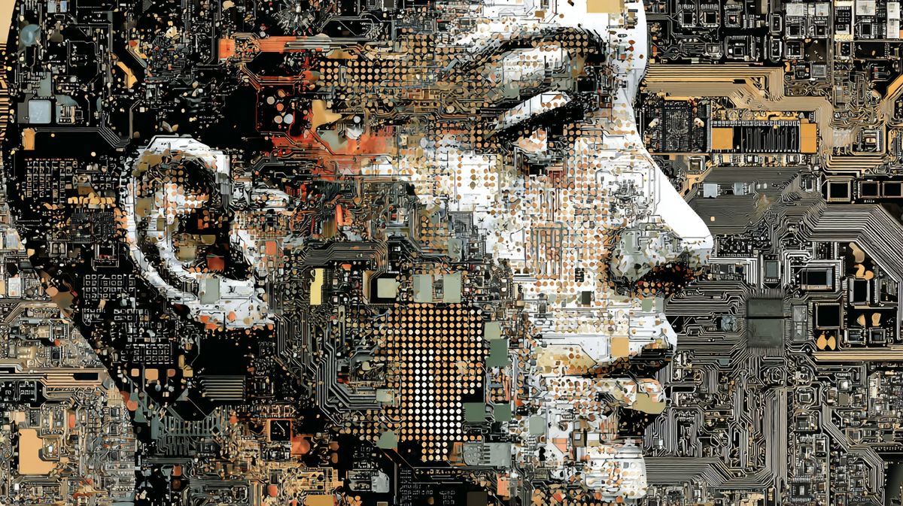

# Есть ли у человека душа и можно ли перенести сознание в компьютер?

Некоторое время назад я опубликовал на Хабре пост «Гений Пифагора: почему в рекурсивно‑вычисляемом клеточном автомате Вселенной наше сознание бессмертно?». В комментариях к тому посту у меня с одним из комментаторов разгорелась жаркая дискуссия о сознании в компьютерной симуляции и существовании души. Мой оппонент приводил аргументы, которые неявно подразумевали существование души, но в явном виде он это утверждение признавать не хотел. Наоборот, он приписывал защиту существования души мне, хотя я отстаивал прямо противоположную позицию. В сегодняшнем посте мы в деталях разберем этот спор и позиции сторон, а также посмотрим, почему при отказе от веры в существование души становится логически неизбежным признание реальности реинкарнации и бессмертия сознания. Но сразу скажу, что для понимания написанного здесь очень желательно прочитать оригинальный пост, из‑за которого и возник этот спор.

## Возможно ли сознание у компьютерной программы

Вопрос о природе сознания — один из вечных вопросов философии и величайшая загадка Вселенной. Сознание — это то субъективное «внутреннее кино», которое мы смотрим, проживая свою жизнь. Это кино состоит из цветов, звуков, запахов, вкусов, чувств, эмоций, боли. Эти вещи несводимы к математике или словесному описанию — вы не можете объяснить слепому от рождения человеку, что такое красный цвет. Вы можете хоть всю жизнь изучать летучих мышей и принцип работы их эхолокации, но вы никогда не сможете познать, каково это быть летучей мышью.

Чужие сознания нам принципиально не доступны. Мы не знаем, видят ли другие люди красные предметы тем же самым цветом, каким их видим мы. Словами мы все называем этот цвет красным, но как он выглядит для других — непознаваемо. Мы даже не можем точно знать, что другие люди вообще видят цвета, а не представляют из себя бездушные механизмы, называемые философами «зомби». Немецкий математик и философ Лейбниц назвал это проблемой других умов.

Проблема других умов породила такое абсурдное, но логически неопровержимое учение как солипсизм, утверждающее, что существует лишь одно сознание — моё, и вся Вселенная — это порождение этого единственного сознания. Если мы отвергаем солипсизм и верим в то, у других людей тоже есть сознание, то мы встаем на дорожку, ведущую нас в интересном направлении. Если сознание есть у других людей, то оно должно быть и у животных: собак, кошек, мышей. Они тоже должны обладать чувствами, видеть цвета и слышать звуки. Но где тогда предел обладания сознания? Есть ли оно у дождевых червей? Да, оно будет другим, возможно менее насыщенным, так как их нервная система гораздо примитивнее нашей. Но если работа нашего мозга, этого сложнейшего устройства по обработке информации, сопровождается сознательным опытом, то оно должно сопровождаться сознательным опытом и у других, даже гораздо более простых систем обработки информации — таких, как нервная система червяка.

Но если любая система обработки информации в нервной системе живых существ сопровождается сознательным опытом, почему этого опыта не может быть у неорганических систем? Философы размышляют на эту тему через мысленный эксперимент под названием «Китайский мозг». Представьте себе миллиарды китайцев, соединенных между собой телефонными сетями. Каждый отдельный китаец симулирует работу одного нейрона. Когда ему кто‑то звонит, он по простому набору данных ему правил, звонит кому‑то из других китайцев или же не звонит вообще. Вся телефонная сеть, таким образом, симулирует работу мозга. Если алгоритмически телефонная сеть китайцев эквивалентна мозгу, то получается, что у нее тоже должно быть сознание. Таким образом, как только мы отказываемся от солипсизма, мы встаём на дорожку, логически ведущую к тому, что сознание есть и у процесса симуляции мозга, запущенного на компьютере.

## Симуляция сознания

В своём романе «Город перестановок» австралийский писатель‑фантаст Грег Иган излагает свою теорию независимости сознания от субстрата, на котором оно вычисляется. Если мы уже согласились с тем, что у запущенного на компьютере процесса может быть сознание, то размышляя о последствиях этого утверждения, мы неизбежно придём к поразительным выводам.

Если сознание — это «внутреннее кино» человека от его первого лица, то сознательный опыт не может прерываться, так как это прерывание невозможно почувствовать. Древнегреческий философ Эпикур писал такие слова о смерти: «Смерть для нас — ничто: ведь всё и хорошее и дурное заключается в ощущении, а смерть есть лишение ощущений. Не бойся смерти: пока ты жив — её нет, когда она придёт, тебя не будет». Смерть как и прерывание вычисления твоего сознания — это невозможный для переживания опыт. А значит, что для вычисляемого на компьютере сознания его внутренний опыт идёт непрерывно, чтобы не происходило с вычислением во внешнем мире.

Грег Иган предлагает представить следующий эксперимент: во внешнем мире есть экспериментатор‑программист Алиса, а в запущенной на её компьютере виртуальной реальности существует экспериментируемый — Боб, чей мозг и окружающий его мир полностью вычисляются компьютером Алисы. Алиса просит Боба вслух сосчитать от одного до десяти. Тот считает: раз, два, три, четыре, пять, шесть, семь, восемь, девять, десять. Во время счёта Алиса несколько раз нажимает то на кнопку паузы, то на кнопку продолжения симуляции. Для неё счёт Боба, доносящийся из колонок звучит так: раз, два, долгая пауза, три, четыре, пять, долгая пауза, шесть, семь и так далее. Для Боба же это просто непрерывный счёт — он не ощущает пауз, так как в моменты паузы он просто не вычисляется, и не может этого прочувствовать.

Далее Иган предлагает представить, что Алиса не просто останавливает вычисление Боба, но и переносит его по сети на сервер в другой части земного шара, там вычисляет ещё несколько шагов и потом, через пару дней, переносит вычисление обратно к себе на домашний компьютер. С точки зрения Алисы вычисление было разорвано во времени и пространстве, с точки зрения Боба его внутренний сознательный опыт был непрерывен. Это удивительно, но Иган идёт в своих размышлениях ещё дальше.

Если мы можем ставить обладающее сознанием компьютерное вычисление на паузу и после запускать снова как угодно часто, то в пределе мы можем придти к вычислению одного «кадра» в минуту — то есть наше вычисление будет представлять из себя набор статичных состояний памяти компьютера, разделенных огромными промежутками времени. Для самого симулируемого сознания это будет всё ещё непрерывный опыт. В один момент мы вообще перестаём вычислять следующий кадр. Но что если во Вселенной найдётся другой компьютер или просто облако галактической пыли, которые придут, хотя бы на миг, в такое состояние связей атомов друг с другом, которое будет эквивалентно кодированию следующего состояния памяти компьютера для вычисления симулируемого сознания? Если мы соглашаемся с этим, то получается, что существование субъективной вселенной Боба полностью независимо от того, вычисляет его Алиса или нет. Это своё предположение Иган назвал «теорией пыли».

## Вавилон пикчерс представляет

В своём рассказе «Вавилонская библиотека» аргентинский писатель Хорхе Луис Борхес описывает мир в виде гигантской библиотеки, содержащей все возможные перестановки символов. Библиотека Борхеса состоит из шестигранных комнат, в каждой из которых имеется по двадцать полок, на каждой из которых находятся тридцать две книги по четыреста десять страниц каждая, с сорока строками на каждой странице, с восемьюдесятью символами в каждой строке. Каждый символ — это либо одна из двадцати двух букв некого алфавита, либо точка, либо запятая, либо пробел.

Большинство из книг в библиотеке представляют собой полную белиберду, набор букв. Однако несмотря на то, что таких бессмысленных книг в библиотеке большинство, в библиотеке также содержатся все созданные и несозданные человечеством тексты:

> .. подробнейшую историю будущего, автобиографии архангелов, верный каталог библиотеки, тысячи и тысячи фальшивых каталогов, доказательство фальшивости верного каталога, гностическое Евангелие Василида, комментарий к этому Евангелию, комментарий к комментарию этого Евангелия, правдивый рассказ о твоей собственной смерти, перевод каждой книги на все языки, интерполяции каждой книги во все книги, трактат, который мог бы быть написан (но не был) Бедой по мифологии саксов, пропавшие труды Тацита.

В вавилонской библиотеке содержится и этот пост, что вы сейчас читаете, и «Братья Карамазовы» Достоевского, и история вашей семьи, и текст Библии, и рецензия на фильм «Конан‑Варвар», написанная кем‑то на Кинопоиске, и все другие возможные тексты. Размышляя о вавилонской библиотеке, приходишь к мысли, что писатель — это не истинный автор любого произведения, а лишь ретранслятор смыслов, поступающих из мира идей, на бумагу.

По аналогии с вавилонской библиотекой Борхеса можно представить себе вавилонскую картинную галерею, на стенах которой висят холсты определенно заданной длины и ширины в пикселях, каждый из которых может окрашиваться в конечное количество RGB‑цветов. Картины в такой галерее будут отображать все варианты перестановок цвета всех пикселей. Большинство из этих картин — бессмысленное месиво в стиле помех на старом советском телевизоре, но среди них есть и все шедевры Микеланджело и Рубенса, все возможные фотографии всех возможных мест, все иллюстрации ко всем книгам вавилонской библиотеки, все кадры фильмов Квентина Тарантино и даже все кадры вашей собственной жизни. Если собрать из всех возможных кадров, хранящихся в вавилонской галерее, все возможные их последовательности, мы можем представить себе вавилонский кинотеатр.

Можно сказать, что в вавилонской библиотеке, вавилонской галерее и вавилонском кинотеатре, существующих как метафора мира вечных идей Платона, уже хранятся все возможные истории человеческих жизней. Размышляя над этим, мы неизбежно приходим к вопросу о том, что если все возможные последовательности кадров уже существуют в вечности и если фильм о нашей жизни уже отснят Богом в момент сотворения Вселенной и хранится в вавилонском кинотеатре, то почему существует момент здесь и сейчас? Почему мы воспринимаем мир именно как движущийся фильм, в котором есть движущийся текущий кадр — момент «сейчас»?

Это ощущение существования момента «здесь и сейчас» — глубоко иллюзорно. Объективно никакого «сейчас» нет. Это не мы смотрим фильм о своей жизни, как считают многие, а мы — всего‑лишь персонажи этого фильма, его порождения. Не «Я» смотрит фильм, а персонаж фильма осознаёт себя как «Я». И на какой бы кадр фильм не перематывай, персонаж на заданный ему вопрос «который час?» всегда ответит «сейчас».

Если у запущенного на компьютере Боба после того, как он досчитал до десяти, спросить, какой сейчас момент, он ответит: «сейчас». Если перемотать симуляцию назад до того, как он начал считать и спросить, какой сейчас момент, то он опять ответит вам, что «сейчас». Получается, что сейчас — это субъективное чувство сознания, а не объективная истина. Это подтверждается тем, что в теории относительности при увеличении скорости объекта до скорости, близкой к скорости света, субъективное время замедляется и мы можем наблюдать эффекты вроде парадокса одновременности, когда для двух наблюдателей это самое «сейчас» разнится.

Другой вопрос, возникающий при размышлениях о вавилонском кинотеатре — это вопрос о том, почему наблюдаемая нами реальность стабильна и причинно связана. Почему, находясь у себя дома, мы вдруг не обнаруживаем себя на Марсе, в следующую секунду на Багамах, а ещё через секунду внутри ядра Земли? Ответ очень схож с предыдущим. В вавилонском кинотеатре есть все возможные фильмы, большинство из которых представляют собой бессмыслицу а‑ля «Андалузский пёс» на максималках или того хуже. Но внутри таких фильмов персонажи не способны осознать себя, потому что никаких стабильных персонажей в бессвязном наборе кадров попросту нет. Осознать себя и задуматься о том, почему мир причинно связан, могут только те, кто существует в причинно‑связанном наборе кадров. В остальных наборах кадров этих вопрошателей попросту не возникает.

Самое похожее на существование в бессвязном наборе кадров состояние сознания — это сновидение. Во время сна реальность, в которую мы попадаем, отрывчатая, ломаная, неструктурированная, сцены и сюжет внутреннее противоречивы и нестабильны. Можно сказать, что сон — это щёлочка в нашей реальности, сквозь которую мы можем посмотреть фильмы вавилонской библиотеки с очень плохим рейтингом на вавилонском Кинопоиске. Как только мы осознаём себя во сне, прерывистый сон прекращается и начинается гораздо более стабильное состояние осознанного сновидения. Важно понимать, что онтологически сон ничем не отличается от реальности. Реальность, наблюдаемая мозгом, получающим сигналы от внешнего мира, и реальность, наблюдаемая мозгом, который посылает сигналы самому себе при реаллокации памяти внутри его нейронных связей во время сна, одинаково реальны.

По аналогии с вавилонской библиотекой, галереей и кинотеатром, можно представить себе вавилонский компьютерный клуб, память каждого компьютера в котором — это одна из перестановок определённого количества бит. На жёстких дисках компьютеров в этом клубе есть все возможные файлы: все книги вавилонской библиотеки, все картины из вавилонской галереи и все фильмы из вавилонского кинотеатра во всех возможных форматах. А ещё в вавилонском компьютерном клубе есть все состояния памяти, кодирующие все возможные «кадры» симулируемых сознаний всех возможных Бобов. В бесконечной Вселенной все эти состояния реализуются хотя бы единожды, а значит исходя из теории пыли Игана, независимо существуют все возможные вселенные и все возможные истории.

Более того, если вспомнить о том, что смерть — это невозможный для переживания опыт, то получается, что наше сознание будет всегда идти по траектории кадров, в котором оно существует, какие бы маловероятные события для такого существования не требовались. В памяти вавилонских компьютеров, в историях вавилонской библиотеки и в фильмах вавилонского кинотеатра такую траекторию провести можно всегда. Это означает субъективное бессмертие каждого сознания. Правда, единственный способ проверить это на практике — подобно героям древнегреческого эпоса, вроде Тесея, бесстрашно бежать навстречу смерти.

В своих «Жизнеописаниях» древнегреческий историк Плутарх описывает философский парадокс, известный как «Корабль Тесея»:

> Согласно легенде, корабль, на котором мифологический герой Тесей вернулся с Крита после победы над Минотавром, использовался афинянами для ежегодного паломничества на остров Делос. Перед каждым плаванием корабль чинили, заменяя часть прогнивших досок на новые. Спустя какое‑то время все старые доски корабля были заменены на новые. Среди философов разгорелся спор: тот же этот корабль, на котором плавал Тесей, или уже другой — новый?

Во время путешествия по этой бесконечной траектории сознание со временем будет сильно меняться, попадая в разные истории и разные окружающие его миры. Будут меняться его знания, убеждения, воспоминания. В один момент уже даже нельзя будет сказать, что это то же самое сознание — в корабле Тесея не просто поменяются доски, но его пересоберут в телегу, а потом в дом, а потом в шкаф, а потом в сарай и так далее. Получается такая буддийская реинкарнация — между разными рождениями нет ни общей материи, ни даже общих идей, а есть лишь единство потока изменений от одной жизни к другой подобно передачи огня от одной свечи к другой...

## Спор о душе

Предметом спора с комментатором моего предыдущего поста стал следующий вопрос: будет ли сознание, чей процесс вычисления заново запущен после паузы, тем же самым сознанием, что и до паузы. С моей точки зрения, симулируемое сознание с его субъективной точки зрения вообще не заметит никакого перерыва. С точки зрения моего критика, важна безостановочность процесса, и поэтому при паузе процесса вычисления изначальное сознание канет в небытие, а при запуске заново это будет уже новое существо. Состояние памяти у остановленного и перезапущенного процесса будет та же самая, но с субъективной точки зрения того «Я», которого остановили, его «киноэкран» погаснет и больше никогда не увидит света бытия, а тот «Я», что появится после перезапуска не видел ничего до, хоть и помнит о событиях прошлого. Эта позиция моего критика неявно подразумевает, что при паузе процесса вычисления симуляции у симулируемого теряется некое качество или свойство, а при перезапуске возникает вновь. Это свойство отлично от памяти и любых других физически проявленных характеристик, следовательно это нематериальное свойство. Его можно назвать «душой». При этом, в явном виде признавать неявно принимаемую им веру в существование души, мой оппонент отказался, и назвал это свойство идентификатором процесса:

А вот если есть остановка вычислений, то это уже смерть старого «Я» и запуск нового. Тождество будет только для внешнего наблюдателя. Самое же «Я» умрет при остановке и будет запущено новое. Как если на сервере остановить один инстанс сервера и запустить другой такой же — он будет вести себя так же, может показаться полностью неотличимым, но вот ID процесса, который выдала ему операционная система, будет совсем другой.

В этом вопросе проявляется давний философский спор о том, что такое «Я», представленный в индийской философии спором между буддизмом и адвайта‑ведантой. Разница подходов этих двух философий заключается в разном ответе на вопрос о том, что такое «Я».

Вот я смотрю на свою руку — она есть часть моего тела, но моя рука — не есть я. Если я возьму топор и отсеку себе руку, то моё «Я» останется существовать. Тоже самое и с другой рукой, ногами, носом, ушами и так далее. Так постепенно отсекая части тела, я приду к выводу, что моё тело — это не я. Даже при тяжелой болезни пока остаётся невредим мозг, я всё ещё остаюсь жив и сохраняю чувство собственного «Я». Ну значит «Я» — это мозг? Тоже нет. В процессе медитации я могу начать «отсекать» от своего сознания части точно так же, как физически отсекал части от своего тела. В медитации при наблюдении за тем как возникают и угасают мысли, чувства и ощущения тела я быстро прихожу к выводу, что мои мысли — это не я, мои чувства — это не я, мои ощущения — это не я, мои эмоции — это не я. Я не испытанный мною гнев или радость, я — не переживаемая мною боль, я — это не моё беспокойство о планах на следующий месяц, я — это не мои мысли по поводу политической ситуации. Но если я — это не всё вышеперечисленное, то что я такое?

С точки зрения адвайты «Я» или сознание — это сцена, на которой в виде ощущений (цветов, звуков, запахов, вкусов), чувств, эмоций, мыслей и идей разворачивается бытие. В основе учения адвайты лежит представление о том, что сознание каждого человека, его душа, Атман — это осколок вселенского сознания, мировой души, Брахмана, и что этот осколок полностью эквивалентен целому. Обычно Атман и Брахман метафорически изображают в виде капли воды, падающей в океан — капля полностью подобна океану, неотделима и неотличима от него, но всё же в какой‑то момент времени выделяется умом как отдельная структура. Но в онтологическом смысле адвайтисты признают реальным только Брахман, а Атман принимают за иллюзию.

С точки зрения буддизма «Я» — это узел, сплетённый из ощущений, чувств, эмоций, мыслей и идей. Согласно буддийской картине мира, «Я» — это просто абстракция, удобный инструмент, который ребёнок изобретает в самом детстве, чтобы отделить себя от внешнего мира. Я — это воображаемая линия отсчёта, делящая мир на внешний материальный и внутренний психический. Эта абстракция помогает нам в моделировании мира и выживании, но она не имеет под собой никакой онтологической основы. На фундаментальном уровне и мы, и мир едины и неразделимы. Так как чувство «Я» появляется у нас в раннем детстве и оказывается вшито в самые глубины нашего мышления, то понять его иллюзорность и избавиться от этой иллюзии очень и очень непросто. «Я» собирается как конструкт из мыслей о присвоении себе контроля над частью мира: моё тело, моя одежда, моя квартира, мои чувства, мои мысли. В процессе медитации становится очевидно, что все эти отношения владения иллюзорны — они истинны только на относительном, но не на фундаментальном уровне. Да в повседневном быту одежда, которую вы носите — ваша, но в реальности нет никакой фундаментальной связи между вами и вашей одеждой. То же самое и с квартирой, семьей, мыслями и чувствами — все эти юридические, родственные и психические связи иллюзорны.

Буддисты считают, что мысли предстоят субъекту «Я». Это отличает буддизм от адвайта‑веданты, в которой субъект «Я» предстоит мыслям. А раз в буддизме отрицается индивидуальная душа Атман, то отрицается и возможность вселенской души — Брахмана, осколком которого, согласно адвайте, является Атман. Если в адвайта‑веданте, мир — это сон, снящийся Брахману, а каждый человек — это забывшая себя мировая душа, то в буддийской философии, Вселенная — это сон, который снится сам себе.

Возвращаясь к размышлению о корабле Тесея, мы можем спросить себя: я сейчас и я пятилетний — это один и тот же человек? За прошедшие годы изменилось многое: большинство клеток моего организма обновились, у меня появилось много новых воспоминаний, а старые забылись, картина мира в голове поменялась, знаний стало гораздо больше. Единственное, что связывает меня сегодняшнего и меня пятилетнего — это связность потока изменений и стоящая за мной идея. Но ведь то же самое мы можем сказать и об отличии меня вчерашнего от меня сегодняшнего, и более того об отличии меня пять минут назад и меня сейчас: например, у меня поменялось настроение и из‑за этого полностью изменилось восприятие мира и самого себя — пять минут назад я был оптимистичен и верил в себя, а сейчас тревожен и пессимистичен и сомневаюсь в себе. На психологическом уровне это две очень разных личности. Поэтому с точки зрения буддизма, «Я» появляется и умирает каждый миг нашего существования.

Применяя эту философию к обсуждаемому вопросу, можно сказать, что никакая остановка вычислений не может уничтожить субъективное «Я», потому что это самое «Я» и так умирает каждый миг. Это отлично объяснил другой комментатор моего предыдущего поста в виде аналогии с запуском программы:

> Есть программа LIFE.EXE, которая читает поле из файла INPUT.TXT и пишет новое состояние поля в OUTPUT.TXT, то есть выполняет 1 шаг симуляции. Есть батник RUN-LIFE.BAT, который запускает LIFE.EXE, копирует OUTPUT.TXT в INPUT.TXT и делает goto:start. Вот оно как‑то крутится, симулируется. Но каждый шаг прошлый процесс LIFE.EXE умирает, и запускается новый. Оно теперь не живёт так же, как если бы вся симуляция крутилась в одной программе?
>
> Немного усложним. Допустим, файлы LIFE.EXE, INPUT.TXT, OUTPUT.TXT лежат не локально, а на сетевом диске. Запускаем с одного компьютера. Немного покрутилось, останавливаем, запускаем с другого компьютера. Вот этот момент перехода вычислений на другой хост — это смерть? А если бы каждый шаг считался с разных компьютеров, оно уже за жизнь не считается?

Таким образом, как только мы отказываемся от солипсизма и веры в существование души, то мы логически неизбежно приходим к необходимости признать реальность бессмертия сознания и постоянной реинкарнации в памяти вавилонского компьютера. Это был путь, пройденный Буддой от доктрины анатмана к признанию существования колеса перерождений Сансары. Но готовы ли мы к такому?
